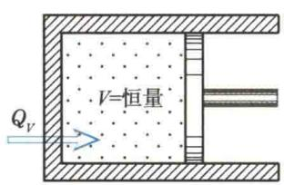
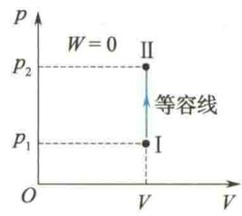
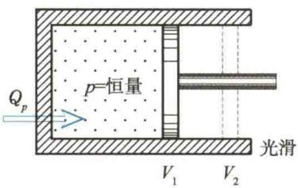
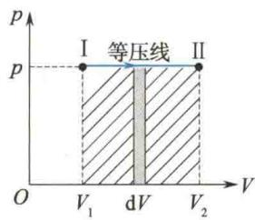
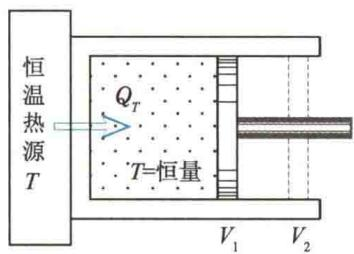
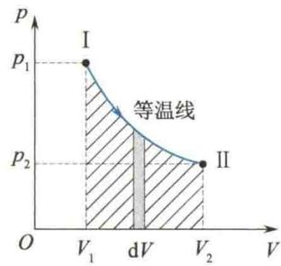

import Guide from '@/components/Guide.astro';
import Knowledge from '@/components/Knowledge.astro';
import Example from '@/components/Example.astro';
import Analysis from '@/components/Analysis.astro';
import Solution from '@/components/Solution.astro';
import Variant from '@/components/Variant.astro';
import Note from '@/components/Note.astro';
import Block from '@/components/Block.astro';
import Method from '@/components/Method.astro';
import Exercise from '@/components/Exercise.astro';

## 8.2.1 热力学第一定律

根据能量守恒定律,在系统状态变化时,系统能量的改变量等于系统与外界交换的能量.在准静态过程中,系统改变的仅为内能,而在一般情况下,系统与外界可能同时有功和热量的交换,即
或
$$
\begin{array}{r} \Delta E = Q + (- W) \\ Q = \Delta E + W \end{array}\tag{8.3}
$$
式(8.3)表示系统吸收的热量,一部分转化为系统的内能,另一部分转化为系统对外所做的功.这就是热力学第一定律的数学表达式.显然,热力学第一定律就是包括热
现象在内的能量守恒定律,适用于任何系统的任何过程.
在式(8.3)中,规定系统从外界吸热时,Q为正,向外界放热时,Q为负;系统对外界做功时,W为正,外界对系统做功时,W为负.
如果系统经历一微小变化,即所谓微过程,则热力学第一定律为
$$
\mathrm{d} Q = \mathrm{d} E + \mathrm{d} W\tag{8.4}
$$
式(8.3)与式(8.4)对准静态过程普遍成立,对非静态过程,则仅当初态和末态均为平衡态时才适用.若系统是通过体积变化来做功的,则式(8.4)与式(8.3)可以分别表示为
$$
\mathrm{d} Q = \mathrm{d} E + p \mathrm{d} V\tag{8.5}
$$
$$
Q = \Delta E + \int_ {V _ {1}} ^ {V _ {2}} p \mathrm{d} V\tag{8.6}
$$
由热力学第一定律可知,要使系统对外界做功,可以消耗系统的内能,也可以吸收外界的热量,或者两者兼有.历史上曾有人试图制造一种能对外界不断自动做功,而不需要消耗任何燃料,也不需要提供其他能量的机器,人们称这样的机器为第一类永动机.然而,由于其违反热力学第一定律而宣告失败.因此,热力学第一定律又可表述为:制造第一类永动机是不可能的.
顺便指出,根据热力学第一定律可知,既然功是过程量,那么热量也是过程量.

## 8.2.2 热力学第一定律在理想气体等值过程中的应用

### 1. 等容过程

  
热力学第一定律在理想气体等值过程中的应用
气体等容过程的特征是气体的体积保持不变, 即 V 为恒量, dV = 0.
设封闭气缸内有一定质量的理想气体, 活塞保持固定不动, 把气缸连续地与一系列有微小温差的恒温热源接触, 让气缸中的气体经历一个准静态升温过程, 气体的压强增大, 但体积不变, 如图 8.4 所示. 这就是一个准静态的等容过程.
等容过程在 p-V 图上为一条平行于 p 轴的直线段, 这条直线段叫作等容线, 如图 8.5 所示. 在理想气体等容过程中, $\frac{p}{T}$ 为恒量.

  
图8.4 气体的等容过程  
图8.5 等容过程不做功
由于等容过程 $\mathrm{d}V = 0$ ，所以系统做的功 $\mathrm{d}W = p\mathrm{d}V = 0.$ 根据热力学第一定律，过程中的能量关系有
$$
\begin{array}{r l} \mathrm{d} Q _ {V} & = \mathrm{d} E \\ Q _ {V} & = \Delta E = E _ {2} - E _ {1} \end{array}\tag{8.7}
$$
上面各式中的脚标 V 表示体积不变. 式(8.7)表明, 在等容过程中, 外界传给气体的热量全部用来增加气体的内能, 系统对外不做功.

### 2. 等压过程

等压过程的特征是系统的压强保持不变, 即 p 为恒量, dp = 0.
等压过程可以这样实现:设想一个内有一定质量理想气体的封闭气缸,与一系列恒温热源连续接触,热源的温度依次较前一个热源高,但温度相差极小.接触过程中活塞上所加外力保持不变,有微小的热量传给气体,使气体的温度升高,压强也随之较外界所施压强增加一微小量,于是推动活塞对外界做功,体积随之膨胀.体积膨胀反过来使气体的压强降低,从而保证气缸内外的压强保持不变,系统经历的就是一个准静态等压过程,如图8.6所示.
等压过程在 p-V 图上为一条平行于 V 轴的直线段, 这条直线段叫作等压线, 如图 8.7 所示. 在理想气体等压过程中, $\frac{V}{T}$ 为恒量.
  
图8.6 气体的等压过程
  
图8.7 等压过程的功
在等压过程中,由于 p 为常数,当气体的体积从 $V_{1}$ 扩大到 $V_{2}$ 时,系统对外界做的功为
$$
W _ {p} = \int_ {V _ {1}} ^ {V _ {2}} p \mathrm{d} V = p (V _ {2} - V _ {1})\tag{8.8}
$$
根据理想气体状态方程,可将上式改写为
$$
W _ {p} = p (V _ {2} - V _ {1}) = \frac {M}{M _ {\mathrm{mol}}} R (T _ {2} - T _ {1})
$$
所以，在整个等压过程中系统所吸收的热量为
$$
Q _ {p} = \Delta E + p (V _ {2} - V _ {1}) = E _ {2} - E _ {1} + \frac {M}{M _ {\mathrm{mol}}} R (T _ {2} - T _ {1})\tag{8.9}
$$
式(8.9)表明,等压过程中系统所吸收的热量,一部分用来增加系统的内能,另一部分用来对外界做功.

### 3. 等温过程

等温过程的特征是系统的温度保持不变, 即 T 为恒量, dT = 0.
设想一气缸,其四壁和活塞是绝对不导热的,而底部是绝对导热的,如图8.8所示.今将气缸底部与一恒温热源相接触,当活塞上的外界压强无限缓慢地减小时,缸内气体随之逐渐膨胀,对外界做功,气体内能缓慢减小,温度随之微微降低.此时,气体与恒温热源相接触,当气体的温度比热源的温度略低时,就有微小的热量传给气体,使气体的温度维持原值不变,气体经历一个准静态等温过程.
在理想气体等温过程中，pV 为常数，它在 p-V 图上为双曲线的一支，这条曲线称为等温线，如图 8.9 中 I → II 曲线所示。等温线把 p-V 图分为两个区域，在等温线以上的区域中，气体的温度大于 T，在等温线以下的区域中，气体的温度小于 T。
  
图8.8 等温过程
  
图8.9 等温过程的功
对于理想气体,根据其内能表达式,在等温过程中,因为 dT=0,所以 dE=0,这表明等温过程中理想气体的内能保持不变.
等温过程中理想气体做的功,在微小变化时有
$$
\mathrm{d} W _ {T} = p \mathrm{d} V
$$
及 $pV = \frac{M}{M_{\mathrm{mol}}} RT$ ，因此， $\mathrm{d}W_{T} = \frac{M}{M_{\mathrm{mol}}} RT\frac{\mathrm{d}V}{V}$ 根据热力学第一定律，过程中的热量关系为
$$
\mathrm{d} Q _ {T} = \mathrm{d} W _ {T} = \frac {M}{M _ {\mathrm{mol}}} R T \frac {\mathrm{d} V}{V}\tag{8.10}
$$
理想气体在等温过程中由体积 $V_{1}$ 膨胀到体积 $V_{2}$ 时，气体对外界做的功为
$$
\begin{array}{r l} W _ {T} & = \int_ {V _ {1}} ^ {V _ {2}} p \mathrm{d} V = \frac {M}{M _ {\mathrm{mol}}} R T \int_ {V _ {1}} ^ {V _ {2}} \frac {\mathrm{d} V}{V} \\ & = \frac {M}{M _ {\mathrm{mol}}} R T \ln \frac {V _ {2}}{V _ {1}} \end{array}\tag{8.11}
$$
由热力学第一定律,可得 $Q_{T} = W_{T}$ , 即
$$
Q _ {T} = \frac {M}{M _ {\mathrm{mol}}} R T \ln \frac {V _ {2}}{V _ {1}} = \frac {M}{M _ {\mathrm{mol}}} R T \ln \frac {p _ {1}}{p _ {2}}\tag{8.12}
$$
式(8.12)表明,在等温过程中,理想气体所吸收的热量全部用来对外界做功,系统的内能保持不变.

