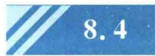

import Guide from '@/components/Guide.astro';
import Knowledge from '@/components/Knowledge.astro';
import Example from '@/components/Example.astro';
import Analysis from '@/components/Analysis.astro';
import Solution from '@/components/Solution.astro';
import Variant from '@/components/Variant.astro';
import Note from '@/components/Note.astro';
import Block from '@/components/Block.astro';
import Method from '@/components/Method.astro';
import Exercise from '@/components/Exercise.astro';

## 8.3.1 热容与摩尔热容

热容:系统在某一无限小过程中吸收的热量 dQ 与温度变化量 dT 的比值称为系统在该过程的热容(C),即

$$

C = \frac {\mathrm{d} Q}{\mathrm{d} T}\tag{8.13}

$$

它表示在该过程中, 温度升高 1 K 时系统所吸收的热量, 单位是 J/K. 单位质量的热容叫作比热容(c), 单位为 $\mathrm{J}/(\mathrm{K} \cdot \mathrm{kg})$ , 由物质和过程决定其值. 热容与比热容的关系

为 $C = Mc$ .

摩尔热容: 1 mol 物质的热容叫作摩尔热容 $(C_{\mathrm{m}})$ ，单位为 J/(mol·K). 热容与摩尔热容的关系为 $C = \frac{M}{M_{mol}} C_{m}$ ，式中，M 为物质的质量， $M_{mol}$ 为物质的摩尔质量. 比值 $\frac{M}{M_{mol}}$ 为对应的物质的量. 由定义可知，不论是热容还是比热容，均是过程量. 对于给定的系统（物质），进行的过程不同，其热容也不同. 对于理想气体，最常用的是等容过程的摩尔热容和等压过程的摩尔热容. 固体或液体也有这两种热容，但由于它们的体胀系数比气体的小得多，因膨胀而对外所做的功可以忽略不计，所以这两种热容实际差值很小，一般不予区别.

## 8.3.2 理想气体的摩尔热容

### 1. 理想气体的定容摩尔热容

1 mol气体在等容过程中吸收的热量 $dQ_{V}$ 与温度的变化量dT之比为定容摩尔热容,即

$$

C _ {V. \mathrm{m}} = \frac {\mathrm{d} Q _ {V}}{\mathrm{d} T}

$$

由等容过程知 $dQ_{V} = dE$ ，所以有

$$

C _ {V, \mathrm{m}} = \frac {\mathrm{d} E}{\mathrm{d} T}\tag{8.14}

$$

对于理想气体，有 $\mathrm{d}E = \frac{i}{2} R\mathrm{d}T$ ，代入式(8.14)，得理想气体的定容摩尔热容为

$$

C _ {V, \mathrm{m}} = \frac {i}{2} R\tag{8.15}

$$

式中，i 为分子自由度；R 为普适气体常量。因此，理想气体的定容摩尔热容只与分子自由度有关，而与气体的状态 $(p, T)$ 无关。对于单原子理想气体， $i = 3, C_{V,m} = \frac{3}{2} R$ ；对于刚性双原子气体， $i = 5, C_{V,m} = \frac{5}{2} R$ ；对于刚性多原子气体， $i = 6, C_{V,m} = 3R$ 。

依式 $(8.15)$ ，理想气体的内能表达式又可以写为

$$

E = \frac {M}{M _ {\mathrm{mol}}} C _ {V, \mathrm{m}} T\tag{8.16}

$$

### 2. 理想气体的定压摩尔热容

1 mol 气体在等压过程中吸收的热量 $dQ_{p}$ 与温度的变化量 dT 之比为定压摩尔热容, 即

$$

C _ {p, \mathrm{m}} = \frac {\mathrm{d} Q _ {p}}{\mathrm{d} T}

$$

由定压过程知 $\mathrm{d}Q_{p} = \mathrm{d}E + p\mathrm{d}V$ ，所以

$$

C _ {p, \mathrm{m}} = \frac {\mathrm{d} E}{\mathrm{d} T} + p \frac {\mathrm{d} V}{\mathrm{d} T}

$$

对于理想气体, 因为 $dE = C_{V,m}dT$ 及定压过程 $p\,dV = R\,dT$ , 所以有

$$

C _ {p, \mathrm{m}} = C _ {V, \mathrm{m}} + R\tag{8.17}

$$

式(8.17)叫作迈耶(Mayer)公式,表示1 mol理想气体的定压摩尔热容比定容摩尔热容大一个恒量R.也就是说,在等压过程中,温度升高1 K时,1 mol理想气体比在等容过程中多吸收8.31 J的热量,用来转化为膨胀时对外界做的功.

### 3. 摩尔热容比

系统的定压摩尔热容 $C_{p,m}$ 与定容摩尔热容 $C_{V,m}$ 的比值，称为系统的摩尔热容比，以 $\gamma$ 表示。工程上称它为绝热系数，即

$$

\gamma = \frac {C _ {p , \mathrm{m}}}{C _ {V , \mathrm{m}}}

$$

由于 $C_{p,\mathrm{m}} > C_{V,\mathrm{m}}$ ，所以 $\gamma > 1$

对于理想气体, $C_{p,m}=C_{V,m}+R,C_{V,m}=\frac{i}{2}R$ ,所以有

$$

\gamma = \frac {C _ {V , \mathrm{m}} + R}{C _ {V , \mathrm{m}}} = \frac {\frac {i}{2} R + R}{\frac {i}{2} R} = \frac {i + 2}{i}\tag{8.18}

$$

式(8.18)说明,理想气体的摩尔热容比,只与分子的自由度有关,而与气体的状态无关.对于单原子气体, $\gamma=\frac{5}{3}=1.67$ ;对于双原子(刚性)气体, $\gamma=\frac{7}{5}=1.40$ ;对于多原子(刚性)气体, $\gamma=\frac{8}{6}=1.33$ .

从表8.1可以看出：①各种气体的 $(C_{p,\mathrm{m}} - C_{V,\mathrm{m}})$ 值都接近于 $R$ 值；②室温下单原子及双原子气体的 $C_{p,\mathrm{m}}, C_{V,\mathrm{m}}, \gamma$ 的实验数据与理论值相近。这说明经典热容理论近似地反映了客观事实。但是，对分子结构较为复杂的气体，如三原子及以上的多原子气体，其理论值与实验数据显然不等。另外，表8.2给出了不同温度下双原子分子气体的定容摩尔热容的实验数据。由表8.2可见， $C_{V,\mathrm{m}}$ 是温度的函数而不是定值。这是因为经典理论只是近似理论，要用量子理论才能正确解决问题，在此不作深入讨论。

表 8.1 气体摩尔热容的实验数据 (室温)

<table><tr><td colspan="2">气体种类</td><td> $C_{p,m}$ / $(J·mol^{-1}·K^{-1})$ </td><td> $C_{V,m}$ / $(J·mol^{-1}·K^{-1})$ </td><td> $C_{p,m}-C_{V,m}$ / $(J·mol^{-1}·K^{-1})$ </td><td> $\gamma=\frac{C_{p,m}}{C_{V,m}}$ </td></tr><tr><td rowspan="2">单原子</td><td>氦</td><td>20.9</td><td>12.5</td><td>8.4</td><td>1.67</td></tr><tr><td>氩</td><td>21.2</td><td>12.5</td><td>8.7</td><td>1.70</td></tr><tr><td rowspan="4">双原子</td><td>氢</td><td>28.8</td><td>20.4</td><td>8.4</td><td>1.41</td></tr><tr><td>氮</td><td>28.6</td><td>20.4</td><td>8.2</td><td>1.40</td></tr><tr><td>一氧化碳</td><td>29.0</td><td>20.7</td><td>8.3</td><td>1.40</td></tr><tr><td>氧</td><td>29.4</td><td>21.0</td><td>8.4</td><td>1.40</td></tr><tr><td rowspan="4">多原子</td><td>水蒸气</td><td>36.2</td><td>27.8</td><td>8.4</td><td>1.31</td></tr><tr><td>甲烷</td><td>35.6</td><td>27.2</td><td>8.4</td><td>1.31</td></tr><tr><td>氯仿</td><td>72.0</td><td>63.7</td><td>8.3</td><td>1.13</td></tr><tr><td>乙醇</td><td>87.5</td><td>79.2</td><td>8.3</td><td>1.10</td></tr></table>

表 8.2 不同温度下双原子气体定容摩尔热容的实验数据

<table><tr><td>气体/K</td><td>273</td><td>373</td><td>473</td><td>773</td><td>1 473</td><td>2 273</td></tr><tr><td> $C_{V.m}/$  $(J \cdot mol^{-1} \cdot K^{-1})$ </td><td>20.3</td><td>20.3</td><td>21.0</td><td>22.4</td><td>24.1</td><td>26.0</td></tr></table>
