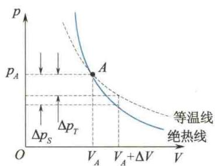
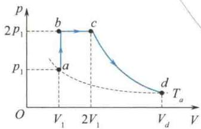
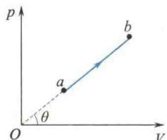

import Guide from '@/components/Guide.astro';
import Knowledge from '@/components/Knowledge.astro';
import Example from '@/components/Example.astro';
import Analysis from '@/components/Analysis.astro';
import Solution from '@/components/Solution.astro';
import Variant from '@/components/Variant.astro';
import Note from '@/components/Note.astro';
import Block from '@/components/Block.astro';
import Method from '@/components/Method.astro';
import Exercise from '@/components/Exercise.astro';

## 8.4.1 绝热过程

在系统不与外界交换热量的条件下,系统的状态变化过程叫作绝热过程.绝热过程的特征是在任意微过程中,dQ=0.一个被良好的绝热材料所包围的系统,或由于过程进行得很快,系统来不及和外界交换热量的过程,如内燃机中的爆炸过程等,都可近似地看作准静态绝热过程.

由于绝热过程 dQ = 0，所以根据热力学第一定律，系统对外界做的功为

$$

p \mathrm{d} V = - \mathrm{d} E

$$

由此可见，绝热过程中系统对外界做功是以系统内能的减少为代价的。在气体由初态（温度为 $T_{1}$ ）绝热地膨胀到末态（温度为 $T_{2}$ ）的过程中，气体对外界做的功为

$$

\int_ {V _ {1}} ^ {V _ {2}} p \mathrm{d} V = - \frac {M}{M _ {\mathrm{mol}}} C _ {V, \mathrm{m}} (T _ {2} - T _ {1})\tag{8.19}

$$

从式(8.19)可看出,当气体绝热膨胀对外界做功时,气体的内能减少,温度要降低,而压强也在减小,所以绝热过程中,气体的温度、压强、体积3个参量同时改变.可以证明(推导过程在下面讨论),对于理想气体的绝热准静态过程,在p、V、T3个参量中,每两个量之间的关系为

$$

p V ^ {\gamma} = \mathrm{恒量}\tag{8.20}

$$

$$

T V ^ {\gamma - 1} = \mathrm{恒量}\tag{8.21}

$$

$$

p ^ {\gamma - 1} T ^ {- \gamma} = \mathrm{恒量}\tag{8.22}

$$

这些方程均称为绝热过程方程,简称绝热方程.式中,指数 $\gamma$ 为理想气体的摩尔热容比 $(C_{p,\mathrm{m}}/C_{V,\mathrm{m}})$ ,这也是工程上将 $\gamma$ 称为绝热系数的原因.3个方程中的各恒量均不相同,使用时可根据实际情况选取一个公式.

在 p-V 图上的绝热曲线是根据绝热方程 $pV^{\gamma} =$ 恒量作出的. 图 8.10 中的实线为绝热线, 虚线为过 A 点的同一气体的等温线. 由图 8.10 可以看出, 通过同一点的绝热线比等温线陡, 下面对两条曲线的交点 A 处斜率的计算, 证实了这一点.

等温线: 由 pV = C (C 为常数), 两边取微分, 整理后得斜率为

  

图 8.10 绝热线比等温线陡

$$

\frac {\mathrm{d} p}{\mathrm{d} V _ {T}} = - \frac {p}{V}

$$

$A$ 处的斜率为

$$

\frac {\mathrm{d} p}{\mathrm{d} V _ {T}} = - \frac {p _ {A}}{V _ {A}}

$$

绝热线:由 $pV^{\gamma}=C$ (C 为常数),两边取微分,整理后得斜率为

$$

\frac {\mathrm{d} p}{\mathrm{d} V _ {s}} = - \gamma \frac {p}{V}

$$

$A$ 处的斜率为

$$

\frac {\mathrm{d} p}{\mathrm{d} V _ {s}} = - \gamma \frac {p _ {A}}{V _ {A}}

$$

由于 $\gamma > 1$ ，比较两式，所以绝热线比等温线陡。究其物理原因，等温过程中压强的减小量 $\Delta p_T$ ，仅是体积增大所致，而在绝热过程中压强的减小量 $\Delta p_S$ ，是由体积增大，同时温度降低两个原因所致，所以 $\Delta p_S$ 的值比 $\Delta p_T$ 的值大。

## \*8.4.2 绝热方程的推导

根据热力学第一定律及绝热过程的特征 $(\mathrm{d}Q = 0)$ ，可得

$$

p \mathrm{d} V = - \frac {M}{M _ {\mathrm{mol}}} C _ {V, \mathrm{m}} \mathrm{d} T

$$

将理想气体状态方程 $pV = \frac{M}{M_{\mathrm{mol}}} RT$ 两边取微分，得

$$

p \mathrm{d} V + V \mathrm{d} p = \frac {M}{M _ {\mathrm{mol}}} R \mathrm{d} T

$$

将上述两个方程联立并消去 $\frac{M}{M_{\mathrm{mol}}}\mathrm{d}T$ ，得

$$

(C _ {V, \mathrm{m}} + R) p \mathrm{d} V = - C _ {V, \mathrm{m}} V \mathrm{d} p

$$

因为 $C_{p,\mathrm{m}} = C_{V,\mathrm{m}} + R, \gamma = C_{p,\mathrm{m}} / C_{V,\mathrm{m}}$ ，则有

$$

\frac {\mathrm{d} p}{p} + \gamma \frac {\mathrm{d} V}{V} = 0

$$

将上式两边积分, 得

$$

\ln p + \gamma \ln V = \text { 恒量 }

$$

或

$$

p V ^ {\gamma} = \text { 恒量 }

$$

这就是绝热方程(8.20).应用 $pV=\frac{M}{M_{mol}}RT$ 和上式分别消去p或V可得

$$

T V ^ {\gamma - 1} = \mathrm{恒量}

$$

$$

p ^ {\gamma - 1} T ^ {- \gamma} = \text {恒量}

$$

<Example title="例 8.1">
1 mol 单原子理想气体，由状态 $a(p_{1}, V_{1})$ ，先等容加热至压强增大 1 倍，再等压加热至体积增大 1 倍，最后经绝热膨胀，其温度降至初始温度，如图 8.11 所示。试求：

(1) 状态 d 的体积 $V_{d}$ ;

(2) 整个过程对外界做的功；

(3) 整个过程吸收的热量.

<Solution title="解">
（1）根据理想气体状态方程 $T_{a} = \frac{p_{1} V_{1}}{R}$ ，依题意有

$$

T _ {d} = T _ {a} = \frac {p _ {1} V _ {1}}{R}, \quad T _ {c} = \frac {p _ {c} V _ {c}}{R}

$$

$$

T _ {c} = \frac {2 p _ {1} \cdot 2 V _ {1}}{R} = \frac {4 p _ {1} V _ {1}}{R} = 4 T _ {a}

$$

  

图8.11 例8.1图

c 点与 d 点在同一绝热线上，由绝热方程

$$

T _ {c} V _ {c} ^ {\gamma - 1} = T _ {d} V _ {d} ^ {\gamma - 1}

$$

(3) 计算整个过程吸收的总热量有两种方法.

$$

W = W _ {a b} + W _ {b c} + W _ {c d} = \frac {1 3}{2} p _ {1} V _ {1}

$$

整个过程对外界做的总功为

方法一:根据整个过程吸收的总热量等于各分过程吸收热量的和,先求各分过程吸收的热量,则

得

$$

Q _ {a b} = C _ {V, \mathrm{m}} (T _ {b} - T _ {a}) = \frac {3}{2} R (T _ {b} - T _ {a}) = \frac {3}{2} p _ {1} V _ {1}

$$

$$

V _ {d} = \left(\frac {T _ {c}}{T _ {d}}\right) ^ {\frac {1}{\gamma - 1}} V _ {c} = 4 ^ {\frac {1}{1 . 6 7 - 1}} \times 2 V _ {1} = 1 5. 8 V _ {1}

$$

$$

Q _ {b c} = C _ {p, \mathrm{m}} (T _ {c} - T _ {b}) = \frac {5}{2} R (T _ {c} - T _ {b})

$$

(2) 先求各分过程的功, 即

$$

W _ {a b} = 0

$$

$$

\begin{array}{r l} & W _ {b c} = 2 p _ {1} (2 V _ {1} - V _ {1}) = 2 p _ {1} V _ {1} \\ & W _ {c d} = - \Delta E _ {c d} = - C _ {V, \mathrm{m}} (T _ {d} - T _ {c}) \\ & \qquad = C _ {V, \mathrm{m}} (T _ {c} - T _ {d}) = \frac {3}{2} R (4 T _ {a} - T _ {a}) \\ & \qquad = \frac {9}{2} R T _ {a} = \frac {9}{2} p _ {1} V _ {1} \end{array}

$$

$$

\frac {5}{2} (p _ {c} V _ {c} - p _ {b} V _ {b}) = 5 p _ {1} V _ {1}

$$

$$

Q _ {c d} = 0

$$

所以

$$

Q = Q _ {a b} + Q _ {b c} + Q _ {c d} = \frac {1 3}{2} p _ {1} V _ {1}

$$

方法二：对 abcd 整个过程应用热力学第一定律，得

$$

Q _ {a b c d} = \Delta E _ {a d} + W _ {a b c d}

$$

依题意，由于 $T_{a} = T_{d}$ ，故 $\Delta E_{ad} = 0$ ，则

$$

Q _ {a b c d} = W _ {a b c d} = \frac {1 3}{2} p _ {1} V _ {1}

$$
</Solution>
</Example>

<Example title="例 8.2">
某理想气体的 p-V 关系如图 8.12 所示，由初态 a 经准静态过程（直线 ab）变到末态 b。已知该理想气体的定容摩尔热容 $C_{V,m} = 3R$ ，求该理想气体在 ab 过程中的摩尔热容。

<Solution title="解">
$a \to b$ 过程的方程为

$$

\frac {p}{V} = \tan \theta (\text { 恒量 })\tag{①}

$$

设该过程的摩尔热容为 $C_{\mathrm{m}}$ ，则对 $1\mathrm{mol}$ 理想气体，有

$$

C _ {\mathrm{m}} \mathrm{d} T = C _ {V, \mathrm{m}} \mathrm{d} T + p \mathrm{d} V

$$

$$

p V = R T\tag{②}

$$

③

由式 ① 与式 ③ 联立得 $V^{2} \tan \theta = RT$ ，两边微分，得

  

图8.12 例8.2图

$$

2 p \mathrm{d} V = R \mathrm{d} T

$$

代入式 ②, 有

$$

C _ {\mathrm{m}} \mathrm{d} T = C _ {V, \mathrm{m}} \mathrm{d} T + \frac {1}{2} R \mathrm{d} T

$$

所以

$$

C _ {\mathrm{m}} = C _ {V, \mathrm{m}} + \frac {1}{2} R = \frac {7}{2} R

$$
</Solution>
</Example>
