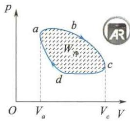
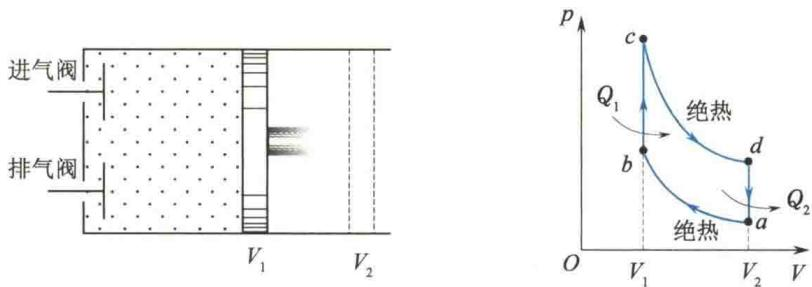
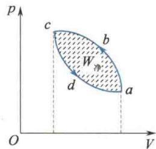
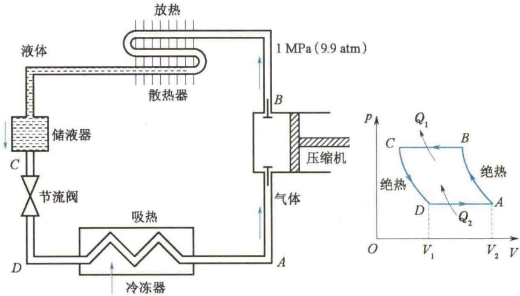
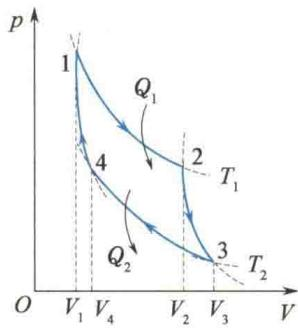
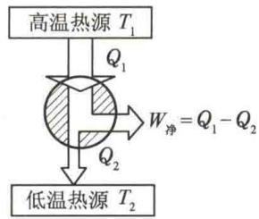
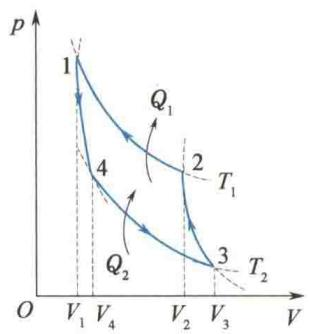
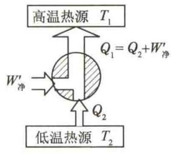

import QRCodeVideo from '@/components/QRCodeVideo.astro';

import Guide from '@/components/Guide.astro';
import Knowledge from '@/components/Knowledge.astro';
import Example from '@/components/Example.astro';
import Analysis from '@/components/Analysis.astro';
import Solution from '@/components/Solution.astro';
import Variant from '@/components/Variant.astro';
import Note from '@/components/Note.astro';
import Block from '@/components/Block.astro';
import Method from '@/components/Method.astro';
import Exercise from '@/components/Exercise.astro';

在生产技术上需要将热量与功之间的转化持续下去,这就需要利用循环过程.系统从某一状态出发,经过一系列状态变化过程以后,又回到原来出发时的状态,这样的过程叫作循环过程,简称循环.循环工作的物质叫作工作物质,简称工质.

由于工质的内能是状态的单值函数, 工质经历一个循环过程回到原始状态时, 内能没有改变, 所以循环过程的重要特征是 $\Delta E = 0$ . 若工质所经历的循环过程中各分过程都是准静态过程, 则整个过程就是准静态循环过程. 在 p - V 图上即为一条闭合曲线. 图 8.13 中的曲线 abcda 就表示了一个循环过程, 其中箭头的方向表示过程进行的方向.
<figure class="vp-figure">
  
  <figcaption>图8.13 正循环</figcaption>
</figure>
在 p-V 图上, 若循环是沿顺时针方向进行的, 则称为正循环; 若循环是沿逆时针方向进行的, 则称为逆循环.
对于正循环，如图8.13所示，在过程 $abc$ 中，工质膨胀对外界做正功，其数值等于 $abcV_{c}V_{a}a$ 所围区域的面积；在 $cda$ 过程中，系统对外界做负功，其数值等于 $cdaV_{a}V_{c}c$ 所围区域的面积。因此，在一次正循环过程中，系统对外界做的净功（或总功） $W_{\text{净}}$ ，其数值为循环过程中系统正、负功的代数和，即封闭曲线 $abcda$ 所围区域的面积。设在整个循环过程中，工质从外界吸收的热量总和为 $Q_{1}$ ，传递给外界的热量总和为 $Q_{2}$ （绝对值），则工质吸收外界的净热量为过程中工质吸热的代数和，即 $Q_{\text{净}} = (Q_{1} - Q_{2})$ 。由于一次循环过程中 $\Delta E = 0$ ，将热力学第一定律应用于一次循环，可得 $Q_{\text{净}} = W_{\text{净}}$ ，即 $Q_{1} - Q_{2} = W_{\text{净}}$ ，且 $W_{\text{净}} > 0$ 。这表示，正循环过程中的能量转换关系是将吸收的热量 $Q_{1}$ 中的一部分转化为有用功 $W_{\text{净}}$ ，将另一部分 $Q_{2}$ 传递给外界。可见，正循环是一种通过工质使热量不断转化为功的循环。

## 8.5.1 热机 热机效率

能完成正循环的装置叫作热机,或把通过工质使热量不断转化为功的机器叫作热机.例如,蒸汽机、内燃机、汽轮机等都是常用的热机.一台热机的效率,是指热机把吸收的热量中的多少转化为有用功,为此,定义热机效率为
$$
\eta = \frac {\mathrm{输出功}}{\mathrm{吸收的热量}} = \frac {W _ {\mathrm{净}}}{Q _ {1}} = 1 - \frac {Q _ {2}}{Q _ {1}}\tag{8.23}
$$
式中， $Q_{1}$ 为整个循环过程中吸收热量的总和， $Q_{2}$ 为放出热量总和的绝对值，即式中 $Q_{1}$ 、 $Q_{2}$ 均为绝对值.
热机是实现将热能转化为机械能的主要设备,汽油机和柴油机是工程上普遍使用的两种内燃机.内燃机的一种循环叫作奥托(Otto)循环,其工质为燃料与空气的混合物,利用燃料的燃烧热所产生的巨大压力而做功.图8.14为一内燃机的结构示意图和它做奥托循环的p-V图.其中,①ab为绝热压缩过程;②bc为电火花引起燃料爆炸瞬间的等容过程;③cd为绝热膨胀对外界做功过程;④da为打开排气阀瞬间的等容过程.在bc过程中,工质吸收了燃料的燃烧热 $Q_{1}$ ,在da过程中排出废气带走了热量 $Q_{2}$ .奥托循环的效率取决于气缸活塞的压缩比 $V_{2}/V_{1}$ ,具体计算见后面的例题.
<figure class="vp-figure">
  
  <figcaption>图 8.14 内燃机的结构及奥托循环</figcaption>
</figure>

## 8.5.2 制冷系数

对于逆循环,如图 8.15 中沿 abcda 进行,其最终结果是系统经一次循环内能不变,工质对外界做负功, $W_{净}<0$ (外界对工质做净功 $-W_{净}$ ),其大小等于逆循环曲线所包围的区域的面积.
设整个循环过程中工质从低温热源处吸收的热量为 $Q_{2}$ ，向高温热源处放出的热量大小为 $Q_{1}$ 。将热力学第一定律应用于整个循环过程，注意 $\Delta E = 0$ ，可得
<figure class="vp-figure">
  
  <figcaption>图8.15 逆循环</figcaption>
</figure>
或
$$
\begin{array}{r l} & Q _ {\text {净}} = Q _ {2} - Q _ {1} = W _ {\text {净}} \\ & Q _ {1} = Q _ {2} - W _ {\text {净}} = Q _ {2} + (- W _ {\text {净}}) \end{array}
$$
由此可见，逆循环过程中向高温热源放出的热量大小等于工质从低温热源处吸收的热量 $Q_{2}$ 和外界对工质做的功 $(-W_{\text{净}})$ 之和。也就是说，逆循环是在外界对工质做功的条件下，工质才能从低温热源处吸收热量，从而使低温热源的温度降低。这就是制冷机的工作原理。由于制冷机的目的是从低温热源处吸收热量，实现该目的是以外界对工质（俗称为制冷剂）做功为代价的，所以衡量制冷机的效能是外界对制冷剂做功 $(-W_{\text{净}})$ 后，能从低温热源处吸收多大的热量 $Q_{2}$ 。因此，制冷系数定义为
$$
e = \frac {\mathrm{从低温热源处吸收的热量}}{\mathrm{外界对工质做净功的大小}} = \frac {Q _ {2}}{| W _ {\mathrm{净}} |} = \frac {Q _ {2}}{Q _ {1} - Q _ {2}}\tag{8.24}
$$
式中， $Q_{1}$ 、 $Q_{2}$ 均为绝对值。显然，如果从低温热源处吸收的热量 $Q_{2}$ 越大，而外界对工质所做的功 $|W_{\text{净}}|$ 越小，则制冷系数e就越大，制冷机的制冷效率就越好。
家用电冰箱是一种制冷机(见图8.16)，压缩机将处在低温、低压下的气态制冷剂(如氨或氟利昂等)，压缩至压强为 $1\mathrm{MPa}(9.9\mathrm{atm})$ ，使其温度升到高于室温（AB绝热压缩过程）；气态制冷剂进入散热器放出热量 $Q_{1}$ ，并逐渐液化进入储液器（BC等压压缩过程），再经过节流阀膨胀降温（CD绝热膨胀过程）；最后进入冷冻器吸收电冰箱内的热量 $Q_{2}$ ，液态制冷剂汽化（DA等压膨胀过程），再度被吸入压缩机中进行下一个循环。可见，整个制冷过程就是压缩机做功，将制冷剂由气态变成液态，放出热量 $Q_{1}$ ，再将制冷剂由液态变成气态，吸收热量 $Q_{2}$ ，这样周而复始来达到制冷降温的目的。
<QRCodeVideo title="空调是如何工作的？" url="https://api.guangyiedu.com/v3/resource/resource/r/NewQrCode-xu9A1vvbU93MdmnocnJ5" />  
<figure class="vp-figure">
  
  <figcaption>图 8.16 电冰箱制冷系统逆循环</figcaption>
</figure>

<Example title="例 8.3">
内燃机的循环之一——奥托循环，如图8.14所示，试计算其热机效率.

<Solution title="解">
在奥托循环中,气体主要在等容升压过程 bc 中吸热( $Q_{1}$ ),在等容降压过程 da 中放热( $Q_{2}$ ), $Q_{1}$ 和 $Q_{2}$ 的大小分别为
$$
Q _ {1} = \frac {M}{M _ {\mathrm{mol}}} C _ {V, \mathrm{m}} (T _ {c} - T _ {b})
$$
$$
Q _ {2} = \frac {M}{M _ {\mathrm{mol}}} C _ {V, \mathrm{m}} (T _ {d} - T _ {a})
$$
所以这一循环的热机效率为
$$
\eta = 1 - \frac {Q _ {2}}{Q _ {1}} = 1 - \frac {T _ {d} - T _ {a}}{T _ {c} - T _ {b}}
$$
$$
\begin{array}{l} T _ {c} V _ {1} ^ {\gamma - 1} = T _ {d} V _ {2} ^ {\gamma - 1} \\ T _ {b} V _ {1} ^ {\gamma - 1} = T _ {a} V _ {2} ^ {\gamma - 1} \end{array}
$$
因为 cd 和 ab 均为绝热过程, 其绝热方程分别为
两式相减，得
$$
(T _ {c} - T _ {b}) V _ {1} ^ {\gamma - 1} = (T _ {d} - T _ {a}) V _ {2} ^ {\gamma - 1}
$$
即
$$
\frac {T _ {c} - T _ {b}}{T _ {d} - T _ {a}} = \left(\frac {V _ {2}}{V _ {1}}\right) ^ {\gamma - 1}
$$
于是得
$$
\eta = 1 - \frac {1}{\left(\frac {V _ {2}}{V _ {1}}\right) ^ {\gamma - 1}}
$$
令 $\varepsilon = \frac{V_2}{V_1}$ ，称为压缩比，则有
$$
\eta = 1 - \frac {1}{\varepsilon^ {\gamma - 1}}
$$
</Solution>
</Example>

由此可见，奥托循环的热机效率完全由压缩比 $\varepsilon$ 决定，并随着 $\varepsilon$ 的增大而增大，故提高压缩比是提高内燃机的热机效率的重要途径。但压缩比太高会产生爆震而使内燃机不能平稳工作，且增大磨损，因此压缩比一般取 $5\sim 7$ 设 $\varepsilon = 7,\gamma = 1.4$ ，可得热机效率为
$$
\eta = 1 - \frac {1}{7 ^ {0 . 4}} \approx 54
$$
实际上，汽油机的热机效率只有 $25\%$ 左右，柴油机的压缩比能达到 $\varepsilon = 12 \sim 20$ ，实际热机效率可达 $40\%$ 左右.由于其压缩比很大，柴油机的气缸、活塞杆等都做得很笨重，噪声也大.故小型汽车、摩托车等都装置汽油机，拖拉机等装置柴油机.
<QRCodeVideo title="卡诺热机的效率" url="https://api.guangyiedu.com/v3/resource/resource/r/NewQrCode-HTtxxcqrikK0iOEGE0eW" />  

## 8.5.3 卡诺循环

19 世纪初,蒸汽机在工业上的应用越来越广泛,但当时蒸汽机的效率很低,只有3%\~5%.因此,如何提高热机的效率,便成为当时科学家和工程师研究的重要课题.那时人们从实践中已认识到,要使热机有效地工作,必须具备至少两个温度不同的热源.那么,在两个温度一定的热源之间工作的热机所能达到的最大效率是多少呢?
1824年，年仅28岁的法国青年工程师卡诺(S.Carnot)在《论火的动力》中从理论上回答了上述问题.他提出了一种理想的热机循环：假设工质只与两个恒温热源交换热量，在温度为 $T_{1}$ 的高温热源处吸热，在温度为 $T_{2}$ 的低温热源处放热，并假定所有过程都是准静态的.由于过程是准静态的，所以工质与两个恒温热源交换热量的过程必定是等温过程，又因为只与两个恒温热源交换热量，所以工质从热源温度 $T_{1}$ 变到冷源温度 $T_{2}$ ，或者相反的过程，只能是绝热过程.因此，这种由两个准静态等温过程和两个准静态绝热过程组成的循环，就称为卡诺循环.完成卡诺正循环的热机叫作卡诺热机，卡诺热机的工质可以是固体、液体或气体.
下面分析以理想气体为工质的卡诺正循环，并求出其效率。卡诺循环在 p-V 图上是分别由温度为 $T_{1}$ 和 $T_{2}$ 的两条等温线和两条绝热线组成的封闭曲线，如图 8.17 所示，其各个分过程如下（图 8.18 所示为卡诺热机能流示意图）。
<figure class="vp-figure">
  
  <figcaption>图 8.17 卡诺正循环</figcaption>
</figure>
<figure class="vp-figure">
  
  <figcaption>图 8.18 卡诺热机能流示意图</figcaption>
</figure>
$1 \rightarrow 2$ : 气体和温度为 $T_{1}$ 的高温热源接触做等温膨胀, 体积由 $V_{1}$ 增大到 $V_{2}$ , 它从高温热源处吸收的热量为
$$
Q _ {1} = \frac {M}{M _ {\mathrm{mol}}} R T _ {1} \ln \frac {V _ {2}}{V _ {1}}
$$
$2 \rightarrow 3$ : 气体和高温热源分开, 做绝热膨胀, 温度降到 $T_{2}$ , 体积增大到 $V_{3}$ , 过程中无热量交换, 但气体对外界做功.
$3 \rightarrow 4$ : 气体和低温热源接触做等温压缩, 体积缩小到一适当值, 使状态 4 和状态 1 位于同一条绝热线上. 过程中外界对气体做功, 气体向温度为 $T_{2}$ 的低温热源放热, 放出的热量 $Q_{2}$ 的大小为
$$
Q _ {2} = \frac {M}{M _ {\mathrm{mol}}} R T _ {2} \ln \frac {V _ {3}}{V _ {4}}
$$
$4 \rightarrow 1$ : 气体和低温热源分开, 经绝热压缩, 回到状态 1, 完成一次循环. 过程中无热量交换, 但外界对气体做功.
根据热机效率的定义,可得以理想气体为工质的卡诺循环的效率为
$$
\eta_ {\mathrm{卡}} = 1 - \frac {Q _ {2}}{Q _ {1}} = 1 - \frac {T _ {2} \ln \frac {V _ {3}}{V _ {4}}}{T _ {1} \ln \frac {V _ {2}}{V _ {1}}}
$$
对绝热过程 $2 \rightarrow 3$ 和 $4 \rightarrow 1$ 分别应用绝热方程, 有
<QRCodeVideo title="我国绿色能源利用" url="https://api.guangyiedu.com/v3/resource/resource/r/NewQrCode-iwdJjXQiUarQmeTQs0ln" />  
$$
\begin{array}{r l} & T _ {1} V _ {2} ^ {\gamma - 1} = T _ {2} V _ {3} ^ {\gamma - 1} \\ & T _ {1} V _ {1} ^ {\gamma - 1} = T _ {2} V _ {4} ^ {\gamma - 1} \end{array}
$$
两式相比，则有
$$
\frac {V _ {2}}{V _ {1}} = \frac {V _ {3}}{V _ {4}}
$$
代入卡诺循环的效率公式后,可得
$$
\eta_ {\mathrm{卡}} = 1 - \frac {T _ {2}}{T _ {1}} = \frac {T _ {1} - T _ {2}}{T _ {1}}\tag{8.25}
$$
综上可知：
（1）要完成一次卡诺循环必须有温度一定的高温和低温两个热源（也称为温度一定的热源和冷源）；
(2) 卡诺循环的效率只与两个热源的温度有关, 高温热源的温度越高, 低温热源的温度越低, 卡诺循环的效率越高;
（3）由于不能实现 $T_{1}=\infty$ 或 $T_{2}=0$ （热力学第三定律），因此卡诺循环的效率总是小于 1；
（4）可以证明，在相同的高温热源和低温热源之间工作的一切热机中，卡诺热机的效率最高.
若卡诺循环按逆时针方向进行,则构成卡诺制冷机.其 p-V 图和能量转换关系如图 8.19 所示,气体和低温热源接触,从低温热源处吸收的热量为
$$
Q _ {2} = \frac {M}{M _ {\mathrm{mol}}} R T _ {2} \ln \frac {V _ {3}}{V _ {4}}
$$
  
(a) 卡诺逆循环
  
(b) 卡诺制冷机能流示意图  
图 8.19 卡诺制冷机
气体向高温热源放出的热量大小为
$$
Q _ {1} = \frac {M}{M _ {\mathrm{mol}}} R T _ {1} \ln \frac {V _ {2}}{V _ {1}}
$$
一次循环中外界做的净功为
$$
W _ {\mathrm{净}} ^ {\prime} = Q _ {1} - Q _ {2}
$$
所以卡诺制冷机的制冷系数为
$$
e _ {\mathrm{卡}} = \frac {Q _ {2}}{W _ {\mathrm{净}} ^ {\prime}} = \frac {\frac {M}{M _ {\mathrm{mol}}} R T _ {2} \ln \frac {V _ {3}}{V _ {4}}}{\frac {M}{M _ {\mathrm{mol}}} R T _ {1} \ln \frac {V _ {2}}{V _ {1}} - \frac {M}{M _ {\mathrm{mol}}} R T _ {2} \ln \frac {V _ {3}}{V _ {4}}}
$$
同理，利用关系式 $\frac{V_2}{V_1} = \frac{V_3}{V_4}$ 将其代入上式后，可得
$$
e _ {\mathrm{卡}} = \frac {T _ {2}}{T _ {1} - T _ {2}}\tag{8.26}
$$
可见，卡诺制冷机的制冷系数也只与两个热源的温度有关。与热机效率不同的是，高温热源的温度越高，低温热源的温度越低，制冷系数越小，意味着从温度越低的冷源中吸收相同的热量 $Q_{2}$ ，外界需要做更多的功 $W_{净}^{\prime}$ 。制冷系数可以大于1，如一台制冷输入功率为830W，制冷量为2300W的空调，其制冷系数约为2.77。

<Example title="例 8.4">
一卡诺制冷机从温度为 $-10^{\circ}\mathrm{C}$ 的冷库中吸收热量，向温度为 $27^{\circ}\mathrm{C}$ 的室外空气中释放热量，若制冷机消耗的功率是 $1.5\mathrm{kW}$ ，求：(1) 制冷机每分钟从冷库中吸收的热量；(2) 制冷机每分钟向室外空气中释放的热量。

<Solution title="解">
（1）根据卡诺制冷系数，有
$$
e _ {\mathrm{卡}} = \frac {T _ {2}}{T _ {1} - T _ {2}} = \frac {2 6 3 . 1 5}{3 0 0 . 1 5 - 2 6 3 . 1 5} = 7. 1
$$
(2) 制冷机每分钟向室外空气中释放的热量为
所以，制冷机每分钟从冷库中吸收的热量为
$$
\begin{array}{r l} { Q _ {1}} & {= W _ {\mathrm{净}} ^ {\prime} + Q _ {2}} \\ & {= 1. 5 \times 1 0 ^ {3} \times 6 0 \mathrm{J} + 6. 3 9 \times 1 0 ^ {5} \mathrm{J}} \\ & {= 7. 2 9 \times 1 0 ^ {5} \mathrm{J}} \end{array}
$$
$$
\begin{array}{r l} {Q _ {2}} & {= e _ {\mathrm{卡}} W _ {\mathrm{净}} ^ {\prime} = 7. 1 \times 1. 5 \times 1 0 ^ {3} \times 6 0 \mathrm{J}} \\ & {= 6. 3 9 \times 1 0 ^ {5} \mathrm{J}} \end{array}
$$
根据制冷机的制冷原理制成的供热机叫作热泵. 在严寒的冬天, 把空调的冷冻器放在室外, 将散热器放在室内, 开动空调, 经电力做功, 通过冷冻器从室外吸收热量, 通过散热器向室内放热达到供热取暖的目的. 热泵供热获得的热量大于消耗的电功, 例 8.4 中消耗的电功为
$$
W _ {\mathrm{净}} ^ {\prime} = 1. 5 \times 1 0 ^ {3} \times 6 0 \mathrm{J} = 9. 0 \times 1 0 ^ {4} \mathrm{J}
$$
提供的热量为
$$
Q _ {1} = 7. 2 9 \times 1 0 ^ {5} \mathrm{J}
$$
$Q_{1}>W_{净}^{\prime}$ ，这是最经济的供热方式。在酷热的夏天，只需将冷冻器与散热器的位置互换，经空调做功，吸收室内热量，向室外释放热量，即达到室内降温的目的。可见，制冷机可以制冷，也可以供热，供热时即为热泵。
</Solution>
</Example>
