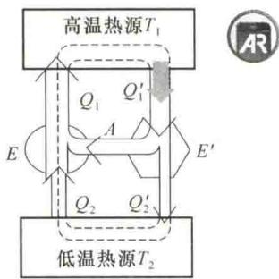
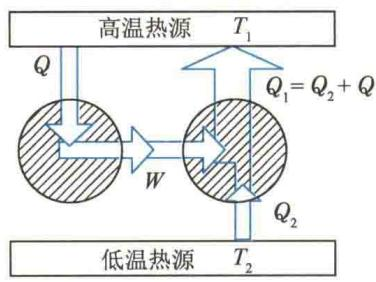
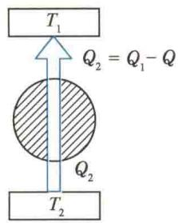
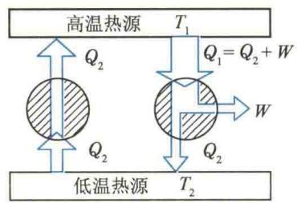
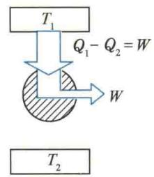

import Guide from '@/components/Guide.astro';
import Knowledge from '@/components/Knowledge.astro';
import Example from '@/components/Example.astro';
import Analysis from '@/components/Analysis.astro';
import Solution from '@/components/Solution.astro';
import Variant from '@/components/Variant.astro';
import Note from '@/components/Note.astro';
import Block from '@/components/Block.astro';
import Method from '@/components/Method.astro';
import Exercise from '@/components/Exercise.astro';

热力学第一定律指出了热力学过程中的能量守恒关系. 然而, 人们在研究热机的工作原理时发现, 满足能量守恒的热力学过程不一定都能进行. 实际的热力学过程都只能按一定的方向进行, 而热力学第一定律并没有阐述系统变化进行的方向. 热力学第二定律就是关于自然过程方向性的规律.

## 8.6.1 开尔文表述

热力学第一定律表明违背能量守恒定律的第一类永动机不可能制成,那么如何在不违背热力学第一定律的条件下，尽可能地提高热机效率呢？分析热机效率公式 $\eta = 1 - \frac{Q_2}{Q_1}$ ，显然，如果向低温热源放出的热量 $Q_{2}$ 越少，效率 $\eta$ 就越大，当 $Q_{2} = 0$ 时，即不需要低温热源，只存在一个单一温度的热源，其效率就可以达到 $100\%$ 。这就是说，如果在一个循环中，只从单一热源吸收热量使之全部变为功（这不违反能量守恒定律），热机效率就可达到 $100\%$ ，这个结论是非常引人注目的。有人曾作过估算，如果这种单一热源的热机可以实现，则只要使海水的温度降低 $0.01\mathrm{K}$ ，就能使全世界所有机器工作1000多年！

然而长期实践表明,循环效率达100%的热机是无法制成的.在这个基础上,开尔文在1851年提出了一条重要规律,称为热力学第二定律.这一定律表述为:不可能制成一种循环动作的热机,它只从单一热源吸收热量,并使其全部变为有用功,而不引起其他变化.这就是热力学第二定律的开尔文表述.
在开尔文表述中，“循环动作”“单一热源”“不引起其他变化”是三个关键条件。理想气体在等温膨胀过程中固然能把吸收的热量完全变为功，但它不是循环动作的热机，而且又产生了其他变化（如
  
热力学第二定律
气体膨胀、活塞位置变动), 并未回到初始状态. 如果热源系统内部的温度不均, 有高、低温部分, 就有放热出现, 这与放热为零的要求不符, 且相当于多个热源.
从单一热源吸热并将其全部变为功的热机通常称为第二类永动机,所以热力学第二定律亦可表述为:第二类永动机是不可能实现的.
根据热力学第二定律的开尔文表述,各个工作热机必然会排出余热,并随之排出废水、废气,形成所谓的热污染,这给环境带来威胁.因此,在热力学第二定律允许的范围内提高热机效率,减少热机释放的余热,不仅能使有限的能源得到更充分的利用,而且对环保也具有重大的意义.目前,热机的效率只能达到近50%(见表8.3),与热力学第二定律规定的极限相差甚远.为此,在热能工程领域工作的现代科技人员,仍十分关注提高热机效率的问题,并因此形成一门独立的学科分支——热力经济学.
表 8.3 几种热机的效率
<table><tr><td>热机</td><td>效率</td></tr><tr><td>液流涡轮机</td><td>48%</td></tr><tr><td>蒸汽涡轮机</td><td>46%</td></tr><tr><td>内燃机</td><td>37%</td></tr><tr><td>蒸汽机</td><td>8%</td></tr></table>

## 8.6.2 克劳修斯表述

开尔文表述从正循环的热机效率极限问题出发,总结出热力学第二定律.还可以从逆循环制冷机角度分析制冷系数的极限,从而得出热力学第二定律的另一种等价表述. 由制冷系数 $e = \frac{Q_2}{|W_{\text{净}}|}$ 可以看出, 在 $Q_2$ 一定的情况下, 外界对系统做的功越少, 制冷系数越高. 取极限情况 $W_{\text{净}} \to 0, e \to \infty$ , 即外界不对系统做功, 热量可以不断地从低温热源传到高温热源, 这是否可行呢? 1850 年, 德国物理学家克劳修斯在总结前人大量观察和实验的基础上提出: 热量不可能自动地由低温物体传向高温物体. 这就是热力学第二定律的克劳修斯表述. 在克劳修斯表述中, “自动地” 是一个关键词, 意思是, 不需消耗外界的能量, 热量可直接从低温物体传向高温物体. 但这是不可能的, 制冷机是通过外力做功才迫使热量从低温物体传向高温物体的.
热力学第二定律的这两种表述,表面上看来各自独立,但由于其内在实质的同一性,所以这两种表述是等价的.可以采用反证法来证实,即如果这两种表述之一不成立,则另一表述亦不成立.
先证违反开尔文表述,必然违反克劳修斯表述.假如开尔文表述不对,即可以从单一热源吸收热量Q并把它完全变为功W,而不引起其他变化,则可用这个功去推动一台制冷机,现在把违反开尔文表述的机器与一台制冷机组成复合机,其最终效果是不需要消耗任何外界的功,热量 $Q_{2}$ 自动地由低温热源传向高温热源,由此可知,克劳修斯表述也不对,如图8.20所示.即违反开尔文表述,必然违反克劳修斯表述.
<figure class="vp-figure">
  

    

      
      (a) 违反开尔文表述的机器+制冷机
    

    

      
      (b) 违反克劳修斯表述的机器
    

  

  <figcaption>图 8.20 违反开尔文表述, 必然违反克劳修斯表述</figcaption>
</figure>
再证违反克劳修斯表述,必然违反开尔文表述.假如克劳修斯表述不对,即热量能自动地由低温热源传向高温热源,而不引起其他变化.我们把违反克劳修斯表述的机器与一台热机组成复合机,并让热机放给低温热源的热量自动传回高温热源,则最终效果为从单一高温热源吸收的热量 $Q_{1}-Q_{2}$ 完全变为功W,而不引起其他变化,即开尔文表述也不对,如图8.21所示.这就是说违反克劳修斯表述,也必然违反开尔文表述.
<figure class="vp-figure">
  

    

      
      (a) 违反克劳修斯表述的机器+热机
    

    

      
      (b) 违反开尔文表述的机器
    

  

  <figcaption>图 8.21 违反克劳修斯表述, 必然违反开尔文表述</figcaption>
</figure>
至此,我们证明了热力学第二定律的两种表述是等价的.

## 8.6.3 自然过程的方向性

在一个不受外界影响的孤立系统内自动进行的过程叫作自然过程. 热力学第二定律表明与热现象有关的宏观自然过程都按一定的方向进行.
开尔文表述指出，在不引起其他变化或不产生其他影响的情况下，不可能把吸收的热量全部变为有用功，但是与其相反的过程，即功全部变为热能是完全可能发生的。例如，单摆在摆动过程中，由于空气阻力及悬点处摩擦力的作用，振幅逐渐减小，直到静止，过程中功转变为热量，机械能全部转化为内能，功变热是自动进行的。但这种能量形式的逆向转换，即热变功却不会自动发生，虽然逆向转换不违反热力学第一定律。这说明功热转换的过程是有方向性的。
当两个温度不同的物体相互接触时,热量总是自动地从高温物体传到低温物体,不会自动地从低温物体传到高温物体,而使高温物体的温度越来越高,低温物体的温度越来越低,尽管热量从低温物体传到高温物体的过程也不违反热力学第一定律.这个事实说明热传导过程也具有方向性,这与克劳修斯表述一致.
将盛有气体的绝热容器与一真空绝热容器接通时，气体会自动地向真空中膨胀，但是已经膨胀到真空中的气体，不会自动退回到膨胀前的容器中，气体向真空中绝热自由膨胀的过程是自然过程，而与其相反的过程不能自动进行。
关于自然过程具有方向性的例子还有很多,如将两种不同气体注入一个容器里,它们能自发地混合,却不能自发地再度分离成两种气体;将一滴墨水滴入水中,墨水会自动进行扩散,直至达到均匀分布,而已经分布均匀的墨水,不会自动地收缩到它扩散前的状态;等等.
上面所举各例的共同特点是:系统可以从某一初态自动地过渡到某一末态,但其逆过程不能自动进行.

## 8.6.4 可逆过程与不可逆过程

为了分析过程的方向性,进一步从理论上研究热力学过程的规律,需引入可逆过程与不可逆过程的概念.
设一个系统,由某一状态出发,经过一过程达到另一状态,如果存在一个逆过程,该逆过程能使系统和外界同时完全复原(即系统回到原来的状态,同时消除了原来的过程对外界引起的一切影响),则原来的过程称为可逆过程;反之,如果逆过程不具有上述性质,也就是用任何方法都不可能使系统和外界同时完全复原,则原来的过程称为不可逆过程.
通过分析自然界中各种不可逆过程,人们发现,不可逆过程产生的原因是:①系统内部出现了非平衡因素,如有限的压强差、有限的密度差、有限的温度差等,使平衡态遭到破坏;②存在耗散效应,如摩擦、黏性、非弹性、电阻等.因此,若一个过程是可逆过程,它必须具有下面的两个特征:一是过程中不出现非平衡因素,即过程必须是准静态的无限缓慢的过程,以保证每一中间状态均是平衡态;二是过程中无耗散效应.可逆的热力学过程是对准静态过程的进一步理想化,是一种理想模型.尽管如此,仍有研究可逆过程的必要.因为实际过程在一定条件下可以近似地作为可逆过程;同时,还可以通过对可逆过程的研究来寻找实际过程的规律.

过程的不可逆性就是过程进行具有方向性. 热力学第二定律的开尔文表述是关于功热转换的不可逆性, 克劳修斯表述是关于热传递的不可逆性. 大量事实表明, 与热现象有关的实际宏观过程都是不可逆的. 这是由于自然界中与热现象有关的实际宏观过程都涉及功热转换或热传导, 系统由非平衡态向平衡态转化时, 实际上存在各种差异和耗散, 无论用何种方法, 都不可能使系统和外界同时回到原来的状态.
各种不可逆过程都是互相联系的.前面证明了开尔文表述和克劳修斯表述是等价的,这表明功热转换的不可逆性与热传递的不可逆性是互相联系的.事实上,所有不可逆过程都是互相联系的.如果一种不可逆过程存在(或消失),可以证明,另一种不可逆过程也存在(或消失),总可由一种过程的不可逆性推断另一种过程的不可逆性.由于不可逆过程多种多样,相互依存,因此热力学第二定律可以有各种不同的表述,但不管其具体表述如何,其实质在于指出,一切与热现象有关的实际宏观过程都是不可逆的.热力学第二定律揭示了实际宏观热力学过程进行的条件和方向.
