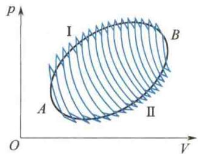
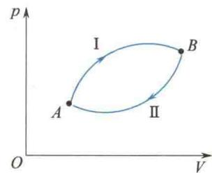
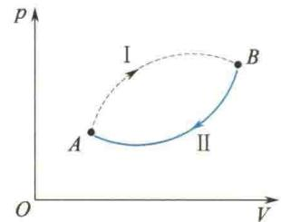
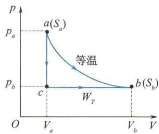
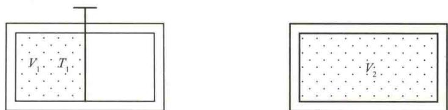
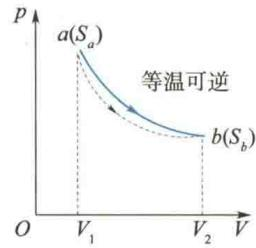

import Guide from '@/components/Guide.astro';
import Knowledge from '@/components/Knowledge.astro';
import Example from '@/components/Example.astro';
import Analysis from '@/components/Analysis.astro';
import Solution from '@/components/Solution.astro';
import Variant from '@/components/Variant.astro';
import Note from '@/components/Note.astro';
import Block from '@/components/Block.astro';
import Method from '@/components/Method.astro';
import Exercise from '@/components/Exercise.astro';

实际热力学过程的不可逆性说明自发进行的过程都将使系统的状态发生显著变化,以致系统无法通过自身的力量回到初始状态;要使系统复原,必须依靠外界的作用,但这时又给外界造成无法消除的影响.这表明不可逆过程的初态和末态之间存在着重大差异,正是这种差异决定了过程的方向.能不能找到一个描述这种差异的态函数,并根据其大小来判断过程的方向呢?克劳修斯首先通过卡诺定理找到了这个态函数,并于1865年将其定名为entropy,中文译作“熵”.

## 8.7.1 卡诺定理

若组成循环的每一个过程都是可逆过程,则称该循环为可逆循环.做可逆循环的热机或制冷机分别称为可逆热机或可逆制冷机,否则称为不可逆机.

为了提高热机效率,卡诺从理论上进行了研究,提出了热机理论中非常重要的卡诺定理,它的具体内容是:

（1）在相同的高温热源和相同的低温热源之间工作的一切可逆热机，其效率都相等，与工作物质无关；

（2）在相同的高温热源和相同的低温热源之间工作的一切不可逆热机，其效率都不可能大于可逆热机的效率.

由内容(1)可知,对工作在高、低温热源 $T_{1}$ 与 $T_{2}$ 之间的可逆热机,有

$$

\eta_ {\mathrm{可逆}} = 1 - \frac {Q _ {2}}{Q _ {1}} = 1 - \frac {T _ {2}}{T _ {1}}

$$

由内容(2)可知,对不可逆热机,有

$$

\eta_ {\mathrm{不可逆}} = 1 - \frac {Q _ {2}}{Q _ {1}} <   1 - \frac {T _ {2}}{T _ {1}}

$$

顺便指出，由卡诺定理可知，若要提高热机效率，则应该提高高温热源的温度，降低低温热源的温度（如果要获取低于室温的低温热源，就必须用制冷机，但这是不经济的，所以实用上，只有从提高高温热源的温度着手。例如，蒸汽机锅炉的温度约为 $320^{\circ}\mathrm{C}$ ，内燃机汽油爆炸时的温度约为 $1530^{\circ}\mathrm{C}$ ）。

## 8.7.2 克劳修斯不等式

克劳修斯对卡诺定理进行推广,将其应用于一个任意的循环过程,得到一个能分别描述可逆循环和不可逆循环特征的表达式,叫作克劳修斯不等式.

由卡诺定理可知，工作于高、低温热源 $T_{1}$ 与 $T_{2}$ 之间的热机效率为

$$

\eta \leqslant 1 - \frac {T _ {2}}{T _ {1}}

$$

无论循环是否可逆,其效率均为

$$

\eta = 1 - \frac {Q _ {2}}{Q _ {1}}

$$

代入上式,可得

$$

1 - \frac {Q _ {2}}{Q _ {1}} \leqslant 1 - \frac {T _ {2}}{T _ {1}}

$$

显然有

$$

\frac {Q _ {2}}{T _ {2}} \geqslant \frac {Q _ {1}}{T _ {1}} \quad \text {或} \quad \frac {Q _ {1}}{T _ {1}} - \frac {Q _ {2}}{T _ {2}} \leqslant 0

$$

式中， $Q_{1}$ 、 $Q_{2}$ 都是正的，是工作物质所吸收和放出热量的绝对值。如果采用热力学第一定律中对热量正、负的规定，则上式应改写为

$$

\frac {Q _ {1}}{T _ {1}} + \frac {Q _ {2}}{T _ {2}} \leqslant 0\tag{8.27}

$$

式中，热量 $Q_{1}$ 和 $Q_{2}$ 均为代数值； $\frac{Q}{T}$ 称为热温比或热温商，它是系统从某一热源吸收的热量 Q 和该热源的温度 T 之比。式(8.27) 表示，在卡诺循环中，系统热温比的总和总是小于或等于零。

如图 8.22 所示, 任意一个循环过程均可看成由一系列微小卡诺循环组成, 当每一个卡诺循环趋于无穷小时, 由无数条等温线和绝热线组成的折线, 就趋于循环曲线. 如果 A I BⅡA 是可逆循环, 则所有微小卡诺循环均为可逆卡诺循环, 即 A I BⅡA 循环可等价于所有微小卡诺循环的叠加 (相邻两个卡诺循环中的绝热线都沿相反方向各经历一次, 因而相互抵消). 因为对于每一个卡诺循环, 式(8.27)总是成立的, 所以对于任意循环 A I BⅡA, 应有

  

图8.22 任意一个循环过程均可看成由一系列微小卡诺循环组成

$$

\sum_ {i = 1} ^ {n} \frac {Q _ {i}}{T _ {i}} \leqslant 0

$$

式中， $Q_{i}$ 为系统从温度为 $T_{i}$ 的热源吸收的热量（代数值），n 为热源的个数。当 $n \to \infty$ 时，每个卡诺循环趋于无穷小，上式用积分表示，即

$$

\oint \frac {\mathrm{d} Q}{T} \leqslant 0\tag{8.28}

$$

式中， $\oint$ 表示沿循环曲线积分一周；dQ为系统从温度为T的热源吸收的热量（代数值）；等号对应于可逆循环，不等号对应于不可逆循环。式(8.28)称为克劳修斯不等式。因此，系统经历一个可逆循环过程，它的热温比总和等于零；系统经历一个不可逆循环过程，它的热温比总和小于零。显然，式(8.28)就是循环的可逆性和不可逆性的判别式。

## 8.7.3 克劳修斯熵

克劳修斯不等式指出了可逆过程和不可逆过程的特点,对于任意一个可逆循环过程,由式(8.28),可知

$$

\oint_ {\mathrm{可逆}} \frac {\mathrm{d} Q}{T} = 0\tag{8.29}

$$

设系统由平衡态 $A$ 经可逆过程 $A \mid B$ 变到平衡态 $B$ ，又由状态 $B$ 沿任意可逆过程 $B \mid A$ 回到原状态 $A$ ，构成一个可逆循环，如图8.23所示。对此可逆循环，式(8.29)可写成

$$

\int_ {A \mid B} \frac {\mathrm{d} Q _ {\mathrm{可逆}}}{T} + \int_ {B \amalg A} \frac {\mathrm{d} Q _ {\mathrm{可逆}}}{T} = 0

$$

  

图8.23 熵

由于过程是可逆的,则有

即

$$

\begin{array}{r l} & {\int_ {A \mathrm{I} B} \frac {\mathrm{d} Q _ {\text {可逆}}}{T} + \int_ {B \mathrm{II} A} \frac {\mathrm{d} Q _ {\text {可逆}}}{T} = \int_ {A \mathrm{I} B} \frac {\mathrm{d} Q _ {\text {可逆}}}{T} - \int_ {A \mathrm{II} B} \frac {\mathrm{d} Q _ {\text {可逆}}}{T} = 0} \\ & {\qquad \qquad \qquad \qquad \qquad \qquad \qquad \qquad \qquad \qquad \qquad \qquad \qquad \qquad \qquad \qquad \qquad \qquad \qquad \qquad \qquad \qquad \qquad \qquad \qquad \qquad \qquad \qquad \qquad \qquad \qquad \qquad \qquad \qquad \pmb {0}} \\ & {\qquad \qquad \qquad \qquad \qquad \qquad \qquad \qquad \qquad \qquad \qquad \qquad \pmb {0}} \\ & {\qquad \qquad \qquad \qquad \qquad \qquad \qquad \qquad \pmb {0}} \\ & {\qquad \qquad \pmb {0}} \\ & {\qquad \pmb {0}} \\ & {\pmb {0}} \\ & {\pmb {0}} \\ & {\pmb {0}} \\ & {\pmb {0}} \\ & {\pmb {0}} \\ & {\pmb {0}} \\ & {\pmb {0}} \\ & {\pmb {0}} \\ & {\pmb {0}} \\ & {\pmb {0}} \\ & {\pmb {0}} \\ & {\pmb {0}} \\ & {\pmb {1}} \\ & {\pmb {1}} \\ & {\pmb {1}} \\ & {\pmb {1}} \\ & {\pmb {1}} \\ & {\pmb {1}} \\ & {\pmb {1}} \\ & {\pmb {1}} \\ & {\pmb {1}} \\ & {\pmb {1}} \\ & {\pmb {1}} \\ & {\pmb {1}} \\ & {\pmb {1}} \\ & {(\mathrm{I})} \\ & {\mathrm{I}} \\ & {\mathrm{I}} \\ & {\mathrm{I}} \\ & {\mathrm{I}} \\ & {\mathrm{I}} \\ & {\mathrm{I}} \\ & {\mathrm{I}} \\ & {\mathrm{I}} \\ & {\mathrm{I}} \\ & {\mathrm{I}} \\ & {\mathrm{I}} \\ & {\mathrm{I}} \\ & {\mathrm{I}} \\ & {\mathrm{I}} \\ & {\mathrm{I}} \\ {{\mathrm{I}}} \\ {{\mathrm{I}}} \\ {{\mathrm{I}}} \\ {{\mathrm{I}}} \\ {{\mathrm{I}}} \\ {{\mathrm{I}}} \\ {{\mathrm{I}}} \\ {{\mathrm{I}}} \\ {{\mathrm{I}}} \\ {{\mathrm{I}}} \\ {{\mathrm{I}}} \\ {{\mathrm{I}}} \\ {{\mathrm{I}}} \\ {{\mathrm{I}}} \\ {{\mathrm{I}}} \\ {{{\mathrm{I}}}} \\ {{\mathrm{I}}} \\ {{\mathrm{I}}} \\ {{\mathrm{I}}} \\ {{\mathrm{I}}} \\ {{\mathrm{I}}} \\ {{\mathrm{I}}} \\ {{\mathrm{I}}} \\ {{\mathrm{I}}} \\ {{\mathrm{I}}} \\ {{\mathrm{I}}} \\ {{\mathrm{I}}} \\ {{\mathrm{I}}} \\ {{\mathrm{I}}} \\ {{\mathrm{I}}} \end{array}\tag{8.30}

$$

由式(8.30)可见,由状态A沿不同的可逆过程变到同一状态B的热温比的积分值 $\int_{A}^{B}\frac{dQ_{可逆}}{T}$ 不变.这就是说,热温比的积分只取决于初、末状态,与过程无关.在力学中,保守力做功只取决于初、末位置而与其通过的具体路径无关,从而引入势能这一态函数.在热力学中,系统完成一个循环回到原来的平衡态时,内能的变化量为零,即 $\oint dE=0$ ,说明内能变化只与初、末状态有关,与过程无关,所以内能E是热力学平衡态的一个态函数.现在, $\oint_{可逆}\frac{dQ}{T}=0$ ,具有与上面相同的性质,这意味着热力学系统的平衡态还存在一个与内能不同的态函数,我们称这个新的态函数为克劳修斯熵,用符号S表示.当系统由平衡态A变到平衡态B时,这个态函数就从 $S_{A}$ 变到 $S_{B}$ ,即

$$

S _ {B} - S _ {A} = \int_ {A} ^ {B} \mathrm{d} S = \int_ {A} ^ {B} \frac {\mathrm{d} Q _ {\mathrm{可逆}}}{T}\tag{8.31}

$$

对于一个微小的可逆过程,有

$$

\mathrm{d} S = \frac {\mathrm{d} Q _ {\mathrm{可逆}}}{T}\tag{8.32}

$$

式(8.32)表明,在可逆过程中,系统熵的微小变化等于这一微过程的“热温之商”,这也是新的态函数取名为熵的缘由.

由上面的讨论可知:①熵是热力学系统的态函数;②某一状态的熵值只有相对意义,与熵的零点选择有关;③如果过程的始末两态均为平衡态,则系统的熵变只取决于始态和末态,与过程是否可逆无关.因此,当始末两态间经历一不可逆过程时,可以设计一个可逆过程将始末两态连接起来,然后沿此可逆过程用式(8.31)计算熵变;④熵值具有可加性,因此大系统的熵变等于组成它的各子系统的熵变之和,全过程的熵变等于组成它的各子过程的熵变之和.

## 8.7.4 熵增加原理

引入态函数熵 S 后, 热力学第二定律就可以用熵增加原理来描述.

设 $A \mid B$ 是不可逆过程, $B \parallel A$ 是可逆过程, 这两个过程构成一不可逆循环, 如图 8.24 所示. 根据克劳修斯不等式 $\oint \frac{\mathrm{d}Q}{T} < 0$ , 有

$$

\oint \frac {\mathrm{d} Q}{T} = \int_ {A} ^ {B} \frac {\mathrm{d} Q _ {\mathrm{I}}}{T} + \int_ {B} ^ {A} \frac {\mathrm{d} Q _ {\mathrm{II}}}{T} = \int_ {A} ^ {B} \frac {\mathrm{d} Q _ {\mathrm{I}}}{T} - \int_ {A} ^ {B} \frac {\mathrm{d} Q _ {\mathrm{II}}}{T} <   0

$$

$$

\int_ {A} ^ {B} \frac {\mathrm{d} Q _ {\mathrm{I}}}{T} <   \int_ {A} ^ {B} \frac {\mathrm{d} Q _ {\mathrm{II}}}{T}

$$

  

图8.24 不可逆过程的熵变

因为 $A \amalg B$ 是可逆过程, 所以

$$

\int_ {A} ^ {B} \frac {\mathrm{d} Q _ {\mathrm{II}}}{T} = S _ {B} - S _ {A}

$$

因此

$$

S _ {B} - S _ {A} > \int_ {A} ^ {B} \frac {\mathrm{d} Q _ {\mathrm{I}}}{T}\tag{8.33}

$$

对于孤立系统(绝热系统),系统与外界无热量交换,在任一微小过程中 dQ = 0, 因此

$$

\int_ {A} ^ {B} \frac {\mathrm{d} Q _ {\mathrm{I}}}{T} = 0

$$

则

$$

S _ {B} - S _ {A} > 0\tag{8.34}

$$

式 $(8.34)$ 表明在孤立系统中的不可逆过程中,其熵要增加.

对于孤立系统中的可逆过程,取等式有

$$

S _ {B} - S _ {A} = \int_ {A} ^ {B} \frac {\mathrm{d} Q _ {\mathrm{II}}}{T} = 0\tag{8.35}

$$

综合式(8.34)和式(8.35)可知,对于孤立系统中的任一热力学过程,总是有

$$

S _ {B} - S _ {A} \geqslant 0\tag{8.36}

$$

式(8.36)就是热力学第二定律的数学表达式,表明孤立系统中所发生的一切不可逆过程的熵总是增加,可逆过程的熵不变,这就是熵增加原理.

因为自然界中实际发生的过程都是不可逆的,故根据熵增加原理可知:孤立系统内发生的一切实际过程都会使系统的熵增加.这就是说,在孤立系统中,一切实际过程只能朝熵增加的方向进行,直到熵达到最大值为止.

熵增加原理初看起来像是对孤立系统来说的,实际上,它是一个十分普遍的规律,因为任何一个热过程,只要把过程所涉及的物体看作系统的一部分,那么,此系统对于该过程来说就变成了孤立系统,过程中此系统的熵变就一定满足熵增加原理.例如，有A、B两物体，其温度分别为 $T_{1}$ 和 $T_{2}(T_{1} > T_{2})$ ，相互接触后发生热量从物体A流向物体B的热传导过程.如果单把物体A(或物体B)看成所讨论的系统，则系统是非孤立系统，如对物体B，因为吸收热量，它的熵增加；对物体A，因为放热，它的熵减少.但是如果把物体A、B合起来作为所讨论的系统，这就成了孤立系统，对这个孤立系统来说，热传导过程一定使系统的熵增加.注意：熵增加原理中的熵增加是指组成孤立系统的所有物体的熵之和的增加.而对于孤立系统内的个别物体来说，热过程中它的熵增加或者减少都是可能的.

由于熵增加原理与热力学第二定律都是表述热过程自发进行的方向和条件,所以熵增加原理是热力学第二定律的数学表达式.它为人们提供了判别一切过程进行的方向的准则.

<Example title="例 8.5">
1 mol 某种理想气体，从状态 $a(p_{a}, V_{a}, T_{a})$ 变到状态 $b(p_{b}, V_{b}, T_{b})$ . 求克劳修斯熵变 $S_{b} = S_{a}$ ，假如状态变化沿两条不同的可逆路径进行，一条路径是等温线，另一条路径由等容线和等压线组成，如图 8.25 所示.

<Solution title="解">
沿等温线 $ab$ :

$$

\begin{array}{r l} S _ {b} - S _ {a} & = \int_ {a} ^ {b} \frac {\mathrm{d} Q}{T} = \int_ {a} ^ {b} \frac {p \mathrm{d} V}{T} \\ & = \frac {1}{T _ {a}} R T _ {a} \ln \frac {V _ {b}}{V _ {a}} = R \ln \frac {V _ {b}}{V _ {a}} \end{array}

$$

沿 $acb$ 路径：

$$

\begin{array}{r l} S _ {b} - S _ {a} & = \int_ {a} ^ {c} \frac {\mathrm{d} Q}{T} + \int_ {c} ^ {b} \frac {\mathrm{d} Q}{T} \\ & = \int_ {a} ^ {c} C _ {V, \mathrm{m}} \frac {\mathrm{d} T}{T} + \int_ {c} ^ {b} C _ {p, \mathrm{m}} \frac {\mathrm{d} T}{T} \\ & = C _ {V, \mathrm{m}} \ln \frac {T _ {c}}{T _ {a}} + (C _ {V, \mathrm{m}} + R) \ln \frac {T _ {b}}{T _ {c}} \\ & = C _ {V, \mathrm{m}} \ln \frac {T _ {b}}{T _ {a}} + R \ln \frac {T _ {b}}{T _ {c}} = R \ln \frac {T _ {b}}{T _ {c}} \end{array}

$$

图8.25 例8.5图

所以

$$

\frac {T _ {b}}{T _ {c}} = \frac {V _ {b}}{V _ {a}}

$$

$$

S _ {b} - S _ {a} = R \ln \frac {V _ {b}}{V _ {a}}

$$

这就证实了熵变取决于始末两态，与过程无关.

又因为等压过程有
</Solution>
</Example>

<Example title="例 8.6">
计算理想气体向真空自由膨胀过程中内能的增量及克劳修斯熵变. 如图 8.26 所示, 设气体开始集中在容器左半部, 初态体积为 $V_{1}$ , 温度为 $T_{1}$ , 容器右半部为真空, 打开隔板后, 气体均匀分布于整个容器, 体积为 $V_{2}$ .

  

图 8.26 气体向真空自由膨胀

解（1）内能的增量.

由于膨胀迅速,可将其视为绝热过程,即系统与外界没有热量交换；系统对外也不做功（气体向真空膨胀不做功），气体向真空的自由膨胀属于不可逆过程。

依热力学第一定律可知,此过程中内能的增量为

$$

\Delta E = 0

$$

即

$$

E _ {\mathrm{末}} = E _ {\mathrm{初}}, \quad T _ {\mathrm{末}} = T _ {\mathrm{初}} = T _ {1}

$$

可见,理想气体自由膨胀过程的初态与末态之间的内能相等,温度相同.

(2) 熵变的计算.

因为过程不可逆，在 p-V 图上用虚线表示，以示与可逆过程的区别。要计算其熵变，必须先设计一个可逆过程，把初态 a 与末态 b 连接起来。因为已知初末两态的温度相同，故可设为可逆等温膨胀过程，如图 8.27 所示，连接 a 态和 b 态。依可逆过程中熵变与热温比的关系，有

$$

S _ {b} - S _ {a} = \int_ {a} ^ {b} \frac {\mathrm{d} Q _ {\mathrm{可逆}}}{T}

$$

因为等温可逆过程中

所以

$$

\begin{array}{r} {\mathrm{d} Q _ {T} = p \mathrm{d} V} \\ {S _ {b} - S _ {a} = \int_ {a} ^ {b} \frac {p \mathrm{d} V}{T}} \end{array}

$$

及

$$

p = \frac {M R T}{M _ {\mathrm{mol}} V}

$$

得

$$

\begin{array}{r l} S _ {b} - S _ {a} & = \int_ {a} ^ {b} \frac {p \mathrm{d} V}{T} = \frac {M}{M _ {\mathrm{mol}}} R \int_ {V _ {1}} ^ {V _ {2}} \frac {\mathrm{d} V}{V} \\ & = \frac {M}{M _ {\mathrm{mol}}} R \ln \frac {V _ {2}}{V _ {1}} > 0 \end{array}

$$

$S_{b}-S_{a}>0$ 表明，理想气体在真空自由膨胀过程中熵增加，是一不可逆过程.

  

图 8.27 气体自由膨胀的熵变
</Example>

<Example title="例 8.7">
1 kg 温度为 $0^{\circ}C$ 的水与温度为 $100^{\circ}C$ 的热源接触，(1) 计算水的熵变和热源的熵变；(2) 判断此过程是否可逆.

<Solution title="解">
$$

\begin{array}{r l} (1) \Delta S _ {\text {水}} & = \int_ {T _ {1}} ^ {T _ {2}} \frac {\mathrm{d} Q _ {1}}{T} = M C \int_ {T _ {1}} ^ {T _ {2}} \frac {\mathrm{d} T}{T} \\ & = M C \ln \frac {T _ {2}}{T _ {1}} \\ & = 4. 1 8 \times 1 0 ^ {3} \times \ln \frac {3 7 3 . 1 5}{2 7 3 . 1 5} \mathrm{J/K} \\ & = 1. 3 0 \times 1 0 ^ {3} \mathrm{J/K} \end{array}

$$

$$

\begin{array}{r l} \Delta S _ {\mathrm{热源}} & = \frac {Q}{T} = \frac {- M C (T _ {2} - T _ {1})}{T _ {2}} \\ & = - \frac {4 . 1 8 \times 1 0 ^ {3} \times 1 0 0}{3 7 3 . 1 5} \mathrm{J/K} \\ & = - 1. 1 2 \times 1 0 ^ {3} \mathrm{J/K} \end{array}

$$

(2) 由水和热源组成一个大系统, 则

$$

\begin{array}{r l} \Delta S _ {\text {大系统}} & = \Delta S _ {\text {水}} + \Delta S _ {\text {热源}} \\ & = (1. 3 0 - 1. 1 2) \times 1 0 ^ {3} \mathrm{J/K} \\ & = 1 8 0 \mathrm{J/K} \end{array}

$$

大系统可以看成一孤立系统，在过程中熵增加，所以此传热过程是不可逆的，即高温热源自动传递热量给低温水的过程是不可逆过程。而水或热源是非孤立系统，其熵既可以增加，也可以减少。

</Solution>
</Example>
