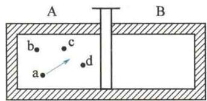

import QRCodeVideo from '@/components/QRCodeVideo.astro';

import Guide from '@/components/Guide.astro';
import Knowledge from '@/components/Knowledge.astro';
import Example from '@/components/Example.astro';
import Analysis from '@/components/Analysis.astro';
import Solution from '@/components/Solution.astro';
import Variant from '@/components/Variant.astro';
import Note from '@/components/Note.astro';
import Block from '@/components/Block.astro';
import Method from '@/components/Method.astro';
import Exercise from '@/components/Exercise.astro';

热力学第二定律指出,一切与热现象有关的实际宏观过程都是不可逆的,自然过程具有方向性.我们可以从微观上来理解这条定律的意义.

## 8.8.1 热力学第二定律的微观意义

热力学研究的对象是包含大量原子、分子等微观粒子的系统，热力学过程就是大量分子无序运动状态的变化。下面用前面的几个自然过程实例来定性说明。
单摆在摆动过程中,功转变成热,机械能转化为内能.功可看作大量分子定向运动的结果,内能是大量分子无规则的热运动的结果.从微观上看,在功转变成热的过程中,自然过程是大量分子从有序运动状态向无序运动状态转化的过程,但其逆过程不能自动进行,即大量分子不可能由无规则的热运动自动转变为有序运动.
当两个存在一定温差的物体相互接触时,热量可以自动地从高温物体传向低温物体,最后达到相同的温度.而温度是大量分子无规则热运动平均平动动能的量度,温度高的物体,其分子无序运动的平均平动动能大,温度低的物体,其分子无序运动的平均平动动能小.虽然两物体的分子都做无序运动,但能根据分子平均平动动能区分两物体.经过一段时间后,两物体的温度相同,这时就不能按分子平均平动动能的不同来区分两物体了,这是由于大量分子无规则的热运动使得无序程度增加了.从微观上看,热传导的过程中,自然过程是大量分子从无序程度小的运动状态向无序程度大的运动状态转化的过程,其逆过程却不能自动进行.
对于气体的绝热自由膨胀过程,膨胀前气体占据的空间小,膨胀后气体占据的空间大.在气体占据的空间小时,整体上气体分子的位置不确定性小,无序性小;在气体占据的空间大时,气体分子的位置不确定性大,分子的运动状态更加无序,无序性相对比较大.因此,从微观上看,气体的绝热自由膨胀过程中,自然过程也是大量分子从无序程度小的运动状态向无序程度大的运动状态转化的过程.其逆过程也不能自动进行.
从以上分析可知,大量分子无序运动状态的变化总是向无序性增大的方向进行,即一切宏观自然过程总是沿着无序性增大的方向进行.这就是热力学第二定律的微观意义.必须注意的是,热力学第二定律是一统计规律,只适用于由大量分子构成的热力学系统.

## 8.8.2 热力学概率与玻尔兹曼熵

一个不受外界影响的孤立系统内部发生的过程,总是沿着无序性增大的方向进行,那么怎样定量描述自然过程的方向性呢?玻尔兹曼首先把态函数熵和无序性联系起来,用数学形式来表示热力学第二定律的微观本质.为了引入熵,先初步了解热力学概率的知识.

### 1. 热力学概率

为简单起见,以单原子理想气体为例说明.如图8.28所示,用隔板将容器分成容积相等的A、B两室,给A室充以某种气体,B室为真空.设容器内只有a、b、c、d4个分子,抽掉隔板,在气体自由膨胀后,A、B两室中可能的分子分布情况,即4个分子的可能宏观态及相应的微观态如表8.4所示. 对于气体的宏观热力学性质, 并不需要确定每一个分子所处的微观位置和速度, 只需要确定气体分子数的分布即可. 例如, A室中有3个分子, B室中有1个分子的分布, 就属于一种宏观态. 因此, 把每个容器中分子数的不同分布称为一种宏观态. 表8.4中第一行表示有5种宏观态(此例只考虑分子的位置, 未考虑分子速度, 即不将分子速度作为微观态的标志). 而对于气体的每一确定的微观态, 必须指出每个分子所处的具体微观位置和速度. 对应于每一种宏观态, 由于分子的微观组合不同, 所以还可能包含若干种微观态. 例如, 宏观态A3B1包含4种微观态.
  
图8.28 气体向真空  
中的自由膨胀
表 8.4 4 个分子的可能宏观态及相应的微观态
<table><tr><td colspan="2">宏观态</td><td>A 4 B 0</td><td colspan="4">A3 B 1</td><td colspan="6">A 2 B 2</td><td colspan="4">A 1 B 3</td><td>A 0 B 4</td></tr><tr><td rowspan="2">微观态</td><td>A</td><td>abcd</td><td>abc</td><td>bcd</td><td>cda</td><td>dab</td><td>ac</td><td>ab</td><td>ad</td><td>bc</td><td>bd</td><td>cd</td><td>a</td><td>b</td><td>c</td><td>d</td><td></td></tr><tr><td>B</td><td></td><td>d</td><td>a</td><td>b</td><td>c</td><td>bd</td><td>cd</td><td>bc</td><td>ad</td><td>bc</td><td>ab</td><td>bcd</td><td>cda</td><td>dab</td><td>abcd</td><td>abcd</td></tr><tr><td colspan="2">宏观态包含的微观态数 $\Omega$ </td><td>1</td><td colspan="4">4</td><td colspan="6">6</td><td colspan="4">4</td><td>1</td></tr></table>
统计理论认为，在孤立系统内，各微观态出现的机会是相同的，即等概率的。在给定的宏观条件下，系统存在大量各种不同的微观态，每一宏观态可以包含许多微观态，统计物理学中定义：宏观态对应的微观态数叫作该宏观态的热力学概率，用 $\Omega$ 表示。各宏观态包含的微观态数目是不相等的，因而各宏观态的出现就不是等概率的了。由表8.4可知，微观态总共有 $16 = 2^{4}$ 个。如分子全都集中在A室或B室的宏观态，只含一个微观态，出现的概率最小，为 $\frac{1}{16} = \frac{1}{2^4}$ ；而两室内分子均匀分布的A2B2宏观态，所含微观态数最多，为6个，出现的概率最大，为 $\frac{6}{16} = \frac{6}{2^4}$ 。如果上述系统有 $N$ 个分子，同样将容器分成容积相等的A、B两室，可以推论，其总微观态数应为 $2^{N}$ 个，对 $N$ 个分子自动退回A室的宏观态，其概率仅为 $1 / 2^{N}$ 。由于一般热学系统包含的分子数巨大，例如， $1\mathrm{mol}$ 气体的分子数为 $6.022\times 10^{23}$ 个，所以气体自由膨胀后，所有分子退回A室的概率为 $\frac{1}{2^{6.022\times 10^{23}}}$ ，这个概率如此之小，实际上根本观察不到。而A室和B室分子各半的均匀分布以及附近的宏观态出现的概率大。所以自由膨胀过程实际上是由包含微观态数少的宏观态向包含微观态数多的宏观态进行，或者说是由概率小的宏观态向概率大的宏观态进行。这一结论对所有自然过程都是成立的。
前面从微观上定性地分析了一切宏观自然过程总是沿着无序性增大的方向进行,这里定量地说明了自然过程总是由热力学概率小的宏观态向热力学概率大的宏观态进行,这就是热力学第二定律的统计意义.由此可知,热力学概率是分子运动无序性的一种量度.

### 2. 玻尔兹曼熵

进一步分析 20 个分子的分布情况, 如表 8.5 所示. 从表中可以看出, 全部分布在 A 室或 B 室的宏观态的热力学概率最小, 而在 A 室和 B 室各半的均匀分布的微观态的数目最多, 热力学概率最大. 计算还可证明, 当分子数增多时, A 室和 B 室各半的均匀分布及其附近的微观态的数目占总微观态数的绝大部分, 因此在热力学系统中处于均匀分布的平衡态及其附近的宏观态的热力学概率接近百分之百, 而其他宏观态的热力学概率几乎可以忽略.
<QRCodeVideo title="熵的理解和应用" url="https://api.guangyiedu.com/v3/resource/resource/r/NewQrCode-nrB79qiWn9MOMnAcGaN9" />  
表 8.5 20 个分子的位置分布与熵
<table><tr><td colspan="2">宏观态</td><td>微观态数(Ω)</td><td>熵 S = kln Ω</td></tr><tr><td>A20;</td><td>B0</td><td>1</td><td>0</td></tr><tr><td>A18;</td><td>B2</td><td>190</td><td>5.25k</td></tr><tr><td>A15;</td><td>B5</td><td>15 504</td><td>9.65k</td></tr><tr><td>A11;</td><td>B9</td><td>167 960</td><td>12.03k</td></tr><tr><td>A10;</td><td>B10</td><td>184 765</td><td>12.13k</td></tr><tr><td>A9;</td><td>B11</td><td>167 960</td><td>12.03k</td></tr><tr><td>A5;</td><td>B15</td><td>15 504</td><td>9.65k</td></tr><tr><td>A2;</td><td>B18</td><td>190</td><td>5.25k</td></tr><tr><td>A0;</td><td>B20</td><td>1</td><td>0</td></tr></table>
分析说明,宏观自然过程总是往热力学概率 $\Omega$ 增大的方向进行,当到达 $\Omega_{max}$ 时,该过程就停止了.同时也看到,一般情况下的热力学概率 $\Omega$ 是非常大的.为了便于理论上处理,1877年,玻尔兹曼引入一个态函数熵,用 S 表示,其与热力学概率 $\Omega$ 的关系为
$$
S = k \ln \Omega\tag{8.37}
$$
称为玻尔兹曼熵，k 称为玻尔兹曼常量，熵的单位是 J/K.
对于热力学系统的每一个宏观态,都有一个热力学概率 $\Omega$ 值与之对应,也就有一个熵值S与之对应,故熵是系统状态函数.热力学概率 $\Omega$ 是分子运动无序性的一种量度,和 $\Omega$ 一样,熵的微观意义是系统内分子热运动无序性的一种量度.
在一定条件下,两个子系统有热力学概率 $\Omega_{1}$ 和 $\Omega_{2}$ ,对应的状态函数分别为 $S_{1}$ 、 $S_{2}$ ,则在同样的条件下,根据概率的性质,整个系统的热力学概率为 $\Omega = \Omega_{1}\Omega_{2}$ ,所以
$$
S = k \ln \Omega = k \ln \Omega_ {1} \Omega_ {2} = k \ln \Omega_ {1} + k \ln \Omega_ {2} = S _ {1} + S _ {2}
$$
也就是说，熵具有可加性，若一系统由两个子系统组成，则
$$
S = S _ {1} + S _ {2}
$$
当引入态函数熵 S 后, 热力学第二定律可用熵来描述, 一切宏观自然过程总是沿着无序性增大的方向进行, 也就是沿着熵增加的方向进行, 即在孤立系统中进行的自然过程总是沿着熵增大的方向进行, 平衡态对应于熵最大的状态, 这就是熵增加原理. 其数学表达式为
$$
\Delta S \geqslant 0
$$
应注意，克劳修斯熵和玻尔兹曼熵的概念的引入是有区别的，克劳修斯熵只对系统的平衡态有意义，是系统平衡态的函数。而玻尔兹曼熵对非平衡态也有意义，因为对非平衡态也有微观态数与之对应，因而也有熵值与之对应，从这个意义上说，玻尔兹曼熵更具普遍性。由于平衡态是对应于 $\Omega_{\mathrm{max}}$ 的状态，可以说，克劳修斯熵是玻尔兹曼熵的最大值。在统计物理学中，可以普遍地证明两个熵公式完全等价。但在热力学中进行计算时多用克劳修斯熵公式。

<Example title="例 8.8">
用热力学概率方法计算物质的量为 $\nu$ 的理想气体向真空自由膨胀时的熵变. 设体积从 $V_{1}$ 膨胀到 $V_{2}$ ，且初、末态均为平衡态.
<table><tr><td>解 因为绝热自由膨胀时系统的温度不变,只需考虑分子的位置分布对系统微观态数的影响.每一分子在体积内各处的概率是相等的,则一个分子按位置分布的可能状态数应与体积成正比,即 $\Omega \propto V$ .对 $\nu N_{A}$ 个分子, $\Omega \propto V^{\nu N_{A}}$ ,所以有 $\frac{\Omega_{2}}{\Omega_{1}} = \left( \frac{V_{2}}{V_{1}} \right)^{\nu N_{A}}$ </td><td> $\Delta S = S_{2} - S_{1} = k\ln \Omega_{2} - k\ln \Omega_{1}$  $= k\ln(\Omega_{2}/\Omega_{1})$  $= \nu N_{A}k\ln(V_{2}/V_{1})$  $= \nu R\ln(V_{2}/V_{1})$ 由于 $V_{2} > V_{1}$ ,故 $\Delta S > 0$ .</td></tr></table>
这里玻尔兹曼熵的计算结果与例 8.6 中用克劳修斯熵公式计算的结果相同,说明玻尔兹曼熵增加的本质也就是克劳修斯熵增加的本质.
无论微观的玻尔兹曼熵,还是宏观的克劳修斯熵,都是一致的,都与宏观态热力学概率的对数成正比,自然界过程的自发倾向总是从概率小的宏观态向概率大的宏观态过渡.那么,这一切又有什么直观的意义呢?熵高,或者说宏观态的概率大,意味着“混乱”和“分散”;熵低,或者说宏观态的概率小,意味着“整齐”和“集中”.用物理学的语言,前者叫作无序(disorder),后者叫作有序(order).例如,固体熔化为液体是熵增加的过程,固体的结晶态比液态整齐有序;液体蒸发为气体是熵增加得更多的过程,气态比液态混乱和分散得多.自由膨胀从集中到分散,功变热从有序到无序,都是熵增加的过程.
<QRCodeVideo title="熵与信息" url="https://api.guangyiedu.com/v3/resource/resource/r/NewQrCode-5UMlBt2y0znqJ5M8UzWn" />  
状态是有序的还是无序的,有时并非一眼就能够看出.许多字符排列成一长串,看不出什么规律,有人认为它是无序的,没有信息量,熵值很高.但此字符串也许是用人们不理解的语言所写的一句话!果真如此,则它是有序的,传达了一定的信息,熵值较低.DNA就是这类字符串,不能因为尚未读懂它而认为它是无序的,其实它是生命过程的中枢,高度有序,内含大量的信息,熵值非常低!
</Example>
