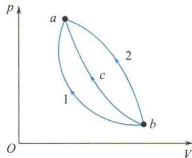

import Guide from '@/components/Guide.astro';
import Knowledge from '@/components/Knowledge.astro';
import Example from '@/components/Example.astro';
import Analysis from '@/components/Analysis.astro';
import Solution from '@/components/Solution.astro';
import Variant from '@/components/Variant.astro';
import Note from '@/components/Note.astro';
import Block from '@/components/Block.astro';
import Method from '@/components/Method.astro';
import Exercise from '@/components/Exercise.astro';

## 选择题

<Exercise title="习题 8.1.1">
关于可逆过程和不可逆过程有以下几种说法：
① 可逆过程一定是准静态过程；
② 准静态过程一定是可逆过程；
③ 不可逆过程发生后一定找不到另一过程使系统和外界同时复原；
④ 非静态过程一定是不可逆过程.
以上说法中正确的是
A. ①、②、③、④. B. ①、②、③. C. ②、③、④. D. ①、③、④.
热力学第一定律表明 （ ）A.系统对外界做的功不可能大于系统从外界吸收的热量.B.系统内能的增量等于系统从外界吸收的热量.C.不可能存在这样的循环过程，在此循环过程中，外界对系统做的功不等于系统传给外界的热量.D.热机的效率不可能等于1.
</Exercise>

<Exercise title="习题 8.1.3">
如题8.1.3图所示，bca为理想气体绝热过程，b1a和b2a是任意过程，则上述两过程中气体做功与吸收热量的情况是（）
A. b1a 过程放热，做负功；b2a 过程放热，做负功.
B. b1a 过程吸热，做负功；b2a 过程放热，做负功.
C. b1a 过程吸热，做正功；b2a 过程吸热，做负功.
D. b1a 过程放热，做正功；b2a 过程吸热，做正功.
  
题8.1.3图
</Exercise>

<Exercise title="习题 8.1.4">
根据热力学第二定律,下列说法中正确的是 ( )
A. 功可以全部变为热,但热不能全部变为功.
B. 热量能从高温物体传到低温物体,但不能从低温物体传到高温物体.
C. 气体能够自由膨胀,但不能自动收缩.
D. 有规则运动的能量能够变为无规则运动的能量,但无规则运动的能量不能变为有规则运动的能量.
</Exercise>

<Exercise title="习题 8.1.5">
设有以下一些过程：
① 两种不同气体在等温下互相混合； ② 理想气体在定容下降温；
③ 液体在等温下汽化； ④ 理想气体在等温下压缩；
⑤ 理想气体绝热自由膨胀.
在这些过程中，使系统的熵增加的过程是
A. ①、②、③. B. ②、③、④. C. ③、④、⑤. D. ①、③、⑤.
</Exercise>
