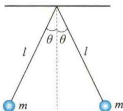
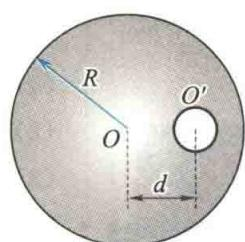
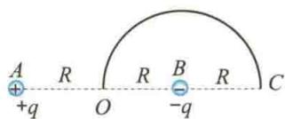
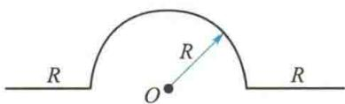
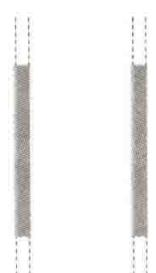
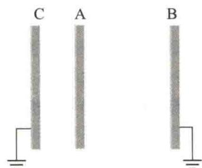
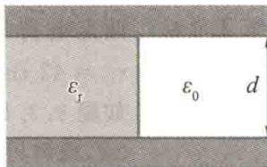
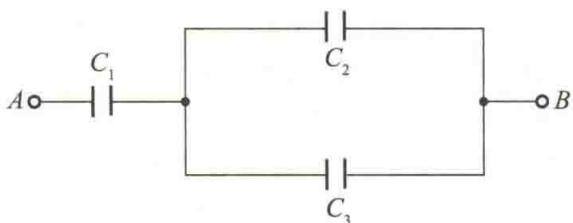
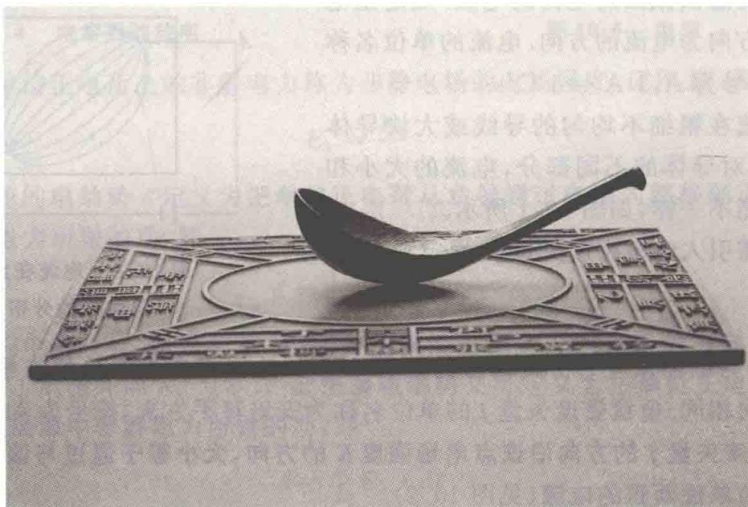

import Guide from '@/components/Guide.astro';
import Knowledge from '@/components/Knowledge.astro';
import Example from '@/components/Example.astro';
import Analysis from '@/components/Analysis.astro';
import Solution from '@/components/Solution.astro';
import Variant from '@/components/Variant.astro';
import Note from '@/components/Note.astro';
import Block from '@/components/Block.astro';
import Method from '@/components/Method.astro';
import Exercise from '@/components/Exercise.astro';

## 解答题

<Exercise title="习题 9.3.1">
将电量都是 q 的三个点电荷分别放在正三角形的三个顶点处. 试问: (1) 在此三角形的中心放一个什么样的电荷, 就可以使这四个电荷都达到平衡 (每个电荷受其他三个电荷的静电力之和都为零)? (2) 这种平衡与三角形的边长有无关系?
</Exercise>

<Exercise title="习题 9.3.2">
两小球的质量都是 m，都用长为 l 的细绳挂在同一点，它们带有相同的电量，静止时两线夹角为 $2\theta$ ，如题 9.3.2 图所示。设小球的半径和线的质量都可以忽略不计，求每个小球所带的电量。
</Exercise>

<Exercise title="习题 9.3.3">
根据点电荷电场强度公式 $E = \frac{q}{4\pi\varepsilon_{0}r^{2}}$ 可知，当被考察的场点距场源点电荷很近 $(r \to 0)$ 时，电场强度 $E \to \infty$ ，这是没有物理意义的，对此应如何理解？
  
题9.3.2图
</Exercise>

<Exercise title="习题 9.3.4">
在真空中有 A、B 两平行板，相对距离为 d，板面积均为 S，其带电量分别为 +q 和 -q，则这两板之间有相互作用力 F。有人说 $F = \frac{q^{2}}{4\pi\varepsilon_{0}d^{2}}$ ；又有人说，因为 F = qE, $E = \frac{q}{\varepsilon_{0}S}$ ，所以 $F = \frac{q^{2}}{\varepsilon_{0}S}$ 。试问：这两种说法对吗？为什么？F 应等于多少？
</Exercise>

<Exercise title="习题 9.3.5">
长 $l = 15.0 \mathrm{~cm}$ 的直导线 $AB$ 上均匀地分布着线电荷密度 $\lambda = 5.0 \times 10^{-9} \mathrm{C} / \mathrm{m}$ 的正电荷. 求: (1) 在导线的延长线上与导线 $B$ 端相距 $d_{1} = 5.0 \mathrm{~cm}$ 处 $P$ 点的电场强度; (2) 在导线的垂直平分线上与导线中点相距 $d_{2}=5.0\ cm$ 处 Q 点的电场强度.
</Exercise>

<Exercise title="习题 9.3.6">
一个半径为 R 的均匀带电半圆环，线电荷密度为 $\lambda$ ，求环心 O 点的电场强度.
</Exercise>

<Exercise title="习题 9.3.7">
均匀带电的细线弯成正方形，边长为 $l$ ，总电量为 $q$ .(1)求此正方形轴线上距离中心 $r$ 处的电场强度 $\pmb{E}$ ；(2)证明：在 $r\gg l$ 处，(1)中所述电场强度 $\pmb{E}$ 相当于点电荷 $q$ 产生的电场强度.
</Exercise>

<Exercise title="习题 9.3.8">
(1) 点电荷 q 位于一边长为 a 的立方体中心, 试求在该点电荷电场中穿过立方体的一个面的电通量; (2) 如果该点电荷移动到该立方体的一个顶点上, 这时穿过立方体各面的电通量是多少?
</Exercise>

<Exercise title="习题 9.3.9">
均匀带电球壳内半径为 6 cm, 外半径为 10 cm, 体电荷密度为 $2 \times 10^{-5}$ C/m $^{3}$ . 试求距球心 5 cm、8 cm 及 12 cm 的各点的电场强度.
</Exercise>

<Exercise title="习题 9.3.10">
半径分别为 $R_{1}$ 和 $R_{2}(R_{2}>R_{1})$ 的两无限长同轴圆柱面，单位长度上分别带有电量 $\lambda$ 和 $-\lambda$ ，试求：(1) $r<R_{1}$ ; (2) $R_{1}<r<R_{2}$ ; (3) $r>R_{2}$ 处各点的电场强度.
</Exercise>

<Exercise title="习题 9.3.11">
两个无限大的平行平面都均匀带电，面电荷密度分别为 $\sigma_{1}$ 和 $\sigma_{2}$ ，试求空间各处的电场强度。
</Exercise>

<Exercise title="习题 9.3.12">
半径为 R 的均匀带电球体的体电荷密度为 $\rho$ ，若在球内挖去一个半径为 $r(r < R)$ 的小球体，如题 9.3.12 图所示。试求两球心 O 点与 $O'$ 点的电场强度，并证明小球空腔内的电场是均匀的。
</Exercise>

<Exercise title="习题 9.3.13">
一电偶极子由 $q = 1.0 \times 10^{-6}$ C 的两个异号点电荷组成，两电荷距离 d = 0.2 cm，把该电偶极子放在电场强度为 $1.0 \times 10^{5}$ N/C 的外电场中，求外电场作用于电偶极子上的最大力矩.

</Exercise>

<Exercise title="习题 9.3.14">
两点电荷的电量分别为 $q_{1} = 1.5 \times 10^{-8} \mathrm{C}, q_{2} = 3.0 \times 10^{-8} \mathrm{C}$ , 相距 $r_{1} = 42 \mathrm{~cm}$ , 要把它们之间的距离变为 $r_{2} = 25 \mathrm{~cm}$ , 需做多少功?
题9.3.12图
</Exercise>

<Exercise title="习题 9.3.15">
如题 9.3.15 图所示，在 A、B 两点处放有电量分别为 +q、-q 的点电荷，A、B 两点间的距离为 2R，现将另一正试验点电荷 $q_{0}$ 从 O 点经过半圆弧移到 C 点，求移动过程中电场力做的功.
</Exercise>

<Exercise title="习题 9.3.16">
如题 9.3.16 图所示的绝缘细线上均匀分布着线电荷密度为 $\lambda$ 的正电荷，两段直导线的长度和半圆环的半径都等于 R。试求环中心 O 点处的电场强度和电势。
  
题9.3.15图
  
题9.3.16图
</Exercise>

<Exercise title="习题 9.3.17">
一电子绕一均匀带电的长直导线以 $2 \times 10^{4} \mathrm{~m/s}$ 的匀速率做圆周运动. 求带电长直导线上的线电荷密度 (电子质量 $m_{0} = 9.1 \times 10^{-31} \mathrm{~kg}$ , 电子电量 $e = 1.60 \times 10^{-19} \mathrm{C}$ ).
</Exercise>

<Exercise title="习题 9.3.18">
空气可以承受的电场强度的最大值为 $E = 30 \, kV/cm$ ，超过这个数值时，空气要发生火花放电。今有一高压平行板电容器，极板间距 $d = 0.5 \, cm$ ，求此电容器可承受的最高电压。
</Exercise>

<Exercise title="习题 9.3.19">
证明:对于两个无限大的平行平面带电导体板(见题9.3.19图)来说,(1)相向的两面上,面电荷密度总是大小相等而符号相反;(2)相背的两面上,面电荷密度总是大小相等且符号相同.
</Exercise>

<Exercise title="习题 9.3.20">
三个平行金属板 A、B、C 的面积都是 $200 \, cm^{2}$ ，A 和 B 相距 $4.0 \, mm$ ，A 和 C 相距 $2.0 \, mm$ ，B、C 都接地，如题 9.3.20 图所示。如果使 A 板带正电荷（电量为 $3.0 \times 10^{-7} \, C$ ），略去边缘效应，问：(1) B 板和 C 板上的感应电荷各是多少？(2) 以地面的电势为零，则 A 板的电势是多少？
  
题9.3.19图
  
题9.3.20图
</Exercise>

<Exercise title="习题 9.3.21">
两个半径分别为 $R_{1}$ 和 $R_{2}(R_{1} < R_{2})$ 的同心薄金属球壳，现使内球壳带电 $+q$ ，求：(1)外球壳上的电荷分布及电势大小；(2)先把外球壳接地，然后断开接地线重新绝缘，此时外球壳的电荷分布及电势；\* (3)再使内球壳接地，此时内球壳上的电荷分布及外球壳上的电势的改变量.
</Exercise>

<Exercise title="习题 9.3.22">
半径为 $R$ 的金属球离地面很远，并用导线与地相连，在与球心相距 $d = 3R$ 处有一点电荷 $+q$ 求金属球上的感应电荷的电量.
</Exercise>

<Exercise title="习题 9.3.23">
有三个大小相同的金属小球，小球1、2带有等量同号电荷，相距甚远，两者间的静电力大小为 $F_0$ .求：(1)用带绝缘柄的不带电小球3先后分别接触小球1、2后移去，小球1、2之间的静电力；(2)小球3依次交替接触小球1、2很多次后移去，小球1、2之间的静电力.
</Exercise>

<Exercise title="习题 9.3.24">
在半径为 $R_{1}$ 的金属球之外包有一层外半径为 $R_{2}$ 的均匀电介质球壳，电介质的相对介电常量为 $\varepsilon_{\mathrm{r}}$ ，金属球带电 $Q.$ 求：(1)电介质内、外的电场强度；(2)电介质内、外的电势；(3)金属球的电势.
</Exercise>

<Exercise title="习题 9.3.25">
如题 9.3.25 图所示, 在平行板电容器的一半空间内充入相对介电常量为 $\varepsilon_{r}$ 的电介质. 求: 在有电介质部分和无电介质部分极板上自由电荷面密度的比值.
$$
R _ {1}
$$
$$
R _ {2} (R _ {2} > R _ {1})
$$
  
题9.3.25图
$$
l \gg R _ {2} - R _ {1}
$$
$$
(R _ {1} <   r <   R _ {2})
$$
</Exercise>

<Exercise title="习题 9.3.27">
3个电容器的连接方式如题9.3.27图所示， $C_{1}=0.25\mu F,C_{2}=0.15\mu F,C_{3}=0.20\mu F,C_{1}$ 上的电压为50 V，求 $U_{AB}$ .
  
题9.3.27图
</Exercise>

<Exercise title="习题 9.3.28">
$C_{1}$ 和 $C_{2}$ 两电容器分别标明“200 pF、500 V”和“300 pF、900 V”，则把它们串联起来后的等效电容是多少？
</Exercise>

<Exercise title="习题 9.3.29">
有一半径为 $R_{1} = 2.0 \, cm$ 的导体球，其外套一同心的导体球壳，导体球壳的内、外半径分别为 $R_{2} = 4.0 \, cm$ 和 $R_{3} = 5.0 \, cm$ ，当导体球带电量 $Q = 3.0 \times 10^{-8} \, C$ 时，求：
(1) 整个电场储存的能量；
(2) 如果将导体球壳接地，电场储存的能量；
(3) 由导体球和导体球壳组成的电容器的电容。
  
</Exercise>
