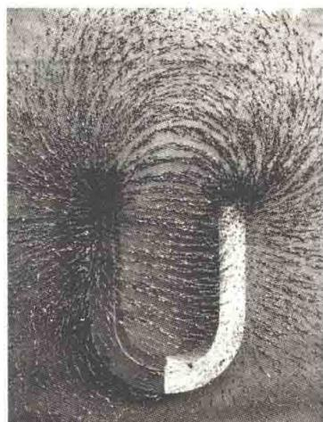
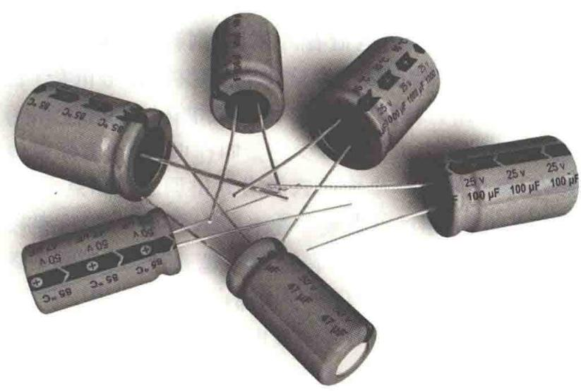
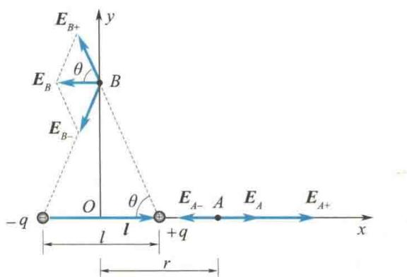
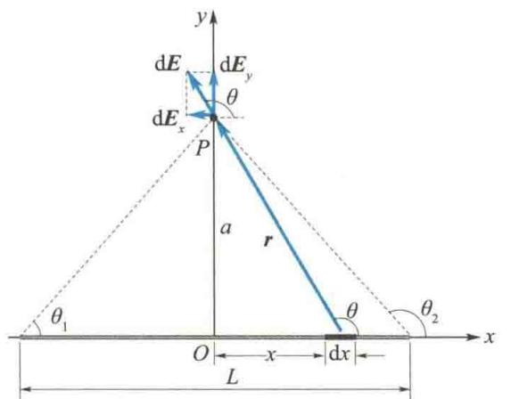
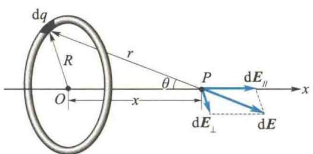
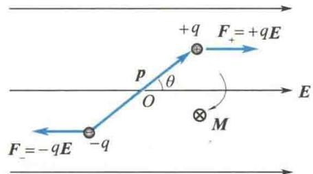
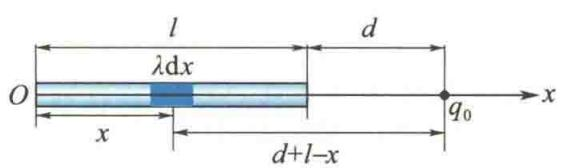

import QRCodeVideo from '@/components/QRCodeVideo.astro';

import Guide from '@/components/Guide.astro';
import Knowledge from '@/components/Knowledge.astro';
import Example from '@/components/Example.astro';
import Analysis from '@/components/Analysis.astro';
import Solution from '@/components/Solution.astro';
import Variant from '@/components/Variant.astro';
import Note from '@/components/Note.astro';
import Block from '@/components/Block.astro';
import Method from '@/components/Method.astro';
import Exercise from '@/components/Exercise.astro';

## 第9章 静电场

电磁场是物质世界的重要组成部分,而电磁学就是研究电磁场运动规律的学科.
电磁现象形成理论,可以认为是从1785年库仑研究电荷之间的相互作用开始的,当时人们研究了静电、静磁和电流等现象,并总结出了一些实验定律.但是,电磁学的重大进展是在人们认识到电现象和磁现象之间深刻的内在联系以后才取得的.1820年,奥斯特发现了电流的磁效应;1831年,法拉第发现了电磁感应现象,并提出了场和场线的概念.至此,电现象和磁现象作为矛盾统一的整体开始被人们认识.1864年,麦克斯韦总结了前人的成果,再加上他提出的关于涡旋电场和位移电流的两个大胆假说,建立了描述宏观电磁场的完美理论——麦克斯韦方程组,并从理论上预言了电磁波的存在.1888年,赫兹利用振荡器通过实验证实了麦克斯韦关于电磁波的预言.麦克斯韦的电磁场理论是从牛顿建立经典力学理论到爱因斯坦创立相对论这段时期中物理学重要的理论成果之一.
1905年,爱因斯坦创立了相对论,解决了经典力学时空观与电磁现象的新的实验事实的矛盾.根据电磁现象的规律必须满足相对论时空洛伦兹变换的要求,人们发现:从不同参考系中观测,同一电磁场或表现为电场,或表现为磁场,或表现为电场和磁场并存.这说明电磁场是一个统一的整体,而描述电磁场的物理量(电场强度和磁感应强度)是随参考系改变的.
电磁学理论是多种工程技术和科学研究的基础。电能是应用最广泛的能源之一，电磁波的传播实现了信息传递，研究新材料的电磁性质促进了新技术的诞生。显然，电

磁学与工程技术的各个领域有着十分密切的联系.电磁学的研究在理论方面也很重要.物质的各种性能是由物质的电结构决定的,在分子和原子等微观领域中,电磁力
起主要作用. 许多物理现象, 如金属的导热现象、光学中的折射现象等都可从物质的电结构中得到解释. 所以, 电磁学理论在现代物理学中也占有重要地位.
本篇主要研究电磁场的规律以及物质的电磁性质,首先介绍电场的性质及规律;接着介绍静电场中的导体和电介质;然后介绍磁场的性质及规律;再介绍磁场中的磁介质;最后介绍电场和磁场的相互联系——电磁感应现象,以及宏观电磁场的理论——麦克斯韦方程组.

<QRCodeVideo title="本章提要" url="https://api.guangyiedu.com/v3/resource/resource/r/NewQrCode-OGlK68bPHtNbC1cmNL9N" />  
相对于观察者静止的电荷称为静电荷,由静电荷产生的电场称为静电场,静电荷之间的相互作用是通过电场来传递的.本章主要研究静电场的基本性质与基本规律,以及静电场与导体、电介质之间的相互作用.
电场强度和电势是描述静电场性质的两个重要物理量. 静电场的高斯定理和环路定理是反映静电场性质的两条基本定理. 对于某些对称分布的静电场, 其电场强度既可基于库仑定律求解, 亦可通过高斯定理求解, 其中所涉及的对称性分析是现代物理学的一种基本分析方法. 在静电场的作用下, 导体和电介质中的电荷分布会发生变化. 这种电荷分布的变化反过来又会影响静电场分布, 最终达到静电平衡. 本章还将讨论静电场与物质的相互作用规律, 以及电容器和静电场的能量.
本章所介绍的一些概念、规律以及研究和处理问题的方法贯穿于整个电磁学,是学习电磁学的入门知识.

## 9.1.1 电荷

电荷的概念是从研究物体带电的现象中产生的. 两种不同材料的物体, 如丝绸与玻璃棒相互摩擦后, 它们都能吸引小纸片等轻微物体. 这时, 我们说丝绸和玻璃棒都处于带电状态, 它们分别带有电荷. 可见, 电荷是物体状态的一种属性. 宏观物体或微观粒子处于带电状态时, 就说它们带有电荷.
<QRCodeVideo title="库仑" url="https://api.guangyiedu.com/v3/resource/resource/r/NewQrCode-gStD1AKfLSb4emUEcpBY" />  
宏观物体或微观粒子所带的电荷有两种,分别称为正电荷和负电荷.带同种电荷(又称同号电荷)的物体互相排斥,带异种电荷(又称异号电荷)的物体互相吸引.静止电荷之间的相互作用力称为静电力.根据带电体之间相互作用力的大小,能够确定物体所带电荷的多少.表示电荷多少的量叫作电量.在国际单位制(SI)中,电量的单位名称是库仑,符号为C.
现代物理实验证实,电子的电荷集中在半径小于 $10^{-18}$ m 的球形空间内.因此,常把电子看成一个无内部结构而具有有限质量和电量的“点”.质子只有正电荷,都集中在半径约为 $10^{-15}$ m 的球形空间内.中子内部也有电荷,中心为正电荷,外层为负电荷,正、负电荷电量相等,所以中子对外不显电性.
由物质的分子结构可知,在正常状态下,物体内部的正电荷和负电荷数量相等,物体处于电中性状态.使物体带电的过程就是使它获得或失去电子的过程.在一孤立系统内,无论发生怎样的物理过程,该系统电荷的代数和保持不变.这就是电荷守恒定律.在粒子的相互作用过程中,电荷是可以产生和消失的.例如,一个高能光子与一个重原子核相互作用时,该光子可以转化为一个正电子和一个负电子(该过程叫作电子对的“产生”);而一个正电子和一个负电子在一定条件下相遇,又会同时消失而产生两个或三个光子(该过程叫作电子对的“湮灭”).在已观察到的各种过程中,正、负电荷总是成对出现或成对消失.由于光子不带电,正、负电子又各带等量异号电荷,因此这种电荷的产生和消失并不改变系统中电荷的代数和,电荷守恒定律仍然有效.
迄今为止，所有实验均表明，任何带电体所带电量都是基本电量 $e=1.602\times10^{-19}$ ℃的整数倍。这种电量只能取分立的、不连续的量值的性质称为电荷的量子化。e如此之小，以致电荷的量子性在研究宏观现象的绝大多数实验中未能表现出来，所以通常认为带电体的电荷连续分布，且电荷的变化是连续的。近代物理从理论上预言，基本粒子由若干种电量为 $\pm\frac{1}{3}e$ 、 $\pm\frac{2}{3}e$ 的夸克或反夸克组成，然而目前还未在实验中发现单独存在的夸克。
实验还证明,一个电荷的电量与它的运动状态无关.例如,电子或质子被加速器加速时,其速度在变化,但其电量没有任何变化.再如,氢分子和氦原子都有两个电子,它们在核外的运动状态差别不大,电子电量应该相同.但是,氢分子的两个质子是作为两个原子核在保持相对距离约为 0.07 nm 的情况下转动的；氦原子中的两个质子却紧密地束缚在一起运动。氦原子中的两个质子的能量比氢分子的两个质子的能量约大一百万倍，因而两者的运动状态有显著差别。如果电荷的电量与运动状态有关，氢分子中质子的电量就应该和氦原子中质子的电量不同，但两者的电子电量是相同的，因此两者就不可能都是电中性的。但是实验证实，氢分子和氦原子都是电中性的。这就说明，质子的电量也是与其运动状态无关的。大量事实证明，电荷的电量与其运动状态无关。在不同的参考系中观察，同一带电粒子的电量不变，电荷的这一性质称为电荷的相对论不变性。

## 9.1.2 库仑定律

两个静止带电体之间的作用力(通常称为两个静止电荷之间的作用力), 即静电力, 不仅与带电体所带电量及它们之间的距离有关, 而且还与它们的大小、形状及电荷分布情况有关. 当两个带电体本身的线度与它们之间的距离相比足够小时, 可以将带电体看作点电荷, 即带电体的形状、大小都可以忽略, 而把带电体所带电量集中到一个“点”上.
真空中两个静止点电荷之间相互作用力的大小与这两个点电荷所带电量 $q_{1}$ 和 $q_{2}$ 的乘积成正比，与它们之间的距离 $\pmb{r}$ 的平方成反比.作用力的方向沿着两个点电荷的连线，同号电荷相互排斥，异号电荷相互吸引.这就是库仑定律，它是在1785年由法国物理学家库仑首先提出的.相互作用力 $\pmb{F}$ 的大小可表示为
$$
F = k \frac {q _ {1} q _ {2}}{r ^ {2}}\tag{9.1}
$$
式中， $k$ 为比例系数，其数值和单位取决于各量所采用的单位.在国际单位制(SI)中， $k = 8.9880 \times 10^{9} \mathrm{~N} \cdot \mathrm{m}^{2} / \mathrm{C}^{2} \approx 9.0 \times 10^{9} \mathrm{~N} \cdot \mathrm{m}^{2} / \mathrm{C}^{2}$ .
为了使由库仑定律推导出的一些常用公式简化,我们引入新的常数 $\varepsilon_{0}$ 来代替 k,两者的关系为
$$
\varepsilon_ {0} = \frac {1}{4 \pi k} = 8. 8 5 \times 1 0 ^ {- 1 2} \mathrm{C} ^ {2} / (\mathrm{N} \cdot \mathrm{m} ^ {2})\tag{9.2}
$$
$\varepsilon_{0}$ 称为真空介电常量. 将 $\varepsilon_{0}$ 代入式(9.1) 得
$$
F = \frac {1}{4 \pi \varepsilon_ {0}} \frac {q _ {1} q _ {2}}{r ^ {2}}\tag{9.3}
$$
为了表示力的方向,可采用矢量式表示库仑定律:
$$
\boldsymbol {F} = \frac {1}{4 \pi \varepsilon_ {0}} \frac {q _ {1} q _ {2}}{r ^ {2}} \boldsymbol {r} _ {0}\tag{9.4}
$$
式中， $r_{0}$ 是由施力电荷指向受力电荷的矢径方向上的单位矢量。近代物理实验表明，当两个点电荷之间的距离在 $10^{-17} \sim 10^{7}$ m 范围内时，库仑定律是极其准确的。
库仑定律只对两个点电荷之间的作用适用. 当空间中同时存在几个点电荷时, 它们共同作用于某一点电荷的静电力等于其他各点电荷单独存在时作用在该点电荷上的静电力的矢量和. 这就是静电力的叠加原理.

## 9.1.3 电场强度

电荷之间的相互作用是如何实现的呢？在19世纪30年代以前，人们普遍认为静电力与质点之间的万有引力一样,属于一种超距作用,即不受时间影响且不借助任何中间介质来传递.后来,法拉第提出了另一种观点.他认为静电力同样是物质之间的相互作用,这种特殊的物质是由电荷产生的,叫作电场.电荷和电荷之间是通过电场这种物质传递相互作用的,这种相互作用可以表示为
<QRCodeVideo title="法拉第" url="https://api.guangyiedu.com/v3/resource/resource/r/NewQrCode-qjF8Y5n1PmHccV4b1ovv" />  
$$
\text { 电荷 } \leftrightarrows \text { 电场 } \leftrightarrows \text { 电荷 }
$$
近代物理的理论与实验证明了这种观点的正确性. 同时, 电场被证实是一种客观存在的物质, 以有限的速度运动或传播, 也具有和实物一样的能量、动量和质量等重要性质. 但电场与其他实物也有不同, 如几个电场可以同时占据同一空间, 因此电场是一种特殊形式的物质.
相对于观察者静止的带电体周围存在的电场称为静电场. 静电场对外的表现主要有：
(1) 处于电场中的任何带电体都受到电场所作用的力；
(2) 当带电体在电场中移动时, 电场所作用的力将对带电体做功.
电场中任意一点处的电场性质,可根据电荷在电场中受力的特点来定量描述.用电量很小的点电荷 $q_{0}$ 作为试验电荷,当将试验电荷 $q_{0}$ 放在电场中一给定点处时,它所受到的静电力的大小和方向是一定的;当将试验电荷 $q_{0}$ 放在电场中的不同点处时,它受到的静电力的大小和方向一般是不相同的.将试验电荷 $q_{0}$ 放在电场中一固定点处,当试验电荷 $q_{0}$ 的电量改变时,它所受的力的方向不变,但力的大小将随电量的改变而改变,然而始终保持力 F 和 $q_{0}$ 的比值 $\frac{F}{q_{0}}$ 为一恒矢量.因此, $\frac{F}{q_{0}}$ 反映了 $q_{0}$ 所在点处电场的性质,称为电场强度,用 E 表示,即
$$
\boldsymbol {E} = \frac {\boldsymbol {F}}{q _ {0}}\tag{9.5}
$$
即电场中任意一点处的电场强度等于单位正电荷在该点处所受的静电力. 在国际单位制(SI)中, 电场强度 E 的单位名称是牛顿每库仑, 符号是 N/C, 也可以写成 V/m.
一般情况下,电场中的不同点,其电场强度的大小和方向是各不相同的.要完整地描述整个电场,必须知道空间各点的电场强度分布,即求出矢量场函数 $E = E(r)$ .

## 9.1.4 电场强度叠加原理

将试验电荷 $q_{0}$ 放在点电荷系 $q_{1}, q_{2}, \cdots, q_{n}$ 所产生的电场中时， $q_{0}$ 将受到各点电荷静电力的作用。由静电力的叠加原理可知， $q_{0}$ 受到的总静电力为
$$
\boldsymbol {F} = \boldsymbol {F} _ {1} + \boldsymbol {F} _ {2} + \dots + \boldsymbol {F} _ {n}
$$
两边同时除以 $q_{0}$ ，得
$$
\frac {\boldsymbol {F}}{q _ {0}} = \frac {\boldsymbol {F} _ {1}}{q _ {0}} + \frac {\boldsymbol {F} _ {2}}{q _ {0}} + \dots + \frac {\boldsymbol {F} _ {n}}{q _ {0}}
$$
按电场强度定义 $E = \frac{F}{q_{0}}$ ，有
$$
\boldsymbol {E} = \boldsymbol {E} _ {1} + \boldsymbol {E} _ {2} + \dots + \boldsymbol {E} _ {n} = \sum_ {i = 1} ^ {n} \boldsymbol {E} _ {i}\tag{9.6}
$$
式(9.6)表明,电场中任意一点处的总电场强度等于各个点电荷单独存在时在该点所产生的电场强度的矢量和.这就是电场强度叠加原理.任何带电体都可以看作许多点电荷的集合,因而由该原理可计算任意带电体产生的电场强度.

## 9.1.5 电场强度的计算

如果场源电荷分布状况已知,那么根据电场强度叠加原理,原则上可以求得其电场分布.
<QRCodeVideo title="电荷连续分布的电场的计算" url="https://api.guangyiedu.com/v3/resource/resource/r/NewQrCode-gB2KHE7Ie3KDQ41UA2hc" />

### 1. 点电荷的电场

电荷连续分布的电场的计算
设真空中有一点电荷 q, P 点为空间一点(称为场点). r 为从点电荷 q 到 P 点的矢径. 当试验电荷 $q_{0}$ 放在 P 点时, 试验电荷 $q_{0}$ 所受静电力为
$$
\boldsymbol {F} = \frac {1}{4 \pi \varepsilon_ {0}} \frac {q _ {0} q}{r ^ {2}} \boldsymbol {r} _ {0}
$$
式中， $r_{0}$ 为矢径 r 方向上的单位矢量。则 P 点的电场强度为
$$
\pmb {E} = \frac {\pmb {F}}{q _ {0}} = \frac {1}{4 \pi \varepsilon_ {0}} \frac {q}{r ^ {2}} \pmb {r} _ {0}\tag{9.7}
$$
当点电荷 q 为正电荷时，E 的方向与 r 的方向相同；当点电荷 q 为负电荷时，E 的方向与 r 的方向相反。式(9.7)表明，点电荷的电场具有球对称性：在以点电荷 q 为中心的每一个球面上，各点电场强度的大小相等；正点电荷的电场强度方向垂直于球面向外，负点电荷的电场强度方向垂直于球面向里。

### 2. 点电荷系的电场

设真空中有点电荷系 $q_{1}, q_{2}, \cdots, q_{n}$ ，用 $r_{i0}$ 表示第 i 个点电荷 $q_{i}$ 到任意场点 P 的矢径 $r_{i}$ 方向上的单位矢量， $E_{i}$ 为 $q_{i}$ 单独存在时在 P 点产生的电场强度，则
$$
\pmb {E} _ {i} = \frac {1}{4 \pi \varepsilon_ {0}} \frac {q _ {i}}{r _ {i} ^ {2}} \pmb {r} _ {i 0}
$$
根据电场强度叠加原理,可得 P 点的总电场强度为
$$
\boldsymbol {E} = \sum_ {i = 1} ^ {n} \boldsymbol {E} _ {i} = \sum_ {i = 1} ^ {n} \frac {1}{4 \pi \varepsilon_ {0}} \frac {q _ {i}}{r _ {i} ^ {2}} \boldsymbol {r} _ {i 0}\tag{9.8}
$$
在直角坐标系中,式(9.8)的分量式为
$$
\left\{ \begin{array}{l} E _ {x} = \sum_ {i = 1} ^ {n} E _ {i x} \\ E _ {y} = \sum_ {i = 1} ^ {n} E _ {i y} \\ E _ {z} = \sum_ {i = 1} ^ {n} E _ {i z} \end{array} \right.
$$

<Example title="例 9.1">
两个等值异号的点电荷 + q 和 -q 组成点电荷系，当它们之间的距离 l 比所讨论问题中涉及的距离 r 小得多时，这一点电荷系称为电偶极子。由负电荷 -q 指向正电荷 +q 的矢径 l 称为电偶极子的轴。ql 称为电偶极矩，简称电矩，用 p 表示，即 p = ql。试计算电偶极子的轴的延长线上的一点 A 和轴的中垂面上的一点 B 的电场强度。

<Solution title="解">
作如图 9.1 所示的坐标系, O 点为电偶极子轴的中点. 点电荷 +q 和 -q 在 A 点产生的电场强度大小分别为
$$
E _ {A +} = \frac {1}{4 \pi \varepsilon_ {0}} \frac {q}{\left(r - \frac {l}{2}\right) ^ {2}}
$$
<figure class="vp-figure">
  
  <figcaption>图9.1 例9.1图</figcaption>
</figure>
$$
E _ {A -} = \frac {1}{4 \pi \varepsilon_ {0}} \frac {q}{\left(r + \frac {l}{2}\right) ^ {2}}
$$
$E_{A+}$ 沿 x 轴正方向， $E_{A-}$ 沿 x 轴负方向，因此 A 点的总电场强度大小为
$$
E _ {A} = E _ {A +} - E _ {A -}
$$
$$
\begin{array}{r l} & = \frac {q}{4 \pi \varepsilon_ {0}} \left[ \frac {1}{\left(r - \frac {l}{2}\right) ^ {2}} - \frac {1}{\left(r + \frac {l}{2}\right) ^ {2}} \right] \\ & = \frac {q \cdot 2 l r}{4 \pi \varepsilon_ {0} \left[ \left(r - \frac {l}{2}\right) \left(r + \frac {l}{2}\right) \right] ^ {2}} \end{array}
$$
因为 $r \gg l$ ，故
$$
E _ {A} \approx \frac {2 q l}{4 \pi \varepsilon_ {0} r ^ {3}} = \frac {2 p}{4 \pi \varepsilon_ {0} r ^ {3}}
$$
$E_{A}$ 沿 x 轴正方向，与电矩 p 方向相同，因此
$$
\boldsymbol {E} _ {A} \approx \frac {2 \boldsymbol {p}}{4 \pi \varepsilon_ {0} r ^ {3}}\tag{\textcircled{1}}
$$
通过类似计算可得
$$
\begin{array}{r l} E _ {B} & = E _ {x} = - 2 E _ {B +} \cos \theta \\ & = - 2 \frac {q}{4 \pi \varepsilon_ {0}} \frac {1}{\left(r ^ {2} + \frac {l ^ {2}}{4}\right)} \frac {\frac {l}{2}}{\left(r ^ {2} + \frac {l ^ {2}}{4}\right) ^ {\frac {1}{2}}} \\ & \approx - \frac {q l}{4 \pi \varepsilon_ {0} r ^ {3}} = - \frac {p}{4 \pi \varepsilon_ {0} r ^ {3}} \end{array}
$$
$E_{B}$ 沿 x 轴负方向，与电矩 p 的方向相反，因此
$$
\pmb {E} _ {B} \approx - \frac {\pmb {p}}{4 \pi \varepsilon_ {0} r ^ {3}}\tag{\textcircled{2}}
$$
$r \gg l$ 的其他场点的电场强度, 可以通过把电偶极矩 p 分解为沿 r 方向和垂直于 r 方向的两个分量, 再利用式 ① 和式 ② 来求得.
电偶极子的物理模型在研究电介质的极化和电磁波的辐射时都会用到.
</Solution>
</Example>

### 3. 电荷连续分布的带电体的电场

可以把带电体分割成无限多个电荷元 dq. dq 在场点 P 产生的电场强度 dE 与点电荷产生的电场强度相同, 由式(9.7) 知
$$
\mathrm{d} E = \frac {\mathrm{d} q}{4 \pi \varepsilon_ {0} r ^ {2}} r _ {0}
$$
式中， $r_{0}$ 为电荷元 dq 到 P 点的矢径 r 方向上的单位矢量。根据电场强度叠加原理，带电体在 P 点的总电场强度为
$$
\pmb {E} = \int_ {V} \mathrm{d} \pmb {E} = \int_ {V} \frac {1}{4 \pi \varepsilon_ {0}} \frac {\mathrm{d} q}{r ^ {2}} \pmb {r} _ {0}\tag{9.9}
$$
若电荷在一定体积内连续分布，用 $\rho$ 表示体电荷密度，则式(9.9)中 $\mathrm{d}q = \rho \mathrm{d}V$ ；若电荷连续分布在一曲面或平面上，用 $\sigma$ 表示面电荷密度，则 $\mathrm{d}q = \sigma \mathrm{d}S$ ；若电荷连续分布在一曲线或直线上，用 $\lambda$ 表示线电荷密度，则 $\mathrm{d}q = \lambda \mathrm{d}l$ 。相应地计算 $E$ 的积分，分别为体积分、面积分和线积分。具体计算时，大多是通过对分量的积分来求出 $E$ 的各个分量。

<Example title="例 9.2">
真空中有一均匀带电直线，长为 $L$ ，总电量为 $q$ ，试求到直线的距离为 $a$ 的 $P$ 点的电场强度.

<Solution title="解">
取 P 点到带电直线的垂线的垂足 O 点为坐标原点，并确定 x 轴与 y 轴的正方向，如图 9.2 所示. P点到带电直线两端点的连线与 $x$ 轴正方向的夹角分别为 $\theta_{1}$ 和 $\theta_{2}$ . 线元 $\mathrm{dx}$ 位于 $x$ 处, 则 $\mathrm{dq} = \lambda \mathrm{dx} = \frac{q}{L} \mathrm{dx}, \mathrm{dq}$ 在 P 点产生的电场强度 dE 的方向如图 9.2 所示, 大小为
$$
\mathrm{d} E = \frac {1}{4 \pi \varepsilon_ {0}} \frac {\lambda \mathrm{d} x}{r ^ {2}}
$$
r 为 P 点到 dx 的距离, r 与 x 轴正方向的夹角为 $\theta$ , 则
$$
\mathrm{d} E _ {x} = \mathrm{d} E \cos \theta
$$
$$
\mathrm{d} E _ {\mathrm{y}} = \mathrm{d} E \sin \theta
$$
<figure class="vp-figure">
  
  <figcaption>图9.2 例9.2图</figcaption>
</figure>
因为 $x = a\tan \left(\theta -\frac{\pi}{2}\right) = -a\cot \theta$
$$
\mathrm{d} x = a \csc^ {2} \theta \mathrm{d} \theta
$$
所以
$$
r ^ {2} = a ^ {2} \csc^ {2} \theta
$$
$$
\mathrm{d} E _ {x} = \mathrm{d} E \cos \theta = \frac {\lambda}{4 \pi \varepsilon_ {0} a} \cos \theta \mathrm{d} \theta
$$
$$
\mathrm{d} E _ {y} = \mathrm{d} E \sin \theta = \frac {\lambda}{4 \pi \varepsilon_ {0} a} \sin \theta \mathrm{d} \theta
$$
积分得
$$
E _ {x} = \int_ {\theta_ {1}} ^ {\theta_ {2}} \frac {\lambda}{4 \pi \varepsilon_ {0} a} \cos \theta \mathrm{d} \theta = \frac {\lambda}{4 \pi \varepsilon_ {0} a} (\sin \theta_ {2} - \sin \theta_ {1})\tag{\textcircled{1}}
$$
$$
E _ {y} = \int_ {\theta_ {1}} ^ {\theta_ {2}} \frac {\lambda}{4 \pi \varepsilon_ {0} a} \sin \theta \mathrm{d} \theta = \frac {\lambda}{4 \pi \varepsilon_ {0} a} (\cos \theta_ {1} - \cos \theta_ {2})\tag{\textcircled{2}}
$$
由 $E_{x}$ 和 $E_{y}$ 可求出总电场强度 E 的大小和方向，请读者自己完成.
式 ① 和式 ② 中 $\lambda = \frac{q}{L}$ . 当 $\lambda$ 为常量, $L \to \infty$ 时, $\theta_{1} = 0, \theta_{2} = \pi$ , 则
$$
\cdot E _ {x} = 0
$$
$$
E _ {y} = \frac {\lambda}{2 \pi \varepsilon_ {0} a}
$$
</Solution>
</Example>

<Example title="例 9.3">
真空中有一均匀带电圆环,其半径为 R, 带电量为 q, 试计算圆环轴线上任意一点 P 的电场强度.

<Solution title="解">
取圆环的轴线为 x 轴, 轴上 P 点与环心 O 的距离为 x. 在圆环上取线元 dl (其所带电量为 dq), 它与 P 点之间的距离为 r, 如图 9.3 所示, 则
$$
\mathrm{d} q = \lambda \mathrm{d} l = \frac {q}{2 \pi R} \mathrm{d} l
$$
<figure class="vp-figure">
  
  <figcaption>图9.3 例9.3图</figcaption>
</figure>
dq 在 P 点产生的电场强度 dE 的方向如图 9.3 所示, 大小为
$$
\mathrm{d} E = \frac {\lambda \mathrm{d} l}{4 \pi \varepsilon_ {0} r ^ {2}}
$$
dE 在 x 轴方向上的分量为
$$
\mathrm{d} E _ {/ /} = \frac {\lambda \mathrm{d} l}{4 \pi \varepsilon_ {0} r ^ {2}} \cos \theta
$$
dE 在与 x 轴垂直的方向上的分量为
$$
\mathrm{d} E _ {\perp} = \frac {\lambda \mathrm{d} l}{4 \pi \varepsilon_ {0} r ^ {2}} \sin \theta
$$
根据对称性,在带电圆环上同一直径两端取相等的电荷元,其在 P 点产生的电场强度在垂直于 x 轴方向上的分量互相抵消,因此 P 点的总电场强度的方向一定沿 x 轴,即
$$
\begin{array}{r l} E & = \int_ {L} \mathrm{d} E _ {\parallel} = \int_ {L} \frac {\lambda \mathrm{d} l}{4 \pi \varepsilon_ {0} r ^ {2}} \cos \theta = \int_ {L} \frac {\lambda \mathrm{d} l}{4 \pi \varepsilon_ {0} r ^ {2}} \frac {x}{r} \\ & = \frac {x}{4 \pi \varepsilon_ {0} r ^ {3}} \int_ {0} ^ {2 \pi R} \lambda \mathrm{d} l = \frac {q x}{4 \pi \varepsilon_ {0} (R ^ {2} + x ^ {2}) ^ {3 / 2}} \end{array}
$$
当 $q > 0$ 时， $\pmb{E}$ 沿 $x$ 轴背离坐标原点 $O$ 的方向；当 $q < 0$ 时， $\pmb{E}$ 沿 $x$ 轴指向坐标原点 $O$ 的方向.在环心处 $\pmb {E} = \pmb{0}$ 当 $x\gg R$ 时， $E\approx \frac{q}{4\pi\varepsilon_0x^2}$ ，此时带电圆环近似为一点电荷.
讨论：
(1) 计算电量为 q、半径为 R 的均匀带电薄圆盘轴线上一点的电场强度时，可以把圆盘分割成许多个半径为 r 的圆环。每个圆环的面积为 $2\pi rdr$ ，带电量 dq = $\sigma2\pi rdr$ ，则每个带电圆环在 P 点产生的电场强度沿轴线方向，大小为
$$
\mathrm{d} E = \frac {x \mathrm{d} q}{4 \pi \varepsilon_ {0} (r ^ {2} + x ^ {2}) ^ {3 / 2}} = \frac {x \sigma 2 \pi r \mathrm{d} r}{4 \pi \varepsilon_ {0} (r ^ {2} + x ^ {2}) ^ {3 / 2}}
$$
把 $\mathrm{d}E$ 对 $r$ 积分，取积分上、下限分别为 $r = 0, r = R$ 就得到均匀带电圆盘轴线上一点的电场强度。取积分上、下限分别为 $r = 0, r = \infty$ ，就得到无限大均匀带电平面的电场强度，其大小为 $\frac{\sigma}{2\varepsilon_0}$ 。请读者自己完成相关计算。
(2) 利用无限大均匀带电平面的电场强度公式
$E=\frac{\sigma}{2\varepsilon_{0}}$ ，根据电场强度叠加原理，可以很方便地计算一组互相平行的无限大均匀带电平面在空间各点产生的电场强度。例如，一对无限大且相互平行的均匀带电平面，其面电荷密度等值异号，则在两平面之间的电场强度大小为 $\frac{\sigma}{\varepsilon_{0}}$ ，两平面之外电场强度为零。
</Solution>
</Example>

## 9.1.6 带电体在外电场中所受的作用

点电荷 q 放在电场强度为 E 的外电场中某一点时, 电荷所受的静电力为
$$
\boldsymbol {F} = q \boldsymbol {E}\tag{9.10}
$$
要计算一个带电体在电场中所受的力和力矩,一般要把带电体划分为许多个电荷元,先计算每个电荷元所受的力,然后用积分求带电体所受的合力和合力矩.

<Example title="例 9.4">
计算电矩 p = ql 的电偶极子在均匀外电场 E 中所受的合力和合力矩.

<Solution title="解">
如图 9.4 所示, p 的方向与 E 的方向之间的夹角为 $\theta$ , 则正、负点电荷受力分别为
$$
\begin{array}{r l} & {\pmb {F} _ {+} = q \pmb {E}} \\ & {\pmb {F} _ {-} = - q \pmb {E}} \end{array}
$$
合力 $F_{+} + F_{-} = 0$ ，但 $F_{+}$ 与 $F_{-}$ 不在同一直线上，形成力偶。力偶矩的大小为
$$
\begin{array}{r l} M & = F _ {+} \frac {l}{2} \sin \theta + F _ {-} \frac {l}{2} \sin \theta = F l \sin \theta \\ & = q E l \sin \theta = p E \sin \theta \end{array}
$$
考虑到力偶矩 M 的方向, 上式写成矢量式为
$$
\boldsymbol {M} = \boldsymbol {p} \times \boldsymbol {E}
$$
因此电偶极子在电场作用下总要使电矩 p 转到 E 的方向上, 从而达到稳定平衡状态.
<figure class="vp-figure">
  
  <figcaption>图 9.4 电偶极子受力分析</figcaption>
</figure>
</Solution>
</Example>

<Example title="例 9.5">
在真空中，一长为 $l$ 的细杆上均匀分布着电荷，其线电荷密度为 $\lambda$ 。在杆的延长线上，到杆的一端的距离为 $d$ 的一点上，有一点电荷 $q_0$ ，如图9.5所示。求该点电荷所受的静电力。

<Solution title="解">
选杆的左端为坐标原点，x 轴沿杆，向右为正方向。在 x 处取一线元 dx，它在点电荷所在处产生的电场强度为
$$
\mathrm{d} E = \frac {\lambda \mathrm{d} x}{4 \pi \varepsilon_ {0} (d + l - x) ^ {2}} i
$$
整个杆上电荷在该点的电场强度为
$$
\boldsymbol {E} = \frac {\lambda}{4 \pi \varepsilon_ {0}} \int_ {0} ^ {l} \frac {\mathrm{d} x}{(d + l - x) ^ {2}} \boldsymbol {i} = \frac {\lambda l}{4 \pi \varepsilon_ {0} d (d + l)} \boldsymbol {i}
$$
点电荷 $q_{0}$ 所受的静电力为
$$
\boldsymbol {F} = \frac {q _ {0} \lambda l}{4 \pi \varepsilon_ {0} d (d + l)} \boldsymbol {i}
$$
<figure class="vp-figure">
  
  <figcaption>图9.5 例9.5图</figcaption>
</figure>

</Solution>
</Example>
