import Guide from '@/components/Guide.astro';
import Knowledge from '@/components/Knowledge.astro';
import Example from '@/components/Example.astro';
import Analysis from '@/components/Analysis.astro';
import Solution from '@/components/Solution.astro';
import Variant from '@/components/Variant.astro';
import Note from '@/components/Note.astro';
import Block from '@/components/Block.astro';
import Method from '@/components/Method.astro';
import Exercise from '@/components/Exercise.astro';

## 9.2.1 电场的图示法 电场线

电场中每一点的电场强度 E 都有一定的方向. 为了形象地描述电场中电场强度的分布, 可以在电场中描绘一系列的曲线, 使这些曲线上每一点的切线方向都与该点电场强度 E 的方向一致, 这些曲线称为电场线. 为了使电场线不仅能表示电场中电场强度的方向, 还能表示电场强度的大小, 规定: 在电场中任意一点处, 通过垂直于 E 的单位面积的电场线的数目等于该点处 E 的大小. 图 9.6 所示是几种常见电场的电场线.

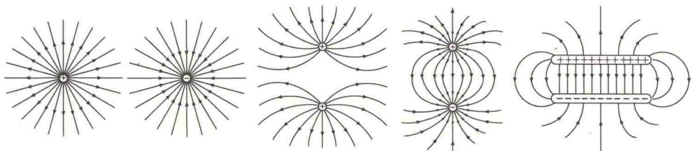  

图 9.6 几种常见电场的电场线

静电场的电场线有以下性质.

（1）它不形成闭合回线，也不中断，而是起自正电荷（或无穷远处），止于负电荷（或无穷远处）.

(2) 任何两条电场线不相交, 即静电场中每一点的电场强度是唯一的.

## 9.2.2 电通量

通过电场中任意给定面的电场线数称为通过该面的电通量,用符号 $\Phi_{e}$ 表示.

如图 9.7(a) 所示, 在均匀电场 E 中, 通过与 E 方向垂直的平面 S 的电通量为

$$

\Phi_ {\mathrm{e}} = E S

$$

若平面 S 的法向矢量 n 与 E 方向的夹角为 $\theta$ ，则平面 S 在垂直于 E 的方向上的投影面积为 $S' = S \cos \theta$ ，通过平面 S 的电通量等于通过面积 $S'$ 的电通量，即

$$

\Phi_ {\mathrm{e}} = E S ^ {\prime} = E S \cos \theta = \mathbf {E} \cdot \mathbf {S}

$$

式中，面积矢量 $S = Sn_0, n_0$ 为 $S$ 法线方向上的单位矢量，如图9.7(b)所示。计算非均匀电场中通过任意曲面 $S$ 的电通量时，要把该曲面划分为无限多个面元。一个无限小的面元 $\mathrm{d}S$ 的法线 $\pmb{n}$ 与电场强度 $\pmb{E}$ 的夹角为 $\theta$ ，如图9.7(c)所示，则通过面元 $\mathrm{d}S$ 的电通量为

$$

\mathrm{d} \Phi_ {\mathrm{e}} = E \cdot \mathrm{d} S

$$

通过曲面 S 的总电通量等于通过各面元的电通量的总和, 即

$$

\Phi_ {\mathrm{e}} = \int_ {S} \mathrm{d} \Phi_ {\mathrm{e}} = \int_ {S} \boldsymbol {E} \cdot \mathrm{d} \boldsymbol {S}\tag{9.11}

$$

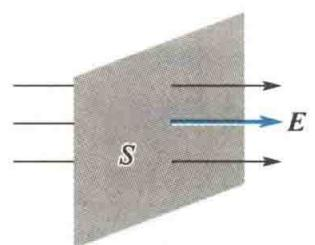  

(a)

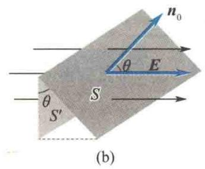

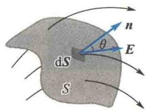  

图9.7 电通量  

(c)

当曲面 S 为闭合曲面时, 式(9.11) 写成

$$

\Phi_ {\mathrm{e}} = \oint_ {S} \boldsymbol {E} \cdot \mathrm{d} \boldsymbol {S}\tag{9.12}

$$

这时规定,面元 dS 的法线 n 的正方向为指向闭合曲面的外侧.因此,从曲面上穿出的电场线,电通量为正值;穿入曲面的电场线,电通量为负值.

<Example title="例 9.6">
图 9.8 中的虚线表示一立方形的闭合面，边长为 a。空间电场强度分布为 $E_{x} = bx, E_{y} = 0, E_{z} = 0, b$ 为正常数。求通过该闭合面的电通量。

<Solution title="解">
因为电场强度只有 $x$ 轴上的分量，所以只有图9.8中位于 $x = a$ 和 $x = 2a$ 且与 $yOz$ 平面平行的两侧面 $S_{1}$ 和 $S_{2}$ 上有电通量.因为左侧面 $S_{1}$ 的法线 $\pmb{n}$ 与 $\pmb{E}_x$ 的夹角为 $\pi$ ，所以通过 $S_{1}$ 的电通量为

$$

\Delta \Phi_ {\mathrm{el}} = E _ {x} S _ {1} \cos \pi = - b a ^ {3}

$$

同理,通过右侧面 $S_{2}$ 的电通量为

$$

\Delta \Phi_ {e 2} = E _ {x} S _ {2} \cos 0 = 2 b a ^ {3}

$$

通过该闭合面的总电通量为

$$

\Delta \Phi_ {\mathrm{e}} = \Delta \Phi_ {\mathrm{e1}} + \Delta \Phi_ {\mathrm{e2}} = b a ^ {3}

$$

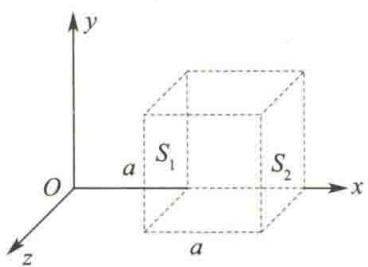  

图9.8 例9.6图

如果电场强度沿 x 轴均匀分布, 则通过该闭合面的电通量为零.
</Solution>
</Example>

## 9.2.3 高斯定理

高斯定理是静电场的一条基本原理,它给出了静电场中通过任意闭合曲面的电通量与该闭合曲面内所包围的电荷之间的量值关系.

先讨论点电荷电场的情况. 以点电荷 q 为中心, 取任意长度 r 为半径, 作闭合球面 S 包围点电荷, 如图 9.9(a) 所示. 在球面 S 上取面元 dS, 其法线 n 与面元处的电场强度 E 方向相同, 因此通过 dS 的电通量为

$$

\mathrm{d} \varPhi_ {\mathrm{e}} = E \cos 0 \mathrm{d} S = \frac {1}{4 \pi \varepsilon_ {0}} \frac {q}{r ^ {2}} \mathrm{d} S

$$

通过整个闭合球面 S 的电通量为

  

高斯

$$

\Phi_ {\mathrm{e}} = \oint_ {S} \mathrm{d} \Phi_ {\mathrm{e}} = \oint_ {S} \frac {q \mathrm{d} S}{4 \pi \varepsilon_ {0} r ^ {2}} = \frac {q}{4 \pi \varepsilon_ {0} r ^ {2}} \oint_ {S} \mathrm{d} S = \frac {q}{\varepsilon_ {0}}

$$

即通过闭合球面的电通量 $\Phi_{\mathrm{e}}$ 与半径 $r$ 无关，只与被球面所包围的电量 $q$ 有关.当 $q$ 是正电荷时， $\Phi_{\mathrm{e}} > 0$ ，表示电场线从正电荷发出且穿出球面；当 $q$ 是负电荷时， $\Phi_{\mathrm{e}} <   0$ ，表示电场线穿入球面且止于负电荷.

如果包围点电荷 q 的曲面是任意闭合曲面 $S'$ ，如图 9.9(b) 所示，可以在曲面 $S'$ 外作一以 q 为中心的球面 S，由于 S 与 $S'$ 之间没有其他电荷，从 q 发出的电场线不会中断，因此穿过 $S'$ 的电场线数与穿过 S 的电场线数相等。即通过包围点电荷 q 的任意闭合曲面的电通量仍为

$$

\Phi_ {\mathrm{e}} = \oint_ {S ^ {\prime}} \mathbf {E} \cdot \mathrm{d} \mathbf {S} = \frac {q}{\varepsilon_ {0}}

$$

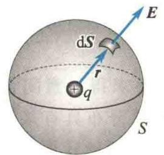

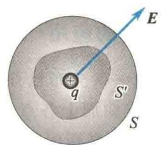  

(a) 从 $q$ 发出的电场线穿出球面 $S$  

(b) 从 $q$ 发出的电场线穿出任意闭合曲面 $S'$  

图9.9 点电荷 $q$ 在闭合曲面内

下面讨论点电荷 q 在闭合曲面 S 外的情况. 如图 9.10 所示, 只有与闭合曲面 S 相切的锥体范围内的电场线才能通过闭合曲面 S, 但每一条电场线从某处穿入必从另一处穿出, 一进一出, 相互抵消. 所以, 在闭合曲面 S 外的电荷对通过闭合曲面的电通量没有贡献, 通过不包围电荷 q 的闭合曲面 S 的电通量为零, 即

$$

\oint_ {S} \boldsymbol {E} \cdot \mathrm{d} \boldsymbol {S} = 0

$$

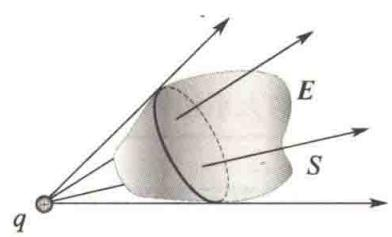  

图9.10 点电荷 $q$ 在闭合曲面 $S$ 外

对于任意带电系统(包含 n 个点电荷)的电场,有电场强度叠加原理:

$$

\pmb {E} = \sum_ {i = 1} ^ {n} \pmb {E} _ {i}

$$

式中， $E_{i}$ 是系统中某点电荷 $q_{i}$ 产生的电场强度。因此在这个电场中，通过任意闭合曲面 S 的电通量为

$$

\Phi_ {e} = \oint_ {S} \mathbf {E} \cdot \mathrm{d} \mathbf {S} = \oint_ {S} \left(\sum_ {i = 1} ^ {n} \mathbf {E} _ {i}\right) \cdot \mathrm{d} \mathbf {S}

$$

在闭合曲面取定的情况下,有

$$

\oint_ {S} \left(\sum_ {i = 1} ^ {n} \boldsymbol {E} _ {i}\right) \cdot \mathrm{d} \boldsymbol {S} = \sum_ {i = 1} ^ {n} \oint_ {S} \boldsymbol {E} _ {i} \cdot \mathrm{d} \boldsymbol {S}

$$

当某一点电荷 $q_{i}$ 位于闭合曲面 S 之内时，有

$$

\oint_ {S} \boldsymbol {E} _ {i} \cdot \mathrm{d} \boldsymbol {S} = \frac {q _ {i}}{\varepsilon_ {0}}

$$

当 $q_{i}$ 位于闭合曲面 $S$ 之外时，有

$$

\oint_ {S} \boldsymbol {E} _ {i} \cdot \mathrm{d} \boldsymbol {S} = 0

$$

因此

$$

\Phi_ {\mathrm{e}} = \oint_ {S} \boldsymbol {E} \cdot \mathrm{d} \boldsymbol {S} = \sum_ {i = 1} ^ {n} \oint_ {S} \boldsymbol {E} _ {i} \cdot \mathrm{d} \boldsymbol {S} = \frac {\sum q _ {i}}{\varepsilon_ {0}}\tag{9.13}

$$

式(9.13)中的 $q_{i}$ 只是那些被闭合曲面 $S$ 包围的电荷. 即通过真空中的静电场中任意闭合曲面的电通量 $\Phi_{\mathrm{e}}$ 等于包围在该闭合曲面内的电荷代数和 $\sum q_{i}$ 的 $\frac{1}{\varepsilon_0}$ , 而与闭合曲面外的电荷无关. 这就是静电场的高斯定理. 应当指出, 高斯定理说明通过闭合曲面的电通量只与该闭合曲面所包围的电荷有关, 并没有说闭合曲面上任意一点的电场强度只与闭合曲面所包围的电荷有关. 电场中任意一点的电场强度是由所有场源电荷, 即闭合曲面内、外所有电荷共同产生的.

  

高斯定理的应用

## 9.2.4 高斯定理的应用

如果带电体的电荷分布已知,根据高斯定理很容易求得任意闭合曲面的电通量,但不一定能确定曲面上各点的电场强度.只有当电荷分布具有某种对称性并取合适的闭合曲面(又称高斯面)时,才可以利用高斯定理方便地计算电场强度.

<Example title="例 9.7">
如图 9.11 所示, 求均匀带电球面的电场分布. 已知球面半径为 R, 带电量为 q.

<Solution title="解">
由于电荷分布是球对称的, 可判断出空间电场强度分布必然是球对称的, 即与球心 O 距离相等的球面上各点的电场强度的大小相等, 方向沿半径呈辐射状.

设 P 点到球心的距离为 r，取以球心 O 为中心、r 为半径的闭合球面 S 为高斯面，则 S 上的面元 dS 的法线 n 与面元处电场强度 E 的方向相同，且高斯面上各点电场强度大小相等，有

$$

\oint_ {S} \boldsymbol {E} \cdot \mathrm{d} \boldsymbol {S} = \oint_ {S} E \mathrm{d} S = E \oint_ {S} \mathrm{d} S = E 4 \pi r ^ {2}

$$

当 $P$ 点在带电球面内 $(r < R)$ 时

$$

\sum q _ {i} = 0

$$

因此

$$

\boldsymbol {E} = \boldsymbol {0}

$$

当 P 点在带电球面外 $(r > R)$ 时

布为

$$

\sum q _ {i} = q

$$

因此 $E = \frac{q}{4\pi\varepsilon_{0}r^{2}}r_{0}$ ，式中 $r_{0}$ 为 P 点位矢 r 方向上的单位矢量。q > 0 时，E 呈辐射状向外；q &lt; 0 时，E 呈辐射状向里。

利用类似的方法,可求得半径为R、总电量为q的均匀带电球体(带电的介质球)在空间的电场强度分
</Solution>
</Example>

<Example title="例 9.8">
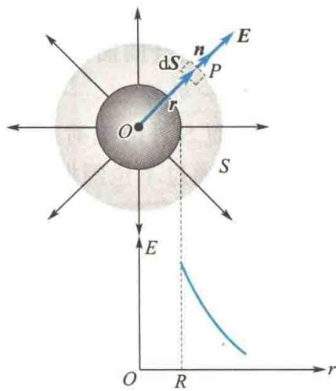  

图9.11 例9.7图
</Example>

<Note>
在 r = R 的球面上的各点处, 当球内、外的介电常量相等时, 均匀带电球体的电场强度是连续的, 而均匀带电球面的电场强度是不连续的.

$$

\pmb {E} = \left\{ \begin{array}{l l} \frac {q \pmb {r}}{4 \pi \varepsilon_ {0} R ^ {3}} & (r \leqslant R) \\ \frac {q \pmb {r} _ {0}}{4 \pi \varepsilon_ {0} r ^ {2}} & (r > R) \end{array} \right.

$$

一厚度为 $d$ 的无限大平板均匀带电，体电荷密度 $\rho > 0$ 。设板内、外的介电常量均为 $\varepsilon_0$ ，求板内、外电场强度分布。
</Note>

<Solution title="解">
如图 9.12 所示, $OO'$ 为板横截面的轴线. 由对称性可知, 位于 $OO'$ 轴两侧、与 $OO'$ 轴等距的 $\pm x$ 处电场强度的大小相等, 方向垂直于 $OO'$ 轴且指向两侧. 在板内作一个被板的中间面垂直平分的闭合圆柱面 $S_{1}, S_{1}$ 为高斯面，它的底面积为 $\Delta S$ ，底面与 $OO'$ 轴的垂直距离为 $x$ ，则

$$

\oint_ {S _ {1}} \boldsymbol {E} \cdot \mathrm{d} \boldsymbol {S} = 2 E \Delta S

$$

$$

\sum q _ {i} = 2 x \Delta S \rho

$$

所以

$$

E = \frac {\rho x}{\varepsilon_ {0}} \quad \left(| x | \leqslant \frac {d}{2}\right)

$$

同理可得板外一点电场强度大小为

$$

E = \frac {\rho d}{2 \varepsilon_ {0}} \quad \left(| x | > \frac {d}{2}\right)

$$

E 的方向垂直于板, $\rho>0$ 时向外, $\rho<0$ 时向内.

因为 $\rho d$ 表示单位面积上的电荷，即面电荷密度，所以当 $d\to 0$ 时，上述板就是无限大均匀带电平面.为保证 $\sigma = \rho d$ 为有限值，当 $d\rightarrow 0$ 时， $\rho \rightarrow \infty$ .由上述结果可得，无限大均匀带电平面外一点电场强度大小为 $\frac{\sigma}{2\varepsilon_0}$ ，其方向垂直于平面.顺便指出，对于 $d\neq 0$ 的无限大均匀带电平板，在板的两个侧面，板内、外的电场强度是连续的，如图9.12所示；只是采用了 $d = 0$ 的无厚度理想平面后,平面两侧的电场强度才不连续(虽然大小相等,但方向相反).可见,电场强度跃变是采用厚度为零的带电平面理想模型的结果.

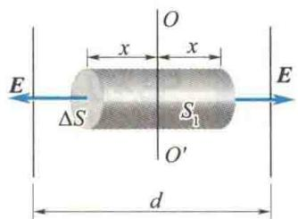

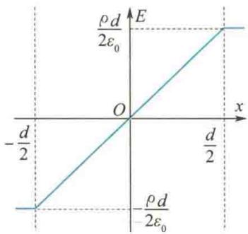  

图9.12 例9.8图
</Solution>

<Example title="例 9.9">
试求半径为 R、面电荷密度为 $\sigma$ 的无限长均匀带电圆柱面的电场强度.

<Solution title="解">
如图 9.13 所示,由于电荷分布的轴对称性,可以确定带电圆柱面产生的电场也具有轴对称性,即到圆柱面轴线的距离相等的各点电场强度的大小相等,方向都垂直于圆柱面.取过场点 P 的一同轴圆柱面为高斯面,圆柱面高为 l,底面半径为 $r(r > R)$ ,则通过高斯面底面的电通量为零,而通过高斯面侧面的电通量为 $2\pi rlE$ ,即

$$

\oint_ {S} \boldsymbol {E} \cdot \mathrm{d} \boldsymbol {S} = 2 \pi r l E

$$

而 $\sum q_{i} = \sigma 2\pi Rl$ ，可得

$$

E = \frac {R \sigma}{\varepsilon_ {0} r} (r > R)

$$

若令 $\lambda$ 表示圆柱面上单位长度的电量，即 $\lambda = 2\pi R\sigma$ ，则有

$$

E = \frac {\lambda}{2 \pi \varepsilon_ {0} r}

$$

同理可得，圆柱面内任意一点处电场强度大小为

$$

E = 0

$$

由此可见，当研究无限长均匀带电圆柱面对圆柱面外各点的作用时，可将其看作所有的电荷都集中在其轴线上的均匀带电直线.

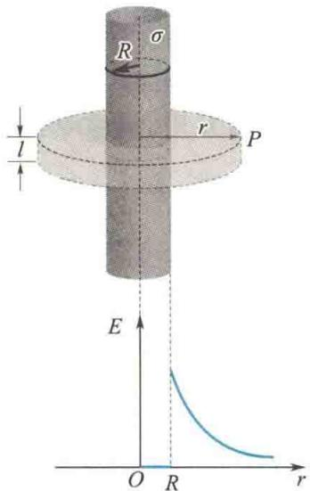  

图 9.13 无限长均匀带电圆柱面的电场

</Solution>
</Example>
