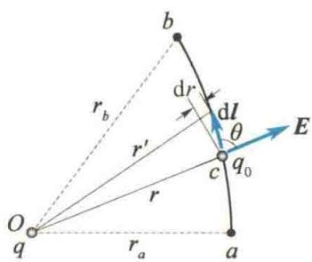
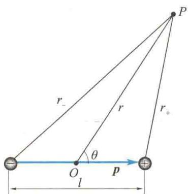
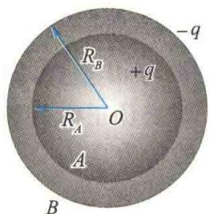

import Guide from '@/components/Guide.astro';
import Knowledge from '@/components/Knowledge.astro';
import Example from '@/components/Example.astro';
import Analysis from '@/components/Analysis.astro';
import Solution from '@/components/Solution.astro';
import Variant from '@/components/Variant.astro';
import Note from '@/components/Note.astro';
import Block from '@/components/Block.astro';
import Method from '@/components/Method.astro';
import Exercise from '@/components/Exercise.astro';

## 9.3.1 电场力的功

由静电场对外的主要表现可知,当电荷在电场中运动时,电场力对它做功.本节研究电荷在电场中移动时电场力做的功、电势能和电势.
在点电荷 q 的电场中, 试验电荷 $q_{0}$ 从 a 点经任意路径 acb 移动到 b 点时, 电场力对试验电荷 $q_{0}$ 做功.
如图 9.14 所示, 在路径中任意一点 c 附近取一元位移 dl, $q_{0}$ 在 dl 上受的电场力 $F = q_{0} E$ , F 与 dl 的夹角为 $\theta$ , 则电场力在 dl 上对试验电荷 $q_{0}$ 做的功为

$$
\mathrm{d} W = \boldsymbol {F} \cdot \mathrm{d} \boldsymbol {l} = q _ {0} \boldsymbol {E} \cdot \mathrm{d} \boldsymbol {l} = q _ {0} E \cos \theta \mathrm{d} l
$$
因为 $dl\cos\theta=r^{\prime}-r=dr$ ，为位矢模的增量，所以
$$
\mathrm{d} W = q _ {0} E \cos \theta \mathrm{d} l = q _ {0} E \mathrm{d} r = \frac {1}{4 \pi \varepsilon_ {0}} \frac {q _ {0} q}{r ^ {2}} \mathrm{d} r
$$
图 9.14 分析电场力做功
当试验电荷 $q_{0}$ 从 a 点移动到 b 点时，电场力做的功为
$$
W _ {a b} = \int_ {a} ^ {b} \mathrm{d} W = \int_ {r _ {a}} ^ {r _ {b}} \frac {1}{4 \pi \varepsilon_ {0}} \frac {q _ {0} q}{r ^ {2}} \mathrm{d} r = \frac {q _ {0} q}{4 \pi \varepsilon_ {0}} \left(\frac {1}{r _ {a}} - \frac {1}{r _ {b}}\right)\tag{9.14a}
$$
式中， $r_{a}$ 、 $r_{b}$ 分别表示路径的起点和终点到点电荷 q 的距离。可见，在点电荷 q 的电场中，电场力对试验电荷 $q_{0}$ 做的功只取决于移动路径的起点和终点的位置，而与路径无关。
上述结论可以推广到任意带电体产生的电场的情形.任何一个带电体都可以看作许多点电荷的集合,总电场强度E等于各点电荷产生的电场的电场强度的矢量和,即
$$
\boldsymbol {E} = \boldsymbol {E} _ {1} + \boldsymbol {E} _ {2} + \dots + \boldsymbol {E} _ {n}
$$
在电场 E 中, 试验电荷 $q_{0}$ 从 a 点沿任意路径 acb 移动到 b 点时, 电场力做的功为
$$
\begin{array}{r l} W _ {a b} & = \int_ {a} ^ {b} q _ {0} \boldsymbol {E} \cdot \mathrm{d} \boldsymbol {l} \\ & = \int_ {a} ^ {b} q _ {0} (\boldsymbol {E} _ {1} + \boldsymbol {E} _ {2} + \dots + \boldsymbol {E} _ {n}) \cdot \mathrm{d} \boldsymbol {l} \\ & = \int_ {a} ^ {b} q _ {0} \boldsymbol {E} _ {1} \cdot \mathrm{d} \boldsymbol {l} + \int_ {a} ^ {b} q _ {0} \boldsymbol {E} _ {2} \cdot \mathrm{d} \boldsymbol {l} + \dots + \int_ {a} ^ {b} q _ {0} \boldsymbol {E} _ {n} \cdot \mathrm{d} \boldsymbol {l} \\ & = \frac {q _ {0} q _ {1}}{4 \pi \varepsilon_ {0}} \left(\frac {1}{r _ {a 1}} - \frac {1}{r _ {b 1}}\right) + \frac {q _ {0} q _ {2}}{4 \pi \varepsilon_ {0}} \left(\frac {1}{r _ {a 2}} - \frac {1}{r _ {b 2}}\right) + \dots + \frac {q _ {0} q _ {n}}{4 \pi \varepsilon_ {0}} \left(\frac {1}{r _ {a n}} - \frac {1}{r _ {b n}}\right) \\ & = \sum_ {i = 1} ^ {n} \frac {q _ {0} q _ {i}}{4 \pi \varepsilon_ {0}} \left(\frac {1}{r _ {a i}} - \frac {1}{r _ {b i}}\right) \end{array}\tag{9.14b}
$$
式中， $r_{ai}$ 、 $r_{bi}$ 分别表示路径的起点和终点到点电荷 $q_{i}$ 的距离。式(9.14b)表明，电场力对试验电荷做的功仍只取决于路径的起点和终点的位置，而与路径无关。由此可得出结论：试验电荷在任何静电场中移动时，电场力所做的功只与电场的性质、试验电荷的电量及路径起点和终点的位置有关，而与路径无关。这说明静电力是保守力，静
电场是保守场.

## 9.3.2 静电场的环路定理

静电力做功与路径无关的特性还可以用另一种形式来表达. 设试验电荷 $q_{0}$ 从电场中的 a 点经任意路径 acb 到达 b 点, 再从 b 点经另一路径 bda 回到 a 点, 则静电力在整个闭合路径 acbda 上做的功为
$$
\begin{array}{r l} W & = \oint_ {l} q _ {0} \mathbf {E} \cdot \mathrm{d} \mathbf {l} = \int_ {a c b} q _ {0} \mathbf {E} \cdot \mathrm{d} \mathbf {l} + \int_ {b d a} q _ {0} \mathbf {E} \cdot \mathrm{d} \mathbf {l} \\ & = \int_ {a c b} q _ {0} \mathbf {E} \cdot \mathrm{d} \mathbf {l} - \int_ {a d b} q _ {0} \mathbf {E} \cdot \mathrm{d} \mathbf {l} = 0 \end{array}
$$
由于 $q_{0} \neq 0$ ，所以
$$
\oint_ {l} \boldsymbol {E} \cdot \mathrm{d} \boldsymbol {l} = 0\tag{9.15}
$$
式(9.15)左边是电场强度E沿闭合路径的积分,称为电场强度E的环流.它表明在静电场中,电场强度E的环流恒等于零,这一结论称为静电场的环路定理,它是静电场为保守场的数学表述.正是由于静电场存在这一性质,才能引进电势能和电势的概念.

## 9.3.3 电势能

在力学部分已经指出,任何保守力场都可以引入势能的概念.静电场是保守力场,相应地引入电势能的概念,即认为试验电荷 $q_{0}$ 在静电场中某一位置具有一定的电势能,用 $E_{p}$ 表示.当试验电荷 $q_{0}$ 从电场中的a点移动到b点时,电场力对它做的功等于相应电势能增量的负值,即
$$
W _ {a b} = \int_ {a} ^ {b} q _ {0} \boldsymbol {E} \cdot \mathrm{d} \boldsymbol {l} = - (E _ {\mathrm{p} b} - E _ {\mathrm{p} a}) = E _ {\mathrm{p} a} - E _ {\mathrm{p} b}\tag{9.16}
$$
式中， $E_{pa}$ 、 $E_{pb}$ 分别是试验电荷在a、b两点的电势能。电场力做正功时， $W_{ab}>0$ ，则 $E_{pa}>E_{pb}$ ，电势能减少；电场力做负功时， $W_{ab}<0$ ，则 $E_{pa}<E_{pb}$ ，电势能增大。
与其他形式的势能一样,电势能也是相对量.只有先选定一个电势能为零的参考点,才能确定电荷在某一点的电势能.电势能零点可以任意选择,如选择电荷在b点的电势能为零,即选定 $E_{pb}=0$ ,则由式(9.16)可得a点的电势能为
$$
E _ {\mathrm{pa}} = W _ {a b} = \int_ {a} ^ {b} q _ {0} E \cdot \mathrm{d} l
$$
上式表明,试验电荷 $q_{0}$ 在电场中任意一点 a 的电势能在数值上等于把 $q_{0}$ 由该点移动到电势能零点处时电场力所做的功. 当场源电荷局限在有限大小的空间里时,为了方便,常把电势能零点选在无穷远处,即规定 $E_{p\infty}=0$ , 则 $q_{0}$ 在 a 点的电势能为
$$
E _ {\mathrm{pa}} = \int_ {a} ^ {\infty} q _ {0} E \cdot \mathrm{d} l\tag{9.17}
$$
即规定无穷远处电势能为零时，试验电荷 $q_{0}$ 在电场中任意一点 a 的电势能在数值上等于把试验电荷 $q_{0}$ 由 a 点移动到无穷远处时电场力所做的功.
应该指出,与任何形式的势能相同,电势能是试验电荷和电场的相互作用能,它属于由试验电荷和电场组成的系统.

## 9.3.4 电势 电势差

式(9.17)表示,电势能 $E_{pa}$ 不仅与电场性质及a点位置有关,而且还与试验电荷$q_{0}$ 有关，但比值 $\frac{E_{\mathrm{pa}}}{q_0}$ 则与 $q_{0}$ 无关，仅由电场性质和 $a$ 点的位置决定.因此， $\frac{E_{\mathrm{pa}}}{q_0}$ 是描述电场中任意一点 $a$ 处电场性质的一个基本物理量，称为 $a$ 点的电势，用 $U_{a}$ 表示，即
$$
U _ {a} = \frac {E _ {\mathrm{pa}}}{q _ {0}} = \int_ {a} ^ {\infty} E \cdot \mathrm{d} l\tag{9.18}
$$
式(9.18)表明,若规定无穷远处为电势零点,则电场中某点a的电势在数值上等于把单位正电荷从该点沿任意路径移到无穷远处时电场力所做的功.
电势是标量. 在国际单位制(SI)中, 电势的单位名称是伏特, 符号为 V.
静电场中任意两点 $a$ 和 $b$ 的电势之差称为 $a, b$ 两点的电势差，也称为电压，用 $U_{ab}$ 表示. 即
$$
U _ {a b} = U _ {a} - U _ {b} = \int_ {a} ^ {\infty} \mathbf {E} \cdot \mathrm{d} \mathbf {l} - \int_ {b} ^ {\infty} \mathbf {E} \cdot \mathrm{d} \mathbf {l} = \int_ {a} ^ {b} \mathbf {E} \cdot \mathrm{d} \mathbf {l}
$$
上式表明,静电场中a、b两点的电势差等于单位正电荷从a点移动到b点时电场力做的功.据此,当任一电荷 $q_{0}$ 从a点移动到b点时,电场力做的功可用a、b两点的电势差表示,即
$$
W _ {a b} = q _ {0} (U _ {a} - U _ {b})\tag{9.19}
$$
电势零点的选择也是任意的. 通常, 当场源电荷分布在有限空间时, 取无穷远处为电势零点. 但当场源电荷的分布延伸到无穷远处时, 就不能再取无穷远处为电势零点, 否则会因积分不收敛而无法确定电势. 这时可在电场内另选一个合适的电势零点. 在许多实际问题中, 常常选取地球为电势零点.

## 9.3.5 电势的计算

### 1. 点电荷电场的电势

在点电荷电场中,电场强度为
  
电势的计算
$$
\pmb {E} = \frac {q}{4 \pi \varepsilon_ {0}} \frac {\pmb {r} _ {0}}{r ^ {2}}
$$
根据电势定义式(9.18)，在选取无穷远处为电势零点时，电场中任意一点a的电势为
$$
U _ {a} = \int_ {a} ^ {\infty} \boldsymbol {E} \cdot \mathrm{d} \boldsymbol {l} = \int_ {r} ^ {\infty} \frac {1}{4 \pi \varepsilon_ {0}} \frac {q}{r ^ {2}} \mathrm{d} r = \frac {q}{4 \pi \varepsilon_ {0} r}\tag{9.20}
$$

### 2. 电势叠加原理

若电场是点电荷系电场，则由电场强度叠加原理[式(9.8)]
$$
\boldsymbol {E} = \sum_ {i = 1} ^ {n} \frac {1}{4 \pi \varepsilon_ {0}} \frac {q _ {i}}{r _ {i} ^ {2}} \boldsymbol {r} _ {i 0}
$$
可以得到，在取 $U_{\infty} = 0$ 时，电场中任意一点 $a$ 的电势为
$$
\begin{array}{r l} U _ {a} & = \int_ {a} ^ {\infty} \boldsymbol {E} \cdot \mathrm{d} \boldsymbol {l} = \int_ {a} ^ {\infty} \left(\sum_ {i = 1} ^ {n} \frac {1}{4 \pi \varepsilon_ {0}} \frac {q _ {i}}{r _ {i} ^ {2}} \boldsymbol {r} _ {i 0}\right) \cdot \mathrm{d} \boldsymbol {l} \\ & = \sum_ {i = 1} ^ {n} \int_ {r _ {i}} ^ {\infty} \frac {q _ {i}}{4 \pi \varepsilon_ {0}} \frac {\boldsymbol {r} _ {i 0}}{r _ {i} ^ {2}} \cdot \mathrm{d} \boldsymbol {r} _ {i} = \sum_ {i = 1} ^ {n} \frac {q _ {i}}{4 \pi \varepsilon_ {0} r _ {i}} \end{array}
$$
对于电荷连续分布的有限大小带电体的电场,可以将其看成许多个电荷元 dq 产生的电场.把每一个电荷元看成一个点电荷,并取 $U_{\infty}=0$ 时,总电场在 a 点的电势就等于无限多个电荷元电场在 $a$ 点的电势之和，即
$$
U _ {a} = \int_ {V} \mathrm{d} U = \int_ {V} \frac {\mathrm{d} q}{4 \pi \varepsilon_ {0} r}
$$
式中，r 是电荷元 dq 到场点 a 的距离，V 是电荷连续分布的带电体的体积.

<Example title="例 9.10">
求电偶极子电场中任一点的电势. 电偶极子的电矩 p = ql.

<Solution title="解">
设电偶极子如图 9.15 所示, 取 $U_{\infty} = 0$ , 则对任意场点 P, 其电势为
$$
U = \frac {q}{4 \pi \varepsilon_ {0} r _ {+}} - \frac {q}{4 \pi \varepsilon_ {0} r _ {-}} = \frac {q}{4 \pi \varepsilon_ {0}} \frac {r _ {-} - r _ {+}}{r _ {+} r _ {-}}
$$
因为 $r \gg l$ ，所以
$$
r _ {-} \approx r + \frac {l}{2} \cos \theta , r _ {+} \approx r - \frac {l}{2} \cos \theta
$$
$$
r _ {-} - r _ {+} \approx l \cos \theta , r _ {+} r _ {-} \approx r ^ {2}
$$
得
$$
U \approx \frac {q l \cos \theta}{4 \pi \varepsilon_ {0} r ^ {2}} = \frac {p \cos \theta}{4 \pi \varepsilon_ {0} r ^ {2}}
$$
  
图9.15 例9.10图
式中， $\theta$ 为电偶极子中心 O 与场点 P 的连线和电偶极子轴的夹角，如图 9.15 所示.
</Solution>
</Example>

<Example title="例 9.11">
求均匀带电球面的电场中电势的分布. 设球面半径为 R, 总电量为 q.

<Solution title="解">
用电势定义法求解. 由高斯定理已求得均匀带电球面产生的电场的电场强度大小分布为
$$
E = \left\{ \begin{array}{l l} 0 & (r <   R) \\ \frac {q}{4 \pi \varepsilon_ {0} r ^ {2}} & (r > R) \end{array} \right.
$$
球面内一点的电势为
$$
U = \int_ {r} ^ {R} 0 \mathrm{d} r + \int_ {R} ^ {\infty} \frac {q}{4 \pi \varepsilon_ {0} r ^ {2}} \mathrm{d} r = \frac {q}{4 \pi \varepsilon_ {0} R} (r <   R)
$$
球面外 E 沿球半径方向, 所以球面外一点的电势为
可得出结论:均匀带电球面外各点的电势与全部电荷集中在球心时的点电荷的电势相同;球面内任意一点的电势都相等,且等于球面上的电势.
$$
U = \int_ {r} ^ {\infty} \frac {q}{4 \pi \varepsilon_ {0} r ^ {2}} \mathrm{d} r = \frac {q}{4 \pi \varepsilon_ {0} r} (r \geqslant R)
$$
</Solution>
</Example>

<Example title="例 9.12">
如图9.16所示，半径分别为 $R_{A}$ 和 $R_{B}$ 的两个同心均匀带电球面 $A$ 和 $B$ ，内球面 $A$ 带电 $+q$ ，外球面 $B$ 带电 $-q$ ，求 $A, B$ 两球面的电势差.

<Solution title="解">
方法一:用电势差的定义式计算,请读者自己完成.
方法二:用电势叠加原理计算.
</Solution>
</Example>

根据例 9.11 的结论, 球面 A 上的电荷 + q 在 A、B 球面上各点产生的电势分别为
$$
U _ {A} ^ {\prime} = \frac {q}{4 \pi \varepsilon_ {0} R _ {A}}, U _ {B} ^ {\prime} = \frac {q}{4 \pi \varepsilon_ {0} R _ {B}}
$$
而球面 B 上的电荷 - q 在 A、B 球面上各点产生的电
  
图9.16 例9.12图
势分别为
$$
U _ {A} ^ {\prime \prime} = \frac {- q}{4 \pi \varepsilon_ {0} R _ {B}}, U _ {B} ^ {\prime \prime} = \frac {- q}{4 \pi \varepsilon_ {0} R _ {B}}
$$
同理,球面 B 的总电势为
$$
U _ {B} = U _ {B} ^ {\prime} + U _ {B} ^ {\prime \prime} = 0
$$
所以球面 $A$ 的总电势为
$A, B$ 两球面的电势差为
$$
U _ {A} = U _ {A} ^ {\prime} + U _ {A} ^ {\prime \prime} = \frac {q}{4 \pi \varepsilon_ {0}} \left(\frac {1}{R _ {A}} - \frac {1}{R _ {B}}\right)
$$
$$
U _ {A B} = U _ {A} - U _ {B} = \frac {q}{4 \pi \varepsilon_ {0}} \left(\frac {1}{R _ {A}} - \frac {1}{R _ {B}}\right)
$$

<Example title="例 9.13">
求线电荷密度为 $\lambda$ 的无限长带电直线的电场中任意一点的电势.

<Solution title="解">
因为电荷分布具有轴对称性,所以可以确定均匀带电直线所产生的电场也具有轴对称性,即到轴(带电直线)的距离相等的各点电场强度的大小相等,方向垂直于带电直线.基于高斯定理,可求得到轴的距离为 r 处的电场强度大小为(具体求解过程可参考例 9.9)
$$
E = \frac {\lambda}{2 \pi \varepsilon_ {0} r}
$$
方向沿径向向外. 取到轴的距离为 $r_{0}$ 的位置为电势零点, 并依据电势的定义式, 可得电场中到轴的距离为 r 处的电势为
$$
U = \int_ {r} ^ {r _ {0}} \frac {\lambda \mathrm{d} r}{2 \pi \varepsilon_ {0} r} = \frac {\lambda}{2 \pi \varepsilon_ {0}} \ln \frac {r _ {0}}{r}
$$
思考:为什么不能取无穷远处为电势零点?
</Solution>
</Example>
