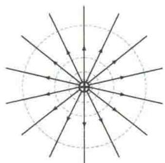
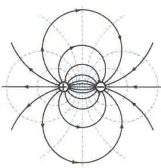
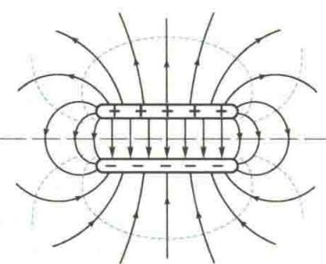
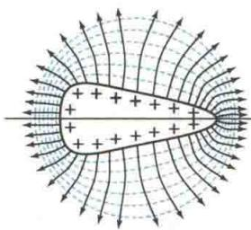
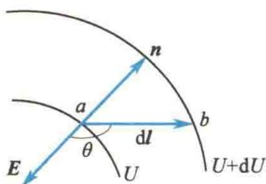
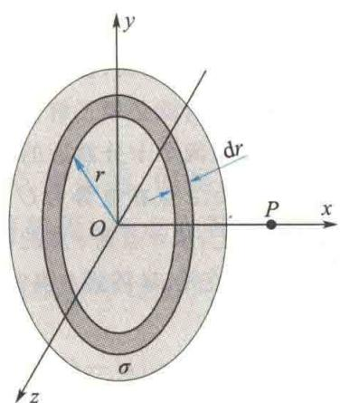

import Guide from '@/components/Guide.astro';
import Knowledge from '@/components/Knowledge.astro';
import Example from '@/components/Example.astro';
import Analysis from '@/components/Analysis.astro';
import Solution from '@/components/Solution.astro';
import Variant from '@/components/Variant.astro';
import Note from '@/components/Note.astro';
import Block from '@/components/Block.astro';
import Method from '@/components/Method.astro';
import Exercise from '@/components/Exercise.astro';

## 9.4.1 等势面

电势是标量,静电场中各点的电势一般是逐点变化的.但是,总存在某些电势相等的点.由电势相等的各点所构成的曲面叫作等势面.如点电荷电场中,电势 $U=\frac{q}{4\pi\varepsilon_{0}r}$ ,说明其等势面是球面.而点电荷电场的电场线沿半径方向,所以电场线与等势面处处正交.

实际上,不仅是点电荷的电场,在任意静电场中,等势面与电场线总是处处正交.证明如下.

设在任意静电场中,电荷 $q_{0}$ 沿着等势面上一位移元 dl 从 a 点移到 b 点,则电场力做的功为

$$

\mathrm{d} W = q _ {0} \boldsymbol {E} \cdot \mathrm{d} l = q _ {0} E \cos \theta \mathrm{d} l = q _ {0} (U _ {a} - U _ {b}) = 0

$$

因为上式中 $q_{0}, E, \mathrm{d}l$ 均不等于零，所以

$$

\cos \theta = 0, \qquad \theta = \frac {\pi}{2}

$$

说明 E 与 dl 垂直, 即电场线与等势面正交.

如果让正电荷 $q_{0}$ 沿任意静电场的电场线上的位移元 $\mathrm{d}l$ 从 $a$ 点移到 $b^{\prime}$ 点，则电场力做的功为

$$

\mathrm{d} W ^ {\prime} = q _ {0} E \cdot \mathrm{d} l = q _ {0} E \mathrm{d} l \cos 0 = q _ {0} E \mathrm{d} l > 0

$$

又有

$$

\mathrm{d} W ^ {\prime} = q _ {0} (U _ {a} - U _ {b ^ {\prime}})

$$

因此 $U_{a}-U_{b'}>0$ ，即 $U_{a}>U_{b'}$ ，电场线总是指向电势降落的方向。

为了使等势面能反映电场的强弱,画等势面时,规定电场中任意两相邻等势面间的电势差都相等,则电场强度较大的区域等势面较密集,电场强度较小的区域等势面较稀疏.

测绘等势面是研究电场的一种有效方法. 在实际应用中, 经常先通过测量绘出带电体周围电场的等势面, 再由此推知电场的分布.

图 9.17 所示为几种常见电场的等势面和电场线, 图中的虚线表示等势面, 实线表示电场线.

  

(a) 正点电荷

  

(b) 电偶极子

  

(c) 正、负带电板  

图 9.17 几种常见电场的等势面和电场线

  

(d) 不规则形状的带电导体

## \*9.4.2 电场强度与电势梯度的关系

电势定义式 $U = \int_{r}^{\infty}E\cdot \mathrm{d}l$ 反映了静电场中电势与电场强度的积分关系，在求出电场强度分布后，可由该式求得电势分布.然而，在许多实际问题中，静电场的电势分布往往更容易求得，要由电势分布求得电场强度分布，就必须了解电场强度与电势的微分关系.

在任意静电场中，取两个十分靠近的等势面，电势分别为 $U$ 和 $U + \mathrm{d}U$ ，且设 $\mathrm{d}U > 0,a$ 点在电势为 $U$ 的等势面上， $b$ 点在电势为 $U + \mathrm{d}U$ 的等势面上，从 $a$ 点到 $b$ 点的位移元为dl，如图9.18所示.当正电荷 $q_{0}$ 从 $a$ 点沿dl移到 $b$ 点时，电场强度 $\pmb{E}$ 近似不变，则电场力做的功为

$$

W = q _ {0} (U _ {a} - U _ {b}) = q _ {0} [ U - (U + \mathrm{d} U) ] = - q _ {0} \mathrm{d} U

$$

  

图9.18 $E$ 与 $U$ 的关系

另外

$$

W = q _ {0} \boldsymbol {E} \cdot \mathrm{d} \boldsymbol {l} = q _ {0} E \cos \theta \mathrm{d} l = q _ {0} E _ {l} \mathrm{d} l

$$

式中， $E_{l}=E\cos\theta$ ，是电场强度E在dl方向上的分量。由上面两式可得

$$

- \mathrm{d} U = E _ {l} \mathrm{d} l

$$

即

$$

E _ {l} = - \frac {\mathrm{d} U}{\mathrm{d} l}

$$

此式表明:电场中某一点的电场强度 E 沿某一方向的分量 $E_{l}$ 等于电势沿该方向变化率的负值. 显然, 在直角坐标系中, U 是 x、y、z 的函数, 电场强度 E 在 x 轴、y 轴、z 轴三个方向上的分量分别为

$$

E _ {x} = - \frac {\partial U}{\partial x}, E _ {y} = - \frac {\partial U}{\partial y}, E _ {z} = - \frac {\partial U}{\partial z}

$$

即电场强度 E 的矢量表达式可写成

$$

\boldsymbol {E} = - \left(\frac {\partial U}{\partial x} \boldsymbol {i} + \frac {\partial U}{\partial y} \boldsymbol {j} + \frac {\partial U}{\partial z} \boldsymbol {k}\right)\tag{9.21a}

$$

在数学上，矢量 $\frac{\partial U}{\partial x} i + \frac{\partial U}{\partial y} j + \frac{\partial U}{\partial z} k$ 称为电势的梯度，用 $\operatorname{grad} U$ 或 $\nabla U$ 表示. 因此，式(9.21a)又可写成

$$

\boldsymbol {E} = - \operatorname{grad} U = - \nabla U\tag{9.21b}

$$

式中

$$

\nabla = \frac {\partial}{\partial x} \boldsymbol {i} + \frac {\partial}{\partial y} \boldsymbol {j} + \frac {\partial}{\partial z} \boldsymbol {k}

$$

式(9.21b)表明:电场中任意一点的电场强度等于该点电势梯度的负值.在国际单位制(SI)中,电势梯度的单位名称为伏特每米,符号为V/m,电场强度也用这个单位.

由图9.18可知，在两等势面之间，从 $a$ 点沿不同方向的电势变化率不同。其中沿等势面法线 $\pmb{n}$ 方向的电势变化率最大。若以 $\mathrm{dn}$ 表示 $a$ 点处两等势面的法向距离， $n_0$ 表示法线 $\pmb{n}$ 方向上的单位矢量，同时考虑到电场线与等势面正交且指向电势降落的方向， $\pmb{n}$ 指向电势升高的方向，即电场强度 $E$ 沿法线 $\pmb{n}$ 的相反方向，则有

压电体

$$

\pmb {E} = - \frac {\mathrm{d} U}{\mathrm{d} n} \pmb {n} _ {0}

$$

因为电势梯度与电场强度的关系为

$$

\operatorname{grad} U = \nabla U = - E

$$

所以电势梯度为

$$

\mathbf {g r a d} U = \nabla U = \frac {\mathrm{d} U}{\mathrm{d} n} \boldsymbol {n} _ {0}

$$

即电势梯度是一个矢量,它的大小为电势沿等势面法线方向的变化率,它的方向沿等势面法线方向且指向电势增大的方向.

<Example title="例 9.14">
利用电场强度与电势梯度的关系,求半径为 R、面电荷密度为 $\sigma$ 的均匀带电圆盘轴线上的电场强度.

<Solution title="解">
如图 9.19 所示, 取圆环 $dS = 2\pi r dr$ , 圆环的带电量 $dq = \sigma 2\pi r dr = \sigma \pi dr^{2}$ , 电荷 dq 在轴线上距离圆盘中心 O 点 x 的 P 点产生的电势为

$$

\mathrm{d} U = \frac {\sigma \pi \mathrm{d} r ^ {2}}{4 \pi \varepsilon_ {0} (r ^ {2} + x ^ {2}) ^ {1 / 2}}

$$

则圆盘在 $P$ 点产生的电势为

$$

\begin{array}{r l} U & = \int \mathrm{d} U = \frac {\sigma}{4 \varepsilon_ {0}} \int_ {0} ^ {R} \frac {\mathrm{d} r ^ {2}}{(r ^ {2} + x ^ {2}) ^ {1 / 2}} \\ & = \frac {\sigma}{2 \varepsilon_ {0}} (\sqrt {R ^ {2} + x ^ {2}} - x) \end{array}

$$

因此 $P$ 点处的电场强度分量为

$$

E _ {x} = - \frac {\partial U}{\partial x} = \frac {\sigma}{2 \varepsilon_ {0}} \left(1 - \frac {x}{\sqrt {R ^ {2} + x ^ {2}}}\right)

$$

$$

E _ {y} = - \frac {\partial U}{\partial y} = 0

$$

图9.19 例9.14图

$$

E _ {z} = - \frac {\partial U}{\partial z} = 0

$$

即轴线上一点的电场强度为

$$

\boldsymbol {E} = \frac {\sigma}{2 \varepsilon_ {0}} \left(1 - \frac {x}{\sqrt {R ^ {2} + x ^ {2}}}\right) \boldsymbol {i}

$$

</Solution>
</Example>
