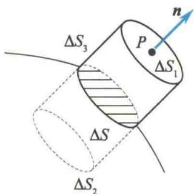
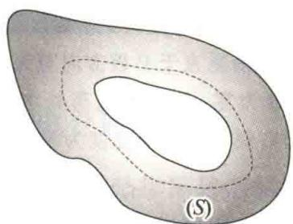
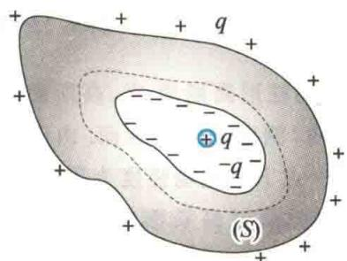
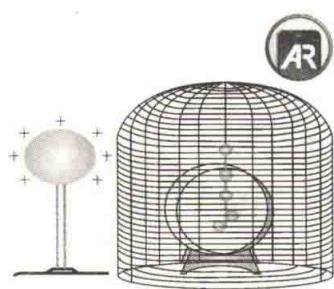
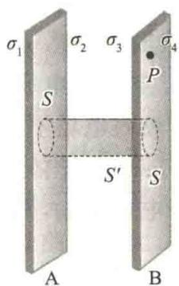
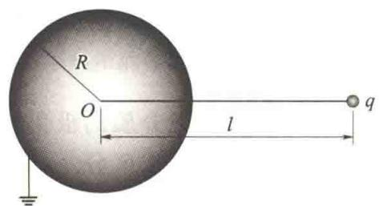

import QRCodeVideo from '@/components/QRCodeVideo.astro';

import Guide from '@/components/Guide.astro';
import Knowledge from '@/components/Knowledge.astro';
import Example from '@/components/Example.astro';
import Analysis from '@/components/Analysis.astro';
import Solution from '@/components/Solution.astro';
import Variant from '@/components/Variant.astro';
import Note from '@/components/Note.astro';
import Block from '@/components/Block.astro';
import Method from '@/components/Method.astro';
import Exercise from '@/components/Exercise.astro';

## 9.5.1 导体的静电平衡

导体的特点是其内部存在大量的自由电荷,对金属导体而言,就是存在大量的自由电子(在没有特殊说明的情况下,本书讨论的都是金属导体).在电场力的作用下,一个不带电的中性导体上的自由电子会做定向运动,从而改变该导体上的电荷分布,使导体处于带电状态,这就是静电感应.导体由于静电感应而带的电荷称为感应电荷.同时,感应电荷又会影响电场分布.因此,当电场中有导体存在时,电荷分布和电场分布相互影响、相互制约.当导体中的自由电子没有做定向运动时,称导体处于静电平衡状态.导体达到静电平衡状态所满足的条件叫作静电平衡条件.
显然,导体的静电平衡条件是:导体内部的电场强度为零,在导体表面附近电场强度沿表面的法线方向.这里所说的电场强度,指的是外加的电场强度 $E_{0}$ 和感应电荷产生的附加电场强度 $E^{\prime}$ 叠加后的总电场强度,即 $E=E_{0}+E^{\prime}$ .可以设想,如果导体内电场强度E不是处处为零,则在E不为零的地方,自由电子将做定向运动;如果导体表面附近电场有沿导体表面切线方向的分量,则导体表面层电子将沿表面做定向运动,这都不是静电平衡状态(表面层的电子受表面偶极层的约束,不会沿法线方向做定向运动).这就证明了上述静电平衡条件是导体静电平衡的必要条件.如果进一步运用静电场边值问题的唯一性定理,即一定的边界条件可将空间静电场分布唯一地确定下来,则可以证明上述条件也是导体静电平衡的充分条件.限于课程性质,证明过程在此不加详述.
<QRCodeVideo title="导体静电平衡时电荷分布特点" url="https://api.guangyiedu.com/v3/resource/resource/r/NewQrCode-SoAPQjvlqWPsvhUe6gTU" />  
处于静电平衡状态的导体,除了电场强度满足上述静电平衡条件外,还具有以下性质.
(1) 导体是等势体, 导体表面是等势面.
导体内任意两点 P 和 Q 之间的电势差 $U_{PQ} = \int_{P}^{Q} E \cdot dl = 0$ ，因此导体是等势体，其表面是等势面。另外，由电场强度方向与等势面正交的性质也可以判定导体表面是等势面。
(2) 导体内部处处没有未被抵消的净电荷, 净电荷只分布在导体的表面.
按照高斯定理 $\oint_{S} \mathbf{E} \cdot \mathrm{d}\mathbf{S} = \frac{\sum q_i}{\varepsilon_0} = \frac{\int_V \rho \mathrm{d}V}{\varepsilon_0}$ , 其中 $V$ 是导体内部任意闭合曲面 $S$ 所包围的体积, 因为导体内部电场强度 $\mathbf{E}$ 处处为零且闭合曲面 $S$ 可以无限缩小直至只包围一个点, 所以导体内部体电荷密度 $\rho$ 处处为零.
（3）导体外部，导体表面附近处的电场强度大小与导体表面在该处的面电荷密度 $\sigma$ 的关系为
$$
E = \frac {\sigma}{\varepsilon_ {0}}\tag{9.22}
$$
如图 9.20 所示, 设 P 点是导体外紧靠表面处的任意一点, 在邻近 P 点的导体表面取一面元 $\Delta S$ , 作薄扁圆柱形闭合高斯面, 使其上底面 $\Delta S_{1}$ 通过 P 点, 下底面 $\Delta S_{2}$ 在导体内部, 两底面均与导体表面的面元 $\Delta S$ 平行且无限靠近, $\Delta S_{1} = \Delta S_{2} = \Delta S$ . 侧面 $\Delta S_{3}$ 与 $\Delta S$ 垂直, 则通过该闭合高斯面的电通量为
$$
\begin{array}{r l} \Phi_ {\mathrm{e}} & = \oint_ {S} \boldsymbol {E} \cdot \mathrm{d} \boldsymbol {S} \\ & = \int_ {\Delta S _ {1}} \boldsymbol {E} \cdot \mathrm{d} \boldsymbol {S} + \int_ {\Delta S _ {2}} \boldsymbol {E} \cdot \mathrm{d} \boldsymbol {S} + \int_ {\Delta S _ {3}} \boldsymbol {E} \cdot \mathrm{d} \boldsymbol {S} \end{array}
$$
  
图 9.20 导体表面的电场强度
因为 $\Delta S_{2}$ 在导体内部, 面上各点电场强度为零, $\Delta S_{3}$ 上各点电场强度与 dS 垂直, 所以
$$
\Phi_ {e} = \oint_ {S} \mathbf {E} \cdot \mathrm{d} \mathbf {S} = \int_ {\Delta S _ {1}} \mathbf {E} \cdot \mathrm{d} \mathbf {S} = E \Delta S
$$
而闭合高斯面内包围的净电荷为 $\sigma\Delta S$ ，因此电场强度大小为
$$
E = \frac {\sigma}{\varepsilon_ {0}}\tag{9.23}
$$
当 $\sigma > 0$ 时， $E$ 垂直于导体表面向外；当 $\sigma < 0$ 时， $E$ 垂直于导体表面向内。式(9.23)给出了导体表面每一点面电荷密度与其附近电场强度之间的对应关系。注意，导体表面附近电场强度 $E$ 是导体表面所有电荷及周围其他带电体上的电荷共同产生的，这些电荷对电场强度的影响由 $\sigma$ 体现。当电荷分布或电场强度分布改变时， $\sigma$ 和 $E$ 都会改变，但 $\sigma$ 与 $E$ 的关系 $E = \frac{\sigma}{\varepsilon_0}$ 不变。
<QRCodeVideo title="金属表面为什么容易反射电磁波？" url="https://api.guangyiedu.com/v3/resource/resource/r/NewQrCode-8wAP0QdnvlgduolWSvb2" />  
至于导体表面的电荷究竟怎样分布,这个问题的定量研究比较复杂.它不仅与导体的形状有关,还与导体附近有什么样的物体(带电的或不带电的)有关.对于孤立的带电导体来说,面电荷密度 $\sigma$ 与表面曲率之间一般不存在单一的函数关系.大致说来,导体表面凸出处曲率较大, $\sigma$ 也较大;导体表面较平坦处曲率较小, $\sigma$ 也较小;导体表面凹陷处曲率为负值, $\sigma$ 则更小.由式(9.23)可知,导体表面电场强度大小分布也与 $\sigma$ 分布相似,即尖端处电场强度大,平坦处电场强度次之,凹进去处电场强度更小.
<QRCodeVideo title="闪电为什么是弯弯曲曲的？" url="https://api.guangyiedu.com/v3/resource/resource/r/NewQrCode-1HL48gv0k2xsPYglWsKA" />  
导体表面尖端处电场特别强,会导致一个重要结果,即尖端放电.这类放电只发生在靠近导体表面很薄的一层空气里.空气中少量残留的带电离子在强电场作用下激烈运动,它们与空气分子碰撞时会令空气分子电离,产生大量新的离子,使原先不导电的空气变得易于导电.与导体尖端电荷异号的离子受到吸引而趋向尖端,与导体尖端电荷同号的离子受到排斥而加速离开尖端,形成高速离子流,即通常所说的“电风”.尖端附近空气电离时,在黑暗中可以看到尖端附近隐隐笼罩着一层光晕,称为电晕.高压输电线附近的电晕效应会浪费大量电能.为避免这种现象,高压输电线的表面应做得极为光滑,且横截面半径也不能过小.此外,一些高压设备的电极也常常做成光滑的球面,以避免放电,维持高电压.避雷针则是利用尖端放电原理来防止雷击对建筑物的破坏.避雷针必须保持良好接地,否则结果会适得其反.

## 9.5.2 导体壳和静电屏蔽

### 1. 空腔内无带电体的情况

当导体壳空腔内没有其他带电体时，在静电平衡条件下，导体壳内表面上没有电荷，电荷只分布在导体壳的外表面上，而且空腔内没有电场，或者说空腔内的电势处处相等.
为了证明上述结论,我们在导体壳的内、外表面之间取一闭合曲面 S, 将空腔包围起来, 如图 9.21(a) 所示. 由于 S 完全处于导体的内部, 根据静电平衡条件, S 面上电场强度处处为零. 由高斯定理可推知, 在 S 面内电荷代数和为零. 因为空腔内无带电体, 所以空腔内表面的电荷代数和也为零. 进一步利用反证法可证明, 达到静电平衡时, 导体壳内表面上的面电荷密度 $\sigma$ 必定处处为零. 否则, 如果有的地方 $\sigma < 0$ , 则必有另一处 $\sigma > 0$ ，两处之间必有电场线相连，必有电势差，而这一结论与静电平衡时导体是等势体互相矛盾。
因为在导体壳内表面上 $\sigma$ 处处为零, 所以内表面附近 E 处处为零, 电场线不可能起于(或止于)内表面; 同时, 空腔内无带电体, 在空腔内不可能有另外的电场线的端点; 静电场的电场线又不可能闭合. 由此可知, 空腔内没有电场线, 即空腔内不可能有电场, 空腔内各点电势处处相等.

### 2. 空腔内有带电体的情况

当导体壳空腔内有其他带电体时，如图9.21(b)所示，在空腔内放一带电体 $+q$ 。我们可以同样在导体壳内、外表面间作一闭合曲面 $S$ 。由静电平衡条件和高斯定理，不难求出 $S$ 面内电荷的代数和为零，因此导体壳内表面上要感应出电荷 $-q$ ，即导体壳内表面所带电荷与空腔内带电体的电荷等量异号。空腔内电场线起自带电体上的电荷 $+q$ 而止于导体壳内表面上的感应电荷 $-q$ ，空腔内电场不为零，带电体与导体壳之间有电势差。同时，外表面相应地感应出电荷 $+q$ 。如果导体壳本身不带电，那么导体壳外表面只有感应电荷 $+q$ 。如果导体壳本身带电量为 $Q$ ，则导体壳外表面所带电量为 $(Q + q)$ 。
  
(a) 空腔内无带电体的情况
  
(b) 空腔内有带电体的情况  
图 9.21 静电平衡时导体壳的电荷分布

### 3. 静电屏蔽

如上文所述，在静电平衡条件下，不论导体壳本身带电还是导体壳处于外界电场中，空腔内无其他带电体时导体壳内部没有电场。这样，导体壳的表面就“保护”了它所包围的区域，使之不受导体壳外表面的电荷或外界电场的影响。接地良好的导体壳还可以把空腔内带电体对外界的影响全部消除（上述导体壳的外表面所带感应电荷 $+q$ 全部入地）。总之，导体壳内部电场不受壳外电荷的影响，接地导体壳使得外部电场不受壳内电荷的影响，壳内电荷对外界也不产生影
  
静电屏蔽

响. 这种现象称为静电屏蔽. 前者称为外屏蔽, 后者称为全屏蔽.
在防止信号干扰方面,静电屏蔽原理有重要的应用.例如,一些电子仪器常采用金属外壳,以使内部电路不受外界电场的干扰;传递电信号的电缆线常用金属丝网罩作为屏蔽层;在高压设备的外面罩上接地的金属网栅,以使高压带电体不影响外界;等等.
<QRCodeVideo title="导体静电平衡时的计算" url="https://api.guangyiedu.com/v3/resource/resource/r/NewQrCode-gdeW5UGxIrMRmMl6tzQz" />  

## 9.5.3 有导体存在的静电场电场强度与电势的计算

在计算有导体存在的静电场分布时,首先要根据静电平衡条件和电荷守恒定律,确定导体上新的电荷分布,然后由新的电荷分布求电场的分布.

<Example title="例 9.15">
有一块大金属板 A, 面积为 S, 带电量为 $Q_{A}$ . 今把另一带电量为 $Q_{B}$ 的相同的金属板 B 平行地放在 A 板的右侧（板的长和宽均远大于板的厚度）. 试求 A、B 两板上的电荷分布及空间电场强度分布. 如果把 B 板接地, 情况又如何?

<Solution title="解">
如图 9.22 所示, 静电平衡时, 电荷只分布在板的表面. 忽略边缘效应, 可以认为 A、B 两板的四个平行的表面上的电荷是均匀分布的. 设四个表面上的面电荷密度分别为 $\sigma_{1}$ 、 $\sigma_{2}$ 、 $\sigma_{3}$ 和 $\sigma_{4}$ . 由电荷守恒定律可得

$$
\begin{array}{l} \sigma_ {1} S + \sigma_ {2} S = Q _ {\mathrm{A}} \\ \sigma_ {3} S + \sigma_ {4} S = Q _ {\mathrm{B}} \end{array}
$$
图9.22 例9.15图
作如图 9.22 所示的圆柱形高斯面 $S'$ ，高斯面的两底面分别在两金属板内，侧面垂直于板面。由于在金属板（如 B 板）内任意一点 P 的电场强度为零，两板间的电场垂直于板面，因此通过高斯面的电通量为 $\oint_{S'} E \cdot dS = 0$ ，由此可知
$$
\sigma_ {2} + \sigma_ {3} = 0
$$
另外，由电场强度叠加原理可知，金属板（如 B 板）内任意一点 P 的电场强度应是四个表面上电荷在该点产生的电场强度的叠加.
设由 A 板指向 B 板的方向为电场强度的正方向, 则
$$
\frac {\sigma_ {1}}{2 \varepsilon_ {0}} + \frac {\sigma_ {2}}{2 \varepsilon_ {0}} + \frac {\sigma_ {3}}{2 \varepsilon_ {0}} - \frac {\sigma_ {4}}{2 \varepsilon_ {0}} = 0
$$
联立求解以上四式可得
$$
\sigma_ {1} = \sigma_ {4} = \frac {Q _ {\mathrm{A}} + Q _ {\mathrm{B}}}{2 S}
$$
$$
\sigma_ {2} = - \sigma_ {3} = \frac {Q _ {\mathrm{A}} - Q _ {\mathrm{B}}}{2 S}
$$
根据电场强度叠加原理, 可求得各区域电场强度如下.
A 板左侧: $E_{1}=\frac{\sigma_{1}}{2\varepsilon_{0}}+\frac{\sigma_{2}}{2\varepsilon_{0}}+\frac{\sigma_{3}}{2\varepsilon_{0}}+\frac{\sigma_{4}}{2\varepsilon_{0}}=\frac{Q_{\mathrm{A}}+Q_{\mathrm{B}}}{2\varepsilon_{0}S}$ ，当 $(Q_{\mathrm{A}}+Q_{\mathrm{B}})>0$ 时， $E_{1}$ 的方向向左；当 $(Q_{\mathrm{A}}+Q_{\mathrm{B}})<0$ 时， $E_{1}$ 的方向向右.
两板之间： $E_{2} = \frac{\sigma_{1}}{2\varepsilon_{0}} +\frac{\sigma_{2}}{2\varepsilon_{0}} -\frac{\sigma_{3}}{2\varepsilon_{0}} -\frac{\sigma_{4}}{2\varepsilon_{0}} = \frac{Q_{\mathrm{A}} - Q_{\mathrm{B}}}{2\varepsilon_{0}S},$ 当 $(Q_{\mathrm{A}}-Q_{\mathrm{B}})>0$ 时， $E_{2}$ 的方向向右；当 $(Q_{\mathrm{A}}-Q_{\mathrm{B}})<0$ 时， $E_{2}$ 的方向向左.
B 板右侧: $E_{3}=\frac{\sigma_{1}}{2\varepsilon_{0}}+\frac{\sigma_{2}}{2\varepsilon_{0}}+\frac{\sigma_{3}}{2\varepsilon_{0}}+\frac{\sigma_{4}}{2\varepsilon_{0}}=\frac{Q_{\mathrm{A}}+Q_{\mathrm{B}}}{2\varepsilon_{0}S}$ ，当 $(Q_{\mathrm{A}}+Q_{\mathrm{B}})>0$ 时， $E_{3}$ 的方向向右；当 $(Q_{\mathrm{A}}+Q_{\mathrm{B}})<0$ 时， $E_{3}$ 的方向向左.
以上结果适用于 $Q_{A}$ 、 $Q_{B}$ 为任何极性、任意大小的带电情况.
当 B 板接地时，设 $\sigma_{1}^{\prime}$ 、 $\sigma_{2}^{\prime}$ 、 $\sigma_{3}^{\prime}$ 和 $\sigma_{4}^{\prime}$ 分别表示 A、B 两板的四个表面上的面电荷密度。因为 B 板接地，所以 $U_{B}=0$ 。因为由 B 板沿垂直于 B 板方向至无穷远处电场强度 E 的线积分为零，且在无电荷处电场是连续的，所以在 B 板的右侧区间电场强度为零，即有
$$
\frac {1}{2 \varepsilon_ {0}} (\sigma_ {1} ^ {\prime} + \sigma_ {2} ^ {\prime} + \sigma_ {3} ^ {\prime} + \sigma_ {4} ^ {\prime}) = 0
$$
A 板上电荷仍守恒,有
$$
\sigma_ {1} ^ {\prime} S + \sigma_ {2} ^ {\prime} S = Q _ {\mathrm{A}}
$$
由高斯定理仍可得
$$
\sigma_ {2} ^ {\prime} + \sigma_ {3} ^ {\prime} = 0
$$
由B板内部任意一点 $P$ 处的电场强度为零仍可得
$$
\frac {1}{2 \varepsilon_ {0}} (\sigma_ {1} ^ {\prime} + \sigma_ {2} ^ {\prime} + \sigma_ {3} ^ {\prime} - \sigma_ {4} ^ {\prime}) = 0
$$
由以上四式可得
$$
\begin{array}{r} \sigma_ {1} ^ {\prime} = \sigma_ {4} ^ {\prime} = 0 \\ \sigma_ {2} ^ {\prime} = - \sigma_ {3} ^ {\prime} = \frac {Q _ {\mathrm{A}}}{S} \end{array}
$$
$$
Q _ {\mathrm{A}} > 0
$$
$$
\boldsymbol {E} _ {2} ^ {\prime}
$$
$$
E _ {2} ^ {\prime} = \frac {Q _ {\mathrm{A}}}{\varepsilon_ {0} S}
$$
$$
; Q _ {\mathrm{A}} <   0
$$
两板外侧电场强度大小为
$$
E _ {1} ^ {\prime} = E _ {3} ^ {\prime} = 0
$$
</Solution>
</Example>

<Note>
当 B 板通过接地线与地面相连时, B 板上的电荷不再守恒, 地面与 B 板之间产生了电荷的传递. 而电荷重新分布的结果满足了 A、B 两板内部电场强度为零的静电平衡条件.

</Note>

<Example title="例 9.16">
如图9.23所示，在一个接地的导体球附近有一个电量为 $q$ 的点电荷. 已知球的半径为 $R$ ，点电荷到球心的距离为 $l$ . 求导体球表面感应电荷的总电量 $q'$ .

<Solution title="解">
因为接地导体球的电势为零,所以球心 O 点的电势为零.球心 O 点的电势是由点电荷 q 和球面上感应电荷 $q'$ 共同产生的.
点电荷 $q$ 产生的电势为
$$
U _ {O 1} = \frac {q}{4 \pi \varepsilon_ {0} l}
$$
感应电荷 $q^{\prime}$ 产生的电势为
$$
U _ {O 2} = \oint_ {S} \frac {\sigma^ {\prime} \mathrm{d} S}{4 \pi \varepsilon_ {0} R} = \frac {1}{4 \pi \varepsilon_ {0} R} \oint_ {S} \sigma^ {\prime} \mathrm{d} S = \frac {q ^ {\prime}}{4 \pi \varepsilon_ {0} R}
$$
$$
U _ {O} = U _ {O 1} + U _ {O 2} = \frac {q}{4 \pi \varepsilon_ {0} l} + \frac {q ^ {\prime}}{4 \pi \varepsilon_ {0} R} = 0
$$
式中， $\sigma^{\prime}$ 为导体球表面的面电荷密度. 由此可得，球心 O 点的电势为
$$
q ^ {\prime} = - \frac {R}{l} q
$$
  
图9.23 例9.16图
</Solution>
</Example>
