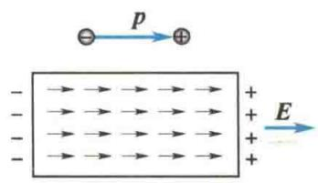
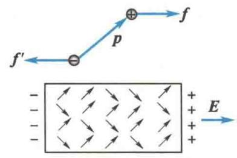
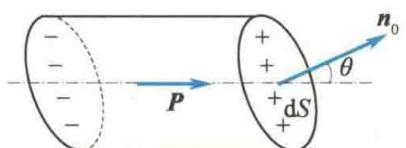
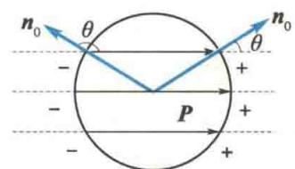
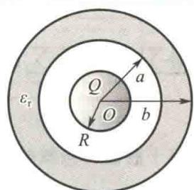

import Guide from '@/components/Guide.astro';
import Knowledge from '@/components/Knowledge.astro';
import Example from '@/components/Example.astro';
import Analysis from '@/components/Analysis.astro';
import Solution from '@/components/Solution.astro';
import Variant from '@/components/Variant.astro';
import Note from '@/components/Note.astro';
import Block from '@/components/Block.astro';
import Method from '@/components/Method.astro';
import Exercise from '@/components/Exercise.astro';

## 9.6.1 电介质的极化

电介质通常是指不导电的绝缘介质. 在电介质内没有可以自由移动的电荷(自由电子). 但是, 在外电场作用下, 电介质内的正、负电荷仍可做微观的相对移动. 结果就是, 在电介质内部或表面出现带电现象. 这种电介质在外电场作用下出现的带电现象称为电介质的极化. 电介质极化所出现的电荷, 称为极化电荷或束缚电荷.
一般地,介质分子中的正、负电荷都不集中在一点.但是,在远大于分子线度的距离处观察,分子的全部负电荷的影响与一个单独的负电荷等效,这个等效负电荷的位置称为分子的负电荷等效中心.同理,每个分子的全部正电荷也有一个相应的正电荷等效中心.若分子的正、负电荷的等效中心不重合,这样一对距离极近的等值异号的正、负点电荷称为分子的等效电偶极子,简称分子偶极子. $\mathrm{HCl}$ 、 $\mathrm{H}_{2}\mathrm{O}$ 、 $\mathrm{CO}$ 等介质分子就有这种分子偶极子,因而这一类介质称为有极分子电介质.还有另一类电介质,如 $\mathrm{He}$ 、 $\mathrm{H}_{2}$ 、 $\mathrm{N}_{2}$ 、 $\mathrm{CO}_{2}$ 等,其分子正、负电荷等效中心重合,没有分子偶极子,称为无极分子电介质.
在外电场作用下,无极分子电介质的分子的正、负电荷等效中心发生相对位移,形成电偶极子,产生的电偶极矩的方向都沿着外电场的方向,因此在电介质的表面将出现正、负极化电荷,如图9.24(a)所示.这类极化是由电荷等效中心发生位移引起的,叫作位移极化.
虽然有极分子电介质有分子偶极子,但在没有外电场存在时,由于分子的热运动,各个分子偶极子的排列十分紊乱,因此电介质宏观上不显电性.当电介质处于外电场中时,每个分子偶极子都受到电场力矩的作用,分子偶极子产生转向外电场方向的取向作用使电介质带电,这种极化称为取向极化,如图9.24(b)所示.应该指出,有极分子电介质也存在位移极化,只是比取向极化弱得多.
  
(a) 位移极化
  
(b) 取向极化  
图9.24 电介质的极化
这两类电介质的极化的微观机制虽有不同,但宏观结果都是一样的,在作宏观描述时不必加以区分.

## \*9.6.2 极化强度、极化电荷和极化规律

当电介质处于极化状态时，电介质内任一宏观小、微观大的体积元 $\Delta V$ 内，分子电偶极矩的矢量和不会互相抵消，即 $\sum p_{ei} \neq 0$ 。定义电介质中单位体积内分子电偶极矩的矢量和为极化强度矢量 P，即
$$
\boldsymbol {P} = \frac {\sum \boldsymbol {p} _ {\mathrm{ei}}}{\Delta V}\tag{9.24}
$$
  
极化强度
式中， $p_{e}$ 是分子电偶极矩。极化强度 P 是表征电介质极化程度的物理量。在国际单位制(SI)中，P 的单位名称是库仑每平方米，符号为 $C/m^{2}$ 。如果电介质中各点的极化强度相同，则称电介质是均匀极化的。
  
极化电荷与自由电荷的关系
因为无极分子电介质因位移极化而产生的电矩随着外电场的增强而增大,而有极分子电介质的固有电矩也会随着外电场的增强而排列更加有序,所以无论是何种电介质,它的极化强度都会随着外电场的增强而增大.实验表明,在各向同性电介质中的任意一点,极化强度 P 与电场强度 E 的方向相同且大小成正比,即
$$
\boldsymbol {P} = \varepsilon_ {0} \chi \boldsymbol {E}\tag{9.25}
$$
式中， $E$ 是自由电荷电场强度 $E_0$ 和极化电荷电场强度 $\pmb{E}^{\prime}$ 之和； $\chi$ 是电介质的极化率.对同一点， $\chi$ 是一个常量；对不同点， $\chi$ 的值可以不同.如果电介质中各点的 $\chi$ 值相同，则电介质为均匀电介质.
另外，电介质处于极化状态时，电介质的某一些部位将出现未被抵消的极化电荷。可以证明，在均匀电介质中，极化电荷集中在电介质的表面，且表面极化电荷的面密度为
$$
\sigma^ {\prime} = \frac {\mathrm{d} q ^ {\prime}}{\mathrm{d} S} = P \cos \theta = \mathbf {P} \cdot \mathbf {n} _ {0}\tag{9.26}
$$
式中， $n_{0}$ 是电介质表面法线方向上的单位矢量。式(9.26)表明，电介质表面极化电荷的面密度 $\sigma^{\prime}$ 等于表面处极化强度 P 的法向分量[见图 9.25(a)]。当 $\theta$ 为锐角时，电介质表面将出现一层正极化电荷；当 $\theta$ 为钝角时，电介质表面将出现一层负极化电荷，如图 9.25(b) 所示。
  
(a) 极化电荷的计算
  
(b) 表面极化电荷  
图 9.25 极化电荷
在电介质内部,可以取任意闭合曲面 $S, n_{0}$ 为 S 上面元 dS 的外法线方向上的单位矢量,可以证明 $dq'_{出} = P \cdot dS$ 表示由于极化而越过 dS 面,向外移出闭合曲面 S 的电荷.所以,越过整个闭合曲面 S 而向外移出的极化电荷总量 $\sum q'_{出i}$ 为
$$
\sum q _ {\mathrm{出} i} ^ {\prime} = \oint_ {S} \mathrm{d} q _ {\mathrm{出}} ^ {\prime} = \oint_ {S} P \cdot \mathrm{d} S
$$
根据电荷守恒定律，在闭合曲面 S 内净余的极化电荷总量 $\sum q_{i}^{\prime}$ 应等于 $\sum q_{出i}^{\prime}$ 的负值，即有
$$
\oint_ {S} \boldsymbol {P} \cdot \mathrm{d} \boldsymbol {S} = - \sum q _ {i} ^ {\prime}\tag{9.27}
$$
式(9.27)表明,在电介质中沿任意闭合曲面的极化强度通量等于曲面所包围的体积内极化电荷的负值.这是极化强度P与极化电荷分布之间的普遍关系.

## 9.6.3 有电介质时的高斯定理

有电介质时,总电场强度 E 包括自由电荷产生的电场强度 $E_{0}$ 和极化电荷产生的附加电场强度 $E'$ . 所以有电介质时的高斯定理可表示为
怎么看心电图？
$$
\oint_ {S} \boldsymbol {E} \cdot \mathrm{d} \boldsymbol {S} = \frac {1}{\varepsilon_ {0}} \big (\sum q _ {i} + \sum q _ {i} ^ {\prime} \big)
$$
式中， $\sum q_{i}$ 和 $\sum q_{i}^{\prime}$ 分别为高斯面 $S$ 内的自由电荷与极化电荷的代数和.由极化强度与极化电荷的关系式[式(9.27)]得

$$
\oint_ {S} \boldsymbol {P} \cdot \mathrm{d} \boldsymbol {S} = - \sum q _ {i} ^ {\prime}
$$
有电介质时的高斯定理
则上述的高斯定理可改写为
$$
\oint_ {S} (\varepsilon_ {0} \pmb {E} + \pmb {P}) \cdot \mathrm{d} \pmb {S} = \sum q _ {i}
$$
由此，可定义电位移矢量为
$$
\boldsymbol {D} = \varepsilon_ {0} \boldsymbol {E} + \boldsymbol {P}\tag{9.28}
$$
得
$$
\oint_ {S} \boldsymbol {D} \cdot \mathrm{d} \boldsymbol {S} = \sum q _ {i}\tag{9.29}
$$
式(9.29)就是有电介质时的高斯定理:在静电场中,通过任意闭合曲面的电位移通量等于闭合曲面内自由电荷的代数和.
式(9.28)表示电场中任意一点处 D、E、P 三个矢量的关系,对任何电介质都适用.因为在各向同性的电介质中,D、E、P 三个矢量的方向相同且 $P = \varepsilon_{0} \chi E$ ,所以
$$
\pmb {D} = \varepsilon_ {0} \pmb {E} + \pmb {P} = \varepsilon_ {0} (\pmb {E} + \chi \pmb {E}) = \varepsilon_ {0} (1 + \chi) \pmb {E}
$$
令 $1 + \chi = \varepsilon_{\mathrm{r}}$ ，称为电介质的相对介电常量，则
$$
D = \varepsilon_ {0} \varepsilon_ {\mathrm{r}} E = \varepsilon E\tag{9.30}
$$
式中， $\varepsilon$ 为介电常量（或电容率）， $\varepsilon = \varepsilon_0\varepsilon_{\mathrm{r}}$ 。在没有电介质时， $D = \varepsilon_0E + P$ ，其中， $P = 0$ 且 $E = E_0$ ，所以 $E_0 = \frac{D}{\varepsilon_0}$ 。它表示了真空或空气中电场强度与电位移的关系。而在有电介质时， $E = \frac{D}{\varepsilon_0\varepsilon_{\mathrm{r}}}$ ，因为 $\varepsilon_{\mathrm{r}} > 1$ ，所以 $E < E_0$ ，即电介质中的电场强度小于真空中的电场强度。这是因为电介质上的极化电荷在电介质中产生的附加电场的电场强度 $E'$ 与 $E_0$ 的方向相反，从而减弱了外电场强度。

<Example title="例 9.17">
一半径为 R 的导体球，带电量为 Q，球外有一均匀电介质制成的同心球壳，球壳的内、外半径分别为 a 和 b，相对介电常量为 $\varepsilon_{r}$ ，如图 9.26 所示。求：(1) 介质内外的 E 和 D 的分布；(2) 离球心 r 处的电势 U。

<Solution title="解">
（1）由题设知，电场分布具有球对称性，即到球心 $O$ 点距离相同的各点电场强度相同.作半径为 $r$ 与导体球同心的球面 $S$ 为高斯面，由高斯定理有
  
图9.26 例9.17图
$$
\begin{array}{r l} \oint_ {S} \pmb {D} \cdot \mathrm{d} \pmb {S} & = D \oint_ {S} \mathrm{d} S \\ & = D \cdot 4 \pi r ^ {2} = \sum q _ {i} \\ \text {此} & D = \frac {\sum q _ {i}}{4 \pi r ^ {2}} \end{array}
$$
因此
利用 $D=\varepsilon_{0}\varepsilon_{r}E=\varepsilon E$ ，可得 $E=\frac{D}{\varepsilon_{0}\varepsilon_{r}}$ ，方向沿径向（垂直于球面）向外。电场分布如下。
当 $r \leqslant R$ 时
$$
D _ {1} = 0, \quad E _ {1} = 0
$$
当 $R < r \leqslant a$ 时
$$
D _ {2} = \frac {Q}{4 \pi r ^ {2}}, E _ {2} = \frac {Q}{4 \pi \varepsilon_ {0} r ^ {2}}
$$
$$
D _ {4} = \frac {Q}{4 \pi r ^ {2}}, E _ {4} = \frac {Q}{4 \pi \varepsilon_ {0} r ^ {2}}
$$
当 $a < r \leqslant b$ 时
以上各式说明,当各向同性的均匀电介质充满等势面之间的空间时,该处电场强度为真空中电场强度的 $1/\varepsilon_{\tau}$ .
$$
D _ {3} = \frac {Q}{4 \pi r ^ {2}}, E _ {3} = \frac {Q}{4 \pi \varepsilon_ {0} \varepsilon_ {\mathrm{r}} r ^ {2}}
$$
$$
\begin{array}{r l} U _ {1} & = \int_ {r} ^ {\infty} \boldsymbol {E} \cdot \mathrm{d} \boldsymbol {r} \\ & = \int_ {r} ^ {R} E _ {1} \mathrm{d} r + \int_ {R} ^ {a} E _ {2} \mathrm{d} r + \int_ {a} ^ {b} E _ {3} \mathrm{d} r + \int_ {b} ^ {\infty} E _ {4} \mathrm{d} r \\ & = \frac {Q}{4 \pi \varepsilon_ {0}} \left(\frac {1}{R} - \frac {1}{a}\right) + \frac {Q}{4 \pi \varepsilon_ {0} \varepsilon_ {\mathrm{r}}} \left(\frac {1}{a} - \frac {1}{b}\right) + \frac {Q}{4 \pi \varepsilon_ {0} b} \end{array}
$$
(2) 当 $r \leqslant R$ 时
当 $R < r \leqslant a$ 时
$$
\begin{array}{r l} U _ {2} & = \int_ {r} ^ {\infty} \boldsymbol {E} \cdot \mathrm{d} \boldsymbol {r} = \int_ {r} ^ {a} E _ {2} \mathrm{d} r + \int_ {a} ^ {b} E _ {3} \mathrm{d} r + \int_ {b} ^ {\infty} E _ {4} \mathrm{d} r \\ & = \frac {Q}{4 \pi \varepsilon_ {0}} \left(\frac {1}{r} - \frac {1}{a}\right) + \frac {Q}{4 \pi \varepsilon_ {0} \varepsilon_ {\tau}} \left(\frac {1}{a} - \frac {1}{b}\right) + \frac {Q}{4 \pi \varepsilon_ {0} b} \end{array}
$$
当 $a < r \leqslant b$ 时
$$
\begin{array}{r l} U _ {3} & = \int_ {r} ^ {\infty} E \cdot \mathrm{d} r = \int_ {r} ^ {b} E _ {3} \mathrm{d} r + \int_ {b} ^ {\infty} E _ {4} \mathrm{d} r \\ & = \frac {Q}{4 \pi \varepsilon_ {0} \varepsilon_ {\mathrm{r}}} \left(\frac {1}{r} - \frac {1}{b}\right) + \frac {Q}{4 \pi \varepsilon_ {0} b} \end{array}
$$
当 $r > b$ 时
当 $r > b$ 时
$$
U _ {4} = \int_ {r} ^ {\infty} \boldsymbol {E} \cdot \mathrm{d} \boldsymbol {r} = \int_ {r} ^ {\infty} E _ {4} \mathrm{d} r = \frac {Q}{4 \pi \varepsilon_ {0} r}
$$
</Solution>
</Example>
