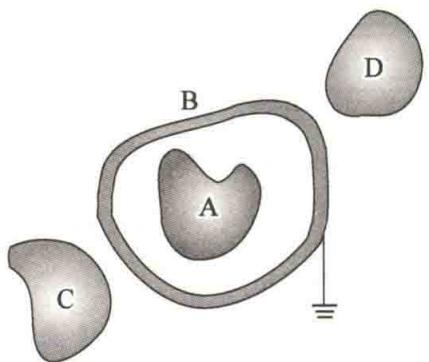
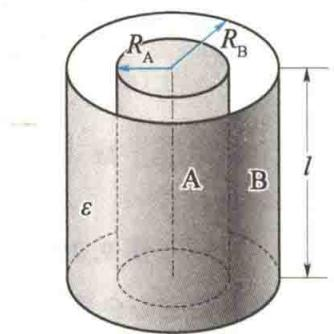
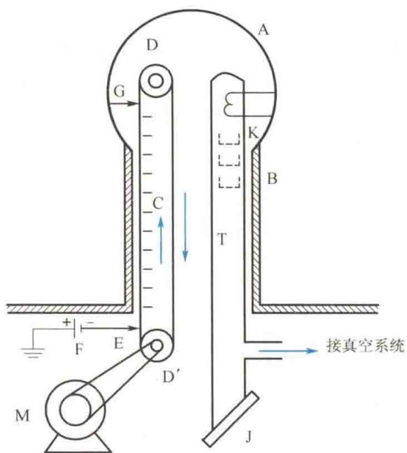
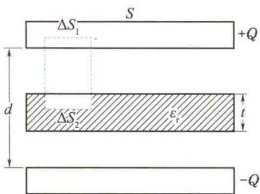
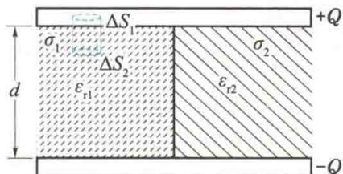

import QRCodeVideo from '@/components/QRCodeVideo.astro';

import Guide from '@/components/Guide.astro';
import Knowledge from '@/components/Knowledge.astro';
import Example from '@/components/Example.astro';
import Analysis from '@/components/Analysis.astro';
import Solution from '@/components/Solution.astro';
import Variant from '@/components/Variant.astro';
import Note from '@/components/Note.astro';
import Block from '@/components/Block.astro';
import Method from '@/components/Method.astro';
import Exercise from '@/components/Exercise.astro';

## 9.7.1 孤立导体的电容

理论和实验都表明,附近没有其他导体和带电体的孤立导体所带电量与它的电势 U 成正比,即
<QRCodeVideo title="超级电容器" url="https://api.guangyiedu.com/v3/resource/resource/r/NewQrCode-rIFCMb9w3rK5E2KEmKIn" />  
写成等式为
$$
q \propto U
$$
$$
\frac {q}{U} = C\tag{9.31}
$$
式中， $C$ 为比例系数，称为孤立导体的电容.如孤立导体球的电容 $C = 4\pi \varepsilon_0R.$ 它与导体的尺寸和形状有关，而与 $q$ 和 $U$ 无关.由式(9.31）可知，电容 $C$ 是使导体升高单位电势所需要的电量，因此该物理量反映了导体储存电荷和电能的能力.
在国际单位制(SI)中,电容的单位名称为法拉,符号为F.在实际应用中,法拉单位太大,通常以 $\mu F$ (微法)、pF(皮法)作为电容的单位,它们之间的关系为1F= $10^{6}\mu F=10^{12}pF$ .

## 9.7.2 电容器及其电容

当导体 A 附近有其他导体存在时,该导体的电势不仅与它本身所带的电量有关,而且与其他导体的形状及位置有关.为了消除周围其他导体的影响,可用一个封闭的导体壳 B 将导体 A 屏蔽起来,如图 9.27 所示.可以证明,导体 A 和导体壳 B 之间的电势差 $U_{A}-U_{B}$ 与导体 A 所带的电量成正比,不受外界影响.我们把导体壳 B 与其腔内的导体 A 所组成的导体系称为电容器,其电容为
$$
C = \frac {q}{U _ {\mathrm{A}} - U _ {\mathrm{B}}} = \frac {q}{U _ {\mathrm{AB}}}\tag{9.32}
$$
<QRCodeVideo title="电鳗为什么能放电？" url="https://api.guangyiedu.com/v3/resource/resource/r/NewQrCode-l45nEwCRAO2OCJ4o9YXt" />
电容器的电容 C 与两导体的尺寸、形状及相对位置有关。组成电容器的两导体称为电容器的极板。在实际应用的电容器中，对其屏蔽性要求不是很高，只要求从一个极板发出的电场线都终止在另一个极板上即可。
电鳗为什么能放电？
设电容器的两极板分别带有等量异号电荷，通过计算两极板间的电场强度与电势差，依据式(9.32)可以方便地推导出几类电容器的电容公式。例如，对长度为 $l$ 且长度远比半径之差 $(R_{\mathrm{B}} - R_{\mathrm{A}})$ 大、两导体之间充满介电常量为 $\varepsilon$ 的电介质的同轴圆柱形电容器的电容值计算如下。
如图 9.28 所示, 设导体 A 的轴向单位长度带电量为 $\lambda$ , 则导体 B 轴向单位长度带电量为 $-\lambda$ , 在 A、B 之间的电介质中的电场强度大小由高斯定理求得, 为
$$
E = \frac {\lambda}{2 \pi \varepsilon r}
$$
式中， $r$ 为场点到轴线的距离.则A、B两导体的电势差为
$$
U _ {\mathrm{AB}} = \int_ {R _ {\mathrm{A}}} ^ {R _ {\mathrm{B}}} \frac {\lambda}{2 \pi \varepsilon r} \mathrm{d} r = \frac {\lambda}{2 \pi \varepsilon} \ln \frac {R _ {\mathrm{B}}}{R _ {\mathrm{A}}}
$$
由此可得,长度为 l 的电容器的电容为
$$
C = \frac {\lambda l}{U _ {\mathrm{AB}}} = 2 \pi \varepsilon l / \ln \frac {R _ {\mathrm{B}}}{R _ {\mathrm{A}}}
$$
式中，l 是电容器的长度； $R_{A}$ 、 $R_{B}$ 分别为内、外圆柱的横截面半径.
  
图9.27 屏蔽的电容器
  
图 9.28 圆柱形电容器
对真空中极板面积为 S、两极板间距离为 d 且满足 $\sqrt{S} \gg d$ 的平行板电容器，C =$\frac{\varepsilon_{0}S}{d}$ ; 对真空中内、外球面半径分别为 $R_{A}$ 、 $R_{B}$ 的同心球形电容器, $C = \frac{4\pi\varepsilon_{0}R_{A}R_{B}}{R_{B} - R_{A}} (R_{A} < R_{B})$ . 以上两类电容器的电容公式请读者自己推导. 从以上三类电容器电容的计算结果可知: 电容器的电容大小由电容器的几何形状、电介质的性质和分布共同决定.
电容器按几何形状可分为平行板电容器、圆柱形电容器、球形电容器等；按介质的种类可分为空气电容器、纸介质电容器、云母电容器、电解电容器、陶瓷电容器等；按性能可分为固定电容器、半可变电容器和可变电容器。

## \*9.7.3 电容器的连接

电容器的性能指标中有两个是非常重要的,一个是电容值,另一个是耐压值.使用电容器时,两极板上的电压不能超过所规定的耐压值.当单独一个电容器的电容值或耐压值不能满足实际需求时,可把几个电容器连接起来使用,电容器的基本连接方式有串联、并联两种.
电容器串联时，串联的每一个电容器都带有相同的电量 $q$ ，而电压与电容成反比地分配在各个电容器上.因此，整个串联电容器系统的总电容 $C$ 的倒数为
$$
\frac {1}{C} = \frac {U}{q} = \frac {U _ {1} + U _ {2} + \cdots + U _ {n}}{q} = \frac {1}{C _ {1}} + \frac {1}{C _ {2}} + \dots + \frac {1}{C _ {n}}\tag{9.33}
$$
电容器并联时,加在各电容器上的电压是相同的,电量与电容成正比地分配在各个电容器上.因此,整个并联电容器系统的总电容为
$$
C = \frac {q}{U} = \frac {q _ {1} + q _ {2} + \cdots + q _ {n}}{U} = \frac {U (C _ {1} + C _ {2} + \cdots + C _ {n})}{U} = C _ {1} + C _ {2} + \dots + C _ {n}\tag{9.34}
$$

## \*9.7.4 范德格拉夫起电机

利用导体的静电特性和尖端放电现象,使物体连续不断地带有大量电荷,这样的装置叫范德格拉夫起电机,其构造和作用原理如图9.29所示.
  
图 9.29 范德格拉夫起电机的构造和作用原理
图 9.29 中的 A 是空心金属球壳，由绝缘空心柱 B 支承。D 和 D' 表示上、下两个滑轮，D' 用电动机 M 拖动，通过绝缘传送带 C 带动 D 转动。F 是正极接地的高压直流电源（几万伏至十万伏），负极接放电针 E。E 由一排尖齿组成，正对着绝缘带 C。E 的尖端放电，使 C 上带有负电荷。当负电荷随绝缘带向上移动到刮电针 G（G 也由一排尖齿组成）附近时，负电荷就通过 G 传递到 A，并分布在 A 的外表面. 随着 C 不停地运转, 把大量负电荷送到 A 的外表面, 就可使 A 达到很高的负电势.
A 内可装上抽成真空的加速管 T, T 的上端装入产生电子束的电子枪 K, 由于 A 与外界具有很高的电势差, 因此电子束进入 T 后, 将在强电场的作用下, 自上而下地做加速运动, 电子获得了很大的动能. 电子束轰击在 T 下端的由不同材料制成的靶子 J 上, 可产生不同的射线, 如 $\alpha$ 射线、 $\gamma$ 射线等, 从而应用于各种研究.

<Example title="例 9.18">
一平行板电容器的极板面积为 S，板间距离为 d，电势差为 U。两极板间平行放置一层厚度为 t、相对介电常量为 $\varepsilon_{r}$ 的电介质。求：(1) 极板上的电量 Q；(2) 两极板间的电位移 D 和电场强度 E 的大小；(3) 电容器的电容。

<Solution title="解">
（1）如图9.30所示，作柱形高斯面，它的一个底面 $\Delta S_{1}$ 在一个金属极板内，另一底面 $\Delta S_{2}$ 在两极板之间（电介质中或真空中）， $\Delta S_{1} = \Delta S_{2} = \Delta S.$ 因为金属极板内 $E = 0, D = 0$ ，所以
$$
\oint_ {S} \boldsymbol {D} \cdot \mathrm{d} \boldsymbol {S} = D \Delta S
$$
因此两极板的电势差为
  
图9.30 例9.18图
$$
\begin{array}{r l} & U = E _ {1} (d - t) + E _ {2} t = \frac {Q}{\varepsilon_ {0} S} (d - t) + \frac {Q}{\varepsilon_ {0} \varepsilon_ {\mathrm{r}} S} t \\ & = \frac {Q d}{\varepsilon_ {0} S} \left(1 - \frac {t}{d} \frac {\varepsilon_ {\mathrm{r}} - 1}{\varepsilon_ {\mathrm{r}}}\right) \end{array}
$$
由此可得极板上的电量为
$$
Q = \frac {\varepsilon_ {0} S U}{d} \left[ \frac {\varepsilon_ {\mathrm{r}} d}{\varepsilon_ {\mathrm{r}} (d - t) + t} \right] = \frac {\varepsilon_ {0} \varepsilon_ {\mathrm{r}} S U}{\varepsilon_ {\mathrm{r}} (d - t) + t}
$$
(2) 把 $Q = \frac{\varepsilon_{0} \varepsilon_{r} SU}{\varepsilon_{r}(d - t) + t}$ 分别代入 $D = \frac{Q}{S}, E_{1} = \frac{Q}{\varepsilon_{0} S}$ 和 $E_{2} = \frac{Q}{\varepsilon_{0} \varepsilon_{r} S}$ 中可得
$$
D = \frac {\varepsilon_ {0} \varepsilon_ {\mathrm{r}} U}{\varepsilon_ {\mathrm{r}} (d - t) + t}
$$
而 $\sum q_{i} = \sigma \Delta S$ ，由此得到两极板间的电介质中的电位移和真空中电位移 D 大小相同，其大小均为
$$
E _ {1} = \frac {\varepsilon_ {\mathrm{r}} U}{\varepsilon_ {\mathrm{r}} (d - t) + t}
$$
$$
D = \sigma = \frac {Q}{S}
$$
$$
E _ {2} = \frac {U}{\varepsilon_ {\mathrm{r}} (d - t) + t}
$$
Q 是正极板上的电量, 待求.
在真空间隙中 $E_{1} = \frac{D}{\varepsilon_{0}} = \frac{Q}{\varepsilon_{0}S}$
$$
(3) C = \frac {Q}{U} = \frac {\varepsilon_ {0} \varepsilon_ {\mathrm{r}} S}{\varepsilon_ {\mathrm{r}} (d - t) + t} = \frac {C _ {0}}{1 - \frac {t}{d} \frac {\varepsilon_ {\mathrm{r}} - 1}{\varepsilon_ {\mathrm{r}}}}
$$
在电介质中
$$
E _ {2} = \frac {D}{\varepsilon} = \frac {D}{\varepsilon_ {0} \varepsilon_ {\mathrm{r}}} = \frac {Q}{\varepsilon_ {0} \varepsilon_ {\mathrm{r}} S}
$$
式中， $C_{0}=\frac{\varepsilon_{0}S}{d}$ . 可见，由于插入电介质，电容增大了；若 t=d ，即电介质充满两极板的间隙，则 $C=\varepsilon_{r}C_{0}$ ，电容扩大到原来的 $\varepsilon_{r}$ 倍.
</Solution>
</Example>

<Example title="例 9.19">
若在例 9.18 中的平行板电容器两极板间左、右两半空间内分别充满相对介电常量为 $\varepsilon_{r1}$ 和 $\varepsilon_{r2}$ 的电介质，如图 9.31 所示（设 $\varepsilon_{r1}$ 充满的空间的极板面积为 $S_{1}$ ）。求：
(1) 两极板间的电位移 D 和电场强度 E；
(2) 极板上的面电荷密度；
(3) 电容器的电容.

<Solution title="解">
（1）因为两极板间的电势差 $U$ 一定，所以左半边和右半边的电场强度大小相等， $E_{1} = E_{2} = \frac{U}{d}$ ，而左半边和右半边的电位移 D 方向相同, 大小不相等:
  
图9.31 例9.19图
$$
D _ {1} = \varepsilon_ {\mathrm{r} 1} \varepsilon_ {0} E _ {1} = \varepsilon_ {\mathrm{r} 1} \varepsilon_ {0} \frac {U}{d}
$$
$$
D _ {2} = \varepsilon_ {\mathrm{r2}} \varepsilon_ {0} E _ {2} = \varepsilon_ {\mathrm{r2}} \varepsilon_ {0} \frac {U}{d}
$$
(2) 在左半边作如图 9.31 所示的高斯面, 与例 9.18 相似, 可得左半边正极板上的面电荷密度为
（3）左半边的极板面积为 $S_{1}$ ，则右半边的极板面积为 $S - S_{1}$ 。由此可得，极板上的总电量为
$$
\sigma_ {1} = D _ {1} = \varepsilon_ {\mathrm{r1}} \varepsilon_ {0} \frac {U}{d}
$$
$$
Q = \sigma_ {1} S _ {1} + \sigma_ {2} (S - S _ {1}) = \frac {\varepsilon_ {\mathrm{r} 1} \varepsilon_ {0} U}{d} S _ {1} + \frac {\varepsilon_ {\mathrm{r} 2} \varepsilon_ {0} U}{d} (S - S _ {1})
$$
同理，右半边正极板上的面电荷密度为
$$
\sigma_ {2} = D _ {2} = \varepsilon_ {\mathrm{r2}} \varepsilon_ {0} \frac {U}{d}
$$
$$
C = \frac {Q}{U} = \frac {\varepsilon_ {\mathrm{r1}} \varepsilon_ {0} S _ {1}}{d} + \frac {\varepsilon_ {\mathrm{r2}} \varepsilon_ {0} (S - S _ {1})}{d} = C _ {1} + C _ {2}
$$
式中， $C_1, C_2$ 分别表示左、右两半电容器的电容. 可见，整个电容器相当于两个电容器并联.
从以上两例可以看到,在利用有电介质时的高斯定理求解电场分布时,必须注意到不同电介质区域的电位移之间的关系和电场强度之间的关系与电介质分布的形状有关.

</Solution>
</Example>
