import Guide from '@/components/Guide.astro';
import Knowledge from '@/components/Knowledge.astro';
import Example from '@/components/Example.astro';
import Analysis from '@/components/Analysis.astro';
import Solution from '@/components/Solution.astro';
import Variant from '@/components/Variant.astro';
import Note from '@/components/Note.astro';
import Block from '@/components/Block.astro';
import Method from '@/components/Method.astro';
import Exercise from '@/components/Exercise.astro';

## 附录

## 附录I

矢量

### 1. 标量和矢量

在物理学中,有一类物理量,如时间、质量、功、能量、温度等,只有大小和正负,而没有方向,这类物理量称为标量.另一类物理量,如位移、速度、加速度、力、动量、冲量等,既有大小又有方向,且相加、减时遵循平行四边形的运算法则,这类物理量称为矢量(也称为向量).通常用带箭头的字母(如A)或黑体字母(如A)来表示矢量,以区别于标量.在作图时,可以在空间用一有向线段来表示矢量,如图I.1所示.线段的长度表示矢量的大小,箭头的指向则表示矢量的方向.

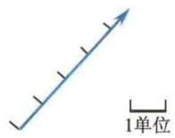  
图I.1 矢量的图示

因为矢量具有大小和方向这两个特征,所以只有大小相等、方向相同的两个矢量才相等[见图 I.2(a)].如果有一矢量和矢量 A 的大小相等而方向相反,这一矢量就称为矢量 A 的负矢量,用 -A 来表示[见图 I.2(b)].

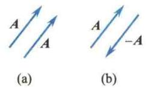  
图I.2 等矢量和负矢量

将一矢量平移后,它的大小和方向都保持不变.这样,在考察矢量之间的关系或对它们进行运算时,往往根据需要将矢量进行平移,如图I.3所示.

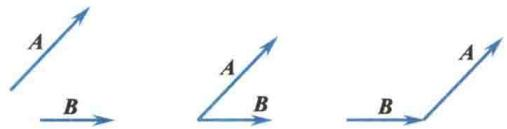  
图I.3 矢量的平移

### 2. 矢量的模和单位矢量

矢量的大小称为矢量的模. 矢量 A 的模常用符号 $\left|A\right|$ 或 A 表示.

如果矢量 $e_{A}$ 的模等于 1，且方向与矢量 A 的方向相同，则 $e_{A}$ 称为矢量 A 方向上的单位矢量。引进了单位矢量之后，矢量 A 可以表示为

$$
\mathbf {A} = | \mathbf {A} | e _ {\mathbf {A}} = A e _ {\mathbf {A}}
$$

这种表示方法实际上是把矢量 A 的大小和方向这两个特征分别表示出来.

对于空间直角坐标系 $(Oxyz)$ 来说,通常用i、j、k分别表示沿x、y、z三个坐标轴正方向的单位矢量.

### 3. 矢量的加法和减法

矢量的运算不同于标量的运算.例如,一个物体同时受到几个不同方向的力的作用时,在计算合力时,不能简单地运用代数相加的方法,而必须遵循平行四边形的运算法则.因此矢量相加的方法常称为平行四边形定则.

设有两个矢量 A 和 B，如图 I.4 所示，将它们相加时，可将两矢量平移至其起点交于一点，再以这两个矢量 A 和 B 为邻边作平行四边形，从两矢量的交点作平行四边形的对角线，此对角线即代表 A 和 B 两矢量之和，用矢量式表示为

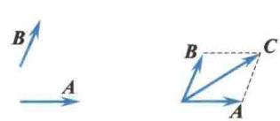  
图I.4 矢量的加法

$$
\mathbf {C} = \mathbf {A} + \mathbf {B}
$$

C 称为合矢量, 而 A 和 B 称为合矢量 C 的分矢量.

因为平行四边形的对边平行且相等,所以两矢量合成的平行四边形定则可简化为三角形定则,即以矢量 A 的末端为起点,作矢量 B(见图 I.5),不难看出,由 A 的起点画到 B 的末端的矢量就是合矢量 C.同样地,如以矢量 B 的末端为起点,作矢量 A,由 B 的起点画到 A 的末端的矢量也是合矢量 C,即矢量的加法满足交换律.

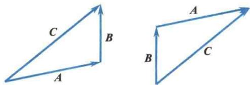  
图I.5 矢量合成的三角形定则

对于两个以上的矢量相加,例如,求 A、B、C 和 D 的合矢量,则可根据三角形定则,先求出其中两个矢量的合矢量,然后将该合矢量与第 3 个矢量相加,求出这 3 个矢量的合矢量.以此类推,就可以求出多个矢量的合矢量(见图 I.6).从图 I.6 中还可以看出,如果在第 1 个矢量的末端画出第 2 个矢量,再在第 2 个矢量的末端画出第 3 个矢量……即把所有相加的矢量首尾相连,然后由第 1 个矢量的起点到最后一个矢量的末端作一矢量,这个矢量就是它们的合矢量.由于所有的分矢量与合矢量在矢量图上围成一个多边形,所以这种求合矢量的方法常称为多边形定则.

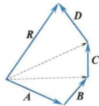  
图I.6 多矢量的合成

合矢量的大小和方向,也可以通过计算求得.如图 I.7 所示,矢量 A、B 之间的夹角为 $\theta$ ,那

(a)

么,合矢量 C 的大小和方向很容易从图上看出.

$$
\begin{array}{r l} C & = \sqrt {(A + B \cos \theta) ^ {2} + (B \sin \theta) ^ {2}} \\ & = \sqrt {A ^ {2} + B ^ {2} + 2 A B \cos \theta} \\ & \varphi = \arctan \frac {B \sin \theta}{A + B \cos \theta} \end{array}
$$

矢量的减法是按矢量加法的逆运算来定义的.例如，问 $\mathbf{A},\mathbf{B}$ 两矢量之差 $A - B$ 为何？它是另一个矢量 $\pmb{D}$ ，记作 $D = A - B$ ，如果把 $D, B$ 相加，就应该得到 $A.$ 由图I.8(a)还可以看出， $A - B$ 也等于 $A$ 和一 $B$ 的合矢量，即

$$
\mathbf {A} - \mathbf {B} = \mathbf {A} + (- \mathbf {B})
$$

所以求矢量差 A-B 时可按图 I.8(a) 所示的平行四边形定则或三角形定则进行运算.

用同样的方法可以知道,矢量差 B-A 等于由 A 的末端指向 B 的末端的矢量[见图 I.8(b)],它的大小与 A-B 的大小相等,但方向相反.

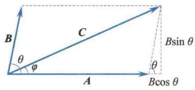  
图I.7 两矢量合成的计算

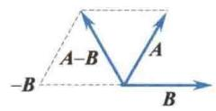

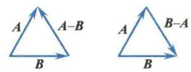  
(b)  
图I.8 矢量的减法

### 4. 矢量合成的解析法

两个或两个以上的矢量可以合成一个矢量. 同样, 一个矢量也可以分解为两个或两个以上的分矢量. 但是, 一个矢量分解为两个分矢量时, 有无限多组解答 (见图 I.9). 若先限定了两个分矢量的方向, 则解答是唯一的. 常将一矢量沿直角坐标系的坐标轴分解. 由于坐标轴的方向已确定, 所以任一矢量分解在各坐标轴上的分矢量只需用带正号或负号的数值表示即可, 这些分矢量的量值都是标量, 一般叫作分量. 如图 I.10 所示, 矢量 A 在 x 轴和 y 轴上的分量分别为

$$
\begin{array}{r l} & A _ {x} = A \cos \theta \\ & A _ {y} = A \sin \theta \end{array}
$$

显然，矢量 A 的模与分量 $A_{x}$ 、 $A_{y}$ 之间的关系为 $|A| = \sqrt{A_{x}^{2} + A_{y}^{2}}$ ，矢量 A 的方向可用与 x 轴的夹角 $\theta$ 来表示，即

$$
\theta = \arctan \frac {A _ {y}}{A _ {x}}
$$

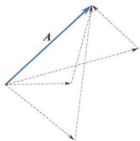  
图I.9 矢量的分解

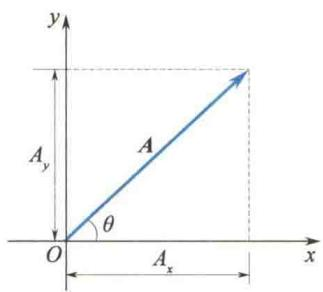  
图I.10 矢量的正交分解

运用矢量的分量表示法,可以使矢量的加减运算得到简化.如图I.11所示,设有两矢量A和B,其合矢量C可由平行四边形定则求出.如矢量A和B在坐标轴上的分量分别为 $A_{x}$ 、 $A_{y}$ 和 $B_{x}$ 、 $B_{y}$ .由图I.11很容易得出,合矢量C在坐标轴上的分量满足关系式

$$
\begin{array}{r l} & C _ {x} = A _ {x} + B _ {x} \\ & C _ {y} = A _ {y} + B _ {y} \end{array}
$$

也就是说，合矢量在任一直角坐标系的坐标轴上的分量等于分矢量在同一坐标轴上各分量的代数和。这样，通过分矢量在坐标轴上的分量就可以求得合矢量的大小和方向。

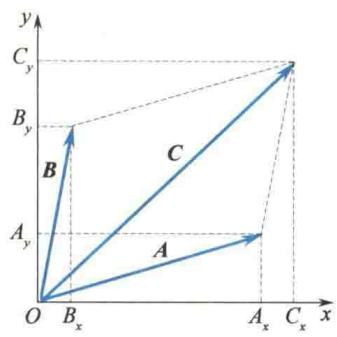  
图I.11 矢量合成的解析法

### 5. 矢量的数乘

一个数 m 和矢量 A 相乘, 得到另一个矢量 mA, 其大小是 mA. 若 m > 0, 则其方向与 A 的方向相同; 若 m &lt; 0, 则其方向与 A 的方向相反.

### 6. 矢量的坐标表示

矢量的合成与分解是具有密切联系的. 在空间直角坐标系中, 任一矢量 A 都可沿坐标轴方向分解为 3 个分矢量(见图 I.12), 即

$$
\overrightarrow {O x} = A _ {x} \boldsymbol {i}, \quad \overrightarrow {O y} = A _ {y} \boldsymbol {j}, \quad \overrightarrow {O z} = A _ {z} \boldsymbol {k}
$$

由矢量合成的三角形定则不难得到

$$
\boldsymbol {A} = A _ {x} \boldsymbol {i} + A _ {y} \boldsymbol {j} + A _ {z} \boldsymbol {k}
$$

式中， $A_{x}$ 、 $A_{y}$ 、 $A_{z}$ 分别为矢量A在各坐标轴上的分量.上式即为矢量的坐标表示.于是矢量A的模为

$$
| \boldsymbol {A} | = \sqrt {A _ {x} ^ {2} + A _ {y} ^ {2} + A _ {z} ^ {2}}
$$

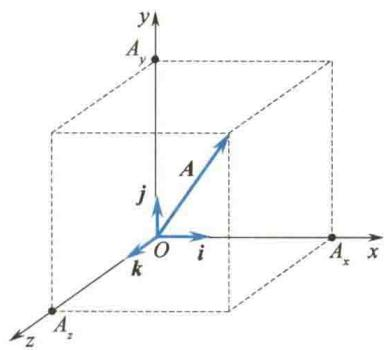  
图I.12 矢量的坐标表示

矢量 A 的方向由该矢量与各坐标轴的夹角 $\alpha$ 、 $\beta$ 、 $\gamma$ 来确定：

$$
\cos \alpha = \frac {A _ {x}}{| A |}, \quad \cos \beta = \frac {A _ {y}}{| A |}, \quad \cos \gamma = \frac {A _ {z}}{| A |}
$$

由此, 又可得到矢量加减法的坐标表达式. 设 A 和 B 两矢量的坐标表达式分别为

$$
\mathbf {A} = A _ {x} \mathbf {i} + A _ {y} \mathbf {j} + A _ {z} \mathbf {k}
$$

$$
\boldsymbol {B} = B _ {x} \boldsymbol {i} + B _ {y} \boldsymbol {j} + B _ {z} \boldsymbol {k}
$$

于是

$$
\mathbf {A} \pm \mathbf {B} = (A _ {x} \pm B _ {x}) \mathbf {i} + (A _ {y} \pm B _ {y}) \mathbf {j} + (A _ {z} \pm B _ {z}) \mathbf {k}
$$

### 7. 矢量的标积和矢积

在物理学中,我们常常遇到两个矢量相乘的情形.例如,功 W 与力 F 和位移 s 的关系为

$$
W = F s \cos \theta
$$

式中， $\theta$ 是力与位移之间的夹角。力 $F$ 和位移 $s$ 都是矢量，而功 $W$ 是只有大小与正负、没有方向的量，即标量。又如，力矩 $M$ 的大小为

$$
M = F d = F r \sin \theta
$$

式中，d 是力臂，r 是力的作用点的位置矢量， $\theta$ 是 r 和 F 之间的夹角。r 和 F 都是矢量，而力矩 M 也是矢量。由此可知，两矢量相乘有两种结果：两矢量相乘得到一个标量的叫作标积（或点积）；两矢量相乘得到一个矢量的叫作矢积（或叉积）。

设 A、B 为任意两个矢量，它们的夹角为 $\theta$ ，则它们的标积通常用 $A \cdot B$ 来表示，定义为

$$
\mathbf {A} \cdot \mathbf {B} = A B \cos \theta
$$

上式说明,标积 $A \cdot B$ 等于矢量 A 在矢量 B 方向上的投影 $A \cos \theta$ 与矢量 B 的模的乘积 [见图 I.13(a)], 也等于矢量 B 在矢量 A 方向上的投影 $B \cos \theta$ 与矢量 A 的模的乘积 [见图 I.13(b)].

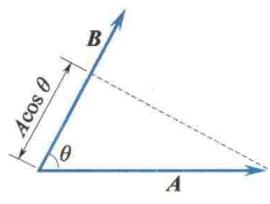  
(a)

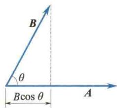  
(b)  
图I.13 矢量的标积

引进了矢量的标积以后,功就可以用力和位移的标积来表示,即

$$
W = F \cdot s
$$

根据标积的定义,可以得出下列结论.

(1) 当 $\theta=0$ ，即 A、B 两矢量平行时， $\cos\theta=1$ ，所以 $A\cdot B=AB$ 。当 A 和 B 相等时， $A\cdot A=A^{2}$ 。

(2) 当 $\theta=\frac{\pi}{2}$ ，即 A、B 两矢量垂直时， $\cos\theta=0$ ，所以 $A\cdot B=0$ 。

(3)根据以上两点结论可知,直角坐标系的单位矢量i、j、k具有正交性,即

$$
i \cdot i = j \cdot j = k \cdot k = 1
$$

$$
\boldsymbol {i} \cdot \boldsymbol {j} = \boldsymbol {j} \cdot \boldsymbol {k} = \boldsymbol {k} \cdot \boldsymbol {i} = 0
$$

利用上述性质,对 A、B 两矢量求标积,有

$$
\boldsymbol {A} \cdot \boldsymbol {B} = (A _ {x} \boldsymbol {i} + A _ {y} \boldsymbol {j} + A _ {z} \boldsymbol {k}) \cdot (B _ {x} \boldsymbol {i} + B _ {y} \boldsymbol {j} + B _ {z} \boldsymbol {k}) = A _ {x} B _ {x} + A _ {y} B _ {y} + A _ {z} B _ {z}
$$

矢量 A 和 B 的矢积 $A \times B$ 是另一矢量 C，其定义如下：

$$
\mathbf {C} = \mathbf {A} \times \mathbf {B}
$$

矢量 $C$ 的大小为

$$
C = A B \sin \theta
$$

式中， $\theta$ 为 $A, B$ 两矢量间的夹角。矢量 $C$ 的方向垂直于 $A, B$ 两矢量确定的平面，指向由右手螺旋定则确定，即从 $A$ 经由小于 $180^{\circ}$ 的角转向 $B$ 时大拇指伸直所指的方向为矢量 $C$ 的方向（见图 I.14）。

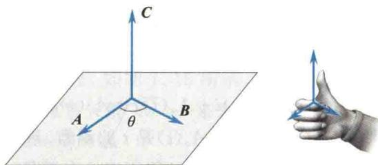  
图I.14 矢量的矢积

引进了矢量的矢积以后，力矩就可以用力作用点的位置矢量 r 与力 F 的矢积来表示，即

$$
\boldsymbol {M} = \boldsymbol {r} \times \boldsymbol {F}
$$

根据矢量矢积的定义,可以得出下列结论.

(1) 当 $\theta=0$ ，即 A、B 两矢量平行时， $\sin\theta=0$ ，所以 $A\times B=0$ 。

(2) 当 $\theta=\frac{\pi}{2}$ ，即 A、B 两矢量垂直时， $\sin\theta=1$ ，矢积 $A\times B$ 有最大值，它的大小为 AB.

(3) A、B 两矢量的矢积的方向与它们的次序有关. $A \times B$ 与 $B \times A$ 所表示的矢量的方向正好相反, 即

$$
\mathbf {A} \times \mathbf {B} = - (\mathbf {B} \times \mathbf {A})
$$

(4) 在直角坐标系中, 单位矢量之间的矢积为

$$
\begin{array}{r l} & i \times i = j \times j = k \times k = 0 \\ & i \times j = k, \quad j \times k = i, \quad k \times i = j \end{array}
$$

利用上述性质,对 A、B 两矢量求矢积,有

$$
\begin{array}{r l} \mathbf {A} \times \mathbf {B} & = (A _ {x} \mathbf {i} + A _ {y} \mathbf {j} + A _ {z} \mathbf {k}) \times (B _ {x} \mathbf {i} + B _ {y} \mathbf {j} + B _ {z} \mathbf {k}) \\ & = (A _ {y} B _ {z} - A _ {z} B _ {y}) \mathbf {i} + (A _ {z} B _ {x} - A _ {x} B _ {z}) \mathbf {j} + (A _ {x} B _ {y} - A _ {y} B _ {x}) \mathbf {k} \end{array}
$$

利用行列式的表达式,上式可写成

$$
\mathbf {A} \times \mathbf {B} = \left| \begin{array}{c c c} \mathbf {i} & \mathbf {j} & \mathbf {k} \\ A _ {x} & A _ {y} & A _ {z} \\ B _ {x} & B _ {y} & B _ {z} \end{array} \right|
$$

矢量计算中,有时会遇到3个矢量所构成的乘积,如 $A\cdot(B\times C)$ 和 $A\times(B\times C)$ .前者是求两矢量A和 $B\times C$ 的标积,结果是一标量;后者是求两矢量A和 $B\times C$ 的矢积,结果是一矢量.不难证明:

$$
\begin{array}{r l} (1) \mathbf {A} \cdot (\mathbf {B} \times \mathbf {C}) & = A _ {x} (B _ {y} C _ {z} - B _ {z} C _ {y}) + A _ {y} (B _ {z} C _ {x} - B _ {x} C _ {z}) + A _ {z} (B _ {x} C _ {y} - B _ {y} C _ {x}) \\ & = \left| \begin{array}{c c c} A _ {x} & A _ {y} & A _ {z} \\ B _ {x} & B _ {y} & B _ {z} \\ C _ {x} & C _ {y} & C _ {z} \end{array} \right|. \end{array}
$$

此式在数值上恰好等于以 A、B、C 3 个矢量为棱边的平行六面体的体积.

(2) $A \cdot (B \times C) = B \cdot (C \times A) = C \cdot (A \times B).$

(3) $A \times (B \times C) = B(A \cdot C) - C(A \cdot B).$

(4) $A \times (B \times C) = -A \times (C \times B) = (C \times B) \times A = -(B \times C) \times A.$

### 8. 矢量函数的导数

在物理学中遇见的矢量常常是参量 $t$ （时间）的函数，因而写作 $\mathbf{A}(t),\mathbf{B}(t)$ 等，这是一元函数的情况.下面只介绍一元函数的求导方法.一般来说，若某一矢量是标量变量（如空间坐标 $x,y,z$ 和时间 $t$ )的函数，则是多元函数的情况.多元函数的求导比较复杂，可由一元函数的求导作推广，这里不作介绍.

矢量函数 $A(t)$ 可表示为

$$
\mathbf {A} (t) = A _ {x} (t) \mathbf {i} + A _ {y} (t) \mathbf {j} + A _ {z} (t) \mathbf {k}
$$

这里要注意：i、j、k 是常矢量，而 $A_{x}(t)$ 、 $A_{y}(t)$ 、 $A_{z}(t)$ 是 t 的函数。现假定这 3 个函数都是可导的，当自变量 t 变为 $t + \Delta t$ 时，A 和 $A_{x}(t)$ 、 $A_{y}(t)$ 、 $A_{z}(t)$ 便相应地有增量：

$$
\begin{array}{r l} & \Delta A = A (t + \Delta t) - A (t) \\ & \Delta A _ {x} = A _ {x} (t + \Delta t) - A _ {x} (t) \\ & \Delta A _ {y} = A _ {y} (t + \Delta t) - A _ {y} (t) \\ & \Delta A _ {z} = A _ {z} (t + \Delta t) - A _ {z} (t) \end{array}
$$

于是

$$
\Delta A = \Delta A _ {x} i + \Delta A _ {y} j + \Delta A _ {z} k
$$

以 $\Delta t$ 相除，并令 $\Delta t\to 0$ ，求极限，便得

$$
\lim _ {\Delta t \rightarrow 0} \frac {\Delta A}{\Delta t} = \lim _ {\Delta t \rightarrow 0} \frac {\Delta A _ {x}}{\Delta t} i + \lim _ {\Delta t \rightarrow 0} \frac {\Delta A _ {y}}{\Delta t} j + \lim _ {\Delta t \rightarrow 0} \frac {\Delta A _ {z}}{\Delta t} k
$$

即

$$
\frac {\mathrm{d} \boldsymbol {A}}{\mathrm{d} t} = \frac {\mathrm{d} A _ {x}}{\mathrm{d} t} \boldsymbol {i} + \frac {\mathrm{d} A _ {y}}{\mathrm{d} t} \boldsymbol {j} + \frac {\mathrm{d} A _ {z}}{\mathrm{d} t} \boldsymbol {k}
$$

高阶导数的概念也可应用到矢量函数上,例如,A(t)的二阶导数可写作

$$
\frac {\mathrm{d} ^ {2} \boldsymbol {A}}{\mathrm{d} t ^ {2}} = \frac {\mathrm{d} ^ {2} A _ {x}}{\mathrm{d} t ^ {2}} \boldsymbol {i} + \frac {\mathrm{d} ^ {2} A _ {y}}{\mathrm{d} t ^ {2}} \boldsymbol {j} + \frac {\mathrm{d} ^ {2} A _ {z}}{\mathrm{d} t ^ {2}} \boldsymbol {k}
$$

下面列出一些有关矢量函数的导数的简单公式：

(1) $\frac{\mathrm{d}}{\mathrm{d}t}(\mathbf{A}+\mathbf{B})=\frac{\mathrm{d}\mathbf{A}}{\mathrm{d}t}+\frac{\mathrm{d}\mathbf{B}}{\mathrm{d}t}.$

(2) 若 C 是常量, 则 $\frac{\mathrm{d}}{\mathrm{d}t}(CA)=C\frac{\mathrm{d}A}{\mathrm{d}t}$ .

(3) 若 $f(t)$ 是 $t$ 的可微函数, 则 $\frac{\mathrm{d}}{\mathrm{d}t}[f(t)\mathbf{A}(t)] = f(t)\frac{\mathrm{d}\mathbf{A}}{\mathrm{d}t} + \frac{\mathrm{d}f(t)}{\mathrm{d}t}\mathbf{A}$ .

(4) $\frac{\mathrm{d}}{\mathrm{d}t}(\mathbf{A}\cdot\mathbf{B})=\mathbf{A}\cdot\frac{\mathrm{d}\mathbf{B}}{\mathrm{d}t}+\frac{\mathrm{d}\mathbf{A}}{\mathrm{d}t}\cdot\mathbf{B}.$

(5) $\frac{\mathrm{d}}{\mathrm{d}t}(\mathbf{A}\times\mathbf{B})=\mathbf{A}\times\frac{\mathrm{d}\mathbf{B}}{\mathrm{d}t}+\frac{\mathrm{d}\mathbf{A}}{\mathrm{d}t}\times\mathbf{B}.$

这些公式的证明是很简单的,这里不再一一加以证明.例如,公式(4)的证明如下:

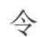

$$
u (t) = \mathbf {A} (t) \cdot \mathbf {B} (t)
$$

这里 $u(t)$ 是两矢量 A 和 B 的标积, 是 t 的标量函数. 令

$$
u (t + \Delta t) = u (t) + \Delta u (t)
$$

$$
\mathbf {A} (t + \Delta t) = \mathbf {A} (t) + \Delta \mathbf {A} (t), \quad \mathbf {B} (t + \Delta t) = \mathbf {B} (t) + \Delta \mathbf {B} (t)
$$

于是 $\Delta u = (A + \Delta A) \cdot (B + \Delta B) - A \cdot B = \Delta A \cdot B + A \cdot \Delta B + \Delta A \cdot \Delta B$

$$
\frac {\Delta u}{\Delta t} = \frac {\Delta A}{\Delta t} \cdot B + A \cdot \frac {\Delta B}{\Delta t} + \Delta A \cdot \frac {\Delta B}{\Delta t}
$$

当 $\Delta t\to 0$ 时， $\Delta A\rightarrow 0$ ，所以

$$
\frac {\mathrm{d} u}{\mathrm{d} t} = \frac {\mathrm{d} A}{\mathrm{d} t} \cdot B + A \cdot \frac {\mathrm{d} B}{\mathrm{d} t}
$$

矢量函数的导数在物理学中有很多应用,首先是用于计算质点运动的瞬时速度和瞬时加速度.如图 I.15 所示,一质点在一曲线上运动,其位置 M 可用位置矢量 $\overrightarrow{OM}=r$ 来表示:

$$
r = x i + y j + z k
$$

当质点沿曲线移动时,其坐标 x、y、z 将是时间 t 的函数:

$$
\begin{array}{l} x = x (t) \\ y = y (t) \\ z = z (t) \end{array}
$$

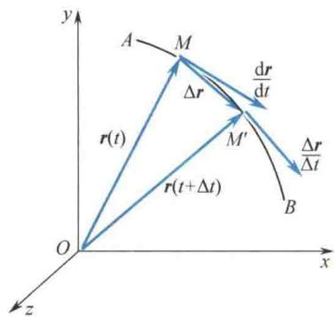

因而

$$
\boldsymbol {r} = \boldsymbol {r} (t) = x (t) \boldsymbol {i} + y (t) \boldsymbol {j} + z (t) \boldsymbol {k}
$$

图I.15 位置矢量的导数

此式是质点运动的运动方程. 将上式对时间 t 求导, 得

$$
\frac {\mathrm{d} \boldsymbol {r}}{\mathrm{d} t} = \frac {\mathrm{d} x}{\mathrm{d} t} \boldsymbol {i} + \frac {\mathrm{d} y}{\mathrm{d} t} \boldsymbol {j} + \frac {\mathrm{d} z}{\mathrm{d} t} \boldsymbol {k}
$$

从导数的定义和图 I.15 可以看到, 质点在 M 点的瞬时速度为

$$
\begin{array}{r l}\frac {\mathrm{d} \boldsymbol {r}}{\mathrm{d} t}&= \lim _ {\Delta t \rightarrow 0} \frac {\boldsymbol {r} (t + \Delta t) - \boldsymbol {r} (t)}{\Delta t} = \lim _ {\Delta t \rightarrow 0} \frac {\Delta \boldsymbol {r}}{\Delta t}\\&= \lim _ {\Delta t \rightarrow 0} \frac {M M ^ {\prime}}{\Delta t}\end{array}
$$

用v表示瞬时速度,于是

$$
\boldsymbol {v} = \boldsymbol {v} (t) = \frac {\mathrm{d} \boldsymbol {r}}{\mathrm{d} t} = \frac {\mathrm{d} x}{\mathrm{d} t} \boldsymbol {i} + \frac {\mathrm{d} y}{\mathrm{d} t} \boldsymbol {j} + \frac {\mathrm{d} z}{\mathrm{d} t} \boldsymbol {k}
$$

一般地说,对矢量函数 $A(t)$ 而言, $\frac{dA}{dt}$ 表示该矢量在各瞬时的时间变化率,它包含3个分矢量: $\frac{dA_{x}}{dt}i$ 、 $\frac{dA_{y}}{dt}j$ 、 $\frac{dA_{z}}{dt}k$ .以上述质点的位置矢量 $r(t)$ 来说,位置矢量 r 对时间的变化率 $\frac{dr}{dt}$ 等于质点的瞬时速度 v,而瞬时速度 v 对时间的变化率 $\frac{dv}{dt}$ 等于质点的瞬时加速度 a.

### 9. 矢量函数的积分

这里先说明上述导数的逆问题. 也就是, 当某矢量函数 $A(t)$ 的导数 $\frac{\mathrm{d} A}{\mathrm{d} t}$ 已知时, 如何求得这个原函数 $A(t)$ . 我们把 $\frac{\mathrm{d} A}{\mathrm{d} t}$ 记作矢量函数 $B(t)$ , 即已知

$$
\frac {\mathrm{d} \mathbf {A}}{\mathrm{d} t} = \mathbf {B} (t) = B _ {x} (t) \mathbf {i} + B _ {y} (t) \mathbf {j} + B _ {z} (t) \mathbf {k}
$$

这里3个标量函数 $B_{x}(t), B_{y}(t), B_{z}(t)$ 分别代表 $\frac{\mathrm{d}A_x}{\mathrm{d}t}, \frac{\mathrm{d}A_y}{\mathrm{d}t}, \frac{\mathrm{d}A_z}{\mathrm{d}t}$ . 所以，将 $\pmb{B}(t)$ 对时间 $t$ 求积分，可变为将 $B_{x}(t), B_{y}(t), B_{z}(t)$ 分别对时间 $t$ 求积分，即

$$
\mathbf {A} = \int \mathbf {B} \mathrm{d} t = A _ {x} \mathbf {i} + A _ {y} \mathbf {j} + A _ {z} \mathbf {k}
$$

式中， $A_{x}, A_{y}, A_{z}$ 分别为

$$
A _ {x} = \int B _ {x} (t) \mathrm{d} t, A _ {y} = \int B _ {y} (t) \mathrm{d} t, A _ {z} = \int B _ {z} (t) \mathrm{d} t.
$$

例如,质点在空间运动时的速度设为

$$
\boldsymbol {v} (t) = v _ {x} (t) \boldsymbol {i} + v _ {y} (t) \boldsymbol {j} + v _ {z} (t) \boldsymbol {k}
$$

将速度函数 $\boldsymbol{v}(t)$ 对时间t求定积分,便可求得质点在空间的位移和位置,其位移(从0时刻到t时刻)是

$$
\int_ {0} ^ {t} \boldsymbol {v} (t) \mathrm{d} t = \left[ \int_ {0} ^ {t} v _ {x} (t) \mathrm{d} t \right] \boldsymbol {i} + \left[ \int_ {0} ^ {t} v _ {y} (t) \mathrm{d} t \right] \boldsymbol {j} + \left[ \int_ {0} ^ {t} v _ {z} (t) \mathrm{d} t \right] \boldsymbol {k}
$$

其位置矢量 r 为

$$
\boldsymbol {r} (t) = \int_ {0} ^ {t} \boldsymbol {v} (t) \mathrm{d} t + \boldsymbol {r} _ {0}
$$

式中， $r_{0}$ 是一个由初始条件决定的常矢量，即 t = 0 时刻质点的位置矢量。又如，质点所受的变力 $F(t)$ 设为

$$
\boldsymbol {F} (t) = F _ {x} (t) \boldsymbol {i} + F _ {y} (t) \boldsymbol {j} + F _ {z} (t) \boldsymbol {k}
$$

将 $F(t)$ 对时间 t 求定积分,便可求得质点所受到的冲量为

$$
\boldsymbol {I} = \int_ {0} ^ {t} \boldsymbol {F} (t) \mathrm{d} t = \left[ \int_ {0} ^ {t} F _ {x} (t) \mathrm{d} t \right] \boldsymbol {i} + \left[ \int_ {0} ^ {t} F _ {y} (t) \mathrm{d} t \right] \boldsymbol {j} + \left[ \int_ {0} ^ {t} F _ {z} (t) \mathrm{d} t \right] \boldsymbol {k}
$$

式中，3个标量积分分别是冲量 I 的 3 个分量，即 $I_{x}$ 、 $I_{y}$ 和 $I_{z}$ .

关于矢量函数的积分,尤其是当这个函数是空间坐标 x、y、z 的多元函数时,还有如线积分、面积分、体积分等其他较复杂的积分计算(要按不同的定义式进行).例如,功的计算就是对一个矢量函数求线积分的问题.我们知道,当力 F 作用在一个质点上,在力的作用下质点移动一个微小位移 ds 时(见图 I.16),该力 F 所做的元功 $dW = F \cdot ds$ .所以,当质点移动一段路程 ab 时,该力 F 所做的总功应为

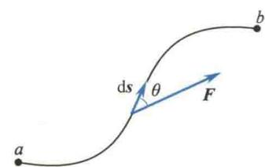  
图I.16 矢量函数的线积分

$$
W = \int_ {a} ^ {b} \boldsymbol {F} \cdot \mathrm{d} \boldsymbol {s} = \int_ {a} ^ {b} F \cos \theta \mathrm{d} s = \int_ {a} ^ {b} F _ {s} \mathrm{d} s
$$

式中， $\theta$ 是力 $F$ 和位移 $\mathrm{ds}$ 之间的夹角， $F_{s}$ 是 $F$ 沿 $\mathrm{ds}$ 方向的分量。这种形式的积分叫作 $F$ 沿曲线 $ab$ 的线积分。如果此积分沿着封闭曲线进行（从 $a$ 点出发仍旧回到 $a$ 点），则此积分可写为 $\oint F \cdot \mathrm{d}s$ 。

一般地说，对一矢量函数 $B(x,y,z)$ 沿某一曲线 $C$ （起点 $a$ ，终点 $b$ ）求线积分，可写作

由于

$$
\begin{array}{r l} & \int_ {C _ {a b}} \boldsymbol {B} \cdot \mathrm{d} s \\ & \boldsymbol {B} = B _ {x} \boldsymbol {i} + B _ {y} \boldsymbol {j} + B _ {z} \boldsymbol {k} \\ & \mathrm{d} s = \mathrm{d} x \boldsymbol {i} + \mathrm{d} y \boldsymbol {j} + \mathrm{d} z \boldsymbol {k} \\ & \boldsymbol {B} \cdot \mathrm{d} s = B _ {x} \mathrm{d} x + B _ {y} \mathrm{d} y + B _ {z} \mathrm{d} z \end{array}
$$

$$
\int_ {C _ {a b}} \pmb {B} \cdot \mathrm{d} \pmb {s} = \int_ {C _ {a b}} B _ {x} \mathrm{d} x + \int_ {C _ {a b}} B _ {y} \mathrm{d} y + \int_ {C _ {a b}} B _ {z} \mathrm{d} z
$$

即化为计算3个标量函数的积分的总和.对于力 $\pmb{F}$ 而言，这样3个积分式 $\int_{C_{ab}}F_x\mathrm{d}x,\int_{C_{ab}}F_y\mathrm{d}y$ 和 $\int_{C_{ab}}F_z\mathrm{d}z$ 就是分力 $F_{x},F_{y}$ 和 $F_{z}$ 所做的功.

### 10. 梯度

### 1) 标量场和矢量场

任何物质的运动,或者任何一个物理过程,总是在一定的空间和时间内发生的.如果空间(或者它的某一部分)的每一点都对应某个物理量的确定值,便称此空间为该物理量的场.如果该物理量仅是数量性质的,便称相应的场为标量场;如果该物理量是矢量性质的,便称相应的场为矢量场.例如,温度和大气压强等都是数量性质的,这些物理量有确定值的空间便称为温度场、压强场等,都是标量场;而空气的流速或地磁场的磁感应强度所构成的场便是矢量场.所以,要注意到这里所谓的场只具有数学上的意义,意思是指空间位置的函数.因此,标量场只是指一个空间位置的标量函数,如 $\Phi(x,y,z)$ ;而矢量场就是指一个空间位置的矢量函数,如 $A(x,y,z)$ .

若我们所研究的物理量在空间内每一点的值不随时间变化,则这种场称为稳定场(或恒定场),否则便是不稳定场.静电场、重力场、温度分布恒定的场,都是稳定场.

### 2) 等值面

设某一物理量,如静电场的势(电势),在空间内形成稳定的标量场,以 $U(x,y,z)$ 表示.假定 $U(x,y,z)$ 是x、y、z的单值连续函数,而且有连续的一阶偏导数,则函数 $U(x,y,z)$ 在空间内具有同一数值的各点所组成的曲面称为等值面或等势面,即

$$
U (x, y, z) = C \quad (C \text {为常量})
$$

不同的 C 值对应于不同的等值面.

### 3) 梯度

为了研究标量场中某一点 $P$ 附近标量函数 $\Phi(x, y, z)$ 的变化情况，设想从 $P$ 点经无限小的位移元 $\mathrm{d}l(\mathrm{d}l = \mathrm{d}x\mathbf{i} + \mathrm{d}y\mathbf{j} + \mathrm{d}z\mathbf{k})$ 到达 $P'$ 点时， $\Phi$ 值的增量为 $\mathrm{d}\Phi$ 。由于已经假设 $\Phi(x, y, z)$ 是 $x, y, z$ 的单值连续函数，而且有连续的一阶偏导数，所以

$$
\mathrm{d} \Phi = \frac {\partial \Phi}{\partial x} \mathrm{d} x + \frac {\partial \Phi}{\partial y} \mathrm{d} y + \frac {\partial \Phi}{\partial z} \mathrm{d} z\tag{I.1}
$$

考察式（I.1）之后，可以引进一个新的矢量，它在3个坐标轴上的分量分别为 $\frac{\partial\Phi}{\partial x}$ 、 $\frac{\partial\Phi}{\partial y}$ 、 $\frac{\partial\Phi}{\partial z}$ ，并以grad $\Phi$ 来表示该矢量

$$
\operatorname{grad} \Phi = \frac {\partial \Phi}{\partial x} i + \frac {\partial \Phi}{\partial y} j + \frac {\partial \Phi}{\partial z} k\tag{I.2}
$$

那么 $\mathrm{d}\Phi$ 便可写成两矢量grad $\Phi$ 和 $\mathrm{d}l$ 的标积形式（按标积的公式 $A\cdot B = A_{x}B_{x} + A_{y}B_{y} + A_{z}B_{z})$ 即

$$
\mathrm{d} \Phi = \operatorname{grad} \Phi \cdot \mathrm{d} l\tag{I.3}
$$

新定义的矢量 grad $\Phi$ 称为 $\Phi$ 的梯度, 它反映函数 $\Phi$ 在空间内的变化情况. 从定义式 (I.2) 可知, grad $\Phi$ 的 3 个分量

$$
\frac {\partial \Phi}{\partial x}, \quad \frac {\partial \Phi}{\partial y}, \quad \frac {\partial \Phi}{\partial z}
$$

分别反映函数 $\Phi$ 沿 x、y、z 3 个坐标轴方向的变化情况. 可是, 矢量 grad $\Phi$ 本身究竟是什么意义呢？当把矢量 grad $\Phi$ 和 $\Phi$ 的等值面联系起来考察时，就看得比较清楚了。根据式（I.3），考虑到标积的公式 $A \cdot B = |A| \cdot |B| \cos \theta (\theta$ 为 A 和 B 的夹角），可知

故

$$
\begin{array}{l} \mathrm{d} \Phi = | \text {grad} \Phi | \cos \theta \mathrm{d} l \\ \frac {\mathrm{d} \Phi}{\mathrm{d} l} = | \text {grad} \Phi | \cos \theta \end{array}\tag{I.4}
$$

式中， $\left|\operatorname{grad}\Phi\right|$ 是矢量 $\operatorname{grad}\Phi$ 的大小， $\theta$ 是矢量 $\operatorname{grad}\Phi$ 和 $\mathrm{d}l$ 之间的夹角， $\left|\operatorname{grad}\Phi\right|\cos\theta$ 则表示矢量 $\operatorname{grad}\Phi$ 沿 $\mathrm{d}l$ 方向的分量， $\frac{\mathrm{d}\Phi}{\mathrm{d}l}$ 表示函数 $\Phi$ 沿 $\mathrm{d}l$ 方向的变化率，叫作函数 $\Phi$ 的方向导数。如图I.17所示，曲面I表示通过P点的等值面，显然，当位移元 $\mathrm{d}l$ 所取的方向不相同时，方向导数 $\frac{\mathrm{d}\Phi}{\mathrm{d}l}$ 也不相同。例如，当 $\mathrm{d}l$ 取在P点的等值面上时， $\Phi$ 值没有变化， $\frac{\mathrm{d}\Phi}{\mathrm{d}l}=0$ ；当 $\mathrm{d}l$ 取在P点的等值面上的法向单位矢量 $n_{0}(n_{0}$ 指向 $\Phi$ 值增大的一边）的方向时， $\frac{\mathrm{d}\Phi}{\mathrm{d}l}$ 有最大值。 $\frac{\mathrm{d}\Phi}{\mathrm{d}l}$ 的最大值等于多少呢？观察式（I.4）就清楚了：当 $\theta=0$ 时， $\frac{\mathrm{d}\Phi}{\mathrm{d}l}$ 的值最大，等于 $\left|\operatorname{grad}\Phi\right|$ 。如上所说， $\theta$ 表示矢量 $\operatorname{grad}\Phi$ 和 $\mathrm{d}l$ 之间的夹角，现在 $\mathrm{d}l$ 取在 $n_{0}$ 方向，所以 $\theta=0$ 这一结果表明矢量 $\operatorname{grad}\Phi$ 的方向和 $n_{0}$ 的方向一致。式（I.4）表示，在P点处函数 $\Phi$ 沿任一 $\mathrm{d}l$ 方向的方向导数 $\frac{\mathrm{d}\Phi}{\mathrm{d}l}$ 等于该点处的 $\Phi$ 的梯度（ $\operatorname{grad}\Phi$ ）沿 $\mathrm{d}l$ 的分量。总之，在P点处 $\Phi$ 的梯度（ $\operatorname{grad}\Phi$ ）方向沿着通过P点的等值面的法线方向，而指向 $\Phi$ 值增大的一边， $\Phi$ 的梯度的量值则反映了 $\Phi$ 值沿其梯度的方向的增加率。或者说， $\Phi$ 的梯度表示了函数 $\Phi$ 在该点的变化率最大的方向和最大变化率的值。 $\Phi$ 在其他方向上的变化率（方向导数）等于 $\operatorname{grad}\Phi$ 在该方向上的分量。

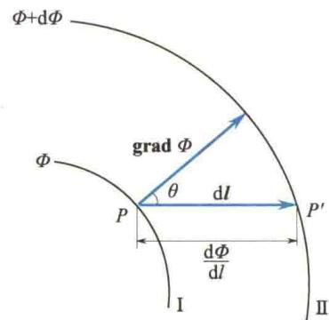  
图 I.17 在 P 点处, grad $\Phi$ 的方向垂直于通过 P 点的等值面, 指向 $\Phi$ 值增大的一边

我们知道,在静电场中移动单位正电荷时,反抗电场力所做的功等于电势的增加,即

$$
\mathrm{d} U = - \boldsymbol {E} \cdot \mathrm{d} l
$$

与式（I.3）进行比较，可得

$$
\boldsymbol {E} = - \operatorname{grad} U
$$

上式表明电场强度 E 等于电势梯度 grad U 的负值. 电场强度 E 的大小等于电势梯度, 即等于该处等势面上沿法线方向的单位长度上电势的变化量, 电场强度 E 的方向与电势增加的方向相反, 即指向电势降低的方向.

常用算符 $\nabla$ 来表示 $\frac{\partial}{\partial x}\mathbf{i} + \frac{\partial}{\partial y}\mathbf{j} + \frac{\partial}{\partial z}\mathbf{k}$ ，即

$$
\nabla = \frac {\partial}{\partial x} \boldsymbol {i} + \frac {\partial}{\partial y} \boldsymbol {j} + \frac {\partial}{\partial z} \boldsymbol {k}\tag{I.5}
$$

这个算符叫作哈密顿算子,用 $\nabla$ 将梯度简记为

$$
\operatorname{grad} \Phi = \nabla \Phi
$$

$\nabla$ 是矢量微分算符, 它具有矢量和微分运算的双重特性, 把 $\nabla$ 用在矢量或标量函数上时, 要特别加以注意.

## 4）梯度的线积分和保守场

一般情况下，任一单值连续可导的标量场的势函数 $\Phi (x,y,z)$ 总是与一定的场强 $e$ 相关联，其关系如下：

$$
e = - \operatorname{grad} \Phi
$$

所以，只要各点的势函数确定，该场中各点的场强也就唯一确定了.因为

$$
\int_ {A} ^ {B} \boldsymbol {e} \cdot \mathrm{d} \boldsymbol {l} = - \int_ {A} ^ {B} \mathbf {g r a d} \Phi \cdot \mathrm{d} \boldsymbol {l} = - \int_ {A} ^ {B} \mathrm{d} \Phi = \Phi_ {A} - \Phi_ {B}
$$

这说明任意 A、B 两点间矢量 e 的线积分，与连接这两点的路线的形状无关.

因此，矢量 e 沿任一闭合路径 L 的线积分就必然为零.

$$
\oint_ {L} \boldsymbol {e} \cdot \mathrm{d} \boldsymbol {l} = - \oint \mathrm{d} \Phi = 0
$$

凡是具有上述性质的场均称为保守场. 静电场是一保守场. 反之, 若有一力 F 绕任一闭合曲线的线积分为零, 则必然存在一个与 F 相联系的保守场.
