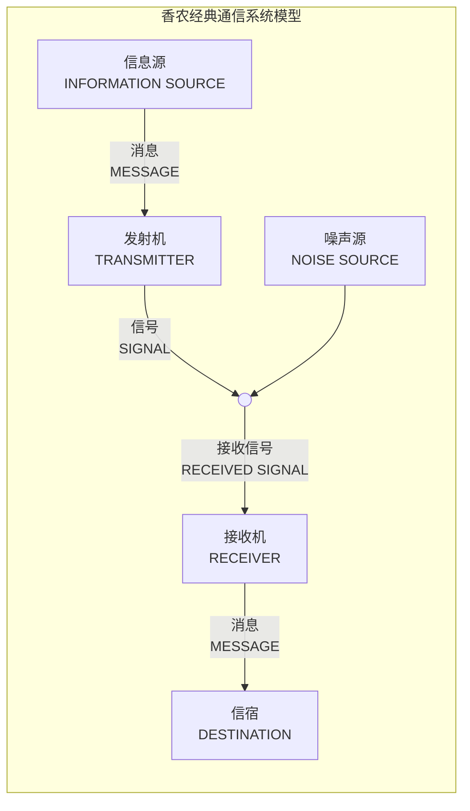
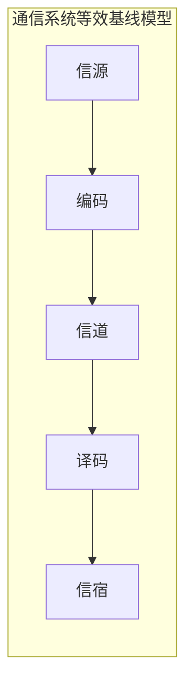
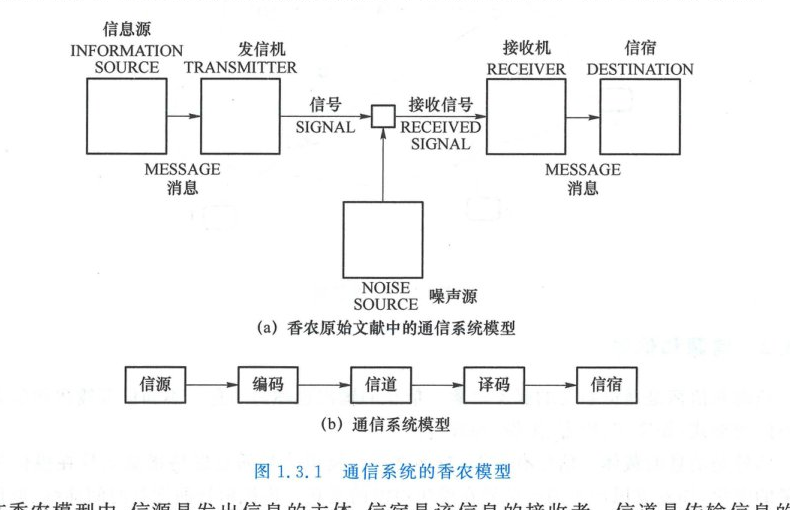
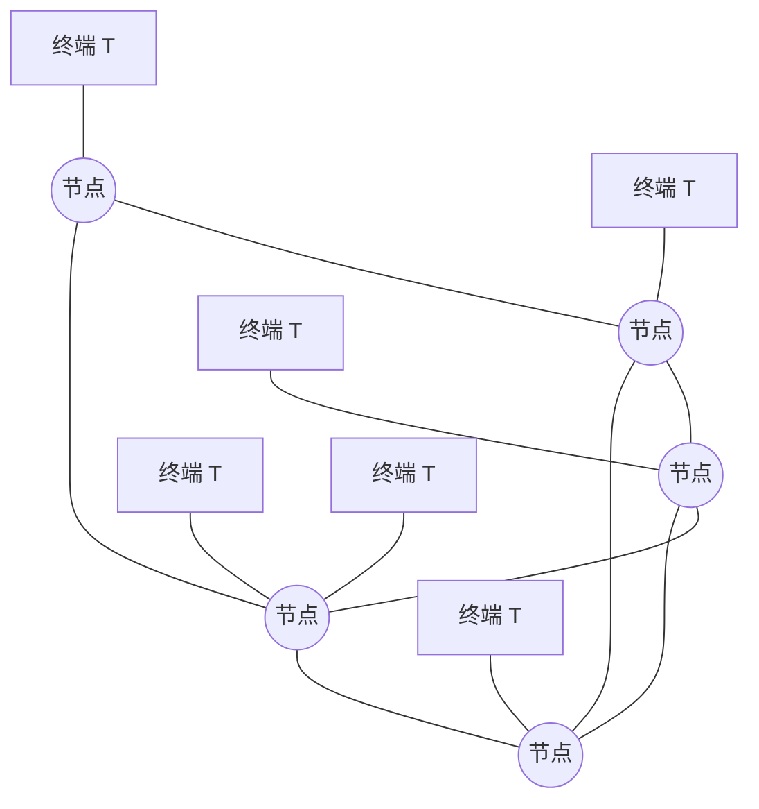
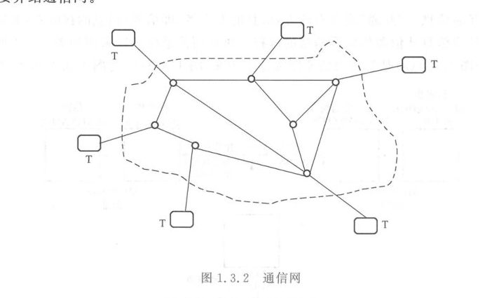
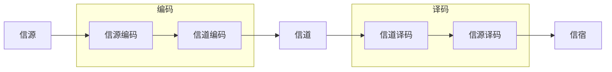
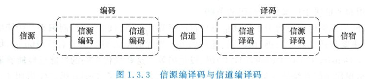

import Knowledge from '@/components/Knowledge.astro';
import ExerciseTrigger from '@/components/exercises/ExerciseTrigger.astro';

## 1.3.1 通信系统模型

通信是互通信息。“互通”说明有两方：信息的发出者，即**信源**；信息的接收者，即**信宿**。通信的过程就是将信息从信源传输到信宿的过程。研究通信系统可以采用如图 1.3.1 所示的香农模型，其中图 1.3.1(a) 是将香农的原图加注了中文，图 1.3.1(b) 与图 1.3.1(a) 等价。

<figure class="vp-figure">

  

  <figcaption>图 1.3.1 通信系统的香农模型（原书影印参考）</figcaption>
</figure>

在香农模型中，信源是发出信息的主体，信宿是该信息的接收者。信道是传输信息的通道，如电缆、光缆、无线信道等。信道一般会引入噪声干扰以及信号失真。

香农模型中的编码是广义的，泛指把信息变换为信号所经历的各种信号处理，对应的译码是从接收信号中恢复出原始信息的相反过程。例如，两个人面对面说话，说话人是信源，听者是信宿。说话人通过控制嘴巴把想表达的意思变成声波振动信号，这个过程就是香农模型中的编码。声波通过空气媒介传播，到达听者。听者用耳朵接收声音信号，再通过大脑中的算法识别出说话人的意思，这个过程是香农模型中的译码。

基于香农模型，通信原理的学习内容就是：针对信源和信道的具体特性，发端如何设计承载信息的发送信号（编码），收端如何从接收信号中检测还原出发送的信息（译码）。

香农模型所示的系统是单向通信系统，信息只从信源传到信宿。现代的通信系统一般是双向的。例如，手机既可以发送，也可以接收。双向通信系统可由两个单向通信系统构成。两边的通信终端都有信源和信宿，有相应的编码和译码过程。一对终端和它们之间的信道构成一个点对点的通信系统。

<Knowledge title="传输模式分类：单工、半双工与全双工">

点到点通信的传输模式主要分为三类：

- **单工（Simplex）**：通信是单向的，信号仅能沿一个固定方向传输，如无线电广播、寻呼机；
- **半双工（Half Duplex）**：通信双方皆可发送和接收，但同一时刻仅允许一方传输，双方轮流进行，如传统对讲机；
- **双工（Full Duplex / 全双工）**：通信双方能够在同一时刻双向互通，如移动电话、现代数字宽带系统。

</Knowledge>

许多终端相互通信时，需要将它们连接成通信网，如图 1.3.2 所示。一个通信网包含许多节点。相邻两个节点之间是一条由点对点通信系统形成的通信链路。

<figure class="vp-figure">

  

  <figcaption>图 1.3.2 通信网（原书影印参考）</figcaption>
</figure>

图 1.3.2 中虚线范围内是一个通信网，实线代表链路。终端发出的信息沿着网络中的一条路径到达另一个终端，这条路径（路由）由一条条首尾相接的点对点链路组成。

举例来说，北京的学生与拉萨的父母微信视频时，北京手机发出的无线电信号并不是直接到达拉萨的手机，而是在运营商巨大的网络中，沿着一条路由，经由一系列链路，到达拉萨的手机。这一过程可能包括地面无线链路、光纤链路、卫星链路等多种不同类型的链路。本章主要学习点对点通信系统的一般原理。本书第 13 章简要介绍通信网。

---

## 1.3.2 信源和信号

信源和信宿是通信系统的服务对象。信源的输出也称为**消息（Message）**。不同信源输出的消息可以有不同的形式，如文字、声音、图像、视频等。

**信号（Signal）**是消息的载体。信号有模拟、数字之分：

- **模拟信号**：指该信号在模仿某个物理量的变化，如麦克风产生的电信号在模仿声波的变化。模拟信号通常是时间连续、取值连续的信号；
- **数字信号**：在数字信号处理中指经过采样量化的信号，是模拟信号的数字化，其特征是时间离散、取值离散。在通信原理中，数字信号是表示或携带数字信息的信号，如 Wi-Fi 发出的无线信号代表一个由“0”“1”二进制数构成的比特流。

发送端将消息转换成信号进行处理、变换、发送，到接收终端后再转换成消息提供给信宿。除了载荷信源信息的信号外，现代的通信系统还需要有协助通信功能实现的控制指令，称为**信令信号（Signaling Signal）**。

此外，除了携带信源信息的信号外，通信系统中还存在**干扰信号**，如外界噪声、设备内部噪声、邻路干扰以及各种失真因素引起的符号间干扰（Intersymbol Interference, ISI）。

---

## 1.3.3 信源编码

香农模型中广义的编码译码可以进一步分为**信源编译码**和**信道编译码**两部分，如图 1.3.3 所示。

<figure class="vp-figure">

  

  <figcaption>图 1.3.3 信源编译码与信道编译码（原书影印参考）</figcaption>
</figure>

信源编码包括将信源消息转换成电信号的传感器及其后续信号处理。

<Knowledge title="信源编码的核心使命与实现手段">

**信源编码的目的主要是提高系统的有效性**，也就是能让同样的信道可传送更多的信息：

1. **模拟信源的频带压缩**：在模拟通信中，体现有效性最主要的参数是信号带宽，它决定信号所占用的信道资源。信源编码的任务就是压缩频带。例如，考虑人耳特性和对语音的要求，可将语音信号的频带限制在 $300 \sim 2\,700\text{ Hz}$ 之内；电视信号利用人眼对色彩分辨率较低的特性，将亮度信号与彩色信号分离，分别限制频带。
2. **模拟信源的数字化**：模拟信源经过采样、量化、编码等处理后，可转换为比特流。为了尽量降低数字化后的比特速率，可在保证失真度满足要求的条件下，采取降低采样率、减少量化级数、优化量化设计等措施。
3. **数字信源的压缩**：压缩信源输出的比特速率是信源编码的目标，可采用哈夫曼编码（Huffman Coding）等无失真的熵编码技术。

</Knowledge>

---

## 1.3.4 信道编码

通信系统中的信道可分为两大类：

1. **无线信道**：利用自由空间的电磁波来传播信息。这种信道只能传送高频的带通信号，因此需要调制解调器、高频振荡器、变频和天线等组成的收发信机。这些设备把信源编码输出的信号变换成适合于信道传送的信号，可以归属于广义的信道编码。
2. **有线信道**：包括明线、对称电缆、同轴电缆和光缆等。有线信道有许多属于基带信道，其频带范围是从很低频率到高频。通过基带信道传输信息时，不一定需要调制解调单元。光缆信道是有线信道，但它与无线信道一样只能传送带通信号，差别只是把无线电波变成了光波。

信道的承载容量通常远大于单个用户所需。为了充分利用信道，可采用**复用（Multiplexing）**和**多址接入（Multiple Access）**技术：

- **复用技术**：将多个信源输出变换成相互正交的信号后叠加起来再进行传输。在接收端可利用正交性将各路分开。常见复用方式有频分复用（FDM）、时分复用（TDM）、码分复用（CDM）等。模拟通信系统常用 FDM；数字通信系统信号处理灵活，以 TDM 最常见。
  - 4G、5G 移动通信系统采用了**正交频分复用（OFDM）**，将多个调制符号通过频谱虽有交叠但彼此正交的子载波复用在一起，具备优异的抗频率选择性衰落能力；
  - 若无线信道同时具有时间选择性和频率选择性，可采用**正交时频空间（OTFS）**调制技术；
  - 对于安装了多天线的多输入多输出（MIMO）系统，可以采用**空分复用（SDM）**。
- **多址接入技术**：多址是多用户共享传输媒介的复用技术。多址与复用的主要差别是：多址不要求各个信源的信号集中在一起，每个用户终端对信号变换后直接接入信道。
  - 1G 采用 FDMA，2G 采用 TDMA 与 FDMA 组合，3G 采用 CDMA，4G/5G 采用 OFDMA；
  - 近年来还发展出了**非正交多址（NOMA）**技术。
  - 复用与多址虽然涉及多个用户的通信，但在通信网视角中仍属于物理层通信。在香农模型中，复用和多址属于广义信道编码的范畴。

<Knowledge title="狭义信道编码与现代前沿演进">

**狭义的信道编码专门指为了提高信息传输的可靠性而进行的差错控制编码**：

- **传统编码**：主要包括线性分组码、循环码、卷积码等；
- **现代前沿编码**：Turbo 码、低密度奇偶校验码（LDPC 码）、极化码（Polar 码）等。这些现代编码的纠错性能已经能够逼近香农极限，成为现代通信系统的主流信道编码（如 3G/4G 采用 Turbo 码，5G 采用 LDPC 码及极化码）；
- **联合信源信道编码（JSCC）**：将信道编码与信源编码联合设计；
- **语义通信**：以任务为主体，“先理解，后传输”，其代表性模型正是信源信道联合编码，已成为 6G 标准化组织关注的候选技术。

</Knowledge>

<ExerciseTrigger chapter={1} section="1.3" title="1.3 通信系统的构成 课后习题与自测" />
