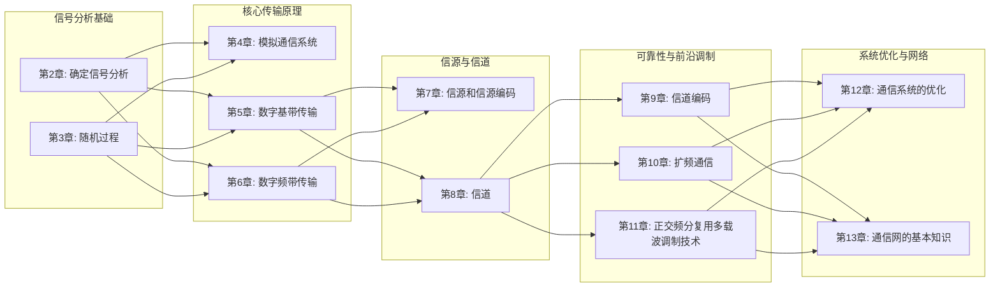
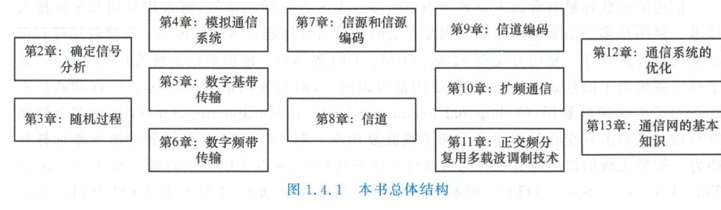

import Knowledge from '@/components/Knowledge.astro';

本书总体结构如图 1.4.1 所示：

<figure class="vp-figure">

  

  <figcaption>图 1.4.1 本书总体结构（原书影印参考）</figcaption>
</figure>

<Knowledge title="《通信原理（第5版）》全书知识拓扑架构">

- **信号分析基础（第 2、3 章）**：
  学习通信原理必须掌握的数学与信号工具。第 2 章讲述确定信号分析（信号模型、能量/功率、傅里叶变换、解析信号、等效低通）；第 3 章讲述随机过程（统计特性、平稳随机过程、高斯过程、窄带噪声、匹配滤波器）。
- **核心通信传输原理（第 4、5、6 章）**：
  第 4 章介绍模拟通信系统（幅度调制与角度调制、抗噪声性能）；从第 5 章起全面进入数字通信时代，第 5 章系统阐述数字基带传输（码型、功率谱、奈奎斯特第一准则、眼图、时域均衡）；第 6 章系统剖析数字频带传输（2ASK/2FSK/2PSK/2DPSK、QPSK、MQAM 以及 MSK/GMSK 恒包络调制）。
- **信源与信道理论（第 7、8 章）**：
  第 7 章讨论信源与信源编码（信息熵、无失真信源编码、PCM 语音数字化）；第 8 章讨论信道特性与香农信道容量（恒参/随参信道、多径衰落、相干带宽、香农容量公式）。
- **差错控制与先进多载波传输（第 9、10、11 章）**：
  第 9 章解决传输可靠性与差错控制（线性分组码、循环码、卷积码、现代逼近香农极限的 Turbo 码、LDPC 码与极化码）；第 10 章讨论扩频通信与抗干扰机制（伪随机序列、DSSS、FHSS、CDMA 系统原理）；第 11 章介绍现代宽带通信基石——正交频分复用（OFDM、循环前缀、抗多径衰落能力）。
- **系统优化与通信网络（第 12、13 章）**：
  第 12 章从信息论高度审视通信系统的多维度综合优化；第 13 章从点对点通信跃升至多节点网络化系统，讨论通信网体系、交换方式、网络拓扑与通信协议信令。

</Knowledge>

本书第 4~12 章主要考虑点对点物理层通信，其中的技术也支撑多用户多址通信。现代的通信系统需要考虑多点之间的通信，形成通信网络。通信网是现代通信技术发展的重点。本书第 13 章讨论通信网的基本原理。通信网是通信系统与交换设备包括信令和协议的结合，所以第 13 章将简要阐述交换的基本原理、多址接入的交换方式以及协议和信令等方面的基本知识。
