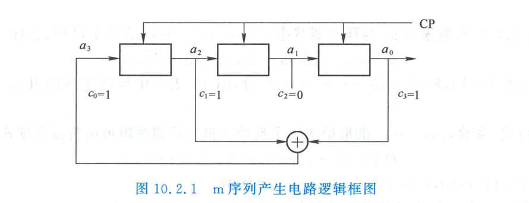
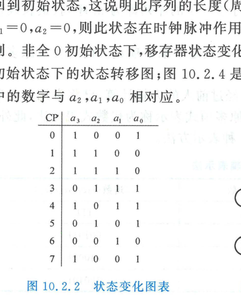
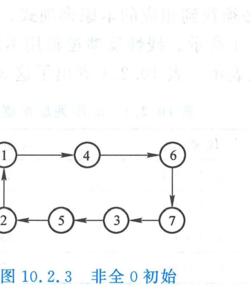
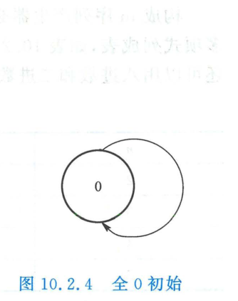
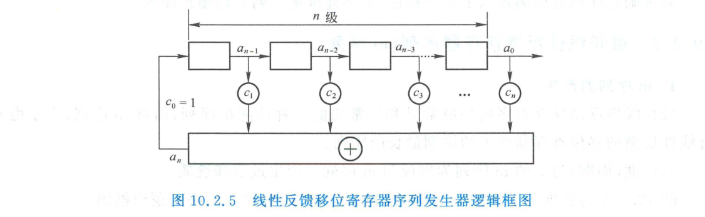
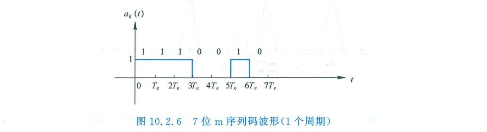
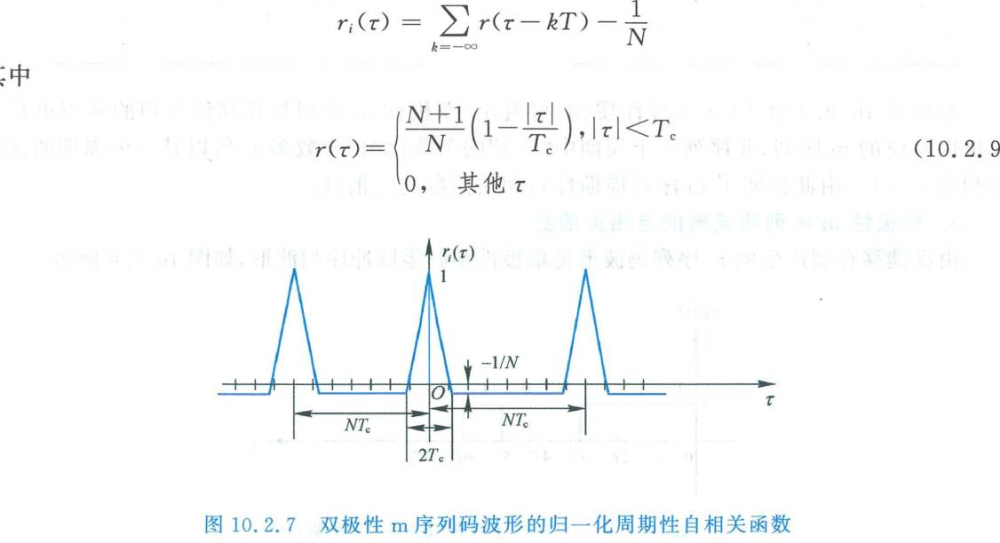
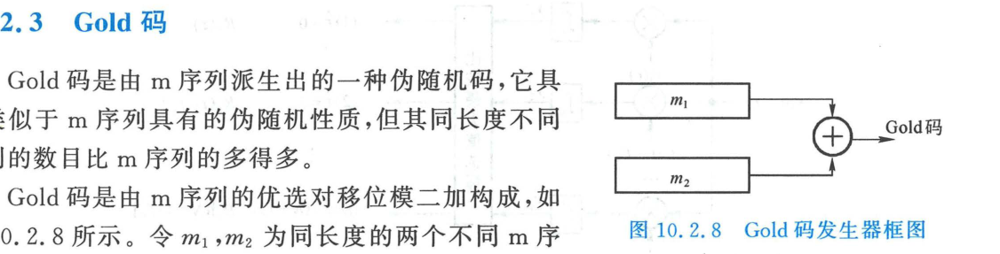

import Card from '@/components/Card.astro';
import ExerciseTrigger from '@/components/exercises/ExerciseTrigger.astro';

伪随机码（Pseudorandom Noise Sequence，简称 PN 码或伪随机序列）是一种**具备类似于随机噪声序列统计特性、但由确定性离散逻辑电路生成并具有严格周期性的二值数字序列**。在现代数字扩频通信、CDMA 多址系统、卫星导航定位（GPS/北斗）以及密码学流密码中，伪随机码构成了物理层核心基石。

---

## 10.2.1 伪随机序列的定义与统计特性

在概率论中，理想的二进制独立同分布随机序列被称为**伯努利序列（Bernoulli Sequence）**。该序列由符号 $\{0, 1\}$（或极性电平 $\{+1, -1\}$）构成，各码元之间相互统计独立，且符号 $0$ 与 $1$ 出现的先验概率完全相等（各为 $1/2$）。

<Card title="伯努利随机序列的三大基本统计特性" type="star">
一个理想的无偏随机二进制序列在统计学上严格服从以下 3 项基本规律（高斯-格洛姆伪随机准则）：

1. **均衡特性（Balance Property）**：
   在任意足够长的序列片段中，符号 $0$ 与 $1$ 出现的相对频率各为 $1/2$；
2. **游程特性（Run Property）**：
   序列中连续出现相同符号的子串称为一个**游程（Run）**，其包含的相同符号个数称为**游程长度**。在所有游程中：
   - 长度为 $1$ 的游程数占总游程数的 $1/2$；
   - 长度为 $2$ 的游程数占总游程数的 $1/4$；
   - 长度为 $k$ 的游程数占总游程数的 $1/2^k$（对任意有限正整数 $k$）；
3. **自相关特性（Shift-and-Compare Correlation）**：
   若将给定的随机序列循环位移任意 $j$ 位（$j \ne 0$），所得的新序列与原序列逐位对应比较，二者相同的元素个数与不同的元素个数各占一半（即统计互不相关）。
</Card>

若一个人工构造的**确定性周期序列**能够精确或近似满足上述三大特性，且周期充分大，则称该序列为**伪随机序列（Pseudorandom Sequence）**。

---

## 10.2.2 最长线性反馈移存器序列（m 序列）

最长线性反馈移位寄存器序列（Maximal-Length Linear Feedback Shift Register Sequence，简称 **m 序列**）是扩频通信中应用最为广泛、数学性质最为优良的经典伪随机序列。它是由具有线性模 2 加法反馈逻辑的 $n$ 级移位寄存器所能产生的**周期达到理论极限最大值**的序列。

### 1. m 序列的产生结构与状态转移

以 $n = 3$ 级移位寄存器为例，其产生的 m 序列周期为 $N = 2^3 - 1 = 7$。

在基准时钟脉冲（CP）驱动下，各级触发器寄存的状态不断向右移位更新。设触发器的初始状态为：
$$
(a_2, a_1, a_0) = (0, 0, 1)
$$
电路在连续 7 个时钟节拍下的内部状态演变规律如下表所示：

从状态图与变化表可以总结出以下关键推论：
1. **周期性**：在第 7 个时钟脉冲到达时，移位寄存器的状态重新恢复到初始值 $(0, 0, 1)$，因而输出序列的循环周期严格为 $N = 7$；
2. **全零自锁禁区**：若移存器的初始状态全为零 $(a_2, a_1, a_0) = (0, 0, 0)$，由于反馈端是纯线性模 2 加法，后继输入永远为 $0 \oplus 0 = 0$，系统将永远陷入死锁全零状态。因此，**由 $n$ 级移存器组成的线性反馈网络，其状态总数共 $2^n$ 种，剔除全零自锁状态后，能够遍历的最大可能状态数恰为 $2^n - 1$**。达到这一理论极限周期的序列即为 m 序列。

---

### 2. 一般 $n$ 级线性反馈移位寄存器与特征多项式

由 $n$ 级双稳态触发器组成的通用线性反馈移位寄存器（LFSR）框图如下所示：

反馈反馈输入信号 $a_n$ 与移存器当前各级状态 $a_{n-1}, a_{n-2}, \dots, a_0$ 之间服从线性模 2 线性递推方程：
$$
a_n = \sum_{k=1}^n c_k a_{n-k} \pmod 2 = c_1 a_{n-1} \oplus c_2 a_{n-2} \oplus \dots \oplus c_n a_0
$$
式中反馈抽头开关系数 $c_k \in \{0, 1\}$。$c_k = 0$ 表示该级抽头断开；$c_k = 1$ 表示接入模 2 加法器。

LFSR 的结构完全由其**结构特征多项式（Characteristic Polynomial）**表征：
$$
f(x) = c_0 + c_1 x + c_2 x^2 + c_3 x^3 + \dots + c_n x^n = \sum_{k=0}^n c_k x^k
$$
由于末级输出必须反馈回输入端且反馈回路常闭，工程上恒有 $c_0 = 1, c_n = 1$。

<Card title="定理：m 序列生成的充要条件" type="star">
**$n$ 级线性反馈移位寄存器能够产生周期为 $N = 2^n - 1$ 的 m 序列的充分必要条件是：其特征多项式 $f(x)$ 是伽罗华域 $\text{GF}(2)$ 上的本原多项式（Primitive Polynomial）。**
</Card>

常用阶数的本原多项式已由代数编码理论详尽给出，如下表所示：

| 级数 $n$ | 本原多项式代数式 $f(x)$ | 八进制编码表示 | 二进制反馈系数序列 $(c_n c_{n-1} \dots c_1 c_0)$ |
| :---: | :--- | :---: | :---: |
| **2** | $x^2 + x + 1$ | 7 | `111` |
| **3** | $x^3 + x + 1$ | 13 | `001 011` |
| **4** | $x^4 + x + 1$ | 23 | `010 011` |
| **5** | $x^5 + x^2 + 1$ | 45 | `100 101` |

---

### 3. m 序列的四大核心代数性质

#### (1) 均衡特性（Balance Property）
在一个完整周期 $N = 2^n - 1$ 内，符号 **"1" 的出现次数比 "0" 恰好多出 1 次**：
- "1" 的总个数为：$2^{n-1}$；
- "0" 的总个数为：$2^{n-1} - 1$。
这是因为除去不可达的全零状态外，所有可能的状态向量恰好被遍历一次，而在全部 $2^n$ 种状态中末位为 0（偶数）与末位为 1（奇数）各占一半。

#### (2) 游程特性（Run Property）
在 m 序列的一个周期内，所有长度的游程总数严格为 $2^{n-1}$。其中：
- 长度为 $1$ 的游程数占游程总数的 $1/2$；
- 长度为 $2$ 的游程数占游程总数的 $1/4$；
- 长度为 $k$ 的游程数占游程总数的 $1/2^k$（$1 \le k \le n-2$）；
- 连续出现 "0" 的最大游程长度为 $n - 1$（因为全零状态不存在）；
- 连续出现 "1" 的最大游程长度为 $n$（对应寄存器内部全 1 状态）。

#### (3) 移位相加特性（Shift-and-Add Property）
若将一个 m 序列 $M_p$ 与其任意循环移位序列 $M_q$（移位量 $p \ne q$）逐位进行模 2 加法，**所得到的新序列必定是原 m 序列的另一个特定相移序列 $M_s$**：
$$
M_p \oplus M_q = M_s
$$

#### (4) 极其尖锐的二值自相关特性（Two-Valued Autocorrelation）
设单极性 m 序列为 $a_k \in \{0, 1\}$，将其线性映射为极性对称的双极性双电平序列 $b_k \in \{+1, -1\}$：
$$
b_k = 1 - 2 a_k = \begin{cases} +1, & a_k = 0 \\ -1, & a_k = 1 \end{cases}
$$
此时，**单极性码元的模 2 加法运算严格映射为双极性码元的代数相乘运算**：

| 单极性模 2 加 $\oplus$ | 0 | 1 |
| :---: | :---: | :---: |
| **0** | 0 | 1 |
| **1** | 1 | 0 |

| 双极性相乘 $\times$ | +1 | -1 |
| :---: | :---: | :---: |
| **+1** | +1 | -1 |
| **-1** | -1 | +1 |

双极性 m 序列的归一化离散周期自相关函数定义为：
$$
r_b(j) = \frac{1}{N} \sum_{k=1}^N b_k b_{k+j}
$$
根据移位相加性质，当偏移量 $j \ne m N$ 时，积序列 $b_k b_{k+j}$ 仍然是同一个双极性 m 序列的某种相移，其一个周期内包含 $2^{n-1}$ 个 "$-1$" 与 $2^{n-1}-1$ 个 "$+1$"，所有元素之代数和恒为 $-1$！因此，**m 序列的自相关函数具有严格的二值冲激阶跃性**：
$$
r_b(j) = \begin{cases} 1, & j = m N \; (m \in \mathbb{Z}) \\ -\frac{1}{N}, & j \ne m N \end{cases}
$$
当周期 $N \gg 1$ 时，离轴自相关电平 $-1/N \to 0$，自相关曲线在原点处呈现极度尖锐的类 $\delta$ 脉冲形态。

---

### 4. 双极性 m 序列连续物理码波形的自相关函数

实际硬件电路中生成的扩频信号是由矩形脉冲成形的连续时间波形。设单码片持续时间为 $T_c$（码片速率 $R_c = 1/T_c$），基带码片波形为门函数 $g(t) = \text{rect}(t/T_c - 1/2)$。

一个周期持续时间为 $T = N T_c$ 的单极性 7 位 m 序列码波形如图所示：

对应的双极性连续码波形为：
$$
b_i(t) = \sum_{k=1}^N b_{ik} g(t - (k-1)T_c)
$$
对其进行无限周期延拓得到 $B_i(t) = \sum_{n=-\infty}^\infty b_i(t - nT)$。其归一化连续时间周期自相关函数定义为：
$$
R_i(\tau) = \frac{1}{T} \int_0^T B_i(t) B_i(t + \tau) \, dt
$$

连续时间自相关函数 $R_i(\tau)$ 的解析闭式表达式为：
$$
R_i(\tau) = \sum_{k=-\infty}^\infty r(\tau - k T) - \frac{1}{N}
$$
式中等腰三角脉冲核函数为：
$$
r(\tau) = \begin{cases} \left( 1 + \frac{1}{N} \right) \left( 1 - \frac{|\tau|}{T_c} \right), & |\tau| \le T_c \\ 0, & |\tau| > T_c \end{cases}
$$
该自相关函数具有极其重要的工程意义：
- **尖锐三角主峰**：仅在时延 $|\tau| \le T_c$ 的微小范围内出现大于零的高相关峰值；
- **极小相关副瓣**：超出单码片时延 $|\tau| > T_c$ 后，相关输出迅速跌落并恒定保持在微弱的负电平 $-1/N$；
- **时延高分辨力**：正是这种基底极平、主峰极尖锐的几何形态，赋予了扩频接收机在复杂多径干扰中分辨纳秒级路径时延、实现精准帧捕获与测距定位的卓越物理能力。

---

## 10.2.3 Gold 码：突破地址码容量瓶颈

尽管 m 序列拥有近乎完美的自相关特性，但在 CDMA 蜂窝移动通信等需要大量多址信道地址码的应用场景中，单一 m 序列存在两大致命缺陷：
1. **可用码字数量匮乏**：在同一级数 $n$ 下，本原多项式的数目非常有限，能生成的相互正交的 m 序列少之又少；
2. **互相关电平不可控**：不同 m 序列之间的互相关峰值可能非常高，这将导致极其严重的用户间多址干扰（MAI）。

为了解决这一问题，Gold 提出了利用一对具有特殊互相关性质的 m 序列——**优选对（Preferred Pair）**进行组合构造的全新伪随机码族——**Gold 码**。

<Card title="m 序列优选对与三值互相关函数" type="star">
设两个同周期 $N = 2^n - 1$ 的不同 m 序列 $m_1$ 和 $m_2$。若它们的周期互相关函数 $r_{12}(j)$ 仅取以下确定的**三个离散数值**，则称 $m_1$ 与 $m_2$ 构成一个**优选对**：
$$
r_{12}(j) \in \{ u_1, u_2, u_3 \}
$$
其中：
- 当级数 $n$ 为奇数时：
  $$
  u_1 = -1, \quad u_2 = 2^{(n+1)/2} - 1, \quad u_3 = -\left[ 2^{(n+1)/2} + 1 \right]
  $$
- 当级数 $n$ 为偶数（且 $n \ne 4k$）时：
  $$
  u_1 = -1, \quad u_2 = 2^{(n+2)/2} - 1, \quad u_3 = -\left[ 2^{(n+2)/2} + 1 \right]
  $$
</Card>

### Gold 码序列集的构造与规模
由选定的一组优选对 $m_1$ 和 $m_2$，通过将 $m_2$ 进行各种不同的循环移位后再与 $m_1$ 进行模 2 相加：
$$
G_k = m_1 \oplus \mathcal{T}^k(m_2), \quad k = 0, 1, \dots, N-1
$$
加上原本的两个优选母码 $m_1$ 和 $m_2$，整整可以构成：
$$
M = N + 2 = 2^n + 1
$$
个长度均为 $N = 2^n - 1$ 的 Gold 码序列。

**性能优势**：
- **序列集容量激增**：可用码字数从几个扩增至 $2^n + 1$ 个（例如 $n=10$ 时，Gold 码多达 1025 个，而 m 序列仅有 60 个）；
- **全集互相关有界**：集合内任意两个不同序列之间的互相关峰值均被严格限制在三值界限内，有效规避了强互相关干扰，因而在 GPS 粗捕获码（C/A 码）以及 WCDMA 等移动通信系统中获得了极为标准化的规模部署。

---

<ExerciseTrigger chapter={10} section="10.2" title="10.2 伪随机码 思考题与自测" />
