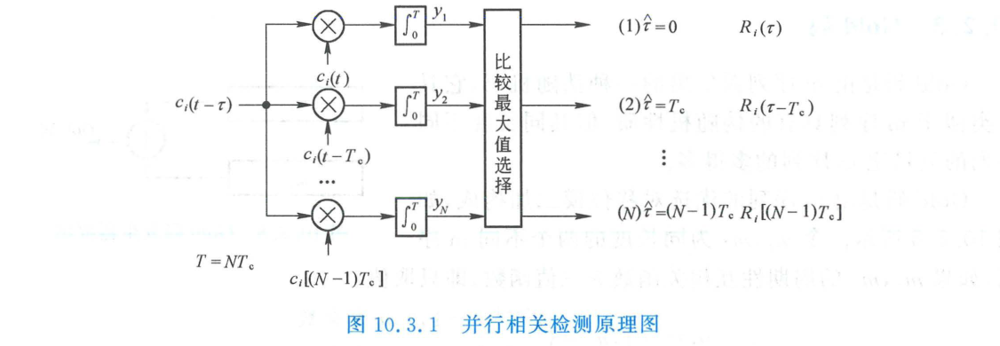
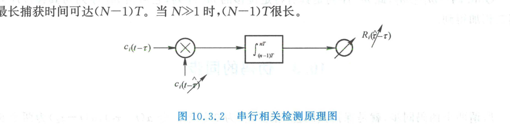
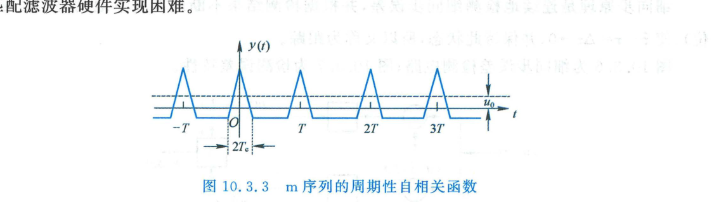
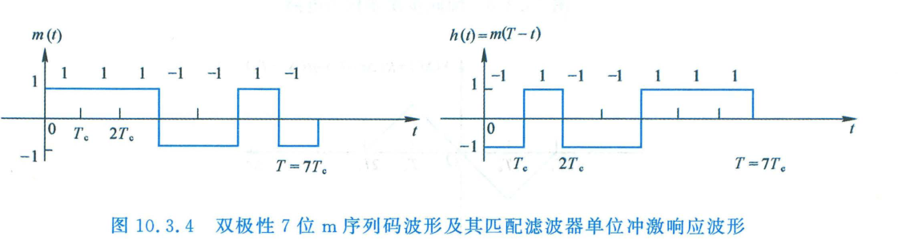
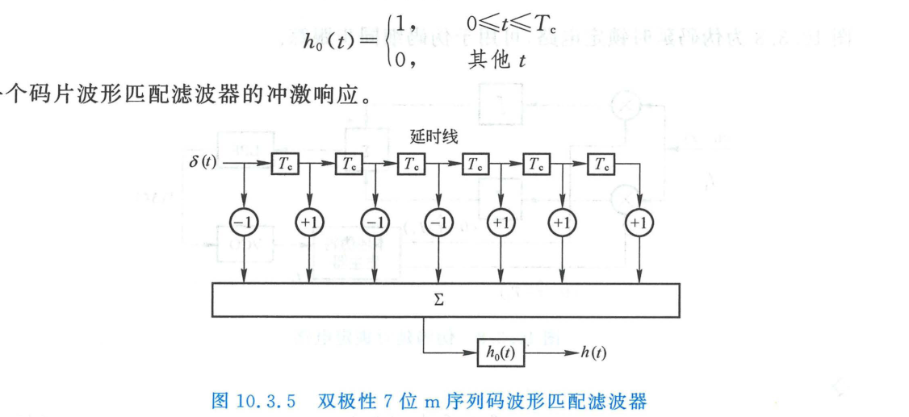
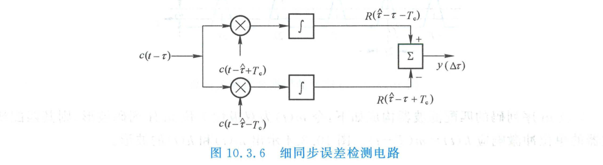
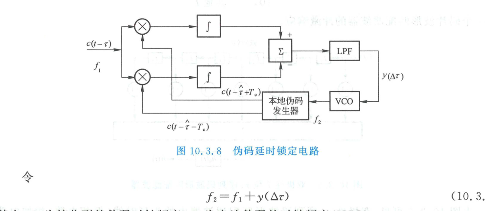
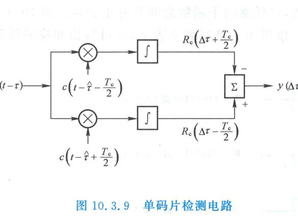
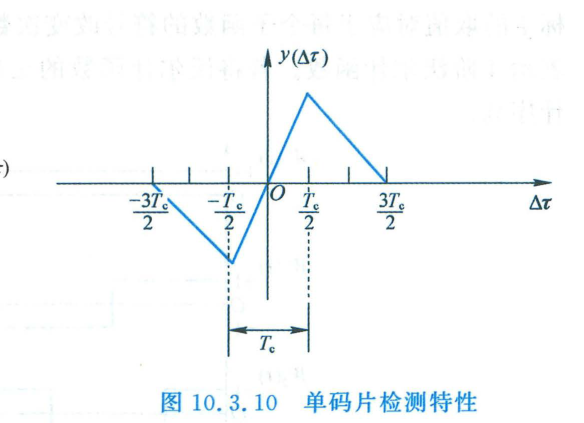

import Card from '@/components/Card.astro';
import ExerciseTrigger from '@/components/exercises/ExerciseTrigger.astro';

扩频通信系统实现解扩与数据恢复的绝对先决条件是：**接收端本地重构的伪随机码序列必须与接收信号中的扩频码在时间和相位上严格对齐**。若本地伪码与接收伪码的时延偏差超过一个码片（$|\tau| > T_c$），由伪随机码极其尖锐的二值自相关特性可知，相关器输出将瞬间跌落至接近零的微弱副瓣电平，系统将彻底无法解扩解调。因此，伪码同步是扩频接收机技术中最核心、最具挑战性的关键环节。

---

## 10.3.1 伪码同步的物理内涵与两阶段准则

设接收信号中所含的扩频伪码为 $c_i(t - \tau)$，接收机本地生成的伪码副本为 $c_i(t - \hat{\tau})$，则两者的相对时延误差（相位差）定义为：
$$
\Delta \tau = \hat{\tau} - \tau
$$
**伪码实现理想同步的物理目标，即是控制本地时钟相位，使时延误差恒定保持为零**：
$$
\lim_{t \to \infty} |\Delta \tau| = 0
$$

工程上，扩频伪码通常以周期 $T = N T_c$（$N$ 为码长，$T_c$ 为码片宽度）进行周期性重复延拓：
$$
c_i(t) = \sum_{n=-\infty}^\infty a_i(t - nT)
$$
面对初始未知的时延偏差（可能跨越成千上万个码片），扩频系统通常将同步建立过程严格划分为两个阶段：

<Card title="伪码同步的两阶段体系" type="star">
1. **粗同步（Acquisition，又称捕获）**：
   在宽广的不确定时间窗口内进行全范围盲搜寻，将本地伪码与接收伪码的相位误差压缩收敛至**单个码片宽度以内**：
   $$
   |\Delta \tau| < T_c \quad \text{或} \quad |\Delta \tau| \le \frac{T_c}{2}
   $$
   使相关值落入自相关函数的三角形主瓣能量聚焦区；
2. **细同步（Tracking，又称跟踪）**：
   在粗同步捕获成功后启动闭环负反馈鉴相跟踪环路，进一步消除微小的相位偏差，迫使：
   $$
   |\Delta \tau| \to 0
   $$
   并在多普勒频移、晶振时钟漂移等动态物理扰动下持续维持精确的时间对齐。
</Card>

---

## 10.3.2 粗同步（捕获）的三大主流实现方法

### 1. 并行相关检测法（Parallel Correlators）

并行相关法在接收端配置 $N$ 个并行的相关积分器。各支路的本地伪码预先在相位上依次错开一个码片宽度（即 $0, T_c, 2T_c, \dots, (N-1)T_c$）。

各支路同时与输入伪码 $c_i(t - \tau)$ 进行周期为 $T = N T_c$ 的相关积分：
$$
R_i(k T_c - \tau) = \int_0^T c_i(t - \tau) c_i(t - k T_c) \, dt, \quad k = 0, 1, \dots, N-1
$$
由最大值判决逻辑比较各支路输出，选取幅度最大者对应的相位作为时延估计值 $\hat{\tau}$。

- **优势**：捕获速度极快，理论上只需一个伪码周期 $T$ 即可完成全相位捕获；
- **缺陷**：硬件资源开销与码长 $N$ 成正比。当长码 $N \gg 1$ 时（如 GPS 测距码 $N = 1023$ 或军事长码 $N = 2^{42}-1$），庞大的硬件乘法器与积分器在工程上无法承受。

---

### 2. 串行相关检测法（Sliding Correlator）

串行相关检测法（滑动相关法）仅采用**单套相关积分器**，通过在时间轴上逐步“滑动”本地伪码的相位来搜索对齐点。

- **工作机制**：在每个检验周期 $T$ 内计算相关值 $R_i(\hat{\tau} - \tau)$，并将其与预设门限 $\gamma$ 进行门限比较。若超过门限，判定捕获成功并转入跟踪；若未超过门限，则通过跳脉冲或降频方式将本地伪码相位向后滑动一个微小步长（通常为 $T_c$ 或 $T_c/2$），进入下一个周期的检测；
- **性能特征**：硬件电路极度精简小巧；但最恶劣情况下的最大搜索时间可达 $(N - 1)T$。当码长 $N$ 极大时，捕获时延较长。

---

### 3. 匹配滤波捕获法（Matched Filter Acquisition）

设单周期单极性或双极性伪码为 $a_i(t)$（$0 \le t \le T$），根据线性系统最佳匹配滤波理论，针对该信号的最佳匹配滤波器的单位冲激响应为原信号的时反与时延形式：
$$
h(t) = a_i(T - t)
$$
当周期性延拓信号 $c_i(t) = \sum_{n=-\infty}^\infty a_i(t - nT)$ 输入该匹配滤波器时，滤波器的连续时间输出为：
$$
y(t) = c_i(t) * h(t) = \int_{-\infty}^\infty h(\alpha) c_i(t - \alpha) \, d\alpha = R_i(t - T)
$$
输出信号 $y(t)$ 精确对应于伪码的周期性自相关函数！

当且仅当接收伪码的一个完整周期完全进入滤波器时（即 $t = k T$ 时刻），输出达到瞬时最大峰值 $y(kT) = R_i(0) = \max$。

- **实时性优势**：匹配滤波法属于无源实时卷积处理，不需要本地振荡源与滑动步进控制，最短捕获时间仅为单周期 $T$。

#### 7位 m 序列匹配滤波器的硬件拓扑实现
以双极性 7 位 m 序列码波形 $m(t)$ 为例，其匹配滤波器冲激响应波形为时反波形 $h(t) = m(T - t)$：

实际硬件电路由抽头延迟线（Tapped Delay Line, TDL）、倒相放大器、模拟加法器以及单码片匹配积分器 $h_0(t)$ 级联构成：

- **工程瓶颈**：对于短码，声表面波（SAW）器件或数字 FIR 抽头滤波器能很好地实现匹配滤波；但在长码通信中，高阶多抽头模拟延时线的元器件离散度与热噪声极难控制。

---

## 10.3.3 细同步（跟踪）：延时锁定环（DLL）

在捕获过程将时延误差约束在单码片范围内（$|\Delta \tau| < T_c$）之后，系统自动切入**细同步跟踪环路**。工程中最主流的细跟踪方案是**延时锁定环（Delay-Locked Loop, DLL）**。

### 1. 超前-滞后双码片误差检测与鉴相 S 曲线

为了获得能够指示时延超前还是滞后的极性误差电压，DLL 采用“超前支路（Early）”与“滞后支路（Late）”两路正交对称的相关器：

- **超前支路**：采用相位相对于估计值 $\hat{\tau}$ 提前一个码片 $T_c$ 的本地伪码 $c(t - \hat{\tau} + T_c)$，相关输出为 $R(\Delta \tau + T_c)$；
- **滞后支路**：采用相位相对于估计值 $\hat{\tau}$ 滞后一个码片 $T_c$ 的本地伪码 $c(t - \hat{\tau} - T_c)$，相关输出为 $R(\Delta \tau - T_c)$。

两路相关峰值作差相减，得到误差判决电压：
$$
y(\Delta \tau) = R(\Delta \tau - T_c) - R(\Delta \tau + T_c)
$$
利用双极性伪码三角自相关函数的几何对称性，可以精确推导出误差输出特性曲线（**鉴相 S 曲线**）：

在关键跟踪线性工作区间 $\Delta \tau \in (-T_c, +T_c)$ 内，误差特性呈现奇对称的线性函数：
$$
y(\Delta \tau) = K \cdot \Delta \tau \quad (K > 0)
$$
- 若 $\Delta \tau > 0$（本地码相位滞后），则 $y(\Delta \tau) > 0$，输出正向控制电压；
- 若 $\Delta \tau < 0$（本地码相位超前），则 $y(\Delta \tau) < 0$，输出反向控制电压；
- 若 $\Delta \tau = 0$（两码精确对准），则 $y(\Delta \tau) = 0$，系统处于稳定静态平衡点。

---

### 2. 闭环延时锁定环（DLL）与环路控制

利用该鉴相误差输出控制压控振荡器（VCO）的振荡频率，构成闭环自适应时钟纠偏网络：

设接收端伪码的输入时钟基准频率为 $f_1$，本地伪码发生器的驱动时钟频率为 $f_2$：
$$
f_2 = f_1 + y(\Delta \tau) = f_1 + K \Delta \tau
$$
- 当 $\Delta \tau \in (0, T_c)$ 时，本地时钟频率被抬升（$f_2 > f_1$），本地码发生器加速向前“追赶”，迫使 $\Delta \tau \to 0$；
- 当 $\Delta \tau \in (-T_c, 0)$ 时，本地时钟频率被压低（$f_2 < f_1$），本地码发生器减速“等待”，迫使 $\Delta \tau \to 0$。

该环路的闭环自锁定动态范围为两个完整码片宽度（$[-T_c, +T_c]$，跨度 $2T_c$）。

---

### 3. 单码片（半码片时差）高精度检测方案

为进一步降低多径环境对两支路不平衡带来的干扰并提高鉴相灵敏度，工程上常将超前与滞后的间隔缩减为**半码片**（$\pm T_c/2$）：

- **鉴相范围**：收窄至 $\Delta \tau \in (-T_c/2, +T_c/2)$（跨度 $T_c$）；
- **跟踪精度**：在原点 $\Delta \tau = 0$ 附近的鉴相斜率 $K$ 较双码片方案提升一倍，极大增强了时钟微颤抑制能力与跟踪对准精度。

---

### 4. 伪码跟踪环路的通用系统架构

综合上述电路拓扑，通用的伪码闭环跟踪系统架构由三大功能模块构成：

1. **误差检测鉴相器（Error Detector）**：超前-滞后相关器（双码片或单码片结构）或抖动环（Tau-Dither Loop, TDL）；
2. **环路滤波器与控制器（Loop Filter）**：平滑信道加性高斯白噪声与高频纹波，决定环路的捕获带、锁定带与动态阶数；
3. **时钟相位调整执行机构（Clock Adjuster）**：模拟压控振荡器（VCO）或全数字化的高频倍频加减脉冲数字锁相发生器，实时驱动本地伪码产生器。

---

<ExerciseTrigger chapter={10} section="10.3" title="10.3 伪码的同步 思考题与自测" />
