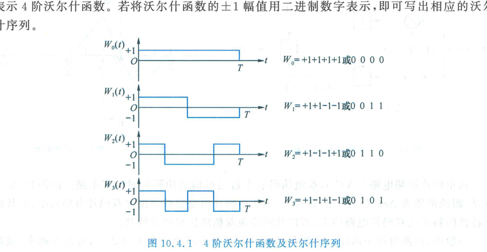
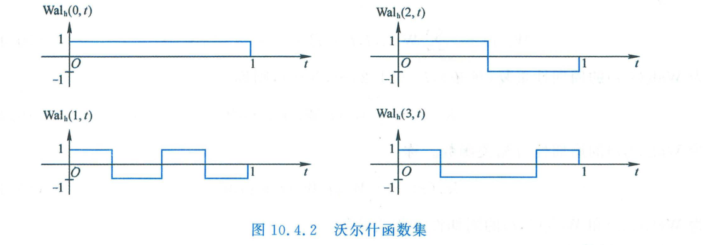
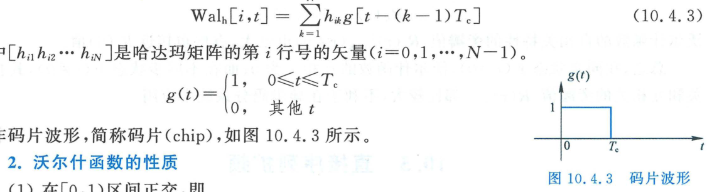

import Card from '@/components/Card.astro';
import ExerciseTrigger from '@/components/exercises/ExerciseTrigger.astro';

在现代多路复用与多址通信系统中，正交信号集是实现无互相干扰信道划分的数学基石。除经典连续正弦载波的正交性外，数字通信系统广泛采用二值（$\{+1, -1\}$）非正弦型正交函数作为**正交码（Orthogonal Codes）**。这类码字极其易于使用数字逻辑硬件（异或门、移位寄存器）进行高速生成与相关处理。主流非正弦正交函数包括拉德马赫（Radermacher）函数、**沃尔什（Walsh）函数**以及正交 Gold 码等。

---

## 10.4.1 沃尔什函数的构成与阿达马矩阵

沃尔什函数集是一组定义在归一化时间区间 $[0, T)$ 内的完备非正弦型正交函数集。相应的离散采样序列称为**沃尔什序列（Walsh Sequences）**或**沃尔什码**。在 IS-95 CDMA 与 3G 蜂窝移动通信系统中，前向链路广泛部署了 64 阶正交沃尔什序列进行物理信道信道化区分。

### 1. 沃尔什函数的定义与几何特征

一个 $N$ 阶沃尔什函数集包含 $N$ 个相互正交的子函数，记为：
$$
\{ W_j(t) \mid t \in [0, T), \; j = 0, 1, \dots, N-1 \}
$$
各子函数具有以下特征：
1. **二值取值**：$W_j(t)$ 的幅度仅在二值离散集合 $\{+1, -1\}$ 中交替取值；
2. **符号改变次数编号**：在归一化定义区间 $[0, T)$ 内，子函数 $W_j(t)$ 内部恰好发生 $j$ 次符号（极性）跳变，下标 $j$ 即代表其符号跳变总次数（排序基数）；
3. **两两严格正交**：集合内任意两个不同序号的子函数相互内积为零。

以 $N = 4$ 阶沃尔什函数为例，其连续波形与对应的离散二进制序列如图所示：

若将双极性电平 $\{+1, -1\}$ 映射为二进制逻辑位 $\{0, 1\}$，4 阶沃尔什序列可直观列写为：
- $W_0 = (+1, +1, +1, +1) \longleftrightarrow (0, 0, 0, 0)$（0 次符号翻转）
- $W_1 = (+1, +1, -1, -1) \longleftrightarrow (0, 0, 1, 1)$（1 次符号翻转）
- $W_2 = (+1, -1, -1, +1) \longleftrightarrow (0, 1, 1, 0)$（2 次符号翻转）
- $W_3 = (+1, -1, +1, -1) \longleftrightarrow (0, 1, 0, 1)$（3 次符号翻转）

---

### 2. 利用阿达马（Hadamard）矩阵递推生成沃尔什序列

在数字硬件工程中，生成各阶沃尔什序列最通用的标准代数方法是利用**阿达马方阵（Hadamard Matrix）**。阿达马矩阵是由元素 $+1$ 和 $-1$ 构成的严格正交正方矩阵，其最低阶形式为 2 阶基矩阵：
$$
\boldsymbol{H}_2 = \begin{bmatrix} +1 & +1 \\ +1 & -1 \end{bmatrix}
$$
更高阶数（$N = 2^m, m \ge 2$）的阿达马矩阵可通过克罗内克积（Kronecker Product）递归构造：
$$
\boldsymbol{H}_N = \begin{bmatrix} \boldsymbol{H}_{N/2} & \boldsymbol{H}_{N/2} \\ \boldsymbol{H}_{N/2} & -\boldsymbol{H}_{N/2} \end{bmatrix}
$$
例如，4 阶阿达马矩阵展开式为：
$$
\boldsymbol{H}_4 = \begin{bmatrix} \boldsymbol{H}_2 & \boldsymbol{H}_2 \\ \boldsymbol{H}_2 & -\boldsymbol{H}_2 \end{bmatrix} = \begin{bmatrix} +1 & +1 & +1 & +1 \\ +1 & -1 & +1 & -1 \\ +1 & +1 & -1 & -1 \\ +1 & -1 & -1 & +1 \end{bmatrix}
$$
阿达马矩阵的每一行（或每一列）均为一个离散正交序列。需要特别强调的是：**阿达马矩阵按自然行号排列的行向量与按符号改变次数递增排序的沃尔什函数下标号之间存在确定的格雷码映射换算关系**。用 $\boldsymbol{H}_N$ 的第 $i$ 行生成的沃尔什函数通常记为 $\text{Wal}_h(i, t)$。

由 4 阶阿达马矩阵各行所生成的连续沃尔什函数波形如下图所示：

一个长度为 $N = 2^m$ 的沃尔什序列可由 $N$ 维双极性行向量表示：
$$
\boldsymbol{h}_i = [h_{i1}, h_{i2}, \dots, h_{iN}], \quad h_{ik} \in \{+1, -1\}
$$
其对应的连续时间沃尔什函数 $\text{Wal}_h(i, t)$ 可通过单码片基准矩形脉冲 $g(t)$ 卷积成形表示为：
$$
\text{Wal}_h(i, t) = \sum_{k=1}^N h_{ik} g(t - (k-1)T_c)
$$
式中 $T_c = T/N$ 为单码片宽度，码片基函数 $g(t)$ 如图所示：

$$
g(t) = \begin{cases} 1, & 0 \le t \le T_c \\ 0, & \text{其他} \end{cases}
$$

---

## 10.4.2 沃尔什函数的核心数学性质

<Card title="沃尔什函数的四项基本代数定理" type="star">
1. **严格区间正交性（Orthogonality）**：
   在归一化定义区间 $[0, 1)$（或 $[0, T)$）内，任意两个沃尔什函数完全内积正交：
   $$
   \int_0^1 \text{Wal}_h(i, t) \text{Wal}_h(j, t) \, dt = \begin{cases} 1, & i = j \\ 0, & i \ne j \end{cases}
   $$
2. **零均值特性（Zero-Mean Property）**：
   除序号 $i = 0$ 的全 1 直流基函数 $\text{Wal}_h(0, t) \equiv 1$ 之外，其余所有序号（$i = 1, 2, \dots, N-1$）的沃尔什函数在完整周期区间内的积分均值严格为零：
   $$
   \int_0^1 \text{Wal}_h(i, t) \, dt = 0 \quad (i \ne 0)
   $$
3. **乘法自封闭性（Multiplicative Closure）**：
   任意两个沃尔什函数的时域逐点乘积必严格等于该集合内的另一个沃尔什函数：
   $$
   \text{Wal}_h(i, t) \cdot \text{Wal}_h(k, t) = \text{Wal}_h(q, t)
   $$
   这表明沃尔什函数集对于函数代数乘法构成一个阿贝尔群（Abelian Group）；
4. **正交完备性（Completeness）**：
   阶数为 $N$ 的沃尔什函数集恰好包含 $N$ 个相互正交且线性无关的基函数，构成了 $N$ 维 Hilbert 空间的完备正交基底。
</Card>

---

## 10.4.3 沃尔什函数的频域展宽与相关特性局限

尽管沃尔什码在同步时具有无瑕的正交性，但在无线复杂多径信道与异步接入系统中，它展现出显著的物理缺陷：

### 1. 频带宽度不均匀性
不同编号的沃尔什函数，其内部符号跳变的剧烈程度截然不同。其频带宽度主要受限于其**最短游程宽度 $T_z$**（近似为 $B \approx 1/T_z$）。例如：
- $\text{Wal}_h(0, t)$ 无符号改变，频宽极窄；
- 高频沃尔什函数每个码片都在翻转，频宽扩展极大。
这种带宽不均衡性导致不同信道使用沃尔什码进行扩频时，获得的扩频处理增益 $G_p = B \cdot T$ 各不相同，不利于统一均衡的抗干扰设计。

### 2. 严重的离轴相关副瓣与异步局限
设 $\text{Wal}_h(i, t)$ 的周期性连续时间自相关函数与互相关函数分别为 $R_i(\tau)$ 与 $R_{ij}(\tau)$：
$$
R_i(\tau) = \int_0^T W_i(t) W_i(t + \tau) \, dt, \quad R_{ij}(\tau) = \int_0^T W_i(t) W_j(t + \tau) \, dt
$$
- **同步状态（$\tau = 0$）**：
  $$
  R_{ij}(0) = 0 \quad (i \ne j)
  $$
  此时多用户之间完全没有相互串扰；
- **非同步状态（$\tau \ne 0$）**：
  只要接收端与发射端存在时延偏差 $\tau \ne 0$（例如移动台在多径反射信道中或者不同移动台异步发射到达基站），**沃尔什函数的自相关副瓣 $|R_i(\tau)|_{\max}$ 与互相关峰值 $|R_{ij}(\tau)|_{\max}$ 均极为恶化**，往往能达到与主峰 $R_i(0)$ 相当的电平！

<Card title="工程选型结论：同步下行 vs 异步上行" type="star">
- **下行链路（基站 $\to$ 终端）**：由于所有信道在基站同一天线端集中发射，各路信号在时域绝对同步，因此**极适合使用纯沃尔什码（或扰码后的沃尔什码）作为前向信道化正交地址码**；
- **异步上行与多径信道**：各移动台空间位置离散且传播时延各异，沃尔什码严重的相关副瓣会引发灾难性的多址干扰（MAI）。因此，**异步通信必须改用具有优良互相关特性的伪随机码（如 Gold 码或 Kasami 码）作为多址扩频码**。
</Card>

---

<ExerciseTrigger chapter={10} section="10.4" title="10.4 正交码 思考题与自测" />
