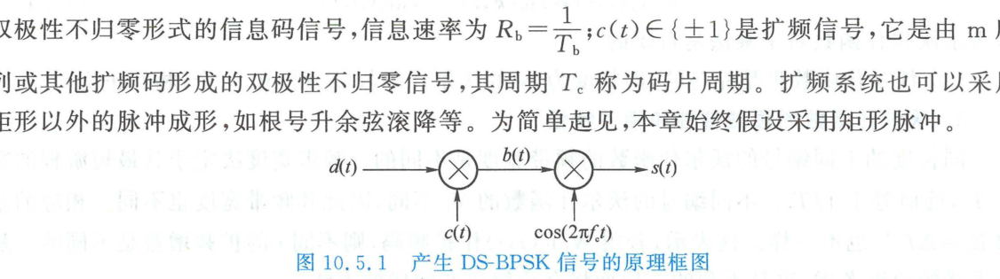
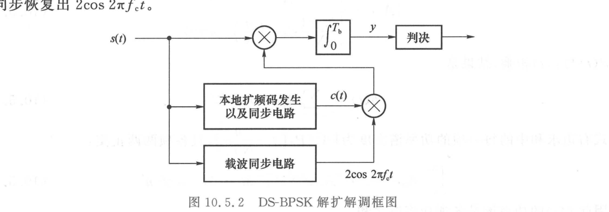
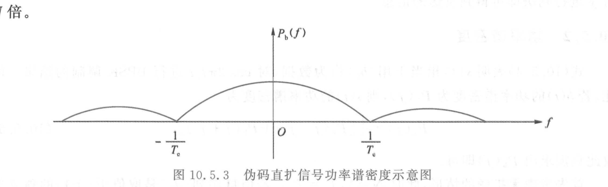

import Card from '@/components/Card.astro';
import ExerciseTrigger from '@/components/exercises/ExerciseTrigger.astro';

直接序列扩频（Direct Sequence Spread Spectrum，简称**直扩**或 **DS-SS**）是扩频通信中应用最为广泛、体制最为成熟的经典调制方式。在 DS-SS 中，原始窄带基带数据直接与高速率伪随机序列在时域逐码片相乘，使信号频谱大幅展宽后再调制到高频载波上传输。本节以最为核心的**直扩二相移相键控（DS-BPSK）**为基准，系统推导其调制解调架构、功率谱演化与多维抗干扰增益。

---

## 10.5.1 DS-BPSK 系统的发射与解扩解调原理

### 1. 发射端调制物理模型

DS-BPSK 信号生成系统的基本逻辑拓扑如下图所示：

设原始基带信息数据为以独立等概方式取值于二值符号集 $\{+1, -1\}$ 的序列 $\{d_k\}$，信息比特持续时间为 $T_b$（信息速率 $R_b = 1/T_b$），其双极性不归零时域信号为：
$$
d(t) = \sum_{k=-\infty}^\infty d_k g(t - k T_b)
$$
式中 $g(t)$ 为幅度为 $1$、宽度为 $T_b$ 的基带矩形门脉冲。

扩频伪随机码序列为取值于 $\{+1, -1\}$ 的离散码片序列 $\{c_n\}$，单码片宽度为 $T_c$（码片速率 $R_c = 1/T_c$），时域扩频信号为：
$$
c(t) = \sum_{n=-\infty}^\infty c_n g_c(t - n T_c)
$$
式中 $g_c(t)$ 为幅度为 $1$、宽度为 $T_c$ 的基带码片矩形脉冲。

<Card title="关键系统参数：扩频因子（Spreading Factor）" type="star">
单数据比特持续时间 $T_b$ 内包含的扩频码片数目定义为**扩频因子（扩频系数）**：
$$
N = \frac{T_b}{T_c} = \frac{R_c}{R_b} \gg 1
$$
在工程系统中，$N$ 通常取值数十至数万不等。
</Card>

基带信息 $d(t)$ 与扩频码 $c(t)$ 直接在时域相乘，生成复合基带扩频脉冲序列 $b(t)$：
$$
b(t) = d(t) c(t) = \sum_{n=-\infty}^\infty b_n g_c(t - n T_c)
$$
式中码片乘积 $b_n = d_{\lfloor n/N \rfloor} c_n \in \{+1, -1\}$（$\lfloor \cdot \rfloor$ 表示向下取整）。每一个数据比特 $d_k$ 均与 $N$ 个连续的扩频码片相乘。

经正弦射频载波 $\cos(2\pi f_c t)$ 进行平衡混频调制后，输出标准的 DS-BPSK 发射信号：
$$
s(t) = b(t) \cos(2\pi f_c t) = d(t) c(t) \cos(2\pi f_c t)
$$

---

### 2. 接收端相干解扩解调物理模型

在接收端，信号恢复必须依赖于两套高精度同步系统：**本地伪码发生及同步电路**与**载波相干同步电路**。

设接收端已精确实现伪码同步（恢复出完全同相位的本地码 $c(t)$）与载波同步（恢复出相干正弦波 $2\cos(2\pi f_c t)$）。在单个比特周期 $[0, T_b]$ 内，输入信号与本地两路同步基准相乘后送入相关积分器，其输出样值为：
$$
y = \int_0^{T_b} s(t) \cdot 2 c(t) \cos(2\pi f_c t) \, dt = \int_0^{T_b} d(t) \cdot c^2(t) \cdot 2\cos^2(2\pi f_c t) \, dt
$$
由于双极性扩频码幅度恒为 $\pm 1$，必有：
$$
c^2(t) \equiv 1
$$
同时滤除二倍频分量 $\cos(4\pi f_c t)$，积分式严格化简为：
$$
y = \int_0^{T_b} d_0 \, dt = d_0 T_b
$$
对样值 $y$ 进行零电平门限比较判决（$y \gtrless 0$），即可无失真地恢复出原始信息比特 $d_0 \in \{+1, -1\}$。

---

## 10.5.2 功率谱密度与低截获隐蔽性

### 1. 功率谱密度的数学推导

复合信号 $s(t) = b(t) \cos(2\pi f_c t)$ 的射频双边带功率谱密度 $P_s(f)$ 由基带信号 $b(t)$ 的功率谱密度 $P_b(f)$ 经载波频移得到：
$$
P_s(f) = \frac{1}{4} \left[ P_b(f - f_c) + P_b(f + f_c) \right]
$$
- **未扩频基准系统（$N = 1, T_c = T_b$）**：
  若基带数据 $\{d_k\}$ 为独立等概二进制序列，其基带功率谱密度为：
  $$
  P_d(f) = T_b \text{sinc}^2(f T_b) = T_b \left( \frac{\sin \pi f T_b}{\pi f T_b} \right)^2
  $$
  其频域第一零点主瓣带宽为 $B_{\text{null}} = R_b = 1/T_b$；
- **直扩系统（扩频因子为 $N$）**：
  若扩频序列 $\{c_n\}$ 亦为独立同分布随机序列，复合序列 $\{b_n\}$ 同样为独立等概序列，其基带功率谱密度为：
  $$
  P_b(f) = T_c \text{sinc}^2(f T_c) = \frac{T_b}{N} \text{sinc}^2\left( \frac{f T_b}{N} \right)
  $$
  此时基带主瓣谱宽急剧展宽至 $B_{\text{ss}} = R_c = 1/T_c = N R_b$。**频带宽度严格展宽了 $N$ 倍**！

若考虑实际周期性 m 序列扩频（假设 m 序列周期与比特宽度一致 $T_b = N T_c$），周期扩频信号 $c(t)$ 可展开为傅里叶谐波级数：
$$
c(t) = \sum_{n=-\infty}^\infty A_n e^{j 2\pi n t / (N T_c)}
$$
其功率谱为无限离散冲激谱经数据谱卷积平滑后的叠加，如图所示：

---

### 2. 能量守恒与低截获概率（LPI）物理特征

直扩调制是一个纯粹的相位翻转过程（$c(t) \in \{+1, -1\}$），其时域瞬时信号功率为：
$$
s^2(t) = d^2(t) c^2(t) \cos^2(2\pi f_c t) = \cos^2(2\pi f_c t)
$$
**直扩信号的总发射功率与未扩频的普通 BPSK 信号完全相等**！

然而，在总辐射功率保持恒定的前提下，射频信号谱宽被展宽了 $N$ 倍，这意味着**直扩信号在带内的功率谱密度峰值相比普通窄带信号暴降了 $N$ 倍（即降低了 $10 \log_{10} N\text{ dB}$）**：
$$
P_{s, \text{peak}} \approx \frac{P_{d, \text{peak}}}{N}
$$
当 $N \gg 1$ 时（如 $N \ge 1000$），直扩信号的功率谱完全被淹没在接收机前端的热噪声底电平之下（$S/N_0 \ll 0\text{ dB}$）。外部侦察监听仪器在频谱仪上只能观测到平坦的高斯白噪声基线，极难截获与破译，赋予了扩频通信极其卓越的**低截获概率（Low Probability of Intercept, LPI）与低检测概率（LPD）**。

---

## 10.5.3 DS-BPSK 系统的多维抗干扰性能数学剖析

### 1. 加性高斯白噪声干扰环境
设接收信号混入双边带功率谱密度为 $N_0/2$ 的加性高斯白噪声 $n_w(t)$：
$$
r(t) = s(t) + n_w(t)
$$
相关积分器输出由有用信号与噪声分量构成：
$$
y = \int_0^{T_b} r(t) \cdot 2 c(t) \cos(2\pi f_c t) \, dt = d_0 T_b + \eta
$$
噪声输出分量为 $\eta = \int_0^{T_b} n_w(t) \cdot 2 c(t) \cos(2\pi f_c t) \, dt$。其均值为 0，其方差为：
$$
\sigma_\eta^2 = E[\eta^2] = N_0 T_b
$$
对比普通无扩频 BPSK 系统（即令 $c(t) \equiv 1$），其噪声输出方差同样严格为 $N_0 T_b$。

<Card title="结论：抗高斯白噪声能力与普通 BPSK 等价" type="star">
**在理想加性高斯白噪声（AWGN）信道中，DS-BPSK 与常规窄带 BPSK 的误码率理论曲线完全重合：**
$$
P_e = Q\left( \sqrt{\frac{2 E_b}{N_0}} \right)
$$
扩展频带本身并不改变抗全频带高斯白噪声的信噪比门限。扩频的威力完全体现在对**窄带干扰、多址干扰以及多径衰落**的强大压制上！
</Card>

---

### 2. 窄带单音与非扩频干扰环境（抗干扰增益）

假设信道中存在恶意窄带非扩频干扰信号：
$$
J(t) = d_2(t) \cos(2\pi f_c t + \varphi_2)
$$
式中 $d_2(t)$ 为与有用数据独立的干扰数据，$R_b = 1/T_b$，初相 $\varphi_2 \sim U[0, 2\pi)$。接收机相关积分器中由该窄带干扰引起的输出分量为：
$$
\eta_J = \int_0^{T_b} d_2(t) \cos(2\pi f_c t + \varphi_2) \cdot 2 c(t) \cos(2\pi f_c t) \, dt = d_{2,0} T_b \cdot \overline{c(t)} \cdot \cos \varphi_2
$$
式中 $\overline{c(t)} = \frac{1}{T_b} \int_0^{T_b} c(t) \, dt$ 为扩频序列在一个比特周期内的直流均值。输出信扰比为：
$$
\gamma_o = \frac{(d_0 T_b)^2}{E[\eta_J^2]} = \frac{T_b^2}{\frac{1}{2} T_b^2 [\overline{c(t)}]^2} = \frac{2}{[\overline{c(t)}]^2}
$$
- 若为未扩频系统（$N = 1, c(t) \equiv 1$），则 $\overline{c(t)} = 1$，输出信扰比为 $\gamma_{o, \text{BPSK}} = 2$；
- 若扩频码采用一个完整周期的 m 序列（$N = 2^n - 1$），其均值严格为 $\overline{c(t)} = -1/N$，此时信扰比为：
  $$
  \gamma_o = 2 N^2
  $$
  **信扰比相对于无扩频系统整整暴增了 $N^2$ 倍**！
- 若扩频码为随机序列或超长截断伪码，码片求和的方差为 $1/N$，信扰比提高倍数约为 $N$。

**物理本质**：窄带干扰经过接收端本地伪码乘法混频后，被强行展宽为一个宽带低谱密度的噪声，而处于宽带状态的有用扩频信号则被相关解扩为能量集中的基带窄带信号。随后的基带低通积分器将绝大部分展宽后的干扰能量滤除在带外！

---

### 3. 多址干扰环境（MAI 与 CDMA 容量）

设信道中存在另一用户发射的同频异步直扩信号：
$$
s_3(t) = d_3(t) c_3(t) \cos(2\pi f_c t + \varphi_3)
$$
与本地参考信号存在时延差 $\tau_3$。经解扩相关后引起的多址干扰样值为：
$$
\eta_{\text{MAI}} = \cos\theta \cdot R_{3c}(\tau_3)
$$
式中 $\theta = \varphi_3 - 2\pi f_c \tau_3 \sim U[0, 2\pi)$。对于绝大多数统计优良的伪随机码，其时域互相关函数均方值为 $E[R_{3c}^2(\tau_3)] = N T_c^2$。

因此，多址输出信扰比为：
$$
\gamma_o = \frac{(d_0 T_b)^2}{E[\eta_{\text{MAI}}^2]} = \frac{T_b^2}{\frac{1}{2} N T_c^2} = \frac{2 (N T_c)^2}{N T_c^2} = 2 N
$$
扩频系数 $N$ 越大，多址信扰比线性按 $N$ 成倍提升，为单频带容纳海量并发用户奠定了物理可能。

---

### 4. 离散多径干扰环境

设接收信号中伴随一条相对时延为 $\tau$（$|\tau| > T_c$）的反射多径：
$$
r(t) = d(t) c(t) \cos(2\pi f_c t) + d(t - \tau) c(t - \tau) \cos(2\pi f_c t + \varphi)
$$
经本地扩频码相关后，该多径在解扩端产生的分量受制于扩频码的非零时延自相关副瓣 $R_c(\tau)$。由于伪随机码在 $|\tau| > T_c$ 时 $R_c(\tau) \approx 0$，多径时延分量在解扩时被当做非相干宽带噪声彻底压制，其多径信扰比同样达到 $\gamma_o = 2N$！

---

<ExerciseTrigger chapter={10} section="10.5" title="10.5 直接序列扩频 思考题与自测" />
