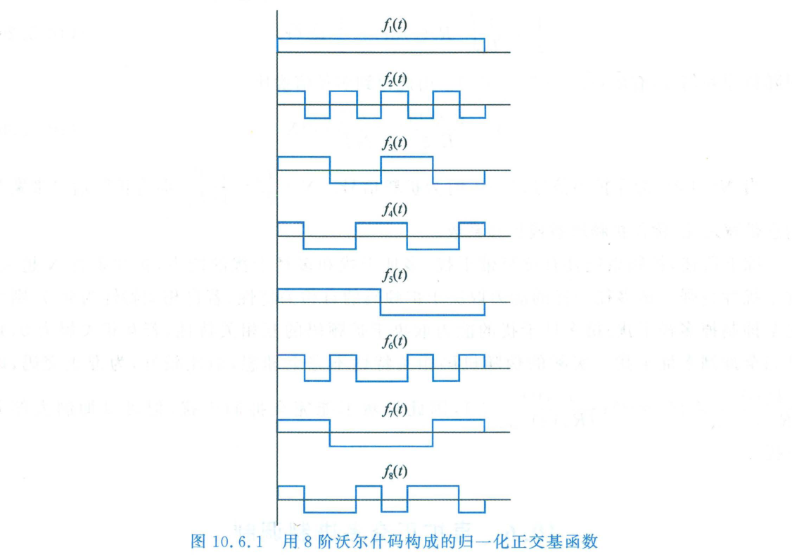

import Card from '@/components/Card.astro';
import ExerciseTrigger from '@/components/exercises/ExerciseTrigger.astro';

在经典数字调制理论中，正交多频键控（MFSK）利用 $M$ 个频率正交的正弦波作为基函数来承载 $k = \log_2 M$ 个信息比特。如果我们将这一思想推广到扩频领域，**将连续正弦载波正交基底替换为由离散二值正交码（如沃尔什码）构成的扩频基函数**，便构成了**直扩正交多进制调制（Direct Sequence M-ary Orthogonal Modulation）**。

---

## 10.6.1 正交基函数的离散波形构造

在正交 MFSK 系统中，$M$ 个相互正交的时域基函数表示为：
$$
f_i(t) = \sqrt{\frac{2}{T_s}} \cos(2\pi f_i t + \theta_i), \quad i = 1, 2, \dots, M, \; t \in [0, T_s]
$$
发射信号波形为 $s_i(t) = \sqrt{E_s} f_i(t)$，式中 $E_s = k E_b$ 为符号能量。

在直扩正交多进制调制中，基函数改由 $M$ 阶沃尔什序列经脉冲成形构成。以 $M = 8$ 进制调制为例，其 8 阶阿达马矩阵通过递推式展开为：
$$
\boldsymbol{H}_8 = \begin{bmatrix} \boldsymbol{H}_4 & \boldsymbol{H}_4 \\ \boldsymbol{H}_4 & -\boldsymbol{H}_4 \end{bmatrix}
$$
展开得到的各行正交向量通过矩形码片波形进行连续化映射，构成 8 个归一化时域正交基函数 $f_1(t), f_2(t), \dots, f_8(t)$：

发射端每输入 $k = \log_2 8 = 3$ 个二进制信息比特，调制器便在 8 个正交基函数中选择一个对应的波形发射：
$$
s_i(t) = \sqrt{E_s} f_i(t) \cos(2\pi f_c t), \quad i \in \{1, 2, \dots, 8\}, \; t \in [0, T_s]
$$

---

## 10.6.2 接收端多路相关解调与性能渐近

### 1. 接收机结构
由于直扩正交多进制调制的基函数满足严格正交性：
$$
\int_0^{T_s} f_i(t) f_j(t) \, dt = \delta_{ij} = \begin{cases} 1, & i = j \\ 0, & i \ne j \end{cases}
$$
接收机采用由 $M$ 路与本地正交沃尔什基函数相乘的**并行相关匹配积分器**构成。判决逻辑根据各支路积分采样值的绝对值（非相干检测）或代数样值（相干检测），选取相关能量最大者作为判定输出。

---

### 2. 维数扩展与逼近香农极限

与常规非正交多元调制（如 16-QAM、64-QAM 因星座点拥挤导致误码率恶化）截然相反，**正交多进制调制的误码性能随着进制数 $M$ 的增加而单调显著改善**：

<Card title="定理：正交调制的香农极限逼近" type="star">
在正交调制信号集中，所有信号矢量的空间欧氏距离为恒定常数：
$$
d_{ij} = \sqrt{2 E_s} = \sqrt{2 k E_b}
$$
随着进制数 $M$ 的指数增长，信号空间的维数 $N = M$ 呈几何级数扩展，带来了巨大的**正交编码增益（Orthogonal Coding Gain）**。

在无衰落高斯白噪声信道中，当 $M \to \infty$ 时，其误比特率（BER）在满足以下香农功率极限临界点时突变为零：
$$
\frac{E_b}{N_0} > \ln 2 \approx 0.693 \longleftrightarrow -1.59\text{ dB}
$$
**直扩正交多进制调制是物理层逼近连续信道香农容量理论极限的经典技术范式。**
</Card>

---

## 10.6.3 典型工业标准应用：IS-95 CDMA 反向链路

在 2G CDMA 经典通信标准 IS-95 中，由于移动终端功率受限且发射机处于移动随机信道，基站端无法提供高质量的相干载波跟踪参考。

为此，IS-95 反向链路（移动台 $\to$ 基站）创新性地采纳了 **64 阶直扩正交多进制调制**：
- 移动台将信道编码后的比特流以 6 个比特为一组（$k = 6$），从 64 阶沃尔什函数集中选取一行正交码进行发射；
- 基站利用快速阿达马变换（FHT, Fast Hadamard Transform）进行超高速非相干能量检测；
- 该设计彻底免除了复杂反向导频跟踪开销，在恶劣低信噪比下保证了极其优越的反向链路传输可靠性。

---

<ExerciseTrigger chapter={10} section="10.6" title="10.6 直扩正交多进制调制 思考题与自测" />
