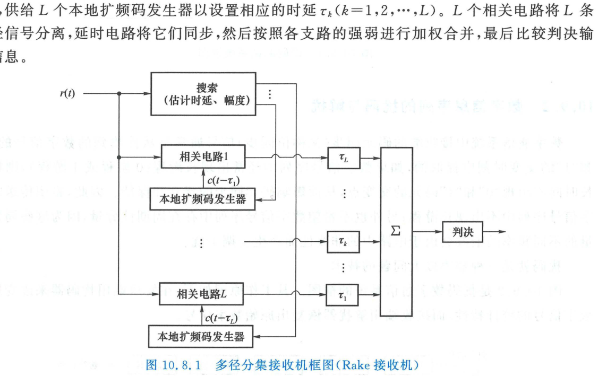

import Card from '../../../../../../components/Card.astro';
import ExerciseTrigger from '../../../../../../components/ExerciseTrigger.astro';

在传统窄带移动通信中，无线信道的多径传播（Multipath Propagation）是导致信号发生剧烈频率选择性衰落与码间串扰（ISI）的祸根。然而，**直接序列扩频信号拥有极高的码片速率与极其尖锐的二值自相关函数**，这一独特的时域高分辨力使得原本有害的多径分量能够被物理分离并同相相加，从而在接收端实现强大的**时间分集（Time Diversity）**。实现这一卓越功能的接收机拓扑被称为 **Rake 接收机（Rake Receiver，因其多指结构如同钉耙而得名）**。

---

## 10.8.1 多径信道下的直扩信号接收模型

设发射的直接序列二相移相键控（DS-BPSK）信号为：
$$
s(t) = d(t) c(t) \cos(2\pi f_c t), \quad d(t), c(t) \in \{+1, -1\}
$$
信号经由具有 $L$ 条离散多径的频率选择性快衰落信道传输后，接收天线端口收到的合成信号表示为：
$$
r(t) = \sum_{k=1}^L \mu_k d(t - \tau_k) c(t - \tau_k) \cos(2\pi f_c t + \varphi_k) + n_w(t)
$$
式中：
- $\mu_k$ 为第 $k$ 条多径的衰落幅度包络（服从相互独立的瑞利分布）；
- $\tau_k$ 为第 $k$ 条多径的绝对传输时延；
- $\varphi_k = -2\pi f_c \tau_k + \theta_k$ 为第 $k$ 径的高频载波相位；
- $n_w(t)$ 为信道加性高斯白噪声。

---

## 10.8.2 多径时延分辨力判据：化害为利

在窄带通信中，由于信号带宽狭窄（符号宽度 $T_s \gg$ 多径时延差），各反射径在接收端发生重叠，引起随机矢量的相长与相消，产生严重的深度衰落。

但在直扩通信中，由于扩频码片周期 $T_c$ 极其微小（微秒至纳秒级）：

<Card title="定理：直扩系统的多径时域分辨力判据" type="star">
设任意两条离散多径 $i$ 与 $j$ 的传播时延差为 $\Delta \tau = |\tau_i - \tau_j|$。
只要时延差**超过一个扩频码片宽度**：
$$
\Delta \tau = |\tau_i - \tau_j| > T_c = \frac{1}{B_{\text{ss}}}
$$
根据伪随机码的尖锐自相关特性（相关主峰底宽仅为 $2T_c$，超出后快速衰减至近乎为零），**接收端即可在时域上将这两条多径信号清晰地独立分辨为两个不相关的信号分量**！
</Card>

未落入当前本地伪码对准窗口的其他径分量，经相关积分后自动退化为等效的高斯宽带底噪，彻底消除了窄带通信中的不可分矢量干涉！

---

## 10.8.3 Rake 接收机的多指合并硬件架构

Rake 接收机通过并行配置多个“手指（Finger）”相关器，分别对准不同多径的时延位置进行能量提取，再进行相干对齐与分集合并：

系统核心由以下四大功能模块协同运行：

1. **信道搜索与估计器（Searcher）**：
   专用的高速滑动搜索电路实时扫描信道的多径延迟剖面（PDP），精准测量各强多径分量的时延 $\tau_k$、信道衰落幅度 $\mu_k$ 与载波相位 $\varphi_k$，并将时延参数动态分配给各接收指；
2. **多指相关解扩阵列（Rake Fingers）**：
   配置 $L$ 个平行的解扩相关支路。第 $k$ 个指的本地伪码发生器注入时延 $\tau_k$（即采用 $c(t - \tau_k)$ 进行解扩），精确剥离出该特定径的原始基带信号：
   $$
   y_k = \mu_k d(t - \tau_k) e^{j \varphi_k}
   $$
3. **时延对齐补偿器（Delay Equalizer）**：
   在基带设置差分延迟缓冲器，分别补偿时延差 $\Delta \tau_k = \tau_{\max} - \tau_k$，迫使所有支路的数据符号在时间轴上实现纳秒级精确对齐；
4. **最大比合并（MRC, Maximal Ratio Combining）**：
   利用信道估计提供的幅度 $\mu_k$ 与相位 $\varphi_k$，对各对齐支路进行共相旋转并按信噪比加权相加：
   $$
   y_{\Sigma} = \sum_{k=1}^L \mu_k e^{-j \varphi_k} y_k = d_0 \sum_{k=1}^L \mu_k^2 + \eta_{\Sigma}
   $$
   经过加权合并后的总输出信噪比严格等于各多径支路瞬时信噪比的算术代数和：
   $$
   \gamma_{\Sigma} = \sum_{k=1}^L \gamma_k
   $$

---

## 10.8.4 抗衰落性能与分集增益

当扩频因子 $N$ 足够大时，各 Rake 指之间互不干扰，从而完整提取了 $L$ 条经历独立瑞利衰落的多径能量：
- **等效于 $L$ 重空间天线分集**：Rake 接收机无需在终端硬件上安装多根复杂的物理天线，仅凭时域扩频信号即可天然获得等效于 $L$ 根接收天线的空间分集抗衰落增益；
- **大幅熨平深衰落凹陷**：只要不同多径之间不同时发生深度衰落，MRC 合并输出的能量包络将保持极度平稳，在移动通信复杂蜂窝环境中可带来高达 $10 \sim 20\text{ dB}$ 的衰落改善增益！

---

<ExerciseTrigger chapter={10} section="10.8" title="10.8 多径分集接收：Rake接收 思考题与自测" />
