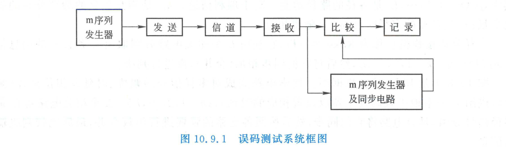
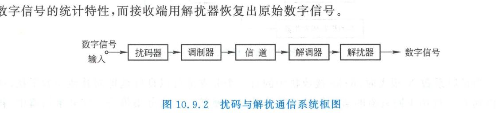
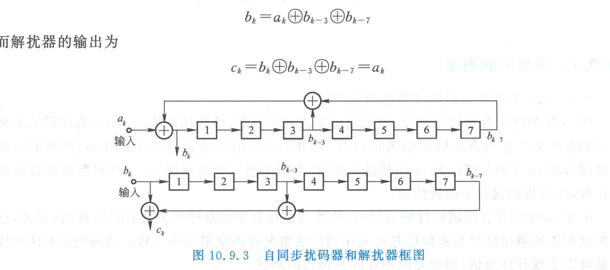
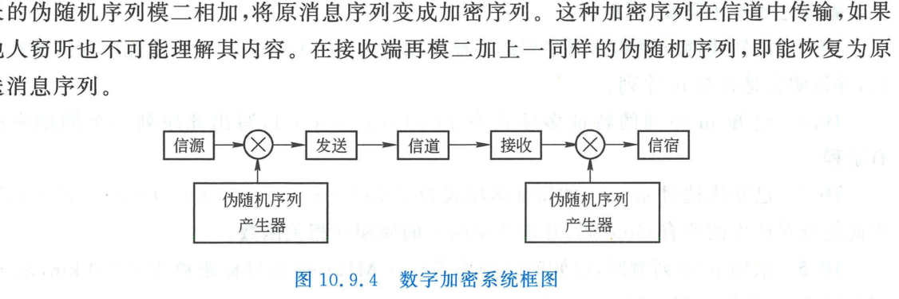
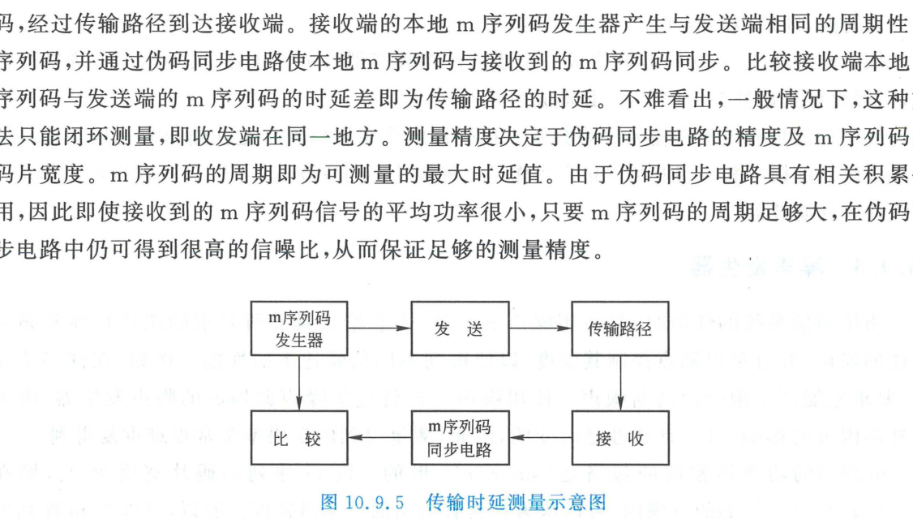

import Card from '../../../../../../components/Card.astro';
import ExerciseTrigger from '../../../../../../components/ExerciseTrigger.astro';

伪随机码序列（特别是最长线性反馈移存器序列 m 序列）除了作为直接序列扩频与跳频扩频的核心扩频载体外，凭借其优良的类随机统计分布、尖锐的自相关峰值、移位相加代数特性以及易于通过数字硬件再现的特征，在现代通信仪表、网络保密、信号调理以及高精度定位中获得了极其广泛的拓展应用。

---

## 10.9.1 误码率的在线开环测量（BER Testing）

在通信设备出厂检验、工程调测与信道质量在线监控中，测量系统的**误码率（Bit Error Rate, BER）**是评估链路物理层质量的核心手段。采用 m 序列作为标准伪随机测试图样（PRBS, Pseudo-Random Binary Sequence）可以构建高效的**开环误码测量系统**：

### 工作机制与优势
1. **发射端激励**：发送端利用 m 序列发生器产生已知特征多项式的二值数字序列输入待测通信信道；
2. **接收端比较**：接收端解调出带有信道误码的序列。本地同构的 m 序列发生器通过快速捕获与跟踪环路，生成与接收信号完全同步且无误码的纯净基准序列；
3. **逐位判决比对**：将接收到的序列与本地纯净基准逐位模 2 相加（异或）。异或结果中输出 "1" 的脉冲数即为传输过程中的错码数。计数器统计一定时间内的总脉冲数并除以总码元数，即可高精度逼近物理信道的真实误码率：
   $$
   P_e \approx \frac{N_{\text{error}}}{N_{\text{total}}}
   $$
4. **开环测试特征**：由于接收机能够利用确定性本原多项式本地自主重构发送序列，**收发两端无需任何闭环反馈回传线缆**，支持跨越大洲、卫星与地面站之间的超远距离异地开环直接测试。

---

## 10.9.2 数字信息序列的扰码与解扰（Scrambling & Descrambling）

### 1. 为什么需要扰码？
在同步数字通信系统中，接收端的符号定时同步时钟（位同步）通常是从接收信号的电平跳变边缘（"0" 与 "1" 的极性交替）中提取的：
- **避免时钟丢失**：若原始输入数据存在长连 "0" 或长连 "1" 游程（如长时间传输全零控制帧），信号波形将长期保持恒定直流电平，导致接收机位同步锁相环失步；
- **消除离散交调杂散**：若数字序列中存在周期性强图样，其高频谐波会在功率放大器非线性作用下产生有害的离散交调寄生辐射，恶化电磁兼容性（EMC）。

**扰码技术（Scrambling）**通过在发射端将数据与伪随机序列进行特定模 2 混合，在不增加额外比特开销与传输频宽的前提下，强行将任意非理想统计数据白化打散为近似无偏的随机序列。

---

### 2. 7 级自同步扰码器与解扰器结构

工程中最为经典的扰码拓扑是**自同步扰码器与解扰器（Self-Synchronizing Scrambler/Descrambler）**，其最大亮点在于**无需接收端与发送端在建立连接前事先交换初始种子状态**，电路具备全自主的自恢复对齐能力。

以 7 级移位寄存器构成的自同步电路为例：
- **发射端扰码器（反馈型网络）**：
  设输入明文序列为 $\{a_k\}$，扰码后输出序列为 $\{b_k\}$。其逻辑反馈递推方程为：
  $$
  b_k = a_k \oplus b_{k-3} \oplus b_{k-7}
  $$
- **接收端解扰器（前馈型网络）**：
  接收输入为 $\{b_k\}$，解扰输出序列为 $\{c_k\}$。其前馈解算方程为：
  $$
  c_k = b_k \oplus b_{k-3} \oplus b_{k-7}
  $$
将扰码方程代入解扰方程，利用模 2 加法自反律（$x \oplus x = 0$）：
$$
c_k = (a_k \oplus b_{k-3} \oplus b_{k-7}) \oplus b_{k-3} \oplus b_{k-7} = a_k \oplus (b_{k-3} \oplus b_{k-3}) \oplus (b_{k-7} \oplus b_{k-7}) = a_k
$$
**解扰输出序列在代数上严格等同于加扰前的原始输入序列！**

<Card title="定理：自同步解扰器的差错扩散有界性" type="star">
设传输信道中产生了一个孤立的瞬态单比特差错（例如某时刻 $b_m$ 发生翻转）：
1. 在解扰端，当该错误码元刚到达时，作为当前主输入 $b_m$ 导致输出 $c_m$ 产生第 1 个差错；
2. 随后该错误码元移入前馈移存器，在经过 3 个时钟节拍（到达第 3 级抽头）和 7 个时钟节拍（到达第 7 级抽头）时，分别再次参与异或，引发后续的差错；
3. **经过 7 个节拍后，该错误比特被彻底移出寄存器，差错影响永远消亡**！

因此，自同步解扰器的**差错倍增系数严格受限于抽头数（单错码最多引发 3 个错码），且差错扩散持续时间严格不超过寄存器级数 $n = 7$ 个码元**。系统具备极强的自愈鲁棒性。
</Card>

---

## 10.9.3 平坦谱白噪声发生器

在通信系统抗噪容限与灵敏度测试中，需要标准可控的高斯白噪声源。传统模拟雪崩二极管噪声源受温度与老化影响剧烈，谱密度极难精密复现。

双极性 m 序列码波形的功率谱包络服从 $\text{sinc}^2(f T_c)$ 分布。在低频通带区间：
$$
0 \le f \le \frac{0.45}{T_c}
$$
其功率谱密度平坦度波动小于 $0.5\text{ dB}$，近乎严格呈现平坦的高斯白噪声特性。利用高速 LFSR 配合模拟低通滤波器，可以构建输出电平极其稳定、可数字编程衰减的**标准平坦谱白噪声发生器**。

---

## 10.9.4 物理层流密码数字通信加密

数字通信加密的核心思想在于**一次一密（One-Time Pad）流密码**机制：

- **加密过程**：信源生成的明文二进制比特流 $\{m_k\}$ 与伪随机发生器产生的长周期伪码流 $\{k_k\}$（由密钥控制初始状态和抽头系数）逐比特异或：
  $$
  c_k = m_k \oplus k_k
  $$
  生成的密文序列 $\{c_k\}$ 呈现统计白噪声特征，被窃听者拦截后无法进行代数破译；
- **解密过程**：合法的接收端在共享密钥驱动下生成完全同相同步的伪码流 $\{k_k\}$，再次进行异或解密：
  $$
  \hat{m}_k = c_k \oplus k_k = (m_k \oplus k_k) \oplus k_k = m_k
  $$
密码安全性直接取决于伪随机码的周期长度、线性复杂度以及初始相位的密钥搜索空间。

---

## 10.9.5 高精度无线电测距与传输时延测量

根据电磁波恒定光速传播原理（$c \approx 3 \times 10^8\text{ m/s}$），测量无线电信号在发射点与目标之间的单程或双程传播时延 $\Delta \tau$，即可精确折算出物理几何距离：
$$
R = c \cdot \Delta \tau \quad \text{或} \quad R = \frac{1}{2} c \cdot \Delta \tau
$$

由于 m 序列具有极度尖锐的二值自相关特性（相关主峰底宽仅为 $2T_c$）：
1. **最大不模糊测量距离**：由 m 序列的周期时长决定：
   $$
   \tau_{\max} = N T_c \longleftrightarrow R_{\max} = c \cdot N T_c
   $$
2. **极高测量分辨率**：配合高精度延时锁定环（DLL）微步进鉴相，时延估计精度可达到码片宽度的百分之一（$0.01 T_c$ 对应米级乃至厘米级雷达/导航测距精度）；
3. **微弱回波相关增益**：长码所带来的数万倍相关积累处理增益，使得测距系统即使在接收回波功率远低于空间背景噪声底的极限条件下，依然能够稳定锁定并准确测出精确距离（如深空探测器应答测距与 GPS/北斗卫星导航民用 C/A 码测距）。

---

<ExerciseTrigger chapter={10} section="10.9" title="10.9 扩频码的其他应用 思考题与自测" />
