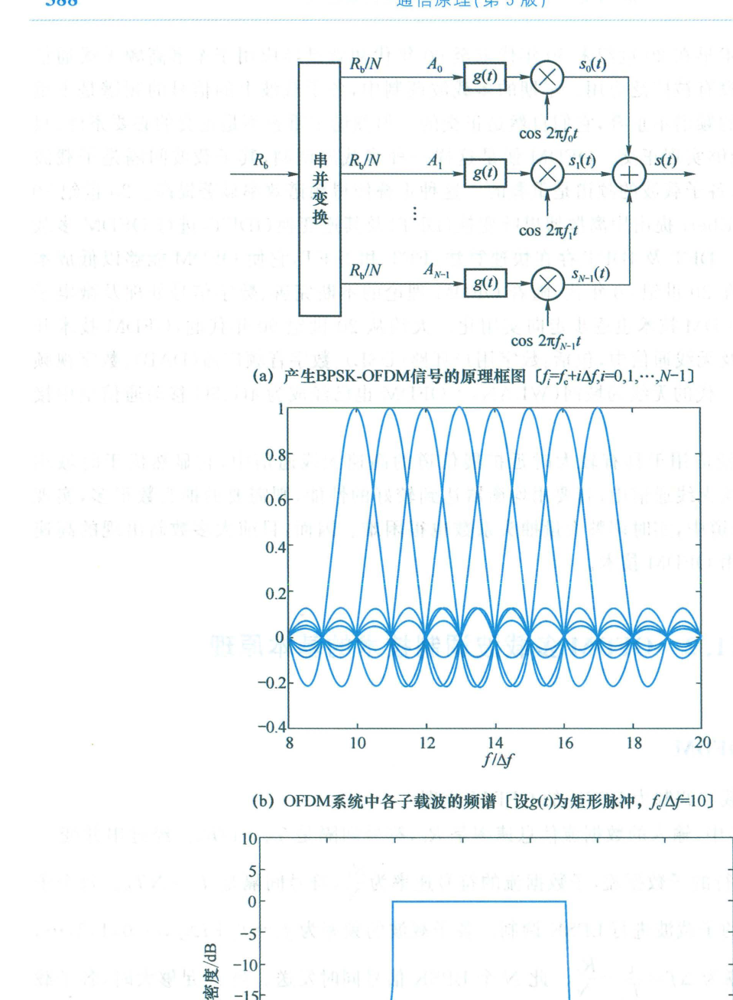
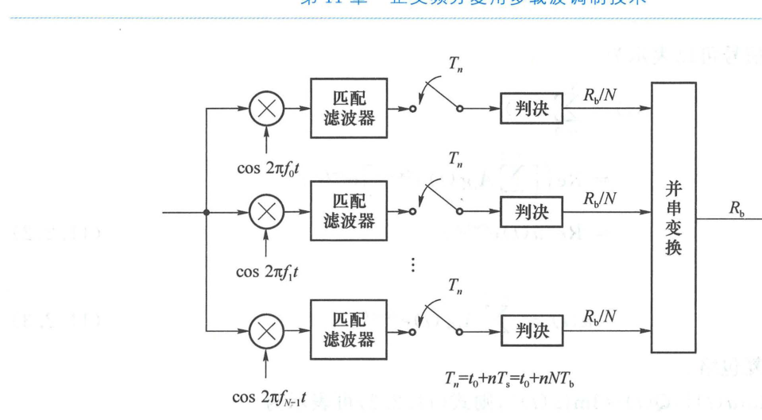
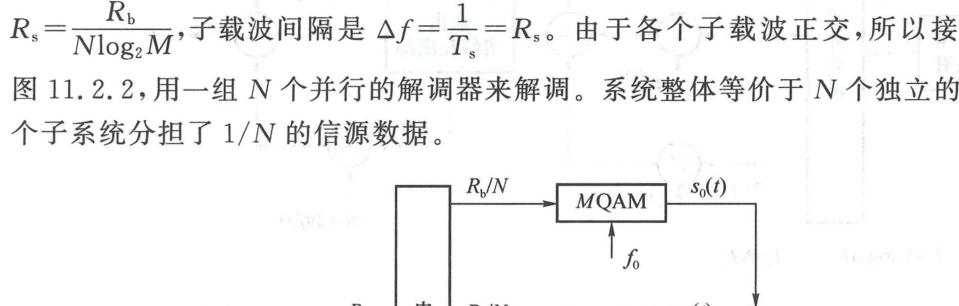
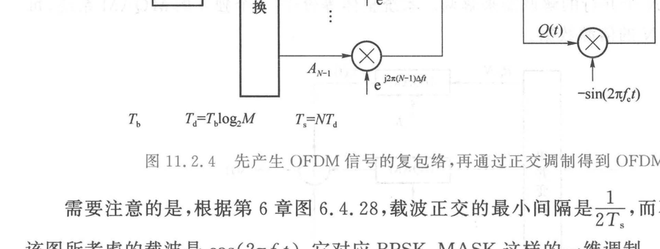

import Card from '@/components/Card.astro';
import ExerciseTrigger from '@/components/exercises/ExerciseTrigger.astro';

正交频分复用（OFDM）的基本原理是将一个宽带高速信息流在频域分解为多个并行的窄带正交子载波进行调制传输。本节从最为直观的 **BPSK-OFDM** 引入，进而拓展至高频谱效率的通用 **QAM-OFDM** 二维调制模型，并从泛函内积视角严格推导正交性数学条件。

---

## 11.2.1 BPSK-OFDM 调制与解调

### 1. 发射机拓扑与信号产生

设输入信源的串行二进制数据流信息速率为 $R_b$，单比特宽度为 $T_b = 1/R_b$。

1. **串并变换（S/P）**：
   输入数据流经串并变换器分解为 $N$ 个平行的子数据流。各子数据流的符号速率骤降为 $R_s = R_b/N$，单个子符号周期扩展为：
   $$
   T_s = N T_b
   $$
2. **多载波 BPSK 调制**：
   每个子数据流分别调制一个具有特定中心频率的子载波。第 $i$ 个子载波的射频频率为：
   $$
   f_i = f_c + i \Delta f, \quad i = 0, 1, \dots, N-1
   $$
   式中 $f_c$ 为主基准载波频率，$\Delta f$ 为子载波间隔。为了保证各子载波在符号区间 $[0, T_s]$ 内严格正交，子载波间隔精确取为子符号宽度的倒数：
   $$
   \Delta f = \frac{1}{T_s} = \frac{R_b}{N}
   $$
3. **频谱形态与功率谱密度**：
   在矩形脉冲成形下，每个子载波的频谱呈现 $\text{sinc}(f)$ 包络形态（图 11.2.1(b)）。$N$ 个子载波的频谱紧密交织重叠，合成的 OFDM 信号功率谱密度呈现带内高度平坦、带外迅速滚降的优良矩形滤波特性（图 11.2.1(c) 为 128 个子载波时的功率谱密度）。

---

### 2. 接收机相干解调与等效独立信道

BPSK-OFDM 接收机结构如下图所示：

各子载波信号的正弦波基函数集合为：
$$
\{ g(t) \cos(2\pi f_i t) \mid i = 0, 1, \dots, N-1 \}
$$
式中 $g(t) = \text{rect}(t/T_s - 1/2)$ 为持续时间为 $T_s$ 的矩形脉冲。

根据正弦载波正交性定理，当频率间隔满足 $\Delta f = 1/T_s$ 时：
$$
\int_0^{T_s} \cos(2\pi f_i t) \cos(2\pi f_j t) \, dt = \frac{T_s}{2} \cdot \delta_{ij}
$$
接收机配置 $N$ 个平行的相干相关解调器。各解调支路彼此之间**完全正交、互不干扰**。因此，从端到端物理视角看，**整个宽带 BPSK-OFDM 系统严格等价于 $N$ 个并行、独立、互不干扰的平坦衰落 BPSK 子信道**！

---

## 11.2.2 QAM-OFDM 二维多载波调制

为了追求更高的频带利用率，现代无线标准普遍将子载波调制提升为 $M$ 阶正交幅度调制（$M$-QAM，如 16-QAM、64-QAM、256-QAM 直至 4096-QAM）。

### 1. 系统参数映射关系
设 QAM 调制的进制数为 $M$，每个子符号承载 $k = \log_2 M$ 个信息比特。
- 输入数据速率：$R_b$；
- 串并变换后各子信道的比特速率：$R_b / N$；
- 每个子信道上的 QAM 符号速率：
  $$
  R_s = \frac{R_b}{N \log_2 M}
  $$
- 子符号持续时间：$T_s = 1/R_s = \frac{N \log_2 M}{R_b}$；
- 正交子载波间隔：$\Delta f = 1/T_s = R_s$。

---

### 2. 时域复包络与 I/Q 正交上变频数学解析

在单个符号周期 $[0, T_s]$ 内，第 $i$ 个子载波上的已调 QAM 信号表示为同相分量与正交分量的合成：
$$
\begin{aligned}
s_i(t) &= A_{ic} g(t) \cos(2\pi f_i t) - A_{is} g(t) \sin(2\pi f_i t) \\
&= \text{Re}\left\{ (A_{ic} + j A_{is}) g(t) e^{j 2\pi f_i t} \right\} \\
&= \text{Re}\left\{ A_i g(t) e^{j 2\pi f_i t} \right\}
\end{aligned}
$$
式中 $A_i = A_{ic} + j A_{is}$ 为发送的第 $i$ 个 QAM 符号的二维复数星座点坐标。

将 $N$ 个子载波已调信号线性叠加，得到总的发射实带通 OFDM 信号：
$$
s(t) = \sum_{i=0}^{N-1} s_i(t) = \text{Re}\left\{ \left[ \sum_{i=0}^{N-1} A_i g(t) e^{j 2\pi i \Delta f t} \right] e^{j 2\pi f_c t} \right\} = \text{Re}\left\{ a(t) e^{j 2\pi f_c t} \right\}
$$
式中 $a(t)$ 称为 **OFDM 信号的基带复包络（Complex Envelope）**：
$$
a(t) = \sum_{i=0}^{N-1} A_i g(t) e^{j 2\pi i \Delta f t}
$$
若将复包络分解为实部同相分量 $I(t) = \text{Re}\{a(t)\}$ 与虚部正交分量 $Q(t) = \text{Im}\{a(t)\}$，则射频信号可表示为标准的基带正交混频形式：
$$
s(t) = I(t) \cos(2\pi f_c t) - Q(t) \sin(2\pi f_c t)
$$

这表明在现代数字化硬件实现中，**可以先在全数字基带直接合成离散复包络 $a(t)$，再经由单一的正交模拟调制器搬移至射频中心频率 $f_c$**，极大地精简了硬件射频前端。

---

## 11.2.3 复指数子载波的正交性数学证明与最小间隔

<Card title="定理：复指数子载波正交性与最小频率间隔" type="star">
考虑两个复数连续载波基函数：
$$
c_n(t) = g(t) e^{j 2\pi f_n t}, \quad c_m(t) = g(t) e^{j 2\pi f_m t}
$$
式中 $g(t)$ 为在区间 $[0, T_s]$ 内幅度为 1 的矩形门函数。计算二者在符号区间内的内积：
$$
\begin{aligned}
\int_0^{T_s} c_n(t) c_m^*(t) \, dt &= \int_0^{T_s} e^{j 2\pi (f_n - f_m) t} \, dt \\
&= \frac{e^{j 2\pi (f_n - f_m) T_s} - 1}{j 2\pi (f_n - f_m)} \\
&= T_s e^{j \pi (f_n - f_m) T_s} \cdot \frac{\sin\left[ \pi (f_n - f_m) T_s \right]}{\pi (f_n - f_m) T_s} \\
&= T_s e^{j \pi (f_n - f_m) T_s} \text{sinc}\left[ (f_n - f_m) T_s \right]
\end{aligned}
$$
为了使内积在 $n \ne m$ 时恒等于零，必须要求 sinc 函数的取值落在非零整数零点上：
$$
(f_n - f_m) T_s = k \in \mathbb{Z} \setminus \{0\} \iff |f_n - f_m| = \frac{|k|}{T_s}
$$
因此，**保证复指数子载波相互正交的最小频率间隔严格为**：
$$
\Delta f_{\min} = \frac{1}{T_s}
$$
</Card>

### 一维调制与二维调制的正交间隔辨析
- **一维单载波调制（如仅含同相载波的 BPSK、MASK）**：若载波相位严格已知且固定，同相余弦波 $\cos(2\pi f_n t)$ 之间的相干正交最小理论间隔可压缩至 $\Delta f = 1/(2T_s)$；
- **二维正交调制（QPSK、QAM）**：由于每个子载波同时独立承载 $I$ 路与 $Q$ 路两个正交分量，任意时延相移下要保证同频与跨频分量均不发生能量串扰，系统必须满足复数 Hilbert 空间正交条件，故其正交最小频率间隔必须且严格为 $\Delta f = 1/T_s$。

---

<ExerciseTrigger chapter={11} section="11.2" title="11.2 OFDM多载波调制技术的基本原理 思考题与自测" />
