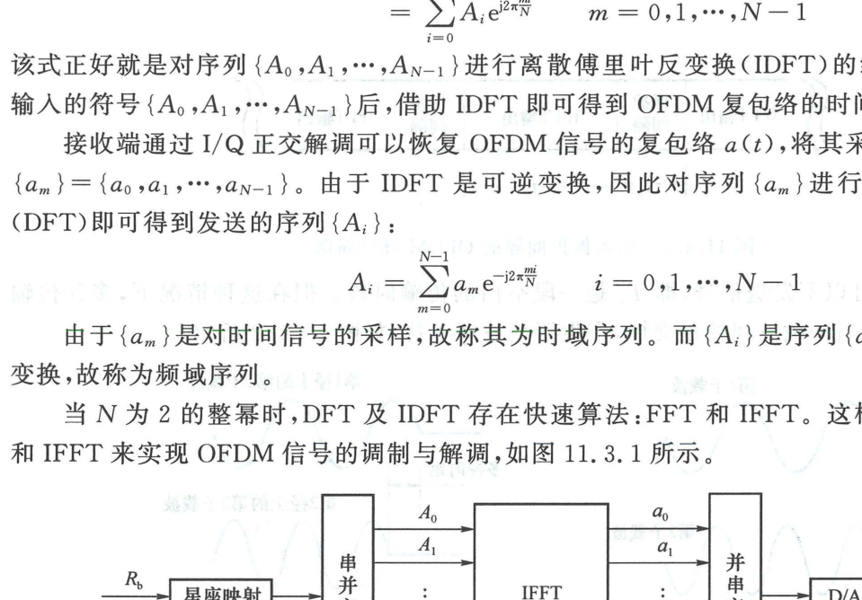

import Card from '../../../../../../components/Card.astro';
import ExerciseTrigger from '../../../../../../components/ExerciseTrigger.astro';

若采用传统的模拟电路实现多载波系统，系统必须包含 $N$ 个高精度正弦模拟局部振荡器与 $N$ 个窄带模拟带通滤波器。当子载波数高达数百乃至数千时，模拟元器件的离散度、温漂、频率漂移与体积功耗将导致系统在工程上完全不可实现。

1971 年 Weinstein 与 Ebert 提出的**数字离散傅里叶变换（DFT）架构**彻底解决了这一难题，使 OFDM 从纯理论构想飞跃成为当代全数字通信系统的工业标准。

---

## 11.3.1 复包络抽样与离散傅里叶反变换（IDFT）推导

回顾 11.2 节中导出的连续时间 OFDM 基带复包络表达式：
$$
a(t) = \sum_{i=0}^{N-1} A_i g(t) e^{j 2\pi i \Delta f t}, \quad t \in [0, T_s]
$$
式中 $A_i$ 为第 $i$ 个子载波承载的复数星座符号，$\Delta f = 1/T_s$。

为了在全数字域生成与处理该信号，在单个符号区间 $[0, T_s]$ 内对连续时间复包络 $a(t)$ 进行等间隔均匀抽样。设抽样点数为 $N$，抽样时刻为：
$$
t_m = m \frac{T_s}{N}, \quad m = 0, 1, \dots, N-1
$$
此时，连续复包络在 $t_m$ 处的离散抽样序列值为：
$$
a_m = a\left( m \frac{T_s}{N} \right) = \sum_{i=0}^{N-1} A_i e^{j 2\pi i \Delta f \cdot \left( m \frac{T_s}{N} \right)}
$$
将正交频率间隔准则 $\Delta f \cdot T_s = 1$ 代入指数项中，化简得到：
$$
a_m = \sum_{i=0}^{N-1} A_i e^{j 2\pi \frac{i \cdot m}{N}}, \quad m = 0, 1, \dots, N-1
$$

<Card title="核心定理：调制过程等价于频域符号的 IDFT" type="star">
观察上述推导结果：**时域离散抽样序列 $\{a_0, a_1, \dots, a_{N-1}\}$ 在数学形式上严格等于发送端频域星座点序列 $\{A_0, A_1, \dots, A_{N-1}\}$ 的离散傅里叶反变换（IDFT，归一化常数除外）！**

这表明：**在发射端完全无需产生任何连续高频子载波振荡器，只需将输入的频域数据矢量 $\{A_i\}$ 直接输入一个 IDFT 处理核，其输出即为带正交多载波调制效应的时域基带抽样序列 $\{a_m\}$。**
</Card>

---

## 11.3.2 接收端解调与离散傅里叶变换（DFT）

在接收端，接收机通过单套模拟正交下变频器将射频信号搬移至基带，恢复出连续复包络 $a(t)$。

以抽样周期 $T_s / N$ 对复包络进行均匀 A/D 采样，重构出时域样值序列 $\{a_m\} = \{a_0, a_1, \dots, a_{N-1}\}$。由于 IDFT 变换是酉空间中的严格可逆变换，接收端只需对时域采样序列实施标准**离散傅里叶变换（DFT）**：
$$
A_i = \sum_{m=0}^{N-1} a_m e^{-j 2\pi \frac{i \cdot m}{N}}, \quad i = 0, 1, \dots, N-1
$$
计算输出即可在频域严格无失真地恢复出发射端的各路 QAM 星座点符号 $\{A_i\}$！

- **时域序列（Time-Domain Sequence）**：$\{a_m\}$ 为信号在时间轴上的瞬时物理振幅采样；
- **频域序列（Frequency-Domain Sequence）**：$\{A_i\}$ 为各正交子信道所承载的数字信息调制符号。

---

## 11.3.3 FFT/IFFT 快速算法与全数字流水线

当系统子载波数 $N$ 取为 2 的整数次幂（如 $N = 64, 128, 512, 1024, 2048, 4096$）时，标准的 DFT/IDFT 变换可通过 Cooley-Tukey **快速傅里叶变换（FFT/IFFT）**算法实现。

| 处理方案 | 复数乘法计算复杂度 | 复数加法计算复杂度 | 当 $N = 1024$ 时的乘法运算量 |
| :---: | :---: | :---: | :---: |
| **标准直接 DFT/IDFT** | $\mathcal{O}(N^2)$ | $\mathcal{O}(N(N-1))$ | $\approx 1,048,576$ 次 |
| **快速算法 FFT/IFFT** | $\mathcal{O}\left( \frac{N}{2} \log_2 N \right)$ | $\mathcal{O}(N \log_2 N)$ | $\approx 5,120$ 次（**骤降 99.5%**） |

OFDM 调制器与解调器的全数字基带处理流水线架构如下图所示：

### 1. 发射端全数字调制流水线（图 11.3.1(a)）
1. 输入二进制比特流经信道编码与交织后，映射为串行复数 QAM 星座序列；
2. 串并变换器（S/P）将每 $N$ 个频域符号并排打包为频域矢量 $\boldsymbol{A} = [A_0, A_1, \dots, A_{N-1}]^T$；
3. **IFFT 硬件核**将频域符号矢量转换为时域采样点矢量 $\boldsymbol{a} = [a_0, a_1, \dots, a_{N-1}]^T$；
4. 并串变换器（P/S）将时域采样点转为时间先后排列的串行离散样值；
5. 经数模转换器（D/A）平滑成形为连续时域复包络 $a(t)$，送入正交调制器发射。

### 2. 接收端全数字解调流水线（图 11.3.1(b)）
1. 正交下变频与 A/D 采样恢复出串行时域离散点；
2. 串并变换器（S/P）将时域样值分流为并行时域样值序列；
3. **FFT 硬件核**实施快速傅里叶正变换，直接将时域采样点分解映射回 $N$ 个频域星座点 $[A_0, A_1, \dots, A_{N-1}]$；
4. 频域均衡与并串变换（P/S）后送入解映射与信道译码器恢复原始信息。

---

<ExerciseTrigger chapter={11} section="11.3" title="11.3 OFDM调制的数字实现 思考题与自测" />
