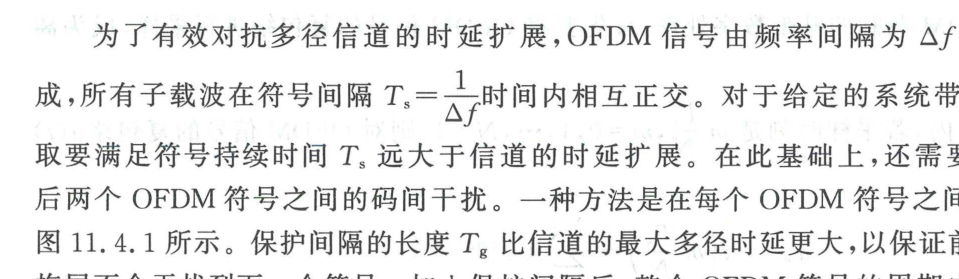
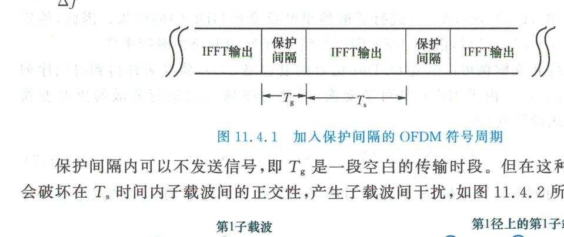
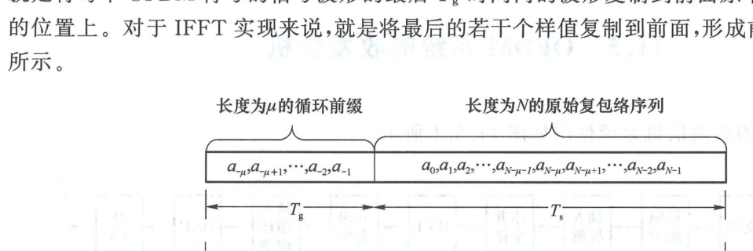
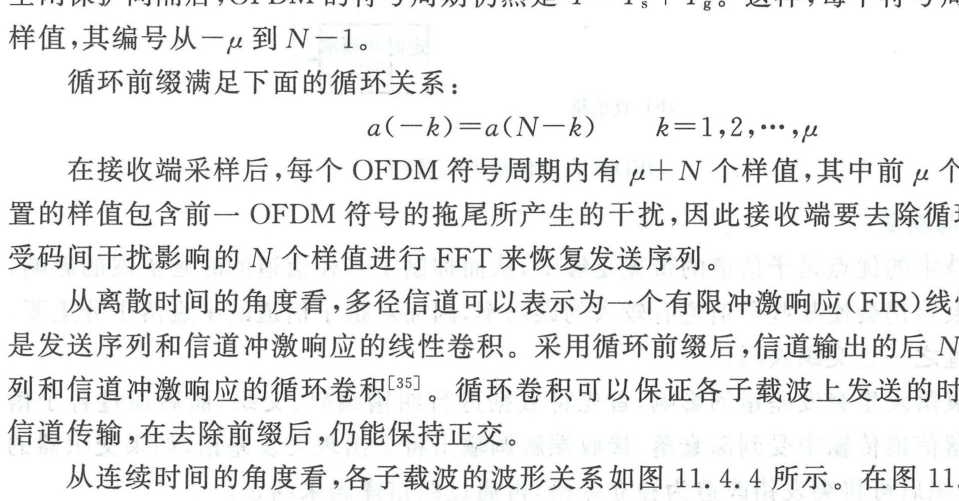

import Card from '@/components/Card.astro';
import ExerciseTrigger from '@/components/exercises/ExerciseTrigger.astro';

在实际无线移动通信中，电磁波在建筑物、地面与植被间产生复杂散射与反射，构成具有显著时延扩展 $\tau_{\max}$ 的离散多径信道。尽管 OFDM 通过串并变换大幅拓宽了单符号周期（$T_s = N T_b \gg T_m$），但若直接将连续的 OFDM 符号在信道中首尾相接发送，前一符号在多径反射下的“尾巴”仍会侵入后一符号的前端，引发不可忽视的**符号间串扰（Inter-Symbol Interference, ISI）**。

为了彻底降服多径干扰，现代 OFDM 系统引入了精妙的**循环前缀（Cyclic Prefix, CP）**技术。

---

## 11.4.1 保护间隔与空闲保护间隔的缺陷（ICI 产生机理）

### 1. 保护间隔消除 ISI 的基本设想

消除前后相邻符号之间时域串扰最直观的工程构想是在两个连续的 OFDM 符号之间强行插入一段**保护间隔（Guard Interval, GI）**，其持续时间记为 $T_g$：

只要保护间隔的宽度严格大于信道的最大多径超额时延：
$$
T_g \ge \tau_{\max}
$$
则前一 OFDM 符号经由最迟反射径产生的多径拖尾能量将在保护间隔 $T_g$ 内彻底衰减殆尽，绝对不会波及下一个 OFDM 符号的有效数据观察窗口 $T_s$。加入保护间隔后，单个 OFDM 符号的总物理发射周期扩展为：
$$
T = T_g + T_s = T_g + \frac{1}{\Delta f}
$$

---

### 2. 空闲保护间隔导致子载波间干扰（ICI）的物理根源

如果在保护间隔 $T_g$ 内发射机彻底关闭射频输出（即置零保护间隔，Zero-Padding, ZP），虽然可以消除前后符号间的 ISI，但却会在子载波之间引发灾难性的**子载波间干扰（Inter-Carrier Interference, ICI）**：

- **理想背对背正交性（图 11.4.2(a)）**：在无多径延迟时，第 1 个子载波与第 2 个子载波在有效积分区间 $[0, T_s]$ 内恰好包含整数个正弦振荡周期，两者在 $[0, T_s]$ 内的积分内积严格为零；
- **多径时延下的正交性损毁（图 11.4.2(b)）**：当信号经历时延为 $\tau$ 的反射径到达接收端时，若保护间隔为一段空白信号，则在接收机设定的长为 $T_s$ 的 FFT 截取积分窗口内，**时延径上的子载波波形在前端出现了一段长为 $\tau$ 的空白缺失**！
- **波形不完整导致非正交**：此时进入积分窗口的子载波不再包含完整的周期正弦振荡，导致不同子载波之间的正交内积积分不再为零：
  $$
  \int_0^{T_s} s_{i, \text{径1}}(t) s_{j, \text{径2}}^*(t) \, dt \ne 0 \quad (i \ne j)
  $$
  相邻子载波的能量发生强烈泄漏并相互串扰，导致接收端解调信噪比严重恶化。

---

## 11.4.2 循环前缀（Cyclic Prefix）的物理架构与数学本质

为了彻底攻克空闲保护间隔带来的正交性损毁难题，Peled 和 Ruiz 于 1980 年创造性地提出了**循环前缀（Cyclic Prefix, CP）**方案：

<Card title="循环前缀的构造规则" type="star">
**不再在保护间隔内留空，而是将每个 OFDM 符号尾部时长为 $T_g$ 的连续时域波形原封不动地复制一份，前置填充到原本是空闲保护间隔的位置上！**
</Card>

在基于 IFFT 的全数字基带处理中，这一操作等价于将 IFFT 生成的长度为 $N$ 的时域抽样点序列 $[a_0, a_1, \dots, a_{N-1}]$ 的末尾 $\mu$ 个样值复制并拼接在整个序列的最前端：

每个符号周期内的样值总数扩充为 $N + \mu$ 个，时间指标从 $-\mu$ 延伸至 $N-1$。循环前缀严格满足边界周期映射方程：
$$
a(-k) = a(N - k), \quad k = 1, 2, \dots, \mu
$$
式中前缀采样点数 $\mu$ 必须大于信道等效基带离散冲激响应的最大抽头跨度 $L$。

---

## 11.4.3 线性卷积化为循环卷积：OFDM 频域单抽头均衡的数学核心

在接收端，信号经 A/D 采样后，**首先直接将前 $\mu$ 个吸收了多径拖尾能量的循环前缀样值抛弃**，仅截取后续纯净的 $N$ 个样值送入 FFT 解调核。

从离散系统信号与系统理论审视，这一“加 CP $\to$ 经信道 $\to$ 去 CP”的流水线蕴含着极其深刻的数学对偶美：

<Card title="核心定理：多径线性卷积等效对角化为循环卷积" type="star">
设物理多径信道为有限冲激响应（FIR）线性系统，其离散信道冲击响应为：
$$
h[n] = \sum_{l=0}^{L-1} h_l \delta[n - l]
$$
发射连续序列通过信道时，物理输出为信号序列与信道响应的**时域线性卷积（Linear Convolution）**。

然而，**由于引入了长度 $\mu \ge L$ 的循环前缀并在接收端予以剥离，信道输出中有效区间的 $N$ 个采样点在数学上严格等价于发射符号矢量 $\boldsymbol{a} = [a_0, \dots, a_{N-1}]^T$ 与信道冲激响应矢量 $\boldsymbol{h}$ 的循环卷积（Circular Convolution，记为 $\circledast$）**：
$$
y[n] = a[n] \circledast h[n], \quad n = 0, 1, \dots, N-1
$$

对该循环卷积两端实施长度为 $N$ 的离散傅里叶变换（DFT/FFT），根据傅里叶变换时域循环卷积对应频域代数点乘定理：
$$
Y[k] = \text{DFT}_N\{a[n] \circledast h[n]\} = A[k] \cdot H[k], \quad k = 0, 1, \dots, N-1
$$
式中 $H[k] = \sum_{l=0}^{L-1} h_l e^{-j 2\pi k l / N}$ 为信道在第 $k$ 个子载波中心频率处的离散频域传递函数！
</Card>

### 为什么循环前缀能完美消除 ICI？
从连续波形几何观察（图 11.4.4）：
1. 循环前缀将原本有限时宽为 $T_s$ 的子载波正弦波形在时域人为虚拟延展为了周期连续信号；
2. 即使经过多径传输导致第二径发生时延，只要时延小于 $T_g$，**在截取后的 $T_s$ 观察窗口内，任何一条时延径上的所有子载波波形仍然由连续无间断的正弦波构成，且窗口长度 $T_s$ 严格为其波形周期的整数倍**！
3. 因此，子载波之间的正交内积积分为零的条件得到了 100% 完美保全，**ICI 被彻底抹杀**！

### 频域单抽头极简均衡
在传统单载波系统中，多径引起的线性卷积在频域表现为复杂的交织耦合，需要高阶矩阵求逆或多抽头时域自适应均衡器。

而在带 CP 的 OFDM 系统中，由于信道在频域被**完美对角化解耦**，每个子载波上的均衡退化为极其简单的**频域单抽头复数标量除法（Zero-Forcing 均衡）**：
$$
\hat{A}[k] = \frac{Y[k]}{\hat{H}[k]} = A[k] + \frac{W[k]}{\hat{H}[k]}
$$
接收机只需一次除法即可彻底消除多径引起的幅度衰落与相位旋转，这正是 OFDM 在宽带通信中具备压倒性优势的精髓所在！

---

<ExerciseTrigger chapter={11} section="11.4" title="11.4 循环前缀 思考题与自测" />
