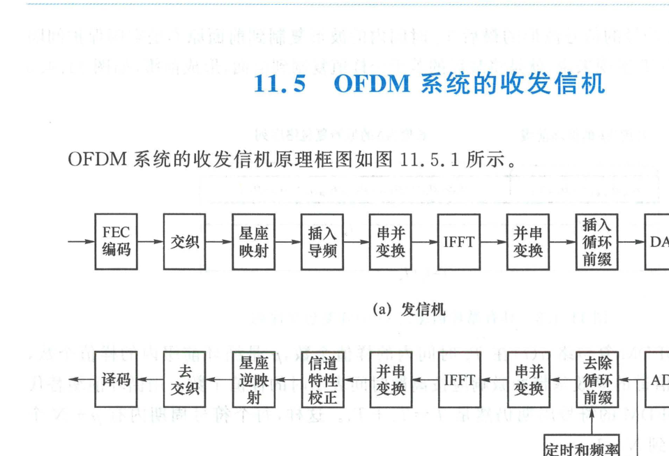

import Card from '@/components/Card.astro';
import ExerciseTrigger from '@/components/exercises/ExerciseTrigger.astro';

实际运行于蜂窝网络（4G LTE / 5G NR）、局域网（Wi-Fi）或数字广播（DVB/DAB）中的 OFDM 通信系统是一个高度精密的复合全数字化物理层架构。单一的未编码 OFDM 虽能消除符号间串扰，但在频率选择性衰落信道中仍会遭受严重的性能瓶颈。因此，现代系统必须将信道纠错编码、交织技术与 OFDM 高度深度融合，构成**编码正交频分复用系统（Coded OFDM, COFDM）**。

---

## 11.5.1 频域交织编码：战胜子信道深衰落的定海神针

OFDM 将宽带频率选择性信道划分为 $N$ 个平坦衰落的窄子信道。然而在恶劣无线多径环境中，**信道传输函数 $|H(f)|$ 的起伏往往高达数十个分贝**：
- 处于多径相消凹陷点的某些子信道（频域零点附近），其瞬时信噪比可能跌至负值；
- 落在这些深衰落子信道上的数据符号将发生连片严重畸变，产生密集的**突发差错（Burst Errors）**。

<Card title="COFDM 的双重保护机制：编码 + 频域交织" type="star">
为了拯救深衰落子信道上的数据，现代 OFDM 系统必须在发射端引入**信道纠错编码（FEC）与频域/时域交织器（Interleaver）**：
1. **频域交织打散**：交织器将连续的编码比特强行分散映射到频域相距较远的不同子载波上；
2. **相关性去耦**：由于相邻子信道衰落具有强相关性，而相隔超过相干带宽 $B_c$ 的子信道衰落相互统计独立，交织操作确保了同一码字内的各个校验比特不会同时落入同一个深衰落凹陷中；
3. **接收端离散化纠错**：接收端经解交织后，将物理信道造成的连片突发错码完全“白化”重组为离散随机单比特差错，随后由强力前向纠错码（如 LDPC 码、Turbo 码或卷积码）彻底纠正！
</Card>

---

## 11.5.2 OFDM 系统收发信机的全链路硬件架构

实用的 OFDM 收发信机全链路功能结构如下图所示：

### 1. 发射机物理层流水线（图 11.5.1(a)）
1. **信道前向纠错编码（FEC）**：二进制信息流通过卷积码、Turbo 码或 LDPC 编码器添加冗余校验位；
2. **时频二维交织（Interleaving）**：打乱比特排列顺序，规避信道在时间与频率上的双重选择性衰落；
3. **符号调制映射（Constellation Mapping）**：将交织比特分组映射为 QPSK、16-QAM 或 64/256-QAM 复数星座符号序列；
4. **串并变换与导频插入（S/P & Pilot Insertion）**：将串行复符号流分配为 $N$ 个并行流，并在特定子载波位置嵌入已知复数导频符号（Pilots），用于接收端信道估计；在频带边缘预留置零的虚拟子载波（Guard Subcarriers）；
5. **IFFT 频域到时域变换**：执行高速 $N$ 点 IFFT，合成离散时间基带复包络抽样序列 $[a_0, a_1, \dots, a_{N-1}]$；
6. **并串变换与循环前缀插入（P/S & Add CP）**：将尾部 $\mu$ 个样值复制并前置拼接到时域符号头部；
7. **数模转换（D/A）与平滑滤波**：将离散抽样转化为连续的同相基带模拟信号 $I(t)$ 与正交基带模拟信号 $Q(t)$；
8. **I/Q 正交上变频与功率放大（HPA）**：与正交射频本振载波混频搬移至中心频率 $f_c$，由射频功率放大器放大后经天线辐射发射。

---

### 2. 接收机物理层流水线（图 11.5.1(b)）
1. **射频前端与正交下变频**：天线接收微弱无线电波，经低噪声放大器（LNA）放大与带通滤波，由正交下变频器混频解调出基带模拟 $I(t)$ 与 $Q(t)$ 分量；
2. **模数转换（A/D）与符号同步**：高速 A/D 采样，利用前导同步序列（Preamble）实现毫微秒级的精确 OFDM 符号定时对齐与粗载波频偏估计；
3. **循环前缀剥离（Remove CP）与串并变换**：直接切除丢弃前 $\mu$ 个受多径拖尾污染的 CP 样值，截取纯净的 $N$ 个时域抽样点送入并行缓冲器；
4. **FFT 时域到频域解调**：执行 $N$ 点快速傅里叶变换，将时域波形精确分解恢复为 $N$ 个频域子信道输出样值；
5. **导频提取与频域信道估计**：提取已知导频位置的接收样值，利用最小二乘（LS）或最小均方误差（MMSE）算法估计出信道频域传递函数 $\hat{H}[k]$；
6. **频域单抽头均衡与解映射**：对每个子载波实施单抽头频域复数除法均衡，消除幅度与相位失真，计算各编码比特的对数似然比（LLR 软判决信息）；
7. **解交织与纠错译码**：逆交织器恢复原始编码顺序，Viterbi 或 Belief Propagation（BP）译码器纠正信道错误，恢复最终二进制数据。

---

## 11.5.3 多载波调制系统的固有缺陷与工程对策

虽然 OFDM 具备卓越的抗多径衰落能力，但在工程落地中必须解决两大核心物理缺陷：

### 1. 高峰均功率比（PAPR, Peak-to-Average Power Ratio）
- **物理成因**：时域 OFDM 信号是由 $N$ 个相互独立的子载波正弦信号线性叠加而成的：
  $$
  a_m = \sum_{i=0}^{N-1} A_i e^{j 2\pi i m / N}
  $$
  根据中心极限定理，当 $N$ 很大时，复包络的实部和虚部均近似服从零均值高斯分布，信号瞬时包络呈现高斯瑞利分布。当大部分子载波的瞬时相位发生相长同相重合时，时域信号会出现极高的瞬时尖峰功率，其峰值功率与平均功率之比（PAPR）往往高达 $10 \sim 13\text{ dB}$！
- **工程危害**：射频功率放大器（HPA）存在严格的非线性饱和截止区。若信号 PAPR 过高，信号尖峰将深入功放饱和区，引发严重的非线性交调失真、产生巨大的带外频谱旁瓣泄漏并破坏子载波正交性；为保持线性放大，功放必须实施巨额的**功率回退（Power Back-off）**，导致发射机直流电能转换效率骤降（严重影响手机电池续航）；
- **应对方案**：工程上采用限幅滤波（Clipping & Filtering）、选择性映射（SLM）、压扩变换（Companding），以及在 4G/5G 手机上行链路中采用基于 DFT 预编码的**单载波频分复用（SC-FDMA / DFT-s-OFDM）**体制来大幅压低 PAPR。

---

### 2. 对载波频率偏差（CFO）极度敏感
- **物理成因**：由于 OFDM 子载波间隔非常狭窄（通常仅为 15 kHz ~ 120 kHz），收发两端振荡器晶振的固有频偏或移动台高速运动引起的**多普勒频移（Doppler Spread）**会导致接收信号产生相对载频偏移 $\Delta f_c$；
- **工程危害**：一旦载频偏移占子载波间隔的比值超出几百分之一，各子载波的频谱峰值便偏离子载波正交零点，原本正交的子载波之间产生强烈的能量串漏（即严重的 ICI），迅速使系统误码平台恶化；
- **应对方案**：系统必须在数据帧前缀设计专用的训练序列，并在接收端配合高精度的频偏联合估计与数字锁频环（FLL）进行实时闭环旋转补偿。

---

<ExerciseTrigger chapter={11} section="11.5" title="11.5 OFDM系统的收发信机 思考题与自测" />
