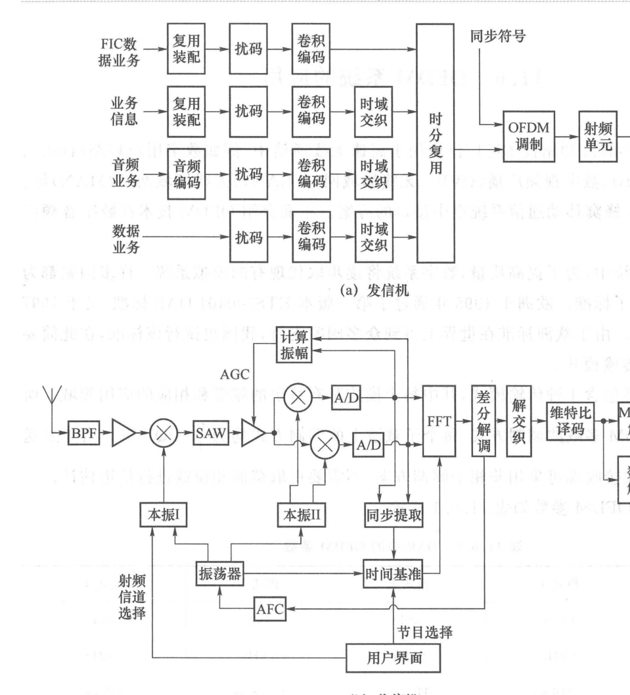

import Card from '../../../../../../components/Card.astro';
import ExerciseTrigger from '../../../../../../components/ExerciseTrigger.astro';

凭借出色的抗多径时延扩展能力、极高的频带利用率以及全数字化基带的高效实现，OFDM 技术已彻底渗透至现代无线与宽带接入通信的每一个角落：
- **有线宽带接入**：数字用户线路（ADSL / VDSL）采用离散多音频调制（DMT，实数基带 OFDM 体制）；
- **无线多媒体广播**：欧洲地面与手持数字视频广播标准（DVB-T / DVB-H / DVB-T2）；
- **无线局域网与城域网**：IEEE 802.11a/g/n/ac/ax/be（Wi-Fi 系列）与 WiMAX（IEEE 802.16）；
- **蜂窝移动通信**：4G LTE 以及 5G NR 的全下行与上行空中接口。

为了直观展现 OFDM 系统的实际工程设计方法，本节以具有深远历史奠基意义的**欧洲数字音频广播系统（Digital Audio Broadcasting, DAB）**为标杆进行全面解剖。

---

## 11.6.1 欧洲 DAB 标准体系与四大传输模式

在广播工程领域，为了解决传统调频（FM）模拟广播在移动接收时容易遭受多径颤抖深衰落的问题，欧洲电信标准协会于 1995 年正式颁布了世界首个商用数字广播标准——**ETS 300 401（DAB）**。

DAB 根据工作频段、移动多普勒频移以及覆盖距离的不同，精密设计了 4 种正交多载波传输模式：

| 模式参数 | 模式 1（地面 VHF） | 模式 2（地面 L 频段） | 模式 3（卫星广播） | 模式 4（中距离混合） |
| :---: | :---: | :---: | :---: | :---: |
| **应用场景** | 大面积宏基站单频网 | 本地蜂窝广播 | 卫星与高速移动 | 中等覆盖范围 |
| **子载波个数 $N$** | **1 536** | 384 | 192 | 768 |
| **子载波间隔 $\Delta f$** | **1 kHz** | 4 kHz | 8 kHz | 2 kHz |
| **有效符号长度 $T_s$** | **1.0 ms** | $250\ \mu\text{s}$ | $125\ \mu\text{s}$ | $500\ \mu\text{s}$ |
| **保护间隔 $T_g$** | **$246\ \mu\text{s}$** | $61.5\ \mu\text{s}$ | $30.8\ \mu\text{s}$ | $123\ \mu\text{s}$ |
| **总符号周期 $T$** | **$1.246\text{ ms}$** | $311.5\ \mu\text{s}$ | $155.8\ \mu\text{s}$ | $623\ \mu\text{s}$ |
| **最高工作频段** | $< 375\text{ MHz}$ | $< 1.5\text{ GHz}$ | $< 3.0\text{ GHz}$ | $< 1.5\text{ GHz}$ |
| **基站间距上限** | **$< 96\text{ km}$** | $< 24\text{ km}$ | $< 12\text{ km}$ | $< 48\text{ km}$ |

---

### 参数设计的物理折中精髓
1. **模式 1（地面广域大单频网）**：
   地面 VHF 频段多径时延跨度大，因而设计了高达 $246\ \mu\text{s}$ 的长循环前缀，电磁波在光速下可传输 $\Delta d = c \cdot T_g = 73.8\text{ km}$，允许相距约 96 km 的相邻基站同步发射而完全不产生 ISI；相应地，为了维持较高的有效传输效率，子载波间隔被压窄至 1 kHz，符号持续时长扩至 1.0 ms；
2. **模式 3（卫星高频高速移动）**：
   在高达 3 GHz 的卫星信道中，车辆高速行驶引发的多普勒频移显著增加。为此，将子载波间隔拓宽 8 倍至 $\Delta f = 8\text{ kHz}$，以极其宽裕的频率间隔抵抗载频漂移与多普勒频移带来的子载波间串扰（ICI）。

---

## 11.6.2 $\pi/4$-DQPSK 差分调制与免信道估计接收

在所有 DAB 传输模式中，每个子载波上的调制方式均统一规范为 **$\pi/4$-DQPSK（差分正交相移键控）**。

<Card title="为什么 DAB 选用差分调制？" type="star">
在高速广播车载移动环境中，无线信道的冲激响应变化极其剧烈。若采用相干 QAM 调制，接收端必须在频域和时域连续插入密集的导频符号来跟踪复杂的信道响应矩阵。

采用 $\pi/4$-DQPSK 差分调制：
- 信息比特仅承载在**前后相邻符号对应子载波之间的相位差**中（$\Delta \theta = \theta_k - \theta_{k-1}$）；
- 接收机只需在频域 FFT 之后将当前符号样值与上一符号样值进行共轭点乘判决：
  $$
  Z[k] = Y_n[k] \cdot Y_{n-1}^*[k] \propto A_n[k] A_{n-1}^*[k] |H[k]|^2
  $$
- **信道传递函数 $|H[k]|^2$ 仅作为正实数增益参与运算，其未知的信道相位旋转被完全自动抵消！**
- 这使得 DAB 接收机**彻底免除了复杂的导频提取、载波绝对相位锁定与动态信道均衡计算**，极大降低了消费级车载接收芯片的硬件开销与功耗！
</Card>

---

## 11.6.3 DAB 收发信机的硬件架构与单频网优势

DAB 系统的工程级收发信机硬件拓扑如下所示：

### 1. 发射机拓扑（图 11.6.1(a)）
- 业务源由高保真音频流、数据业务以及包含多路复用配置的快速信息信道（FIC）共同组成；
- 数据经卷积前向纠错、时频交织后打包，在帧起始处插入专用的**零符号（Null Symbol，用于粗帧同步）**与**相位参考符号（PRS，用于差分基准）**；
- 经 1536 点 IFFT 变换与循环前缀拼接后，由射频上变频放大并发射。

### 2. 接收机拓扑（图 11.6.1(b)）
- 采用高性能超外差中频射频前端，配置**声表面波（SAW）中频带通滤波器**，提供陡峭的带外滚降抑制；
- A/D 采样后由专用的硬件 FFT 处理器进行实时多载波解调，经差分解码与 Viterbi 译码恢复纯净数字立体声音频。

---

## 11.6.4 单频网（SFN）革命：频谱资源的高效聚合

传统单载波模拟广播（如调频 FM）在相邻不同发射台之间必须分配互不相同的发射频率，否则处于两台覆盖重叠边缘的收音机会由于严重的同频同道干扰而彻底失真。

OFDM 彻底颠覆了这一限制，孕育出划时代的**单频网（Single Frequency Network, SFN）**技术：
- **同频同发**：全国或全省的所有 DAB 发射基站可以在**完全相同的射频频率上、在 GPS/北斗时钟高精度授时控制下完全同步发射完全相同的节目信号**；
- **宏分集增益（Macro-Diversity）**：对移动接收终端而言，来自远方不同基站的同频信号仅仅表现为时延较大的“人工多径”。**只要基站间距引起的时延差小于保护间隔 $T_g$，所有基站的电波能量在接收端非但互不破坏，反而在 FFT 解调时实现同相功率线性相加**！
- 单频网彻底消灭了各发射台之间的保护带浪费，实现了超大面积的无缝连续覆盖与车载无缝漫游，成为现代广播与蜂窝广播不可替代的核心技术。

---

<ExerciseTrigger chapter={11} section="11.6" title="11.6 OFDM系统的应用 思考题与自测" />
