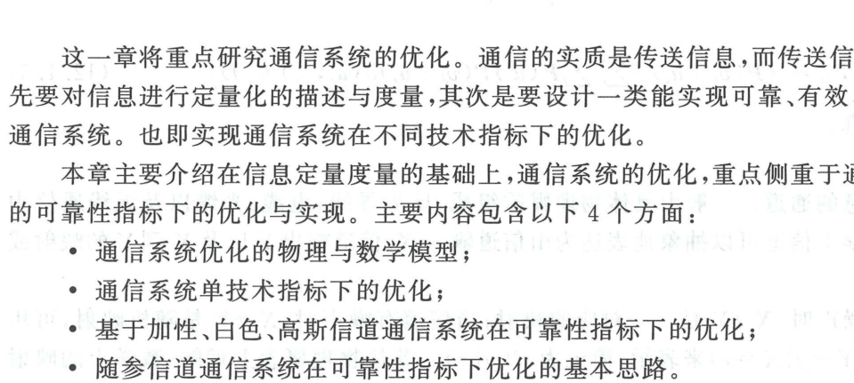

import Card from '@/components/Card.astro';
import ExerciseTrigger from '@/components/exercises/ExerciseTrigger.astro';

通信的本质是跨越物理空间的确定性或随机性信息传递。通信系统设计的核心使命主要包含两大支柱：**第一，对物理信息进行科学、精确的定量化描述与度量；第二，设计与构建能够在给定的客观物理约束下，实现可靠、有效且安全传输的最优通信系统**。

本节以最基础的点对点单向通信系统为基准，建立系统优化的全局物理与抽象数学模型，明确优化目标的核心指标与统计准则。

---

## 12.1.1 通信系统的物理模型与数学抽象

经典简化的点对点单向通信系统物理架构如下图所示：

系统由信源、发送端编码器、物理信道（混入加性高斯白噪声）、接收端译码器以及最终信宿五大子系统紧密级联构成：

### 1. 信源的数学描述与定量度量
信源是输出信息的发源地。在数学上，离散信源由随机变量 $U$ 及其先验概率分布描述：
- **无失真信源**：描述为概率空间 $[U, P(u_i)]$，其中随机变量 $U$ 取值于有限离散集合 $\{u_1, u_2, \dots, u_n\}$；
  其输出的信息量由**香农信息熵（Shannon Entropy）**定量度量：
  $$
  H(U) = -\sum_{i=1}^n P(u_i) \log_2 P(u_i) \quad (\text{bit/symbol})
  $$
- **限失真信源**：描述为 $\{ [U, P(u_i)], [U \times V, d(u_i, v_j)] \}$，其中 $V = \{v_1, \dots, v_m\}$ 为信宿恢复空间，$d(u_i, v_j)$ 为单符号失真度量测度；
  其最小所需信息量由**信息率失真函数（Rate-Distortion Function, $R(D)$）**度量：
  $$
  R(D) = \min_{P(v_j|u_i) \in P_D} I(U; V)
  $$
  式中 $P_D = \left\{ P(v_j|u_i) \;\middle|\; \sum_{i} \sum_{j} P(u_i) P(v_j|u_i) d(u_i, v_j) \le D \right\}$，$D$ 为系统允许的最大平均失真限度。

---

### 2. 信道的数学模型与信道容量
物理信道是承载电磁能量传播的介质（光纤、双绞线、空间无线电波）。
在数学上，信道被严格抽象为由输入随机变量 $X$、输出随机变量 $Y$ 以及信道统计条件转移概率分布 $P(y|x)$ 构成的三元组：
$$
[X, P(y|x), Y]
$$
- 无噪理想信道中，$X \to Y$ 是一一对应的确定性映射；
- 实际噪声信道中，$X \to Y$ 为随机概率映射，转移概率矩阵完全表征了噪声干扰的统计规律。
信道能够无差错传送的最大理论信息传输速率定义为**信道容量（Channel Capacity）**：
$$
C = \max_{P(x)} I(X; Y)
$$

---

### 3. 编/译码映射与系统马尔可夫链

编码与译码是实现通信系统与物理信源、物理信道统计匹配的核心手段：
- **编码器（正映射）**：$T_E: U \to X$，将信源符号映射为适于物理信道传输的信道码元；
- **译码器（逆映射）**：$T_D: Y \to V$，根据信道接收样值判决恢复出信宿重构符号。

在离散二元系统中，$U, V, X, Y$ 均取值于伽罗华域 $\text{GF}(2) = \{0, 1\}$。

系统各级符号序列严格构成**马尔可夫链（Markov Chain）**：
$$
U \longrightarrow X \longrightarrow Y \longrightarrow V
$$
系统全局联合概率分布可因式分解为：
$$
P(S) = P(u) \cdot P(x|u) \cdot P(y|x) \cdot P(v|y)
$$
当编/译码策略给定且互为逆映射时，系统特性完全由信源先验分布 $P(u)$ 与信道条件转移分布 $P(y|x)$ 共同唯一定界。

---

## 12.1.2 通信系统优化的度量指标与三大误差准则

通信系统的综合性能由三大支柱指标衡量：**有效性（数量指标）**、**可靠性（质量指标）**与**安全性（抗对抗指标）**。在通信原理中，重点聚焦于**有效性**与**可靠性**之间的物理权衡。

### 1. 三大误码准则
系统端到端误码率定义为译码判决符号 $\hat{u} = v$ 与原始发送符号 $u$ 不相等的概率：
$$
e(T_E, T_D) \triangleq P_e = P(\hat{u} \ne u)
$$
根据应用场景容忍度的不同，通信系统优化可划分为三大准则：

<Card title="通信系统三大误码准则" type="star">
1. **无失真准则（Zero-Error Criterion）**：
   $$
   P_e = 0
   $$
   要求接收端绝对 100% 完美无错。该准则仅适用于计算机数据、金融报文、程序代码与文本传真传输；
2. **误差准则（Strict Error Criterion）**：
   $$
   P_e < \epsilon
   $$
   要求对任意长码字均严格满足瞬时误码界限，属于理论过渡准则；
3. **平均误差准则（Average Error Criterion）**：
   $$
   P_e \le \epsilon \quad (\text{或平均失真 } \overline{d} \le D)
   $$
   允许瞬时出现随机微小波动，但在长统计平均下误码率任意逼近于零。这是工程上实际无线信道与音视频限失真传输最具实际指导价值的通用准则。
</Card>

---

### 2. 连续 AWGN 信道香农容量的度量基准

在带限（带宽 $B$）、时限（时长 $T$）与功限（平均信号功率 $P$）的经典连续加性高斯白噪声（AWGN）信道中，根据香农信息论与奈奎斯特采样定理，时长 $T$ 内可发送的独立正交自由度样点数为 $2BT$。

系统的总时段信道容量为各独立样点容量的代数累加：
$$
C_T = 2BT \times \frac{1}{2} \log_2\left( 1 + \frac{P}{\sigma^2} \right) = BT \log_2\left( 1 + \frac{P}{N_0 B} \right) \quad (\text{bit})
$$
归一化至单位时间的**信道容量连续香农公式**为：
$$
C = \frac{C_T}{T} = B \log_2\left( 1 + \frac{P}{N_0 B} \right) \quad (\text{bit/s})
$$
同时，通过定义每比特信号能量 $E_b = P / R_b$，可建立发射信噪比与传输速率的严格归一化关系：
$$
\frac{P}{\sigma^2} = \frac{P}{N_0 B} = \frac{E_b}{N_0} \cdot \frac{R_b}{B}
$$
这一关系将物理层的射频功率开销（$E_b/N_0$）与频带利用率（$R_b/B$）精密勾连，构成了后续所有系统优化分析的统一数学基线。

---

<ExerciseTrigger chapter={12} section="12.1" title="12.1 通信系统优化的物理与数学模型 思考题与自测" />
