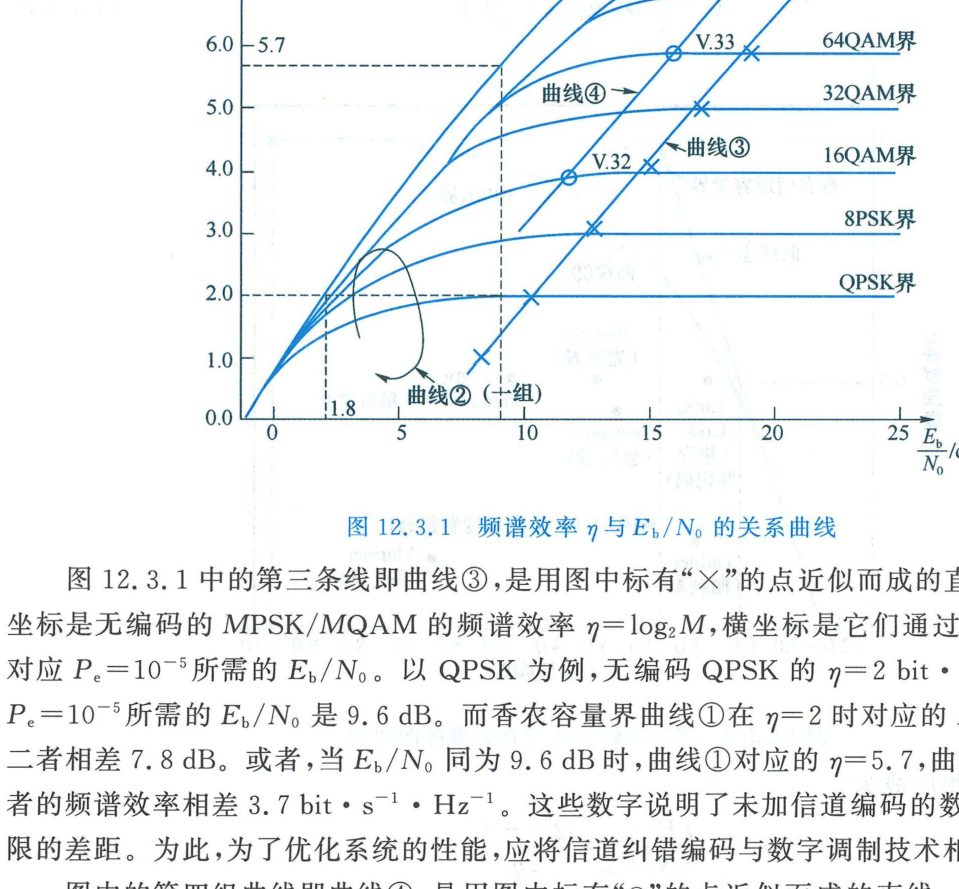
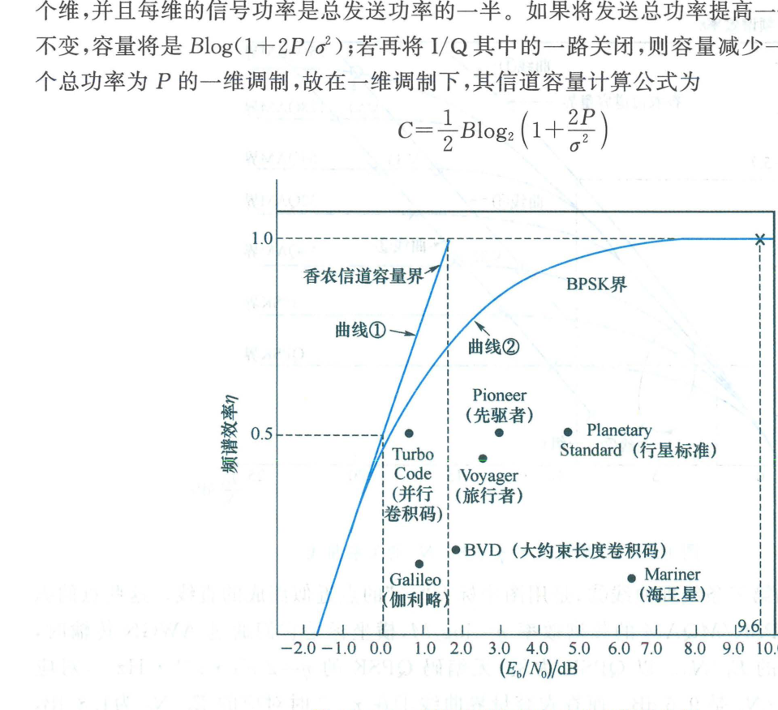

import Card from '@/components/Card.astro';
import ExerciseTrigger from '@/components/exercises/ExerciseTrigger.astro';

加性高斯白噪声（AWGN）信道是现代通信理论中最基准、最纯粹的经典物理模型。香农第二编码定理揭示了 AWGN 信道在可靠性指标下的终极传输能力——**信道容量（Channel Capacity, $C$）**。

本节系统构建频谱效率与归一化信噪比之间的双维折中空间，量化现代纠错编码技术在逼近香农理论极限征程中的物理足迹。

---

## 12.3.1 频谱效率与归一化信噪比方程

为了定量评估通信系统的频带有效性，引入**频谱效率（Spectral Efficiency）**参数：
$$
\eta = \frac{R_b}{B} \quad (\text{bit}\cdot\text{s}^{-1}\cdot\text{Hz}^{-1})
$$
式中 $R_b$ 为信息传输速率，$B$ 为带通信道带宽。对于符号周期为 $T_s$ 的二维带通信号，在最小奈奎斯特无码间串扰带宽 $B = 1/T_s$ 下：
$$
\eta_0 = \frac{C}{B} = C \cdot T_s \quad (\text{bit/symbol})
$$
这表明**频谱效率在数值上严格等价于单调制符号所能承载的最大信息量（广义编码率上限）**。

设平均接收信号功率为 $P$，噪声单边功率谱密度为 $N_0$（总噪声功率 $\sigma^2 = N_0 B$），单信息比特能量为 $E_b = P / R_b$。在按信道容量极限传输时（$R_b = C$），信噪比关系式满足：
$$
\eta_0 = \log_2\left( 1 + \frac{P}{N_0 B} \right) = \log_2\left( 1 + \eta_0 \frac{E_b}{N_0} \right)
$$
反解出实现可靠传输所必需的**最小极限归一化信噪比**方程：
$$
\left( \frac{E_b}{N_0} \right)_{\min} = \frac{2^{\eta_0} - 1}{\eta_0}
$$

以可靠性指标 $(E_b/N_0)_{\min}$ 为横轴（分贝刻度），以有效性指标 $\eta_0$ 为纵轴，构成了通信系统“有效性-可靠性最佳平衡”的双维图示平面。

---

## 12.3.2 频谱效率四组特征曲线剖析

在二维调制平面中，系统性能的理论极限与实际水平由四组标志性曲线勾勒：

<Card title="图 12.3.1 四组核心性能曲线的物理内涵" type="star">
1. **曲线 ①（香农理论极限容量界，Shannon Limit）**：
   根据上述方程直接绘制的最优边界。它假定信道输入信号服从连续高斯分布，代表物理世界中在任意小误码率下，单位频带传输 $\eta$ 比特信息所必需付出的**绝对最低能量代价**；
2. **曲线 ②（有限星座受限容量界，Constellation-Constrained Capacity）**：
   一簇对应于等概 QPSK、8-PSK、16-QAM、32-QAM、64-QAM 的离散输入互信息曲线。由于实际数字调制仅使用有限离散星座点而非连续高斯分布，曲线 ② 恒低于无约束香农界 ①；
3. **曲线 ③（常规未编码数字调制基线）**：
   无纠错编码的常规 MPSK/MQAM 在典型工程误码率 $P_e = 10^{-5}$ 下的性能散点连线。
   - **以 QPSK 为例**：无编码 QPSK 频谱效率 $\eta = 2\text{ bit}/(\text{s}\cdot\text{Hz})$，实现 $P_e = 10^{-5}$ 需 $E_b/N_0 = 9.6\text{ dB}$；而香农界在 $\eta = 2$ 时仅需 $1.8\text{ dB}$，**二者能耗相差高达 $7.8\text{ dB}$**！
   - 反之，在同等 $E_b/N_0 = 9.6\text{ dB}$ 能耗下，香农界理论上可支持 $\eta = 5.7\text{ bit}/(\text{s}\cdot\text{Hz})$ 的频谱效率，相差 $3.7\text{ bit}/(\text{s}\cdot\text{Hz})$！
4. **曲线 ④（网格编码调制，TCM）**：
   ITU-T 国际电话线 Modem 采用的 Ungerboeck 网格编码调制性能连线。通过将卷积码与星座欧氏距离分割结合，性能向香农界靠近了 $3 \sim 5\text{ dB}$。
</Card>

**信道编码的根本使命**：就是在最优解调的基础上，通过引入代数校验约束，填补未编码系统（曲线 ③）与理论极限（曲线 ①/②）之间的巨大鸿沟！

---

## 12.3.3 一维调制与深空通信二进制编码的极限演进

对于仅包含单一正交维度的一维调制（如 BPSK、ASK），其带通信道容量方程变为：
$$
C = \frac{1}{2} B \log_2\left( 1 + \frac{2P}{\sigma^2} \right) \implies \left( \frac{E_b}{N_0} \right)_{\min} = \frac{2^{2\eta_0} - 1}{2\eta_0}
$$

NASA 深空行星探测器（行星距离地球数亿公里，发射机功率极度受限且天线增益不可增加）是推动二进制信道编码逼近香农极限的最伟大试验场：

各历史时期标志性编码方案在 $P_e = 10^{-5}$ 下的性能演进如下：

1. **未编码 BPSK 基准**：
   所需 $E_b/N_0 = 9.6\text{ dB}$（净编码增益 $0\text{ dB}$）；
2. **NASA 行星标准卷积码（1970 年代）**：
   采用约束长度 $K = 7$、码率 $R = 1/2$ 的 $(2, 1, 7)$ 卷积码配合 Viterbi 软判决译码，所需 $E_b/N_0 = 4.5\text{ dB}$，获得 **$5.1\text{ dB}$ 的巨大编码增益**；
3. **旅行者号（Voyager 1/2，1980 年代）**：
   将 $(2, 1, 7)$ 卷积内码与 $(255, 223)$ RS 外码深度级联并配合交织，所需 $E_b/N_0$ 降至 $2.5\text{ dB}$，编码增益跃升至 **$7.1\text{ dB}$**；
4. **先驱者号（Pioneer）与伽利略号（Galileo，1990 年代）**：
   先驱者号采用 $K = 32$ 超大约束长度卷积码（所需 $2.7\text{ dB}$）；伽利略号采用码率 $1/4$ 的 $(4, 1, 15)$ 卷积码与 RS 码级联，以频带展开为代价将所需 $E_b/N_0$ 压低至 **$0.9\text{ dB}$**；
5. **Turbo 码（1993 年）**：
   法国学者 Berrou 提出的并行级联卷积 Turbo 码（码率 $1/2$），所需 $E_b/N_0$ 仅为 **$0.7\text{ dB}$**，距离 BPSK 的离散容量界仅相差 **$0.5\text{ dB}$**，首次跨入了“香农圣杯”的门槛；
6. **现代低密度校验码（LDPC 码）**：
   重新发掘的 Gallager 稀疏校验图 LDPC 码，通过大规模置信度传播迭代译码，在码率 $1/2$ 下实测性能**距离理论香农容量界仅差 $0.0045\text{ dB}$**！

现代信道编码理论至此已完全实现了对 AWGN 信道理论物理潜能的穷尽式挖掘与极限逼近。

---

<ExerciseTrigger chapter={12} section="12.3" title="12.3 基于AWGN信道在可靠性指标下的优化 思考题与自测" />
