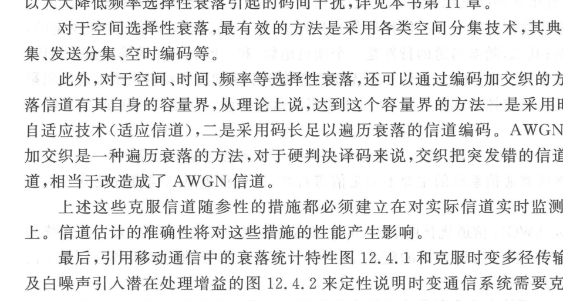
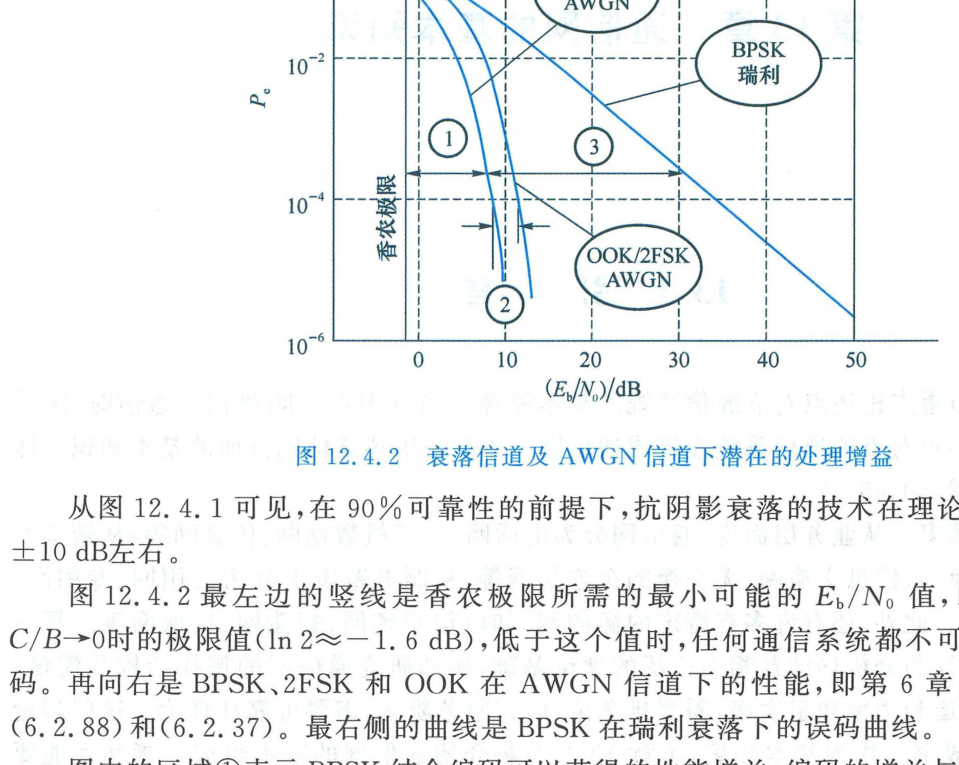

import Card from '../../../../../../components/Card.astro';
import ExerciseTrigger from '../../../../../../components/ExerciseTrigger.astro';

随参信道（Random-Parameter / Time-Varying Channels）是指传输介质的物理特性随时间、空间或频率发生剧烈随机涨落的信道。与前面所讨论的恒参加性高斯白噪声（AWGN）信道相比，**随参信道的传输特性不仅是一个随机过程，而且是由多物理尺度、多维色散效应复合交织而成的极复杂系统**。

本节系统剖析移动无线信道的衰落分层模型，提炼针对随参信道实施可靠性优化的两大工程方法论与逆变传递函数设计准则。

---

## 12.4.1 移动无线衰落特性的多尺度物理叠加

在移动通信传播环境中，接收天线接收到的电磁场包络起伏呈现大尺度与小尺度的三层复合叠加：

1. **路径损耗（Path Loss）**：
   电磁波在自由空间扩散引起的确定性几何衰减，信号平均功率随传播距离 $d$ 的对数呈幂律衰减（典型衰减指数为 $n = 2 \sim 4$）；
2. **大尺度阴影衰落（Shadow Fading，慢衰落）**：
   由高大建筑物、丘陵地形等大型障碍物的遮挡引起（类似于云层遮挡太阳光）。其空间波动尺度通常在数十米至数百米，波动持续时间为数秒乃至数分钟，信号局部中值功率服从**对数正态分布（Log-Normal Distribution）**；
3. **小尺度多径衰落（Small-Scale Multipath Fading，快衰落）**：
   移动台周围大量局部散射体反射产生的离散多径电波在接收点发生空间矢量相干干涉。当移动台移动微小的半波长距离（厘米级）时，合成信号振幅即发生剧烈起伏，服从**瑞利分布（Rayleigh）或莱斯分布（Rician）**。快衰落进一步表现为：
   - **时间选择性衰落**：由移动台相对运动引发的多普勒频移扩展造成；
   - **频率选择性衰落**：由多径时延扩展造成；
   - **空间选择性衰落**：由空间入射角扩展造成。

---

## 12.4.2 信道级联分解与逆变传递函数理论

为了有效继承并复用 AWGN 恒参信道的优化成果，通信理论将总信道严格分解为**基准 AWGN 信道 $C_1$** 与**狭义纯随参信道 $C_2$** 的串联级联：
$$
H = H_1 \cdot H_2
$$
其中纯随参信道的传递函数 $H_2$ 可进一步按物理机制解耦因子分解为：
$$
H_2 = H_{21} \cdot H_{22} \cdot H_{23} \cdot H_{24}
$$
- $H_{21}$：对数正态阴影慢衰落传递函数；
- $H_{22}$：空间选择性衰落传递函数；
- $H_{23}$：频率选择性多径衰落传递函数；
- $H_{24}$：时间选择性时变衰落传递函数。

<Card title="随参信道优化的数学本质：寻求逆变传递函数" type="star">
针对随参信道实施信号处理优化的根本目标，就是通过收发两端的联合处理，寻求对客观信道 $H_2$ 进行求逆与均衡的**逆变传递函数（Inverse Transfer Function, $H_2^{-1}$）**：
$$
H_2^{-1} = H_{21}^{-1} \cdot H_{22}^{-1} \cdot H_{23}^{-1} \cdot H_{24}^{-1}
$$
逆变运算由发送端与接收端协同完成：
$$
H_2^{-1} = H_{2T}^{-1} \cdot H_{2R}^{-1}
$$
- **发端实现 $H_{2T}^{-1}$**：发射机信号设计、闭环功率控制、发端波束赋形与预编码；
- **收端实现 $H_{2R}^{-1}$**：接收机分集合并、时频均衡、Rake 接收与信道自适应译码。
</Card>

---

## 12.4.3 随参系统优化的两大核心工程范式

从物理实现机制上看，随参通信系统的优化战略可划分为两大哲学对立统一的工程范式：

### 范式一：改造信道，强行将其恢复为恒参 AWGN 信道
该范式旨在通过强有力的主动反向补偿，抹平信道的随参时变性与色散性，使物理层表现为纯净的 AWGN 恒参环境：
- **实时语音业务的闭环功率控制**：CDMA 系统中基站以高达 1500 Hz 的频率向手机发送功率微调指令，在深衰落时命令手机增加发射功率，在浅衰落时降低功率，**强行将时变波动的信噪比熨平为恒定信噪比**；
- **消除频率选择性的 OFDM 并行化**：通过引入循环前缀将时域宽带多径信道对角化分解为多个相互正交的平坦衰落子信道；
- **消除突发差错的时频交织**：交织器将衰落引入的连片突发错彻底打散为孤立离散错，从译码器视角看，信道完全等价于无记忆独立随机 AWGN 信道。

---

### 范式二：适应信道，让信号处理动态契合信道参数起伏
对于时延不敏感的分组数据传输（如 4G/5G 移动宽带上网、文件下载），强行在深衰落中提高发射功率不仅严重恶化能效，而且会加剧对邻近小区的干扰。该范式主张**尊重自然衰落规律，顺势而为**：
- **链路自适应（Adaptive Modulation and Coding, AMC）**：
  - 手机实时测量并向基站上报信道质量指示（CQI）；
  - **当信道处于波峰良好时**：基站立即调度最高阶调制（如 256-QAM）与高码率编码，集中发射功率，实现暴风骤雨般的峰值吞吐量；
  - **当信道落入深衰落波谷时**：基站自适应降速至 QPSK 低码率，甚至暂时挂起传输等待信道恢复；
- **空时频多维“注水算法（Water-Filling）”**：根据香农信道容量理论，在信道增益高的频段与时隙分配更多功率与信息，在恶劣信道分配少量甚至零功率，从而最大化信道的遍历容量（Ergodic Capacity）。

---

## 12.4.4 多维潜在抗衰落处理增益

在现代移动蜂窝通信中，系统综合利用空间分集、频率分集、动态功率控制与高级信道纠错编码，所能释放的潜在抗衰落性能增益极其惊人：

在基准统计可靠性为 $90\%$ 的要求下：
1. **抗阴影衰落增益**：宏分集越区软切换技术可补偿约 $8 \sim 10\text{ dB}$ 的对数正态阴影损耗；
2. **抗多径快衰落增益**：Rake 接收、OFDM 频域分集或多天线空间分集可将瑞利深衰落的惩罚压缩 $10 \sim 20\text{ dB}$；
3. **逼近香农极限的信道编码增益**：Turbo 码与 LDPC 码相比未编码系统带来额外的 $5 \sim 8\text{ dB}$ 功率增益。

综合上述技术，现代随参无线系统在恶劣多径环境下实现了逼近有线信道的惊人可靠性与超高吞吐率。

---

<ExerciseTrigger chapter={12} section="12.4" title="12.4 随参信道通信系统在可靠性指标下优化的基本思路 思考题与自测" />
