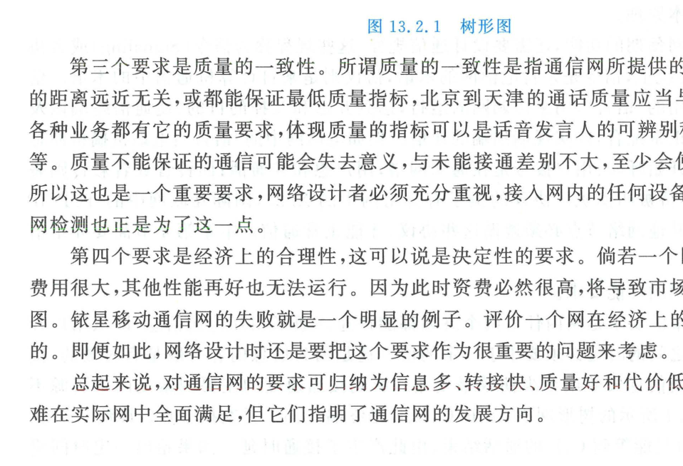

import Card from '../../../../../../components/Card.astro';
import ExerciseTrigger from '../../../../../../components/ExerciseTrigger.astro';

一个现代通信网络是由无数异构硬件实体与分层软件规则精密咬合的有机整体。从系统工程架构审视，通信网由四大要素共同组成，并受到四大核心性能指标的严格约束。

---

## 13.2.1 通信网的四大基本组成要素

1. **终端设备（Terminals）**：
   位于物理网络的边缘节点（信源与信宿处），如智能手机、固定话机、PC、物联网传感器与车载终端。具备三大核心功能：
   - **消息转换**：完成非电消息与电信号之间的双向变换（麦克风/扬声器、摄像头/显示屏）；
   - **传输信号处理**：完成模数转换、信源压缩、信道纠错编码、交织与射频调制；
   - **信令协议交互**：响应拨号、振铃、鉴权注册与连接握手；
2. **传输信道与逻辑链路（Channels & Links）**：
   连接网络中各个交换节点与终端的物理媒介（光纤、微波、卫星电波、双绞线）。
   - 在网络层，信道被高度抽象为**逻辑信道（Logical Channels）**。例如一根敷设在城市间的单模光纤，在物理上是一个光频信道，但在交换机视角下，通过波分复用（WDM）与时分复用（OTN/SDH）可被划分为成千上万个彼此独立的逻辑话路信道；
3. **交换设施（Switching Facilities）**：
   通信网的控制中枢与连接枢纽（程控交换机、IP 路由器、光交叉连接设备 OXC），负责动态建立入线与出线之间的物理或逻辑转接通路；
4. **信令与协议（Signaling & Protocols）**：
   网内各个节点协同运行所遵循的“标准语言”与通信规程，负责控制链路建立、路由寻址、差错重传、资源分配与呼叫拆除。

---

## 13.2.2 网络拓扑与中继冗余可靠性

图 13.2.1 展现了典型的树形通信网拓扑及其在中继链路增强前后的可靠性对比：

- **集中树形结构（图 13.2.1(a)）**：
  若终端 $C$ 与 $E$ 正在通话占用中继链路 $b \to c$，此时终端 $A$ 拨打 $D$ 将由于公共中继线被独占而陷入长时间阻塞等待，产生巨大的**接通时延**；若中继线 $c \to d$ 发生物理断线故障，子网 $A, B, C$ 将彻底与 $D, E$ 失联；
- **冗余多路径结构（图 13.2.1(b)）**：
  在节点 $a$ 与 $d$ 之间增设直达复用中继信道后，$A \to D$ 的呼叫可直接分流，消除了接通时延；同时消除了单点故障（SPOF），即使某条主干线受损，网络依然能够实现动态迂回路由，大幅跃升全网生存度。

---

## 13.2.3 通信网的四大核心性能要求

现代通信网络工程规划的核心准则可概括为十二字方针：**信息多、转接快、质量好、代价低**。

<Card title="通信网四大核心性能要求" type="star">
1. **快速连通性（Low Connection Latency）**：
   从主叫用户发起呼叫请求到两端正式建立端到端通路的建立时延必须极短。信息具有强时效性，过长的等待时延会导致呼叫放弃（呼损）；
2. **大吞吐量与多业务承载能力（High Throughput & Multi-Service）**：
   - 数据业务吞吐量以比特率（$\text{bit/s}$）度量；
   - 话音业务以**爱尔兰（Erlang, Erl）**度量：**单位时间（1 小时）内连续不间断占用 1 条信道通话即为 1 Erl**；
   - 网络必须具备高并发承载能力，防止流量超出临界阈值引发网络瘫痪性拥塞（Congestion）；
3. **服务质量的一致性（QoS Consistency）**：
   网络提供的传输保真度与时延抖动指标必须与用户之间的地理物理距离解耦。北京拨打天津的语音清晰度必须与北京拨打巴黎完全一致；
4. **经济合理性（Economic Feasibility）**：
   建设投资与运营维护成本必须处于合理的商业闭环区间。第一代“铱星系统（Iridium）”因卫星制造与发射维护成本天文数字、地面资费极其昂贵导致市场受众狭窄，成为通信工程史上因违背经济合理性原则而宣告商业破产的著名先烈案例。
</Card>

---

<ExerciseTrigger chapter={13} section="13.2" title="13.2 通信网的组成要素和性能要求 思考题与自测" />
