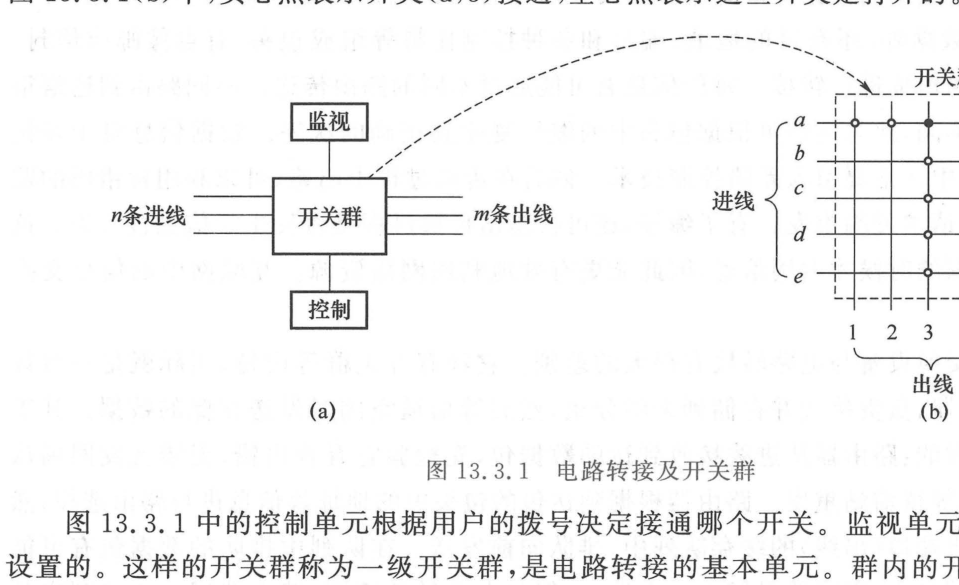

import Card from '@/components/Card.astro';
import ExerciseTrigger from '@/components/exercises/ExerciseTrigger.astro';

若在 $M$ 个终端之间全部采用点对点直连电缆，所需的独立信道数将按 $\frac{M(M-1)}{2} = \mathcal{O}(M^2)$ 发生组合爆炸。为了在经济可行的物理规模下实现全网互通，必须在拓扑中心部署**交换系统（Switching Systems）**。

通信网中的转接交换机制主要分为三大范式：**电路转接**、**信息转接（分组交换）**与**多址接入转接**。

---

## 13.3.1 电路转接（Circuit Switching）与交叉开关群

### 1. 独占信道的工作机制
电路转接是最经典的电信网交换方式。在主叫与被叫正式通话之前，网络必须通过信令交互在两端之间**实时建立并独占一条专用的端到端物理连接通道**：
- 在整个通话期间，该专有电路由该呼叫**全程排他性独占**；
- 即使通话双方处于静音停顿或不发声状态，线路资源亦被死死锁定，其他用户无法插足；
- 一旦某中继链路的所有信道均被占满，新发起的呼叫将被无情拒绝（产生呼损）。

---

### 2. 开关群（Switch Matrix）的阵列结构

电路转接设备的核心硬件是**开关群（Switch Group）**。图 13.3.1 展现了具有 $n$ 条输入线（进线）与 $m$ 条输出线（出线）的一级纵横制交叉开关拓扑：

- **交叉点互锁矩阵（图 13.3.1(b)）**：进线 $a, b, c, d, e$ 与出线 $1, 2, 3, 4, 5$ 垂直交错。当用户 $a$ 呼叫并选择出线 $3$ 时，闭合坐标开关 $(a, 3)$（图中实心点）。此时，**同一行（第 $a$ 行）与同一列（第 3 列）上的所有其余开关必须强制断开互锁**，绝对禁止一条进线连通多条出线或多条进线抢占同一出线；
- **多级 Clos 架构**：单级开关群需要 $m \times n$ 个交叉开关触点。当 $m, n \ge 1000$ 时，交叉点数突破百万大关。现代大容量程控数字交换机采用以时间（T）时隙交换和空间（S）空间交叉相结合的**多级 T-S-T 级联网络**，大幅削减了硬件门电路总数。

---

## 13.3.2 信息转接（分组交换，Packet Switching）

### 1. 统计复用（Statistical Multiplexing）的物理动机
计算机数据传输呈现极强的“突发性”（如点击网页时瞬间产生大流量，浏览时长时间无流量）。即使在传统语音通话中，由于一方倾听与语间停顿，单条物理信道在超过 $60\%$ 的时间内其实处于空闲闲置状态。

**信息转接彻底打破了信道的专有预分配模式，采纳“有数据才占用信道”的存储转发（Store-and-Forward）机制**：
- 多个用户的突发数据流在时间上交错重叠，共同复用一条宽带信道；
- 交换节点（路由器）按需动态分配传输时隙，极大提高了宝贵干线信道的利用效率；
- **代价**：当突发流量并发涌入时，部分数据包必须在队列缓存中排队等待，引入了不确定的**排队时延（Queueing Delay）**与时延抖动。

---

### 2. 数据分组（Packet）与路由器转发流水线

在分组交换网中，信源发送的长信息被拆分为标准大小的数据分组：

<Card title="典型数据分组（Packet）的物理结构" type="star">
1. **包头（Header，类似邮政信封）**：包含目的 IP 地址、源 IP 地址、分组全局序列编号（Sequence Number）、生命周期（TTL）与服务类别（QoS）字段；
2. **净载荷（Payload）**：用户真实的业务数据切片；
3. **包尾校验字段（Trailer）**：包含 16 位或 32 位循环冗余校验码（CRC），用于物理层差错检测。
</Card>

**路由器工作循环**：
1. 校验到来的数据包 CRC，若发生比特翻转则请求前站重传（ARQ）；
2. 提取目的地址，查询路由转发表，确定最佳下一跳输出端口；
3. 将数据包推入对应输出端口的先进先出（FIFO）或优先级调度缓冲队列排队发送；
4. 乱序到达目的终端的数据包根据包头序列号重新组装排序。

---

### 3. ATM（异步转移模式）的定长信元折中
20 世纪 80 年代电信领域为了同时兼容语音实时性与数据高带宽，推出了 **ATM（Asynchronous Transfer Mode）**技术：
- 采用**固定长度为 53 字节的小信元（Cell）**（48 字节数据净荷 + 5 字节信头）；
- 短定长信元使硬件交换能够全由 ASIC 门阵列完成，大幅压缩了排队时延，成为当时高速电信骨干网的绝对主流。

---

## 13.3.3 多址接入（Multiple Access）转接技术

多址技术允许多个分散的地理节点共享同一个无线广播物理媒介进行通信：

### 1. 随机竞争多址
- **ALOHA 协议**：夏威夷大学开发的最早无线分组协议。终端有包就发，发生碰撞则随机退避重发（纯 ALOHA 最大吞吐率仅 $18.4\%$；时隙 ALOHA 提升至 $36.8\%$）；
- **以太网 CSMA/CD（载波监听多路访问/冲突检测）**：局域网经典协议，规则可凝练为**“先听后发、边发边听、冲突停发、随机退避”**，显著压低了碰撞概率。

---

### 2. 受控正交多址机制对比

在移动蜂窝与卫星通信中，主要采用确定性受控信道划分：

| 多址体制 | 划分坐标 | 特征机制 | 容量特性与典型应用 |
| :---: | :---: | :---: | :---: |
| **频分多址（FDMA）** | 频率轴 | 各用户独占不同子频带，需设置防串扰保护带 | **硬容量**（信道数固定，如 1G 模拟蜂窝网） |
| **时分多址（TDMA）** | 时间轴 | 周期性划分帧与时隙，各用户独占定时时隙 | **硬容量**（需精密基站同步，如 2G GSM 8时隙/帧） |
| **码分多址（CDMA）** | 码字正交性 | 同频同发，各用户分配正交/准正交地址码 | **软容量**（干扰受限，需高频闭环功控，如 3G） |
| **正交频分多址（OFDMA）** | 时频二维网格 | 将 OFDM 正交子载波块（RB）二维动态分配 | **弹性高吞吐**（抗多径、高频效，4G LTE / 5G NR 核心） |

---

<ExerciseTrigger chapter={13} section="13.3" title="13.3 交换技术的基本原理 思考题与自测" />
