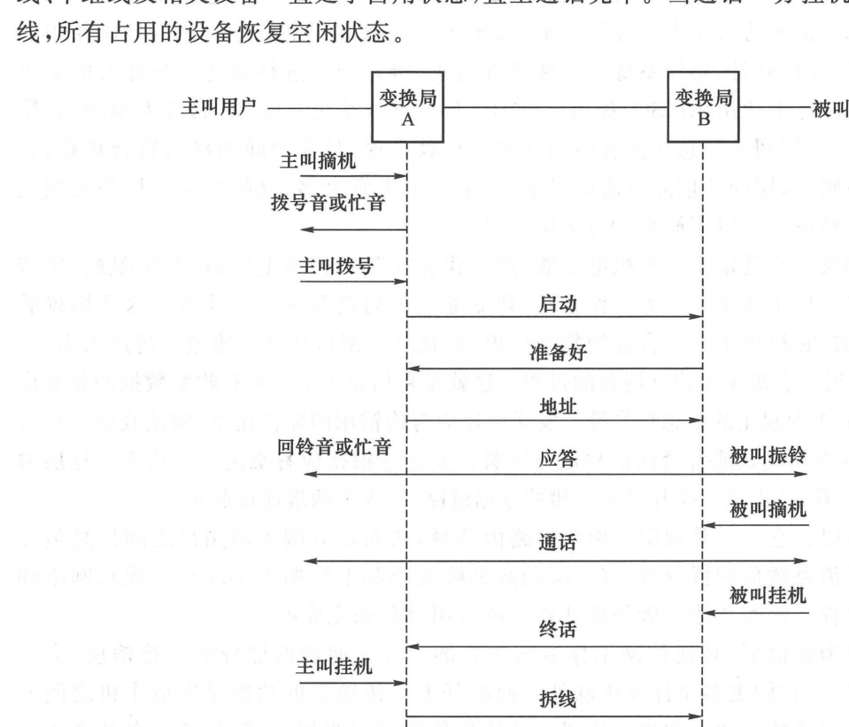
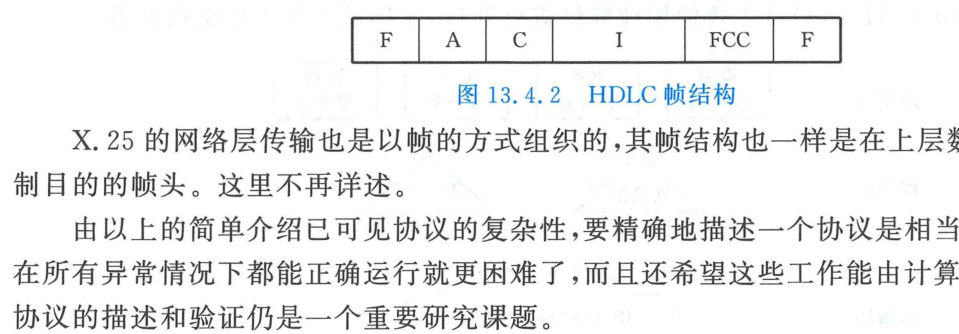

import Card from '../../../../../../components/Card.astro';
import ExerciseTrigger from '../../../../../../components/ExerciseTrigger.astro';

若仅将交换节点与传输信道在物理上相连，网络不过是一堆毫无生机的线缆与硅片。通信网要自主运转，各节点必须严格遵循一套规范化的通信规程。在传统电信领域，这套规程被称为**信令（Signaling）**；在计算机互联网领域，则被称为**协议（Protocol）**。它们构成了通信网内部各个异构软硬件协同运转的“通用世界语”。

---

## 13.4.1 电话网信令系统

电话网基于电路转接体制，其信令流程严格覆盖呼叫建立、通话维持与电路拆除的全生命周期。

### 1. 电话呼叫信令时序全流程剖析

图 13.4.1 展示了跨越两个交换局（局 A 与局 B）的主叫与被叫之间的完整信令交互时序：

1. **用户线信令阶段（主叫端）**：
   - **主叫摘机**：话机叉簧弹起，闭合用户双绞线构成的直流回路；
   - **拨号音应答**：交换局 A 检测到直流电流，判定用户有呼叫意图，向话机回馈 400 Hz 连续正弦拨号音；
   - **主叫拨号**：用户通过双音多频（DTMF）或脉冲信号输入被叫电话号码；
2. **局间信令阶段（中继线路由）**：
   - 交换局 A 解析被叫号码前缀，选定通往交换局 B 的空闲中继信道，发送**启动信令**；
   - 交换局 B 收到后回送**准备好信令**；
   - 交换局 A 将被叫地址发送给局 B；
3. **被叫试接与振铃阶段**：
   - 局 B 探测被叫用户线状态：若被叫占线则返回忙音；若空闲，则局 B 启动交流高压发电机向被叫用户馈送 25 Hz 交流**振铃信号（机身振铃）**，同时局 A 向主叫用户耳机馈送断续**回铃音**；
4. **通话与拆线释放**：
   - 被叫摘机，局 B 检测到直流闭合并向上级回送**应答信令**，两局之间的语音电路彻底打通，进入双向实时通话；
   - 任意一方挂机，交换机立即启动**终话与拆线流程**，所有占用的用户线与中继开关群全部复位释放。

---

### 2. 随路信令（CAS） vs 共路信令（CCS）
- **随路信令（Channel-Associated Signaling, CAS）**：
  信令信号与所控制的话音业务捆绑在同一条传输线内传输（例如在 PCM E1 系统的 32 个时隙中，时隙 TS16 专用于传输控制其余 30 个话路的信令）。其缺点是信道利用率低、信令容量受限；
- **共路信令（Common Channel Signaling, CCS）**：
  将所有中继话路的信令集中剥离出来，在一条专门的高速全数字数据链路上以分组方式集中传输。**国际标准 CCITT No.7（七号信令系统，SS7）**即为全球电话网的核心共路信令，构建了高度智能化的独立信令专网。

---

## 13.4.2 数据网协议体系与分层模型

### 1. ISO/OSI 七层参考模型与通信下三层

国际标准化组织（ISO）提出了著名的**开放系统互联（OSI）七层协议模型**。对于通信工程人员，最核心的是直接支配比特在物理媒介中传输的**通信下三层**：

<Card title="OSI 通信下三层核心职能" type="star">
1. **物理层（Physical Layer）**：
   定义连接器的机械规格、引脚电压电气特性、比特率、以及全双工/半双工物理信道；
2. **数据链路层（Data Link Layer）**：
   通过成帧、同步、差错检测（CRC）与自动重传（ARQ），在不可靠的物理比特流上构建出**几乎无差错的逻辑点对点数据链路**；
3. **网络层（Network Layer）**：
   负责端到端跨多跳网络路由选择（Routing）、流量拥塞控制与逻辑寻址（IP 地址分配）。
</Card>

高四层（传输层、会话层、表示层、应用层）则由计算机操作系统与应用软件负责（如互联网经典的 4 层 TCP/IP 体系：网络接入层、网络层 IP、传输层 TCP/UDP、应用层 HTTP/DNS）。

---

### 2. 经典数据链路层 HDLC 帧结构与透明传输

在 X.25 协议的链路层中，广泛采用**高级数据链路控制（HDLC）**帧格式：

1. **标志字段（Flag, F）**：
   首尾固定为 8 比特特定模式 `01111110`（十六进制 `0x7E`），用于接收端物理层帧定界同步；
2. **零比特填充法（Bit-Stuffing，解决透明传输冲突）**：
   若用户数据载荷 $I$ 内部偶然出现 `01111110`，接收端会误判为帧结束而导致严重的“断帧”。
   - **发射端规则**：硬件扫描连续比特流，**只要连续检测到 5 个连 "1"，无论其下一位是什么，强制在后面强行插入一个 "0"**；
   - **接收端规则**：硬件检测到 5 个连 "1" 紧随一个 "0" 时，**自动将该 "0" 剥离剔除**，完美还原真实数据！
3. **地址字段（A）与控制字段（C）**：
   标识主从站链路地址与帧类型（信息帧 I 帧、监控帧 S 帧、无编号帧 U 帧）；
4. **帧校验序列（FCS）**：
   采用标准的 16 位循环冗余校验码（CRC-16），其本原生成多项式为：
   $$
   g(x) = x^{16} + x^{12} + x^5 + 1
   $$
   确保数据帧在穿越物理噪声信道时的极致可靠性。

---

<ExerciseTrigger chapter={13} section="13.4" title="13.4 信令和协议 思考题与自测" />
