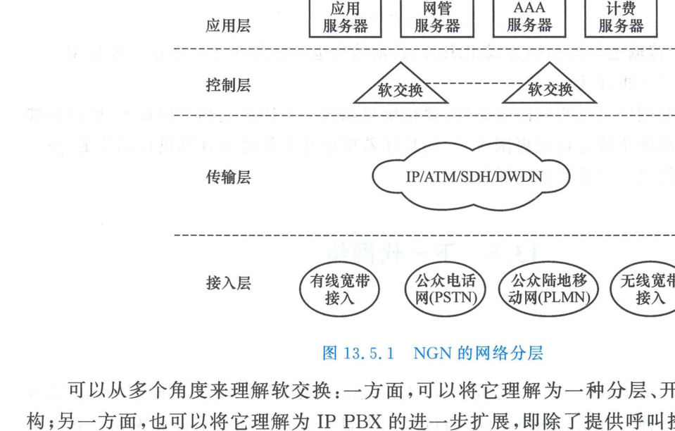

import Card from '../../../../../../components/Card.astro';
import ExerciseTrigger from '../../../../../../components/ExerciseTrigger.astro';

传统电信网络为特定业务建设专用垂直网络（例如专用于话音的 PSTN、专用于报文的 X.25、专用于数据通信的 IP 网）。这种烟囱式烟囱架构导致网络建设重复投资、运营维护极其复杂、且无法灵活孵化新型宽带多媒体业务。

为了打破这种割裂僵局，电信与互联网领域共同提出了**下一代网络（Next Generation Network, NGN）**的战略愿景。

---

## 13.5.1 NGN 的核心设计理念与纵向四层架构

NGN 是一个基于全分组化（以 IP 协议为统一基底）构建的通用电信级业务承载网络，其革命性体现在**“四大彻底分离”**设计准则：
1. **控制与承载分离（Control-Bearer Separation）**；
2. **呼叫/会话与应用/业务分离（Call-Application Separation）**；
3. **业务提供与网络接入分离（Service-Network Decoupling）**；
4. **移动性管理与底层物理介质解耦（通用移动性，Universal Mobility）**。

在纵向物理与逻辑拓扑上，NGN 严格划分为四个清晰独立的层次：

<Card title="NGN 纵向四层架构模型" type="star">
1. **接入层（Access Layer）**：
   通过无源光网络（xPON）、数字用户线（xDSL）、Wi-Fi 以及 4G/5G 无线基站，将用户产生的各种语音、4K 视频、物联网传感器数据统一适配转换并汇聚为标准 IP 分组流；
2. **传输层（Transport Layer）**：
   以智能光传送网（OTN）与多协议标签交换（IP/MPLS）路由器为骨架，提供具备端到端服务质量（QoS）严格保证与毫秒级保护倒换的高可靠宽带管道；
3. **控制层（Control Layer，全网核心）**：
   NGN 的智能大脑。负责呼叫路由寻址、会话建立与释放、资源准入调度、信令互通、用户认证授权与计费；
4. **应用层（Application Layer）**：
   由标准开放的业务服务器（Application Server, AS）阵列构成。通过标准 API（如 Parlay/RESTful）向第三方开发者全面开放底层网络能力，支撑云游戏、超高清会议与智慧城市业务的即时快速部署。
</Card>

---

## 13.5.2 软交换（Softswitch）技术：打破交换机黑盒

在传统程控交换机中，用户业务逻辑、呼叫路由控制以及底层的时隙交换硬件矩阵全部封闭在一个不可分割的专用机柜硬件内部。

**软交换（Softswitch）技术彻底解构了传统交换设备**：
- **媒体流与信令流分道扬镳**：负责数据分组打包转发的“粗重”工作交由**媒体网关（Media Gateway, MGW）**执行；负责呼叫信令解析与路由判决的“大脑”工作由运行在通用商业服务器（COTS）上的**软交换机软件（Softswitch Controller）**完成；
- **标准化控制协议**：软交换控制器与媒体网关之间采用公开标准协议通信（如 IETF/ITU-T 联合制定的 **H.248 / MEGACO** 以及 **MGCP** 协议）；
- 软交换消灭了昂贵的专用硬件矩阵，使电信运营商能够像升级电脑软件一样便捷地更新网络功能与路由策略。

---

## 13.5.3 IP 多媒体子系统（IMS）：走向终极固移融合

当固定网络在软交换技术指引下迅猛发展时，移动通信标准化组织 3GPP 在 WCDMA 演进中提出了更为激进与开放的架构——**IP 多媒体子系统（IP Multimedia Subsystem, IMS）**：
- **3GPP R4 版本（2001 年）**：在核心网电路域首次分离出媒体网关（MGW）与 MSC 服务器（MSC Server），实现了“移动软交换”；
- **3GPP R5/R6 版本**：正式确立全 IP 架构的 IMS 体系。在控制层内部实施二次深度解耦，将呼叫会话控制功能（CSCF, Call Session Control Function）与网关控制实体（MGCF）彻底剥离，全线采用轻量级的互联网**会话发起协议（SIP, Session Initiation Protocol）**作为统一控制基底。

<Card title="IMS 的终极愿景：固移融合（FMC）" type="star">
**IMS 的终极目标是构建一个与具体接入物理层完全无关（Access-Agnostic）的统一融合核心网！**

无论用户是通过 5G 蜂窝基站、家庭 Wi-Fi 光纤宽带、还是卫星通信接入网络，IMS 核心网均将其映射为统一的 SIP 会话与统一的用户账户体系。这标志着电信网在经历了百余年与计算机网的分立后，终于在全 IP 架构下实现了彻底的**固移融合（Fixed-Mobile Convergence, FMC）与数智终极融合**。
</Card>

---

<ExerciseTrigger chapter={13} section="13.5" title="13.5 下一代网络 思考题与自测" />
