import Knowledge from '@/components/Knowledge.astro';
import Example from '@/components/Example.astro';
import Solution from '@/components/Solution.astro';

通信的原理总的来说就是：在发端设计一个合适的携带信息的信号，信号到达收端后可能有失真，并有噪声干扰，在收端设法从中提取出信息。有关信号的数学分析是理解通信原理，设计、研究通信系统的基础。

## 2.1.1 信号

### 1. 信号的数学模型

信号是携带信息的物理存在，可以是电、光、声等任何形态。本章主要考虑电信号，表现为电压、电流等随时间的变化。根据欧姆定律，给定阻抗后，电压和电流之间是简单的比例关系，电压的变化完全能反映电流的变化，故以下主要考虑电压信号。我们用 $v, s$ 等字母来表示电压，用 $t$ 来表示时间，用数学函数 $v(t), s(t)$ 等来表示电压信号。

用数学函数来表示实际信号时，需要意识到实际信号一般具有持续时间有限、取值范围有限、变化连续的特征。例如，手机中信号的持续时间不可能超过手机的生存期，其电压值也不可能取到无穷。手机信号是连续的，电压从一个值变到另一个值需要时间，也许非常短，但不可能是零时间。尽管实际信号具有这些特性，但为了使信号的数学表示具有一般性，方便数学分析，我们常常采用理想化建模。具体来说，如果实际信号 $s(t)$ 的持续时间充分大，可近似认为 $-\infty < t < \infty$；如果取值范围充分大，可近似认为 $-\infty < s < \infty$。如果 $s(t)$ 在某个时刻 $t_0$ 处电压发生跳变的过渡时间小到可以忽略不计，则可近似认为 $s(t)$ 在 $t_0$ 时刻是间断点。

信号有确定信号和随机信号之分。确定信号也叫确知信号，是说信号的取值在任何时刻都是确定已知的，比如 $s(t) = 2\cos(20\pi t)$，只要给定 $t$，就能算出 $s(t)$ 的值。再比如存储在手机里的一段录音，任意给定一个时刻，就能读出该时刻的信号值。随机信号的取值具有不确定性，给定 $t$ 时，$s(t)$ 是一个随机变量。本章介绍确定信号分析，第 3 章介绍随机信号分析。

### 2. 常用信号模型

#### (1) 直流信号

电池、充电宝、直流稳压电源等输出的是直流信号，其电压不随时间变化。电压为 $A$ 伏的直流信号可以表示为：

$$
v(t) = A, \quad -\infty < t < \infty
$$

#### (2) 正弦波

正弦振荡器、正弦信号发生器等的输出可以表示为正弦类函数：

$$
v(t) = A\cos(2\pi f_0 t + \theta), \quad -\infty < t < \infty
$$

上式是用余弦函数表示，也可以写成正弦函数形式：

$$
v(t) = A\sin(2\pi f_0 t + \phi), \quad -\infty < t < \infty
$$

其中 $\phi = \theta + \pi/2$。由于两种表示方式只是相位不同，没有实质区别，因此本书中除了需要特别区分的情形外，所有形式的信号都统一称为正弦波。

正弦波的角度为 $\varphi(t) = 2\pi f_0 t + \theta$，角度随时间的变化率（一阶导）是角频率 $\omega_0 = \frac{\mathrm{d}}{\mathrm{d}t}\varphi(t) = 2\pi f_0$，角频率除以 $2\pi$ 是频率。

正弦波有三个参量，分别是幅度 $A$、频率 $f_0$、初相 $\theta$，初相也称为相位。把正弦信号发生器的输出连接到示波器，可以测量出它的幅度与频率，但不能得知相位。因为相位是相对值，与时间原点的位置有关。同一个正弦波，如果改变时间原点的定义，其相位也将不同。例如在图 2.1.1 中，时间原点位于 A 点时，信号的数学表示为 $v(t) = A\cos(2\pi f_0 t)$，其初相为 0。时间原点位于 B 点时，$v(t) = -A\sin(2\pi f_0 t)$，其初相为 $\pi/2$。如果不关心时间原点，或者说不关心初相，则可以在表达式中略去，简化为：

$$
v(t) = A\cos(2\pi f_0 t), \quad -\infty < t < \infty
$$

<figure class="vp-figure">

  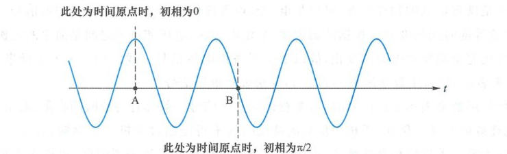

  <figcaption>图 2.1.1 时间原点与初相（原书影印参考）</figcaption>
</figure>

将任意信号 $v(t)$ 的时间变量从 $t$ 变成 $at$，就是将信号沿时间轴缩窄或拉伸，$a > 1$ 是缩窄，$0 < a < 1$ 是拉伸。正弦波在时间上拉伸或缩窄将会改变频率。例如，$\cos(20\pi t)$ 的频率为 $10\text{ Hz}$，将 $t$ 变成 $2t$ 得到 $\cos(40\pi t)$，其频率变成 $20\text{ Hz}$；将 $t$ 变成 $t/2$ 得到 $\cos(10\pi t)$，频率变成 $5\text{ Hz}$。时间轴无限拉宽时，$v(t) = A\cos\left(\frac{2\pi t}{T_0}\right)$ 的波形被无限拉宽，其极限为：

$$
\lim_{T_0 \to \infty} \left\{ A\cos\left(\frac{2\pi t}{T_0}\right) \right\} = A, \quad -\infty < t < \infty
$$

上式右边是与时间 $t$ 无关的直流电压。因此，可以把直流信号看成是频率为零的正弦波。

将任意信号 $v(t)$ 的时间变量从 $t$ 变成 $-t$，则时间轴镜像反转，时间倒流。此时 $A\cos(2\pi f_0 t + \theta)$ 变成 $A\cos(-2\pi f_0 t + \theta) = A\cos(2\pi f_0 t - \theta)$，说明时间反转后，幅度与频率不变，相位反极性。

#### (3) 受调制的正弦波

若正弦波中的 $A$ 或 $\theta$ 随 $t$ 变化，如图 2.1.2 所示，则称其为受调制的正弦波，表达式为：

$$
v(t) = A(t)\cos[2\pi f_0 t + \theta(t)]
$$

<figure class="vp-figure">

  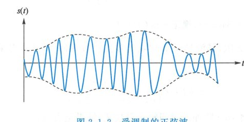

  <figcaption>图 2.1.2 受调制的正弦波（原书影印参考）</figcaption>
</figure>

无线通信的发射信号一般都是受调制的正弦波，信息携带在 $A(t)$ 或 $\theta(t)$ 中。频率是角度的一阶导除以 $2\pi$，频率的变化可以包含在相位的变化中，因此只需引入 $A, \theta$ 随 $t$ 的变化，不需要专门再引入频率随时间的变化。

#### (4) 矩形脉冲

脉冲一般指全部或大部分能量聚集在较短时间内的信号。图 2.1.3 是几种常见脉冲的波形示例。

<figure class="vp-figure">

  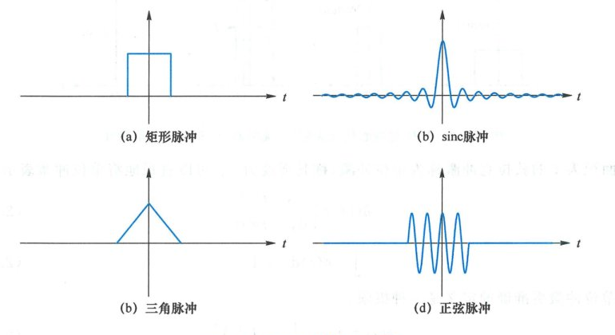

  <figcaption>图 2.1.3 常见脉冲的波形示例（原书影印参考）</figcaption>
</figure>

图 2.1.3(a) 是矩形脉冲。宽度为 $T$、高度为 $A$、中心在原点的矩形脉冲可以表示为：

$$
A \cdot \operatorname{rect}\left(\frac{t}{T}\right) = \begin{cases} A, & |t| \leqslant \frac{T}{2} \\ 0, & \text{其他 } t \end{cases}
$$

其中：

$$
\operatorname{rect}(x) = \begin{cases} 1, & |x| < 1/2 \\ 0, & \text{其他 } x \end{cases}
$$

将矩形脉冲沿时间无限拉宽就是直流：

$$
\lim_{T \to \infty} \left\{ A \cdot \operatorname{rect}\left(\frac{t}{T}\right) \right\} = A
$$

#### (5) sinc 脉冲

图 2.1.3(b) 称为 sinc 脉冲，其数学表达式为：

$$
v(t) = A \cdot \operatorname{sinc}\left(\frac{t}{T}\right)
$$

其中 $\operatorname{sinc}(x) = \frac{\sin(\pi x)}{\pi x} = \operatorname{Sa}(\pi x)$，规定 $\operatorname{sinc}(0) = 1$。

sinc 脉冲持续时间无限，其波形有等间隔的零点。按间隔 $T$ 对波形采样，结果只有一处不为零：

$$
v(kT) = \begin{cases} A, & k = 0 \\ 0, & k = \pm 1, \pm 2, \dots \end{cases}
$$

与矩形脉冲一样，将 sinc 脉冲沿时间轴无限拉宽，结果也是直流：

$$
\lim_{T \to \infty} \left\{ A \cdot \operatorname{sinc}\left(\frac{t}{T}\right) \right\} = A
$$

#### (6) 狄拉克冲激

狄拉克冲激脉冲 $\delta(t)$ 表示非常窄、非常高的窄脉冲。在图 2.1.4 中，保持矩形脉冲的面积为 1，脉冲不断变窄时，其高度不断变高，最终的极限就是狄拉克冲激。

<figure class="vp-figure">

  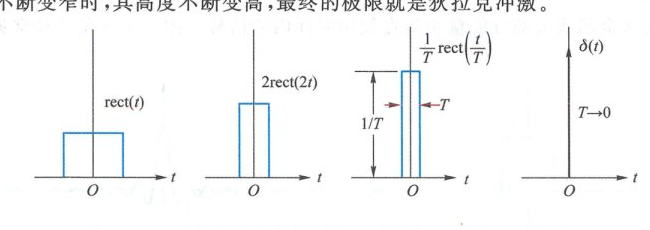

  <figcaption>图 2.1.4 狄拉克冲激代表无限窄、无限高、面积为 1 的窄脉冲（原书影印参考）</figcaption>
</figure>

面积为 1 的狄拉克冲激称为单位冲激，称其强度为 1。可以直观地将单位冲激表示为：

$$
\delta(t) = \begin{cases} \infty, & t = 0 \\ 0, & t \neq 0 \end{cases}
$$

$$
\int_{-\infty}^{\infty} \delta(t)\,\mathrm{d}t = 1
$$

单位冲激更准确的定义是一种极限：

$$
\delta(t) \triangleq \lim_{T \to 0^+} \left\{ \frac{1}{T} \cdot g\left(\frac{t}{T}\right) \right\}
$$

其中 $g(t)$ 是面积为 1、在 $t=0$ 处连续且 $g(0) > 0$ 的任意脉冲。上式中，当 $T$ 从大变小时，$\frac{1}{T}g\left(\frac{t}{T}\right)$ 的脉冲变窄、变高。这个定义可以理解为：$\delta(t)$ 是一个记号，指代的是极限。所有出现 $\delta(t)$ 的地方可以认为是记号替换：把 $\lim_{T \to 0^+} \left\{ \frac{1}{T} \cdot g\left(\frac{t}{T}\right) \right\}$ 替换成了 $\delta(t)$。

将极限表达式中的 $t$ 换成 $-t$ 后，极限不变。因此冲激函数是偶函数：$\delta(t) = \delta(-t)$。

单位冲激 $\delta(t)$ 乘以常数 $a$，则 $a \cdot \delta(t)$ 的强度是 $a$。注意冲激的强度不是其在冲激位置处的函数高度（高度是无穷大），而是函数的面积。

冲激函数最重要的特性是其采样性，写成公式就是：

$$
x(t)\delta(t - t_0) = x(t_0)\delta(t - t_0)
$$

$$
\int_{-\infty}^{\infty} x(t)\delta(t - t_0)\,\mathrm{d}t = x(t_0)
$$

即任意信号 $x(t)$ 与位于 $t_0$ 时刻的单位冲激相乘后，结果是一个强度为 $x(t_0)$、仍然位于 $t_0$ 时刻的冲激。进一步积分，结果是 $x(t)$ 在 $t_0$ 时刻的采样值 $x(t_0)$。信号 $x(t)$ 只有在 $t = t_0$ 时刻的值影响结果，其他所有 $t \neq t_0$ 处无论 $x(t)$ 的取值是什么，都不影响乘法器及积分器的结果，这就是冲激函数的采样性。

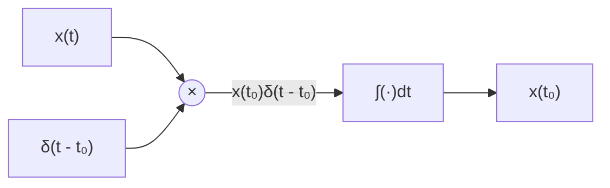

将 $x(t)$ 换成冲激也能成立，即若 $x(t) = \delta(t - \tau)$，则有：

$$
\delta(t - \tau)\delta(t - t_0) = \delta(t_0 - \tau)\delta(t - t_0)
$$

#### (7) 周期信号

若存在 $T > 0$ 使得：

$$
s(t) = s(t + T), \quad -\infty < t < \infty
$$

则称 $s(t)$ 是周期为 $T$ 的周期信号。

若 $s(t) = s(t+T)$，则 $s(t+T) = s(t+2T)$，因而 $s(t) = s(t+2T)$，说明若 $T$ 是周期信号 $s(t)$ 的周期，则 $2T, 3T, \dots$ 都是 $s(t)$ 的周期。所有周期中的最小周期叫基本周期。一般所称的周期默认指最小周期。例如，对于频率为 $50\text{ Hz}$ 的正弦波 $\cos(100\pi t + \theta)$，$20\text{ ms}, 40\text{ ms}, 60\text{ ms}$ 等都是其周期，基本周期是 $20\text{ ms}$。一般称 $50\text{ Hz}$ 正弦波的周期为 $20\text{ ms}$。

直流信号是一种特殊的周期信号。若按定义，直流信号的最小周期似乎应该是 0。但考虑到“周期性”这个词反映的是变化，而直流永远不变，因此一般把直流信号看成是频率为零的正弦波，其周期是无穷大。

用任意脉冲 $g(t)$ 可以构造出如下周期信号：

$$
s(t) = \sum_{n=-\infty}^{\infty} g(t - nT)
$$

上式明显满足 $s(t) = s(t+T)$。图 2.1.6 中示出了用 $g(t) = A \cdot \operatorname{rect}\left(\frac{2t}{T}\right)$ 形成的周期方波以及用 $g(t) = \delta(t)$ 形成的周期冲激序列。

<figure class="vp-figure">

  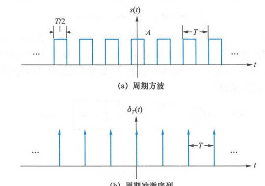

  <figcaption>图 2.1.6 周期信号示例（原书影印参考）</figcaption>
</figure>

周期脉冲展开中 $s(t)$ 的最小周期一般等于 $T$，但在一些特殊情况下，右边的级数可能会收敛到常数。例如在图 2.1.7 中，$g(t)$ 是梯形脉冲，其底宽为 4，顶宽为 1，高度为 1。当 $T = 2.5$ 时，$g(t)$ 左右搬移后叠成一条直线。此时 $s(t) = 1, -\infty < t < \infty$。

<figure class="vp-figure">

  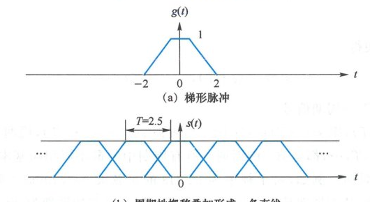

  <figcaption>图 2.1.7 脉冲左右搬移叠加（原书影印参考）</figcaption>
</figure>

用任意脉冲 $g(t)$ 可以构造周期信号。反之，一切周期信号都可以表示为脉冲周期延拓的形式。设 $s(t)$ 是周期为 $T$ 的周期信号，取 $g(t)$ 为 $s(t)$ 在区间 $[-T/2, T/2]$ 内的截短部分，就可以将 $s(t)$ 表示为脉冲搬移求和形式。

---

## 2.1.2 能量与功率

### 1. 信号的功率与能量

直流电压 $A$ 在 $R$ 欧姆电阻上的功率是 $P = A^2/R$。功率是单位时间内的能量。电压 $A$ 在持续时间 $T$ 内所产生的能量是 $E = PT = A^2 T / R$。电阻值的具体大小不影响通信的原理。因此，为了简化公式记号，可取 $R = 1\,\Omega$。此时，功率等于电压的平方，$P = A^2$，能量则为 $E = A^2 T$。

考虑持续时间限制在区间 $[-T/2, T/2]$ 内的信号 $v(t)$。在任意时刻 $t$，$v(t)$ 是电压，其平方 $v^2(t)$ 是功率，称为 $v(t)$ 在时刻 $t$ 的**瞬时功率**。对于充分小的区间 $[t, t+\Delta]$，$v(t)$ 在该区间内近似不变（实际信号的连续性），该区间内的信号能量是 $v^2(t)\Delta$。$v(t)$ 在时间区间 $[-T/2, T/2]$ 内的总能量（简称能量）为：

$$
E_T = \int_{-T/2}^{T/2} v^2(t)\,\mathrm{d}t
$$

按时间区间 $[-T/2, T/2]$ 计算的平均功率（简称功率）为：

$$
P_T = \frac{E_T}{T} = \frac{1}{T}\int_{-T/2}^{T/2} v^2(t)\,\mathrm{d}t
$$

直观来说，信号的能量是其瞬时功率 $v^2(t)$ 的积分（面积），信号的功率是瞬时功率 $v^2(t)$ 的时间平均（平均高度）。时间平均是本课常用的概念，图 2.1.8 直观示出了函数 $x(t)$ 的时间平均。以下用记号 $\overline{x(t)}$ 表示函数 $x(t)$ 的时间平均。

<figure class="vp-figure">

  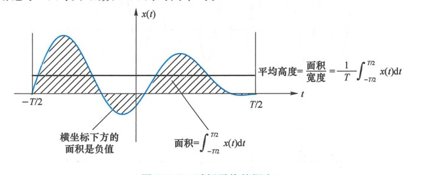

  <figcaption>图 2.1.8 时间平均的概念（原书影印参考）</figcaption>
</figure>

信号的持续时间无穷时，取极限 $T \to \infty$ 得到：

$$
E_v = \lim_{T \to \infty} \int_{-T/2}^{T/2} v^2(t)\,\mathrm{d}t = \int_{-\infty}^{\infty} v^2(t)\,\mathrm{d}t
$$

$$
P_v = \lim_{T \to \infty} \left\{ \frac{1}{T}\int_{-T/2}^{T/2} v^2(t)\,\mathrm{d}t \right\} = \overline{v^2(t)}
$$

<Knowledge title="能量信号与功率信号的互斥分类">

以上两个极限不可能同时成为非零有限值，即当信号的持续时间 $T \to \infty$ 时，能量和功率二者中必有一个无意义：

- **能量信号**：若无穷时间内的能量有限（$0 < E_v < \infty$），则按无穷时间计算的平均功率是零（$P_v = 0$）。一般将能量非零有限的信号称为能量信号；
- **功率信号**：若无穷时间内的平均功率非零有限（$0 < P_v < \infty$），则总能量为无穷（$E_v = \infty$）。将功率非零有限的信号称为功率信号。

</Knowledge>

<Example title="例 2.1.1">

矩形脉冲 $g(t) = A \cdot \operatorname{rect}\left(\frac{t}{\tau}\right)$ 的能量计算。

</Example>

<Solution title="解">

$$
E_g = \int_{-\infty}^{\infty} g^2(t)\,\mathrm{d}t = \int_{-\tau/2}^{\tau/2} A^2\,\mathrm{d}t = A^2 \tau
$$

</Solution>

<Example title="例 2.1.2">

信号 $s(t) = \operatorname{rect}\left(\frac{t}{T}\right) \cdot A\cos(2\pi f_0 t + \theta)$ 是幅度为 1 的矩形脉冲与幅度为 $A$ 的正弦波相乘，也就是将正弦波截短于区间 $[-T/2, T/2]$ 内，如图 2.1.9 所示。求截短信号的能量。

</Example>

<figure class="vp-figure">

  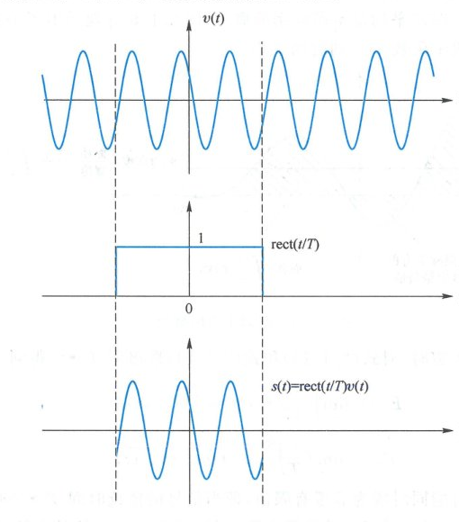

  <figcaption>图 2.1.9 正弦波的截短（原书影印参考）</figcaption>
</figure>

<Solution title="解">

截短信号的能量为：

$$
\begin{aligned}
E_s &= \int_{-\infty}^{\infty} s^2(t)\,\mathrm{d}t = \int_{-T/2}^{T/2} A^2 \cos^2(2\pi f_0 t + \theta)\,\mathrm{d}t \\
&= A^2 \int_{-T/2}^{T/2} \left[ \frac{1}{2} + \frac{\cos(4\pi f_0 t + 2\theta)}{2} \right]\mathrm{d}t \\
&= \frac{A^2}{2} \left\{ T + \frac{1}{4\pi f_0} [\sin(2\pi f_0 T + 2\theta) - \sin(-2\pi f_0 T + 2\theta)] \right\} \\
&= \frac{A^2 T}{2}\left\{ 1 + \frac{1}{2\pi f_0 T} \sin(2\pi f_0 T)\cos(2\theta) \right\} \\
&= \frac{A^2 T}{2} [1 + \cos(2\theta)\operatorname{sinc}(2f_0 T)]
\end{aligned}
$$

若 $2f_0 T$ 为整数，则 $\operatorname{sinc}(2f_0 T) = 0$，$s(t)$ 的能量为 $A^2 T/2$。若 $2f_0 T$ 虽不是整数，但远大于 1，则 $\operatorname{sinc}(2f_0 T)$ 远小于 1，此时截短信号的能量近似是 $A^2 T/2$。直观来说，正弦波的功率是 $A^2/2$，其在时间窗口 $[-T/2, T/2]$ 内的能量是 $A^2 T/2$。

</Solution>

<Example title="例 2.1.3">

求图 2.1.6 中周期方波的平均功率。

</Example>

<Solution title="解">

周期信号 $s(t)$ 的瞬时功率 $s^2(t)$ 也是周期函数。周期函数在不同周期内相同，其在无限时间内的平均高度等于每个周期内的平均高等，故时间平均可按一个周期来计算。因此，$s(t)$ 的平均功率为：

$$
\overline{s^2(t)} = \frac{1}{T}\int_{-T/2}^{T/2} \left[ A \cdot \operatorname{rect}\left(\frac{2t}{T}\right) \right]^2 \mathrm{d}t = \frac{A^2}{2}
$$

图 2.1.6 中的周期方波是将直流 $A$ 关断了一半时间。直流 $A$ 的平均功率是 $A^2$，一半时间切断，平均功率从 $A^2$ 减为 $A^2/2$。

</Solution>

### 2. 能量与功率的性质

信号的能量有以下性质：

1. **非负性**：$E_v = \int_{-\infty}^{\infty} v^2(t)\,\mathrm{d}t \geqslant 0$；
2. **平方比例性**：若 $v(t)$ 的能量为 $E_v$，$a$ 是确定实数，则 $u(t) = a \cdot v(t)$ 的能量是 $E_u = a^2 E_v$。因为 $\int_{-\infty}^{\infty} [a \cdot v(t)]^2\,\mathrm{d}t = a^2 \int_{-\infty}^{\infty} v^2(t)\,\mathrm{d}t$；
3. **延迟不改变能量**：$v(t)$ 与 $v(t - t_0)$ 能量相同。因为 $\int_{-\infty}^{\infty} v^2(t - t_0)\,\mathrm{d}t = \int_{-\infty}^{\infty} v^2(t)\,\mathrm{d}t$；
4. **时间镜像不改变能量**：$v(t)$ 与 $v(-t)$ 能量相同。因为 $\int_{-\infty}^{\infty} v^2(-t)\,\mathrm{d}t = \int_{-\infty}^{\infty} v^2(t)\,\mathrm{d}t$；
5. **能量不满足叠加性**：若 $u(t), v(t)$ 的能量分别是 $E_u$ 和 $E_v$，则 $x(t) = u(t) + v(t)$ 的能量 $E_x$ 不一定等于 $E_u + E_v$。因为：

$$
\begin{aligned}
E_x &= \int_{-\infty}^{\infty} [u(t) + v(t)]^2\,\mathrm{d}t = \int_{-\infty}^{\infty} [u^2(t) + 2u(t)v(t) + v^2(t)]\,\mathrm{d}t \\
&= E_u + E_v + 2\int_{-\infty}^{\infty} u(t)v(t)\,\mathrm{d}t
\end{aligned}
$$

对于任意信号 $u(t), v(t)$，上式中的最后一个积分项未必是零。

平均功率是总能量除以总时间。故此，能量的性质对功率也存在。设 $s(t)$ 的功率为 $P_s$，则 $P_s \geqslant 0$；$a s(t)$ 的功率是 $a^2 P_s$；$s(t - t_0)$、$s(-t)$ 与 $s(t)$ 的功率相同。另外，$u(t) + v(t)$ 的功率不一定等于 $u(t), v(t)$ 各自功率之和。

### 3. 分贝

工程中常用分贝（deci-Bel, dB）表示两个功率的相对大小。分贝如同分米，十分米是一米，十分贝是一贝。一贝指两个数 $a, b$ 的比值为 $a/b = 10$。若比值 $a/b = 10^x$ 就是 $x$ 贝，$10x$ 分贝。“贝”来自人名贝尔（Bell）。将功率比值换算为分贝的公式为：

$$
\left[ \frac{P_1}{P_2} \right]_{\text{dB}} = 10\lg\frac{P_1}{P_2}
$$

将信号功率与单位功率 $1\text{ W}, 1\text{ mW}$ 的比值转换为分贝，称为分贝瓦及分贝毫瓦，记为 $\text{dBW}, \text{dBm}$。

分贝的对数特性使其便于描述很大的变化范围。比如功率值从 $100\text{ W}$ 降到 $0.01\text{ mW}$，相差 $10\,000\,000$ 倍。折成分贝后是从 $20\text{ dBW} = 50\text{ dBm}$ 降到 $-20\text{ dBm}$，下降 $70\text{ dB}$。

由于 $10\lg 2 \approx 3.0103 \approx 3$，工程中习惯将 2 倍等同于相差 $3\text{ dB}$。

<Example title="例 2.1.4">

无线通信系统的发射机输出功率为 $47\text{ dBm}$，输出信号通过一个增益为 $18\text{ dB}$ 的天线向外辐射，电磁波在空间传输中衰减了 $113\text{ dB}$，接收天线的增益为 $2\text{ dB}$，接收天线输出的信号通过一个增益为 $46\text{ dB}$ 的放大器，求放大器输出信号功率。

</Example>

<Solution title="解">

功率变化在对数域表现为简单的加减：

$$
47 + 18 - 113 + 2 + 46 = 0\text{ dBm}
$$

与分贝值对应的原值称为线性值。按线性值，本例中发射机输出功率是 $50\text{ W}$，接收端放大器输出功率是 $1\text{ mW}$。

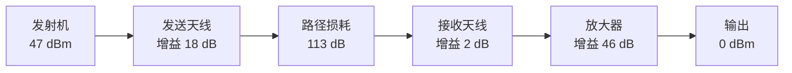

</Solution>

---

## 2.1.3 复信号

### 1. 复信号定义

复数是实数的扩展，复信号是实信号的扩展。

复数 $z$ 由两个实数构成：$z = a + \mathrm{j}b = A\mathrm{e}^{\mathrm{j}\varphi}$，其中 $a = \operatorname{Re}\{z\}, b = \operatorname{Im}\{z\}$ 分别是 $z$ 的实部和虚部，$A = |z|, \varphi = \angle z$ 分别是 $z$ 的幅度与角度。复数可以表示二维平面上的点。$z = a + \mathrm{j}b$ 是直角坐标表示，$z = A\mathrm{e}^{\mathrm{j}\varphi}$ 是极坐标表示。

与此类似，复信号 $z(t)$ 由两个实信号构成：

$$
z(t) = a(t) + \mathrm{j}b(t) = A(t)\mathrm{e}^{\mathrm{j}\varphi(t)}
$$

其中：

$$
a(t) = \operatorname{Re}\{z(t)\} = \frac{z(t) + z^*(t)}{2} = A(t)\cos[\varphi(t)]
$$

$$
b(t) = \operatorname{Im}\{z(t)\} = \frac{z(t) - z^*(t)}{2\mathrm{j}} = A(t)\sin[\varphi(t)]
$$

$$
A(t) = |z(t)| = \sqrt{a^2(t) + b^2(t)}
$$

$$
\varphi(t) = \arctan\frac{b(t)}{a(t)}
$$

图 2.1.11 给出了上述关系的几何表示。$z(t)$ 代表点 $z$ 在二维平面上的运动，其实部 $a(t)$、虚部 $b(t)$ 分别是 $z(t)$ 在横轴和纵轴上的投影，$A(t)$ 是 $z(t)$ 离原点的距离，$\varphi(t)$ 是 $z(t)$ 所在位置的方向。

若在图 2.1.11 中的横轴位置放一面以纵轴为法线的镜子，则 $z(t)$ 在镜中的影子就是其共轭 $z^*(t)$。$z(t)$ 与 $z^*(t)$ 合成为水平方向的 $z(t) + z^*(t) = 2a(t)$，其差 $z(t) - z^*(t)$ 则是垂直方向的 $2\mathrm{j} \cdot b(t)$。

<figure class="vp-figure">

  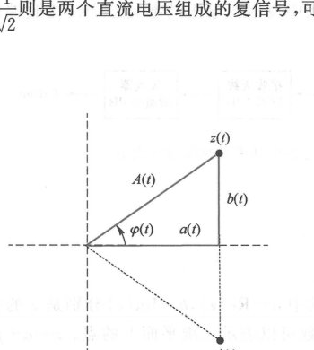

  <figcaption>图 2.1.11 复信号的几何表示（原书影印参考）</figcaption>
</figure>

### 2. 复单频信号

称 $z(t) = A \cdot \mathrm{e}^{\mathrm{j}(2\pi f_0 t + \varphi)}$ 为复正弦（complex sinusoid）信号或复单频信号。若 $A = 1$，则 $z(t)$ 表示单位圆上的匀速运动，如图 2.1.12 所示，其中 $\varphi = 0$。此时，点 $z$ 在单位时间内经过的弧长等于扫过的角度，即 $z$ 运动的线速度就是角速度，记为 $\omega_0$，常称为角频率，单位是 $\text{rad/s}$。$z$ 的转速 $f_0 = \frac{\omega_0}{2\pi}$ 称为频率，单位为 $\text{c/s}$，其中 $\text{c}$ 代表 circle。为了纪念科学家赫兹（Hertz），频率的单位记为 $\text{Hz}$。

<figure class="vp-figure">

  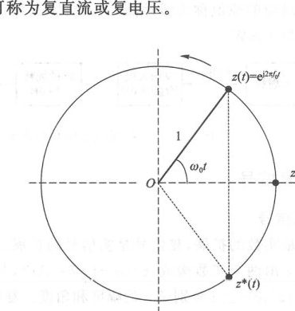

  <figcaption>图 2.1.12 复单频信号（原书影印参考）</figcaption>
</figure>

图 2.1.12 中，$z$ 正转（逆时针）对应正频率（$f_0 > 0$），反转对应负频率（$f_0 < 0$），静止不动对应直流（$f_0 = 0$）。例如，$\mathrm{e}^{\mathrm{j}100\pi t}$ 是正转，频率为 $50\text{ Hz}$；$\mathrm{e}^{-\mathrm{j}100\pi t}$ 是反转，频率为 $-50\text{ Hz}$。而 $\mathrm{e}^{\mathrm{j}\frac{\pi}{4}} = \frac{1}{\sqrt{2}} + \mathrm{j}\frac{1}{\sqrt{2}}$ 则是两个直流电压组成的复信号，可称为复直流或复电压。

对 $z(t)$ 取共轭将使频率反极性。若在图 2.1.12 的横轴位置放一面以纵轴为法线的镜子，则当 $z(t)$ 正转时，镜中的影子 $z^*(t)$ 在反转。时间倒流，即 $z(t)$ 变 $z(-t)$，也将使频率反极性。例如，$(3+4\mathrm{j})\mathrm{e}^{\mathrm{j}20\pi t}$ 的频率为 $10\text{ Hz}$，其共轭 $(3-4\mathrm{j})\mathrm{e}^{-\mathrm{j}20\pi t}$、时间反转 $(3+4\mathrm{j})\mathrm{e}^{-\mathrm{j}20\pi t}$ 的频率都是 $-10\text{ Hz}$。

频率为 $f_0$ 的实单频信号 $\cos(2\pi f_0 t + \varphi)$ 可以分解为频率一正一负的两个复单频信号之和：

$$
\cos(2\pi f_0 t + \varphi) = \frac{1}{2}\mathrm{e}^{\mathrm{j}(2\pi f_0 t + \varphi)} + \frac{1}{2}\mathrm{e}^{-\mathrm{j}(2\pi f_0 t + \varphi)}
$$

实信号本无正负频率的概念，扩展到复信号后，频率便有了正负之分。通过示波器能看见的是实信号，都包含正频率和负频率，缺任何一个都不可能成为实信号。

实信号天然具有一正一负两个对称的频率成分，因此工程中提及实信号的频率时，只需要说不带极性的频率值，不需要特意点出负频率。例如，“交流电频率是 $50\text{ Hz}$”，“Wi-Fi 工作在 $5\text{ GHz}$ 频段”等。

### 3. 复信号的意义

复信号常用来表示与正弦波有密切关系的实信号。例如，电路课程中常用的相量法就是用复数 $A \cdot \mathrm{e}^{\mathrm{j}\theta}$ 来表示正弦波 $A \cdot \cos(2\pi f_0 t + \theta)$。将这一方法加以扩展，让 $A$ 和 $\theta$ 随时间变化，则复信号 $A(t)\mathrm{e}^{\mathrm{j}\theta(t)}$ 可以表示受调制的正弦波 $v(t) = A(t) \cdot \cos[2\pi f_0 t + \theta(t)]$。引入复信号是为了分析处理方便。

### 4. 复信号的能量与功率

复信号由实部和虚部两个实信号组成，复信号的功率或能量就是这两个实信号的功率或能量之和。因此，任意复信号 $z(t) = a(t) + \mathrm{j} \cdot b(t)$ 的瞬时功率是 $a^2(t) + b^2(t) = |z(t)|^2$。注意，实信号的瞬时功率是信号的平方，复信号的瞬时功率是信号的模平方。除了这一差别外，其他相同或类似：复信号的能量是瞬时功率 $|z(t)|^2$ 的积分，平均功率是瞬时功率 $|z(t)|^2$ 的时间平均。按无穷时间范围，复信号 $z(t)$ 的能量及功率分别为：

$$
E_z = \int_{-\infty}^{\infty} |z(t)|^2\,\mathrm{d}t
$$

$$
P_z = \lim_{T \to \infty} \left\{ \frac{1}{T}\int_{-T/2}^{T/2} |z(t)|^2\,\mathrm{d}t \right\} = \overline{|z(t)|^2}
$$

以上两个中只有一个有意义，使得复信号也能分为能量信号及功率信号。

复信号能量或功率的性质与实信号基本类似：
1. **非负性**：$E_z \geqslant 0, P_z \geqslant 0$；
2. **相位/共轭/时移/镜像不变性**：$z(t)$ 与其相移 $z(t)\mathrm{e}^{\mathrm{j}\theta}$、共轭 $z^*(t)$、时间镜像 $z(-t)$、延迟 $z(t - t_0)$ 有相同的能量或功率；
3. **模平方比例性**：设 $K$ 是任意复系数，则 $K z(t)$ 的能量或功率是 $z(t)$ 的能量或功率的 $|K|^2$ 倍；
4. **不满足叠加性**：和的能量或功率不一定等于各自能量或功率之和。

---

## 2.1.4 内积

### 1. 内积定义

设 $x(t), y(t)$ 是两个能量信号，能量分别是 $E_x, E_y$。考虑到实信号是复信号的特例，故为了一般性，假设 $x(t), y(t)$ 是复信号。复信号 $x(t), y(t)$ 的内积定义为：

$$
\langle x, y \rangle = \int_{-\infty}^{\infty} x(t)y^*(t)\,\mathrm{d}t
$$

由定义可以看出，$x(t), y(t)$ 交换顺序对应内积取共轭：

$$
\int_{-\infty}^{\infty} y(t)x^*(t)\,\mathrm{d}t = \left[ \int_{-\infty}^{\infty} x(t)y^*(t)\,\mathrm{d}t \right]^*
$$

实信号是复信号的特例。若 $x(t), y(t)$ 是实信号，内积变成：

$$
\langle x, y \rangle = \int_{-\infty}^{\infty} x(t)y(t)\,\mathrm{d}t
$$

两个实信号的内积在交换次序后不变。

### 2. 内积与能量

内积中代入 $y(t) = x(t)$，得到 $x(t)$ 的能量 $\int_{-\infty}^{\infty} |x(t)|^2\,\mathrm{d}t$，即能量是信号与其自身的内积。仿照这一点，可以把信号 $x(t)$ 与 $y(t)$ 的内积称为**互能量**：

$$
E_{xy} = \int_{-\infty}^{\infty} x(t)y^*(t)\,\mathrm{d}t
$$

当 $x(t) = y(t)$ 时，互能量 $E_{xy}$ 变成能量 $E_x$。相对于互能量这个词，也可称信号 $x(t)$ 的能量 $E_x$ 为**自能量**。

两个信号之和的能量之所以不等于各自自能量之和，是因为有互能量：

$$
\begin{aligned}
\int_{-\infty}^{\infty} |x(t) + y(t)|^2\,\mathrm{d}t &= \int_{-\infty}^{\infty} [|x(t)|^2 + x(t)y^*(t) + y(t)x^*(t) + |y(t)|^2]\,\mathrm{d}t \\
&= E_x + E_{xy} + E_{yx} + E_y
\end{aligned}
$$

注意，自能量一定是正能量，至少是 0，不可能有负能量，而互能量可正可负，还可以是复数。互能量反映两个信号叠加后额外的能量消长。例如 $x(t) + [-x(t)] = 0$，能量完全抵消，互能量为负。$x(t) + x(t) = 2x(t)$ 的能量是 $4E_x$，比 $E_x + E_x$ 多出 $2E_x$，多出的这部分是正的互能量。

<Example title="例 2.1.5">

求图 2.1.13 中信号 $x(t), y(t)$ 的内积，并求 $x(t) + y(t)$ 的能量。

</Example>

<figure class="vp-figure">

  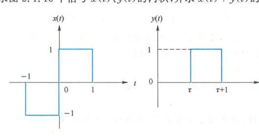

  <figcaption>图 2.1.13 x(t) 与 y(t) 的波形（原书影印参考）</figcaption>
</figure>

<Solution title="解">

$x(t)$ 与 $y(t)$ 都是实信号，其内积为：

$$
E_{xy} = \int_{-\infty}^{\infty} x(t)y(t)\,\mathrm{d}t = \int_{\tau}^{\tau+1} x(t)\,\mathrm{d}t
$$

其结果是 $x(t)$ 在时间窗口 $[\tau, \tau+1]$ 内的面积。窗口位置不同则积分值不同，结果是 $\tau$ 的函数，如图 2.1.14(a) 所示。

$x(t)$ 的能量是 $E_x = \int_{-\infty}^{\infty} x^2(t)\,\mathrm{d}t = 2$，$y(t)$ 的能量是 $E_y = \int_{-\infty}^{\infty} y^2(t)\,\mathrm{d}t = 1$，代入得 $x(t) + y(t)$ 的能量为：

$$
E_{x+y} = E_x + E_y + 2E_{xy} = 3 + 2E_{xy}
$$

结果示于图 2.1.14(b)。$\tau$ 不同时，$x(t)$ 与 $y(t)$ 的互能量不同，导致 $x(t) + y(t)$ 的能量在 $E_x + E_y = 3$ 周围变化。$\tau = -1$ 时，$y(t)$ 与 $x(t)$ 在区间 $[-1, 0]$ 内完全抵消，$x(t) + y(t)$ 的能量是 1。$\tau = 0$ 时，$x(t)$ 在区间 $[-1, 0]$ 内不变，能量是 1；在区间 $[0, 1]$ 内幅度变成 2，能量变成 4，$x(t) + y(t)$ 的能量是 5。

<figure class="vp-figure">

  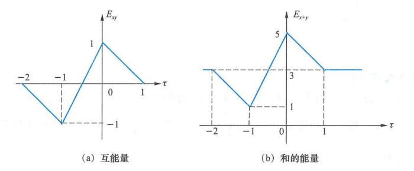

  <figcaption>图 2.1.14 不同 τ 值下的互能量与信号之和的能量（原书影印参考）</figcaption>
</figure>

</Solution>

### 3. 正交

若 $x(t)$ 与 $y(t)$ 的内积为零，则称 $x(t)$ 与 $y(t)$ 正交。两个信号正交时，互能量为零，故正交信号之和的能量等于各自自能量之和。例如在图 2.1.13 中，当 $\tau = -1/2$ 时，$y(t) = \operatorname{rect}(t)$ 与 $x(t)$ 正交。此时 $E_{xy} = 0, E_{x+y} = E_x + E_y = 3$。

若 $y(t)$ 与 $x(t)$ 不正交，说明 $y(t)$ 以线性的方式包含了一部分 $x(t)$，即 $y(t)$ 可以分解为：

$$
y(t) = a \cdot x(t) + z(t)
$$

上式右边的 $x(t)$ 与 $z(t)$ 正交。两边对 $x(t)$ 做内积得到 $y(t)$ 与 $x(t)$ 的互能量为 $E_{yx} = a E_x$，故此式中的系数为 $a = E_{yx}/E_x$。若 $z(t)$ 的能量是 $E_z$，则 $y(t)$ 的能量 $E_y = |a|^2 E_x + E_z$。图 2.1.15 示出了这种信号分解关系。基于图中的几何表示，内积也可以称为投影。

<figure class="vp-figure">

  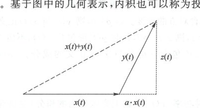

  <figcaption>图 2.1.15 y(t) 分解为两个正交信号之和（原书影印参考）</figcaption>
</figure>

<Example title="例 2.1.6">

设 $x(t), y(t)$ 如图 2.1.16 所示。将 $y(t)$ 分解为两个正交信号之和：$y(t) = a \cdot x(t) + z(t)$。

</Example>

<figure class="vp-figure">

  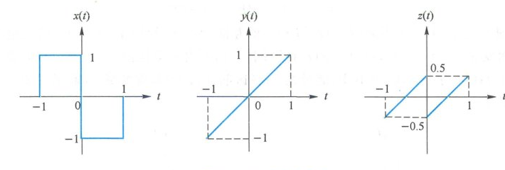

  <figcaption>图 2.1.16 正交分解（原书影印参考）</figcaption>
</figure>

<Solution title="解">

由正交分解公式，$a = E_{yx}/E_x$。其中：

$$
E_{yx} = \int_{-\infty}^{\infty} y(t)x(t)\,\mathrm{d}t = -2\int_0^1 t\,\mathrm{d}t = -1
$$

$$
E_x = \int_{-\infty}^{\infty} x^2(t)\,\mathrm{d}t = 2
$$

因此 $a = -0.5$。对应的 $z(t)$ 为：

$$
z(t) = y(t) + \frac{1}{2}x(t) = \begin{cases} t + 0.5, & -1 < t \leqslant 0 \\ t - 0.5, & 0 < t \leqslant 1 \\ 0, & \text{其他 } t \end{cases}
$$

波形如图 2.1.16 右图所示。

</Solution>

### 4. 许瓦兹不等式

$x(t)$ 与 $y(t)$ 的互能量有多大，取决于 $x(t), y(t)$ 的关系以及它们自身的大小。在正交分解中代入 $a = E_{yx}/E_x$，则 $y(t)$ 的能量是 $E_y = \left|\frac{E_{yx}}{E_x}\right|^2 E_x + E_z = \frac{|E_{xy}|^2}{E_x} + E_z$。$z(t)$ 的能量 $E_z$ 非负，故 $E_y \geqslant \frac{|E_{xy}|^2}{E_x}$，即：

<Knowledge title="定理：许瓦兹不等式（Schwarz Inequality）">

对任意两个能量信号 $x(t)$ 与 $y(t)$，其互能量的模值最大不超过自能量的几何平均：

$$
|E_{xy}| \leqslant \sqrt{E_x E_y}
$$

等号成立的条件是 $E_z = 0$，即 $z(t) = 0$。此时 $y(t) = a \cdot x(t)$，说明互能量模值最大的条件是：两个波形的形状相同，大小相差一个常数系数。

</Knowledge>

将信号 $x(t)$ 除以 $\sqrt{E_x}$ 后，$x(t)/\sqrt{E_x}$ 的能量为 1，称 $x(t)/\sqrt{E_x}$ 为 $x(t)$ 的能量归一化信号。将两个信号 $x(t), y(t)$ 的能量归一化，然后求内积，结果称为这两个信号的**归一化相关系数**，简称**相关系数**：

$$
\rho \triangleq \int_{-\infty}^{\infty} \frac{x(t)}{\sqrt{E_x}} \cdot \frac{y^*(t)}{\sqrt{E_y}}\,\mathrm{d}t = \frac{E_{xy}}{\sqrt{E_x E_y}}
$$

根据许瓦兹不等式，归一化相关系数的模值最大是 1，即 $|\rho| \leqslant 1$。两个信号的相关系数反映彼此的相似程度或彼此包含对方的程度：
- 若 $\rho = 0$，则 $y(t)$ 与 $x(t)$ 正交，$y(t)$ 完全不包含 $x(t)$；
- 若相关系数达到最大值 $|\rho| = 1$，则 $z(t) = 0$，此时 $y(t)$ 纯包含 $x(t)$，不包含其他信号；
- 当 $0 < |\rho| < 1$ 时，$y(t)$ 包含一部分 $x(t)$，还包含一部分与 $x(t)$ 正交的成分。$|\rho|$ 越大，$y(t)$ 中 $x(t)$ 的含量越大。

### 5. 功率信号的内积

功率信号 $x(t)$ 的瞬时功率 $|x(t)|^2$ 在无穷区间内的积分（总能量）是无穷大。为了使问题有意义，将求积分变成了求时间平均，相应使能量演变为功率。

同理，两个功率信号 $x(t), y(t)$ 的互能量 $\int_{-\infty}^{\infty} x(t)y^*(t)\,\mathrm{d}t$ 也可能是无穷大，此时可将求积分改成求时间平均，从而使互能量演变成互功率。两个功率信号 $x(t), y(t)$ 的内积（互功率）定义为：

$$
P_{xy} = \overline{x(t)y^*(t)} = \lim_{T \to \infty} \left\{ \frac{1}{T}\int_{-T/2}^{T/2} x(t)y^*(t)\,\mathrm{d}t \right\}
$$

花括号中的积分是 $x(t), y(t)$ 在区间 $[-T/2, T/2]$ 内的互能量，互能量除以持续时间 $T$ 后变成互功率。根据许瓦兹不等式，互能量的模值小于等于自能量的几何平均，即对任意 $T$ 有：

$$
\left| \int_{-T/2}^{T/2} x(t)y^*(t)\,\mathrm{d}t \right| \leqslant \sqrt{\int_{-T/2}^{T/2} |x(t)|^2\,\mathrm{d}t \cdot \int_{-T/2}^{T/2} |y(t)|^2\,\mathrm{d}t}
$$

两边同时除以持续时间 $T$，并令 $T \to \infty$，则上式左边除以 $T$ 后的极限是 $P_{xy}$，右边根号中的两项除以 $T$ 后的极限分别是自功率 $P_x, P_y$。由此得到功率信号的许瓦兹不等式：

$$
|P_{xy}| \leqslant \sqrt{P_x P_y}
$$

即互功率的模值最大不超过自功率的几何平均。
