import Knowledge from '@/components/Knowledge.astro';
import Example from '@/components/Example.astro';
import Solution from '@/components/Solution.astro';

信号频谱是在频域上描述信号在不同频率上的幅度及相位分布情况。通过傅里叶级数或傅里叶变换可以将信号从时域变换到频域。

## 2.2.1 傅里叶级数

若 $x(t)$ 是周期为 $T$ 的周期信号，或者是定义在 $[-T/2, T/2]$ 上的信号，则 $x(t)$ 可以展开为傅里叶级数：

$$
x(t) = \sum_{n=-\infty}^{\infty} x_n \mathrm{e}^{\mathrm{j}2\pi f_n t}, \quad -\frac{T}{2} < t < \frac{T}{2}
$$

其中 $f_n = n/T$，系数 $x_n = A_n \mathrm{e}^{\mathrm{j}\varphi_n}$ 由下式给定：

$$
x_n = \frac{1}{T}\int_{-T/2}^{T/2} x(t)\mathrm{e}^{-\mathrm{j}2\pi f_n t}\,\mathrm{d}t
$$

这说明信号 $x(t)$ 由大量复单频信号组成，不同的 $x(t)$ 有不同的频谱 $\{x_n\}$，每个 $x_n$ 是 $x(t)$ 中各频率分量的复振幅。

<Example title="例 2.2.1">

按区间 $[-T/2, T/2]$ 将 $\delta(t)$ 展开为傅里叶级数。

</Example>

<Solution title="解">

将 $x(t) = \delta(t)$ 代入傅里叶级数系数公式，利用冲激函数的采样性：

$$
x_n = \frac{1}{T}\int_{-T/2}^{T/2} \delta(t)\mathrm{e}^{-\mathrm{j}2\pi f_n t}\,\mathrm{d}t = \frac{1}{T}, \quad n = 0, \pm 1, \pm 2, \dots
$$

因此：

$$
\delta(t) = \frac{1}{T}\sum_{n=-\infty}^{\infty} \mathrm{e}^{\mathrm{j}2\pi f_n t}, \quad -\frac{T}{2} < t < \frac{T}{2}
$$

狄拉克冲激的频谱中各频率分量的复振幅 $x_n$ 相同。

</Solution>

<Example title="例 2.2.2">

设有 3 个频谱：

$$
x_{1,n} = \frac{1}{2T}\left[ \operatorname{sinc}\left(\frac{n}{T} - 0.5\right) + \operatorname{sinc}\left(\frac{n}{T} + 0.5\right) \right]
$$

$$
x_{2,n} = \frac{1}{T}\operatorname{sinc}^2\left(\frac{n}{T}\right)
$$

$$
x_{3,n} = \frac{1}{T}\left[ \operatorname{sinc}^4\left(\frac{n}{T} - 3\right) + \operatorname{sinc}^4\left(\frac{n}{T} + 3\right) \right]
$$

其中 $n = 0, \pm 1, \pm 2, \dots$。分别代入级数展开式，用计算机软件可画出三个信号 $x_1(t), x_2(t), x_3(t)$ 的波形，结果如图 2.2.1 所示。

</Example>

<figure class="vp-figure">

  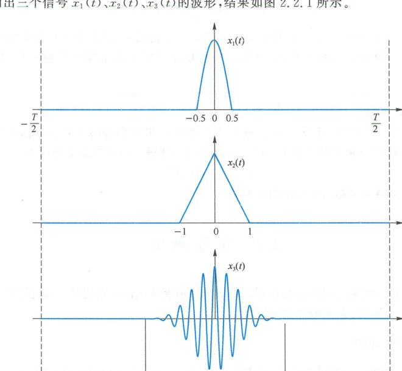

  <figcaption>图 2.2.1 不同频谱对应不同波形（$T = 10\text{ s}$，原书影印参考）</figcaption>
</figure>

<Example title="例 2.2.3">

设 $x(t) = \operatorname{rect}(t)\cos(\pi t)$，求 $x(t)$ 的频谱。

</Example>

<Solution title="解">

根据系数计算公式：

$$
x_n = \frac{1}{T}\int_{-T/2}^{T/2} \operatorname{rect}(t)\cos(\pi t)\mathrm{e}^{-\mathrm{j}2\pi f_n t}\,\mathrm{d}t = \frac{1}{T}\int_{-0.5}^{0.5} \cos(\pi t)\mathrm{e}^{-\mathrm{j}2\pi f_n t}\,\mathrm{d}t
$$

被积函数的实部 $\cos(\pi t)\cos(2\pi f_n t)$ 是偶函数，虚部 $-\cos(\pi t)\sin(2\pi f_n t)$ 是奇函数。奇函数在对称区间内的积分为零，故：

$$
\begin{aligned}
x_n &= \frac{2}{T}\int_0^{0.5} \cos(\pi t)\cos(2\pi f_n t)\,\mathrm{d}t \\
&= \frac{1}{T}\int_0^{0.5} [\cos(2\pi f_n t - \pi t) + \cos(2\pi f_n t + \pi t)]\,\mathrm{d}t \\
&= \frac{1}{T}\left[ \frac{\sin(\pi f_n - \pi/2)}{2\pi f_n - \pi} + \frac{\sin(\pi f_n + \pi/2)}{2\pi f_n + \pi} \right] \\
&= \frac{1}{2T}[\operatorname{sinc}(f_n - 0.5) + \operatorname{sinc}(f_n + 0.5)]
\end{aligned}
$$

图 2.2.2 中按 $T = 1\text{ s}, 10\text{ s}, 100\text{ s}$ 三种情况画出了频谱图。频谱图由许多谱线构成，谱线的间隔是 $1/T$。随着 $T$ 增大，频谱高度不断变小，间隔不断变密。到 $T = 100\text{ s}$ 时，图中的谱线显示对人眼已经密不可分。

</Solution>

<figure class="vp-figure">

  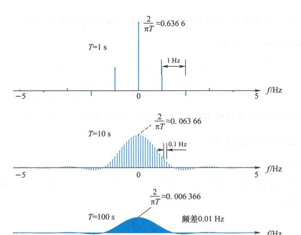

  <figcaption>图 2.2.2 $T$ 增大时，谱线的高度变小，间隔变密（原书影印参考）</figcaption>
</figure>

---

## 2.2.2 傅里叶变换

可将上述傅里叶分析方法推广到无限区间或非周期信号，导出傅里叶变换。

从图 2.2.2 中可以注意到，随着观察时间 $T$ 的增大，频谱间隔越来越密，幅度越来越小。当 $T$ 较大时，通过逐一列举每条谱线来描述信号频谱将变得十分不便。为此可以改用频谱的密度。

<figure class="vp-figure">

  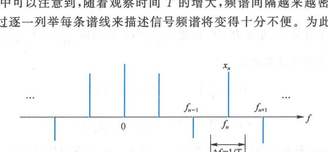

  <figcaption>图 2.2.3 频谱密度（原书影印参考）</figcaption>
</figure>

密度是小区间内的量值除以区间的大小。参考图 2.2.3，在信号 $x(t)$ 的频谱中，相邻谱线之间的频率间隔为 $\Delta f = 1/T$。在区间 $\left[ f_n - \frac{\Delta f}{2}, f_n + \frac{\Delta f}{2} \right]$ 内，$x(t)$ 包含一个大小为 $x_n$、频率为 $f_n = n/T = n\Delta f$ 的单频信号。该区间内的频谱密度为：

$$
\frac{x_n}{\Delta f} = T x_n = \int_{-T/2}^{T/2} x(t)\mathrm{e}^{-\mathrm{j}2\pi f_n t}\,\mathrm{d}t
$$

代入级数展开式，傅里叶级数表达式可以写成：

$$
x(t) = \sum_{n=-\infty}^{\infty} \frac{x_n}{\Delta f}\mathrm{e}^{\mathrm{j}2\pi f_n t}\Delta f = \sum_{n=-\infty}^{\infty} (T x_n)\mathrm{e}^{\mathrm{j}2\pi(n\Delta f)t}\Delta f
$$

当 $T \to \infty$ 时，$\Delta f = \frac{1}{T} \to 0$。对于所有整数 $n$，$f_n = n\Delta f$ 将无限逼近 $(-\infty, \infty)$ 内的任意实数。用 $f$ 表示 $f_n$，用 $X(f)$ 表示对应频率 $f = f_n$ 处的频谱密度 $\frac{x_n}{\Delta f}$，则当 $T \to \infty$ 时，演变成傅里叶变换对：

<Knowledge title="傅里叶变换（Fourier Transform）与反变换">

$$
X(f) = \mathscr{F}[x(t)] = \int_{-\infty}^{\infty} x(t)\mathrm{e}^{-\mathrm{j}2\pi f t}\,\mathrm{d}t, \quad -\infty < f < \infty
$$

$$
x(t) = \mathscr{F}^{-1}[X(f)] = \int_{-\infty}^{\infty} X(f)\mathrm{e}^{\mathrm{j}2\pi f t}\,\mathrm{d}f, \quad -\infty < t < \infty
$$

以下分别将傅里叶变换及傅里叶反变换简称为傅氏变换和傅氏反变换。

</Knowledge>

---

## 2.2.3 常用傅氏变换及性质

### 1. 面积与原点值

在变换对中分别代入 $f=0$ 和 $t=0$ 可以看出，一个域中的面积是另一个域中的原点值：

$$
x(0) = \int_{-\infty}^{\infty} X(f)\,\mathrm{d}f
$$

$$
X(0) = \int_{-\infty}^{\infty} x(t)\,\mathrm{d}t
$$

### 2. 矩形与 sinc 对偶

矩形脉冲与 sinc 脉冲构成傅氏变换对。中心在原点、宽度为 $T$、高度为 1 的矩形脉冲 $\operatorname{rect}(t/T)$ 的傅氏变换为：

$$
\int_{-\infty}^{\infty} \operatorname{rect}\left(\frac{t}{T}\right)\mathrm{e}^{-\mathrm{j}2\pi f t}\,\mathrm{d}t = 2\int_0^{T/2} \cos(2\pi f t)\,\mathrm{d}t = \frac{\sin(\pi f T)}{\pi f} = T \cdot \operatorname{sinc}(f T)
$$

同理可知，中心在原点、宽度为 $2W$、高度为 $\frac{1}{2W}$ 的矩形频谱 $\frac{1}{2W}\operatorname{rect}\left(\frac{f}{2W}\right)$ 的傅氏反变换为 $\operatorname{sinc}(2Wt)$。以上关系可以整理为对偶对：

$$
\operatorname{rect}\left(\frac{t}{T}\right) \iff T \cdot \operatorname{sinc}(f T)
$$

$$
\operatorname{sinc}(2Wt) \iff \frac{1}{2W}\operatorname{rect}\left(\frac{f}{2W}\right)
$$

矩形脉冲与 sinc 脉冲的傅氏变换如图 2.2.4 所示。矩形变换后是 sinc，sinc 变换后是矩形。sinc 前的系数是矩形的面积，与变换中的变量 $f$ 或 $t$ 相乘的是矩形的宽度。从图 2.2.4 还可以注意到，时域变窄则频域变宽，时域变宽则频域变窄。

<figure class="vp-figure">

  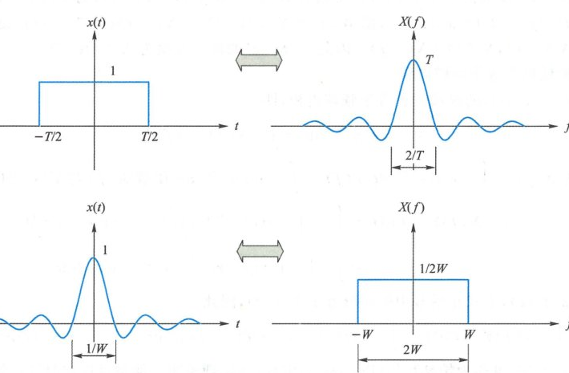

  <figcaption>图 2.2.4 矩形脉冲与 sinc 脉冲的傅氏变换（原书影印参考）</figcaption>
</figure>

### 3. 直流与冲激

分别代入 $x(t) = \delta(t)$ 和 $X(f) = \delta(f)$，可得到：

$$
\delta(t) \iff 1
$$

$$
1 \iff \delta(f)
$$

即常数与冲激构成傅氏变换对。频域 $T \cdot \operatorname{sinc}(f T)$ 的面积是时域 $\operatorname{rect}\left(\frac{t}{T}\right)$ 的原点值，为 1。当 $T \to \infty$ 时，$\operatorname{rect}\left(\frac{t}{T}\right)$ 无限变宽成为直流 1，$T \cdot \operatorname{sinc}(f T)$ 无限变窄变高成为单位冲激。

由于常数与冲激构成傅氏变换对，分别代入 $x(t) = 1$ 和 $X(f) = 1$，左边将变成冲激，说明单位冲激可以表示为如下积分：

$$
\int_{-\infty}^{\infty} \mathrm{e}^{\mathrm{j}2\pi u v}\,\mathrm{d}v = \delta(u)
$$

### 4. 时移与频移

$$
x(t - t_0) \iff X(f)\mathrm{e}^{-\mathrm{j}2\pi f t_0}
$$

$$
x(t)\mathrm{e}^{\mathrm{j}2\pi f_0 t} \iff X(f - f_0)
$$

即在一个域中平移对应另一个域中乘以复正弦函数。

### 5. 共轭

$$
x^*(t) \iff X^*(-f)
$$

若 $x(t)$ 是实信号，则 $x(t) = x^*(t)$，此时 $X(f) = X^*(-f)$。$X(f)$ 一般是复数，按幅值和角度可以表示为 $X(f) = |X(f)|\mathrm{e}^{\mathrm{j}\varphi(f)}$，其中 $|X(f)|$ 是幅度谱，$\varphi(f) = \angle X(f)$ 是角度谱或相位谱。$X(f) = X^*(-f)$ 说明 $|X(f)|\mathrm{e}^{\mathrm{j}\varphi(f)} = |X(-f)|\mathrm{e}^{-\mathrm{j}\varphi(-f)}$，即**实信号的幅度谱是偶函数 $|X(f)| = |X(-f)|$，相位谱是奇函数 $\varphi(f) = -\varphi(-f)$**。

### 6. 奇偶性

$$
x(-t) \iff X(-f)
$$

$x(-t)$ 是将 $x(t)$ 的时间轴镜像反转，即时间倒流。此时，构成 $x(t)$ 的每个频率分量 $\mathrm{e}^{\mathrm{j}2\pi f t}$ 变成 $\mathrm{e}^{-\mathrm{j}2\pi f t}$，其转向反转，频率反极性，从而导致 $X(f)$ 的频率轴镜像反转。

若 $x(t)$ 是偶函数，则 $x(t) = x(-t), X(f) = X(-f)$。若 $x(t)$ 是奇函数，则 $x(t) = -x(-t), X(f) = -X(-f)$。说明傅氏变换不改变奇偶性，偶函数的傅氏变换是偶函数，奇函数的傅氏变换是奇函数。

若 $x(t)$ 为实偶函数，则 $X(f) = X^*(-f)$ 且 $X(f) = X(-f)$，即 $X^*(-f) = X(-f)$，取共轭后不变只能是实函数，说明**实偶函数的傅氏变换是实偶函数**。类似可得**实奇函数的傅氏变换是虚奇函数**。

<Example title="例 2.2.4">

设实信号 $x(t)$ 的傅氏变换为 $X(f)$。令 $y(t) = x(-t)$，则 $Y(f) = X(-f)$。再令 $w(t) = y(t - t_0) = x(t_0 - t)$，则 $W(f) = Y(f)\mathrm{e}^{-\mathrm{j}2\pi f t_0} = X(-f)\mathrm{e}^{-\mathrm{j}2\pi f t_0}$。$x(t)$ 是实信号，$X(f) = X^*(-f), X^*(f) = X(-f)$。因此，$x(t_0 - t)$ 的傅氏变换为 $X^*(f)\mathrm{e}^{-\mathrm{j}2\pi f t_0}$。

</Example>

### 7. 时域内积等于频域内积（帕塞瓦尔定理）

信号 $x(t), y(t)$ 的时域内积等于频域内积，即：

$$
\int_{-\infty}^{\infty} x(t)y^*(t)\,\mathrm{d}t = \int_{-\infty}^{\infty} X(f)Y^*(f)\,\mathrm{d}f
$$

函数 $X(f)$ 与 $Y(f)$ 的内积为：

$$
\begin{aligned}
\int_{-\infty}^{\infty} X(f)Y^*(f)\,\mathrm{d}f &= \int_{-\infty}^{\infty} \left[ \int_{-\infty}^{\infty} x(t)\mathrm{e}^{-\mathrm{j}2\pi f t}\,\mathrm{d}t \right] \left[ \int_{-\infty}^{\infty} y^*(\tau)\mathrm{e}^{\mathrm{j}2\pi f \tau}\,\mathrm{d}\tau \right] \mathrm{d}f \\
&= \int_{-\infty}^{\infty} \int_{-\infty}^{\infty} x(t)y^*(\tau) \left\{ \int_{-\infty}^{\infty} \mathrm{e}^{\mathrm{j}2\pi f(\tau - t)}\,\mathrm{d}f \right\} \mathrm{d}t\,\mathrm{d}\tau \\
&= \int_{-\infty}^{\infty} x(t) \left\{ \int_{-\infty}^{\infty} y^*(\tau)\delta(\tau - t)\,\mathrm{d}\tau \right\} \mathrm{d}t = \int_{-\infty}^{\infty} x(t)y^*(t)\,\mathrm{d}t
\end{aligned}
$$

上式也称为帕塞瓦尔（Parseval）定理，该定理说明互能量可以在时域计算，也可以在频域计算。当 $y(t) = x(t)$ 时，成为能量形式的帕塞瓦尔定理：

$$
\int_{-\infty}^{\infty} |x(t)|^2\,\mathrm{d}t = \int_{-\infty}^{\infty} |X(f)|^2\,\mathrm{d}f
$$

### 8. 卷积与乘积

一个域中的乘积对应另一个域中的卷积，即：

$$
x(t) * y(t) = \int_{-\infty}^{\infty} x(u)y(t - u)\,\mathrm{d}u \iff X(f)Y(f)
$$

$$
x(t)y(t) \iff \int_{-\infty}^{\infty} X(u)Y(f - u)\,\mathrm{d}u = X(f) * Y(f)
$$

其中 $*$ 表示卷积。

当两个信号 $x(t)$ 与 $y(t)$ 中有一个为冲激时，有如下关系：

$$
x(t)\delta(t - t_0) = x(t_0)\delta(t - t_0) \iff x(t_0)\mathrm{e}^{-\mathrm{j}2\pi f t_0}
$$

$$
x(t) * \delta(t - t_0) = x(t - t_0) \iff X(f)\mathrm{e}^{-\mathrm{j}2\pi f t_0}
$$

若两个信号都是冲激，有如下关系：

$$
\delta(t - t_1)\delta(t - t_0) = \delta(t_0 - t_1)\delta(t - t_0) \iff \delta(t_0 - t_1)\mathrm{e}^{-\mathrm{j}2\pi f t_0}
$$

$$
\delta(t - t_1) * \delta(t - t_0) = \delta(t - t_1 - t_0) \iff \mathrm{e}^{-\mathrm{j}2\pi f(t_0 + t_1)}
$$

<Example title="例 2.2.5">

求 $\operatorname{sinc}^2\left(\frac{t}{T}\right)$ 的傅氏变换。

</Example>

<Solution title="解">

$\operatorname{sinc}^2\left(\frac{t}{T}\right)$ 是两个 $\operatorname{sinc}\left(\frac{t}{T}\right)$ 的乘积。$\operatorname{sinc}\left(\frac{t}{T}\right)$ 的傅氏变换是矩形 $T \cdot \operatorname{rect}(f T)$。时域乘积对应频域卷积。两个宽度相同的矩形卷积结果是三角形。由此得到的 $\operatorname{sinc}^2(t/T)$ 的傅氏变换如图 2.2.5 所示。

</Solution>

<figure class="vp-figure">

  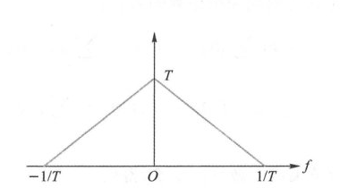

  <figcaption>图 2.2.5 $\operatorname{sinc}^2(t/T)$ 的傅氏变换（原书影印参考）</figcaption>
</figure>

### 9. 微分

$$
\frac{\mathrm{d}}{\mathrm{d}t}x(t) \iff \mathrm{j}2\pi f \cdot X(f)
$$

$$
-\mathrm{j}2\pi t \cdot x(t) \iff \frac{\mathrm{d}}{\mathrm{d}f}X(f)
$$

即在一个域中求导对应另一个域中乘以过原点的直线 $\mathrm{j}2\pi f$ 或 $-\mathrm{j}2\pi t$。

<Example title="例 2.2.6">

求 $h(t) = \frac{1}{\pi t}$ 的傅氏变换 $H(f)$。

</Example>

<Solution title="解">

$h(t)$ 是实奇函数，故 $H(f)$ 必为虚奇函数。等式 $h(t) = \frac{1}{\pi t}$ 两边同乘 $-\mathrm{j}2\pi t$ 得到：

$$
-\mathrm{j}2\pi t \cdot h(t) = -2\mathrm{j}
$$

左边 $-\mathrm{j}2\pi t \cdot h(t)$ 的傅氏变换是 $\frac{\mathrm{d}}{\mathrm{d}f}H(f)$，右边 $-2\mathrm{j}$ 的傅氏变换是 $-2\mathrm{j} \cdot \delta(f)$，即：

$$
\frac{\mathrm{d}}{\mathrm{d}f}H(f) = -2\mathrm{j} \cdot \delta(f)
$$

两边积分，并注意 $H(f)$ 是虚奇函数，得到：

$$
H(f) = \begin{cases} -\mathrm{j}, & f > 0 \\ +\mathrm{j}, & f < 0 \end{cases} = -\mathrm{j} \cdot \operatorname{sgn}(f)
$$

这是后续希尔伯特变换的重要基础频域特性。

</Solution>

### 10. 周期冲激序列

周期冲激序列是将单个冲激 $\delta(t)$ 按周期 $T$ 不断复制形成的：

$$
\delta_T(t) = \sum_{n=-\infty}^{\infty} \delta(t - nT), \quad -\infty < t < \infty
$$

$\delta_T(t)$ 是周期信号。周期信号的傅里叶级数展开等于它在任何一个周期内的傅里叶级数展开。在区间 $[-T/2, T/2]$ 内，$\delta_T(t) = \delta(t)$，其傅里叶级数展开式为 $\frac{1}{T}\sum_{m=-\infty}^{\infty} \mathrm{e}^{\mathrm{j}2\pi \frac{m}{T} t}$。因此 $\delta_T(t)$ 的傅里叶级数展开为：

$$
\delta_T(t) = \sum_{n=-\infty}^{\infty} \delta(t - nT) = \frac{1}{T}\sum_{m=-\infty}^{\infty} \mathrm{e}^{\mathrm{j}2\pi \frac{m}{T} t}, \quad -\infty < t < \infty
$$

两边逐项做傅氏变换，$\delta(t - nT)$ 的傅氏变换是 $\mathrm{e}^{-\mathrm{j}2\pi f n T}$，$\mathrm{e}^{\mathrm{j}2\pi \frac{m}{T} t}$ 的傅氏变换为 $\delta\left(f - \frac{m}{T}\right)$，于是得到周期冲激序列的傅氏变换为：

$$
\mathscr{F}\left[ \sum_{n=-\infty}^{\infty} \delta(t - nT) \right] = \sum_{n=-\infty}^{\infty} \mathrm{e}^{-\mathrm{j}2\pi f n T} = \frac{1}{T}\sum_{m=-\infty}^{\infty} \delta\left(f - \frac{m}{T}\right)
$$

结果说明：**周期冲激序列在频域也是周期冲激序列**。

### 11. 采样

信号 $x(t)$ 的理想采样是其与周期冲激序列的乘积：

$$
x_s(t) = x(t)\sum_{n=-\infty}^{\infty} \delta(t - nT_s) = \sum_{n=-\infty}^{\infty} x(t)\delta(t - nT_s) = \sum_{n=-\infty}^{\infty} x(nT_s)\delta(t - nT_s) = \sum_{n=-\infty}^{\infty} x_n \delta(t - nT_s)
$$

其中 $x_n = x(nT_s)$。逐项做傅氏变换得到：

$$
X_s(f) = \sum_{n=-\infty}^{\infty} x_n \mathrm{e}^{-\mathrm{j}2\pi n f T_s}
$$

上式是序列 $\{x_n\}$ 的离散时间傅氏变换（DTFT）。在第一个等式中代入周期冲激序列的傅氏级数展开式，两边做傅氏变换得到：

$$
X_s(f) = \frac{1}{T_s}\sum_{m=-\infty}^{\infty} X\left(f - \frac{m}{T_s}\right)
$$

结果说明：**理想采样后的频谱是原频谱的周期性搬移叠加**，频域搬移的间隔是采样率 $f_s = 1/T_s$。若搬移间隔较小，右边的各项在频谱上的图形将产生交叠（混叠）；而当搬移间隔足够大时，各项在频谱上的图形将不会产生交叠，如图 2.2.6 所示。

<figure class="vp-figure">

  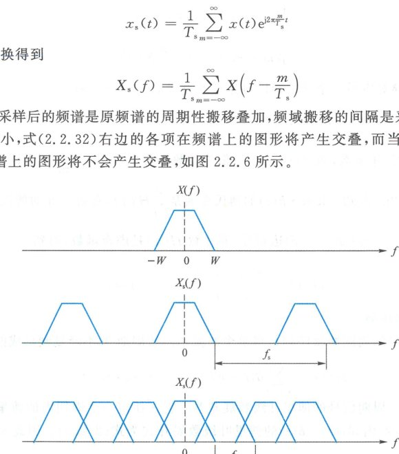

  <figcaption>图 2.2.6 理想采样后的频谱是原信号频谱的搬移叠加（原书影印参考）</figcaption>
</figure>

---

## 2.2.4 能量谱密度与功率谱密度

任何信号均由不同频率的复单频信号构成。不同的频率分量彼此正交，所以信号总体的能量或功率是各个单频信号的能量或功率之和。能量或功率沿频率轴的分布密度称为能量谱密度或功率谱密度。

### 1. 能量谱密度

在 $x(t)$ 的频率成分中，频率为 $f_n = n/T$ 的分量所在的区间为 $\left[ -\frac{\Delta f}{2} + f_n, \frac{\Delta f}{2} + f_n \right]$，其中 $\Delta f = 1/T$。该区间内的单频信号是 $x_n \mathrm{e}^{\mathrm{j}2\pi f_n t}$。若该频率处的频谱密度为 $X(f_n)$，则 $x_n = X(f_n)\Delta f = \frac{X(f_n)}{T}$。$x_n \mathrm{e}^{\mathrm{j}2\pi f_n t}$ 的功率是 $|x_n|^2$，在 $T$ 时间内的能量是 $|x_n|^2 T$。这部分能量在该频率区间内的密度为 $\frac{|x_n|^2 T}{\Delta f} = |x_n|^2 T^2 = |X(f_n)|^2$，即 $x(t)$ 的能量在频率 $f_n$ 处的密度等于该频率处的频谱密度的模平方。

信号的**能量谱密度（Energy Spectral Density, ESD）**等于频谱密度的模平方：

$$
E_x(f) = |X(f)|^2
$$

推广到互能量，信号 $x(t)$ 与 $y(t)$ 的**互能量谱密度**为：

$$
E_{xy}(f) = X(f)Y^*(f)
$$

两个信号相加后的总能量谱密度为：

$$
|X(f) + Y(f)|^2 = |X(f)|^2 + |Y(f)|^2 + X(f)Y^*(f) + X^*(f)Y(f)
$$

密度的积分是总量。能量谱密度的积分是总能量，互能量谱密度的积分是总互能量。帕塞瓦尔定理反映的正是这一关系。

有频域就有时域。能量谱密度是频域函数，对应的时域函数是**相关函数**。信号 $x(t)$ 的**自相关函数**定义为信号时间错开后的内积：

$$
R_x(\tau) = \int_{-\infty}^{\infty} x(t+\tau)x^*(t)\,\mathrm{d}t
$$

信号 $x(t)$ 与 $y(t)$ 的**互相关函数**是两个信号时间错开后的内积：

$$
R_{xy}(\tau) = \int_{-\infty}^{\infty} x(t+\tau)y^*(t)\,\mathrm{d}t
$$

能量谱密度与相关函数有如下性质：
1. **非负性**：$|X(f)|^2 \geqslant 0$；
2. **维纳-辛钦关系**：自相关函数的傅氏变换是能量谱密度，互相关函数的傅氏变换是互能量谱密度：

$$
R_x(\tau) \iff |X(f)|^2
$$

$$
R_{xy}(\tau) \iff X(f)Y^*(f)
$$

3. **原点极大性**：自相关函数在 $\tau = 0$ 时最大，最大值等于能量：

$$
|R_x(\tau)| \leqslant R_x(0) = E_x
$$

4. **对称性**：
   - 实信号：$R_x(\tau) = R_x(-\tau)$（实偶函数）；
   - 复信号：$R_x(\tau) = R_x^*(-\tau)$（共轭对称）；
5. **次序调换**：
   - 实信号：$R_{yx}(\tau) = R_{xy}(-\tau)$；
   - 复信号：$R_{yx}(\tau) = R_{xy}^*(-\tau)$；
6. **相移与时延不改变自相关函数与能量谱密度**；
7. **正交与频域不重叠**：若 $X(f)Y(f) = 0$，则互能量谱密度为零。

### 2. 功率谱密度

功率谱密度反映功率信号的功率在频域的分布密度。令 $x_T(t)$ 表示功率信号 $x(t)$ 在区间 $[-T/2, T/2]$ 内的截短部分：

$$
x_T(t) = \operatorname{rect}\left(\frac{t}{T}\right)x(t) = \begin{cases} x(t), & |t| < \frac{T}{2} \\ 0, & \text{其他 } t \end{cases}
$$

令 $T \to \infty$，便得到 $x(t)$ 的**功率谱密度（Power Spectral Density, PSD）**：

$$
P_x(f) = \lim_{T \to \infty} \left\{ \frac{|X_T(f)|^2}{T} \right\}
$$

同理，功率信号 $x(t)$ 与 $y(t)$ 的**互功率谱密度**为：

$$
P_{xy}(f) = \lim_{T \to \infty} \left\{ \frac{X_T(f)Y_T^*(f)}{T} \right\}
$$

其中 $Y_T(f)$ 是截短信号 $y_T(t) = \operatorname{rect}\left(\frac{t}{T}\right)y(t)$ 的傅氏变换。自功率谱密度是互功率谱密度在 $x(t) = y(t)$ 时的特例。两个功率信号相加，其总功率谱密度为：

$$
P_{x+y}(f) = P_x(f) + P_y(f) + P_{xy}(f) + P_{yx}(f)
$$

功率信号的自相关函数与互相关函数分别为：

$$
R_x(\tau) = \lim_{T \to \infty} \left\{ \frac{1}{T}\int_{-T/2}^{T/2} x(t+\tau)x^*(t)\,\mathrm{d}t \right\} = \overline{x(t+\tau)x^*(t)}
$$

$$
R_{xy}(\tau) = \lim_{T \to \infty} \left\{ \frac{1}{T}\int_{-T/2}^{T/2} x(t+\tau)y^*(t)\,\mathrm{d}t \right\} = \overline{x(t+\tau)y^*(t)}
$$

功率信号相关函数与功率谱密度的核心性质：
1. **非负性**：$P_x(f) \geqslant 0$；
2. **维纳-辛钦定理**：$R_x(\tau) \iff P_x(f)$，$R_{xy}(\tau) \iff P_{xy}(f)$；
3. **原点极大性**：$|R_x(\tau)| \leqslant R_x(0) = P_x$；
4. **对称性**：实信号 $R_x(\tau) = R_x(-\tau)$，复信号 $R_x(\tau) = R_x^*(-\tau)$；
5. **不相干信号**：若 $x(t)$ 与 $y(t)$ 没有共同频率成分，则其互功率谱密度为零，$x(t) + y(t)$ 的功率谱密度等于各自功率谱密度之和。

<Example title="例 2.2.7">

设 $x_1(t) = \mathrm{e}^{\mathrm{j}20\pi t}, x_2(t) = \mathrm{e}^{\mathrm{j}\left(22\pi t + \frac{2\pi}{3}\right)}, x_3(t) = \mathrm{e}^{\mathrm{j}\left(20\pi t + \frac{2\pi}{3}\right)}$。求 $x_1(t), x_2(t), x_3(t)$ 的功率谱密度以及 $x_1(t) + x_2(t)$、$x_1(t) + x_3(t)$ 的功率谱密度。

</Example>

<Solution title="解">

功率谱密度是功率在频域的分布密度。$\mathrm{e}^{\mathrm{j}20\pi t}$ 的频率是 $10\text{ Hz}$，功率是 $|\mathrm{e}^{\mathrm{j}20\pi t}|^2 = 1$，所以所有功率都集中在频率 $10\text{ Hz}$ 处，功率的分布密度为 $\delta(f - 10)$。也可以先求自相关函数：$\overline{\mathrm{e}^{\mathrm{j}20\pi(t+\tau)} \cdot \mathrm{e}^{-\mathrm{j}20\pi t}} = \mathrm{e}^{\mathrm{j}20\pi\tau}$，再通过傅氏变换得到功率谱密度为 $P_1(f) = \delta(f - 10)$。

$x_2(t)$ 的频率是 $11\text{ Hz}$，功率是 1，功率谱密度是 $P_2(f) = \delta(f - 11)$。$x_3(t)$ 是 $x_1(t)$ 的相移，相移不改变功率谱密度，故 $P_3(f) = \delta(f - 10)$。

$x_1(t)$ 与 $x_2(t)$ 没有共同的频率分量，其互功率谱密度为零，因此 $x_1(t) + x_2(t)$ 的功率谱密度是各自功率谱密度之和：

$$
P_{1+2}(f) = \delta(f - 10) + \delta(f - 11)
$$

$x_1(t) + x_3(t) = x_1(t)(1 + \mathrm{e}^{\mathrm{j}\frac{2\pi}{3}})$ 是 $x_1(t)$ 乘以复系数，因此 $P_{1+3}(f) = P_1(f)|1 + \mathrm{e}^{\mathrm{j}\frac{2\pi}{3}}|^2 = P_1(f) = \delta(f - 10)$。

</Solution>

<Example title="例 2.2.8">

求周期冲激序列 $\delta_{T_s}(t) = \sum_{n=-\infty}^{\infty} \delta(t - nT_s)$ 的功率谱密度与自相关函数。

</Example>

<Solution title="解">

由周期冲激序列傅氏级数展开式，右边每一项 $\frac{1}{T_s}\mathrm{e}^{\mathrm{j}2\pi \frac{m}{T_s} t}$ 的功率是 $\left|\frac{1}{T_s}\mathrm{e}^{\mathrm{j}2\pi \frac{m}{T_s} t}\right|^2 = \frac{1}{T_s^2}$，功率谱密度是 $\frac{1}{T_s^2}\delta\left(f - \frac{m}{T_s}\right)$，故 $\delta_{T_s}(t)$ 的功率谱密度为：

$$
P(f) = \frac{1}{T_s^2}\sum_{m=-\infty}^{\infty} \delta\left(f - \frac{m}{T_s}\right) = \frac{1}{T_s}\sum_{n=-\infty}^{\infty} \mathrm{e}^{-\mathrm{j}2\pi f n T_s}
$$

对上式做傅氏反变换得到 $\delta_{T_s}(t)$ 的自相关函数为：

$$
R(\tau) = \frac{1}{T_s}\sum_{n=-\infty}^{\infty} \delta(\tau - nT_s)
$$

结果说明：**周期冲激序列的波形、傅氏变换、自相关函数、功率谱密度都是周期冲激序列**。

</Solution>

---

## 2.2.5 信号的带宽

信号带宽是一个工程概念，表示信号的频谱宽度。工程中的实际信号是实信号，其带宽指功率谱密度或能量谱密度的图形在正频率部分的宽度。

实信号的功率谱密度是偶函数，单边谱就是将对称的负频率部分对折到正频率。设 $x(t)$ 的双边功率谱密度为 $P_x(f)$，则**单边功率谱密度**定义为：

$$
P_x^{\text{单边}}(f) = P_x(f) + P_x(-f) = 2P_x(f), \quad f > 0
$$

在不致混淆的情况下，单边功率谱密度也可以写成 $P_x(f)$。

信号的频谱通常聚集在频率轴的某个区域内。若聚集在 $f=0$ 附近，称为**基带信号**或**低通信号**；若聚集在某个较高频率 $f_c$ 附近，称为**带通信号**或**频带信号**。图 2.2.7 中，上方的是带通信号，下方的是基带信号。带通信号的带宽是 $2W$，基带信号的带宽是 $100\text{ Hz}$。

<figure class="vp-figure">

  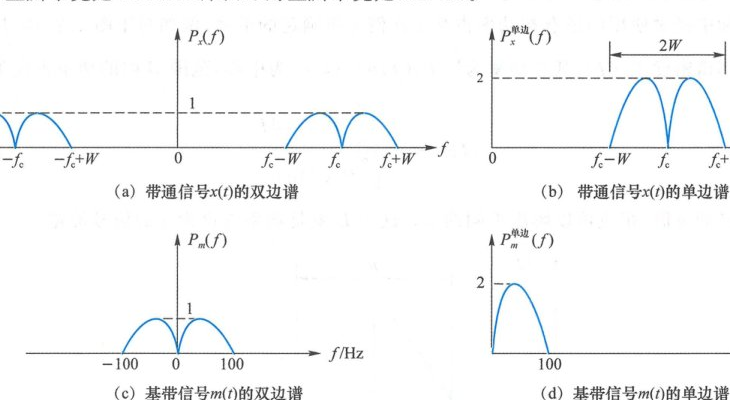

  <figcaption>图 2.2.7 双边谱与单边谱（原书影印参考）</figcaption>
</figure>

信号的频谱形状千差万别，实际中存在多种典型带宽定义：

### 1. 绝对带宽

若信号的单边频谱明确落在某个区间内，在该区间之外频谱为零，则可以把该区间的宽度作为带宽的定义，称为绝对带宽。例如图 2.2.7(b) 中，带通信号落在 $(f_c - W, f_c + W)$ 内，绝对带宽是 $2W$；基带信号落在 $(0, 100)$ 内，绝对带宽是 $100\text{ Hz}$。

### 2. 主瓣带宽

许多信号的功率谱密度无穷宽，但其频谱形状呈现出多瓣的特征。此类信号可以按其主瓣的宽度定义带宽，称为主瓣带宽。对基带信号，主瓣带宽一般等于 $f > 0$ 处的第一个零点的频率值。对于带通信号，主瓣带宽一般是主峰两侧两个零点的间距。例如在图 2.2.8 中，带通信号的主瓣带宽是 $200\text{ kHz}$，基带信号的主瓣带宽是 $300\text{ Hz}$。

<figure class="vp-figure">

  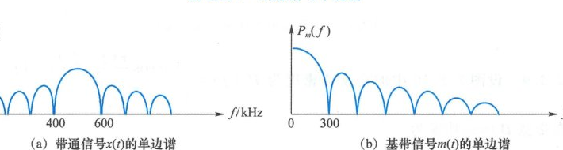

  <figcaption>图 2.2.8 主瓣带宽（原书影印参考）</figcaption>
</figure>

### 3. 3 dB 带宽

$3\text{ dB}$ 带宽指功率谱密度从峰顶下降到一半处的宽度。例如图 2.2.9 中功率谱密度的最高点在 $f = 0$ 处，到 $f = 2\text{ kHz}$ 处下降了一半，因此 $3\text{ dB}$ 带宽为 $2\text{ kHz}$。

<figure class="vp-figure">

  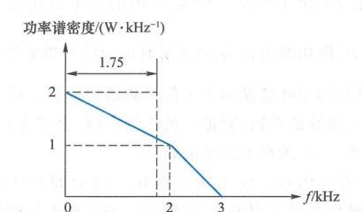

  <figcaption>图 2.2.9 等效矩形带宽和 3 dB 带宽（原书影印参考）</figcaption>
</figure>

### 4. 等效矩形带宽

矩形有明确的宽度。若功率谱密度 $P_x(f)$ 与某个同高的矩形有相同的面积（即功率相同），可用该矩形的宽度作为带宽的定义，称为**等效矩形带宽**。在图 2.2.9 中，功率谱密度的面积为 $3.5\text{ W}$，高度为 $2\text{ W/kHz}$。面积除以高度得到等效矩形带宽为 $1.75\text{ kHz}$。等效矩形带宽常用于噪声功率的计算，也称为**等效噪声带宽**。

### 5. 按功率占比定义的带宽

实际中经常使用的还有按功率占某个比例 $\eta$ 所确定的带宽。例如对于图 2.2.10 中给出的单边功率谱密度 $P_x(f)$，以 $f_c$ 为中心、范围 $B$ 内的功率占比为：

$$
\eta(B) = \frac{\int_{f_c - B/2}^{f_c + B/2} P_x(f)\,\mathrm{d}f}{\int_0^{\infty} P_x(f)\,\mathrm{d}f}
$$

对于不同的 $\eta$ 值，相应可以解出不同的 $B$。这个 $B$ 就是功率占比为 $\eta$ 的信号带宽。

<figure class="vp-figure">

  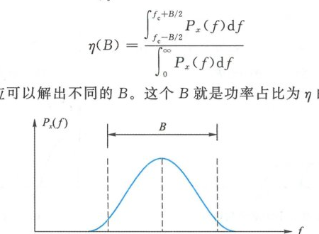

  <figcaption>图 2.2.10 按功率占比确定的带宽（原书影印参考）</figcaption>
</figure>

<Example title="例 2.2.9">

设图 2.2.10 中的功率谱密度为：

$$
P_x(f) = \begin{cases} 1 + \cos\frac{\pi(f - f_c)}{W}, & |f - f_c| \leqslant W \\ 0, & \text{其他 } f \end{cases}
$$

求此信号在带宽 $B$ 内的功率占比。

</Example>

<Solution title="解">

此信号在带宽 $B$ 内的功率为：

$$
\begin{aligned}
P(B) &= \int_{f_c - B/2}^{f_c + B/2} \left[ 1 + \cos\frac{\pi(f - f_c)}{W} \right]\mathrm{d}f = \int_{-B/2}^{B/2} \left[ 1 + \cos\frac{\pi f}{W} \right]\mathrm{d}f \\
&= 2\int_0^{B/2} \left[ 1 + \cos\frac{\pi f}{W} \right]\mathrm{d}f = B\left[ 1 + \operatorname{sinc}\left(\frac{B}{2W}\right) \right]
\end{aligned}
$$

绝对带宽是 $2W$，总功率是 $P(2W) = 2W$。带宽 $B$ 内的功率占比为：

$$
\eta = \frac{B}{2W}\left[ 1 + \operatorname{sinc}\left(\frac{B}{2W}\right) \right]
$$

当 $\frac{B}{2W} \approx 0.5961$ 时，$\eta = 0.9$，即功率占比为 $90\%$ 所对应的信号带宽约为 $1.19W$。

</Solution>

---

## 2.2.6 信号分析拓扑归纳

基于傅里叶级数和傅里叶变换建立了信号频谱的概念。频谱一词泛指各种对信号频域结构的描述，包括傅里叶级数的系数（频谱）、傅氏变换（频谱密度）、能量谱密度、功率谱密度等都属于频谱的范畴，图 2.2.11 给出了简要的归纳。

<figure class="vp-figure">

  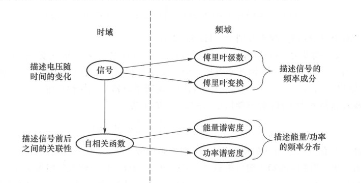

  <figcaption>图 2.2.11 频谱与相关函数知识拓扑（原书影印参考）</figcaption>
</figure>

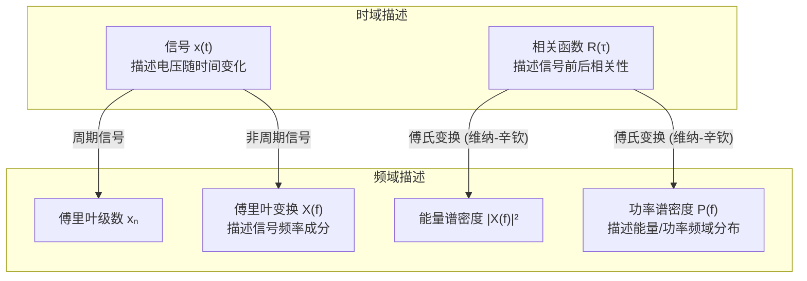

对于某个客观存在的真实信号，$x(t)$ 记录了电压 $x$ 随时间 $t$ 的变化。信号频谱的核心观点是：所有信号均由复单频信号组合而成，不同信号的差别在于频谱的不同。一个信号，从时域看是 $x(t)$，从频域看是 $X(f)$。我们在时域直接感知到的是时域波形 $x(t)$，然后通过分析推理得知频域的存在。$X(f)$ 包含了 $x(t)$ 的全部信息，给定 $X(f)$ 与 $x(t)$ 中的任何一个，便能给定另外一个。基于这些记录可以对信号展开各种分析。
