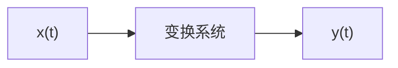
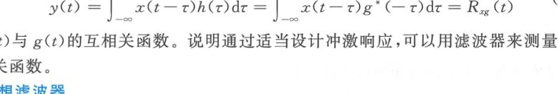
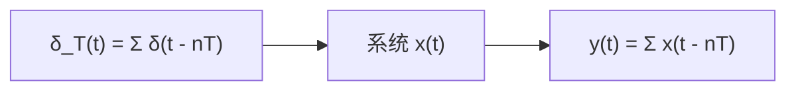
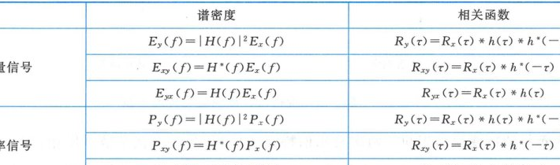
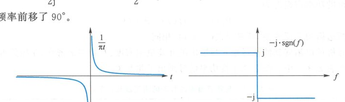
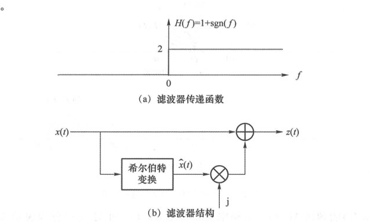
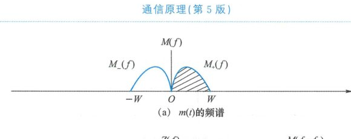
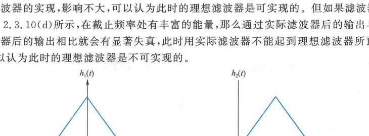
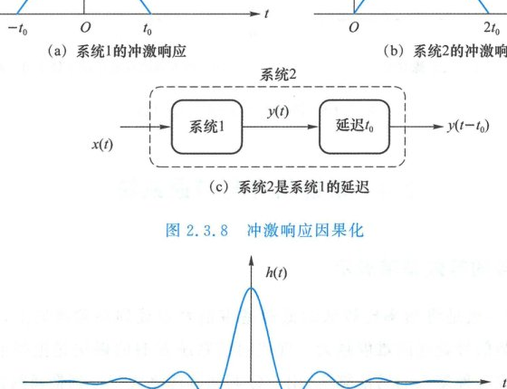
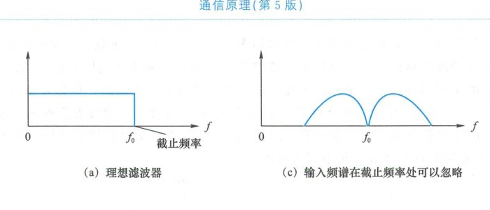

import Knowledge from '@/components/Knowledge.astro';
import Example from '@/components/Example.astro';
import Solution from '@/components/Solution.astro';

从发端到收端，信号需要经历各种各样的变换，有些由模拟电路完成，有些由数字信号处理算法实现。此外，信号所经过的传输媒介也会对信号产生变换作用。无论这些变换的具体细节如何，都可以建模为一个黑箱，它将输入 $x(t)$ 映射为输出 $y(t)$。

把一个信号变成另一个信号的过程构成一个信号系统。信号系统有线性、非线性、时变、时不变之分，本章主要考虑线性时不变系统，也叫线性滤波器或滤波器。

## 2.3.1 滤波器

### 1. 线性与时不变

线性时不变（Linear Time-Invariant, LTI）系统同时具有线性与时不变两个特性：

- **线性（Linearity）**：多个输入信号线性组合后的输出是各自输出的线性组合；
- **时不变（Time-Invariance）**：输入延迟则输出也等量延迟。

线性时不变系统**不会产生输入所没有的频率成分**，非线性系统或时变系统可能产生新的频率分量。

<Example title="例 2.3.1">

信号 $x(t)$ 经过某线性调制系统后的输出为 $y(t) = x(t)\cos(2\pi f_0 t)$。分析其系统性质。

</Example>

<Solution title="解">

由于：

$$
[x_1(t) + x_2(t)]\cos(2\pi f_0 t) = [x_1(t)\cos(2\pi f_0 t)] + [x_2(t)\cos(2\pi f_0 t)]
$$

该系统为线性系统。但它不满足时不变性：$x(t)$ 的输出是 $y(t) = x(t)\cos(2\pi f_0 t)$，$x(t - t_0)$ 的输出 $x(t - t_0)\cos(2\pi f_0 t)$ 不等于 $y(t - t_0) = x(t - t_0)\cos[2\pi f_0 (t - t_0)]$。

若 $f_0 = 10\text{ Hz}$，输入是频率为 $1\text{ Hz}$ 的单频信号 $\cos(2\pi t)$，输出为：

$$
y(t) = \cos(2\pi t)\cos(20\pi t) = \frac{1}{2}\cos(18\pi t) + \frac{1}{2}\cos(22\pi t)
$$

输出包含两个单频信号，频率分别为 $9\text{ Hz}$ 和 $11\text{ Hz}$，产生了输入所没有的新频率。

</Solution>

<Example title="例 2.3.2">

将信号 $x(t)$ 通过一个平方器，输出为 $y(t) = x^2(t)$。分析其系统性质。

</Example>

<Solution title="解">

输入变成 $x(t - t_0)$ 后，输出变成 $x^2(t - t_0) = y(t - t_0)$，因此平方器是时不变系统。但将两个信号 $x_1(t), x_2(t)$ 叠加后送入平方器，输出为 $[x_1(t) + x_2(t)]^2 \neq x_1^2(t) + x_2^2(t)$，说明平方器是非线性系统。

若输入是频率为 $1\text{ Hz}$ 的单频信号 $\cos(2\pi t)$，输出为：

$$
y(t) = \cos^2(2\pi t) = \frac{1}{2} + \frac{1}{2}\cos(4\pi t)
$$

输出包含一个直流信号和一个频率为 $2\text{ Hz}$ 的倍频信号。

</Solution>

<Example title="例 2.3.3">

某系统的输入输出关系为 $y(t) = x(t) + x(t - T)$。分析其系统特性。

</Example>

<Solution title="解">

输入分别为 $x_1(t), x_2(t)$ 时，输出为 $y_1(t) = x_1(t) + x_1(t - T)$ 和 $y_2(t) = x_2(t) + x_2(t - T)$。输入为 $x(t) = x_1(t) + x_2(t)$ 时，输出为：

$$
y(t) = x(t) + x(t - T) = x_1(t) + x_2(t) + x_1(t - T) + x_2(t - T) = y_1(t) + y_2(t)
$$

当输入为 $w(t) = x(t - t_0)$ 时，输出为：

$$
w(t) + w(t - T) = x(t - t_0) + x(t - t_0 - T) = y(t - t_0)
$$

因此，该系统是线性时不变系统。

若 $T = 1/4$，输入信号是频率为 $1\text{ Hz}$ 的单频信号 $\cos(2\pi t)$，输出为：

$$
y(t) = \cos(2\pi t) + \cos\left(2\pi t - \frac{\pi}{2}\right) = \sqrt{2}\cos\left(2\pi t - \frac{\pi}{4}\right)
$$

输出仍然是频率为 $1\text{ Hz}$ 的单频信号，只是幅度和相位发生了变化。

</Solution>

### 2. 滤波器的传递函数

线性时不变系统不会产生输入所没有的频率分量。当滤波器的输入是频率为 $f$ 的单频信号 $\mathrm{e}^{\mathrm{j}2\pi f t}$ 时，输出还是这个单频信号，只是幅度和相位可能发生变化，即输出是输入 $\mathrm{e}^{\mathrm{j}2\pi f t}$ 乘上一个表示幅度与相位变化的复系数 $A\mathrm{e}^{\mathrm{j}\varphi}$。输入频率不同时，幅度和相位的变化可能不同，即复系数 $A\mathrm{e}^{\mathrm{j}\varphi}$ 与频率有关，可记其为 $A(f)\mathrm{e}^{\mathrm{j}\varphi(f)} = H(f)$。此时，滤波器输出为 $H(f)\mathrm{e}^{\mathrm{j}2\pi f t}$。称 $H(f)$ 为滤波器的**传递函数**（Transfer Function）或频率响应，其幅频特性是 $A(f)$，相频特性是 $\varphi(f)$。

按照频谱分析的观点，滤波器输入信号 $x(t)$ 由不同频率的单频信号 $\mathrm{e}^{\mathrm{j}2\pi f t}$ 组成，各个频率成分的含量体现为频谱密度 $X(f)$。滤波器对各频率分量逐一调整幅度与相位，在频率 $f$ 处幅度乘以 $A(f)$，相位增加 $\varphi(f)$，使滤波器输出信号的频谱密度相应变成：

$$
Y(f) = H(f)X(f)
$$

### 3. 滤波器的冲激响应

上式右边是频域乘积，在时域对应卷积。若 $H(f)$ 的傅氏反变换为 $h(t)$，则滤波器输出信号为：

$$
y(t) = x(t) * h(t) = \int_{-\infty}^{\infty} x(t - \tau)h(\tau)\,\mathrm{d}\tau
$$

若滤波器输入是单位冲激 $x(t) = \delta(t)$，代入上式后，输出是 $h(t)$，即 $h(t)$ 是滤波器对单位冲激的响应，简称**冲激响应**（Impulse Response）。根据线性时不变特性，若滤波器输入的冲激改变强度与位置，变成 $a \cdot \delta(t - t_0)$，输出将变成 $a \cdot h(t - t_0)$。

### 4. 滤波器输出与相关函数

滤波器的输入 $x(t)$、冲激响应 $h(t)$、输出 $y(t)$ 都可以是复信号。按复信号考虑，若设计 $h(t) = g^*(-t)$，则滤波器输出为：

$$
y(t) = \int_{-\infty}^{\infty} x(t - \tau)h(\tau)\,\mathrm{d}\tau = \int_{-\infty}^{\infty} x(t - \tau)g^*(-\tau)\,\mathrm{d}\tau = R_{xg}(t)
$$

输出是 $x(t)$ 与 $g(t)$ 的互相关函数。说明通过适当设计冲激响应，可以用滤波器来测量两个信号的互相关函数。这是匹配滤波器的核心数学渊源。

### 5. 理想滤波器

理想滤波器是一个频域窗口，它能够理想滤除窗口外的频率成分，完整保留窗口内的分量。图 2.3.2 示出了理想低通滤波器和理想带通滤波器的传递函数。本书提到的低通滤波器（Low-Pass Filter, LPF）和带通滤波器（Band-Pass Filter, BPF）主要指理想滤波器。

<figure class="vp-figure">

  

  <figcaption>图 2.3.2 理想低通滤波器与理想带通滤波器（原书影印参考）</figcaption>
</figure>

根据传递函数可以求出冲激响应：

- **理想低通滤波器**（带宽为 $W$、增益为 1）：
  $$
  H_{\text{LPF}}(f) = \operatorname{rect}\left(\frac{f}{2W}\right) \iff h_{\text{LPF}}(t) = 2W \cdot \operatorname{sinc}(2Wt)
  $$
- **理想带通滤波器**（带宽为 $B$、增益为 1，中心频率为 $f_c$）：
  $$
  H_{\text{BPF}}(f) = \operatorname{rect}\left(\frac{f - f_c}{B}\right) + \operatorname{rect}\left(\frac{f + f_c}{B}\right)
  $$
  其冲激响应为：
  $$
  \begin{aligned}
  h_{\text{BPF}}(t) &= B \cdot \operatorname{sinc}(Bt)\mathrm{e}^{\mathrm{j}2\pi f_c t} + B \cdot \operatorname{sinc}(Bt)\mathrm{e}^{-\mathrm{j}2\pi f_c t} \\
  &= 2B \cdot \operatorname{sinc}(Bt)\cos(2\pi f_c t)
  \end{aligned}
  $$

### 6. 周期信号的滤波器模型

周期信号 $y(t) = \sum_{n=-\infty}^{\infty} x(t - nT)$ 可以看成是周期冲激序列 $\delta_T(t) = \sum_{n=-\infty}^{\infty} \delta(t - nT)$ 通过一个冲激响应为 $x(t)$ 的滤波器的输出。

设滤波器的传递函数为 $X(f)$。周期信号 $y(t)$ 的傅氏变换为：

$$
Y(f) = X(f) \cdot \frac{1}{T}\sum_{m=-\infty}^{\infty} \delta\left(f - \frac{m}{T}\right) = \frac{1}{T}\sum_{m=-\infty}^{\infty} X\left(\frac{m}{T}\right)\delta\left(f - \frac{m}{T}\right)
$$

两边做傅氏反变换可得到周期信号 $y(t)$ 的傅里叶级数展开式为：

$$
\sum_{n=-\infty}^{\infty} x(t - nT) = \frac{1}{T}\sum_{m=-\infty}^{\infty} X\left(\frac{m}{T}\right)\mathrm{e}^{\mathrm{j}2\pi \frac{m}{T} t}
$$

### 7. 波形无失真传输条件

通信信号传输的理想情形是信号不发生失真，即波形不变。例如，在电脑上播放音乐，调节音量大小不会造成失真，播放时间略有推迟也不是失真。实信号通过无失真系统，其输入输出关系是：

$$
y(t) = c \cdot x(t - t_0)
$$

其中 $c$ 是实常数。两边做傅氏变换得到：

$$
Y(f) = c \cdot \mathrm{e}^{-\mathrm{j}2\pi f t_0} X(f)
$$

<Knowledge title="无失真传输系统的充要条件">

无失真系统的传递函数在拟传输信号的频带范围内必须满足：

$$
H(f) = c \cdot \mathrm{e}^{-\mathrm{j}2\pi f t_0}
$$

1. **幅频特性是常数**：$A(f) = |H(f)| = c$（全通，无幅度失真）；
2. **相频特性是过原点的直线**：$\varphi(f) = \angle H(f) = -2\pi f t_0$（线性相位，无相位失真）。

</Knowledge>

在通信系统中，如果携带信息的信号经过的某个环节是无失真系统，那么原则上说，无论 $c, t_0$ 具体是多少，该环节对通信系统的原理没有影响。因此，当不需要特别关注幅度与时延时，对于无失真系统（如理想信道），我们经常假设 $c = 1, t_0 = 0$。

---

## 2.3.2 滤波器输出的能量及功率谱密度

滤波器会改变信号中各个频率分量的强度，进而改变信号的能量谱密度或功率谱密度。

设滤波器的输入 $x(t)$ 是能量信号，其能量谱密度是 $E_x(f) = |X(f)|^2$。通过传递函数为 $H(f)$ 的滤波器之后，输出信号 $y(t)$ 的傅氏变换为 $Y(f) = H(f)X(f)$，其能量谱密度为：

$$
E_y(f) = |Y(f)|^2 = |H(f)|^2 \cdot |X(f)|^2 = |H(f)|^2 E_x(f)
$$

即**输出能量谱密度是输入能量谱密度乘以传递函数的模平方**。

对 $E_y(f)$ 做傅氏反变换，频域乘积对应时域卷积，因此滤波器输出的自相关函数为：

$$
R_y(\tau) = R_x(\tau) * h(\tau) * h^*(-\tau)
$$

同理，设滤波器的输入 $x(t)$ 是功率信号，其功率谱密度为 $P_x(f)$。输入为截短信号 $x_T(t)$ 时，滤波器输出信号的频谱密度为 $H(f)X_T(f)$，能量谱密度为 $|H(f)|^2 \cdot |X_T(f)|^2$。除以 $T$ 后取极限，得到滤波器输出的功率谱密度为：

$$
P_y(f) = |H(f)|^2 P_x(f)
$$

滤波器输入输出的谱密度与相关函数关系总结于表 2.3.1 与图 2.3.4。

| 信号类型 | 谱密度关系 | 相关函数关系 |
| :--- | :--- | :--- |
| **能量信号** | $E_y(f) = \|H(f)\|^2 E_x(f)$ $E_{xy}(f) = H^*(f)E_x(f)$ $E_{yx}(f) = H(f)E_x(f)$ | $R_y(\tau) = R_x(\tau) * h(\tau) * h^*(-\tau)$ $R_{xy}(\tau) = R_x(\tau) * h^*(-\tau)$ $R_{yx}(\tau) = R_x(\tau) * h(\tau)$ |
| **功率信号** | $P_y(f) = \|H(f)\|^2 P_x(f)$ $P_{xy}(f) = H^*(f)P_x(f)$ $P_{yx}(f) = H(f)P_x(f)$ | $R_y(\tau) = R_x(\tau) * h(\tau) * h^*(-\tau)$ $R_{xy}(\tau) = R_x(\tau) * h^*(-\tau)$ $R_{yx}(\tau) = R_x(\tau) * h(\tau)$ |

<figure class="vp-figure">

  

  <figcaption>图 2.3.4 滤波器输入输出的相关函数与谱密度关系（原书影印参考）</figcaption>
</figure>

---

## 2.3.3 希尔伯特变换与解析信号

### 1. 希尔伯特变换

实信号 $x(t)$ 通过一个冲激响应为 $\frac{1}{\pi t}$ 的滤波器，其输出 $\hat{x}(t)$ 称为 $x(t)$ 的**希尔伯特变换（Hilbert Transform）**：

$$
\hat{x}(t) = \mathscr{H}[x(t)] = x(t) * \frac{1}{\pi t} = \frac{1}{\pi}\int_{-\infty}^{\infty} \frac{x(\tau)}{t - \tau}\,\mathrm{d}\tau
$$

希尔伯特变换的传递函数为：

$$
H(f) = -\mathrm{j} \cdot \operatorname{sgn}(f)
$$

图 2.3.5 示出了希尔伯特变换的冲激响应与传递函数示意图。

<figure class="vp-figure">

  

  <figcaption>图 2.3.5 希尔伯特变换的冲激响应与传递函数（原书影印参考）</figcaption>
</figure>

<Knowledge title="希尔伯特变换的六大核心性质">

1. **全频带 90° 移相器**：传递函数在 $f > 0$ 时为 $-\mathrm{j}$，在 $f < 0$ 时为 $+\mathrm{j}$。即正频率后移 90°，负频率前移 90°。例如 $\cos(20\pi t)$ 经希尔伯特变换后是 $\sin(20\pi t)$；
2. **级联与反变换**：一次希尔伯特变换移相 90°，两次希尔伯特变换移相 180°，也就是信号反相：$\hat{\hat{x}}(t) = -x(t)$。四次变换移相 360° 回到原信号。因此希尔伯特反变换相当于连续做三次希尔伯特变换（移相 270° 或 $-90^\circ$）；
3. **奇偶性反转**：偶函数的希尔伯特变换是奇函数，奇函数的希尔伯特变换是偶函数；实偶函数变换为实奇函数，实奇函数变换为实偶函数；
4. **能量与功率守恒**：传递函数的模平方 $|-\mathrm{j} \cdot \operatorname{sgn}(f)|^2 = 1$，故 $\hat{x}(t)$ 与 $x(t)$ 有完全相同的能量谱密度或功率谱密度，能量与功率相同，自相关函数相同；
5. **互相关函数**：信号的希尔伯特变换与原信号的互相关函数是原信号自相关函数的希尔伯特变换：$R_{\hat{x}x}(\tau) = \hat{R}_x(\tau)$；
6. **正交性**：信号与其自身的希尔伯特变换在时域严格相互正交：
   $$
   \int_{-\infty}^{\infty} \hat{x}(t)x(t)\,\mathrm{d}t = R_{\hat{x}x}(0) = \hat{R}_x(0) = 0
   $$

</Knowledge>

### 2. 解析信号

实信号的频谱正负频率对称。用如图 2.3.6(a) 所示的滤波器去掉负频率，得到一个只有正频率的信号，这种信号称为**解析信号（Analytic Signal）**。

<figure class="vp-figure">

  

  <figcaption>图 2.3.6 实信号通过滤波器形成解析信号（原书影印参考）</figcaption>
</figure>

设有实信号 $x(t)$，其傅氏变换是 $X(f)$。$x(t)$ 通过滤波器的传递函数为：

$$
H(f) = 1 + \operatorname{sgn}(f) = \begin{cases} 2, & f > 0 \\ 0, & f < 0 \end{cases}
$$

输出信号 $z(t)$ 的傅氏变换为：

$$
Z(f) = X(f)H(f) = \begin{cases} 2X(f), & f > 0 \\ 0, & f < 0 \end{cases}
$$

由于 $H(f) = 1 + \operatorname{sgn}(f) = 1 + \mathrm{j}[-\mathrm{j} \cdot \operatorname{sgn}(f)]$，于是：

$$
Z(f) = X(f)H(f) = X(f) + \mathrm{j}[-\mathrm{j} \cdot \operatorname{sgn}(f)X(f)]
$$

两边做傅氏反变换得到：

<Knowledge title="解析信号的定义公式">

$$
z(t) = x(t) + \mathrm{j} \cdot \hat{x}(t)
$$

**解析信号的虚部是实部的希尔伯特变换**。解析信号的傅氏变换是原信号正频率部分的 2 倍。能量谱密度与功率谱密度是正频率部分的 4 倍。

</Knowledge>

解析信号 $z(t)$ 的共轭为 $z^*(t) = x(t) - \mathrm{j}\hat{x}(t)$，对应的传递函数为 $1 - \operatorname{sgn}(f)$，只有负频率。$z(t)$ 与 $z^*(t)$ 没有共同的频率分量，它们的互能量或互功率为零，互能量谱密度或互功率谱密度均为零。

<Example title="例 2.3.4">

设 $z(t) = m(t)\mathrm{e}^{\mathrm{j}2\pi f_c t} = m(t)\cos(2\pi f_c t) + \mathrm{j}m(t)\sin(2\pi f_c t)$，其中 $m(t)$ 是带宽为 $W$ 的实基带信号，$f_c > W$。

</Example>

<Solution title="解">

若 $m(t)$ 的频谱为 $M(f)$，则 $z(t)$ 的频谱是 $M(f - f_c)$，如图 2.3.7 所示。从图中可以看出，$z(t)$ 的频谱 $Z(f)$ 只有正频率，说明 $z(t)$ 是解析信号，其实部 $m(t)\cos(2\pi f_c t)$ 的希尔伯特变换正是其虚部 $m(t)\sin(2\pi f_c t)$。

</Solution>

<figure class="vp-figure">

  

  <figcaption>图 2.3.7 解析信号的频谱示意图（原书影印参考）</figcaption>
</figure>

实信号 $m(t)$ 的频谱 $M(f)$ 正负频率对称。令 $M_+(f)$ 和 $M_-(f)$ 分别表示 $M(f)$ 的正频率部分和负频率部分，其傅氏反变换分别为 $m_+(t)$ 和 $m_-(t)$，则 $M(f) = M_+(f) + M_-(f), m(t) = m_+(t) + m_-(t)$。$m(t)$ 对应的解析信号 $m(t) + \mathrm{j}\hat{m}(t)$ 的频谱是 $M(f)$ 正频率部分的 2 倍，即 $2M_+(f)$，因此：

$$
m_+(t) = \frac{1}{2}[m(t) + \mathrm{j}\hat{m}(t)], \quad m_-(t) = m(t) - m_+(t) = \frac{1}{2}[m(t) - \mathrm{j}\hat{m}(t)] = m_+^*(t)
$$

---

## 2.3.4 滤波器的可实现性

### 1. 因果性

物理可实现的滤波器必须满足**因果性**：响应不能发生在激励之前。默认假设滤波器初始状态为零。若在零时刻输入单位冲激 $\delta(t)$，滤波器不能在零时刻之前就开始响应。因此，物理可实现滤波器的冲激响应 $h(t)$ 必须满足：

$$
h(t) = 0, \quad t < 0
$$

理想低通滤波器的冲激响应 $h_{\text{LPF}}(t) = 2W\operatorname{sinc}(2Wt)$ 和希尔伯特变换的冲激响应 $\frac{1}{\pi t}$ 在 $t < 0$ 处均不为零，都是非因果系统。这些系统在实际实现中需要做**因果化处理**。

图 2.3.8(a)(b) 分别示出了两个系统的冲激响应，其中系统 1 非因果，系统 2 因果，二者是延迟关系：$h_2(t) = h_1(t - t_0)$。对于相同的输入 $x(t)$，系统 1 的输出是 $y(t)$，系统 2 的输出是 $y(t - t_0)$，系统 2 等价于系统 1 的输出推迟送出。延迟是无失真关系，因此在无失真意义下，系统 2 和系统 1 是等价的。此时，$h_2(t)$ 就是 $h_1(t)$ 的因果化。我们可以按系统 1 设计通信系统，而真正实现的是系统 2。

<figure class="vp-figure">

  

  <figcaption>图 2.3.8 冲激响应因果化（原书影印参考）</figcaption>
</figure>

对于无限持续时间的非因果系统，如理想低通滤波器的冲激响应 $\operatorname{sinc}(t/T)$ 或希尔伯特变换冲激响应 $\frac{1}{\pi t}$，实际实现时可采取近似的方法：先将 $h(t)$ 截短为 $h_T(t) = \operatorname{rect}\left(\frac{t}{T}\right)h(t)$，然后对持续时间受限的 $h_T(t)$ 进行因果化延迟，如图 2.3.9 所示。

<figure class="vp-figure">

  

  <figcaption>图 2.3.9 截短后因果化（原书影印参考）</figcaption>
</figure>

### 2. 频域锐降

理想滤波器的传递函数在截止频率处直接跳到零，是锐降，如图 2.3.10(a) 所示。能够实现的实际滤波器则是滚降，传递函数逐渐变到零，存在一个过渡带，如图 2.3.10(b) 所示。

<figure class="vp-figure">

  

  <figcaption>图 2.3.10 锐降特性的可实现问题（原书影印参考）</figcaption>
</figure>

实际滤波器是对理想滤波器的近似实现。这种近似能否被接受，取决于通过滤波器的信号频谱在截止频率处有多大：
- 如果滤波器输入频谱如图 2.3.10(c) 所示，在截止频率处的能量很小，那么通过实际滤波器后的输出与通过理想滤波器后的输出差别不大，可以认为此时的理想滤波器是可实现的；
- 如果滤波器输入频谱如图 2.3.10(d) 所示，在截止频率处有丰富的能量，那么通过实际滤波器后的输出与通过理想滤波器后的输出相比就会有显著失真，此时理想滤波器不可实现。
