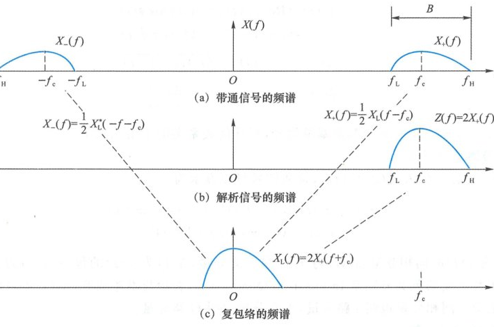
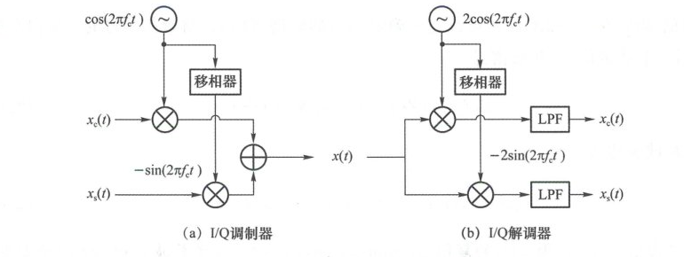
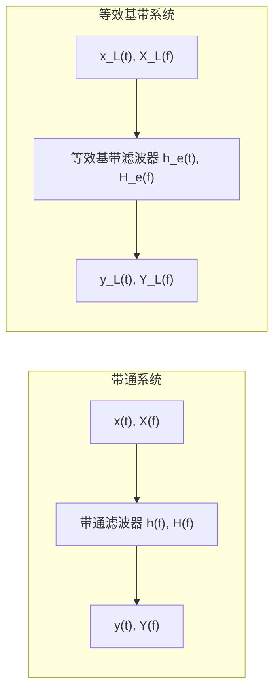
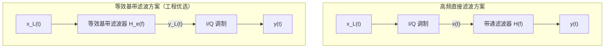

import Knowledge from '@/components/Knowledge.astro';
import Example from '@/components/Example.astro';
import Solution from '@/components/Solution.astro';
import ExerciseTrigger from '@/components/exercises/ExerciseTrigger.astro';

无线通信系统一般是将频率比较低的低通基带信号加载到高频载波上，产生带通信号。频率越高，实现复杂信号处理的难度越大。现代通信系统普遍的做法是把带通信号等效为基带信号，在基带完成各种复杂的通信算法，用 I/Q 调制解调完成基带到带通的转换。这种设计的原理是：**一切带通信号均可等效为基带信号**。

## 2.4.1 带通信号的等效基带表示

### 1. 复包络

发端送入带通信道的是带通信号 $x(t)$，其频谱 $X(f)$ 处在参考载频 $f_c$ 附近的区间 $f_L \leqslant f \leqslant f_H$ 内，如图 2.4.2(a) 所示。$f_c$ 是 I/Q 调制单元所用载波 $\cos(2\pi f_c t)$ 的频率。$x(t)$ 的频带不会超过 $f_c$ 左右 $\pm f_c$ 的范围。大部分情况下，$x(t)$ 的带宽 $B = f_H - f_L$ 远小于 $f_c$，称为**窄带信号**。

<figure class="vp-figure">

  

  <figcaption>图 2.4.2 复包络的频谱（原书影印参考）</figcaption>
</figure>

作为实信号，$x(t)$ 的频谱 $X(f)$ 具有对称性，其负频率部分是正频率部分的镜像共轭：$X_-(f) = X_+^*(-f), f < 0$。给定正频率部分，便能推知负频率部分，即用解析信号 $z(t) = x(t) + \mathrm{j} \cdot \hat{x}(t)$ 的频谱 $Z(f) = 2X_+(f)$ 可以完全确定 $x(t)$ 的频谱 $X(f)$。

将解析信号的频谱向左搬移 $f_c$，得到一个基带信号，其频谱为：

$$
X_L(f) = Z(f + f_c) = 2X_+(f + f_c)
$$

对应的时域表达式为：

$$
x_L(t) = z(t)\mathrm{e}^{-\mathrm{j}2\pi f_c t} = [x(t) + \mathrm{j} \cdot \hat{x}(t)]\mathrm{e}^{-\mathrm{j}2\pi f_c t}
$$

称基带信号 $x_L(t)$ 为 $x(t)$ 的**复包络（Complex Envelope）**或**等效低通信号**。参考载波 $\cos(2\pi f_c t)$ 是固定的，因此给定带通信号，便能唯一确定复包络；反之，给定复包络，也能唯一确定解析信号 $z(t)$ 及带通信号 $x(t)$：

$$
z(t) = x_L(t)\mathrm{e}^{\mathrm{j}2\pi f_c t}
$$

$$
x(t) = \operatorname{Re}\{z(t)\} = \operatorname{Re}\{x_L(t)\mathrm{e}^{\mathrm{j}2\pi f_c t}\}
$$

“复包络”的命名仿照了包络调制中的术语。包络调制的信号形式为 $A(t)\cos(2\pi f_c t)$，它是包络 $A(t)$ 与载波 $\cos(2\pi f_c t)$ 的乘积。上式与之相仿，是复包络 $x_L(t)$ 与复载波 $\mathrm{e}^{\mathrm{j}2\pi f_c t}$ 的乘积。

复包络一般是一个复信号，可以用直角坐标或极坐标表示为：

$$
x_L(t) = x_c(t) + \mathrm{j} \cdot x_s(t) = A(t)\mathrm{e}^{\mathrm{j}\phi(t)}
$$

其中：

$$
x_c(t) = \operatorname{Re}\{x_L(t)\} = A(t)\cos\phi(t)
$$

$$
x_s(t) = \operatorname{Im}\{x_L(t)\} = A(t)\sin\phi(t)
$$

$$
A(t) = |x_L(t)| = \sqrt{x_c^2(t) + x_s^2(t)}
$$

$$
\phi(t) = \angle x_L(t) = \arctan\frac{x_s(t)}{x_c(t)}
$$

$x_c(t), x_s(t), A(t), \phi(t)$ 都是基带信号。

### 2. 带通信号的表示

代入带通信号表达式后，带通信号可以表示为：

$$
x(t) = x_c(t)\cos(2\pi f_c t) - x_s(t)\sin(2\pi f_c t)
$$

$$
x(t) = A(t)\cos[2\pi f_c t + \phi(t)]
$$

<Knowledge title="同相分量、正交分量、包络与相位">

- $x_c(t)$：$x(t)$ 的**同相分量**（In-phase，也叫 **I 路分量**），与参考载波 $\cos(2\pi f_c t)$ 相位一致；
- $x_s(t)$：$x(t)$ 的**正交分量**（Quadrature，也叫 **Q 路分量**），与参考载波相位正交；
- $A(t)$：$x(t)$ 的**包络**；
- $\phi(t)$：$x(t)$ 的**相位**。

</Knowledge>

### 3. I/Q 调制与解调

由于 $\cos$ 和 $\sin$ 正交，式 $x(t) = x_c(t)\cos(2\pi f_c t) - x_s(t)\sin(2\pi f_c t)$ 称为带通信号的正交表示。基于正交表示，可以用图 2.4.3 所示的 I/Q 调制解调完成从复包络到带通信号，再从带通信号到复包络的变换。

<figure class="vp-figure">

  

  <figcaption>图 2.4.3 I/Q 调制解调（原书影印参考）</figcaption>
</figure>

I/Q 解调器原理：对于 I 路，接收信号 $x(t)$ 与载波 $2\cos(2\pi f_c t)$ 的乘积为：

$$
\begin{aligned}
x(t) \cdot 2\cos(2\pi f_c t) &= [x_c(t)\cos(2\pi f_c t) - x_s(t)\sin(2\pi f_c t)] \cdot 2\cos(2\pi f_c t) \\
&= x_c(t) \cdot 2\cos^2(2\pi f_c t) - x_s(t) \cdot 2\sin(2\pi f_c t)\cos(2\pi f_c t) \\
&= x_c(t) + x_c(t)\cos(4\pi f_c t) - x_s(t)\sin(4\pi f_c t)
\end{aligned}
$$

式中，$x_c(t)$ 是基带信号，最后两项是比原带通信号 $x(t)$ 频率更高的倍频带通信号。适当设计低通滤波器 LPF 的截止频率，便可滤除这两项，只留下 $x_c(t)$。Q 路同理，通过乘以 $-2\sin(2\pi f_c t)$ 并经低通滤波即可还原 $x_s(t)$。

### 4. 频谱关系与功率谱密度

给定复包络的频谱 $X_L(f)$ 后，带通信号的频谱为：

$$
X(f) = \frac{1}{2}X_L(f - f_c) + \frac{1}{2}X_L^*(-f - f_c)
$$

同相分量 $x_c(t) = \frac{1}{2}[x_L(t) + x_L^*(t)]$ 的傅氏变换为：

$$
X_c(f) = \frac{1}{2}X_L(f) + \frac{1}{2}X_L^*(-f) = X_+(f - f_c) + X_-(f + f_c)
$$

若带通信号 $x(t)$ 是功率信号，其功率谱密度为 $P_x(f)$，则复包络的功率谱密度为：

$$
P_{x_L}(f) = \begin{cases} 4P_x(f + f_c), & |f| \leqslant f_c \\ 0, & \text{其他 } f \end{cases}
$$

即复包络的功率谱密度是带通信号功率谱密度的正频率部分向左搬移后乘 4。反之：

$$
P_x(f) = \frac{1}{4}P_{x_L}(f - f_c) + \frac{1}{4}P_{x_L}(-f - f_c)
$$

### 5. 参考载波相位的影响

当参考载波的初相变成 $\theta$ 时，带通信号为：

$$
x(t) = \operatorname{Re}\{x_L(t)\mathrm{e}^{\mathrm{j}\theta}\mathrm{e}^{\mathrm{j}2\pi f_c t}\}
$$

若载波为 $\cos(2\pi f_c t)$，同一带通信号 $x(t)$ 的复包络是 $x_L(t)\mathrm{e}^{\mathrm{j}\theta}$，发生了相位旋转。载波相位的变化所导致的复包络旋转会直接影响通信相干解调的性能。

---

## 2.4.2 带通滤波器的等效基带表示

带通信号 $x(t)$ 通过冲激响应为 $h(t)$、传递函数为 $H(f)$ 的带通滤波器后，输出 $y(t)$ 也是带通信号。复包络 $x_L(t)$ 经过一个基带系统后变成了另一个复包络 $y_L(t)$，它是原带通系统的**等效基带系统**。

带通滤波器的传递函数正频率部分为 $H_+(f)$。等效基带滤波器的传递函数与冲激响应为：

$$
H_e(f) = \frac{1}{2}H_L(f) = H_+(f + f_c)
$$

$$
h_e(t) = \frac{1}{2}h_L(t)
$$

把原本要在高频处做的带通滤波功能放到基带实现，复杂度大幅降低。

<Example title="例 2.4.1">

某带通滤波器的单位冲激响应 $h(t) = g(t)\cos(2\pi f_0 t)$，其中：

$$
g(t) = \begin{cases} 1, & 0 < t < T \\ 0, & \text{其他 } t \end{cases}
$$

$f_0 \gg 1/T$。设滤波器输入信号是 $x(t) = m(t)\cos(2\pi f_0 t + \phi)$，其中基带信号 $m(t)$ 的带宽远小于 $f_0$。求滤波器输出信号表达式。

</Example>

<Solution title="解">

由 $h(t) = \operatorname{Re}\{g(t)\mathrm{e}^{\mathrm{j}2\pi f_0 t}\}$ 及 $x(t) = \operatorname{Re}\{m(t)\mathrm{e}^{\mathrm{j}(2\pi f_0 t + \phi)}\} = \operatorname{Re}\{m(t)\mathrm{e}^{\mathrm{j}\phi} \cdot \mathrm{e}^{\mathrm{j}2\pi f_0 t}\}$，可知 $h(t)$ 的复包络是 $h_L(t) = g(t)$，$x(t)$ 的复包络是 $x_L(t) = m(t)\mathrm{e}^{\mathrm{j}\phi}$。

等效基带滤波器的冲激响应是 $h_e(t) = \frac{1}{2}h_L(t) = \frac{1}{2}g(t)$。输出带通信号 $y(t)$ 的复包络是基带信号 $x_L(t)$ 与基带信号 $h_e(t)$ 的卷积：

$$
\begin{aligned}
y_L(t) &= \int_{-\infty}^{\infty} x_L(t - \tau)h_e(\tau)\,\mathrm{d}\tau = \int_{-\infty}^{\infty} m(t - \tau)\mathrm{e}^{\mathrm{j}\phi} \cdot \frac{1}{2}g(\tau)\,\mathrm{d}\tau \\
&= \frac{\mathrm{e}^{\mathrm{j}\phi}}{2}\int_0^T m(t - \tau)\,\mathrm{d}\tau = \frac{\mathrm{e}^{\mathrm{j}\phi}}{2}\int_{t - T}^t m(u)\,\mathrm{d}u
\end{aligned}
$$

滤波器输出带通信号的表达式为：

$$
y(t) = \operatorname{Re}\{y_L(t)\mathrm{e}^{\mathrm{j}2\pi f_c t}\} = \frac{1}{2}\left[ \int_{t - T}^t m(u)\,\mathrm{d}u \right]\cos(2\pi f_0 t + \phi)
$$

</Solution>

---

## 2.4.3 复包络无失真

无线通信系统所发送的信号一般是带通信号，信息加载在复包络上，因此通信系统更关心复包络是否失真。

复信号无失真是信号形状不变，可以有时延和比例常数。对于复信号，比例系数可以是复数 $c = a \cdot \mathrm{e}^{\mathrm{j}\theta}$，其中 $a = |c|, \theta = \angle c$。当 $c$ 为复数时，无失真系统的幅频特性 $|H_e(f)| = a$ 依然是常数，但相频特性 $\varphi(f) = \angle H_e(f) = -2\pi f t_0 + \theta$ 是一条直线，**不要求必须通过原点**。

定义**群时延（Group Delay）**频域特性：

$$
\tau_G(f) = -\frac{1}{2\pi}\frac{\mathrm{d}}{\mathrm{d}f}\varphi(f)
$$

相频特性是直线 $\varphi(f) = -2\pi f t_0 + \theta$ 时，群时延特性为常数 $t_0$。

<Knowledge title="带通系统复包络无失真的充要条件">

带通传输中复包络无失真的充要条件为：

1. **幅频特性是常数**：$|H_e(f)| = a$；
2. **群时延特性是常数**：$\tau_G(f) = t_0$。

</Knowledge>

<Example title="例 2.4.2">

设有带通信号 $x(t) = m_1(t)\cos(2\pi f_c t) - m_2(t)\sin(2\pi f_c t)$，将其通过希尔伯特变换变为 $\hat{x}(t)$。试分析希尔伯特变换是否为无失真系统。

</Example>

<Solution title="解">

希尔伯特变换的幅频特性为 $|H(f)| = 1$，相频特性为 $\varphi(f) = -\frac{\pi}{2}$，群时延特性为：

$$
\tau_G(f) = -\frac{1}{2\pi}\frac{\mathrm{d}\varphi(f)}{\mathrm{d}f} = 0
$$

相频特性不是过原点的直线，说明 $x(t)$ 与 $\hat{x}(t)$ 相比**波形有失真**。

但从等效基带来看，$x(t)$ 的复包络为 $x_L(t) = m_1(t) + \mathrm{j}m_2(t)$，$\hat{x}(t)$ 的复包络为 $\hat{x}_L(t) = m_2(t) - \mathrm{j}m_1(t) = -\mathrm{j} \cdot x_L(t)$。两者相比只有复系数 $-\mathrm{j}$ 的差别，幅频特性为 1，群时延为常数 0。因此带通信号经过希尔伯特变换后，**复包络无失真**。

</Solution>

<ExerciseTrigger chapter={2} section="2.4" title="第2章 确定信号分析 课后习题与自测" />
