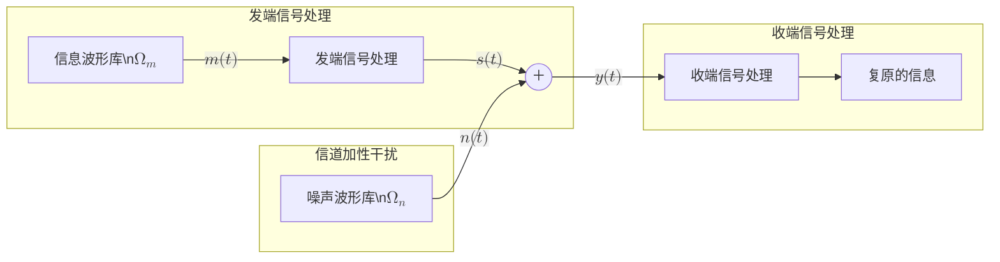
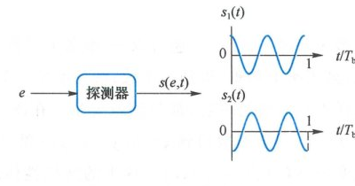
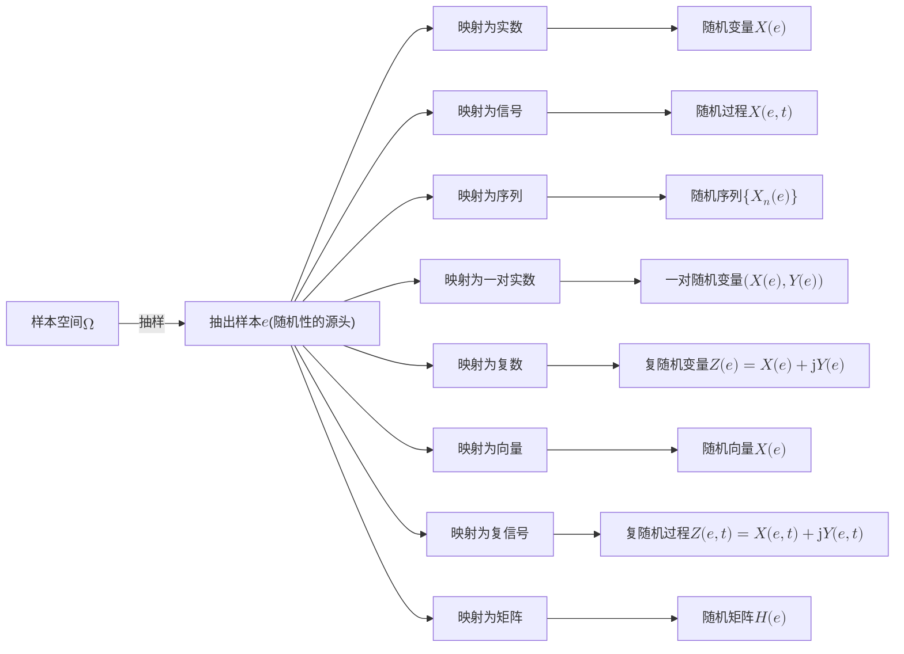

import Knowledge from '@/components/Knowledge.astro';
import Example from '@/components/Example.astro';
import Solution from '@/components/Solution.astro';

## 3.1.1 引言

某无线通信系统欲将话音信号 $m(t)$ 传输到远处。为此，系统的发端将 $m(t)$ 变成一个能通过天线发射的带通信号 $s(t)$，收端将天线收到的微弱信号放大，得到：

$$
y(t) = s(t) + n(t) \tag{3.1.1}
$$

其中 $n(t)$ 是噪声。收端从 $y(t)$ 中复原出话音信号，送入扬声器播放。

在系统的设计阶段，$m(t)$、$n(t)$ 等波形还没有产生（它们要等到系统投入使用后才会出现）。任意给定一个时刻 $t$，设计者不能明确给出函数 $m(t)$、$n(t)$ 的具体取值，其值具有不确定性、随机性，因此它们不是确定信号，而是随机信号。

系统的设计者只知道 $m(t)$ 是话音，$n(t)$ 是噪声，不知道话音和噪声的具体波形。令 $\Omega_m$ 和 $\Omega_n$ 分别表示全体话音波形及全体噪声波形的集合，则 $m(t)$ 来自 $\Omega_m$，$n(t)$ 来自 $\Omega_n$，该系统可以表示为下图所示结构。系统应能有效传输 $\Omega_m$ 中的话音，并能有效抵抗 $\Omega_n$ 中噪声的影响。设计者根据 $\Omega_m$ 和 $\Omega_n$ 中波形的整体特性来设计发端和收端的信号处理。



<div style="text-align: center; color: var(--sl-color-gray-3); font-size: 0.875rem; margin-top: -0.5rem; margin-bottom: 1.5rem;">图 3.1.1 通信中的随机信号</div>

## 3.1.2 随机变量

通信中的随机信号在数学中就是随机过程。为了理解随机过程的概念，我们先回顾随机变量。在概率论中，随机变量定义为从样本空间 $\Omega$ 到实数的映射：

$$
X = X(e), \quad e \in \Omega
$$

为了更好地理解这一点，我们来看一个随机试验的例子。

<Example id="3.1.1" title="纸条抽样与随机变量">
一个口袋里有很多纸条，伸手抽出一张，翻开一看，纸条上写着 3.14。

口袋就是样本空间，纸条就是样本 $e$，在纸条上写数，就是把样本映射到实数，这个映射就是随机变量。

将纸条映射到实数，写数不是唯一的方法，还可以是：纸条上写数学方程，抽到纸条后解方程，报出方程的解；把纸条放到天平上称重，得到一个数；纸条上是一个门牌号码，到这家，数家里有几只猫。总之，**任何从样本到实数的映射，都是随机变量**。

抽出纸条 $e$ 见到一个数 $x$，将其平方得到 $y = x^2$，再取对数得到 $z = \ln y$。$x, y, z$ 都是从抽出的这个纸条 $e$ 映射而来的，相应形成了随机变量 $X(e), Y(e), Z(e)$。这里的随机性体现在样本点的出现是随机的。一旦样本给定，结果就是确定的。
</Example>


<div style="text-align: center; color: var(--sl-color-gray-3); font-size: 0.875rem; margin-top: -0.5rem; margin-bottom: 1.5rem;">图 3.1.2 随机变量是样本到实数的映射</div>

随机变量是一种映射，其记号 $X(e)$ 中的 $X$ 是映射的名称，如同 $\sin(x)$ 中的 $\sin$ 是函数名。大部分情况下，我们关注的不是纸条，而是纸条所决定的那个数，故常将 $X(e)$ 简记为 $X$，并把 $X$ 的全体可能取值作为样本空间。例如，若口袋中有两个纸条，分别写着 $-2$ 和 $+3$。从两张纸条 $e_1, e_2$ 中抽出了一个 $e \in \{e_1, e_2\}$，抽出的这个纸条决定了 $X(e)$ 是 $-2$ 还是 $+3$，进一步决定了 $Y(e)$ 是 $4$ 还是 $9$，$Z(e)$ 是 $2\ln 2$ 还是 $2\ln 3$。实际中，大家对随机变量的理解比较直接：从 $\Omega_X = \{-2, +3\}$ 中抽出了 $X$，从 $\Omega_Y = \{4, 9\}$ 中抽出了 $Y$，从 $\Omega_Z = \{2\ln 2, 2\ln 3\}$ 中抽出了 $Z$。

另外需要说明的是，概率论教材中一般用大写字母表示随机变量（映射），小写字母表示随机变量的具体实现（映射结果）。在本书中，大小写字母都可以用于表示随机变量。

## 3.1.3 随机过程

在数学中，随机过程有以下两种实质相同的定义：

<Knowledge id="3.1.1" title="随机过程的两种等价定义">
**定义 1（确定函数族视角）**：在随机试验中，设其样本空间为 $\Omega$，若对每一个 $e \in \Omega$，都对应一个确定函数 $X(e,t), t \in \mathcal{T}$，我们把全体 $e$ 所确定的函数族

$$
\{X(e,t), t \in \mathcal{T} \mid e \in \Omega\}
$$

称为**随机过程**，函数族中的每个函数称为一个**样本函数**（Sample Function），或一条**样本轨道**。

**定义 2（随机变量族视角）**：在随机试验中，对于每一个参数 $t \in \mathcal{T}$，都对应一个随机变量 $X(e,t), e \in \Omega$，全体依赖于 $t$ 的一族随机变量称为**随机过程**。
</Knowledge>

以上两个定义实质相同，均表示从 $e \in \Omega, t \in \mathcal{T}$ 到实数的映射。$\Omega$ 是随机实验的样本空间，$\mathcal{T}$ 是样本函数的定义域。默认 $\mathcal{T} = (-\infty, \infty)$，而当 $\mathcal{T}$ 为离散的时间点集合时，称为随机序列。随机过程 $X(e,t)$ 也可简记为 $X(t)$。

- **定义 1 是信号的视角**：表示随机试验的结果是确定波形（翻开纸条看见的不是数字，而是波形）。这使我们能够用第 2 章中确定信号分析的方法来研究随机过程。
- **定义 2 是随机变量的视角**：使我们可以用概率论的方法来研究随机过程。

<Example id="3.1.2" title="简单随机过程二值信号">
一探测器在时间区间 $[0, T_b]$ 内发出信号：

$$
s_1(t) = \cos(2\pi f_0 t) \quad \text{或} \quad s_2(t) = -\cos(2\pi f_0 t)
$$

以表示探测结果为 $e = 1$ 或 $e = 0$，其中 $e = 1$ 表示环境中存在某种特定成分，$e = 0$ 表示不存在。本例中，样本点 $e$ 是环境的状态，样本空间为 $e \in \{0, 1\}$。探测器将 $e$ 映射为波形 $s(e,t)$。$e = 1$ 时，$s(1,t) = s_1(t)$；$e = 0$ 时，$s(0,t) = s_2(t)$。
</Example>

<div style="text-align: center; margin: 1.5rem 0;">
  




  <div style="color: var(--sl-color-gray-3); font-size: 0.875rem; margin-top: 0.5rem;">图 3.1.3 简单随机过程示例</div>
</div>

随机过程 $X(e,t)$ 的变量 $e$ 体现信号的随机性，变量 $t$ 反映信号随时间的变化：
- 给定 $e$，$X(e,t)$ 是确定信号——抽出了一个纸条，看到了一个明确的波形；
- 给定 $t$，$X(e,t)$ 是随机变量——指定了某个时刻，但没说是哪个纸条，因此数值不确定，有随机性。

下表总结了 $X(e,t)$ 的 4 种不同情况：

| $e, t$ | $X(e,t)$ | 随机性 | 物理本质 |
| :--- | :--- | :--- | :--- |
| $e \in \Omega, t \in (-\infty, \infty)$ | 随机信号 | 随机 | 完整的随机过程族 |
| $e$ 固定, $t \in (-\infty, \infty)$ | 确定信号 | 非随机 | 某次试验的一条样本轨道 |
| $e \in \Omega, t$ 固定 | 随机变量 | 随机 | 某一特定时刻的随机截面 |
| $e$ 固定, $t$ 固定 | 确定实数 | 非随机 | 某条轨道在特定时刻的确定取值 |

<div style="text-align: center; color: var(--sl-color-gray-3); font-size: 0.875rem; margin-top: -0.5rem; margin-bottom: 1.5rem;">表 3.1.1 $X(e,t)$ 的不同情况</div>

<Example id="3.1.3" title="带通随机信号的同相/正交分量分解">
信号采集单元对空中信号 $x(e,t)$ 进行采集。采集单元的输出是复数格式的复包络。每执行一次信号采集就是一次随机试验。对采集到的复包络分别取出实部、虚部、模值和角度，形成 4 个基带型的随机信号 $x_c(e,t)$、$x_s(e,t)$、$A(e,t)$、$\varphi(e,t)$。略去代表样本的变量 $e$，则为 $x_c(t), x_s(t), A(t), \varphi(t)$。
</Example>

```mermaid
flowchart LR
    ant(("天线")) -->|"$$x(e,t)$$\n$$x(t)$$"| sdr["软件无线电\n信号采集"]
    sdr -->|"$$x_L(e,t)$$\n$$x_L(t)$$"| split{"分解"}
    split -->|"取角度"| p["$$\\varphi(e,t), \\varphi(t)$$"]
    split -->|"取模"| a["$$A(e,t), A(t)$$"]
    split -->|"取实部"| xc["$$x_c(e,t), x_c(t)$$"]
    split -->|"取虚部"| xs["$$x_s(e,t), x_s(t)$$"]
```

<div style="text-align: center; color: var(--sl-color-gray-3); font-size: 0.875rem; margin-top: -0.5rem; margin-bottom: 1.5rem;">图 3.1.4 带通随机信号</div>

## 3.1.4 随机序列

按前述定义，**随机序列**是随机过程 $X(e,t), t \in \mathcal{T}$ 的时间参数 $\mathcal{T}$ 为离散时间点集合时的特例，一般记为 $\{X_n(e)\}$，简记为 $\{X_n\}$。随机序列 $\{X_n(e)\}$ 是从样本空间 $\Omega$ 到实数序列的映射，如同翻开纸条看见的不是一个数字，而是一串数字。

随机序列可以是有限长序列，如 $\{X_1, X_2, \dots, X_N\}$，此时也可称为**随机向量**，并记为：

$$
\mathbf{X} = (X_1, X_2, \dots, X_N)^T
$$

对于无限长序列，$X_n$ 的下标可以是自然数 $n \in \{0, 1, 2, \dots\}$，也可以是整数 $n = 0, \pm 1, \pm 2, \dots$。

随机序列是时间离散的随机过程，可看成是时间连续随机过程 $X(t)$ 的采样。对于一组有限个或无限个时间点 $\{t_k\}$，令 $X_k = X(t_k)$ 表示 $X(t)$ 在 $t_k$ 时刻的采样，则 $\{X_k\}$ 是随机序列。

以上介绍的随机变量、随机过程、随机序列都是从样本出发的映射，差别只在映射到什么，也就是纸条上具体是什么：
- 纸条上是实数就是随机变量；
- 纸条上是信号波形就是随机过程；
- 纸条上是离散数组就是随机序列。

各种常见数学对象的映射关系归纳如下图所示：



<div style="text-align: center; color: var(--sl-color-gray-3); font-size: 0.875rem; margin-top: -0.5rem; margin-bottom: 1.5rem;">图 3.1.5 随机数学对象的映射统一视角</div>
