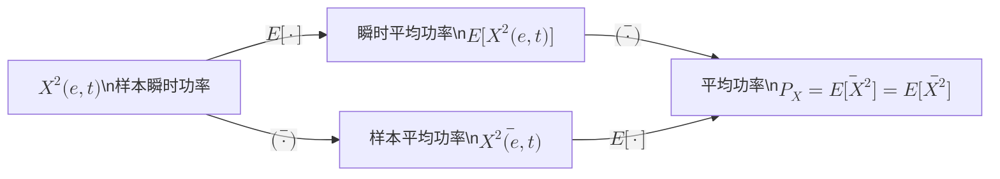
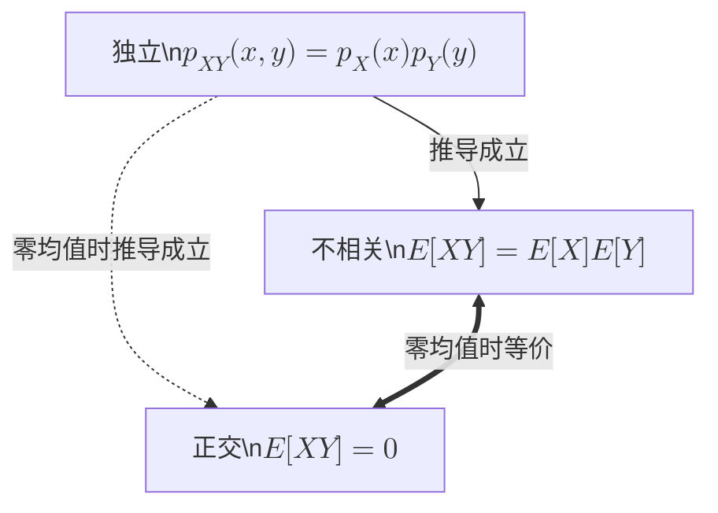

import Knowledge from '@/components/Knowledge.astro';
import Example from '@/components/Example.astro';
import Solution from '@/components/Solution.astro';

如前所述，随机过程在任何具体的时刻都是随机变量。随机过程就是沿时间轴排列的无数个随机变量。随机过程的统计特性就是这些随机变量的统计特性。

## 3.2.1 概率分布

### 1. 事件的概率

概率是概率论的核心概念，反映事件在随机试验中出现的可能性。基于大数定律，事件 $A$ 的概率可以通过大量的随机试验来测量：

$$
P(A) = \lim_{N \to \infty} \frac{N_A}{N} \tag{3.2.1}
$$

其中 $N$ 是试验次数，$N_A$ 是 $N$ 次试验中事件 $A$ 发生的次数。式 (3.2.1) 是计算机仿真以及通信仪表（如误码仪）中测量概率的基本原理。这里的极限是概率意义上的极限。

通信中经常需要考虑多个随机事件。两个事件 $A, B$ 的联合概率 $P(A, B)$ 是它们同时发生的机会。条件概率 $P(B|A)$ 是事件 $A$ 已发生的情况下，事件 $B$ 发生的机会。联合概率满足如下链式法则：

$$
P(A, B) = P(A)P(B|A) = P(B)P(A|B) \tag{3.2.2}
$$

根据上式可以给出条件概率与联合概率的关系：$P(B|A) = P(A,B)/P(A)$，$P(A|B) = P(A,B)/P(B)$，同时可以给出两个条件概率之间的关系，即**贝叶斯（Bayes）公式**：

$$
P(A|B) = P(B|A) \frac{P(A)}{P(B)} \tag{3.2.3}
$$

如果事件 $A$ 发生的概率不受事件 $B$ 影响，则称事件 $A$ 与 $B$ **独立**。此时必有：

$$
P(A|B) = P(A), \quad P(B|A) = P(B), \quad P(A,B) = P(A)P(B)
$$

即两个事件独立意味着条件概率等于无条件概率、联合概率等于各自概率的乘积。

<Example id="3.2.1" title="复包络象限判定中的概率计算">
给定时刻 $t_0$，定义事件 $A$ 为“同相分量 $x_c(t_0) > 0$”，事件 $B$ 为“正交分量 $x_s(t_0) > 0$”，则联合概率 $P(A,B)$ 就是复包络 $x_L(t) = x_c(t) + \mathrm{j}x_s(t)$ 在 $t_0$ 时刻位于第 1 象限的概率。条件概率 $P(B|A)$ 就是已知 $t_0$ 时刻复包络 $x_L(t_0)$ 位于右半平面的情况下，$x_L(t_0)$ 落在第 1 象限的概率。

若有 10 万条记录，其中 $t_0$ 时刻同相分量大于零的记录有 2 万条，则基于大数定律，可近似认为 $P(A) = 0.2$。若在这 2 万条记录中，有 5000 条记录在 $t_0$ 时刻的正交分量大于零，则 $P(B|A) = 0.25$。10 万条记录中，复包络在 $t_0$ 时刻位于第 1 象限的记录有 5000 条：

$$
P(A,B) = 0.05 = P(B|A)P(A)
$$
</Example>

### 2. 随机变量的概率分布

随机变量的概率分布主要指概率质量函数（Probability Mass Function, PMF）、概率密度函数（Probability Density Function, PDF）和累积分布函数（Cumulative Distribution Function, CDF）。下表列出了通信中常用的一些概率分布：

| 分布名称 | PMF / PDF | 均值 $m_X$ | 方差 $\sigma_X^2$ |
| :--- | :--- | :---: | :---: |
| **伯努利分布** | $P(X=1) = p, \; P(X=0) = 1-p$ | $p$ | $p(1-p)$ |
| **二项分布** | $P(X=k) = \binom{n}{k} p^k(1-p)^{n-k}, \; k=0,1,2,\dots,n$ | $np$ | $np(1-p)$ |
| **泊松分布** | $P(X=k) = \frac{\lambda^k \mathrm{e}^{-\lambda}}{k!}, \; k=0,1,2,\dots$ | $\lambda$ | $\lambda$ |
| **均匀分布** | $p(x) = \frac{1}{b-a}, \; x \in [a, b]$ | $\frac{a+b}{2}$ | $\frac{1}{12}(b-a)^2$ |
| **高斯分布** $\mathcal{N}(a, \sigma^2)$ | $p(x) = \frac{1}{\sqrt{2\pi\sigma^2}} \mathrm{e}^{-\frac{(x-a)^2}{2\sigma^2}}$ | $a$ | $\sigma^2$ |
| **指数分布** | $p(x) = \lambda \mathrm{e}^{-\lambda x}, \; x \ge 0$ | $\frac{1}{\lambda}$ | $\frac{1}{\lambda^2}$ |
| **瑞利分布** | $p(x) = \frac{x}{\sigma^2} \mathrm{e}^{-\frac{x^2}{2\sigma^2}}, \; x \ge 0$ | $\sqrt{\frac{\pi\sigma^2}{2}}$ | $\frac{4-\pi}{2}\sigma^2$ |
| **莱斯分布** | $p(x) = \frac{x}{\sigma^2}\mathrm{e}^{-\frac{x^2+A^2}{2\sigma^2}} I_0\left(\frac{Ax}{\sigma^2}\right), \; x \ge 0$   莱斯因子 $K = \frac{A^2}{2\sigma^2}$ | $\sqrt{\frac{\pi\sigma^2}{2}} L_{1/2}\left(-\frac{A^2}{2\sigma^2}\right)$ | $2\sigma^2 + A^2 - m_X^2$ |

表 3.2.1 常用概率分布

> **注**：莱斯分布中 $I_0(\cdot)$ 是第一类零阶修正贝塞尔函数，$L_q(\cdot)$ 是拉盖尔多项式函数。当 $A/\sigma$ 很大时，莱斯分布可近似为高斯分布 $\mathcal{N}(A, \sigma^2)$；当 $A = 0$ 时，莱斯分布退化为瑞利分布。

概率质量函数是对离散随机变量各可能取值的出现概率的枚举，即对 $X$ 的每个可能取值 $x_0, x_1, \dots, x_{M-1}$，逐一列出概率 $P(X=x_k), k=0,1,\dots,M-1$。概率质量函数也称为分布列。

<Example id="3.2.2" title="纠错编码数据包丢包率计算">
某通信系统发送的数据包有 $n = 100$ 比特。到达接收端时，数据包中可能有一些比特出错，假设错误比特数 $X$ 服从二项分布，其中 $p = 0.01$。假设该系统采用了某种信道编码技术，使得错误比特数在 $X = 0, 1, 2, \dots, t$ 范围内时，接收端可以完全纠正错误，而当错误比特数超过 $t$ 时，只能丢包。求 $t = 2$ 及 $t = 6$ 情况下，丢包的概率。
</Example>

<Solution>
丢包概率为：

$$
P_{\text{loss}} = 1 - \sum_{k=0}^t P(X=k) = 1 - \sum_{k=0}^t \binom{n}{k} p^k(1-p)^{n-k}
$$

代入 $n = 100, p = 0.01$ 后可以算出：
- $t = 2$ 时丢包率约为 $8\%$；
- $t = 6$ 时丢包率约为 $7.1 \times 10^{-5}$。
</Solution>

连续随机变量做不到逐一列举每个可能取值的出现概率（每个特定取值的概率为零），改用概率的密度。若随机变量 $X$ 的概率密度函数为 $p_X(x)$，则对于充分小的区间 $[x, x+\Delta x]$（$x$ 为 $p_X(x)$ 的连续点），$X$ 落在该区间内的概率近似为 $p_X(x)\Delta x$。密度的积分是总量，$p_X(x)$ 对所有 $x$ 积分的结果是 1。

离散随机变量的每个可能取值有相应的概率值，相应的概率密度无穷大，呈现为冲激函数。例如伯努利分布的概率密度函数为：

$$
p_X(x) = p\delta(x-1) + (1-p)\delta(x) \tag{3.2.4}
$$

这一点类似于物理中的质点，其质量集中在一个点上，质量密度是冲激；也类似于确定信号中的复单频信号，其功率集中在一个频率点上，功率谱密度是冲激。

无论是离散随机变量还是连续随机变量，$X$ 的取值不超过 $x$ 的概率是累积分布函数，其导数是概率密度函数：

$$
F_X(x) = P(X \le x) = \int_{-\infty}^x p_X(u)\,\mathrm{d}u \tag{3.2.5}
$$

$$
p_X(x) = \frac{\mathrm{d}}{\mathrm{d}x}F_X(x) \tag{3.2.6}
$$

设有两个连续随机变量 $X, Y$。令 $A$ 表示事件“$X$ 落在区间 $[x, x+\Delta x]$”，$B$ 表示事件“$Y$ 落在区间 $[y, y+\Delta y]$”，则对于充分小的 $\Delta x, \Delta y$（$\Delta x > 0, \Delta y > 0$），联合概率 $P(A, B)$ 近似是 $p_{X,Y}(x,y)\Delta x\Delta y$，条件概率 $P(A|B)$ 近似是 $p_{X|Y}(x|y)\Delta x$，其中的 $p_{X,Y}(x,y)$ 是联合概率密度，也叫二维概率密度，$p_{X|Y}(x|y)$ 是条件概率密度。代入式 (3.2.2) 后，联合概率密度可表示为：

$$
p_{X,Y}(x,y) = p_X(x)p_{Y|X}(y|x) = p_Y(y)p_{X|Y}(x|y) \tag{3.2.7}
$$

事件“$X$ 不超过 $x$”与事件“$Y$ 不超过 $y$”的联合概率是 $X, Y$ 的联合累积分布函数，也称为二维累积分布函数，其二阶偏导是联合概率密度：

$$
F_{X,Y}(x,y) = P(X \le x, Y \le y) \tag{3.2.8}
$$

$$
p_{X,Y}(x,y) = \frac{\partial^2}{\partial x\partial y}F_{X,Y}(x,y) \tag{3.2.9}
$$

两个随机变量 $X, Y$ 独立表现为联合概率密度等于各自概率密度的乘积：$p_{X,Y}(x,y) = p_X(x)p_Y(y)$，条件概率密度与条件无关：$p_{Y|X}(y|x) = p_Y(y)$。

在不致混淆的情况下，概率密度函数记号中的下标可以省略，如用 $p(x,y), p(y|x)$ 分别表示 $p_{X,Y}(x,y)$ 和 $p_{Y|X}(y|x)$。

### 3. 随机过程的概率分布

随机过程在任何时刻都是随机变量，这些随机变量未必分布相同。时刻 $t$ 的随机变量 $X(e,t)$ 的累积分布函数记为 $F_X(x,t)$，概率密度函数记为 $p_X(x,t)$。$F_X(x,t)$ 与 $p_X(x,t)$ 只涉及 $t$ 时刻这一个随机变量，是随机过程的**一维概率分布**。

<Example id="3.2.3" title="二值波形随机过程的一维概率密度">
考虑前面探测器发出的二值随机过程 $X(t) \in \{s_1(t), s_2(t)\}$。对于任意时刻 $t \in [0, T_b]$，$X(t)$ 有两种可能取值：$s_1(t) = \cos(2\pi f_0 t)$ 或 $s_2(t) = -\cos(2\pi f_0 t)$，是离散随机变量。若抽中 $s_1(t)$ 的机会是 $3/4$，则 $X(t)$ 在 $t$ 时刻的一维概率密度函数为：

$$
p_X(x,t) = \frac{3}{4}\delta\big(x - \cos(2\pi f_0 t)\big) + \frac{1}{4}\delta\big(x + \cos(2\pi f_0 t)\big) \tag{3.2.10}
$$
</Example>

任意给定两个时刻 $t_1, t_2$，$X_1 = X(e, t_1)$ 与 $X_2 = X(e, t_2)$ 是两个随机变量。所取时间 $t_1, t_2$ 不同，则随机变量不同，联合分布也不同。记 $t_1, t_2$ 时刻的两个随机变量 $X_1, X_2$ 的联合累积分布函数为 $F_X(x_1, x_2, t_1, t_2)$，联合概率密度为 $p_X(x_1, x_2, t_1, t_2)$，它们是 $X(e,t)$ 的**二维概率分布**。

扩展到 $n$ 维，随机过程 $X(t)$ 的 $n$ 维联合累积分布函数是任意 $n$ 个时刻 $t_1, t_2, \dots, t_n$ 上的 $n$ 个随机变量 $X_1 = X(t_1), X_2 = X(t_2), \dots, X_n = X(t_n)$ 的联合累积分布函数：

$$
F_X(x_1, x_2, \dots, x_n, t_1, t_2, \dots, t_n) = P(X_1 \le x_1, X_2 \le x_2, \dots, X_n \le x_n) \tag{3.2.11}
$$

相应的 $n$ 维联合概率密度为：

$$
p_X(x_1, x_2, \dots, x_n, t_1, t_2, \dots, t_n) = \frac{\partial^n}{\partial x_1 \partial x_2 \cdots \partial x_n} F_X(x_1, x_2, \dots, x_n, t_1, t_2, \dots, t_n) \tag{3.2.12}
$$

考虑两个随机过程 $X(t), Y(t)$。在 $X(t)$ 上任取 $n$ 个随机变量 $X_1 = X(t_1), \dots, X_n = X(t_n)$，在 $Y(t)$ 上任取 $m$ 个随机变量 $Y_1 = Y(t'_1), \dots, Y_m = Y(t'_m)$，这 $n+m$ 个随机变量的联合累积分布函数为：

$$
\begin{aligned}
& F_{XY}(x_1, \dots, x_n, t_1, \dots, t_n; y_1, \dots, y_m, t'_1, \dots, t'_m) \\
& = P(X_1 \le x_1, \dots, X_n \le x_n; Y_1 \le y_1, \dots, Y_m \le y_m)
\end{aligned} \tag{3.2.13}
$$

联合概率密度函数为：

$$
p_{XY} = \frac{\partial^{n+m}}{\partial x_1 \cdots \partial x_n \partial y_1 \cdots \partial y_m} F_{XY} \tag{3.2.14}
$$

两个随机过程**相互独立**时，联合分布等于各自联合分布之积，即对任意正整数 $n, m$ 以及任意时刻 $t_1, \dots, t_n, t'_1, \dots, t'_m$，有：

$$
F_{XY}(x_1, \dots, x_n, t_1, \dots, t_n; y_1, \dots, y_m, t'_1, \dots, t'_m) = F_X(x_1, \dots, x_n, t_1, \dots, t_n) F_Y(y_1, \dots, y_m, t'_1, \dots, t'_m) \tag{3.2.15}
$$

## 3.2.2 数字特征

### 1. 统计平均（数学期望）

随机过程 $X(e,t)$ 有 $e, t$ 两个变量，对其取平均有按 $e$ 取平均和按 $t$ 取平均两种情况。固定 $t$，对随机变量 $X(e,t)$ 的各种可能结果（对应不同 $e$）取平均，平均结果叫**统计平均值**、**均值**或**数学期望**。

根据概率论，若 $X(e) \in \{a_1, a_2, \dots, a_M\}$ 是离散随机变量，其各可能取值的出现概率依次为 $p_1, p_2, \dots, p_M$，则 $X$ 的数学期望为：

$$
\mathbb{E}[X] = \sum_{i=1}^M a_i p_i \tag{3.2.16}
$$

若 $X(e)$ 是连续随机变量，其概率密度函数为 $p_X(x)$，则 $X$ 的数学期望为：

$$
\mathbb{E}[X] = \int_{-\infty}^\infty x p_X(x)\,\mathrm{d}x \tag{3.2.17}
$$

随机变量的均值可能是零，也可能不是零。均值不为零的随机变量可看成是零均值随机变量叠加了常数：

$$
X = \widetilde{X} + m_X \tag{3.2.18}
$$

其中 $m_X = \mathbb{E}[X]$ 是 $X$ 的均值，$\widetilde{X} = X - m_X$ 是从 $X$ 中扣除了均值，$\mathbb{E}[\widetilde{X}] = \mathbb{E}[X] - m = 0$。

工程中测量数学期望的基本原理是大数定律，即用 $N$ 次随机试验的结果 $x_1, x_2, \dots, x_N$ 取平均来逼近数学期望：

$$
\mathbb{E}[X] = \lim_{N \to \infty} \frac{1}{N}\sum_{i=1}^N x_i \tag{3.2.19}
$$

设 $y = g(x)$ 是确定函数，则 $Y(e) = g[X(e)]$ 是随机变量。$Y$ 的数学期望可以用 $X$ 的概率密度来计算：

$$
\mathbb{E}[Y] = \int_{-\infty}^\infty g(x) p_X(x)\,\mathrm{d}x \tag{3.2.20}
$$

若 $Y(e) = a \cdot X(e) + c$，其中的 $a, c$ 与 $e$ 无关（即不是随机变量），则：

$$
\mathbb{E}[Y] = \mathbb{E}[a X(e) + c] = a \mathbb{E}[X(e)] + c \tag{3.2.21}
$$

也就是说，数学期望作用于 $e$，与 $e$ 无关的加性或乘性系数都可以提到 $\mathbb{E}[\,\cdot\,]$ 的外面。

$Y = (X - m_X)^2$ 是随机变量 $X$ 的函数，其数学期望反映随机变量 $X$ 中围绕均值的波动部分 $\widetilde{X} = X - m_X$ 的强弱，称为 $X$ 的**方差**：

$$
\sigma_X^2 = \mathbb{E}[(X - m_X)^2] = \mathbb{E}[X^2] - m_X^2 \tag{3.2.22}
$$

方差也可记为 $\mathrm{Var}(X)$ 或 $D(X)$。$\sigma_X$ 称为标准差，$\mathbb{E}[X^2]$ 称为 $X$ 的**二阶矩**。

设 $a$ 是常数，随机变量 $X/a$ 的均值为 $\mathbb{E}[X/a] = m_X/a$，二阶矩为 $\mathbb{E}[(X/a)^2] = \mathbb{E}[X^2]/a^2$，方差为 $\sigma_X^2/a^2$。随机变量 $X$ 除以标准差 $\sigma_X$ 后，$X/\sigma_X$ 的方差是 1。令 $\widetilde{X} = (X - m_X)/\sigma_X$，则 $\widetilde{X}$ 是将 $X$ 的均值归零、方差归 1，称为 $X$ 的**标准化**。

随机过程 $X(e,t)$ 在每个时刻都是随机变量，随机过程的数学期望就是这些随机变量的数学期望。不同时刻的数学期望未必相同，一般情况下是 $t$ 的函数：

$$
\mathbb{E}[X(e,t)] = \int_{-\infty}^\infty x p_X(x,t)\,\mathrm{d}x = m_X(t) \tag{3.2.23}
$$

统计平均是按 $e$ 平均，$X(e,t)$ 按 $e$ 取平均将消掉 $e$、只剩下 $t$，说明**随机信号的数学期望是确定信号**。

零均值随机过程对所有 $t$ 恒有 $\mathbb{E}[X(e,t)] = 0$。若 $X(e,t)$ 的均值不为零，可将其分解为一个零均值随机过程与一个确定信号之和：

$$
X(e,t) = \widetilde{X}(e,t) + m_X(t) \tag{3.2.24}
$$

### 2. 时间平均

不妨假设随机过程 $X(e,t)$ 的每个样本函数都是功率信号。给定样本 $e$ 时，样本函数 $X(e,t)$ 是确定信号，其时间平均为：

$$
\overline{X(e,t)} = \lim_{T \to \infty} \left\{ \frac{1}{T}\int_{-T/2}^{T/2} X(e,t)\,\mathrm{d}t \right\} \tag{3.2.25}
$$

上式右边是一个与 $t$ 无关、与 $e$ 有关的实数，即 $\overline{X(e,t)}$ 是一个**随机变量**。

<Example id="3.2.4" title="统计平均与时间平均的本质区别">
设有随机信号 $X(e,t) = Z(e) \cdot \cos^2(2\pi t) + \sin(2\pi t)$，其中 $Z(e)$ 是零均值随机变量。

**统计平均**为：

$$
\begin{aligned}
\mathbb{E}[X(e,t)] &= \mathbb{E}\big[Z(e)\cos^2(2\pi t) + \sin(2\pi t)\big] \\
&= \mathbb{E}[Z(e)] \cdot \cos^2(2\pi t) + \sin(2\pi t) \\
&= \sin(2\pi t)
\end{aligned} \tag{3.2.26}
$$

统计平均 $\mathbb{E}[\,\cdot\,]$ 是对 $e$ 操作，把与 $e$ 无关的 $\cos^2(2\pi t)$ 提到了外边。对 $e$ 取平均后的结果与 $e$ 无关，故统计平均的结果 $\sin(2\pi t)$ 是**非随机的确定函数**。

**时间平均**为：

$$
\begin{aligned}
\overline{X(e,t)} &= \overline{Z(e) \cdot \cos^2(2\pi t) + \sin(2\pi t)} \\
&= Z(e) \cdot \overline{\cos^2(2\pi t)} + \overline{\sin(2\pi t)} \\
&= \frac{1}{2}Z(e)
\end{aligned} \tag{3.2.27}
$$

时间平均 $\overline{(\,\cdot\,)}$ 是对 $t$ 操作，把与 $t$ 无关的 $Z(e)$ 提到了外边。对 $t$ 取平均后的结果与 $t$ 无关但与 $e$ 有关，所以时间平均的结果 $\frac{1}{2}Z(e)$ 是**与 $t$ 无关的随机变量**。
</Example>

### 3. 功率

考虑随机过程的实现（样本函数）为电压信号。对于给定的 $e$ 和 $t$，$X(e,t)$ 是一个确定的电压值，其平方 $X^2(e,t)$ 是样本 $e$ 抽到的波形在 $t$ 时刻的瞬时功率。

- 对瞬时功率 $X^2(e,t)$ 按 $e$ 取平均是二阶矩 $\mathbb{E}[X^2(e,t)]$，它是所有样本函数在 $t$ 时刻瞬时功率的统计平均。$\mathbb{E}[X^2(e,t)]$ 与 $e$ 无关，与 $t$ 有关，再按 $t$ 取平均便得到随机过程 $X(e,t)$ 的平均功率 $P_X = \overline{\mathbb{E}[X^2(e,t)]}$。
- 对瞬时功率 $X^2(e,t)$ 按 $t$ 取平均，$\overline{X^2(e,t)}$ 是样本 $e$ 所抽出的确定信号的平均功率。$\overline{X^2(e,t)}$ 与 $t$ 无关，与 $e$ 有关，是一个随机变量，表示不同样本信号有不同的功率。对 $\overline{X^2(e,t)}$ 按 $e$ 取平均同样得到随机过程的平均功率 $P_X = \mathbb{E}[\overline{X^2(e,t)}]$。

随机信号 $X(e,t)$ 的平均功率是瞬时功率 $X^2(e,t)$ 同时做时间平均和统计平均。**两个平均可以交换次序**：

$$
P_X = \overline{\mathbb{E}[X^2(e,t)]} = \mathbb{E}\left[\,\overline{X^2(e,t)}\,\right] \tag{3.2.28}
$$

图 3.2.1 平均功率是瞬时功率的双重平均值

如果 $X(e,t)$ 的统计平均值 $\mathbb{E}[X(e,t)] = m_X(t) \ne 0$，根据式 (3.2.24)，可将 $X(e,t)$ 看成是确定信号 $m_X(t)$ 叠加了零均值随机信号 $\widetilde{X}(e,t)$。$\widetilde{X}(e,t)$ 按 $e$ 平均的功率是 $X(e,t)$ 的方差：

$$
\sigma_X^2(t) = \mathbb{E}\big[\big(X(e,t) - m_X(t)\big)^2\big] = \mathbb{E}[X^2(e,t)] - m_X^2(t) \tag{3.2.29}
$$

对 $\mathbb{E}[X^2(e,t)] = \sigma_X^2(t) + m_X^2(t)$ 做时间平均是 $X(e,t)$ 的功率：

$$
P_X = \mathbb{E}\big[\,\overline{(\widetilde{X}(e,t) + m_X(t))^2}\,\big] = \overline{\sigma_X^2(t)} + \overline{m_X^2(t)} \tag{3.2.30}
$$

结果说明，**随机过程的功率可分成两部分：一部分是均值 $m_X(t)$ 的确定功率，另一部分是零均值随机波动信号 $\widetilde{X}(e,t)$ 的功率**。

<Example id="3.2.5" title="双重平均计算随机信号功率">
设 $X(e,t) = Z(e) \cdot \cos^2(2\pi t) + \sin(2\pi t)$，其中 $Z$ 在区间 $[-1, 1]$ 上均匀分布。求 $X(e,t)$ 的平均功率。
</Example>

<Solution>
由 $\mathbb{E}[Z(e)] = 0$ 可知 $\mathbb{E}[Z(e)\cos^2(2\pi t)] = 0$，即 $X(e,t)$ 是 $\sin(2\pi t)$ 叠加了零均值随机过程 $Z(e)\cos^2(2\pi t)$。

$\sin(2\pi t)$ 的功率是 $0.5$。而 $Z(e)\cos^2(2\pi t) = \frac{1}{2}Z(e)[1 + \cos(4\pi t)]$ 的平均功率是：

$$
\begin{aligned}
\mathbb{E}\left[\frac{1}{4}Z^2(e)\big(1 + \cos(4\pi t)\big)^2\right] &= \frac{1}{4}\mathbb{E}\big[Z^2(e)\big] \cdot \overline{\left[1 + 2\cos(4\pi t) + \frac{1}{2} + \frac{1}{2}\cos(8\pi t)\right]} \\
&= \frac{1}{4}\mathbb{E}\big[Z^2(e)\big] \cdot \frac{3}{2} = \frac{1}{4} \cdot \frac{1}{3} \cdot \frac{3}{2} = \frac{1}{8}
\end{aligned}
$$

故 $X(e,t)$ 的总平均功率是：

$$
P_X = \frac{1}{8} + \frac{1}{2} = \frac{5}{8}
$$
</Solution>

## 3.2.3 相关函数

### 1. 随机变量的内积

两个随机变量 $X, Y$ 的内积定义为乘积的数学期望：

$$
\langle X, Y \rangle = \mathbb{E}[XY] \tag{3.2.31}
$$

这个操作也称为 $X, Y$ 的相关运算，其结果也称为 $X, Y$ 的相关值。
- 随机变量 $X$ 与自身的内积是二阶矩 $\mathbb{E}[X^2]$。
- 两个随机变量扣除均值后的内积是协方差：

$$
\mathrm{Cov}(X,Y) = \mathbb{E}[(X - m_X)(Y - m_Y)] \tag{3.2.32}
$$

当 $X = Y$ 时，协方差成为方差 $\sigma_X^2 = \mathbb{E}[(X - m_X)^2]$。

若 $X, Y$ 表示信号电压，则 $X^2$ 是功率，二阶矩 $\mathbb{E}[X^2]$ 是平均功率。对零均值随机变量，平均功率等于方差：$\mathbb{E}[X^2] = \sigma_X^2$。

既然 $X$ 与自身的内积（二阶矩）是功率，那么 $X, Y$ 之间的内积 $\mathbb{E}[XY]$ 自然可以称为**互功率**。互功率表示两个随机电压相加后，平均功率的额外消耗：

$$
\mathbb{E}[(X + Y)^2] = \mathbb{E}[X^2] + \mathbb{E}[Y^2] + 2\mathbb{E}[XY] \tag{3.2.34}
$$

内积为零称为**正交**。正交随机变量之和的二阶矩（功率）等于各自二阶矩（功率）之和。内积满足**许瓦兹不等式**：

$$
|\mathbb{E}[XY]| \le \sqrt{\mathbb{E}[X^2] \cdot \mathbb{E}[Y^2]} \tag{3.2.35}
$$

即互功率的模值不超过自功率的几何平均，等号成立的条件是 $Y = kX$（$k$ 为常系数）。

将 $X, Y$ 标准化为 $\widetilde{X} = (X - m_X)/\sigma_X, \widetilde{Y} = (Y - m_Y)/\sigma_Y$ 后的内积称为**相关系数**：

$$
\rho = \mathbb{E}\left[\frac{X - m_X}{\sigma_X} \cdot \frac{Y - m_Y}{\sigma_Y}\right] = \frac{\mathrm{Cov}(X,Y)}{\sqrt{\sigma_X^2 \sigma_Y^2}} \tag{3.2.36}
$$

根据许瓦兹不等式，相关系数的绝对值不会超过 1（$-1 \le \rho \le 1$）。

若两个随机变量的相关系数为零，称为**不相关**。由 $\mathbb{E}[(X - m_X)(Y - m_Y)] = 0$ 可以导出不相关就是乘积的数学期望等于数学期望的乘积：

$$
\mathbb{E}[XY] = \mathbb{E}[X]\mathbb{E}[Y] \tag{3.2.37}
$$

若 $X, Y$ 独立，则它们不相关。独立说明联合概率密度函数是边缘概率密度函数的乘积：$p_{X,Y}(x,y) = p_X(x)p_Y(y)$。此时 $X, Y$ 的内积为：

$$
\mathbb{E}[XY] = \iint_{-\infty}^\infty xy p_X(x)p_Y(y)\,\mathrm{d}x\mathrm{d}y = \mathbb{E}[X]\mathbb{E}[Y] \tag{3.2.38}
$$

下图直观展示了独立、不相关、正交之间的关系：

图 3.2.2 独立、不相关、正交之间的逻辑关系

### 2. 随机过程的相关函数

随机过程 $X(e,t)$ 的**自相关函数**定义为：

$$
R_X(t_1, t_2) = \mathbb{E}[X(e, t_1)X(e, t_2)] \tag{3.2.39}
$$

数学期望是对 $e$ 操作，因此自相关函数是**确定函数**，没有随机性。

自相关函数的概念可以扩展到互相关函数。两个随机过程 $X(e,t)$ 和 $Y(e,t)$ 的**互相关函数**为：

$$
R_{XY}(t_1, t_2) = \mathbb{E}[X(e, t_1)Y(e, t_2)] \tag{3.2.40}
$$

自相关函数是互相关函数在 $Y(e,t) = X(e,t)$ 的特例。调换信号次序，则互相关函数调换 $t_1, t_2$ 的次序：

$$
R_{YX}(t_1, t_2) = \mathbb{E}[Y(e, t_1)X(e, t_2)] = R_{XY}(t_2, t_1) \tag{3.2.41}
$$

若 $X(t)$ 上的任何随机变量与 $Y(t)$ 上的任何随机变量不相关，则称 $X(t)$ 与 $Y(t)$ **不相关**。若 $X(t)$ 上的任何随机变量与 $Y(t)$ 上同一时刻的随机变量不相关，则称 $X(t)$ 与 $Y(t)$ 在同一时刻不相关。对于零均值随机过程，$X(t)$ 与 $Y(t)$ 不相关就是 $R_{XY}(t_1, t_2) = 0$；同一时刻不相关就是 $R_{XY}(t, t) = 0$。

若零均值随机过程 $X(t), Y(t)$ 不相关，则其和的自相关函数等于各自自相关函数之和：

$$
\begin{aligned}
R_{X+Y}(t_1, t_2) &= \mathbb{E}\big[\big(X(t_1) + Y(t_1)\big)\big(X(t_2) + Y(t_2)\big)\big] \\
&= R_X(t_1, t_2) + R_Y(t_1, t_2)
\end{aligned} \tag{3.2.42}
$$

若 $X(t)$ 是零均值随机过程，$m(t)$ 是确定功率信号，则 $X(t) + m(t)$ 的自相关函数为：

$$
R_{X+m}(t_1, t_2) = R_X(t_1, t_2) + m(t_1)m(t_2) \tag{3.2.43}
$$

<Example id="3.2.6" title="随机相位信号的相关函数求解">
设有两个随机信号 $X(t) = \cos(2\pi t + \theta)$，$Y(t) = \cos(3\pi t + \theta)$，其中 $\theta(e)$ 是在 $[0, 2\pi]$ 内均匀分布的随机变量。求 $X(t), Y(t)$ 的均值、自相关函数与互相关函数。
</Example>

<Solution>
在任意时刻，$X(e,t) = \cos[2\pi t + \theta(e)]$ 是随机变量 $\theta(e)$ 的函数。$\theta$ 的概率密度函数是 $\frac{1}{2\pi}, 0 \le \theta < 2\pi$，故 $X(e,t)$ 的均值为：

$$
m_X(t) = \mathbb{E}[\cos(2\pi t + \theta)] = \int_0^{2\pi} \frac{\cos(2\pi t + \theta)}{2\pi}\,\mathrm{d}\theta = 0
$$

对任意两个时刻 $t_1, t_2$，$X(e, t_1) = \cos[2\pi t_1 + \theta(e)], X(e, t_2) = \cos[2\pi t_2 + \theta(e)]$ 是两个随机变量，其乘积的数学期望为：

$$
\begin{aligned}
R_X(t_1, t_2) &= \mathbb{E}\big[\cos(2\pi t_1 + \theta(e)) \cos(2\pi t_2 + \theta(e))\big] \\
&= \frac{1}{2}\mathbb{E}\big\{\cos[2\pi(t_1 - t_2)] + \cos[2\pi(t_1 + t_2) + 2\theta(e)]\big\} \\
&= \frac{1}{2}\cos[2\pi(t_1 - t_2)] + \frac{1}{2}\mathbb{E}\big\{\cos[2\pi(t_1 + t_2) + 2\theta(e)]\big\} \\
&= \frac{1}{2}\cos[2\pi(t_1 - t_2)]
\end{aligned}
$$

注意：$X(e, t_1)$ 和 $X(e, t_2)$ 中的 $\theta$ 是同一个 $e$ 所映射出的随机变量，$\theta(e)$ 是 $e$ 的函数，不是 $t$ 的函数，故对于不同的时刻，$\theta$ 并不改变。

同理可得：

$$
m_Y(t) = 0, \quad R_Y(t_1, t_2) = \frac{1}{2}\cos[3\pi(t_1 - t_2)], \quad R_{XY}(t_1, t_2) = \frac{1}{2}\cos(2\pi t_1 - 3\pi t_2)
$$
</Solution>

### 3. 样本相关函数与平均相关函数

给定样本 $e$ 时，$X(e,t)$ 是确定功率信号。按确定信号的定义可求出其自相关函数为：

$$
R_X^s(e, \tau) = \overline{X(e, t+\tau)X(e, t)} = \lim_{T \to \infty} \left\{ \frac{1}{T}\int_{-T/2}^{T/2} X(e, t+\tau)X(e, t)\,\mathrm{d}t \right\} \tag{3.2.44}
$$

对 $t$ 取平均后的结果与 $t$ 无关，但不同的样本波形自相关函数可能不同，所以上式与 $e$ 有关，是一个随机量。对 $e$ 求平均以消除随机性：

$$
\begin{aligned}
\overline{R}_X(\tau) &= \mathbb{E}\left[\,\overline{X(e, t+\tau)X(e, t)}\,\right] = \lim_{T \to \infty} \left\{ \frac{1}{T}\int_{-T/2}^{T/2} \mathbb{E}[X(e, t+\tau)X(e, t)]\,\mathrm{d}t \right\} \\
&= \lim_{T \to \infty} \left\{ \frac{1}{T}\int_{-T/2}^{T/2} R_X(t+\tau, t)\,\mathrm{d}t \right\} = \overline{R_X(t+\tau, t)}
\end{aligned} \tag{3.2.45}
$$

称 $\overline{R}_X(\tau)$ 为随机过程 $X(t)$ 的**平均自相关函数**。平均自相关函数 $\overline{R}_X(\tau)$ 是样本自相关函数 $R_X^s(e, \tau)$ 的统计平均，也等于随机过程自相关函数 $R_X(t+\tau, t)$ 的时间平均。统计平均去掉 $e$，时间平均去掉 $t$，最终的结果与 $e, t$ 都无关，只与时间差 $\tau = t_1 - t_2$ 有关。

推广到两个随机信号，给定 $e$，$X(e,t), Y(e,t)$ 是确定功率信号，互相关函数为 $R_{XY}^s(e, \tau) = \overline{X(e, t+\tau)Y(e, t)}$，平均互相关函数为：

$$
\overline{R}_{XY}(\tau) = \mathbb{E}\left[\,\overline{X(t+\tau)Y(t)}\,\right] = \overline{R_{XY}(t+\tau, t)} \tag{3.2.46}
$$

平均自相关函数和互相关函数具有如下重要性质：

<Knowledge id="3.2.1" title="平均相关函数的数学性质">
1. **偶函数对称性**：平均自相关函数是偶函数：
   $$\overline{R}_X(\tau) = \overline{R}_X(-\tau)$$
2. **原点极大值与平均功率**：平均自相关函数在 $\tau = 0$ 处最大且最大值是平均功率：
   $$\overline{R}_X(\tau) \le \overline{R}_X(0) = \overline{\mathbb{E}[X^2(t)]} = P_X$$
3. **互相关时移反转**：信号次序调换后，平均互相关函数 $\tau$ 变 $-\tau$：
   $$\overline{R}_{YX}(\tau) = \overline{R}_{XY}(-\tau)$$
</Knowledge>

### 4. 随机序列的相关函数

无限时间随机序列 $\{X_n\}$ 的自相关函数定义为：

$$
R_X(n+m, n) = \mathbb{E}[X_{n+m}X_n] \tag{3.2.47}
$$

<Example id="3.2.7" title="独立同分布双极性符号序列的自相关函数">
设随机序列 $\{X_n\}$ 的元素以独立等概方式取值于 $\{\pm 1\}$。当 $m \ne 0$ 时，$X_{n+m}$ 与 $X_n$ 独立，$\mathbb{E}[X_{n+m}X_n] = \mathbb{E}[X_{n+m}]\mathbb{E}[X_n] = 0$。当 $m = 0$ 时，$X_{n+m}X_n = X_n^2 = 1$。$\{X_n\}$ 的自相关函数为 Kronecker 冲激：

$$
R_X(m) = \mathbb{E}[X_{n+m}X_n] = \begin{cases}
1, & m = 0 \\
0, & m \ne 0
\end{cases} \tag{3.2.48}
$$
</Example>

## 3.2.4 功率谱密度

每次随机试验中抽出的样本信号 $X(e,t)$ 是确定信号，其功率谱密度为：

$$
P_X(e, f) = \lim_{T \to \infty} \frac{|\mathcal{F}[X_T(e, t)]|^2}{T} \tag{3.2.49}
$$

其中 $X_T(e, t) = \operatorname{rect}\left(\frac{t}{T}\right)X(e, t)$ 是样本信号的截短。

不同的样本信号可能有不同的功率谱密度，随机过程的功率谱密度定义为**样本函数功率谱密度的统计平均**：

$$
P_X(f) = \mathbb{E}[P_X(e, f)] = \lim_{T \to \infty} \frac{\mathbb{E}\big[|\mathcal{F}[X_T(e, t)]|^2\big]}{T} \tag{3.2.50}
$$

随机过程 $X(t), Y(t)$ 的互功率谱密度相应定义为样本信号互功率谱密度的统计平均：

$$
P_{XY}(f) = \lim_{T \to \infty} \frac{\mathbb{E}\big[\mathcal{F}[X_T(t)] (\mathcal{F}[Y_T(t)])^*\big]}{T} \tag{3.2.51}
$$

根据第 2 章结论，每个样本函数的功率谱密度是该样本函数自相关函数的傅氏变换：$P_X(e, f) = \mathcal{F}[R_X^s(e, \tau)]$。两边求数学期望，右边交换数学期望与傅氏变换的次序，即得到著名的**维纳-辛钦（Wiener-Khinchin）定理**：

<Knowledge id="3.2.2" title="维纳-辛钦定理（Wiener-Khinchin Theorem）">
随机信号的功率谱密度等于平均自相关函数的傅氏变换：

$$
P_X(f) = \mathcal{F}[\overline{R}_X(\tau)] = \int_{-\infty}^\infty \overline{R}_X(\tau)\mathrm{e}^{-\mathrm{j}2\pi f \tau}\,\mathrm{d}\tau \tag{3.2.53}
$$

互功率谱密度则等于平均互相关函数的傅氏变换：

$$
P_{XY}(f) = \mathcal{F}[\overline{R}_{XY}(\tau)] = \int_{-\infty}^\infty \overline{R}_{XY}(\tau)\mathrm{e}^{-\mathrm{j}2\pi f \tau}\,\mathrm{d}\tau \tag{3.2.54}
$$
</Knowledge>

- 两个零均值不相关随机过程之和的功率谱密度是各自功率谱密度之和：$P_{X+Y}(f) = P_X(f) + P_Y(f)$。
- 均值非零的随机过程可分解为零均值过程与确定信号之和，其功率谱密度由两部分构成：$P_X(f) = P_{\widetilde{X}}(f) + P_{m_X}(f)$。

<Example id="3.2.8" title="随机冲激序列的自相关函数与功率谱密度">
设 $X(t) = \sum_{n=-\infty}^\infty a_n \delta(t - nT_s)$，其中序列 $\{a_n\}$ 的元素以独立等概方式取值于 $\{\pm 1\}$，$T_s > 0$ 是常数。求 $X(t)$ 的自相关函数与功率谱密度。
</Example>

<Solution>
$X(t)$ 的自相关函数为：

$$
\begin{aligned}
\mathbb{E}[X(t+\tau)X(t)] &= \mathbb{E}\left[\left\{\sum_{n=-\infty}^\infty a_n \delta(t + \tau - nT_s)\right\}\left\{\sum_{m=-\infty}^\infty a_m \delta(t - mT_s)\right\}\right] \\
&= \sum_{n=-\infty}^\infty \sum_{m=-\infty}^\infty \mathbb{E}[a_n a_m] \delta(mT_s + \tau - nT_s)\delta(t - mT_s) \\
&= \delta(\tau)\sum_{n=-\infty}^\infty \delta(t - nT_s)
\end{aligned} \tag{3.2.55}
$$

其中代入了 $\mathbb{E}[a_n a_m] = \delta[n-m]$。对上式按时间取平均可得到平均自相关函数。周期冲激序列的时间平均等于其在一个周期内的平均：

$$
\overline{\sum_{n=-\infty}^\infty \delta(t - nT_s)} = \frac{1}{T_s}\int_{-T_s/2}^{T_s/2} \delta(t)\,\mathrm{d}t = \frac{1}{T_s} \tag{3.2.56}
$$

因此 $X(t)$ 的平均自相关函数为：

$$
\overline{R}_X(\tau) = \frac{1}{T_s}\delta(\tau) \tag{3.2.57}
$$

做傅氏变换得到 $X(t)$ 的功率谱密度为白谱：

$$
P_X(f) = \frac{1}{T_s} \tag{3.2.58}
$$
</Solution>

## 3.2.5 随机过程通过滤波器

随机过程通过滤波器具体到每次随机试验中就是样本函数通过滤波器：

图 3.2.3 随机过程通过线性时不变滤波器

在每次随机试验中，$e$ 固定，$X(e,t)$ 和 $Y(e,t)$ 是确定信号，二者之间的关系为卷积积分：

$$
Y(e,t) = \int_{-\infty}^\infty h(t-\tau)X(e,\tau)\,\mathrm{d}\tau \tag{3.2.59}
$$

两边同求数学期望：

$$
m_Y(t) = \mathbb{E}[Y(e,t)] = \int_{-\infty}^\infty h(t-\tau)\mathbb{E}[X(e,\tau)]\,\mathrm{d}\tau = \int_{-\infty}^\infty h(t-\tau)m_X(\tau)\,\mathrm{d}\tau = h(t) * m_X(t) \tag{3.2.60}
$$

即**输出过程的均值是输入过程的均值通过滤波器的输出**。很明显，零均值随机过程通过滤波器后还是零均值随机过程。

给定 $e$ 时，若滤波器输入样本信号 $X(e,t)$ 的功率谱密度是 $P_X(e,f)$，则输出样本信号 $Y(e,t)$ 的功率谱密度为：

$$
P_Y(e,f) = |H(f)|^2 P_X(e,f) \tag{3.2.61}
$$

两边取数学期望：

$$
P_Y(f) = |H(f)|^2 P_X(f) \tag{3.2.62}
$$

即**随机过程通过滤波器后，输出的功率谱密度是输入功率谱密度乘以传递函数的模平方**。

类似可以得到互功率谱密度关系为：

$$
P_{XY}(f) = H^*(f)P_X(f), \quad P_{YX}(f) = H(f)P_X(f) \tag{3.2.63}
$$

对式 (3.2.62) 及式 (3.2.63) 两边做傅氏反变换，频域乘积对应到时域是卷积，具体关系为：

$$
\begin{aligned}
\overline{R}_Y(\tau) &= \overline{R}_X(\tau) * h(\tau) * h^*(-\tau) \\
\overline{R}_{XY}(\tau) &= \overline{R}_X(\tau) * h^*(-\tau) \\
\overline{R}_{YX}(\tau) &= \overline{R}_X(\tau) * h(\tau)
\end{aligned} \tag{3.2.64}
$$

<Example id="3.2.9" title="数字脉冲成形滤波器的功率谱计算">
设有随机信号 $Y(t) = \sum_{n=-\infty}^\infty a_n g(t - nT_s)$，其中 $a_n$ 以独立等概方式取值于 $\{\pm 1\}$，$g(t)$ 是确定基带成形脉冲信号，其能量谱密度为 $|G(f)|^2$。求 $Y(t)$ 的功率谱密度。
</Example>

<Solution>
可以注意到，$Y(t)$ 是冲激序列 $X(t) = \sum_{n=-\infty}^\infty a_n \delta(t - nT_s)$ 通过冲激响应为 $g(t)$ 的成形滤波器后的输出。

在前面的例 3.2.8 中已求得输入冲激序列 $X(t)$ 的功率谱密度为 $P_X(f) = \frac{1}{T_s}$。根据线性系统滤波器的谱传输公式 (3.2.62)，$Y(t)$ 的功率谱密度直接为：

$$
P_Y(f) = \frac{1}{T_s}|G(f)|^2 \tag{3.2.65}
$$
</Solution>
