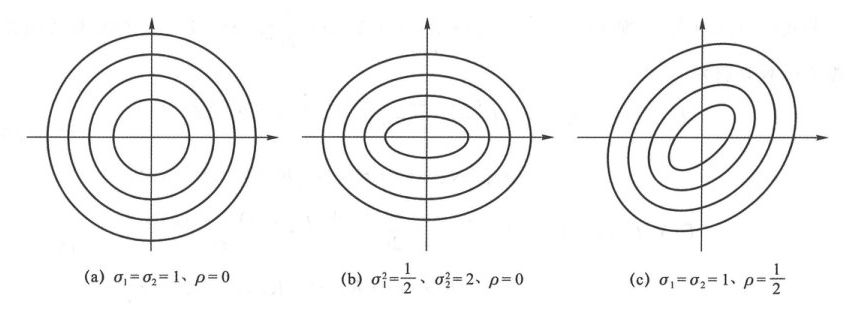
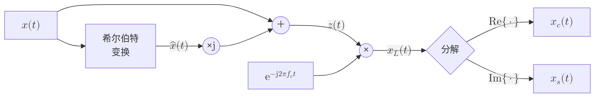

import Knowledge from '@/components/Knowledge.astro';
import Example from '@/components/Example.astro';
import Solution from '@/components/Solution.astro';

## 3.4.1 复随机变量

### 1. 复随机变量的定义

复随机变量 $Z(e)$ 是从样本 $e$ 到复数的映射。复数由两个实数构成，复随机变量也由两个实随机变量构成：

$$
Z = X + \mathrm{j}Y
$$

其中 $X = \operatorname{Re}\{Z\}, Y = \operatorname{Im}\{Z\}$ 分别是 $Z$ 的实部和虚部。复随机变量的概率密度 $p_Z(z)$ 就是实部、虚部这两个实随机变量的联合概率密度 $p_{X,Y}(x,y)$。

### 2. 数字特征

复随机变量的数字特征与实随机变量类似，差别主要在涉及共轭的地方：

1. **数学期望**：是实部和虚部分别做数学期望：
   $$
   \mathbb{E}[Z] = \mathbb{E}[X] + \mathrm{j}\mathbb{E}[Y] \tag{3.4.1}
   $$
   共轭后的数学期望是数学期望的共轭：
   $$
   \mathbb{E}[Z^*] = \mathbb{E}[X] - \mathrm{j}\mathbb{E}[Y] = (\mathbb{E}[Z])^* \tag{3.4.2}
   $$

2. **内积（相关）**：类似于复信号的内积，两个复随机变量 $Z_1, Z_2$ 的内积定义为共轭乘积的数学期望：
   $$
   \langle Z_1, Z_2 \rangle = \mathbb{E}[Z_1 Z_2^*] \tag{3.4.3}
   $$
   一般称上式为 $Z_1, Z_2$ 的相关。实随机变量内积是上式的特例。

3. **平均功率与许瓦兹不等式**：如果复随机变量 $Z$ 的实部 $X$、虚部 $Y$ 代表电压，可称 $Z$ 为复电压。$Z$ 的瞬时功率是 $X^2 + Y^2 = |Z|^2$，平均功率为 $\mathbb{E}[|Z|^2] = \mathbb{E}[Z Z^*]$，即平均功率是 $Z$ 与其自身的内积。若 $Z_1, Z_2$ 均为电压信号，则其内积就是平均互功率。
   复随机变量内积满足**许瓦兹不等式**：
   $$
   |\mathbb{E}[Z_1 Z_2^*]| \le \sqrt{\mathbb{E}[|Z_1|^2] \cdot \mathbb{E}[|Z_2|^2]} \tag{3.4.4}
   $$
   即互功率的模值不超过自功率的几何平均。

4. **协方差与方差**：两个复随机变量 $Z_1, Z_2$ 扣除均值后的内积是协方差：
   $$
   \mathrm{Cov}(Z_1, Z_2) = \mathbb{E}\big[\big(Z_1 - \mathbb{E}[Z_1]\big)\big(Z_2 - \mathbb{E}[Z_2]\big)^*\big] = \mathbb{E}[Z_1 Z_2^*] - \mathbb{E}[Z_1]\mathbb{E}[Z_2^*] \tag{3.4.5}
   $$
   若 $Z_1 = Z_2 = Z$，则协方差变成**方差**：
   $$
   \sigma_Z^2 = \mathbb{E}\big[|Z - \mathbb{E}[Z]|^2\big] = \mathbb{E}[|Z|^2] - |\mathbb{E}[Z]|^2 \tag{3.4.6}
   $$

> **说明（伪协方差）**：若 $Z_1, Z_2$ 是零均值实随机变量，则 $\mathbb{E}[Z_1 Z_2]$ 与 $\mathbb{E}[Z_1 Z_2^*]$ 相等，都是协方差。但若 $Z_1, Z_2$ 是零均值复随机变量，则 $\mathbb{E}[Z_1 Z_2]$ 与 $\mathbb{E}[Z_1 Z_2^*]$ 并不相等，$\mathbb{E}[Z_1 Z_2^*]$ 是协方差，$\mathbb{E}[Z_1 Z_2] = \mathbb{E}[Z_1 (Z_2^*)^*]$ 是 $Z_1$ 与 $Z_2^*$ 的协方差，对 $Z_1, Z_2$ 来说叫**伪协方差**（Pseudo-covariance）或**共轭相关值**。若 $Z$ 是零均值复随机变量，$\mathbb{E}[|Z|^2]$ 是方差，$\mathbb{E}[Z^2]$ 是 $Z$ 与其共轭 $Z^*$ 的互相关，叫伪方差。

### 3. 圆对称复随机变量

<Knowledge id="3.4.1" title="圆对称复随机变量（Circularly Symmetric Complex RV）">
将复随机变量 $Z$ 相位旋转 $\varphi$ 后得到 $Z' = Z\mathrm{e}^{\mathrm{j}\varphi}$。若对任意确定的 $\varphi$，$Z$ 与 $Z'$ 的概率分布完全相同，即：

$$
p_Z(z) = p_Z\big(z\mathrm{e}^{\mathrm{j}\varphi}\big)
$$

则称 $Z$ 为**圆对称复随机变量**（Circularly Symmetric Complex Random Variable）或循环对称复随机变量。
</Knowledge>

圆对称复随机变量具有以下核心特性：

1. **概率密度函数圆对称**：$p_Z(z) = p_Z(|z|)$，概率密度等高线是以原点为中心的同心圆。
2. **相位均匀分布且与幅度独立**：相位 $\theta = \angle Z$ 在 $[0, 2\pi]$ 上均匀分布，且与模值 $|Z|$ 相互独立。
3. **均值为零**：$\mathbb{E}[Z] = \mathbb{E}[Z\mathrm{e}^{\mathrm{j}\varphi}] = \mathrm{e}^{\mathrm{j}\varphi}\mathbb{E}[Z] \implies \mathbb{E}[Z] = 0$。
4. **与共轭不相关（伪方差为零）**：$\mathbb{E}[Z^2] = \mathbb{E}[(Z\mathrm{e}^{\mathrm{j}\varphi})^2] = \mathrm{e}^{\mathrm{j}2\varphi}\mathbb{E}[Z^2] \implies \mathbb{E}[Z^2] = 0$。
5. **实部与虚部互不相关且同分布**：设 $Z = A\mathrm{e}^{\mathrm{j}\theta}$，其实部 $X = A\cos\theta$，虚部 $Y = A\sin\theta$：
   $$
   \mathbb{E}[XY] = \mathbb{E}\left[\frac{1}{2}A^2 \sin(2\theta)\right] = 0
   $$
   因此 $X, Y$ 不相关且同分布，方差各占复随机变量方差的一半：$\sigma_X^2 = \sigma_Y^2 = \frac{1}{2}\sigma_Z^2$。

<Example id="3.4.1" title="高斯复随机变量的等高线形状">
设有复随机变量 $Z = X + \mathrm{j}Y$，其实部 $X$ 与虚部 $Y$ 的联合概率密度函数为二维高斯分布：

$$
p_{XY}(x,y) = \frac{1}{2\pi\sigma_1\sigma_2\sqrt{1-\rho^2}}\exp\left\{-\frac{1}{2(1-\rho^2)}\left(\frac{x^2}{\sigma_1^2} - \frac{2\rho xy}{\sigma_1\sigma_2} + \frac{y^2}{\sigma_2^2}\right)\right\} \tag{3.4.7}
$$

- 当 $\sigma_1 = \sigma_2 = 1, \rho = 0$ 时，其等高线 $p_{XY}(x,y) = c$ 对应 $x^2 + y^2 = \text{常数}$，等高线是同心圆，对应圆对称复随机变量；
- 当 $\sigma_1^2 = \frac{1}{2}, \sigma_2^2 = 2, \rho = 0$ 时，等高线是主轴与坐标轴重合的椭圆；
- 当 $\sigma_1 = \sigma_2 = 1, \rho = \frac{1}{2}$ 时，等高线是倾斜的椭圆。
</Example>

  

  
图 3.4.1 概率密度函数的等高线图

## 3.4.2 复随机过程

### 1. 复随机过程定义与相关函数

复随机过程 $Z(e,t)$ 是从样本 $e$ 到复信号的映射。给定 $e$ 时，$Z(e,t)$ 是确定复信号；给定 $t$ 时，$Z(e,t)$ 是复随机变量。

- **自相关函数**：
  $$
  R_Z(t_1, t_2) = \mathbb{E}[Z(t_1)Z^*(t_2)] \tag{3.4.8}
  $$
- **互相关函数**：
  $$
  R_{Z_1 Z_2}(t_1, t_2) = \mathbb{E}[Z_1(t_1)Z_2^*(t_2)] \tag{3.4.9}
  $$
- **共轭相关函数**：
  $$
  R_{ZZ^*}(t_1, t_2) = \mathbb{E}[Z(t_1)Z(t_2)] \tag{3.4.10}
  $$

### 2. 复平稳过程

复随机过程 $Z(t) = X(t) + \mathrm{j}Y(t)$ 由实部 $X(t)$ 和虚部 $Y(t)$ 两个实随机过程组成。若 $X(t)$ 与 $Y(t)$ 联合平稳，则称 $Z(t)$ 为**复平稳过程**。具体来说，$Z(t)$ 复平稳意味着以下 5 个实数学期望均与绝对时间 $t$ 无关：

$$
\begin{aligned}
\mathbb{E}[X(t)] &= m_X \\
\mathbb{E}[Y(t)] &= m_Y \\
\mathbb{E}[X(t+\tau)X(t)] &= R_X(\tau) \\
\mathbb{E}[Y(t+\tau)Y(t)] &= R_Y(\tau) \\
\mathbb{E}[Y(t+\tau)X(t)] &= R_{YX}(\tau)
\end{aligned} \tag{3.4.11}
$$

<Knowledge id="3.4.2" title="复平稳过程的充分必要条件">
复随机过程 $Z(t)$ 平稳等价于以下 3 个复数学期望均与绝对时间 $t$ 无关：

$$
\begin{aligned}
\mathbb{E}[Z(t)] &= m_Z \\
\mathbb{E}[Z(t+\tau)Z^*(t)] &= R_Z(\tau) \\
\mathbb{E}[Z(t+\tau)Z(t)] &= R_{ZZ^*}(\tau)
\end{aligned} \tag{3.4.12}
$$

即 $Z(t)$ 的均值、自相关函数、**共轭相关函数**都与绝对时间 $t$ 无关。与实平稳过程相比，**多出一个共轭相关函数与绝对时间无关的约束条件**。
</Knowledge>

由式 (3.4.12) 可以导出，复平稳过程的自相关函数具有**共轭对称性**：

$$
R_Z(\tau) = R_Z^*(-\tau) \tag{3.4.18}
$$

<Example id="3.4.2" title="共轭相关函数含时变项的非平稳反例">
设 $Z(t) = m(t)\mathrm{e}^{\mathrm{j}2\pi f_c t}$，其中 $m(t)$ 是自相关函数为 $R_m(\tau)$ 的零均值实平稳过程。试检验 $Z(t)$ 是否为复平稳过程。
</Example>

<Solution>
$Z(t)$ 的均值为：

$$
\mathbb{E}[Z(t)] = \mathbb{E}[m(t)]\mathrm{e}^{\mathrm{j}2\pi f_c t} = 0
$$

自相关函数为：

$$
\mathbb{E}[Z(t+\tau)Z^*(t)] = \mathbb{E}\big[m(t+\tau)\mathrm{e}^{\mathrm{j}2\pi f_c(t+\tau)} \cdot m(t)\mathrm{e}^{-\mathrm{j}2\pi f_c t}\big] = R_m(\tau)\mathrm{e}^{\mathrm{j}2\pi f_c \tau}
$$

均值和自相关函数确实与绝对时间 $t$ 无关。然而，共轭相关函数为：

$$
\begin{aligned}
\mathbb{E}[Z(t+\tau)Z(t)] &= \mathbb{E}\big[m(t+\tau)\mathrm{e}^{\mathrm{j}2\pi f_c(t+\tau)} \cdot m(t)\mathrm{e}^{\mathrm{j}2\pi f_c t}\big] \\
&= R_m(\tau)\mathrm{e}^{\mathrm{j}2\pi f_c(2t+\tau)}
\end{aligned} \tag{3.4.20}
$$

上式强烈依赖于绝对时间 $t$（包含 $\mathrm{e}^{\mathrm{j}4\pi f_c t}$ 因子），因此 **$Z(t)$ 不是复平稳过程**。实际上，$Z(t)$ 的实部 $m(t)\cos(2\pi f_c t)$ 与虚部 $m(t)\sin(2\pi f_c t)$ 都不是平稳过程，而是循环平稳过程。
</Solution>

### 3. 复平稳过程通过滤波器

设线性时不变滤波器的冲激响应为 $h(t)$，输入 $X(t)$ 是零均值复平稳过程，自相关函数为 $R_X(\tau)$，共轭相关函数为 $R_{XX^*}(\tau)$。

输出 $Y(t)$ 的均值为零，自相关函数与互相关函数分别为：

$$
R_Y(\tau) = \iint_{-\infty}^\infty h(u)h^*(v) R_X(\tau + v - u)\,\mathrm{d}u\mathrm{d}v \tag{3.4.21}
$$

$$
R_{XY}(\tau) = \int_{-\infty}^\infty h^*(v) R_X(\tau + v)\,\mathrm{d}v \tag{3.4.22}
$$

共轭相关函数为：

$$
\mathbb{E}[Y(t_1)Y(t_2)] = \iint_{-\infty}^\infty h(u)h(v) R_{XX^*}(t_1 - t_2 + v - u)\,\mathrm{d}u\mathrm{d}v \tag{3.4.23}
$$

以上结果证明：**滤波器输出 $Y(t)$ 是复平稳过程且 $Y(t)$ 与 $X(t)$ 联合平稳**。

## 3.4.3 带通随机信号

通信系统中实际发送的带通信号 $x(t)$ 是实信号，其等效基带分析涉及复信号。带通信号等效基带分析中的相关信号关系如下图所示：

图 3.4.2 带通随机信号的解析信号与复包络分解

假设 $x(t)$ 是平稳带通信号，平稳说明均值是常数；带通信号是高频信号，不包含直流，因此 $\mathbb{E}[x(t)] = 0$。从 $x(t)$ 到 $\hat{x}(t), z(t)$ 的过程是线性时不变系统，故 $\hat{x}(t)$ 是零均值平稳过程，$z(t)$ 是零均值复平稳过程。

### 1. 解析信号的统计特性

根据希尔伯特变换性质，$x(t)$ 与 $\hat{x}(t)$ 分别是解析信号 $z(t)$ 的实部与虚部。$z(t)$ 的自相关函数与共轭相关函数分别为：

$$
R_z(\tau) = \mathbb{E}[z(t+\tau)z^*(t)] = 2\big[R_x(\tau) + \mathrm{j}\widehat{R}_x(\tau)\big] \tag{3.4.24}
$$

$$
R_{zz^*}(\tau) = \mathbb{E}[z(t+\tau)z(t)] = 0 \tag{3.4.25}
$$

式 (3.4.24) 中的 $\widehat{R}_x(\tau)$ 是 $R_x(\tau)$ 的希尔伯特变换，$R_x(\tau) + \mathrm{j}\widehat{R}_x(\tau)$ 是解析信号，其傅氏变换是 $R_x(\tau)$ 傅氏变换正频率部分的 2 倍。因此 $z(t)$ 的功率谱密度为**单边谱**：

$$
P_z(f) = \begin{cases}
4P_x(f), & f > 0 \\
0, & f < 0
\end{cases} \tag{3.4.26}
$$

### 2. 复包络的统计特性

复包络 $x_L(t) = z(t)\mathrm{e}^{-\mathrm{j}2\pi f_c t}$ 的均值为零，其自相关函数与共轭相关函数分别为：

$$
R_{x_L}(\tau) = \mathbb{E}[x_L(t+\tau)x_L^*(t)] = R_z(\tau)\mathrm{e}^{-\mathrm{j}2\pi f_c \tau} = 2\big[R_x(\tau) + \mathrm{j}\widehat{R}_x(\tau)\big]\mathrm{e}^{-\mathrm{j}2\pi f_c \tau} \tag{3.4.27}
$$

$$
R_{x_L x_L^*}(\tau) = \mathbb{E}[x_L(t+\tau)x_L(t)] = R_{zz^*}(\tau)\mathrm{e}^{-\mathrm{j}2\pi f_c (2t+\tau)} = 0 \tag{3.4.28}
$$

结果均与 $t$ 无关，说明 **$x_L(t)$ 是复平稳过程**。

对式 (3.4.27) 做傅氏变换，得到 $x(t)$ 复包络的功率谱密度是 $x(t)$ 功率谱密度正频部分左移后的 4 倍：

$$
P_{x_L}(f) = \begin{cases}
4P_x(f + f_c), & |f| \le f_c \\
0, & \text{其他 } f
\end{cases} \tag{3.4.29}
$$

### 3. 同相分量与正交分量的统计特性

$x_L(t)$ 的均值为零，其实部 $x_c(t)$、虚部 $x_s(t)$ 均值也为零。$x_L(t)$ 平稳且共轭相关函数为零，代入复变量分解公式可得到 $x_c(t)$ 与 $x_s(t)$ 的自相关函数和互相关函数：

$$
R_{x_c}(\tau) = R_{x_s}(\tau) = \frac{1}{2}\operatorname{Re}\{R_{x_L}(\tau)\} = \frac{1}{4}\big[R_{x_L}(\tau) + R_{x_L}^*(\tau)\big] \tag{3.4.30}
$$

$$
R_{x_c x_s}(\tau) = \frac{1}{2}\operatorname{Im}\{R_{x_L}(\tau)\} = \frac{1}{4\mathrm{j}}\big[R_{x_L}(\tau) - R_{x_L}^*(\tau)\big] \tag{3.4.31}
$$

式 (3.4.30) 说明：**$x(t)$ 复包络自相关函数的实部的一半是同相分量/正交分量的自相关函数，虚部的一半是两者的互相关函数**。

对式 (3.4.30) 两边做傅氏变换：

$$
P_{x_c}(f) = P_{x_s}(f) = \frac{1}{4}\big[P_{x_L}(f) + P_{x_L}(-f)\big] \tag{3.4.32}
$$

代入式 (3.4.29) 以及 $P_x(-f + f_c) = P_x(f - f_c)$，得到：

$$
P_{x_c}(f) = P_{x_s}(f) = \begin{cases}
P_x(f + f_c) + P_x(f - f_c), & |f| \le f_c \\
0, & \text{其他 } f
\end{cases} \tag{3.4.33}
$$

说明**平稳带通信号同相/正交分量的功率谱密度等于带通功率谱密度正频部分左移、负频部分右移后叠加**。

<Knowledge id="3.4.3" title="带通随机信号分解的三个经典性质">
1. **同一时刻正交不相关**：由于复信号自相关函数共轭对称，$\tau = 0$ 时 $R_{x_L}(0) = R_{x_L}^*(0)$ 为纯实数，代入式 (3.4.31) 得：
   $$R_{x_c x_s}(0) = 0 \implies \mathbb{E}[x_c(t)x_s(t)] = 0$$
   即同相分量与正交分量在同一时刻互不相关。
2. **包络功率倍增**：将 $\tau = 0$ 代入式 (3.4.27) 得：
   $$R_{x_L}(0) = R_z(0) = 2R_x(0) \implies P_{x_L} = P_z = 2P_x$$
   解析信号与复包络的平均功率相等，等于带通信号功率的 2 倍。
3. **同相与正交分量功率均分**：将 $\tau = 0$ 代入式 (3.4.30) 得：
   $$R_{x_c}(0) = R_{x_s}(0) = \frac{1}{2}R_{x_L}(0) = R_x(0) \implies P_{x_c} = P_{x_s} = P_x$$
   同相分量、正交分量各自的平均功率等于带通信号的平均功率。
</Knowledge>
