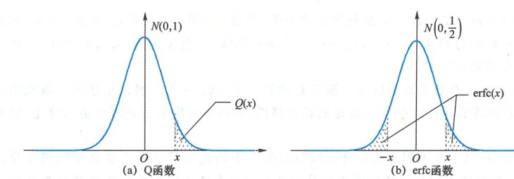
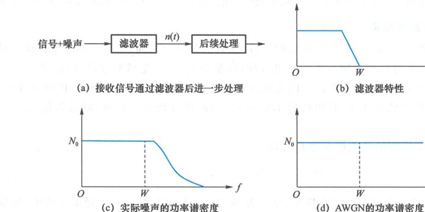
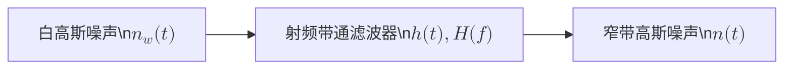

import Knowledge from '@/components/Knowledge.astro';
import Example from '@/components/Example.astro';
import Solution from '@/components/Solution.astro';

噪声是制约通信最根本的因素。通信中有很多不同类型的噪声，其中最广泛的是高斯噪声。高斯噪声是一种随机信号，该随机信号上的全体随机变量服从高斯分布。

## 3.5.1 高斯随机变量

### 1. 一维高斯分布

高斯分布也叫正态分布。均值为 $m$、方差为 $\sigma^2$ 的高斯随机变量 $X \sim \mathcal{N}(m, \sigma^2)$ 的概率密度函数是：

$$
p_X(x) = \frac{1}{\sqrt{2\pi\sigma^2}} \exp\left\{-\frac{(x-m)^2}{2\sigma^2}\right\} \tag{3.5.1}
$$

对概率密度按不同的区间积分可以得到不同事件的概率，例如事件 $x_1 < X \le x_2$ 的出现概率为：

$$
P(x_1 < X \le x_2) = \int_{x_1}^{x_2} \frac{1}{\sqrt{2\pi\sigma^2}} \exp\left\{-\frac{(u-m)^2}{2\sigma^2}\right\}\,\mathrm{d}u \tag{3.5.2}
$$

这个积分没有闭式解，一般将结果表示为互补误差函数 $\operatorname{erfc}$ 或高斯 $Q$ 函数。

<Knowledge id="3.5.1" title="高斯 Q 函数与互补误差函数 erfc">
**高斯 $Q$ 函数**表示标准正态随机变量 $X \sim \mathcal{N}(0, 1)$ 大于 $x$ 的右尾概率（即下图 (a) 中阴影部分的面积）：

$$
Q(x) = P(X > x) = \int_x^\infty \frac{1}{\sqrt{2\pi}} \mathrm{e}^{-\frac{u^2}{2}}\,\mathrm{d}u \tag{3.5.3}
$$

若 $x > 0$，**互补误差函数 $\operatorname{erfc}(x)$** 表示均值为零、方差为 $0.5$ 的高斯随机变量 $X \sim \mathcal{N}\left(0, \frac{1}{2}\right)$ 的绝对值大于 $x$ 的双尾概率（即下图 (b) 中阴影部分的面积）：

$$
\operatorname{erfc}(x) = P(|X| > x) = 2\int_x^\infty \frac{1}{\sqrt{\pi}} \mathrm{e}^{-u^2}\,\mathrm{d}u \tag{3.5.4}
$$

$Q$ 函数与 $\operatorname{erfc}$ 函数之间存在精确的换算关系：

$$
Q(x) = \frac{1}{2}\operatorname{erfc}\left(\frac{x}{\sqrt{2}}\right) \tag{3.5.5}
$$
</Knowledge>

  

  
图 3.5.1 Q 函数及 erfc 函数的几何意义

<Example id="3.5.1" title="判决输出越界概率求解">
设判决变量 $y = -E_b + Z$，其中 $Z \sim \mathcal{N}(0, \sigma^2)$ 是高斯随机变量，$E_b > 0$ 是常数。求判决错误概率 $P(y > 0)$。
</Example>

<Solution>
$y > 0$ 等价于 $Z > E_b$，也就是：

$$
\frac{Z}{\sqrt{2\sigma^2}} > \frac{E_b}{\sqrt{2\sigma^2}}
$$

注意 $\frac{Z}{\sqrt{2\sigma^2}}$ 是均值为 0、方差为 $0.5$ 的高斯随机变量，因此：

$$
P(y > 0) = \frac{1}{2}\operatorname{erfc}\left(\frac{E_b}{\sqrt{2\sigma^2}}\right) = Q\left(\frac{E_b}{\sigma}\right)
$$
</Solution>

### 2. 联合高斯

本书涉及高斯随机变量时，一般可以认为两个高斯随机变量之和还是高斯随机变量，两个高斯随机变量不相关则独立。由于数学上可以存在反例，使得我们考虑多个高斯随机变量时需要限定在联合高斯的范围内。

<Example id="3.5.2" title="边缘高斯但不联合高斯的反例">
设 $X \sim \mathcal{N}(0, 1)$ 是标准正态随机变量，$Y = WX$，其中 $W$ 等概取值于 $\{\pm 1\}$，且 $W$ 与 $X$ 独立。

$Y$ 有一半机会等于 $X$，一半机会等于 $-X$。$Y = X$ 或 $Y = -X$ 都服从标准正态分布，因此 $Y$ 也服从标准正态分布。

$X$ 与 $Y$ 之和为 $Z = X + WX = (1+W)X$。$Z$ 有一半机会等于 $2X$（对应 $W=1$），一半机会等于零（对应 $W=-1$）。$Z$ 取特定值 0 的概率不是零（等于 $0.5$），说明 $Z$ 不可能是连续型高斯随机变量。本例中，$X$ 和 $Y$ 都是高斯随机变量，但它们的和不是。

此外，$X$ 和 $Y$ 不相关：$\mathbb{E}[XY] = \mathbb{E}[WX^2] = \mathbb{E}[W]\mathbb{E}[X^2] = 0$，但两者并不独立。在条件 $X = x$ 下，$Y = xW$ 是离散随机变量，条件影响了分布。
</Example>

<Knowledge id="3.5.2" title="联合高斯（多维高斯）的等价定义与性质">
若 $n$ 个随机变量 $X_1, X_2, \dots, X_n$ 满足下列中的任何一条，则称其服从 $n$ 维联合高斯分布：

1. **线性组合性质**：$X_1, X_2, \dots, X_n$ 的任意线性组合 $Y = \sum_{i=1}^n a_i X_i$ 都是高斯随机变量；
2. **标准正态线性变换**：随机向量 $\mathbf{X} = (X_1, X_2, \dots, X_n)^T$ 是一组独立同分布标准正态随机变量的线性变换叠加确定向量：

$$
\mathbf{X} = \mathbf{A}\mathbf{Z} + \mathbf{m} \tag{3.5.6}
$$

3. **联合概率密度形式**：协方差矩阵 $\mathbf{C} = \mathbb{E}[(\mathbf{X} - \mathbf{m})(\mathbf{X} - \mathbf{m})^T]$ 满秩时：

$$
p_{\mathbf{X}}(\mathbf{x}) = \frac{1}{\sqrt{(2\pi)^n \det(\mathbf{C})}}\exp\left\{-\frac{1}{2}(\mathbf{x}-\mathbf{m})^T \mathbf{C}^{-1}(\mathbf{x}-\mathbf{m})\right\} \tag{3.5.7}
$$

**核心结论**：对于联合高斯随机变量，**不相关等价于相互独立**。若 $X_1, \dots, X_n$ 两两不相关，$\mathbf{C}$ 为对角阵，联合概率密度直接等于各边缘概率密度的乘积。
</Knowledge>

### 3. 圆对称复高斯

若复随机变量 $Z = X + \mathrm{j}Y$ 的实部与虚部服从联合高斯分布，则称 $Z$ 为**复高斯随机变量**。若 $Z$ 还具有圆对称性，则称为**圆对称复高斯**（Circularly Symmetric Complex Gaussian），记为 $Z \sim \mathcal{CN}(0, 2\sigma^2)$，其中 $2\sigma^2 = \mathbb{E}[|Z|^2]$ 是 $Z$ 的方差。

圆对称复高斯 $Z \sim \mathcal{CN}(0, 2\sigma^2)$ 具有以下重要分布特征：
- 实部与虚部是独立同分布的零均值高斯随机变量 $\mathcal{N}(0, \sigma^2)$；
- 其幅度 $|Z| = \sqrt{X^2 + Y^2}$ 服从**瑞利分布**（Rayleigh Distribution）；
- 其模平方 $|Z|^2 = X^2 + Y^2$ 服从**指数分布**（Exponential Distribution）；
- 叠加确定复数 $c$ 后，$Z + c$ 的幅度服从**莱斯分布**（Rician Distribution）。

## 3.5.2 加性白高斯噪声

加性白高斯噪声（Additive White Gaussian Noise, AWGN）是通信系统中最基础的噪声模型，也是高斯噪声的典型代表。

### 1. 高斯过程

设有随机过程 $X(t)$。若对任意正整数 $n$、任意时刻 $t_1, t_2, \dots, t_n$，随机变量 $X(t_1), X(t_2), \dots, X(t_n)$ 服从联合高斯分布，则称 $X(t)$ 为**高斯过程**。

高斯过程具有优良的线性变换封闭性：
1. 高斯过程与确定信号的乘积是高斯过程；
2. 高斯过程与确定信号的卷积是高斯过程（即**高斯过程通过线性滤波器后输出仍然是高斯过程**）；
3. 高斯过程与确定信号的内积是高斯随机变量。

### 2. 加性白高斯噪声（AWGN）模型

加性白高斯噪声 $n_w(t)$ 具有“加性、白、高斯、噪声”4 个特征：
- **噪声**：是对信号传输有害的随机过程；
- **高斯**：在任意时刻均服从高斯分布；
- **白**：双边功率谱密度在整个频率轴上是均匀常数，类比于白光包含所有频率成分；
- **加性**：独立叠加在有用信号上，且统计特性不受有用信号影响。

AWGN 的双边功率谱密度为常数：

$$
P_{n_w}(f) = \frac{N_0}{2}, \quad -\infty < f < \infty \tag{3.5.8}
$$

其中 $N_0$ 是每 $1\text{ Hz}$ 带宽内的单边噪声功率谱密度，单位为 $\text{W/Hz}$。按正负频率计算的双边功率谱密度是 $N_0/2$。

对式 (3.5.8) 做傅氏反变换，得到 AWGN 的自相关函数为冲激函数：

$$
R_{n_w}(\tau) = \mathbb{E}[n_w(t+\tau)n_w(t)] = \frac{N_0}{2}\delta(\tau) \tag{3.5.9}
$$

### 3. 限带白高斯噪声与物理等价性

AWGN 的自相关函数是冲激，意味着其总方差（功率）为无穷大：$\mathbb{E}[n_w^2(t)] = R_{n_w}(0) = \infty$。同时只要 $t_1 \ne t_2$，$n_w(t_1)$ 与 $n_w(t_2)$ 便互不相关，其样本函数在物理上处处不连续。因此，理想 AWGN 是一种数学抽象极限。

在实际系统中，我们将其理解为带宽受限于 $B$ 的**限带白高斯噪声** $n_B(t)$：

$$
P_{n_B}(f) = \begin{cases}
\frac{N_0}{2}, & |f| \le B \\
0, & |f| > B
\end{cases} \tag{3.5.10}
$$

其自相关函数为 $\operatorname{sinc}$ 函数：

$$
R_{n_B}(\tau) = N_0 B \operatorname{sinc}(2B\tau) \tag{3.5.12}
$$

只要平稳高斯噪声的功率谱密度在系统接收机通带 $W$ 内是平坦的，就可以等效建模为 AWGN，经过带通滤波后的输出噪声特性完全一致。

  

  
图 3.5.2 用白噪声建模实际噪声的等价性

### 4. AWGN 通过滤波器

将 $n_w(t)$ 通过冲激响应为 $h(t)$、传递函数为 $H(f)$ 的线性滤波器，输出噪声为：

$$
n(t) = n_w(t) * h(t) = \int_{-\infty}^\infty n_w(u)h(t-u)\,\mathrm{d}u \tag{3.5.14}
$$

输出噪声的功率谱密度为：

$$
P_n(f) = \frac{N_0}{2}|H(f)|^2 \tag{3.5.15}
$$

输出噪声在任意时刻的平均功率等于功率谱密度的全频积分：

$$
\mathbb{E}[n^2(t)] = R_n(0) = \frac{N_0}{2}\int_{-\infty}^\infty |H(f)|^2\,\mathrm{d}f = \frac{N_0}{2}E_h \tag{3.5.16}
$$

若 $H(f)$ 是带宽为 $B$、增益为 1 的理想低通滤波器，则输出噪声功率为：

$$
\mathbb{E}[n^2(t)] = \int_0^B 2P_n(f)\,\mathrm{d}f = N_0 B \tag{3.5.17}
$$

即**白高斯噪声在每 $1\text{ Hz}$ 带宽内的功率是 $N_0$，通过带宽为 $B$ 的理想滤波器后功率即为 $N_0 B$**。

### 5. AWGN 与确定信号的内积

$n_w(t)$ 与能量有限确定信号 $g(t)$ 的内积为：

$$
Z = \int_{-\infty}^\infty n_w(t)g(t)\,\mathrm{d}t \tag{3.5.18}
$$

$Z$ 相当于 $n_w(t)$ 通过冲激响应为 $h(t) = g(-t)$ 的匹配滤波器在 $t = 0$ 处的采样值，因此 $Z$ 是零均值高斯随机变量，方差为：

$$
\mathbb{E}[Z^2] = \frac{N_0}{2}E_g
$$

设 $g_1(t), g_2(t)$ 是两个确定实信号，互能量为 $E_{12} = \int_{-\infty}^\infty g_1(t)g_2(t)\,\mathrm{d}t$。则 $n_w(t)$ 在两个信号上的投影 $Z_1, Z_2$ 的相关性为：

$$
\mathbb{E}[Z_1 Z_2] = \frac{N_0}{2}\int_{-\infty}^\infty g_1(t)g_2(t)\,\mathrm{d}t = \frac{N_0}{2}E_{12} \tag{3.5.20}
$$

<Knowledge id="3.5.3" title="AWGN 投影的正交独立性">
**AWGN 在两两正交的一组基函数上的投影是相互独立的高斯随机变量**。

若 $\phi_1(t), \phi_2(t), \dots, \phi_N(t)$ 是一组单位能量且两两正交的确定波形，则 $n_w(t)$ 在这组波形上的投影 $Z_1, Z_2, \dots, Z_N$ 是一组独立同分布的零均值高斯随机变量，方差均为 $N_0/2$。
</Knowledge>

### 6. AWGN 信道与热噪声

**AWGN 信道模型**：接收信号表示为发送信号与白高斯噪声的直接叠加：

$$
r(t) = s(t) + n_w(t) \tag{3.5.21}
$$

**热噪声（Johnson-Nyquist 噪声）**：电阻等电子元器件中自由电子热运动产生的白噪声，匹配负载上的单边功率谱密度为：

$$
N_0 = k T \tag{3.5.22}
$$

其中玻尔兹曼常数 $k = 1.38 \times 10^{-23}\text{ J/K}$，$T$ 为开尔文绝对温度。在室温 $300\text{ K}$ 时，$N_0 \approx 4.14 \times 10^{-21}\text{ W/Hz} = -174\text{ dBm/Hz}$。

## 3.5.3 窄带高斯噪声

无线接收机射频前端带通滤波器输出的噪声是带通型随机信号，其带宽远小于中心工作载频，称为**窄带高斯噪声**（Narrowband Gaussian Noise）。

图 3.5.3 窄带高斯噪声是 AWGN 通过带通滤波器的输出

窄带高斯噪声的时域同相/正交分解与包络/相位表示式为：

$$
\begin{aligned}
n(t) &= n_c(t)\cos(2\pi f_c t) - n_s(t)\sin(2\pi f_c t) \\
&= A(t)\cos[2\pi f_c t + \varphi(t)]
\end{aligned} \tag{3.5.23}
$$

### 1. 统计概率分布

- $n(t)$ 在任意时刻服从零均值高斯分布：$n(t) \sim \mathcal{N}(0, \sigma^2)$；
- 对应的解析信号 $z(t) = n(t) + \mathrm{j}\hat{n}(t)$ 和复包络 $n_L(t)$ 均服从**圆对称复高斯分布**：$n_L(t) \sim \mathcal{CN}(0, 2\sigma^2)$；
- 同相分量 $n_c(t)$ 与正交分量 $n_s(t)$ 是**独立同分布**的零均值低通高斯过程：
  $$n_c(t), n_s(t) \sim \mathcal{N}(0, \sigma^2)$$

### 2. 噪声功率与功率谱密度

设带通滤波器的噪声等效带宽为 $B$，则窄带噪声总功率为 $\sigma^2 = N_0 B$。
- 复包络功率：$P_{n_L} = 2\sigma^2$；
- 同相分量与正交分量功率：$P_{n_c} = P_{n_s} = \sigma^2$。

同相分量与正交分量具有相同的低通功率谱密度：

$$
P_{n_c}(f) = P_{n_s}(f) = \begin{cases}
P_n(f - f_c) + P_n(f + f_c), & |f| \le f_c \\
0, & \text{其他 } f
\end{cases} \tag{3.5.27}
$$

### 3. 包络与相位分布

<Knowledge id="3.5.4" title="窄带高斯噪声的包络与相位统计特性">
1. **纯窄带高斯噪声**：
   - 包络 $A(t) = |n_L(t)|$ 服从**瑞利分布**（Rayleigh Distribution）：
     $$p_A(a) = \frac{a}{\sigma^2}\exp\left(-\frac{a^2}{2\sigma^2}\right), \quad a \ge 0$$
   - 相位 $\varphi(t)$ 在 $[0, 2\pi]$ 上服从**均匀分布**：
     $$p_\Phi(\varphi) = \frac{1}{2\pi}, \quad 0 \le \varphi < 2\pi$$
   - **包络与相位相互统计独立**。

2. **正弦波加窄带高斯噪声**：
   若输入信号包含确定正弦载波：$X(t) = A\cos(2\pi f_c t + \phi) + n(t)$，其复包络为 $X_L(t) = A\mathrm{e}^{\mathrm{j}\phi} + n_L(t)$。
   - 合成信号的包络 $|X_L(t)|$ 服从**莱斯分布**（Rician Distribution）：
     $$p(r) = \frac{r}{\sigma^2}\exp\left(-\frac{r^2 + A^2}{2\sigma^2}\right) I_0\left(\frac{Ar}{\sigma^2}\right), \quad r \ge 0$$
   - 当无载波（$A = 0$）时，莱斯分布退化为瑞利分布；
   - 当载噪比很大（$A/\sigma \gg 1$）时，莱斯分布渐近趋于高斯分布 $\mathcal{N}(A, \sigma^2)$。
</Knowledge>
