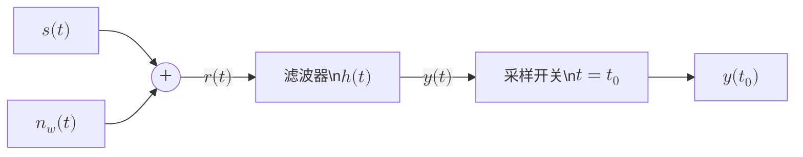
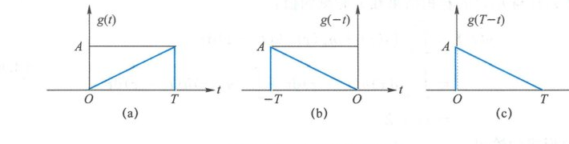
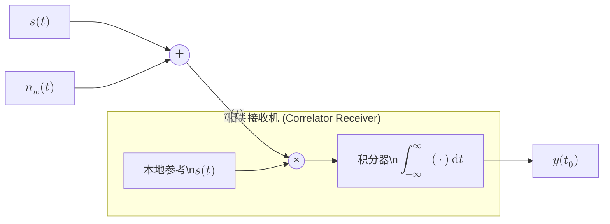

import Knowledge from '@/components/Knowledge.astro';
import Example from '@/components/Example.astro';
import Solution from '@/components/Solution.astro';
import ExerciseTrigger from '@/components/exercises/ExerciseTrigger.astro';

噪声是制约通信的根本因素，滤波器是对抗噪声的基础手段。模拟通信系统主要用低通或带通滤波器来滤除带外噪声。数字通信系统常采用**匹配滤波器**（Matched Filter）来最大化采样点的输出信噪比。

## 3.6.1 最佳接收问题

考虑如下图所示的接收滤波模型。能量为 $E_s$ 的确定实信号 $s(t)$ 通过 AWGN 信道传输，接收信号为：

$$
r(t) = s(t) + n_w(t)
$$

其中 $n_w(t)$ 的双边功率谱密度为 $N_0/2$。为了抑制噪声，接收端将 $r(t)$ 通过一个冲激响应为 $h(t)$ 的线性滤波器，并在 $t_0$ 时刻对滤波器输出信号进行采样得到样值 $y(t_0)$。

图 3.6.1 匹配滤波器系统模型

采样值是 $r(t)$ 与 $h(t)$ 的卷积结果在 $t_0$ 时刻的值：

$$
\begin{aligned}
y(t_0) &= \int_{-\infty}^\infty [s(\tau) + n_w(\tau)]h(t_0 - \tau)\,\mathrm{d}\tau \\
&= \int_{-\infty}^\infty s(\tau)h(t_0 - \tau)\,\mathrm{d}\tau + \int_{-\infty}^\infty n_w(\tau)h(t_0 - \tau)\,\mathrm{d}\tau \\
&= s_0 + Z
\end{aligned} \tag{3.6.1}
$$

其中：
- $s_0$ 是信号成分形成的输出：
  $$
  s_0 = \int_{-\infty}^\infty s(t)h(t_0 - t)\,\mathrm{d}t = \int_{-\infty}^\infty h(t)s(t_0 - t)\,\mathrm{d}t \tag{3.6.2}
  $$
  $s(t)$ 是确定信号，故 $s_0$ 是确定值，采样点有用信号功率为 $s_0^2$。
- $Z$ 是噪声成分形成的输出：
  $$
  Z = \int_{-\infty}^\infty n_w(t)h(t_0 - t)\,\mathrm{d}t \tag{3.6.3}
  $$
  $Z$ 是 $n_w(t)$ 与 $h(t_0 - t)$ 的内积，为零均值高斯随机变量，噪声功率为 $\mathbb{E}[Z^2] = \frac{N_0}{2}E_h$，其中 $E_h$ 是 $h(t)$ 的能量。

采样时刻的输出信噪比可以表示为：

$$
\gamma = \frac{s_0^2}{\mathbb{E}[Z^2]} = \frac{2}{N_0 E_h}\left|\int_{-\infty}^\infty h(t)s(t_0 - t)\,\mathrm{d}t\right|^2 \tag{3.6.4}
$$

不同的滤波器冲激响应 $h(t)$ 设计会有不同的信噪比 $\gamma$。我们的核心目标是：**设计最优的 $h(t)$，使得采样时刻 $t_0$ 的瞬时信噪比 $\gamma$ 最大**。

## 3.6.2 匹配滤波器设计

式 (3.6.4) 可以改写为内积的归一化形式：

$$
\gamma = \frac{2E_s}{N_0}\left|\int_{-\infty}^\infty \frac{h(t)}{\sqrt{E_h}} \frac{s(t_0 - t)}{\sqrt{E_s}}\,\mathrm{d}t\right|^2 \tag{3.6.5}
$$

右边的积分是波形 $h(t)$ 与波形 $s(t_0 - t)$ 的归一化相关系数。根据柯西-许瓦兹不等式，相关系数的绝对值最大为 1，且当且仅当两个信号波形形状成正比时取得最大值。因此，能使采样时刻信噪比最大的最优滤波器设计为：

<Knowledge id="3.6.1" title="匹配滤波器的时域与频域特性">
使采样时刻信噪比最大的滤波器冲激响应为：

$$
h(t) = K \cdot s(t_0 - t) \tag{3.6.6}
$$

其中 $K$ 是任意非零常数。称这样的滤波器为对信号 $s(t)$ 匹配的**匹配滤波器**（Matched Filter, MF）。

1. **时域镜像与平移**：匹配滤波器的冲激响应 $h(t)$ 是原信号波形关于时间原点做镜像反转后，再向右平移 $t_0$ 时延。
2. **最大输出信噪比**：代入最优条件后，匹配滤波器输出端的最大信噪比为：

$$
\gamma_{\max} = \frac{2E_s}{N_0} \tag{3.6.7}
$$

最大信噪比**只取决于接收信号的总能量 $E_s$ 和噪声功率谱密度 $N_0$，而与信号的具体时域波形形状完全无关**！

3. **频域传递函数**：对式 (3.6.6) 做傅氏变换，匹配滤波器的传递函数为原信号频谱的复共轭：

$$
H(f) = K \cdot S^*(f)\mathrm{e}^{-\mathrm{j}2\pi f t_0} \tag{3.6.8}
$$
</Knowledge>

- 系数 $K$ 会影响 $h(t)$ 的能量，但不影响归一化相关系数，因此匹配滤波器在 $t_0$ 时刻的信噪比与 $K$ 无关，通常取 $K = 1$；
- $s(t_0 - t)$ 是 $s(-t)$ 延迟 $t_0$。若考虑物理因果性（要求 $t < 0$ 时 $h(t) = 0$），对于持续时间为 $T$ 的信号（$t \in [0, T]$），只要选取抽样时刻 $t_0 \ge T$，即可保证匹配滤波器满足因果可实现性。

<Example id="3.6.1" title="三角脉冲信号的匹配滤波器设计">
设输入基带脉冲信号为斜坡信号：

$$
g(t) = \begin{cases}
\frac{A t}{T}, & 0 \le t \le T \\
0, & \text{其他}
\end{cases}
$$

求其因果匹配滤波器的冲激响应、最佳抽样时刻及输出最大信噪比。
</Example>

<Solution>
如图 (a) 所示为信号 $g(t)$。先将时间轴镜像反转得到图 (b) 所示的 $g(-t)$，然后向右平移得到图 (c) 所示的 $g(t_0 - t)$。

考虑因果性要求，可选取最佳采样时刻为脉冲结束时刻 $t_0 = T$，此时因果匹配滤波器的冲激响应为：

$$
h(t) = g(T - t) = \frac{A(T - t)}{T}, \quad 0 \le t \le T
$$

脉冲信号的能量为：

$$
E_g = \int_0^T \left(\frac{A t}{T}\right)^2\,\mathrm{d}t = \frac{A^2 T}{3}
$$

在最佳采样时刻 $t_0 = T$ 处，输出端的最大信噪比为：

$$
\gamma_{\max} = \frac{2E_g}{N_0} = \frac{2A^2 T}{3N_0}
$$
</Solution>

  

  
图 3.6.2 匹配滤波器冲激响应构造示例

## 3.6.3 相关器与匹配滤波器的等价性

将匹配滤波器的冲激响应 $h(t) = s(t_0 - t)$ 代入卷积采样值计算式 (3.6.1)：

$$
y(t_0) = \int_{-\infty}^\infty r(\tau)h(t_0 - \tau)\,\mathrm{d}\tau = \int_{-\infty}^\infty r(\tau)s(\tau)\,\mathrm{d}\tau \tag{3.6.9}
$$

这揭示了一个极为重要的物理事实：**匹配滤波器在最佳采样时刻 $t_0$ 的输出值，在数学上完全等价于接收信号 $r(t)$ 与本地参考信号 $s(t)$ 的互相关积分（内积）**！

图 3.6.3 相关接收机等效结构

因此，在数字通信最佳接收机实现中，既可以采用**匹配滤波器结构**（输入连续卷积后在 $t_0$ 时刻瞬时采样），也可以采用**相关接收机结构**（本地波形相乘后在 $[0, T]$ 积分），两者在最佳判决时刻的信噪比和判决性能完全一致。

## 3.6.4 复信号的匹配滤波器

对于复数信号（如等效基带信号或雷达复包络），式 (3.6.4) 中的内积是复内积。为使采样点信噪比最大，冲激响应在时间反褶的同时还必须取**复共轭**：

$$
h(t) = K \cdot s^*(t_0 - t) \tag{3.6.10}
$$

若取 $K = 1, t_0 = 0$，则对复信号 $s(t)$ 匹配的匹配滤波器冲激响应为 $h(t) = s^*(-t)$，对应的频域传递函数仍为：

$$
H(f) = K \cdot S^*(f)\mathrm{e}^{-\mathrm{j}2\pi f t_0}
$$

---

<ExerciseTrigger chapter={3} section="3.6" title="第3章 随机过程 课后习题与自测" />
