import Knowledge from '@/components/Knowledge.astro';

## 4.1.1 模拟调制的概念

模拟通信系统的目的是把麦克风、摄像机、传感器等产生的模拟基带信号从一个地点传输到另外一个地点。远距离传输最重要的方法是无线传输，需要把电信号变成电磁波后通过天线发射，但有效辐射电磁波要求天线尺寸与信号波长相当。音频、视频等模拟基带信号的频率低、波长长，直接辐射这种信号需要的天线巨大，完全不可实现。为此，需要借助调制技术，把低频基带信号 $m(t)$ 调制到载波 $c(t)$ 上，变换成高频带通信号 $s(t)$，然后通过合适的天线发射，如图 4.1.1 所示。接收端则通过相反的解调过程从其收到的带通信号中复原出基带信号。

**调制（Modulation）**是将信息加载于载波（Carrier）的过程，调制器的输入 $m(t)$ 称为**调制信号（Modulating Signal）**，输出 $s(t)$ 称为**已调信号（Modulated Signal）**。在本书中，载波主要指正弦波，也叫参考载波。以正弦波为载波的调制称为正弦调制。无线通信系统的发射频率或工作频率就是正弦载波的频率。

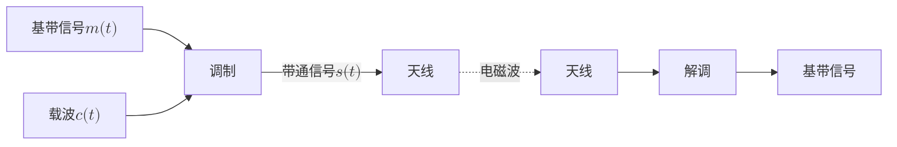

<figure class="vp-figure">

  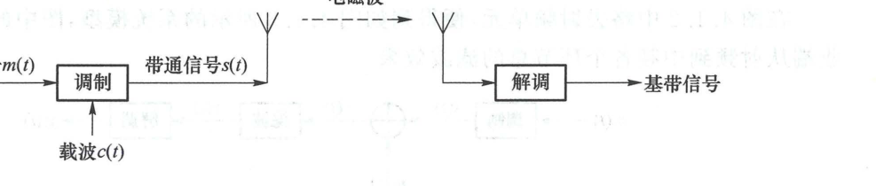

  <figcaption>图 4.1.1 将基带信号变换成带通信号后传输（原书影印参考）</figcaption>
</figure>

## 4.1.2 超外差系统

实际的无线通信系统大多不是直接把基带信号调制到空中发射频率上，而是采用如图 4.1.2 所示的超外差结构，其中频单元把基带信号 $m(t)$ 调制到**中频（Intermediate Frequency, IF）**，射频单元将中频单元输出的已调信号 $s(t)$ 变换到射频后通过天线发射。

除了变频外，射频单元一般还包括滤波、放大、双工等功能。发端需要用滤波器来控制发送频谱、抑制杂散辐射，以避免对其他电台形成干扰。收端需要用滤波器从空中选出目标信号，抑制其他电台对自己的干扰。发端需要功率放大器（功放）来产生足够大的输出功率以克服电波在空中传播造成的信号衰减。功放是通信系统中非线性失真的主要来源。收端需要用低噪声放大器（低噪放, LNA）把天线感应的微弱电信号放大。低噪放在放大微弱信号的同时，也放大了噪声，这是制约通信质量的主要因素。在实际通信系统的设计及实现中，接收机的噪声系数与等效噪声的概念很重要，尤其要注意接收机前端电路的低噪声设计。

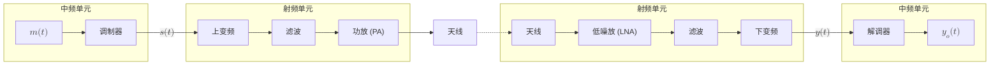

<figure class="vp-figure">

  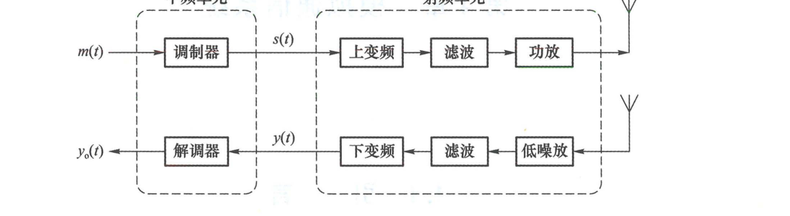

  <figcaption>图 4.1.2 超外差结构（原书影印参考）</figcaption>
</figure>

通信系统可以是单向通信，例如广播电台只发送，收音机只接收；也可以是双向通信，例如手机同时具有发送和接收的功能。支持双向通信的设备同时具有完整的发送部分和接收部分，整体称为收发信机（Transceiver）。如果收发共享天线，还需要双工器。

超外差系统的优点是利于实现。无线电台的工作频率一般比较高，频率越高，实现的难度越大。超外差系统在射频部分只安排了变频、放大、滤波等相对简单的功能，将复杂的调制解调等安排在频率较低的中频部分。超外差系统便于数字化实现，可以将中频以下的部分数字化，通过软件无线电、数字信号处理器、数字集成电路等完成信号处理功能。超外差系统灵活性高，当系统需要改变空中工作频率时，中频部分可以保持不变，通过改变射频单元来改变发射频率。

本章主要聚焦典型模拟调制解调技术的原理。

## 4.1.3 系统模型

在图 4.1.2 中略去射频单元，便得到如图 4.1.3 所示的系统模型，图中的滤波单元代表接收端从射频到中频各个环节总的滤波效果。

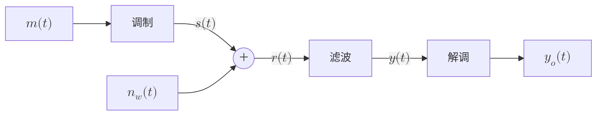

<figure class="vp-figure">

  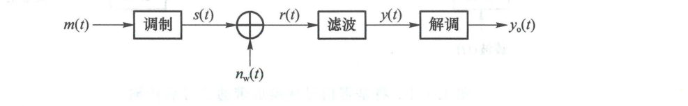

  <figcaption>图 4.1.3 模拟调制系统模型（原书影印参考）</figcaption>
</figure>

简单起见，假设图 4.1.2 中从发端到收端的所有放大器可以弥补信号在无线传输中经历的各种衰减，忽略信号传输中可能存在的非线性失真及线性失真，只考虑噪声。此时，接收信号可以表示为：

$$
r(t) = s(t) + n_w(t) \tag{4.1.1}
$$

其中 $n_w(t)$ 是加性白高斯噪声，代表接收端总的等效噪声。假设图 4.1.3 中的滤波器理想，能使 $s(t)$ 无失真通过，则解调器输入信号可以表示为：

$$
y(t) = s(t) + n(t) \tag{4.1.2}
$$

其中 $n(t)$ 是 $n_w(t)$ 通过带通滤波器后形成的窄带噪声，是一个零均值平稳高斯过程。

基带信号 $m(t)$ 一般是随机信号，每次通信中具体传输的是其样本信号。以下默认假设 $m(t)$ 的样本信号是实信号，带宽为 $W$，不含直流。直流是恒定电压，在时域表现为信号的平均高度 $\overline{m(t)}$，在频域表现为冲激 $\delta(f)$。通过频谱仪观察时，频谱上的冲激呈现为一条很高的细线，因而称为线谱。假设 $m(t)$ 不含直流，就是假设 $\overline{m(t)} = 0$，其频谱中没有线谱 $\delta(f)$。

图 4.1.3 中的调制器将信号 $m(t)$ 变换为信号 $s(t)$，构成一个信号系统。按照是否满足叠加原理，信号系统有线性与非线性之分。如果调制器是线性系统，就是线性调制，否则是非线性调制。本章 4.2 节介绍的幅度调制是线性调制，4.3 节介绍的角度调制是非线性调制。

## 4.1.4 复信号表示

调制器输出的已调信号 $s(t)$ 是带通信号。回顾 2.4 节，每个带通信号 $s(t)$ 对应唯一一个解析信号 $z(t) = s(t) + \mathrm{j}\hat{s}(t)$，其中 $\hat{s}(t)$ 是 $s(t)$ 的希尔伯特变换。给定参考载波 $\cos(2\pi f_c t + \varphi_c)$ 后，$s(t)$ 对应唯一一个复包络 $s_L(t) = z(t)\mathrm{e}^{-\mathrm{j}(2\pi f_c t + \varphi_c)}$。复包络是复信号，有实部、虚部，模值及角度：

$$
s_L(t) = I(t) + \mathrm{j}Q(t) = A(t)\mathrm{e}^{\mathrm{j}\theta(t)} \tag{4.1.3}
$$

基于复包络可将带通信号表示为：

$$
s(t) = \operatorname{Re}\{s_L(t)\mathrm{e}^{\mathrm{j}(2\pi f_c t + \varphi_c)}\} \tag{4.1.4}
$$

$$
s(t) = A(t)\cos[2\pi f_c t + \varphi_c + \theta(t)] \tag{4.1.5}
$$

$$
s(t) = I(t)\cos(2\pi f_c t + \varphi_c) - Q(t)\sin(2\pi f_c t + \varphi_c) \tag{4.1.6}
$$

复包络的实部 $I(t)$ 是式 (4.1.6) 中与参考载波相位一致的 $\cos(2\pi f_c t + \varphi_c)$ 的幅度，是**同相分量**。复包络的虚部 $Q(t)$ 是与参考载波相位正交的 $-\sin(2\pi f_c t + \varphi_c)$ 的幅度，是**正交分量**。复包络的模 $A(t)$ 是**包络**，复包络的角度 $\theta(t)$ 是**相位**。

基于式 (4.1.6) 中带通信号的正交表达式，从复包络到带通信号，再从带通信号到复包络的变换可以通过如图 4.1.4 所示的 I/Q 调制及 I/Q 解调实现。

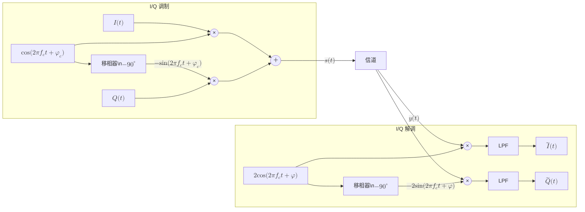

<figure class="vp-figure">

  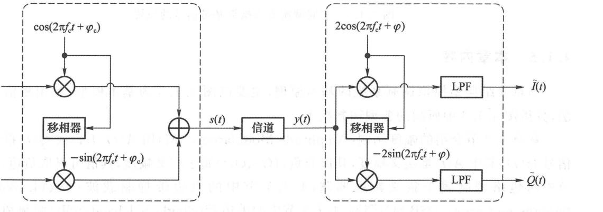

  <figcaption>图 4.1.4 I/Q 调制与解调（原书影印参考）</figcaption>
</figure>

不考虑噪声时，图 4.1.4 中 $y(t) = s(t) = \operatorname{Re}\{z(t)\}$。带通信号的复包络表达式与参考载波有关。调制器的载波是 $\cos(2\pi f_c t + \varphi_c)$，复包络为 $s_L(t) = z(t)\mathrm{e}^{-\mathrm{j}(2\pi f_c t + \varphi_c)} = I(t) + \mathrm{j}Q(t)$。解调器的载波是 $\cos(2\pi f_c t + \varphi)$，复包络为 $y_L(t) = z(t)\mathrm{e}^{-\mathrm{j}(2\pi f_c t + \varphi)} = \tilde{I}(t) + \mathrm{j}\tilde{Q}(t)$。这两个复包络之间是相位旋转关系：

$$
y_L(t) = s_L(t)\mathrm{e}^{\mathrm{j}(\varphi_c - \varphi)} \tag{4.1.7}
$$

相位旋转会改变同相分量及正交分量，即 $s_L(t)$ 与 $y_L(t)$ 的实部、虚部不同，但相位旋转不影响包络：$|s_L(t)| = |y_L(t)| = |z(t)|$。

基于复包络和解析信号，可将图 4.1.4 按复信号表示为图 4.1.5。发端将复包络 $s_L(t)$ 乘以复载波 $\mathrm{e}^{\mathrm{j}(2\pi f_c t + \varphi_c)}$，使频谱上移，成为复带通信号 $z(t)$。不考虑噪声，收端的解调过程是将 $z(t)$ 乘以 $\mathrm{e}^{-\mathrm{j}(2\pi f_c t + \varphi)}$，使频谱下移，得到解调端的复包络 $y_L(t)$。当收发载波的频率相位完全一致时，$y_L(t) = s_L(t)$，否则复包络会发生旋转。

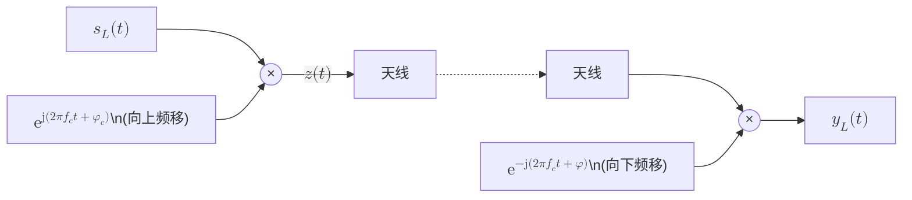

<figure class="vp-figure">

  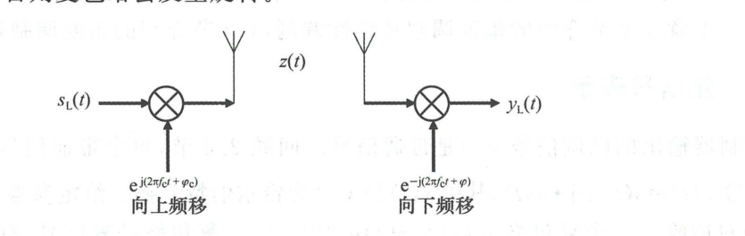

  <figcaption>图 4.1.5 复信号表示（原书影印参考）</figcaption>
</figure>

模拟调制系统通过带通信号 $s(t)$ 传输基带信号 $m(t)$。带通信号的信息完全携带在复包络中，让带通信号 $s(t)$ 携带 $m(t)$，就是让复包络 $s_L(t)$ 携带 $m(t)$，也就是让式 (4.1.3) 中的 $I(t)$、$Q(t)$、$A(t)$ 或 $\theta(t)$ 携带 $m(t)$。若把载波比作车，那么 $I(t)$、$Q(t)$、$A(t)$、$\theta(t)$ 就是车上的座位。调制是让 $m(t)$ 以某种方式坐到某个座位上，解调就是把它卸下来。不同的坐法形成了不同的调制方式。本章所要介绍的几种调制方式携带 $m(t)$ 的位置如图 4.1.6 所示。注意，同相分量或正交分量是相对于载波相位而言的，图中的 $m(t)$ 可以在 I 路，也可以在 Q 路。

<Knowledge title="调制方式与复包络映射统一视角">

- **$m(t)$ 在 I 路**：对应 **DSB / SSB / VSB**（属于广义幅度调制）
- **$m(t)$ 在包络 $A(t)$**：对应 **AM**（属于狭义幅度调制）
- **$m(t)$ 在相位 $\theta(t)$**：对应 **FM / PM**（属于角度调制）

</Knowledge>

<figure class="vp-figure">

  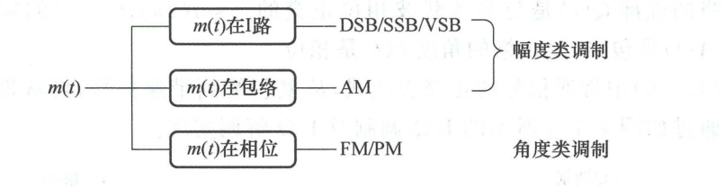

  <figcaption>图 4.1.6 不同调制方式携带基带信号的位置（原书影印参考）</figcaption>
</figure>

## 4.1.5 本章内容

本章介绍典型模拟调制系统的基本原理，主要以图 4.1.3 为基本模型，利用复信号的方法，分析图 4.1.6 中所列的典型调制技术：

- **4.2 节：幅度调制（Amplitude Modulation, AM）**
  用 $A(t)$、$I(t)$ 或 $Q(t)$ 携带基带信号 $m(t)$，其中 $A(t)$ 是狭义幅度，其值非负；$I(t)$、$Q(t)$ 属于广义幅度，其值可以取负值。4.2.2 节中的包络调制属于狭义幅度调制，4.2.1 节中的双边带抑制载波（Double Sideband-Suppressed Carrier, DSB-SC）调制、4.2.3 节中的单边带（Single Sideband, SSB）调制和残留边带（Vestigial Sideband, VSB）调制属于广义幅度调制。后续第 5、6 章中出现的脉冲幅度调制（Pulse Amplitude Modulation, PAM）、正交幅度调制（Quadrature Amplitude Modulation, QAM）也是广义幅度调制。
- **4.3 节：角度调制**
  用 $\theta(t)$ 携带 $m(t)$，包括调相（Phase Modulation, PM）和调频（Frequency Modulation, FM）。角度调制的包络是常数，属于恒包络调制。
- **4.4 节：模拟调制的抗噪声性能**
  通信系统不仅需要把信息传送过去，还需要保证传输质量。模拟通信中最简单、最基本的质量指标是信噪比（Signal to Noise Ratio, SNR）。4.4 节介绍典型调制系统通过 AWGN 信道传输时，解调输出信噪比的分析方法。
- **4.5 节：频分复用（Frequency Division Multiplexing, FDM）**
  模拟调制具有频谱搬移功能，这使其可以支持多路信号以频分复用的方式共享传输信道。4.5 节介绍频分复用的基本原理。
