import Knowledge from '@/components/Knowledge.astro';
import Example from '@/components/Example.astro';
import Solution from '@/components/Solution.astro';

幅度调制（Amplitude Modulation）是指载波的幅度随基带信号 $m(t)$ 线性变化的调制方式。根据所传输频带及载波成分的不同，幅度调制主要包括：
1. **双边带抑制载波调制（DSB-SC）**
2. **常规双边带调幅（AM，包络调制）**
3. **单边带调制（SSB）**
4. **残留边带调制（VSB）**

其中 DSB-SC 是一种非常基础的调制方式，其余几种幅度调制均可通过 DSB-SC 演变而成，它也是后续数字调制的基础。

---

## 4.2.1 双边带抑制载波调制

### 1. DSB-SC 信号

让复包络 $s_L(t)$ 携带 $m(t)$ 最简单的方式是让它与 $m(t)$ 成正比：

$$
s_L(t) = A_c m(t) \tag{4.2.1}
$$

即让 $m(t)$ 坐到 $I(t)$ 这个座位上，让 $Q(t) = 0$ 空着。不妨假设参考载波的相位 $\varphi_c = 0$。在图 4.1.4 的 I/Q 调制中略去 Q 路，只保留 I 路，得到调制器原理框图如图 4.2.1 所示。

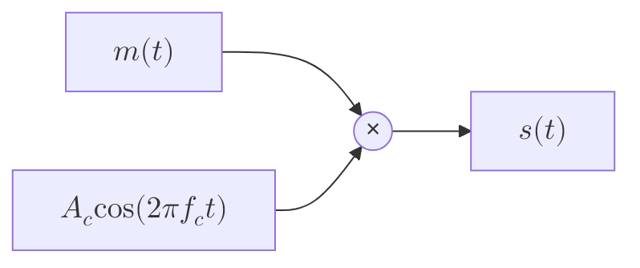

<figure class="vp-figure">

  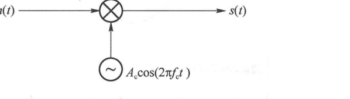

  <figcaption>图 4.2.1 双边带调制（原书影印参考）</figcaption>
</figure>

调制器输出的已调信号为：

$$
s(t) = A_c m(t)\cos(2\pi f_c t) = \frac{A_c}{2}m(t)\mathrm{e}^{\mathrm{j}2\pi f_c t} + \frac{A_c}{2}m(t)\mathrm{e}^{-\mathrm{j}2\pi f_c t} \tag{4.2.2}
$$

若基带信号 $m(t)$ 的傅氏变换为 $M(f)$，则已调信号的傅氏变换为：

$$
S(f) = \frac{A_c}{2}[M(f - f_c) + M(f + f_c)] \tag{4.2.3}
$$

若 $m(t)$ 的功率谱密度为 $P_m(f)$，则 $s(t)$ 的功率谱密度为：

$$
P_s(f) = \frac{A_c^2}{4}[P_m(f - f_c) + P_m(f + f_c)] \tag{4.2.4}
$$

图 4.2.2 是频谱示意图（图中取 $A_c = 2$）。已调信号的频谱 $S(f)$ 是基带信号频谱 $M(f)$ 的左右搬移。$M(f)$ 关于原点共轭对称，其正频率部分 $M_+(f)$ 和负频率部分 $M_-(f)$ 的关系是 $M_-(f) = M_+^*(-f)$。频谱搬移后，$S(f)$ 在载频 $f_c$ 左右形成两个对称的边带，分别对应 $M_-(f)$ 和 $M_+(f)$，因此称图 4.2.1 为**双边带调制（Double Sideband, DSB）**。

<figure class="vp-figure">

  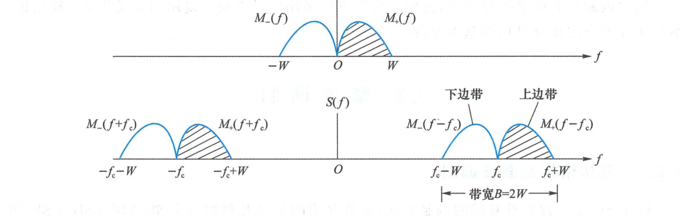

  <figcaption>图 4.2.2 DSB-SC 信号的频谱是基带信号频谱的左右搬移（原书影印参考）</figcaption>
</figure>

基带信号 $m(t)$ 的带宽是 $W$，经过双边带调制后，已调信号 $s(t)$ 的带宽变成：

$$
B = 2W \tag{4.2.5}
$$

双边带调制使信号带宽加倍。若基带信号 $m(t)$ 不包含直流分量，则 $M(f)$ 不包含冲激线谱 $\delta(f)$。经过频谱搬移后，$S(f)$ 在 $\pm f_c$ 处没有冲激线谱，这一特性称为**抑制载波（Suppressed Carrier）**，此时的已调信号称为 **DSB-SC** 信号。

图 4.2.3 给出了 DSB-SC 信号波形示例。已调信号是载波乘以 $m(t)$：
- 当 $m(t) > 0$ 时，已调信号与载波同相；
- 当 $m(t) < 0$ 时，已调信号与载波反相；
- 在 $m(t)$ 过零点处，已调信号的高频载波发生 $180^\circ$（反相）的相位跳变。

<figure class="vp-figure">

  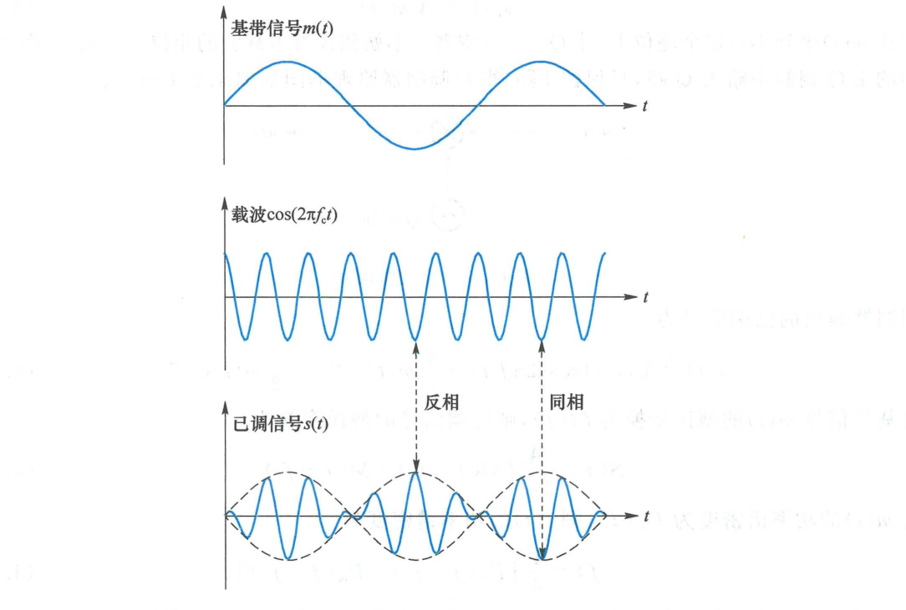

  <figcaption>图 4.2.3 基带信号、载波、已调信号波形图（原书影印参考）</figcaption>
</figure>

图 4.2.1 中的调制器是一个线性系统：若输入 $m_1(t)$、$m_2(t)$ 对应的已调信号分别为 $s_1(t)$、$s_2(t)$，则输入 $a\,m_1(t) + b\,m_2(t)$ 对应的已调信号为 $a\,s_1(t) + b\,s_2(t)$。因此，双边带调制是**线性调制**。

### 2. DSB-SC 信号的解调

DSB 信号的解调可以通过在图 4.1.4 中的 I/Q 解调器中略去 Q 路，只保留 I 路，形成如图 4.2.4 所示的解调框图。

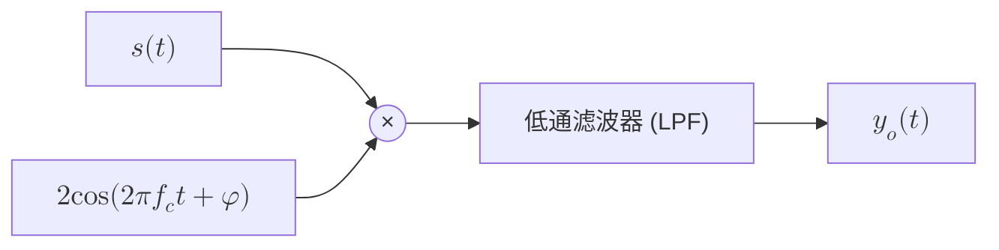

<figure class="vp-figure">

  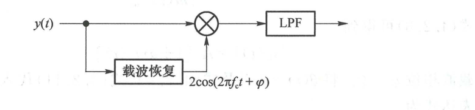

  <figcaption>图 4.2.4 DSB 信号的相干解调（原书影印参考）</figcaption>
</figure>

在不考虑信道噪声的情况下，乘法器的输出为：

$$
\begin{aligned}
x(t) &= s(t) \cdot 2\cos(2\pi f_c t + \varphi) \\
&= A_c m(t)\cos(2\pi f_c t) \cdot 2\cos(2\pi f_c t + \varphi) \\
&= A_c m(t)\cos\varphi + A_c m(t)\cos(4\pi f_c t + \varphi)
\end{aligned} \tag{4.2.6}
$$

经截止频率为 $W$ 的理想低通滤波器滤除 $2f_c$ 的高频倍频分量后，解调输出为：

$$
y_o(t) = A_c m(t)\cos\varphi \tag{4.2.7}
$$

从式 (4.2.7) 可以看出：
1. **理想同步**：若接收机本地载波相位与发端完全一致（$\varphi = 0$），则 $y_o(t) = A_c m(t)$，基带信号无失真复原；
2. **相位误差**：若存在固定的相位差 $\varphi$，解调输出幅度下降一个常数因子 $\cos\varphi$；特别地，当 $\varphi = \pm 90^\circ$ 时，$\cos\varphi = 0$，$y_o(t) = 0$，产生**正交失敏现象**，完全无法恢复基带信号；
3. **频率误差**：若本地载波与发端载波存在频差 $\Delta f$（即 $\varphi(t) = 2\pi\Delta f t + \varphi_0$），则解调输出为 $y_o(t) = A_c m(t)\cos(2\pi\Delta f t + \varphi_0)$，表现为基带信号被低频拍频调制，产生严重的包络起伏失真。

因此，采用图 4.2.4 解调 DSB 信号，接收机本地必须提供一个与发射载波**同频同相**的相干载波，这种解调方式称为**相干解调（Coherent Demodulation）**或**同步检波**。

<Example id="4.2.1" title="DSB 信号解调中载波频差的影响">
设 DSB-SC 已调信号为 $s(t) = A_c m(t)\cos(2\pi f_c t)$，接收端相干载波存在频差 $\Delta f$，即本地载波为 $c(t) = 2\cos[2\pi(f_c + \Delta f)t]$。试分析低通滤波器的输出信号。
</Example>

<Solution title="解">
乘法器输出为：

$$
x(t) = s(t)c(t) = 2A_c m(t)\cos(2\pi f_c t)\cos[2\pi(f_c + \Delta f)t]
$$

利用三角恒等式积化和差：

$$
x(t) = A_c m(t)\cos(2\pi\Delta f t) + A_c m(t)\cos[2\pi(2f_c + \Delta f)t]
$$

高频分量中心频率位于 $2f_c + \Delta f$，被低通滤波器滤除。低通滤波器输出为：

$$
y_o(t) = A_c m(t)\cos(2\pi\Delta f t)
$$

可见，输出信号受到频率为 $\Delta f$ 的低频调制，其振幅随时间发生周期性起伏。当传输语音信号时，会产生严重的“拍频”失真甚至难以听辨，因此相干解调必须保证严格的频率同步。
</Solution>

---

## 4.2.2 调幅（AM，包络调制）

### 1. AM 信号

DSB-SC 信号的包络 $|A_c m(t)|$ 并不等于基带信号 $m(t)$（在 $m(t) < 0$ 时反相翻折）。如果希望接收机不用复杂的相干解调，而是直接使用非常简单的**包络检波器**复原信号，就必须让带通信号的包络直接等于（或正比于）基带信号。

设复包络为：

$$
s_L(t) = A_c + A' m(t) \tag{4.2.8}
$$

则带通信号为：

$$
s(t) = \operatorname{Re}\{s_L(t)\mathrm{e}^{\mathrm{j}2\pi f_c t}\} = [A_c + A' m(t)]\cos(2\pi f_c t) \tag{4.2.9}
$$

为了保证带通信号的包络 $A(t) = |A_c + A' m(t)|$ 在任何时刻都等于 $A_c + A' m(t)$，必须满足**非负条件**：

$$
A_c + A' m(t) \geqslant 0 \quad \text{恒成立}
$$

定义**调幅系数（Modulation Index）**为：

$$
\beta = \frac{A' \max|m(t)|}{A_c} \tag{4.2.10}
$$

则不失真检波的条件为：

$$
\beta \leqslant 1 \tag{4.2.11}
$$

若 $\beta > 1$，称为**过调（Overmodulation）**。过调会导致包络出现削顶翻转，包络检波器输出严重非线性失真。

<figure class="vp-figure">

  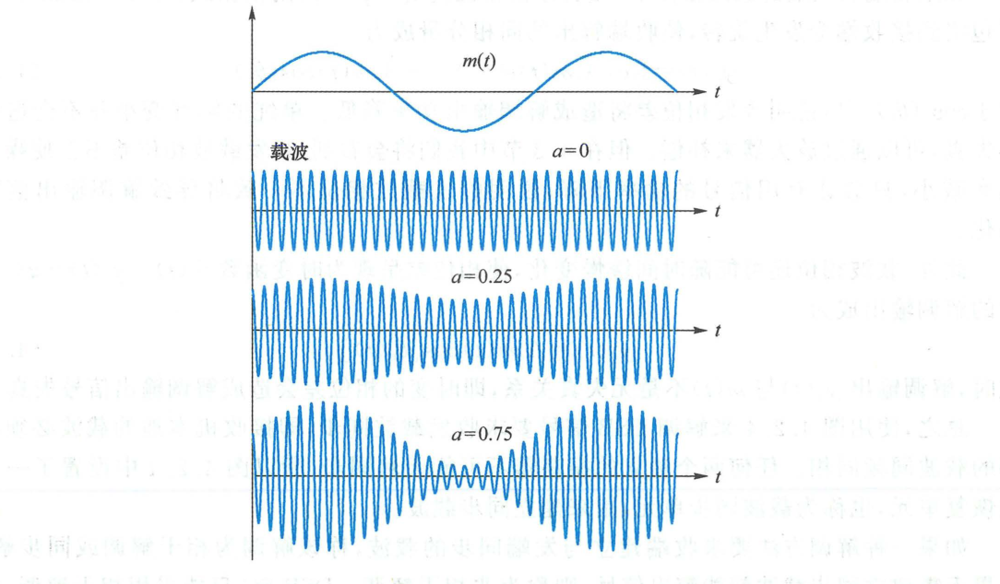

  <figcaption>图 4.2.5 AM 信号波形（原书影印参考）</figcaption>
</figure>

从图 4.2.6 可以看出，AM 信号有两种等效的产生方法：
1. 先对基带信号叠加直流偏移 $A_c$，再做 DSB 调制（图 4.2.6(a)）；
2. 先做 DSB-SC 调制，然后直接叠加入一个足够大的离散载波 $A_c\cos(2\pi f_c t)$（图 4.2.6(b)）。

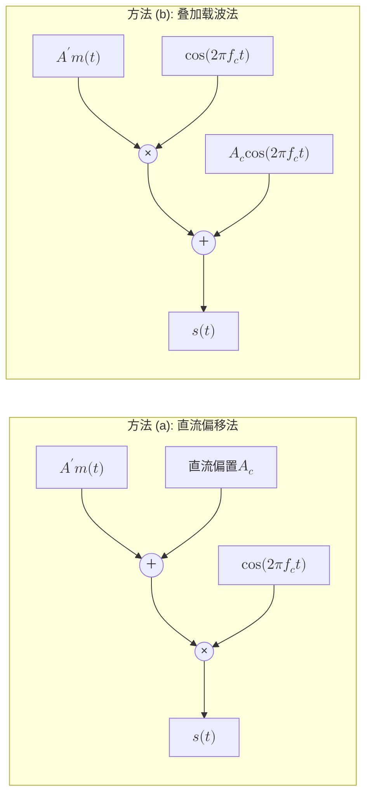

<figure class="vp-figure">

  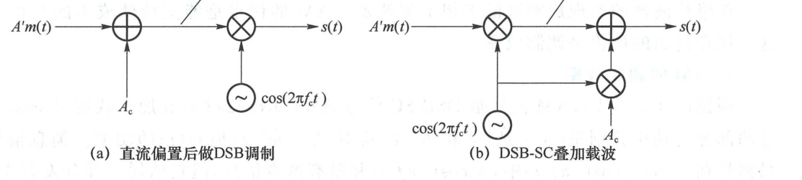

  <figcaption>图 4.2.6 AM 信号的产生方法（原书影印参考）</figcaption>
</figure>

AM 信号的傅氏变换为：

$$
S(f) = \frac{A_c}{2}[\delta(f - f_c) + \delta(f + f_c)] + \frac{A'}{2}[M(f - f_c) + M(f + f_c)] \tag{4.2.12}
$$

其功率谱密度如图 4.2.7 所示。与 DSB-SC 相比，AM 频谱在 $\pm f_c$ 处包含两根强大的离散冲激载频分量（线谱），其带宽依然为：

$$
B_{\text{AM}} = 2W \tag{4.2.13}
$$

<figure class="vp-figure">

  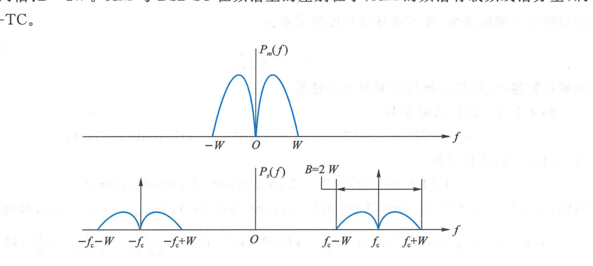

  <figcaption>图 4.2.7 AM 信号的功率谱密度（原书影印参考）</figcaption>
</figure>

### 2. AM 解调

由于 AM 信号的包络严格等于 $A_c + A' m(t)$，接收端可采用由二极管和 RC 低通网络构成的**包络检波器（Envelope Detector）**进行非相干解调，如图 4.2.8 所示。

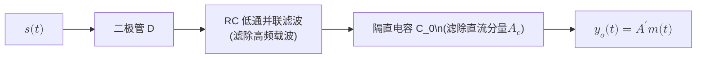

<figure class="vp-figure">

  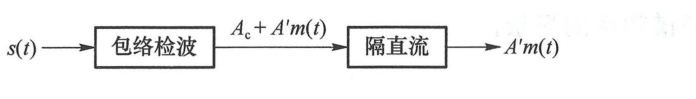

  <figcaption>图 4.2.8 AM 信号的非相干解调（原书影印参考）</figcaption>
</figure>

包络检波器的核心设计要求是选择合适的放电时间常数 $RC$：
- $RC$ 必须足够大：以平滑载波高频振荡，满足 $RC \gg 1/f_c$；
- $RC$ 不能过大：如果 $RC$ 放电太慢，电容放电速度将跟不上调制信号包络下降的速度，产生**惰性失真（对角线切割失真）**，要求 $RC \leqslant \frac{1}{2\pi W}\frac{\sqrt{1 - \beta^2}}{\beta}$。

包络检波器输出经隔直电容滤除直流偏置 $A_c$ 后，便能直接得到调制信号 $A' m(t)$。其最大优点是**无需任何同步载波提取电路，结构极其廉价简单**，因此广泛应用于广播收音机。

### 3. AM 的调制效率

根据图 4.2.6(b)，AM 信号的总平均发射功率为载波功率与边带功率之和：

$$
P_{\text{total}} = P_c + P_{\text{side}} = \frac{1}{2}A_c^2 + \frac{1}{2}A'^2 P_m \tag{4.2.14}
$$

其中 $P_m = \mathbb{E}[m^2(t)]$ 是基带信号的平均功率。定义**调制效率（Modulation Efficiency）** $\eta$ 为有用边带功率占总发射功率的比例：

$$
\eta = \frac{P_{\text{side}}}{P_{\text{total}}} = \frac{\frac{1}{2}A'^2 P_m}{\frac{1}{2}A_c^2 + \frac{1}{2}A'^2 P_m} = \frac{\beta^2 \frac{P_m}{\max|m(t)|^2}}{1 + \beta^2 \frac{P_m}{\max|m(t)|^2}} \tag{4.2.15}
$$

<Example id="4.2.2" title="单音调制 AM 信号的最大调制效率">
设基带信号为单频正弦信号 $m(t) = \cos(2\pi f_m t)$，调幅系数为 $\beta$。求该 AM 信号的调制效率，并计算 100% 满调制（$\beta = 1$）时的最大效率。
</Example>

<Solution title="解">
对于单音频信号 $m(t) = \cos(2\pi f_m t)$，其峰值为 $\max|m(t)| = 1$，平均功率为：

$$
P_m = \overline{\cos^2(2\pi f_m t)} = \frac{1}{2}
$$

将 $P_m = 1/2$ 代入式 (4.2.15)，得：

$$
\eta = \frac{\beta^2 \cdot \frac{1}{2}}{1 + \beta^2 \cdot \frac{1}{2}} = \frac{\beta^2}{2 + \beta^2}
$$

当 $\beta = 1$（100% 满调幅且不过调）时，取得最大调制效率：

$$
\eta_{\max} = \frac{1^2}{2 + 1^2} = \frac{1}{3} \approx 33.3\%
$$

由此可知，常规 AM 信号中至少有 $2/3$（66.7%）的发射功率被耗费在不携带任何信息的离散载频上。AM 是以牺牲功率效率为代价换取接收机极其简单的工程折中。
</Solution>

---

## 4.2.3 单边带（SSB）和残留边带（VSB）调制

### 1. 单边带调制（SSB）

DSB 信号的上下两个边带携带完全相同的冗余信息。若将其中一个边带滤除，仅传输其中一个边带，称为**单边带调制（Single Sideband, SSB）**。

- **上边带（Upper Sideband, USB）**：保留高于载频的部分；
- **下边带（Lower Sideband, LSB）**：保留低于载频的部分。

SSB 信号的带宽仅为基带信号带宽的一半：

$$
B_{\text{SSB}} = W \tag{4.2.16}
$$

SSB 信号的产生方法主要有两种：
1. **滤波法**：先生成 DSB-SC 信号，再通过陡峭的边带带通滤波器滤掉不需要的边带（图 4.2.9(a)）；
2. **移相法（希尔伯特变换法）**：利用希尔伯特变换器产生正交分量（图 4.2.9(b)）。

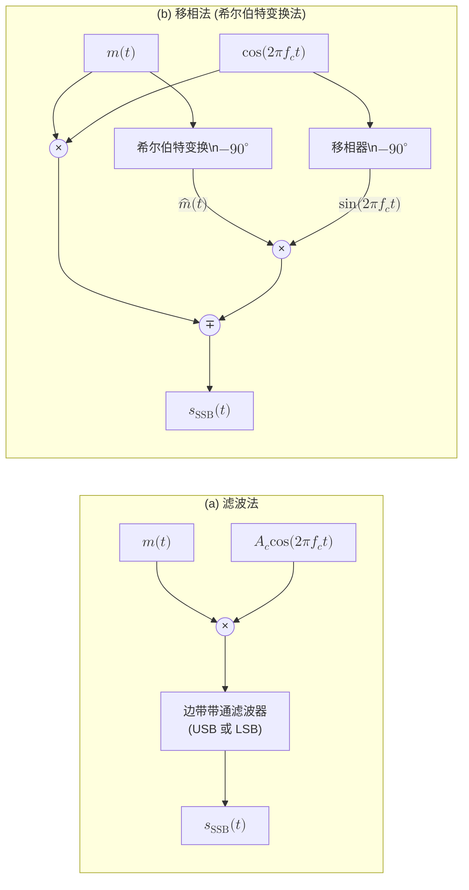

<figure class="vp-figure">

  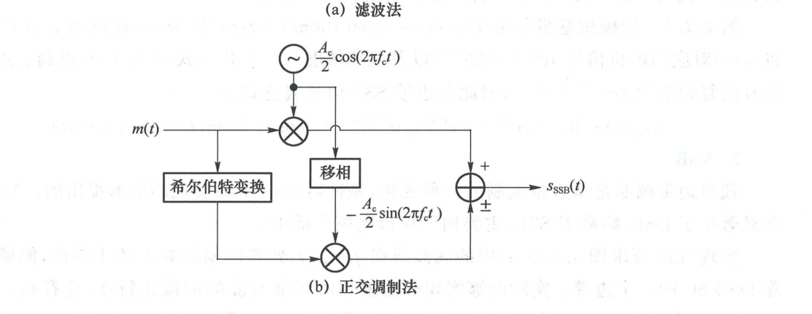

  <figcaption>图 4.2.9 单边带信号的产生（原书影印参考）</figcaption>
</figure>

<Knowledge title="单边带信号的时域数学表达式">

利用希尔伯特变换 $\hat{m}(t) = \mathcal{H}\{m(t)\} = m(t) * \frac{1}{\pi t}$，单边带信号的时域表达式为：

$$
s_{\text{SSB}}(t) = \frac{A_c}{2}m(t)\cos(2\pi f_c t) \mp \frac{A_c}{2}\hat{m}(t)\sin(2\pi f_c t) \tag{4.2.17}
$$

其中：
- **负号（$-$）**对应**上边带（USB）**信号；
- **正号（$+$）**对应**下边带（LSB）**信号。

</Knowledge>

<figure class="vp-figure">

  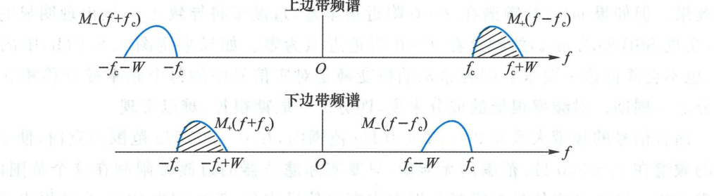

  <figcaption>图 4.2.10 单边带信号的频谱（原书影印参考）</figcaption>
</figure>

SSB 信号的复包络为 $s_L(t) = \frac{A_c}{2}[m(t) \pm \mathrm{j}\hat{m}(t)]$。其包络为 $\frac{A_c}{2}\sqrt{m^2(t) + \hat{m}^2(t)}$，与 $m(t)$ 不成线性关系，因此 **SSB 信号无法使用包络检波，必须采用相干解调**。

<Example id="4.2.3" title="单音调制的单边带信号表达式">
设基带调制信号为单音频信号 $m(t) = A_m\cos(2\pi f_m t)$，载波为 $c(t) = \cos(2\pi f_c t)$。试利用移相法写出上边带（USB）信号表达式。
</Example>

<Solution title="解">
对 $m(t)$ 作希尔伯特变换，相当于所有频率成分相移 $-90^\circ$：

$$
\hat{m}(t) = A_m\cos(2\pi f_m t - 90^\circ) = A_m\sin(2\pi f_m t)
$$

根据 USB 表达式（取负号）：

$$
\begin{aligned}
s_{\text{USB}}(t) &= \frac{1}{2}m(t)\cos(2\pi f_c t) - \frac{1}{2}\hat{m}(t)\sin(2\pi f_c t) \\
&= \frac{1}{2}A_m\cos(2\pi f_m t)\cos(2\pi f_c t) - \frac{1}{2}A_m\sin(2\pi f_m t)\sin(2\pi f_c t) \\
&= \frac{1}{2}A_m\cos[2\pi(f_c + f_m)t]
\end{aligned}
$$

可见，已调信号仅包含单一的上边频分量 $f_c + f_m$，频谱带宽严格为 $f_m$，充分验证了单边带调制的频域特性。
</Solution>

### 2. 残留边带调制（VSB）

SSB 滤波法要求带通滤波器的截止特性在载频 $f_c$ 处具有极其陡峭的“刀削”过渡带。当基带信号含有丰富的直流或低频分量时（例如电视广播的图像信号），物理可实现的模拟滤波器根本无法在不产生严重幅度与相位失真的前提下滤除一个边带。

为了克服这一困难，提出了**残留边带调制（Vestigial Sideband, VSB）**：
- 允许另一个边带“残留”一小部分过渡带；
- 要求发射端的残留边带滤波器 $H(f)$ 在载频 $f_c$ 附近具有**互补对称滚降特性**。

<figure class="vp-figure">

  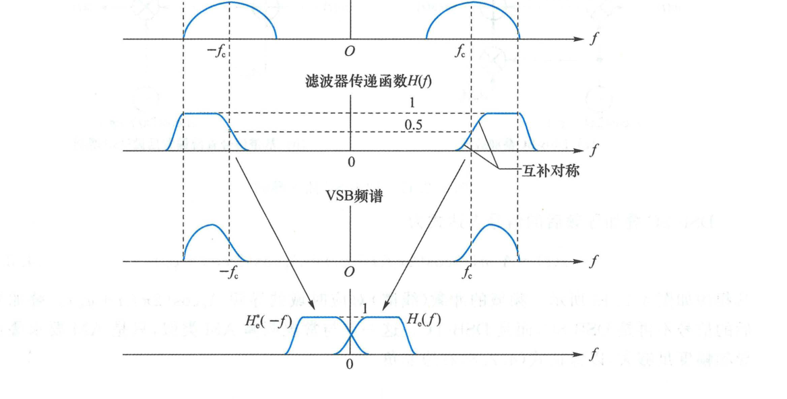

  <figcaption>图 4.2.11 残留边带滤波器特性（原书影印参考）</figcaption>
</figure>

<Knowledge title="残留边带无失真相干解调准则">

为了保证在接收端相干解调后能够无失真复原基带信号，残留边带滤波器的传输特性 $H(f)$ 必须满足关于载频 $f_c$ 互补对称的准则：

$$
H(f - f_c) + H(f + f_c) = \text{常数}, \quad |f| \leqslant W \tag{4.2.18}
$$

即在载频 $f_c$ 处，$|H(f_c)| = 0.5$（半幅度点），滚降曲线关于点 $(f_c, 0.5)$ 呈奇对称。此时相干解调时上、下边带在低频段的重叠部分相加刚好互补为平坦响应。

</Knowledge>

VSB 信号的带宽略大于基带带宽 $W$：

$$
B_{\text{VSB}} = W + \Delta f \tag{4.2.19}
$$

其中 $\Delta f$ 为残留边带的滚降带宽（通常为 $0.15W \sim 0.25W$）。VSB 在频谱利用率与工程实现难度之间取得了完美的折中，是模拟电视广播（NTSC / PAL 制式）图像传输的标准调制方案。

---

## 4.2.4 载波同步

DSB-SC、SSB、VSB 均要求相干解调，接收端必须提供与发送载波同频同相的参考载波。获得同步载波的技术称为**载波同步（Carrier Synchronization）**，主要分为两类：
1. **外同步法（插入导频法）**：发送端额外发送一个离散载频分量；
2. **自同步法（直接提取法）**：从已调信号本身的非线性变换中提取载波（平方环法、科斯塔斯环法）。

### 1. 插入导频法

发送端在 DSB-SC 信号上直接叠加一个幅度为 $A_p$ 的未调载波（导频）：

$$
s(t) = A_c m(t)\cos(2\pi f_c t + \varphi_c) + A_p\cos(2\pi f_c t + \varphi_c) \tag{4.2.28}
$$

如图 4.2.12 和图 4.2.13 所示，其频谱在 $\pm f_c$ 处出现冲激线谱。

<figure class="vp-figure">

  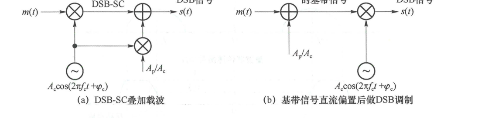

  <figcaption>图 4.2.12 DSB-SC 插入导频（原书影印参考）</figcaption>
</figure>

<figure class="vp-figure">

  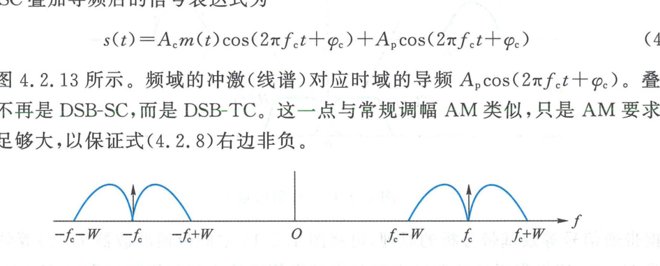

  <figcaption>图 4.2.13 DSB-SC 插入导频后的频谱（原书影印参考）</figcaption>
</figure>

接收端使用**锁相环（Phase-Locked Loop, PLL）**跟踪该导频，其解调框图如图 4.2.14 所示。压控振荡器（VCO）产生本地载波，I/Q 解调器中 Q 路输出能灵敏地反映相位误差 $\theta_e(t)$。当 $\theta_e \neq 0$ 时，误差电压通过环路滤波器控制 VCO 的瞬时频率，构成闭环负反馈，直至 $\theta_e \to 0$，实现锁定。

<figure class="vp-figure">

  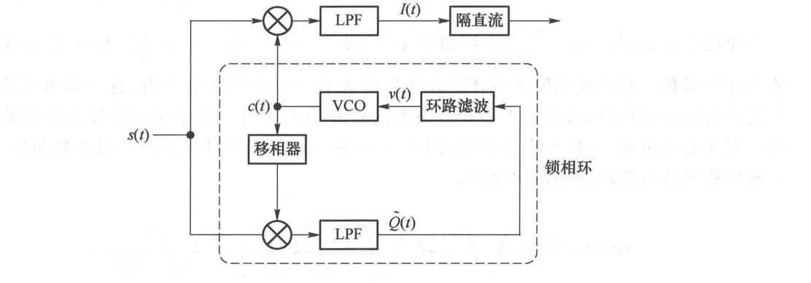

  <figcaption>图 4.2.14 用锁相环实现相干解调（原书影印参考）</figcaption>
</figure>

### 2. 平方环法

若发送端未插入导频（纯 DSB-SC 信号），频谱中不存在离散载频线谱。平方环法利用平方非线性器件产生二倍频线谱，原理如图 4.2.15 所示。

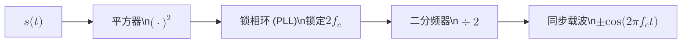

<figure class="vp-figure">

  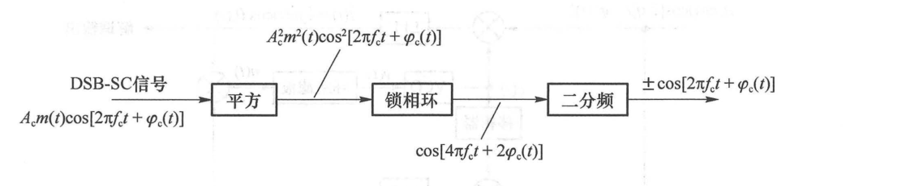

  <figcaption>图 4.2.15 平方环法（原书影印参考）</figcaption>
</figure>

DSB-SC 信号平方后展开为：

$$
s^2(t) = A_c^2 m^2(t)\cos^2[2\pi f_c t + \varphi_c] = \frac{A_c^2 m^2(t)}{2} + \frac{A_c^2 m^2(t)}{2}\cos[4\pi f_c t + 2\varphi_c]
$$

令 $m^2(t) = P_m + \Delta(t)$，其中 $P_m = \mathbb{E}[m^2(t)]$ 为直流常数，则：

$$
s^2(t) = \frac{A_c^2 P_m}{2} + \frac{A_c^2\Delta(t)}{2} + \frac{A_c^2 P_m}{2}\cos[4\pi f_c t + 2\varphi_c] + \frac{A_c^2\Delta(t)}{2}\cos[4\pi f_c t + 2\varphi_c]
$$

上式中包含纯正弦二倍频分量 $\cos[4\pi f_c t + 2\varphi_c]$，利用窄带 PLL 提取该二倍频信号，再经**二分频器**后得到恢复载波：

$$
\pm\cos(2\pi f_c t + \varphi_c)
$$

由于 $\cos(4\pi f_c t + 2\varphi_c) = \cos(4\pi f_c t + 2\varphi_c + 2\pi)$，二分频后其相位可能是 $\varphi_c$ 或 $\varphi_c + \pi$，如图 4.2.16 所示。这一固有现象称为**相位模糊（Phase Ambiguity）**（$180^\circ$ 倒相）。

<figure class="vp-figure">

  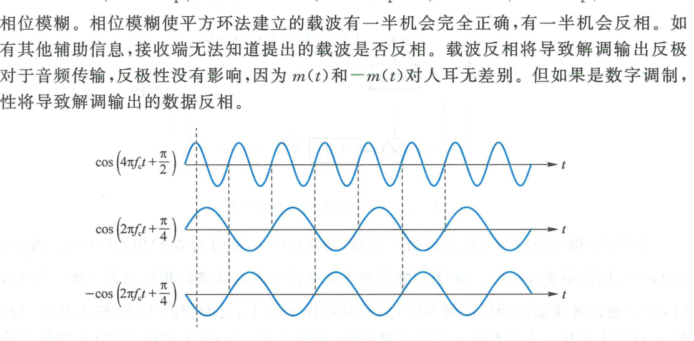

  <figcaption>图 4.2.16 二分频带来的相位模糊（原书影印参考）</figcaption>
</figure>

### 3. 科斯塔斯环法

科斯塔斯环（Costas Loop）避免了高频平方运算，在现代通信系统中应用极其广泛。其结构如图 4.2.17 所示。

```mermaid
flowchart LR
    s["$$s(t)$$"] --> mI(("×"))
    s --> mQ(("×"))
    vco["VCO\n$$2\\cos(2\\pi f_c t + \\varphi)$$"] --> mI
    vco --> ps["移相 $$-90^{\\circ}$$\n$$-2\\sin(2\\pi f_c t + \\varphi)$$"] --> mQ
    mI --> lpfI["LPF"] --> I["$$I(t)$$"]
    mQ --> lpfQ["LPF"] --> Q["$$Q(t)$$"]
    I --> mult(("×"))
    Q --> mult
    mult -->|"误差 $$u(t)$$"| loopFilter["环路滤波器"] --> vco
    I --> out["解调输出 $$\\pm A_c m(t)$$"]
```

<figure class="vp-figure">

  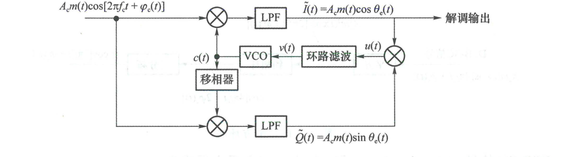

  <figcaption>图 4.2.17 科斯塔斯环法（原书影印参考）</figcaption>
</figure>

当本地载波与发射载波存在相位差 $\theta_e(t) = \varphi_c(t) - \varphi(t)$ 时，I 路与 Q 路的低通输出分别为：

$$
I(t) = A_c m(t)\cos\theta_e(t), \quad Q(t) = A_c m(t)\sin\theta_e(t) \tag{4.2.33}
$$

两路输出相乘得到鉴相误差信号：

$$
u(t) = I(t)Q(t) = \frac{1}{2}A_c^2 m^2(t)\sin[2\theta_e(t)] \tag{4.2.34}
$$

$u(t)$ 经环路滤波器平滑后控制 VCO，形成负反馈，其稳定锁定时 $\theta_e \approx 0$ 或 $\theta_e \approx \pi$。科斯塔斯环具有两大突出优势：
1. **工作频率低**：所有滤波与相乘均在基带进行，电路极易集成与数字化；
2. **解调一体化**：环路锁定的同时，I 路低通输出 $I(t) \approx \pm A_c m(t)$ 就是解调后的基带信号，无需额外配置解调器。
