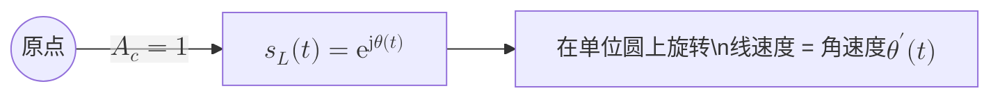
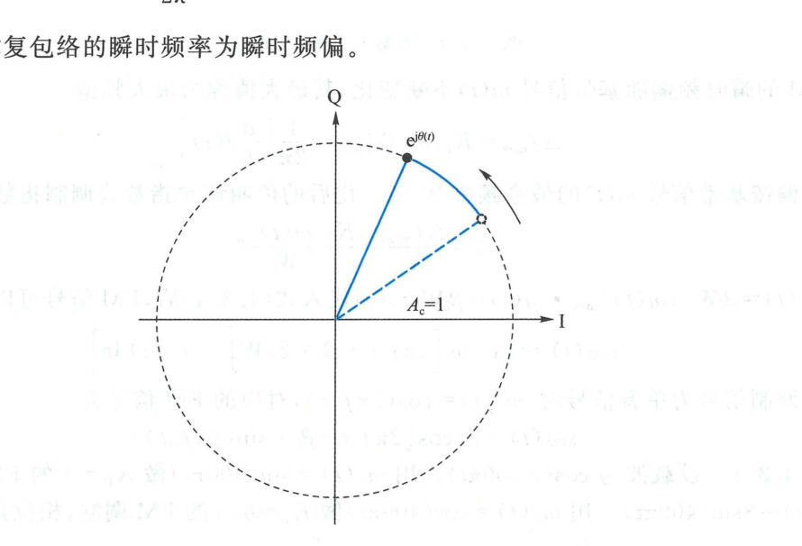
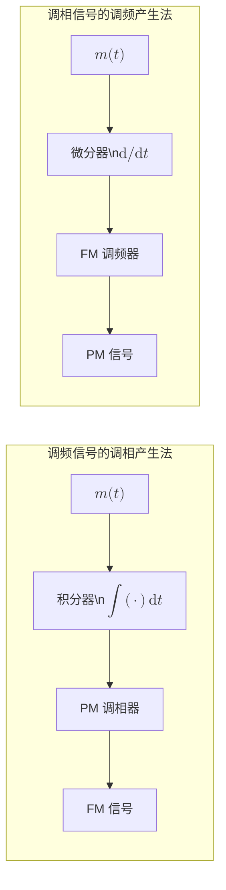
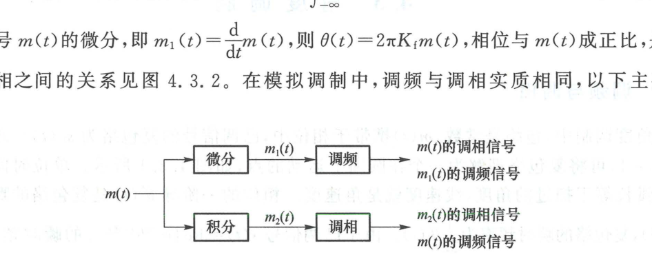
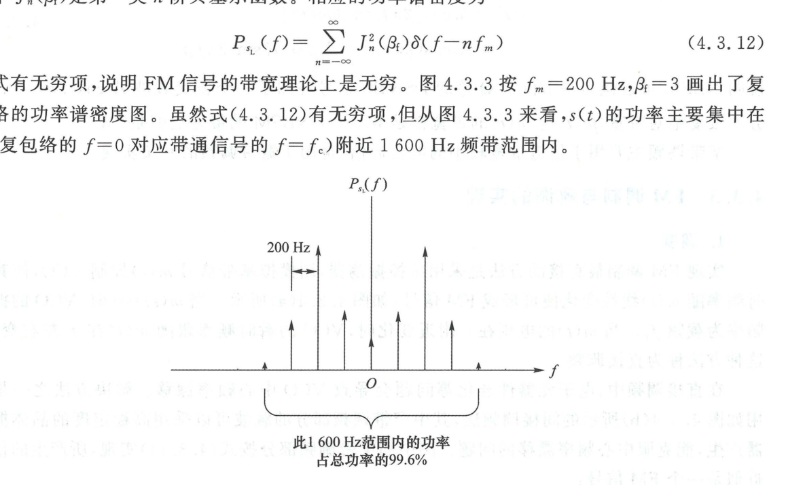
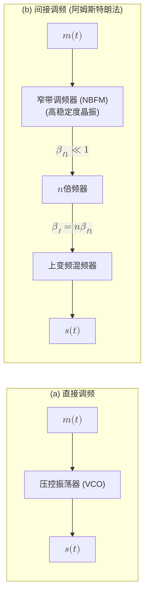
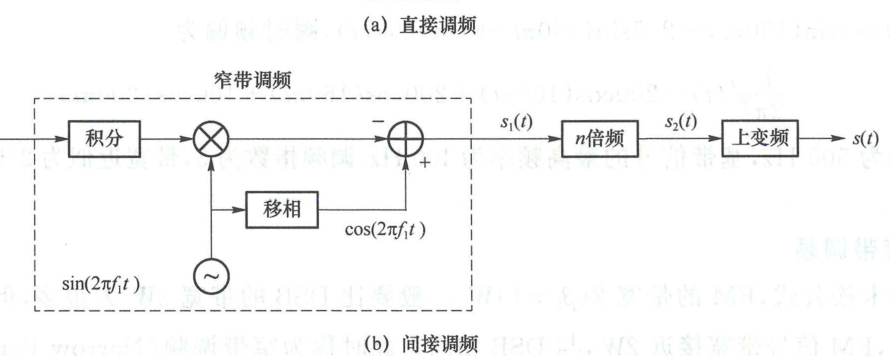
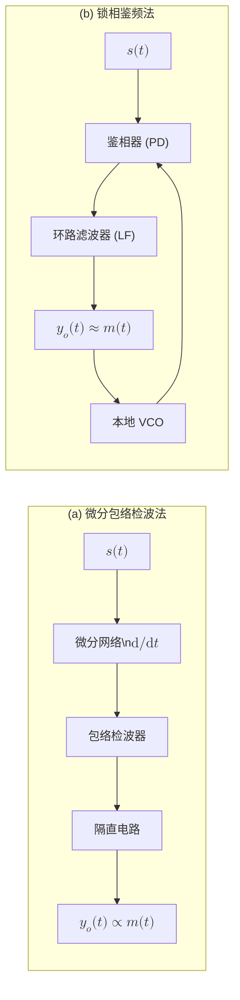
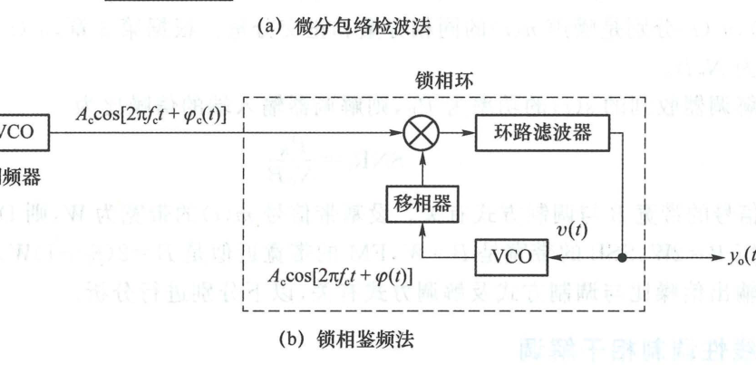
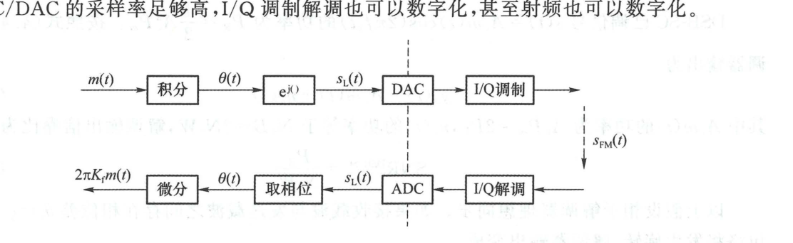

import Knowledge from '@/components/Knowledge.astro';
import Example from '@/components/Example.astro';
import Solution from '@/components/Solution.astro';

在角度调制（Angle Modulation）中，带通信号的包络为常数，基带信息 $m(t)$ 携带在已调载波的瞬时相位或瞬时频率中。因为包络保持恒定，角度调制属于**恒包络调制**，对信道中的非线性失真具有极强的抵抗能力。

---

## 4.3.1 调频与调相

在角度调制中，已调信号的复包络为：

$$
s_L(t) = A_c\mathrm{e}^{\mathrm{j}\theta(t)}
$$

不妨取 $A_c = 1$，可将复包络理解为一个在复平面单位圆上连续旋转运动的点，如图 4.3.1 所示。单位时间内 $s_L(t)$ 扫过的弧长等于旋转角度，线速度就是角速度。相位的一阶导数 $\theta'(t)$ 是复包络的瞬时角速度（瞬时角频率），复包络的瞬时频率为 $\frac{1}{2\pi}\theta'(t)$。

带通信号的时域表达式为：

$$
s(t) = \operatorname{Re}\{s_L(t)\mathrm{e}^{\mathrm{j}2\pi f_c t}\} = A_c\cos[2\pi f_c t + \theta(t)]
$$

其总瞬时相位为 $\Phi(t) = 2\pi f_c t + \theta(t)$，瞬时频率为：

$$
f(t) = \frac{1}{2\pi}\frac{\mathrm{d}\Phi(t)}{\mathrm{d}t} = f_c + \frac{1}{2\pi}\frac{\mathrm{d}\theta(t)}{\mathrm{d}t}
$$

其中 $\Delta f(t) = \frac{1}{2\pi}\theta'(t)$ 称为**瞬时频偏**。

<figure class="vp-figure">

  

  <figcaption>图 4.3.1 单位圆上的运动（原书影印参考）</figcaption>
</figure>

根据基带信号 $m(t)$ 控制角度参量的不同方式，角度调制分为调相与调频：

<Knowledge title="调相（PM）与调频（FM）的基本定义">

1. **调相（Phase Modulation, PM）**：
   瞬时相位偏移 $\theta(t)$ 与基带信号 $m(t)$ 成正比：

   $$
   \theta(t) = K_p m(t) \tag{4.3.1}
   $$

   其中 $K_p$ 称为**调相灵敏度（Phase Sensitivity）**，单位为 $\text{rad/V}$。PM 已调信号表达式为：

   $$
   s_{\text{PM}}(t) = A_c\cos[2\pi f_c t + K_p m(t)] \tag{4.3.3}
   $$

2. **调频（Frequency Modulation, FM）**：
   瞬时频偏与基带信号 $m(t)$ 成正比：

   $$
   \frac{1}{2\pi}\frac{\mathrm{d}\theta(t)}{\mathrm{d}t} = K_f m(t) \tag{4.3.2}
   $$

   其中 $K_f$ 称为**调频灵敏度（Frequency Sensitivity）**，单位为 $\text{Hz/V}$。对上式两端积分，得瞬时相位：

   $$
   \theta(t) = 2\pi K_f \int_{-\infty}^t m(\tau)\,\mathrm{d}\tau
   $$

   FM 已调信号表达式为：

   $$
   s_{\text{FM}}(t) = A_c\cos\left[2\pi f_c t + 2\pi K_f \int_{-\infty}^t m(\tau)\,\mathrm{d}\tau\right] \tag{4.3.4}
   $$

</Knowledge>

从式 (4.3.3) 和式 (4.3.4) 可以看出 PM 与 FM 之间的密切对应关系，如图 4.3.2 所示：
- 若将基带信号 $m(t)$ 先经过**积分器**，再送入调相器，输出即为调频信号；
- 若将基带信号 $m(t)$ 先经过**微分器**，再送入调频器，输出即为调相信号。

<figure class="vp-figure">

  

  <figcaption>图 4.3.2 调频与调相之间的关系（原书影印参考）</figcaption>
</figure>

---

## 4.3.2 FM 信号的频谱与带宽

### 1. 单音调频信号与贝塞尔展开

设基带调制信号为单音频正弦信号 $m(t) = A_m\cos(2\pi f_m t)$，代入 FM 表达式可得：

$$
\theta(t) = 2\pi K_f \int_0^t A_m\cos(2\pi f_m\tau)\,\mathrm{d}\tau = \frac{K_f A_m}{f_m}\sin(2\pi f_m t)
$$

定义**最大频偏（Maximum Frequency Deviation）** $\Delta f_{\max}$ 和**调频指数（Modulation Index）** $\beta_f$：

$$
\Delta f_{\max} = K_f A_m, \quad \beta_f = \frac{\Delta f_{\max}}{f_m} \tag{4.3.10}
$$

则单音调频信号的复包络（设 $A_c = 1$）为：

$$
s_L(t) = \mathrm{e}^{\mathrm{j}\beta_f\sin(2\pi f_m t)}
$$

由于 $s_L(t)$ 是以 $T_m = 1/f_m$ 为周期的复周期信号，可展开为复指数傅里叶级数：

$$
s_L(t) = \sum_{n=-\infty}^\infty \mathrm{J}_n(\beta_f)\mathrm{e}^{\mathrm{j}2\pi n f_m t} \tag{4.3.11}
$$

其中 $\mathrm{J}_n(\beta_f)$ 为第一类 $n$ 阶贝塞尔函数（Bessel Function of the First Kind）。相应的功率谱密度为：

$$
P_{s_L}(f) = \sum_{n=-\infty}^\infty \mathrm{J}_n^2(\beta_f)\delta(f - n f_m) \tag{4.3.12}
$$

式 (4.3.12) 表明，单音调频信号由载频 $f_c$ 以及对称分布在两边无穷多对间隔为 $f_m$ 的离散边频分量构成。因此，**FM 信号的理论频谱带宽是无穷大**。

图 4.3.3 给出了 $f_m = 200\text{ Hz}, \beta_f = 3$ 时的功率谱密度图。从图中可以看到，尽管数学上有无穷项，但当 $|n| > \beta_f + 1$ 时，贝塞尔函数 $\mathrm{J}_n(\beta_f)$ 的幅值迅速衰减。在 $1\,600\text{ Hz}$ 频带范围内集中的功率已占总功率的 99.6% 以上。

<figure class="vp-figure">

  

  <figcaption>图 4.3.3 单音调频信号复包络的功率谱密度示例（原书影印参考）</figcaption>
</figure>

### 2. 卡松公式（Carson's Rule）

对于任意多频或连续模拟基带信号 $m(t)$，研究表明其大部分能量集中在载频附近的一定范围内，有效传输带宽可由工程著名的**卡松公式（Carson's Rule）**估计：

<Knowledge title="FM 信号带宽的卡松公式（Carson's Rule）">

$$
B \approx 2(\beta_f + 1)W = 2(\Delta f_{\max} + W) \tag{4.3.13}
$$

其中：
- $W$ 是模拟基带信号的最高截止频率；
- $\Delta f_{\max} = K_f \max|m(t)|$ 是最大瞬时频偏；
- $\beta_f = \frac{\Delta f_{\max}}{W}$ 是调频指数。

</Knowledge>

<Example id="4.3.1" title="复合多音 FM 信号的频偏与卡松带宽估计">
已知某 FM 信号为：

$$
s(t) = \cos[2\pi f_c t + 4\sin(100\pi t) + 2.5\sin(160\pi t) + \sin(200\pi t)]
$$

试求：(1) 瞬时频偏表达式与最大频偏；(2) 基带信号的最高频率与调频指数；(3) 卡松带宽。
</Example>

<Solution title="解">
(1) 瞬时相位偏移为：

$$
\theta(t) = 4\sin(100\pi t) + 2.5\sin(160\pi t) + \sin(200\pi t)
$$

瞬时频偏为相位的微分除以 $2\pi$：

$$
\Delta f(t) = \frac{1}{2\pi}\theta'(t) = 200\cos(100\pi t) + 200\cos(160\pi t) + 100\cos(200\pi t)\text{ (Hz)}
$$

因此最大瞬时频偏为各余弦幅度之和：

$$
\Delta f_{\max} = 200 + 200 + 100 = 500\text{ Hz}
$$

(2) 相位中所含最高角频率为 $200\pi\text{ rad/s}$，对应的基带信号最高频率为：

$$
W = \frac{200\pi}{2\pi} = 100\text{ Hz}
$$

调频指数为：

$$
\beta_f = \frac{\Delta f_{\max}}{W} = \frac{500}{100} = 5
$$

(3) 由卡松公式计算有效带宽：

$$
B \approx 2(\beta_f + 1)W = 2 \times (5 + 1) \times 100 = 1\,200\text{ Hz}
$$
</Solution>

### 3. 窄带调频（NBFM）

当调频指数 $\beta_f \ll 1$ 时，瞬时相位偏移量非常微弱（$|\theta(t)| \ll 1$），称为**窄带调频（Narrowband Frequency Modulation, NBFM）**。

此时复包络可作一阶泰勒近似展开：

$$
s_L(t) = A_c\mathrm{e}^{\mathrm{j}\theta(t)} = A_c[\cos\theta(t) + \mathrm{j}\sin\theta(t)] \approx A_c[1 + \mathrm{j}\theta(t)]
$$

相应的已调实信号为：

$$
s(t) = \operatorname{Re}\{s_L(t)\mathrm{e}^{\mathrm{j}2\pi f_c t}\} \approx A_c\cos(2\pi f_c t) - A_c\theta(t)\sin(2\pi f_c t) \tag{4.3.14}
$$

其中 $\theta(t) = 2\pi K_f \int_{-\infty}^t m(\tau)\,\mathrm{d}\tau$。上式表明：**窄带调频信号可近似分解为正交载波与一个 Q 路 DSB-SC 信号的线性叠加**。其带宽与 DSB 相同：

$$
B_{\text{NBFM}} \approx 2W
$$

---

## 4.3.3 FM 调制与解调的实现

### 1. FM 调制

- **直接调频法**：
  直接使用压控振荡器（VCO），让基带信号 $m(t)$ 直接控制振荡器回路的变容二极管电容，使振荡瞬时频率随 $m(t)$ 线性改变（图 4.3.4(a)）。优点是频偏大、电路简单；缺点是中心频率易受温度和器件老化影响而产生漂移。
- **间接调频法（阿姆斯特朗法）**：
  先利用高稳定度的石英晶体振荡器生成晶振载波，按式 (4.3.14) 产生微弱的窄带调频信号（$\beta_{f1} \ll 1$），然后通过多级**倍频器（Frequency Multiplier）**将载频与调频指数同时放大 $n$ 倍（图 4.3.4(b)）：

$$
f_c' = n f_c, \quad \beta_f' = n\beta_f
$$

最后通过混频器（超外差上变频）搬移到最终发射频段。

<figure class="vp-figure">

  

  <figcaption>图 4.3.4 FM 调制（原书影印参考）</figcaption>
</figure>

### 2. FM 解调（鉴频器）

FM 解调器称为**鉴频器（Frequency Discriminator）**，典型实现方法包括：

- **微分包络检波法**：
  先通过微分网络将瞬时频率变化转换为包络振幅变化，再用包络检波器检测出基带信号（图 4.3.5(a)）。将式 (4.3.4) 送入理想微分器：

$$
v(t) = \frac{\mathrm{d}s_{\text{FM}}(t)}{\mathrm{d}t} = -A_c[2\pi f_c + 2\pi K_f m(t)]\sin\left[2\pi f_c t + 2\pi K_f\int m(\tau)\,\mathrm{d}\tau\right] \tag{4.3.17}
$$

其包络为 $A_c 2\pi[f_c + K_f m(t)]$。经包络检波并隔去直流分量后，直接输出正比于 $m(t)$ 的解调信号。

- **锁相鉴频法**：
  利用锁相环（PLL）跟踪 FM 信号的瞬时频率变化（图 4.3.5(b)）。环路锁定时，VCO 的控制电压 $v(t)$ 必须实时跟踪输入信号的频偏，因此 VCO 的控制电压直接就是解调后的基带输出：

$$
y_o(t) = v(t) \propto m(t) \tag{4.3.18}
$$

锁相鉴频具有极优良的门限扩展性能，能显著抑制低信噪比下的脉冲噪声。

<figure class="vp-figure">

  

  <figcaption>图 4.3.5 FM 解调（原书影印参考）</figcaption>
</figure>

### 3. 数字化实现

现代无线电全面采用数字信号处理（DSP）与软件无线电架构。如图 4.3.6 所示，基带信号 $m(t)$ 经 ADC 采样后，直接由数字处理器实时计算复包络样值 $s_L[n] = A_c\mathrm{e}^{\mathrm{j}\theta[n]}$，通过数字 I/Q 调制送入 DAC 产生模拟射频输出；接收端则经高速 ADC 数字正交下变频后，在数字域直接通过反正切相位求导算法提取 $m(t)$。

<figure class="vp-figure">

  

  <figcaption>图 4.3.6 FM 调制解调的数字化实现（原书影印参考）</figcaption>
</figure>
